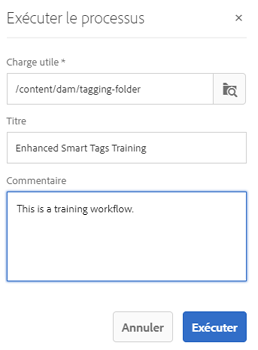

# Balises intelligentes améliorées {#enhanced-smart-tags}

## Présentation des balises intelligentes améliorées {#overview-of-enhanced-smart-tags}

Les entreprises qui traitent les ressources numériques utilisent de plus en plus le vocabulaire contrôlé par taxonomie dans les métadonnées des ressources. Il comprend essentiellement une liste des mots-clés que les employés, les partenaires et les clients utilisent fréquemment pour mentionner et rechercher des ressources numériques d’une classe particulière. Le balisage des ressources avec vocabulaire contrôlé par taxonomie permet de s’assurer que les ressources peuvent être facilement identifiées et récupérées par des recherches reposant sur les balises.

Comparé aux vocabulaires des langages naturels, le balisage des ressources numériques basé sur la taxonomie métier aide à les aligner avec les activités d’une entreprise et à assurer que les ressources les mieux adaptées apparaissent dans les recherches.

Par exemple, un constructeur de voitures peut baliser les images de voitures avec les noms de modèles afin d’afficher uniquement les images appropriées lors de recherches d’images de différents modèles pour concevoir une campagne de promotion.

Pour que le service de contenu dynamique applique les balises adéquates, vous devez l’entraîner à reconnaître votre taxonomie. Pour entraîner le service, regroupez tout d’abord un ensemble de ressources et de balises qui décrivent le mieux ces ressources. Appliquez ces balises sur les ressources et exécutez un workflow d’entraînement pour aider le service à apprendre.

Une fois une balise entraînée et prête, le service peut appliquer ces balises sur les ressources par un workflow de balisage.

En arrière-plan, le service de contenu dynamique utilise la structure d’intelligence artificielle d’Adobe Sensei pour entraîner son algorithme de reconnaissance d’image sur votre structure de balises et votre taxonomie métier. Cette intelligence de contenu est ensuite utilisée pour appliquer les balises pertinentes sur un ensemble de ressources différentes.

Le service de contenu dynamique est un service cloud hébergé sur Adobe I/O. Pour l’utiliser dans Adobe Experience Manager (AEM), l’administrateur système doit intégrer votre instance AEM à Adobe I/O.

En résumé, voici les principales étapes pour utiliser le service de contenu dynamique :

* Intégration
* Passage en revue des ressources et des balises (définition de la taxonomie)
* Entraînement du service de contenu dynamique
* Balisage automatique

## Conditions préalables {#prerequisites}

Avant de pouvoir utiliser le service de contenu dynamique, assurez-vous de respecter les conditions suivantes pour créer une intégration sur Adobe I/O :

* L’organisation doit disposer d’un compte Adobe ID pourvu de droits d’administrateur.
* Le service de contenu dynamique est activé pour votre organisation.

## Intégration {#onboarding}

Smart Content Service est disponible à l’achat en tant que module complémentaire d’AEM. Une fois l’achat effectué, un courrier électronique est envoyé à l’administrateur de votre organisation avec un lien vers les E/S Adobe.

L’administrateur peut suivre le lien pour intégrer le service de contenu dynamique à AEM. Pour intégrer le service à AEM Assets, voir [Configuration des balises intelligentes](config-smart-tagging.md).

Le processus d’intégration est terminé lorsque l’administrateur configure le service et ajoute des utilisateurs dans AEM.

>[!NOTE]
>
>Si vous utilisez AEM 6.3 ou une version antérieure et avez besoin du service de balisage pour vos ressources, reportez-vous à la page Balises [intelligentes](https://helpx.adobe.com/experience-manager/6-3/assets/using/touch-ui-smart-tags.html). Les balises actives n’utilisent pas les dernières fonctionnalités d’IA et sont donc moins précises que le service de balisage intelligent amélioré.

## Vérification des ressources et des balises {#reviewing-assets-and-tags}

Après intégration, commencez par identifier un ensemble de balises qui décrit le mieux ces images dans le contexte de votre entreprise.

Ensuite, passez en revue les images de façon à identifier une série d’images qui représentent le mieux votre produit pour un besoin particulier de votre entreprise. Vérifiez que les ressources figurant dans la série sélectionnée sont conformes aux [instructions d’entraînement du service de contenu dynamique](smart-tags-training-guidelines.md).

Ajoutez les ressources à un dossier, puis appliquez les balises à chaque ressource sur la page de propriétés. Exécutez ensuite le workflow d’entraînement sur ce dossier. La série de ressources sélectionnée permet au service de contenu dynamique d’entraîner efficacement plus de ressources avec vos définitions de taxonomie.

>[!NOTE]
>
>1. L’entraînement est un processus irrévocable. Adobe recommande de bien passer en revue les balises dans la série de ressources sélectionnée bien avant d’entraîner le service de contenu dynamique sur les balises.
>1. Please do read [Smart Content Service training guidelines](smart-tags-training-guidelines.md) before starting training for any tag.
>1. Lorsque vous entraînez le service de contenu dynamique pour la première fois, Adobe recommande de réaliser l’entraînement sur au moins deux balises distinctes.

## Formation de Smart Content Service {#training-the-smart-content-service}

Pour que le service de contenu dynamique reconnaisse votre taxonomie métier, exécutez-la sur une série de ressources qui incluent déjà des balises correspondant à votre entreprise. Après l’entraînement, le service peut appliquer la même taxonomie sur un ensemble de ressources similaire.

Vous pouvez entraîner plusieurs fois le service afin d’améliorer sa capacité à appliquer les balises appropriées. Après chaque cycle d’entraînement, exécutez un workflow de balisage et vérifiez que vos ressources sont correctement balisées.

Vous pouvez entraîner le service de contenu dynamique périodiquement ou en fonction des besoins.

>[!NOTE]
>
>Le workflow d’entraînement s’exécute sur les dossiers uniquement.

### Entraînement périodique {#periodic-training}

Vous pouvez activer le service de contenu dynamique afin qu’il s’entraîne périodiquement sur les ressources et les balises associées au sein d’un dossier. Open the properties page of your asset folder, select **[!UICONTROL Enable Smart Tags]** under the **[!UICONTROL Details]** tab, and save the changes.

Lorsque cette option est sélectionnée pour un dossier, AEM exécute automatiquement un workflow d’entraînement afin d’entraîner le service de contenu dynamique sur les ressources du dossier et leurs balises. Par défaut, le workflow d’entraînement s’exécute sur une base hebdomadaire à 0 h 30 le samedi.

### Entraînement à la demande {#on-demand-training}

Vous pouvez entraîner le service de contenu dynamique chaque fois que cela est nécessaire à partir de la console Processus.

1. Appuyez/cliquez sur le logo AEM et accédez à **[!UICONTROL Outils > Processus > Modèles]**.
1. Sur la page **[!UICONTROL Modèles de processus]**, sélectionnez le workflow **[!UICONTROL Entraînement des balises intelligentes]**, puis appuyez/cliquez sur **[!UICONTROL Démarrer le processus]** dans la barre d’outils.
1. Dans la boîte de dialogue **[!UICONTROL Exécuter le processus]**, localisez le dossier de charge utile qui comprend les ressources balisées pour entraîner le service.
1. Indiquez le titre du workflow et ajoutez un commentaire. Ensuite, appuyez/cliquez sur **[!UICONTROL Exécuter]**. Les ressources et les balises sont soumises à l’entraînement.

   

>[!NOTE]
>
>Une fois que les ressources d’un dossier sont traitées pour la formation, seules les ressources modifiées sont traitées lors des cycles de formation suivants.

### Affichage des rapports de formation {#viewing-training-reports}

Pour vérifier que le service de contenu dynamique est entraîné sur vos balises dans la série de ressources d’entraînement, examinez le rapport de workflow d’entraînement dans la console Rapports.

1. Tap/click the AEM logo, and go to **[!UICONTROL Tools > Assets > Reports]**.
1. Sur la page **[!UICONTROL Rapports de ressources]**, appuyez/cliquez sur **[!UICONTROL Créer]**.
1. Select the **[!UICONTROL Smart Tags Training]** report, and then tap/click **[!UICONTROL Next]** from the toolbar.
1. Spécifiez un titre et une description pour le rapport. Sous **[!UICONTROL Planifier un rapport]**, laissez l’option **[!UICONTROL Maintenant]** sélectionnée. Si vous souhaitez planifier le rapport à une date ultérieure, sélectionnez **[!UICONTROL Plus tard]** et spécifiez une date et une heure. Ensuite, appuyez/cliquez sur **[!UICONTROL Créer]** dans la barre d’outils.
1. Sur la page **[!UICONTROL Rapports de ressources]**, sélectionnez le rapport que vous avez généré. To view the report, tap **[!UICONTROL View]** from the toolbar.
1. Passez en revue les détails du rapport.

   Le rapport indique l’état de l’entraînement pour les balises que vous avez entraînées. The green color in the **[!UICONTROL Training Status]** column indicates that the Smart Content Service is trained for the tag. La couleur jaune indique que le service n’est pas entièrement entraîné pour une balise particulière. Dans ce cas, ajoutez davantage d’images avec la balise en question et exécutez le workflow d’entraînement pour entraîner complètement le service sur la balise.

   Si vous ne voyez pas vos balises dans ce rapport, lancez à nouveau le workflow d’entraînement pour ces balises.

1. To download the report, select it from the list, and tap **[!UICONTROL Download]** from the toolbar. Le rapport est téléchargé sous la forme d’un fichier Excel.

## Baliser automatiquement les fichiers {#tagging-assets-automatically}

Après avoir entraîné le service de contenu dynamique, vous pouvez déclencher le workflow de balisage pour appliquer automatiquement les balises appropriées sur une autre série de ressources similaire.

Vous pouvez exécuter le workflow de balisage périodiquement ou au besoin.

>[!NOTE]
>
>Le workflow de balisage s’exécute sur les ressources et les dossiers.

### Balisage périodique {#periodic-tagging}

Vous pouvez activer le service de contenu dynamique de façon à ce qu’il balise périodiquement les ressources au sein d’un dossier. Open the properties page of your asset folder, select **[!UICONTROL Enable Smart Tags]** under the **[!UICONTROL Details]** tab, and save the changes.

Une fois cette option sélectionnée pour un dossier, Smart Content Service balise automatiquement les fichiers qu’il contient. Par défaut, le processus de balisage s’exécute tous les jours à 12h00.

### Balisage à la demande {#on-demand-tagging}

Vous pouvez déclencher le workflow de balisage à partir des emplacements suivants pour baliser instantanément vos ressources :

* Console de processus
* Chronologie

>[!NOTE]
>
>Si vous exécutez le workflow de balisage à partir de la chronologie, vous pouvez appliquer des balises sur un maximum de 15 ressources à la fois.

#### Tag assets from the workflow console {#tagging-assets-from-the-workflow-console}

1. Appuyez/cliquez sur le logo AEM et accédez à **[!UICONTROL Outils > Processus > Modèles]**.
1. From the **[!UICONTROL Workflow Models]** page, select the **[!UICONTROL DAM Smart Tags Assets]** workflow and then tap/click **[!UICONTROL Start Workflow]** from the toolbar.

   

1. In the **[!UICONTROL Run Workflow]** dialog, browse to the payload folder containing assets on which you want to apply your tags automatically.
1. Indiquez un titre pour le workflow et un commentaire facultatif. Ensuite, appuyez/cliquez sur **[!UICONTROL Exécuter]**.

   

   Accédez au dossier de ressources et passez en revue les balises pour vérifier que le service de contenu dynamique a correctement balisé vos ressources. Pour plus d’informations, voir [Gestion des balises intelligentes](managing-smart-tags.md).

#### Tag assets from the timeline {#tagging-assets-from-the-timeline}

1. Depuis l’interface utilisateur Assets, sélectionnez le dossier contenant les ressources ou des ressources spécifiques auxquelles vous souhaitez appliquer des balises intelligentes.
1. Appuyez sur le logo Experience Manager et ouvrez la chronologie.
1. Tap the arrow at the bottom, and then tap/click **[!UICONTROL Start Workflow]**.

   

1. Sélectionnez le workflow **[!UICONTROL Balisage intelligent des ressources (gestion des actifs numériques)]** et spécifiez un titre pour le workflow.
1. Appuyez/cliquez sur **[!UICONTROL Démarrer]**. Le workflow applique vos balises sur les ressources. Accédez au dossier de ressources et passez en revue les balises pour vérifier que le service de contenu dynamique a correctement balisé vos ressources. Pour plus d’informations, voir [Gestion des balises intelligentes](managing-smart-tags.md).

>[!NOTE]
>
>Dans les cycles de balisage suivants, seules les ressources modifiées sont balisées à nouveau avec les balises qui viennent d’être entraînées.
>
>Cependant, même les fichiers non modifiés sont balisés si l’écart entre le dernier cycle de balisage et le cycle de balisage actuel pour le flux de travail de balisage dépasse 24 heures.
>
>Pour les workflows de balisage périodiques, les ressources non modifiées sont balisées lorsque l’intervalle dépasse 6 mois.
