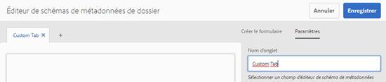
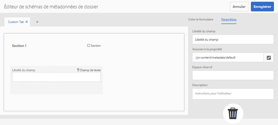
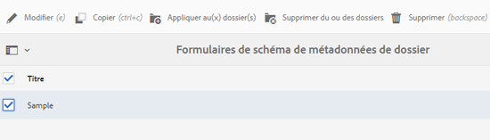
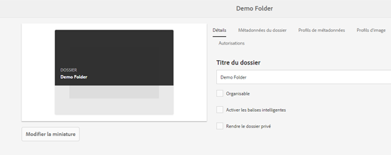

# Schéma de métadonnées de dossier {#folder-metadata-schema}

Les ressources d’Adobe Experience Manager vous permettent de créer des schémas de métadonnées pour les dossiers de ressources, qui définissent la mise en page et les métadonnées affichées dans les pages de propriétés des dossiers.

## Ajout d’un formulaire de schéma de métadonnées de dossier  {#add-a-folder-metadata-schema-form}

Utilisez l’éditeur Formulaires de schéma de métadonnées de dossier pour créer et modifier des schémas de métadonnées pour les dossiers.

1. Dans l’interface de Experience Manager, accédez à **[!UICONTROL Outils]** > **[!UICONTROL Ressources]** > Schémas **[!UICONTROL de métadonnées]** de dossier.
1. On the [!UICONTROL Folder Metadata Schema Forms] page, click **[!UICONTROL Create]**.
1. Specify a name for the form, and click **[!UICONTROL Create]**. The new schema form is listed in the [!UICONTROL Schema Forms] page.

## Modification des formulaires de schéma de métadonnées de dossier  {#edit-folder-metadata-schema-forms}

Vous pouvez modifier un formulaire de schéma de métadonnées nouveau ou existant comprenant les éléments suivants :

* Onglets
* Éléments de formulaire dans des onglets

Vous pouvez associer ou configurer ces éléments de formulaire dans un champ au sein d’un nœud de métadonnées dans le référentiel CRX. Vous pouvez ajouter de nouveaux onglets ou éléments de formulaire au formulaire de schéma de métadonnées.

1. In the Schema Forms page, select the form you created, and then select the **[!UICONTROL Edit]** option from the toolbar.
1. In the Folder Metadata Schema Editor page, click `+` to add a tab to the form. To rename the tab, click the default name and specify the new name under **[!UICONTROL Settings]**.

   

   Pour ajouter d’autres onglets, cliquez sur `+`. Cliquez `X` sur un onglet pour le supprimer.

1. Dans l’onglet actif, ajoutez un ou plusieurs composants de l’onglet **[!UICONTROL Créer le formulaire]**.

   

   Si vous créez plusieurs onglets, cliquez sur un onglet particulier pour ajouter des composants.

1. Pour configurer un composant, sélectionnez-le et modifiez ses propriétés dans l’onglet **[!UICONTROL Paramètres]**.

   Si nécessaire, supprimez un composant de l’onglet **[!UICONTROL Paramètres]**.

   

1. Click **[!UICONTROL Save]** from the toolbar to save the changes.

### Composants de création de formulaires  {#components-to-build-forms}

L’onglet **[!UICONTROL Créer le formulaire]** répertorie les éléments de formulaire que vous utilisez dans votre formulaire de schéma de métadonnées de dossier. L’onglet **[!UICONTROL Paramètres]** contient les attributs de chaque élément sélectionné dans l’onglet **[!UICONTROL Créer le formulaire]**. Voici la liste des éléments de formulaire disponibles dans l’onglet **[!UICONTROL Créer le formulaire]** :

| Nom du composant | Description |
|---|---|
| [!UICONTROL En-tête de section] | Permet d’ajouter un en-tête de section pour une liste de composants communs. |
| [!UICONTROL Une seule ligne de texte] | Permet d’ajouter une propriété de texte d’une seule ligne. Elle est stockée sous la forme d’une chaîne. |
| [!UICONTROL Texte à plusieurs valeurs] | Permet d’ajouter une propriété de texte à plusieurs valeurs. Il est stocké sous forme de tableau de chaînes. |
| [!UICONTROL Nombre] | Permet d’ajouter un composant de nombre. |
| [!UICONTROL Date] | Permet d’ajouter un composant de date. |
| [!UICONTROL Liste déroulante] | Permet d’ajouter une liste déroulante. |
| [!UICONTROL Balises standard] | Permet d’ajouter une balise. |
| [!UICONTROL Champ masqué] | Permet d’ajouter un champ masqué. Il est envoyé en tant que paramètre POST lorsque la ressource est enregistrée. |

### Modification d’éléments de formulaire {#editing-form-items}

To edit the properties of form items, click the component and edit all or a subset of the following properties in the **[!UICONTROL Settings]** tab.

**[!UICONTROL Libellé du champ]** : nom de la propriété de métadonnées qui s’affiche sur la page des propriétés du dossier.

**[!UICONTROL Associer à la propriété]** : cette propriété spécifie le chemin d’accès relatif au nœud de dossier dans le référentiel CRX où il est enregistré. Elle commence par « **./** », ce qui indique que le chemin est situé sous le nœud du dossier.

Les valeurs admises pour cette propriété sont les suivantes :

* `./jcr:content/metadata/dc:title` : stocke la valeur dans le nœud de métadonnées du dossier en tant que propriété `dc:title`.

* `./jcr:created` : affiche la propriété JCR au niveau du nœud du dossier. Si vous configurez ces propriétés dans CRXDE, Adobe recommande de les marquer avec l’état Désactiver la modification, car elles sont protégées. Dans le cas contraire, l’erreur « `Asset(s) failed to modify` » se produit lorsque vous enregistrez les propriétés de la ressource.

Pour vous assurer que le composant est affiché correctement dans le formulaire de schéma de métadonnées, n’insérez pas d’espace dans le chemin de propriété.

**[!UICONTROL Chemin JSON]** : utilisez cette propriété pour indiquer le chemin d’accès au fichier JSON où vous spécifiez des paires clé/valeur pour les options.

**[!UICONTROL Espace réservé]** : utilisez cette propriété pour spécifier du texte dans l’espace réservé concernant la propriété de métadonnées.

**[!UICONTROL Choix]** : utilisez cette propriété pour spécifier des choix dans une liste.

**[!UICONTROL Description]** : utilisez cette propriété pour ajouter une brève description pour le composant de métadonnées.

**[!UICONTROL Classe]** : classe d’objets à laquelle la propriété est associée.

## Suppression de formulaires de schéma de métadonnées de dossier  {#delete-folder-metadata-schema-forms}

Vous pouvez supprimer des formulaires de schéma de métadonnées de dossier sur la page Formulaires de schéma de métadonnées de dossier. Pour supprimer un formulaire, sélectionnez-le et cliquez sur l’option Supprimer de la barre d’outils.

## Affectation d’un schéma de métadonnées de dossier {#assign-a-folder-metadata-schema}

Vous pouvez affecter un schéma de métadonnées de dossier à un dossier à partir de la page Formulaires de schéma de métadonnées de dossier ou lors de la création d’un dossier.

Si vous configurez un schéma de métadonnées pour un dossier, le chemin d’accès au formulaire est stocké dans la propriété `folderMetadataSchema` du nœud de dossier sous .*/jcr:content*.

### Affectation d’un schéma à partir de la page Schéma de métadonnées de dossier  {#assign-to-a-schema-from-the-folder-metadata-schema-page}

1. Dans l’interface de Experience Manager, accédez à **[!UICONTROL Outils]** > **[!UICONTROL Ressources]** > Schémas **[!UICONTROL de métadonnées]** de dossier.
1. Sur la page Formulaires de schéma de métadonnées de dossier, sélectionnez le formulaire à appliquer à un dossier.
1. From the toolbar, click **[!UICONTROL Apply to Folder(s)]**.

1. Select the folder on which to apply the schema and then click **[!UICONTROL Apply]**. Si un schéma de métadonnées est déjà appliqué au dossier, un message d’avertissement vous informe que vous êtes sur le point de remplacer le schéma existant. Cliquez sur **[!UICONTROL Remplacer]**.
1. Ouvrez les propriétés des métadonnées pour le dossier auquel vous avez appliqué le schéma de métadonnées.

   

   To view the folder metadata fields, click the **[!UICONTROL Folder Metadata]** tab.

   

### Affectation d’un schéma lors de la création d’un dossier {#assign-a-schema-when-creating-a-folder}

Vous pouvez affecter un schéma de métadonnées de dossier lors de la création d’un dossier. S’il existe au moins un schéma de métadonnées de dossier dans le système, une liste supplémentaire s’affiche dans la boîte de dialogue **[!UICONTROL Créer un dossier]**. Vous pouvez sélectionner le schéma de votre choix. Par défaut, aucun schéma n’est sélectionné.

1. From the [!DNL Experience Manager Assets] user interface, click **[!UICONTROL Create]** from the toolbar.
1. Attribuez un titre et un nom au dossier.
1. Dans la liste Schéma de métadonnées de dossier, sélectionnez le schéma de votre choix. Then, click **[!UICONTROL Create]**.

   

1. Ouvrez les propriétés des métadonnées pour le dossier auquel vous avez appliqué le schéma de métadonnées.
1. To view the folder metadata fields, click the **[!UICONTROL Folder Metadata]** tab.

## Utilisation du schéma de métadonnées de dossier {#use-the-folder-metadata-schema}

Ouvrez les propriétés d’un dossier configuré avec un schéma de métadonnées de dossier. A **[!UICONTROL Folder Metadata]** tab is displayed in the folder [!UICONTROL Properties] page. Pour afficher le formulaire de schéma de métadonnées de dossier, sélectionnez cet onglet.

Enter metadata values in the various fields and click **[!UICONTROL Save]** to store the values. Les valeurs renseignées sont stockées dans le nœud de dossier du référentiel CRX.

