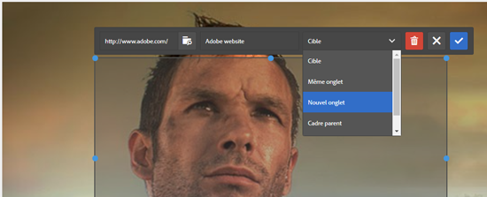

# Ajouter des zones cliquables {#adding-image-maps}

Les zones cliquables permettent d’ajouter des zones de lien hypertexte qui fonctionnent comme des liens hypertexte.

1. Utilisez l’une des méthodes suivantes pour ouvrir **[!UICONTROL l’éditeur d’images statique]** :

   * A l’aide des actions rapides, cliquez sur **[!UICONTROL Modifier]** qui s’affiche sur une ressource dans la vue **[!UICONTROL Carte]**. Dans la vue de Liste, sélectionnez la ressource et cliquez sur **[!UICONTROL Modifier]** option dans la barre d’outils.

      >[!NOTE]
      >
      >Les actions rapides ne sont pas disponibles dans la vue **[!UICONTROL Liste]**.

   * Dans la vue **[!UICONTROL Carte]** ou **[!UICONTROL Liste]**, sélectionnez la ressource et cliquez sur **[!UICONTROL Modifier]** dans la barre d’outils.
   * Cliquez sur **[!UICONTROL Modifier]** dans la page de ressources.

      

1. Pour insérer une zone cliquable, cliquez sur **[!UICONTROL Zone de lancement]**  dans la barre d’outils.
1. Sélectionnez la forme de la zone cliquable. La zone réactive de la forme sélectionnée est placée sur la zone.

   

1. Cliquez sur la zone chaude, puis saisissez l’URL et le texte Alt. Dans la liste **[!UICONTROL Cible]**, spécifiez l’emplacement d’affichage de la zone cliquable, par exemple le même onglet, un nouvel onglet ou un iFrame. Par exemple, saisissez `https://www.adobe.com` comme URL, `Adobe website` comme texte Alt et indiquez **[!UICONTROL Nouvel onglet]** dans la liste **[!UICONTROL Cible]** pour que la zone cliquable s’ouvre dans un nouvel onglet.

   

1. Cliquez sur **[!UICONTROL Confirmer]**, puis sur **[!UICONTROL Terminer]**  dans la barre d’outils pour enregistrer les modifications.

   Pour supprimer la zone cliquable, cliquez sur la zone chaude et cliquez sur **[!UICONTROL Supprimer]** .

1. Pour vue de la zone cliquable, accédez à la page des détails du fichier, puis placez le curseur sur l’image.

   

   Si l’option Dynamic Media est activée, accédez à l’éditeur de fichiers et cliquez sur **[!UICONTROL Mapper]** pour vue toutes les zones cliquables appliquées.
