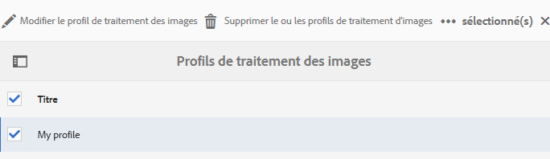
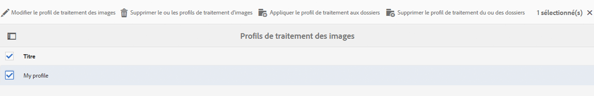
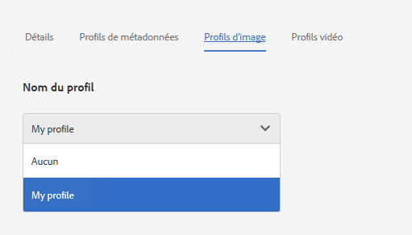
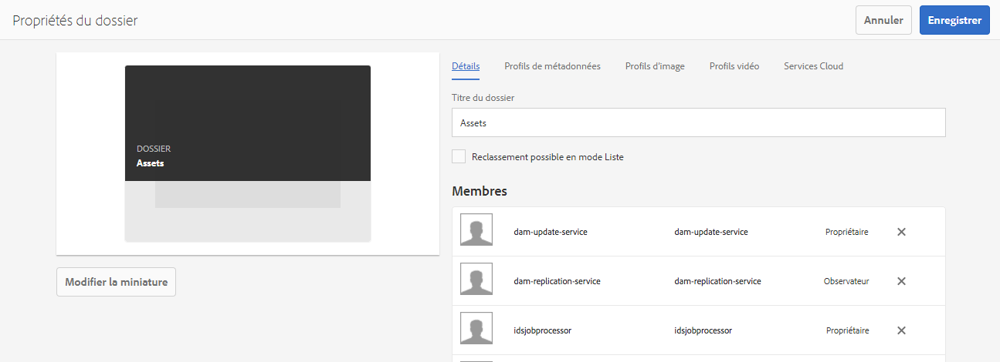
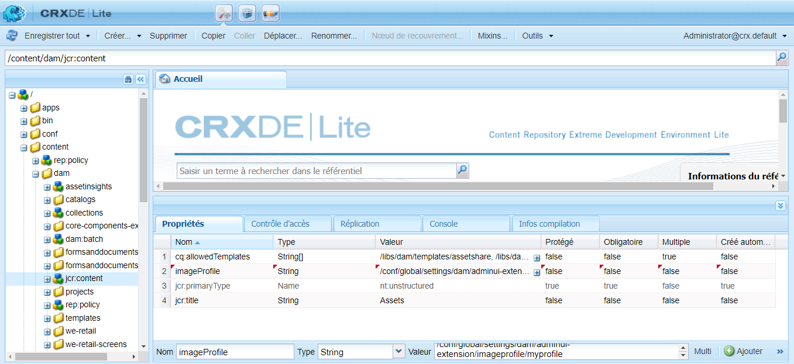
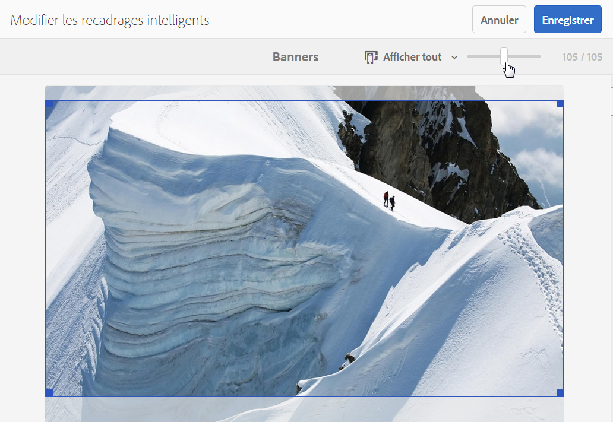
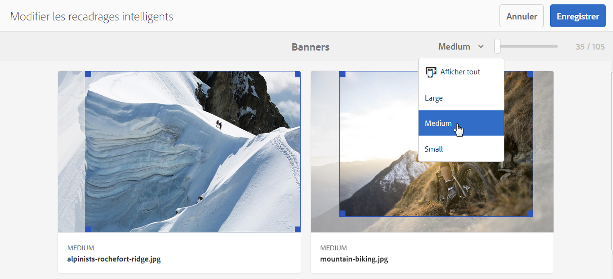

# Profils d’image Dynamic Media {#image-profiles}

Lorsque vous chargez des images, vous pouvez les recadrer automatiquement en appliquant un profil d’image au dossier.

>[!IMPORTANT]
>
>* Le recadrage intelligent est disponible uniquement dans Dynamic Media en mode Scene7.
>* Les profils d’image ne s’appliquent pas aux fichiers PDF, GIF animé ou INDD (Adobe InDesign).

## Options de recadrage {#crop-options}

Lorsque vous implémentez le recadrage intelligent sur les images, Adobe recommande les bonnes pratiques suivantes et applique la limite suivante :

| Type de limite | Bonne pratique | Limite imposée |
| --- | --- | --- |
| Nombre de recadrages intelligents par image | 5 | 100 |

Consultez également la section [limites de Dynamic Media](/help/assets/limitations.md).

<!-- CQDOC-16069 for paragraph directly below -->

Les coordonnées de recadrage intelligent dépendent des proportions de l’image (L/H). Pour les différents paramètres de recadrage intelligent d’un profil d’image, si les proportions sont identiques pour les dimensions ajoutées au profil d’image, ces mêmes proportions sont envoyées à Dynamic Media. Adobe vous recommande d’utiliser la même zone de recadrage. Vous avez ainsi la garantie qu’il n’y a aucune incidence sur les différentes dimensions utilisées dans le profil d’image.

Chaque génération de recadrage intelligent créée nécessite un traitement supplémentaire. Par exemple, l’ajout de plus de cinq proportions de recadrage intelligent peut ralentir le taux d’ingestion des ressources. Cet ajout augmente également la charge sur les systèmes. Étant donné que le recadrage intelligent s’applique aux dossiers, Adobe vous recommande de l’utiliser *uniquement* pour les dossiers où cela est nécessaire.

**Recommandations relatives au recadrage intelligent dans un profil d’image**
Pour garder l’utilisation du recadrage intelligent sous contrôle et optimiser le temps de traitement et le stockage des recadrages, Adobe recommande de suivre les conseils et astuces suivants :

* Les ressources d’image sur lesquelles un recadrage intelligent sera appliqué doivent faire au moins 50 x 50 pixels.
* Idéalement, effectuez 10 à 15 recadrages intelligents par image afin d’optimiser les proportions et le temps de traitement.
* Nommez les recadrages intelligents en fonction des dimensions de recadrage et non de leur utilisation finale. Cela permet d’optimiser les doublons lorsqu’une seule dimension est utilisée sur plusieurs pages.
* Créez des profils d’image au niveau de la page ou du type de ressource pour des dossiers et sous-dossiers spécifiques, au lieu d’un profil de recadrage intelligent commun appliqué à tous les dossiers ou ressources.
* Le profil d’image appliqué aux sous-dossiers remplace le profil d’image appliqué au dossier.
* Un profil d’image contenant des dimensions de recadrage intelligent en double n’est pas autorisé.
* Les profils d’image nommés en double dont les options de recadrage intelligent sont définies ne sont pas autorisés.

Vous avez le choix entre deux options de recadrage d’image : recadrage de pixels ou recadrage intelligent. Vous pouvez également choisir d’automatiser la création de nuanciers de couleurs et d’images.

>[!IMPORTANT]
>
>* Adobe vous recommande d’examiner tous les recadrages et tous les échantillons générés afin de vous assurer qu’ils sont appropriés et pertinents pour votre marque et vos valeurs.
>* Le format d’image CMJN n’est pas pris en charge avec le recadrage intelligent.

| Option | Quand l’utiliser | Description |
| --- | --- | --- |
| Recadrage des pixels | Recadrage en bloc des images en fonction des dimensions uniquement. | Pour utiliser cette option, sélectionnez **[!UICONTROL Recadrage des pixels]** dans la liste déroulante Options de recadrage.  Pour recadrer les bords d’une image, entrez le nombre de pixels à recadrer de n’importe quel côté ou de chaque côté de l’image. La proportion du recadrage de l’image dépend du paramètre ppi (pixels par pouce) du fichier d’image.  Un recadrage de pixels de profil d’image s’affiche de la manière suivante : ・Les valeurs sont Haut, Bas, Gauche et Droite. • Le coin supérieur gauche est considéré comme le `0,0`, et le recadrage des pixels est calculé à partir de cet endroit. • Point de départ du recadrage : le Gauche est le X et le Haut est le Y • Calcul horizontal : dimension horizontale en pixels de l’image d’origine, moins Gauche, puis moins Droite. • Calcul vertical : hauteur verticale en pixels moins le Haut puis moins le Bas.  Par exemple, supposons que vous ayez une image de 4 000 x 3 000 pixels. Vous utilisez les valeurs : haut=250, bas=500, gauche=300, droite=700.  À partir du coin supérieur gauche (300,250), recadrez l’image en utilisant l’espace de remplissage de (4000-300-700, 3000-250-500 ou 3000,2250). |
| Recadrage intelligent | Recadrer en masse des images en fonction de leur point focal visuel. | Le recadrage intelligent utilise la puissance de l’intelligence artificielle dans l’IA d’Adobe pour automatiser rapidement le recadrage des images en masse. Il détecte automatiquement le point focal de n’importe quelle image et recadre de façon à capturer le point d’intérêt prévu, quelle que soit la taille de l’écran.
 
Pour utiliser le recadrage intelligent, sélectionnez **[!UICONTROL Recadrage intelligent]** dans la liste déroulante des Options de recadrage, puis à droite de Recadrage d’image réactive, activez la fonction.
 
Les tailles par défaut des points de rupture (Grand, Moyen et Petit) couvrent généralement toute la gamme de tailles utilisées par la plupart des images sur les appareils mobiles, les tablettes, les ordinateurs de bureau et les bannières. Si vous le souhaitez, vous pouvez modifier les noms par défaut des points Grand, Moyen et Petit.
 
Pour ajouter d’autres points d’arrêt, sélectionnez **[!UICONTROL Ajouter un recadrage]**. Pour supprimer un recadrage, sélectionnez l’icône de corbeille. |
| Échantillon de couleurs et d’images | Générez en masse un échantillon pour chaque image. | **Remarque** : L’échantillon intelligent n’est pas pris en charge par Dynamic Media Classic.  Localisez et générez automatiquement des échantillons de haute qualité à partir d’images de produits qui affichent la couleur ou la texture.  Pour utiliser l’échantillon de couleurs et d’images, sélectionnez **[!UICONTROL Recadrage intelligent]** dans la liste déroulante des Options de recadrage, puis à droite d’Échantillon de couleurs et d’images, activez la fonction. Saisissez une valeur en pixels dans les zones de texte Largeur et Hauteur.  Alors que tous les recadrages d’images sont disponibles à partir du rail de rendu, les échantillons ne sont utilisés que par le biais de la fonction Copier l’URL. Utilisez votre propre composant d’affichage pour effectuer le rendu de la nuance sur votre site. (Les bannières de carrousel constituent une exception à cette règle. Dynamic Media fournit le composant d’affichage pour l’échantillon utilisé dans les bannières de carrousel.)  **Utilisation des échantillons d’images**  L’URL des échantillons d’images est simple. Il s’agit de :   `/is/image/company/&lt;asset_name&gt;:Swatch`  où `:Swatch` est ajouté à la demande de ressource.  **Utilisation d’échantillons de couleurs**  Pour utiliser des échantillons de couleurs, vous exécutez une requête `req=userdata` avec les éléments suivants : `/is/image/&lt;company_name&gt;/&lt;swatch_asset_name&gt;:Swatch?req=userdata`  Par exemple, voici un échantillon de ressource dans Dynamic Media Classic : `https://my.company.com:8080/is/image/DemoCo/Sleek:Swatch` Et voici l’URL `req=userdata` correspondant à ressource d’échantillon : `https://my.company.com:8080/is/image/DemoCo/Sleek:Swatch?req=userdata`  La réponse `req=userdata` est la suivante : `SmartCropDef=Swatch SmartCropHeight=200.0` `SmartCropRect=0.421671,0.389815,0.0848564,0.0592593,200,200` `SmartCropType=Swatch` `SmartCropWidth=200.0` `SmartSwatchColor=0xA56DB2`  Vous pouvez également demander une réponse `req=userdata` au format XML ou JSON, comme dans les exemples d’URL respectifs suivants : `https://my.company.com:8080/is/image/DemoCo/Sleek:Swatch?req=userdata,json` `https://my.company.com:8080/is/image/DemoCo/Sleek:Swatch?req=userdata,xml`  **Remarque :** Vous devez créer votre propre composant WCM pour demander un échantillon de couleur et analyser l’attribut `SmartSwatchColor`, représenté par une valeur hexadécimale RGB de 24 bits.  Consultez également la section [`userdata`dans le guide de référence des visionneuses](https://experienceleague.adobe.com/fr/docs/dynamic-media-developer-resources/image-serving-api/image-serving-api/http-protocol-reference/command-reference/req/r-userdata). |

## Accentuation {#unsharp-mask}

Utilisez l’**[!UICONTROL accentuation]** pour affiner l’effet d’un filtre d’accentuation sur l’image finale sous-échantillonnée. Vous pouvez contrôler l’intensité de l’effet, son rayon (mesuré en pixels) et un seuil de contraste qui est ignoré. Cet effet utilise les mêmes options que le filtre *Accentuation* d’Adobe Photoshop.

>[!NOTE]
>
>L’accentuation n’est appliquée qu’aux rendus réduits au sein du PTIFF (pyramid tiff), dont la résolution est réduite de plus de 50 %. Cela signifie que les rendus de taille supérieure à l’intérieur du ptiff ne sont pas affectés par l’accentuation, tandis que les rendus de plus petite taille, comme les miniatures, sont modifiés (et accentués).

L’option **[!UICONTROL Accentuation]** propose les options de filtre suivantes :

| Option | Description |
| --- | --- |
| Quantité | Contrôle le degré de contraste appliqué aux pixels de contour. La valeur par défaut est 1.75. Pour les images à haute résolution, vous pouvez l’augmenter jusqu’à 5. Considérez la quantité comme une mesure de l’intensité du filtre. La plage va de 0 à 5. |
| Rayon | Détermine le nombre de pixels entourant les pixels de contour qui affectent l’accentuation. Pour les images à haute résolution, entrez une valeur comprise entre 1 et 2. Une valeur faible accentue uniquement les pixels de contour ; une valeur élevée accentue une bande plus large de pixels. La valeur appropriée dépend de la taille de l’image. La valeur par défaut est 0,2. La plage est comprise entre 0 et 250. |
| Seuil | Détermine la plage de contraste à ignorer lorsque le filtre d’accentuation est appliqué. En d’autres termes, cette option définit l’écart recherché entre les pixels accentués et la zone environnante avant qu’ils ne soient considérés comme des pixels de contour et ne soient accentués. Pour éviter de créer du bruit, essayez des valeurs comprises entre 0 et 255. |

L’accentuation est décrite dans [Accentuation des images](/help/assets/assets/sharpening_images.pdf).

## Création de profils d’image Dynamic Media {#creating-image-profiles}

Pour définir des paramètres de traitement avancés pour d’autres types de ressources, voir [Configuration du traitement des ressources](config-dms7.md#configuring-asset-processing).

Voir [Profils de traitement des métadonnées, des images et des vidéos](processing-profiles.md).

Consultez également la section [Bonnes pratiques pour organiser vos ressources numériques en vue d’utiliser des profils de traitement](/help/assets/organize-assets.md).

**Pour créer des profils d’image Dynamic Media :**

1. Sélectionnez le logo Adobe Experience Manager et accédez à **[!UICONTROL Outils]** > **[!UICONTROL Ressources]** > **[!UICONTROL Profils d’image]**.
1. Sélectionnez **[!UICONTROL Créer]** pour pouvoir ajouter un profil d’image.
1. Saisissez un nom de profil et les valeurs pour une accentuation, un recadrage et un échantillon.

   Utilisez un nom de profil spécifique à l’objectif visé. Par exemple, si vous souhaitez créer un profil qui génère des échantillons uniquement (en d’autres termes, pour lequel le recadrage intelligent est désactivé, et l’échantillon de couleurs et d’images est activé), vous pouvez utiliser le nom de profil « Échantillons intelligents ».

   Voir aussi [Options de recadrage intelligent et d’échantillonnage intelligent](#crop-options) et [Accentuation](#unsharp-mask).

   

1. Sélectionnez **[!UICONTROL Enregistrer]**. Le profil nouvellement créé apparaît dans la liste des profils disponibles.

## Modification ou suppression de profils d’image Dynamic Media {#editing-or-deleting-image-profiles}

1. Sélectionnez le logo Experience Manager et accédez à **[!UICONTROL Outils]** > **[!UICONTROL Ressources]** > **[!UICONTROL Profils d’image]**.
1. Sélectionnez le profil d’image à modifier ou à supprimer. Pour le modifier, sélectionnez **[!UICONTROL Modifier le profil d’image]**. Pour le supprimer, sélectionnez **[!UICONTROL Supprimer le profil d’image]**.

   

1. En cas de modification, enregistrez les modifications ; en cas de suppression, confirmez la suppression du profil.

## Application d’un profil d’image Dynamic Media aux dossiers {#applying-an-image-profile-to-folders}

Lorsque vous affectez un profil d’image à un dossier, tous les sous-dossiers héritent automatiquement du profil de son dossier parent. Ce processus signifie que vous ne pouvez attribuer qu’un seul profil d’image à un dossier. Ainsi, réfléchissez soigneusement à la structure de dossiers de l’emplacement où vous téléchargez, stockez, utilisez et archivez les ressources.

Si vous avez affecté un profil d’image différent à un dossier, le nouveau profil remplace le précédent. Les ressources du dossier précédent restent inchangées. Le nouveau profil sera appliqué aux ressources ajoutées ultérieurement au dossier.

Les dossiers auxquels un profil est affecté sont indiqués dans l’interface utilisateur par le nom du profil apparaissant dans la carte.

<!-- When you add smart crop to an existing Image Profile, you need to re-trigger the [DAM Update Asset workflow](assets-workflow.md) if you want to generate crops for existing assets in your asset repository. -->

Vous pouvez appliquer des profils d’image à des dossiers spécifiques, ou de façon globale à toutes les ressources.

Vous pouvez traiter une nouvelle fois des ressources dans un dossier qui comporte déjà un profil d’image que vous avez modifié. Voir [Retraitement des ressources dans un dossier après avoir modifié son profil de traitement](processing-profiles.md#reprocessing-assets).

### Application de profils d’image Dynamic Media à des dossiers spécifiques {#applying-image-profiles-to-specific-folders}

Vous pouvez appliquer un profil d’image à un dossier à partir du menu **[!UICONTROL Outils]**, ou si vous êtes dans le dossier, via **[!UICONTROL Propriétés]**. Cette section décrit comment appliquer des profils d’image aux dossiers de deux manières.

Dans le cas des dossiers auxquels un profil est déjà affecté, le nom du profil est affiché directement sous celui du dossier.

Vous pouvez traiter une nouvelle fois des ressources dans un dossier qui comporte déjà un profil vidéo que vous avez modifié. Voir [Retraitement des ressources dans un dossier après avoir modifié son profil de traitement](processing-profiles.md#reprocessing-assets).

#### Application de profils d’image Dynamic Media à des dossiers à partir de l’interface utilisateur Profils {#applying-image-profiles-to-folders-from-profiles-user-interface}

1. Sélectionnez le logo Experience Manager et accédez à **[!UICONTROL Outils]** > **[!UICONTROL Ressources]** > **[!UICONTROL Profils d’image]**.
1. Sélectionnez le profil d’image à appliquer à un ou plusieurs dossiers.

   

1. Sélectionnez **[!UICONTROL Appliquer le profil de traitement aux dossiers]**, puis le ou les dossiers devant recevoir les ressources récemment chargées. Sélectionnez ensuite **[!UICONTROL Appliquer]**. Dans le cas des dossiers auxquels un profil est déjà affecté, le nom du profil est affiché directement sous celui du dossier.

#### Application de profils d’image Dynamic Media aux dossiers à partir des propriétés {#applying-image-profiles-to-folders-from-properties}

1. Sélectionnez le logo Experience League et accédez à **[!UICONTROL Ressources]**. Accédez ensuite au dossier parent du dossier auquel vous souhaitez appliquer un profil d’image.
1. Dans le dossier, sélectionnez sa coche pour le sélectionner, puis **[!UICONTROL Propriétés]**.
1. Sélectionnez l’onglet **[!UICONTROL Profils d’image]**. Dans la liste déroulante **[!UICONTROL Nom du profil]**, sélectionnez le profil, puis appuyez sur **[!UICONTROL Enregistrer et fermer]**. Dans le cas des dossiers auxquels un profil est déjà affecté, le nom du profil est affiché directement sous celui du dossier.

   

### Application globale d’un profil d’image Dynamic Media {#applying-an-image-profile-globally}

En plus d’appliquer un profil à un dossier, vous pouvez en appliquer un de façon globale, de sorte que tout le contenu chargé dans Experience Manager Assets soit traité par ce profil, quel que soit le dossier.

Vous pouvez traiter une nouvelle fois des ressources dans un dossier qui comporte déjà un profil vidéo que vous avez modifié. Voir [Retraitement des ressources dans un dossier après avoir modifié son profil de traitement](processing-profiles.md#reprocessing-assets).

**Pour appliquer globalement un profil d’image Dynamic Media** :

1. Utilisez l’une des méthodes suivantes :

   * Accédez à `https://&lt;AEM server&gt;/mnt/overlay/dam/gui/content/assets/foldersharewizard.html/content/dam` et appliquez le profil approprié, puis sélectionnez **[!UICONTROL Enregistrer]**.

     

   * Accédez au nœud suivant de CRXDE Lite : `/content/dam/jcr:content`.

     Ajoutez la propriété `imageProfile:/conf/global/settings/dam/adminui-extension/imageprofile/<name of image profile>` et sélectionnez **[!UICONTROL Enregistrer tout]**.

     

## Modification du recadrage intelligent ou de l’échantillon intelligent d’une seule image {#editing-the-smart-crop-or-smart-swatch-of-a-single-image}

>[!IMPORTANT]
>
>* Le recadrage intelligent est disponible uniquement dans Dynamic Media en mode Scene7.

Vous pouvez réaligner ou redimensionner manuellement la fenêtre de recadrage intelligent d’une image afin d’affiner davantage son point focal.

Une fois que vous avez modifié et enregistré un recadrage intelligent, la modification se propage partout où vous utilisez le recadrage pour ces images spécifiques.

Réexécutez le recadrage intelligent pour générer des recadrages supplémentaires, si nécessaire.

Voir aussi [Modification du recadrage intelligent ou de l’échantillon intelligent de plusieurs images](#editing-the-smart-crop-or-smart-swatch-of-multiple-images).

**Pour modifier le recadrage intelligent ou l’échantillon intelligent d’une seule image :**

1. Sélectionnez le logo Experience Manager et accédez à **[!UICONTROL Ressources]**, puis au dossier auquel est appliqué un profil d’image de recadrage intelligent ou d’échantillon intelligent.
1. Sélectionnez le dossier pour pouvoir ouvrir son contenu.
1. Sélectionnez l’image pour laquelle vous souhaitez ajuster le recadrage intelligent ou l’échantillon intelligent.
1. Dans la barre d’outils, sélectionnez **[!UICONTROL Recadrage intelligent]**.

   >[!TIP]
   >
   >Utilisez le raccourci clavier `s` pour modifier les recadrages intelligents ou les échantillons intelligents.

1. Procédez de l’une des manières suivantes :

   * Près du coin supérieur droit de la page, faites glisser le curseur vers la gauche ou la droite pour augmenter ou diminuer l’affichage de l’image.
   * Sur l’image, faites glisser une poignée d’angle pour ajuster la taille de la zone visible du recadrage ou de l’échantillon.
   * Sur l’image, faites glisser la zone/l’échantillon vers un nouvel emplacement. Vous ne pouvez modifier que les échantillons d’images. Les échantillons de couleurs sont statiques.
   * Au-dessus de l’image, sélectionnez **[!UICONTROL Rétablir]** pour annuler toutes les modifications effectuées et restaurer le recadrage ou l’échantillon d’origine.

1. Près du coin supérieur droit de la page, sélectionnez **[!UICONTROL Enregistrer]**, puis sélectionnez **[!UICONTROL Fermer]** pour revenir au dossier des ressources.

## Modification du recadrage intelligent ou de l’échantillon intelligent de plusieurs images {#editing-the-smart-crop-or-smart-swatch-of-multiple-images}

>[!IMPORTANT]
>
>* Le recadrage intelligent est disponible uniquement dans Dynamic Media en mode Scene7.

Après l’application d’un profil d’image (contenant un recadrage intelligent) sur un dossier, un recadrage est appliqué à toutes les images de ce dossier. Si vous le souhaitez, vous pouvez réaligner ou redimensionner *manuellement* la fenêtre de recadrage intelligent dans plusieurs images pour affiner davantage leur point focal.

Une fois que vous avez modifié et enregistré un recadrage intelligent, la modification se propage partout où vous utilisez le recadrage pour ces images spécifiques.

Réexécutez le recadrage intelligent pour générer des recadrages supplémentaires, si nécessaire.

**Pour modifier le recadrage intelligent ou l’échantillon intelligent de plusieurs images :**

1. Sélectionnez le logo Experience Manager et accédez à **[!UICONTROL Ressources]**, puis au dossier auquel est appliqué un profil d’image de recadrage intelligent ou d’échantillon intelligent.
1. Sur le dossier, sélectionnez l’icône **[!UICONTROL Autres actions]** (...), puis **[!UICONTROL Recadrage intelligent]**.

1. Sur la page **[!UICONTROL Modifier les recadrages intelligents]**, utilisez l’une des méthodes suivantes :

   * Ajustez la taille d’affichage des images sur la page.

     À droite de la liste déroulante de noms de points d’arrêt, faites glisser le curseur vers la gauche ou la droite pour modifier la taille de l’affichage d’image visible.

     

   * Filtrez la liste des images visibles en fonction des noms de point d’arrêt. Dans l’exemple ci-dessous, les images sont filtrées en fonction du nom de point d’arrêt « Moyenne ».

     Près du coin supérieur droit de la page, dans la liste déroulante, sélectionnez un nom de point d’arrêt pour filtrer les images que vous souhaitez voir (voir l’image ci-dessus).

     

   * Redimensionnez la zone de recadrage intelligent. Effectuez l’une des opérations suivantes :

      * Si l’image comporte un recadrage intelligent ou un échantillon intelligent uniquement, faites glisser sur celle-ci la poignée d’angle de la zone de recadrage pour ajuster la taille de la zone visible du recadrage.
      * Si l’image comporte à la fois un recadrage intelligent et un échantillon intelligent, faites glisser sur celle-ci la poignée d’angle de la zone de recadrage pour ajuster la taille de la zone visible du recadrage. Ou, sélectionnez l’échantillon intelligent sous l’image (les échantillons de couleurs sont statiques), puis faites glisser la poignée de l’angle de la zone de recadrage pour ajuster la taille de la zone visible de l’échantillon.

     

   * Déplacez la zone de recadrage intelligent. Effectuez l’une des opérations suivantes :

      * Si l’image comporte uniquement un recadrage intelligent ou un échantillon intelligent, faites glisser sur celle-ci la zone de recadrage vers un nouvel emplacement.
      * Si l’image comporte à la fois un recadrage intelligent et un échantillon intelligent, faites glisser sur celle-ci la zone de recadrage intelligent vers un nouvel emplacement. Vous pouvez également sélectionner l’échantillon intelligent sous l’image (les échantillons de couleurs sont statiques), puis faire glisser la zone de recadrage intelligent de l’échantillon vers un nouvel emplacement.

     

   * Annulez toutes vos modifications et rétablissez le recadrage intelligent ou l’échantillon intelligent d’origine (s’applique à la session de modification active uniquement).

     Sélectionnez **[!UICONTROL Rétablir]** au-dessus de l’image.

     

1. Près du coin supérieur droit de la page, sélectionnez **[!UICONTROL Enregistrer]**, puis sélectionnez **[!UICONTROL Fermer]** pour revenir au dossier des ressources.

## Supprimer un profil d’image Dynamic Media des dossiers {#removing-an-image-profile-from-folders}

Lorsque vous supprimez un profil d’image d’un dossier, tout sous-dossier hérite automatiquement de la suppression du profil de son dossier parent. Cependant, le traitement des fichiers qui s’est produit dans les dossiers reste intact.

Vous pouvez supprimer un profil d’image appliqué à un dossier dans le menu **[!UICONTROL Outils]**, ou si vous êtes dans le dossier, via **[!UICONTROL Propriétés]**. Cette section décrit comment supprimer des profils d’image appliqués aux dossiers en utilisant les deux procédures.

### Suppression d’un profil d’image Dynamic Media d’un dossier au moyen de l’interface utilisateur Profils {#removing-image-profiles-from-folders-via-profiles-user-interface}

1. Sélectionnez le logo Experience Manager et accédez à **[!UICONTROL Outils]** > **[!UICONTROL Ressources]** > **[!UICONTROL Profils d’image]**.
1. Sélectionnez le profil d’image à supprimer d’un ou de plusieurs dossiers.
1. Sélectionnez **[!UICONTROL Supprimer le profil de traitement des dossiers]**, sélectionnez le ou les dossiers desquels supprimer le profil, puis sélectionnez **[!UICONTROL Terminé]**.

   Le fait que le nom du profil n’apparaît plus sous celui du dossier indique que le profil d’image n’est plus appliqué à un dossier.

### Suppression d’un profil d’image Dynamic Media d’un dossier au moyen des propriétés {#removing-image-profiles-from-folders-via-properties}

1. Sélectionnez le logo Experience Manager et accédez à **[!UICONTROL Ressources]**, puis au dossier duquel vous souhaitez supprimer un profil d’image.
1. Dans le dossier, sélectionnez la coche pour le sélectionner, puis sélectionnez **[!UICONTROL Propriétés]**.
1. Sélectionnez l’onglet **[!UICONTROL Profils d’image]**.
1. Dans la liste déroulante **[!UICONTROL Nom du profil]**, sélectionnez **[!UICONTROL Aucun]**, puis sélectionnez **[!UICONTROL Enregistrer et fermer]**.

   Dans le cas des dossiers auxquels un profil est déjà affecté, le nom du profil est affiché directement sous celui du dossier.
