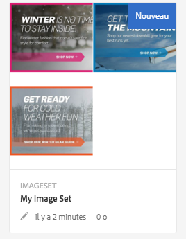
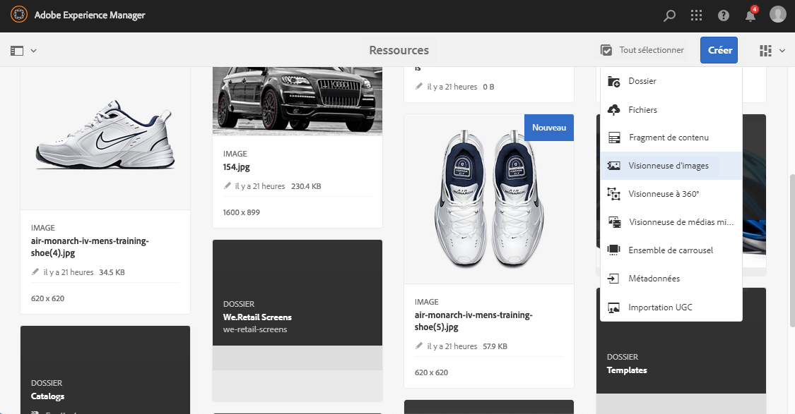
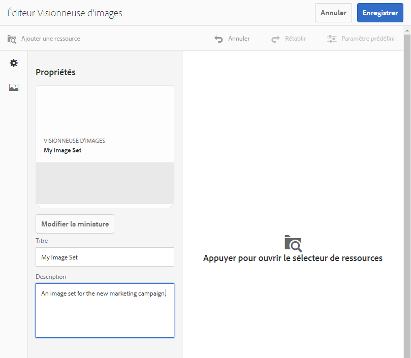
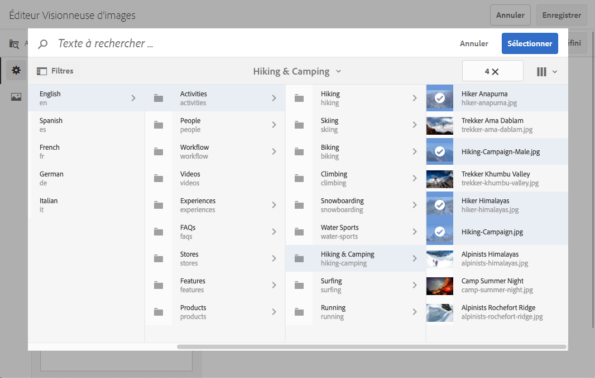
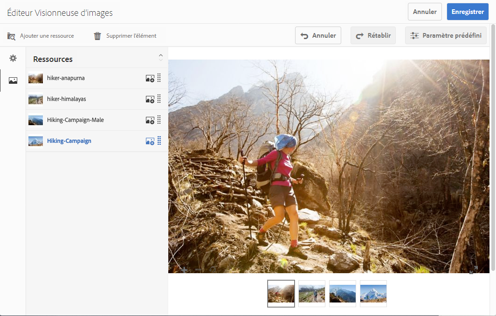
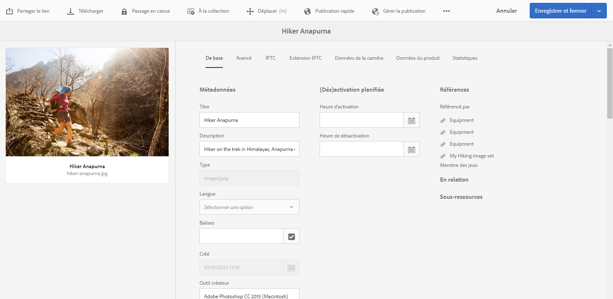
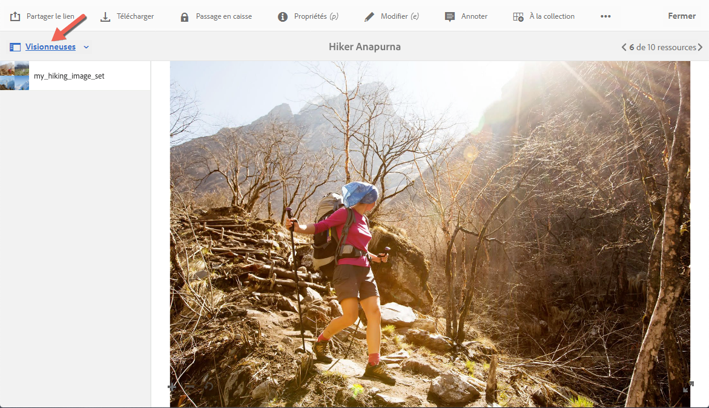
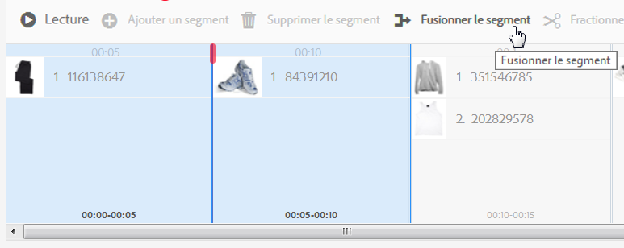

# Visionneuses d’images {#image-sets}

Les visionneuses d’images offrent aux utilisateurs une expérience de visionnage intégrée en leur permettant d’afficher différentes vues d’un élément en sélectionnant une miniature. Les visionneuses d’images permettent de présenter différentes vues d’un élément. Elles offrent des outils de zoom afin d’examiner les images de plus près.

Les visionneuses d’images sont désignées par une bannière comportant le mot `IMAGESET`. En outre, si la visionneuse d’images est publiée, la date de publication, indiquée par l’icône représentant la **[!UICONTROL Terre]**, figure sur la bannière avec la date de dernière modification, indiquée par l’icône représentant un **[!UICONTROL crayon]**.

Dans une visionneuse d’images, vous pouvez également créer des échantillons en créant une visionneuse d’images et en ajoutant des miniatures.

Cette application est utile lorsque vous souhaitez afficher un élément avec une couleur, un modèle ou une finition différente. Pour créer une visionneuse d’images avec des échantillons de couleur, vous avez besoin d’une image pour chaque couleur, modèle ou finition que vous souhaitez présenter aux utilisateurs. Vous avez également besoin d’un échantillon de couleur, de motif ou de finition pour chaque couleur, motif ou finition.

Supposons que vous souhaitiez présenter des images de casquettes avec des visières de couleurs différentes ; les visières sont rouge, vert et bleu. Dans ce cas, vous avez besoin de trois prises de vue de la même casquette. Vous avez besoin d’une prise avec une visière rouge, une avec une verte, et une avec une bleue. Vous avez également besoin d’un échantillon de couleur rouge, vert et bleu. Les échantillons de couleurs servent de miniatures sur lesquelles les utilisateurs sélectionnent la visionneuse des séries d’échantillons pour voir les visières rouge, verte ou bleue.

>[!NOTE]
>
>Pour plus d’informations sur l’interface utilisateur d’Assets, consultez la section [Gestion des ressources](/help/assets/manage-assets.md).

Lorsque vous créez une visionneuse d’images, Adobe recommande les bonnes pratiques suivantes et applique les limites ci-dessous :

| Type de limite | Bonne pratique | Limite imposée |
| --- | --- | --- |
| Nombre de ressources en double par ensemble | Aucun doublon | 20 |
| Nombre maximal d’images par ensemble | 5 à 10 images par ensemble | 1000 |

‡ La bonne pratique consiste à ne pas avoir de ressources en double dans un ensemble. La limite est de 20 doublons pour une seule ressource. Si vous ajoutez un autre doublon pour cette ressource (dans cet ensemble), la requête renvoie une erreur ou ignore le doublon.

Voir aussi [Limites de Dynamic Media](/help/assets/limitations.md).

## Démarrage rapide : Visionneuses d’images {#quick-start-image-sets}

**Pour démarrer rapidement :**

1. [Chargez les images sources originales pour plusieurs vues](#uploading-assets-in-image-sets).

   Commencez par charger les images pour les visionneuses d’images. Lorsque vous sélectionnez des images, n’oubliez pas que vos clients peuvent zoomer sur les images dans la visionneuse d’images. Assurez-vous que les images font au moins 2 000 pixels dans leur dimension la plus grande pour obtenir un détail de zoom optimal. Dynamic Media peut générer des images de jusqu’à 25 mégapixels chacune. Par exemple, vous pouvez utiliser une image de 5 000 x 5 000 mégapixels, ou toute autre combinaison de taille pouvant atteindre 25 mégapixels.

   Consultez la section [Dynamic Media - Formats d’image matricielle pris en charge](/help/assets/assets-formats.md#supported-raster-image-formats-dynamic-media) pour obtenir une liste des formats pris en charge par les visionneuses d’images.

<!--    Adobe Experience Manager Assets supports many image file formats, but lossless TIFF, PNG, and EPS images are recommended. -->

1. [Création d’une visionneuse d’images](#creating-image-sets).

   Dans les visionneuses d’images, vous pouvez sélectionner les images miniatures dans la visionneuse d’images.

   Pour créer une visionneuse d’images dans Assets, accédez à **[!UICONTROL Créer]** > **[!UICONTROL Visionneuses d’images]**. Ajoutez ensuite des images et sélectionnez **[!UICONTROL Enregistrer]**.

   Vous pouvez également créer des visionneuses d’images automatiquement par l’intermédiaire des [paramètres prédéfinis de visionneuses par lot](/help/assets/config-dms7.md).
   >[!IMPORTANT]
   >
   >Les ensembles par lot sont créés par le système IPS (Image Exploitation System) dans le cadre de l’ingestion des ressources et sont disponibles uniquement dans Dynamic Media en mode Scene7.

   Consultez la section [Préparation du chargement de ressources de visionneuse d’images et Chargement des fichiers](#uploading-assets-in-image-sets).

   Voir [Utilisation de sélecteurs](/help/assets/working-with-selectors.md).

1. Ajoutez des [paramètres prédéfinis de visionneuse d’images](/help/assets/managing-viewer-presets.md), selon les besoins.

   Les administrateurs peuvent créer ou modifier les paramètres prédéfinis de visionneuse d’images. Pour afficher vos visionneuses d’images avec un paramètre prédéfini de visionneuse, sélectionnez la visionneuse d’images, puis dans le menu déroulant du rail gauche, sélectionnez **[!UICONTROL Visionneuses]**.

   Accédez à **[!UICONTROL Outils]** > **[!UICONTROL Ressources]** > **[!UICONTROL Paramètres prédéfinis de la visionneuse]** si vous souhaitez créer ou modifier des paramètres prédéfinis de visionneuse.

1. (Facultatif) [Affichez les visionneuses d’images](/help/assets/image-sets.md#viewing-image-sets) créées à l’aide de paramètres prédéfinis de visionneuse par lot.
1. [Prévisualisez une visionneuse d’images](/help/assets/previewing-assets.md).

   Sélectionnez la visionneuse d’images pour pouvoir la prévisualiser. Sélectionnez les icônes des miniatures afin d’examiner votre visionneuse d’images dans la visionneuse sélectionnée. Vous pouvez choisir différentes visionneuses dans le menu **[!UICONTROL Visionneuses]** disponible dans le menu déroulant du rail gauche.

1. [Publication d’une visionneuse d’images](/help/assets/publishing-dynamicmedia-assets.md).

   La publication d’une visionneuse d’images active le code URL et d’incorporation. En outre, vous devez [publier tous les paramètres prédéfinis de visionneuse personnalisés](/help/assets/managing-viewer-presets.md) que vous avez créés. Les paramètres prédéfinis de visionneuse prêts à l’emploi sont déjà publiés.

1. [Liez des URL à l’application web](/help/assets/linking-urls-to-yourwebapplication.md) ou [incorporez la vidéo ou la visionneuse d’images](/help/assets/embed-code.md).

   Experience Manager Assets crée des appels URL pour les visionneuses d’images et les active une fois que vous avez publié la visionneuse d’images. Vous pouvez copier ces URL lorsque vous prévisualisez les ressources. En outre, vous pouvez également les intégrer à votre site web.

   Sélectionnez la visionneuse d’images, puis, dans le menu déroulant du rail de gauche, sélectionnez **[!UICONTROL Visionneuses]**.

   Consultez la section [Liaison d’une visionneuse d’images à une page web](/help/assets/linking-urls-to-yourwebapplication.md) et [Intégration de la visionneuse de vidéos ou d’images](/help/assets/embed-code.md).

Pour modifier des visionneuses d’images, consultez la section [Modification de visionneuses d’images](#editing-image-sets). Vous pouvez en outre afficher et modifier les [propriétés de la visionneuse d’images](/help/assets/manage-assets.md#editing-properties).

Si vous rencontrez des problèmes lors de la création des visionneuses, reportez-vous à Images et visionneuses dans la section [Dépannage de Dynamic Media en Mode Scene7](/help/assets/troubleshoot-dms7.md#images-and-sets).

## Chargement de ressources dans les visionneuses d’images {#uploading-assets-in-image-sets}

Commencez par charger les images pour les visionneuses d’images. Lorsque vous sélectionnez des images, n’oubliez pas que vos clients peuvent zoomer sur les images dans la visionneuse d’images. Assurez-vous que les images font au moins 2 000 pixels dans leur dimension la plus grande. Les visionneuses d’images prennent en charge de nombreux formats de fichier image, mais les formats sans perte TIFF, PNG et EPS sont recommandés.

Vous pouvez charger des images pour les visionneuses d’images comme vous le feriez pour [charger une autre ressource dans AEM Assets](/help/assets/manage-assets.md#uploading-assets).

Consultez la section [Dynamic Media - Formats d’image matricielle pris en charge](/help/assets/assets-formats.md#supported-raster-image-formats-dynamic-media) pour obtenir une liste des formats pris en charge par les visionneuses d’images.

### Préparation du chargement de ressources de visionneuse d’images {#preparing-image-set-assets-for-upload}

Avant de créer une visionneuse d’images, assurez-vous que la taille et le format des images sont corrects.

Pour créer une visionneuse d’images à vues multiples, vous avez besoin d’images qui présentent un élément de différents points de vue ou qui présentent différents aspects d’un même élément. L’objectif est de mettre en évidence les caractéristiques importantes d’un élément afin que les utilisateurs et les utilisatrices puissent se faire une idée complète de son aspect ou de ses fonctions.

Comme les utilisateurs et les utilisatrices peuvent zoomer sur les images dans les visionneuses d’images, assurez-vous que la plus grande taille des images comporte au moins 2 000 pixels. <!-- Assets support many image file formats, but lossless TIFF, PNG, and EPS images are recommended. -->

>[!NOTE]
>
>En outre, si vous utilisez des miniatures pour indiquer des échantillons de produit, vous devez effectuer les opérations suivantes :
>
>Créez des vignettes ou des prises de vue différentes de la même image la présentant avec différentes couleurs, modèles et finitions. Vous avez également besoin de miniatures qui correspondent aux différentes couleurs, modèles ou finitions. Par exemple, pour présenter des miniatures avec une visionneuse d’images pour la même veste en noir, marron et vert, vous avez besoin des éléments suivants :
>
>* Une prise de vue de la même veste en noir, marron et vert.
>* Une miniature de la veste en noir, marron et vert.

## Création d’une visionneuse d’images {#creating-image-sets}

Vous pouvez créer des visionneuses d’images par le biais de l’interface utilisateur ou par l’API. Cette section décrit comment créer des visionneuses d’images dans l’interface utilisateur.

>[!NOTE]
>
>Vous pouvez également créer des visionneuses d’images automatiquement par l’intermédiaire des [paramètres prédéfinis d’ensemble par lot](/help/assets/config-dms7.md#creating-batch-set-presets-to-auto-generate-image-sets-and-spin-sets).
>**Important :** les ensembles par lot sont créés par le système IPS (Image Exploitation System) dans le cadre de l’ingestion des ressources et sont disponibles uniquement dans Dynamic Media en mode Scene7.

Lorsque vous ajoutez des ressources à votre visionneuse, elles sont automatiquement ajoutées dans l’ordre alphanumérique. Vous pouvez réorganiser ou trier manuellement les ressources après les avoir ajoutées.

>[!NOTE]
>
>Les visionneuses d’images ne sont pas prises en charge pour les ressources dont le nom de fichier contient une virgule « , ».

Lorsque vous créez une visionneuse d’images, Adobe recommande les bonnes pratiques suivantes et applique les limites ci-dessous :

| Type de limite | Bonne pratique | Limite imposée |
| --- | --- | --- |
| Nombre de ressources en double par ensemble | Aucun doublon | 20 |
| Nombre maximal d’images par ensemble | 5 à 10 images par ensemble | 1000 |

‡ La bonne pratique consiste à ne pas avoir de ressources en double dans un ensemble. La limite est de 20 doublons pour une seule ressource. Si vous ajoutez un autre doublon pour cette ressource (dans cet ensemble), la requête renvoie une erreur ou ignore le doublon.

Consultez également la section [Limites de Dynamic Media](/help/assets/limitations.md).

**Pour créer une visionneuse d’images :**

1. Dans Experience Manager, sélectionnez le logo Experience Manager pour accéder à la console de navigation globale, puis accédez à **[!UICONTROL Navigation]** > **[!UICONTROL Ressources]**. Naviguez jusqu’à l’emplacement où vous souhaitez créer une visionneuse d’images, puis accédez à **[!UICONTROL Créer]** > **[!UICONTROL Visionneuse d’images]** pour ouvrir la page de l’éditeur de visionneuse d’images.

   Vous pouvez également la créer depuis un dossier qui contient les ressources.

   

1. Dans le champ **[!UICONTROL Titre]** de la page de l’éditeur de visionneuse d’images, entrez un nom pour la visionneuse d’images. Le nom apparaît dans la bannière de la visionneuse d’images. Vous pouvez aussi saisir une description.

   

1. Effectuez l’une des opérations suivantes :

   * Dans le coin supérieur gauche de la page de l’éditeur de visionneuse d’images, sélectionnez **[!UICONTROL Ajouter une ressource]**.

   * Au milieu de la page de l’éditeur de visionneuse d’images, sélectionnez **[!UICONTROL Appuyer pour ouvrir le sélecteur de ressources]**.

   Sélectionnez les ressources que vous souhaitez inclure dans la visionneuse d’image. Les ressources sélectionnées sont cochées. Lorsque vous avez terminé, en haut à droite de la page, sélectionnez **[!UICONTROL Sélectionner]**.

   Le sélecteur de ressources vous permet de rechercher des ressources en saisissant un mot-clé, puis en appuyant ou en cliquant sur **[!UICONTROL Entrée]**. Vous pouvez également appliquer des filtres pour affiner vos résultats de recherche. Vous pouvez filtrer par chemin, collection, type de fichier et balise. Sélectionnez le filtre, puis sélectionnez l’icône **[!UICONTROL Filtre]** de la barre d’outils. Modifiez l’affichage en appuyant sur l’icône Affichage et en sélectionnant **[!UICONTROL Vue Colonnes]**, **[!UICONTROL Vue Carte]** ou **[!UICONTROL Vue Liste]**.

   Voir [Utilisation de sélecteurs](/help/assets/working-with-selectors.md).

   

1. Lorsque vous ajoutez des ressources à votre visionneuse, elles sont automatiquement ajoutées dans l’ordre alphanumérique. Vous pouvez réorganiser ou trier manuellement les ressources une fois qu’elles ont été ajoutées.

   Si nécessaire, faites glisser l’icône Réorganiser d’une ressource vers la droite du nom de fichier de la ressource pour réorganiser les images vers le haut ou le bas de la liste définie.

   

   Pour changer une miniature ou un échantillon, sélectionnez l’icône **+** **miniature** à côté de l’image et naviguez jusqu’à la miniature ou à l’échantillon de votre choix. Lorsque vous avez terminé de sélectionner toutes les images, sélectionnez **[!UICONTROL Enregistrer]**.

1. (En option) Effectuez l’une des actions suivantes :

   * Pour supprimer une image, sélectionnez-la et sélectionnez **[!UICONTROL Supprimer l’élément]**.

   * Pour appliquer un paramètre prédéfini, en haut à droite de la page, sélectionnez **[!UICONTROL Paramètre prédéfini]**, puis sélectionnez un paramètre prédéfini à appliquer en une seule fois à toutes les ressources.

   >[!NOTE]
   >
   >Lors de la création de la visionneuse d’images, vous pouvez modifier la miniature de la visionneuse d’images ou autoriser Experience Manager à la sélectionner automatiquement en fonction des ressources de la visionneuse d’images. Pour sélectionner une miniature, sélectionnez **[!UICONTROL Modifier la miniature]** au-dessus du champ Titre de la page de l’éditeur de visionneuse d’images, puis sélectionnez une image (vous pouvez également accéder à d’autres dossiers pour rechercher des images). Si vous avez sélectionné une miniature et décidez ensuite que vous souhaitez qu’Experience Manager en génère une depuis la visionneuse d’images, sélectionnez **[!UICONTROL Basculez sur]** > **[!UICONTROL Miniature automatique]**.

1. Sélectionnez **[!UICONTROL Enregistrer]**. La nouvelle visionneuse d’images apparaît dans le dossier dans lequel vous l’avez créée.

## Affichage d’une visionneuse d’images {#viewing-image-sets}

Vous pouvez créer des visionneuses d’images dans l’interface utilisateur ou automatiquement à l’aide des [paramètres prédéfinis d’ensemble par lot](/help/assets/config-dms7.md#creating-batch-set-presets-to-auto-generate-image-sets-and-spin-sets).

>[!IMPORTANT]
>
>Les ensembles par lot sont créés par le système IPS [Image Exploitation System] dans le cadre de l’ingestion des ressources et sont disponibles uniquement dans Dynamic Media en mode Scene7.)

Notez toutefois que les visionneuses créées à l’aide de paramètres prédéfinis d’ensemble par lot *ne s’affichent pas* dans l’interface utilisateur. Vous pouvez afficher ces visionneuses de trois manières différentes. (Ces méthodes sont disponibles même si vous avez créé les visionneuses d’images dans l’interface utilisateur.)

* Ouvrez les propriétés d’une ressource individuelle. Les propriétés indiquent les visionneuses dont la ressource sélectionnée fait partie ou auxquelles elle est référencée. Sélectionnez le nom de la visionneuse si vous souhaitez afficher la totalité de la visionneuse.

  

* À partir de l’image membre d’une visionneuse, sélectionnez le menu **[!UICONTROL Visionneuses]** pour afficher les visionneuses dont la ressource fait partie.

  

* À partir de la recherche, vous pouvez sélectionner **[!UICONTROL Filtre]**, développer **[!UICONTROL Dynamic Media]**, puis sélectionner **[!UICONTROL Jeux]**.

  La recherche renvoie les visionneuses correspondantes qui ont soit été créées manuellement dans l’interface utilisateur, soit automatiquement au moyen de paramètres prédéfinis d’ensemble par lot. Dans le cas des visionneuses automatisées, la requête de recherche est effectuée à l’aide du critère « Commence par », à la différence de la recherche Experience Manager qui repose sur l’utilisation du critère « Contient ». Définir le filtre sur **[!UICONTROL Visionneuses]** est le seul moyen de rechercher des ensembles automatisés.

  

>[!NOTE]
>
>Vous pouvez afficher les visionneuses par le biais de l’interface utilisateur, comme indiqué dans la section [Modification d’une visionneuse d’images](#editing-image-sets).

## Modification d’une visionneuse d’images {#editing-image-sets}

Vous pouvez effectuer diverses tâches de modification sur les visionneuses d’images, telles que :

* Ajouter des images à la visionneuse d’images.
* Réorganiser des images dans la visionneuse d’images.
* Supprimer des ressources de la visionneuse d’images.
* Appliquez les paramètres d’affichage prédéfinis.
* Supprimez la visionneuse d’images.

**Pour modifier une visionneuse d’images, procédez comme suit :**

1. Effectuez l’une des opérations suivantes :

   * Pointez sur une ressource d’image, puis sélectionnez **[!UICONTROL Modifier]** (icône de crayon).
   * Pointez sur une ressource de visionneuse d’image, sélectionnez **[!UICONTROL Sélectionner]** (icône de coche), puis **[!UICONTROL Modifier]** sur la barre d’outils.
   * Sélectionnez une ressource de visionneuse d’images, puis sélectionnez **[!UICONTROL Modifier]** (icône de crayon) dans la barre d’outils.

1. Pour modifier les images dans la visionneuse d’images, procédez d’une des manières suivantes :

   * Pour réorganiser les images, faites glisser une image vers un nouvel emplacement (sélectionnez l’icône Réorganiser pour déplacer des éléments).
   * Pour trier les éléments dans l’ordre ascendant ou descendant, sélectionnez l’en-tête de colonne.
   * Pour ajouter une ressource ou mettre à jour une ressource existante, sélectionnez **[!UICONTROL Ajouter une ressource]**. Accédez à une ressource, sélectionnez-la, puis sélectionnez **[!UICONTROL Sélectionner]** en haut à droite de la page.
     >[!NOTE]
     >
     >Si vous supprimez l’image utilisée par Experience Manager pour la miniature en la remplaçant par une autre image, la ressource originale s’affiche toujours.
   * Pour supprimer une ressource, sélectionnez-la et sélectionnez **[!UICONTROL Supprimer l’élément]**.
   * Pour appliquer un paramètre prédéfini, en haut à droite de la page, sélectionnez **[!UICONTROL Paramètre prédéfini]**, puis sélectionnez un paramètre prédéfini de visionneuse.
   * Pour ajouter ou changer une miniature, sélectionnez l’icône de miniature située à droite de la ressource. Naviguez jusqu’à la nouvelle miniature ou ressource d’échantillon, sélectionnez-la, puis sélectionnez **[!UICONTROL Sélectionner]**.
   * Pour supprimer l’ensemble d’une visionneuse d’images, accédez à cette visionneuse, sélectionnez-la, puis sélectionnez **[!UICONTROL Supprimer]**.

   >[!NOTE]
   >
   >Vous pouvez modifier les images d’une visionneuse d’images en y accédant, en sélectionnant **[!UICONTROL Définir les membres]** dans le rail de gauche, puis en appuyant sur l’icône en forme de crayon d’une ressource pour ouvrir la fenêtre de modification.

1. Sélectionnez **[!UICONTROL Enregistrer]** lorsque vous avez terminé la modification.

## Prévisualisation d’une visionneuse d’images {#previewing-image-sets}

Consultez également la section [Aperçu des ressources](/help/assets/previewing-assets.md).

## Publication d’une visionneuse d’images {#publishing-image-sets}

Consultez également le section [Publication de ressources](/help/assets/publishing-dynamicmedia-assets.md).
