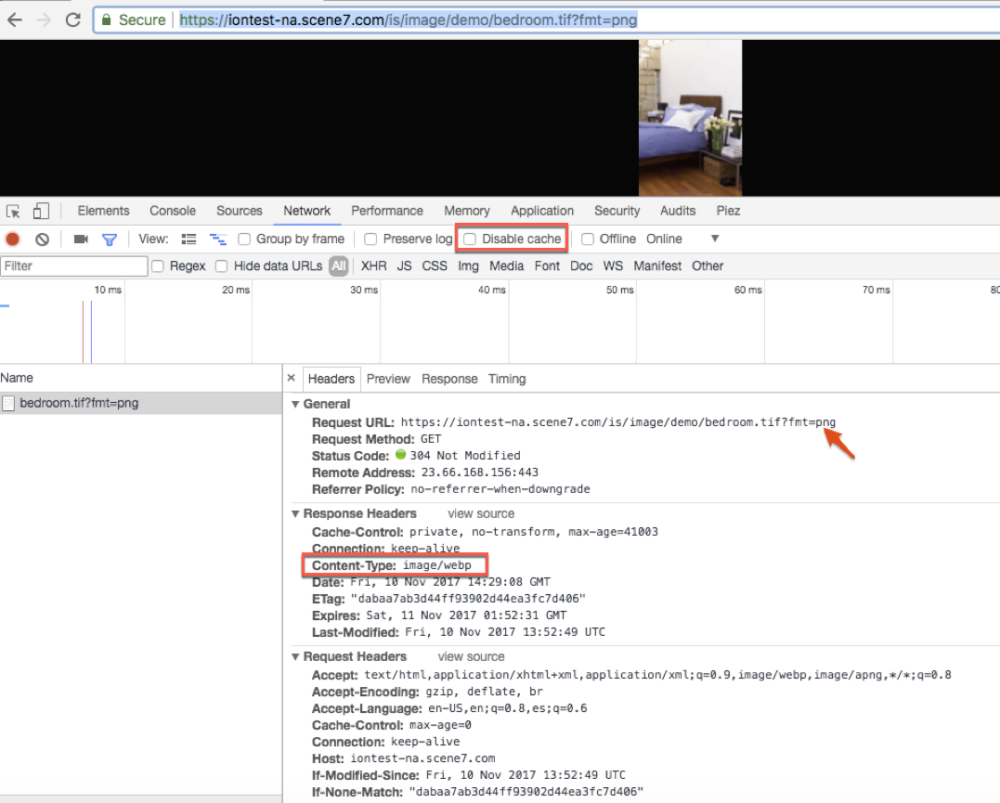

# Imagerie dynamique {#smart-imaging}

## Qu’est-ce que l’imagerie dynamique ? {#what-is-smart-imaging}

La technologie d’imagerie dynamique applique les fonctionnalités d’Adobe Sensei AI et fonctionne avec les &quot;paramètres d’image prédéfinis&quot; existants pour améliorer les performances de diffusion d’images en optimisant automatiquement le format, la taille et la qualité de l’image en fonction des fonctionnalités du navigateur client.

>[!NOTE]
>
>Cette fonctionnalité nécessite l’utilisation du réseau de diffusion de contenu prêt à l’emploi (CDN) fourni avec Adobe Experience Manager Dynamic Media. Aucun autre réseau CDN personnalisé n’est pris en charge avec cette fonctionnalité.

L’imagerie dynamique tire également parti de sa parfaite intégration dans un service de réseau de diffusion de contenu haut de gamme proposé par Adobe afin d’offrir un gain de performance accru. Ce service recherche la route Internet optimale entre les serveurs, les réseaux et les points d’appairage. Il trouve un itinéraire ayant la latence la plus faible et le taux de perte de paquets le plus faible au lieu d’utiliser l’itinéraire par défaut sur Internet.

Les exemples de ressources d’image suivants illustrent l’optimisation supplémentaire qu’apporte l’imagerie dynamique :

| Image (URL) | Miniature | Taille  (JPEG) | Taille (WebP)  (avec imagerie dynamique) | % de réduction |
|---|---|---|---|---|
| [Image 1](https://techsupport.scene7.com/is/image/TechSupport/SmartImaging_6?hei=500&amp;fmt=jpg&amp;qlt=85&amp;resmode=bisharp&amp;op_usm=5,0.125,5,0) |  | 73,75 Ko | 45,92 Ko | 38 % |
| [Image 2](https://techsupport.scene7.com/is/image/TechSupport/SmartImaging_3?hei=500&amp;fmt=jpg&amp;qlt=85&amp;resmode=bisharp&amp;op_usm=5,0.125,5,0) |  | 191 Ko | 70,66 Ko | 63 % |
| [Image 3](https://techsupport.scene7.com/is/image/TechSupport/SmartImaging_2?hei=500&amp;fmt=jpg&amp;qlt=85&amp;resmode=bisharp&amp;op_usm=5,0.125,5,0) |  | 96,64 Ko | 39,44 Ko | 59 % |
| [Image 4](https://techsupport.scene7.com/is/image/TechSupport/SmartImaging_1?hei=500&amp;qlt=85&amp;resmode=bisharp&amp;op_usm=5,0.125,5,0) |  | 315,80 Ko | 178,19 Ko | 44 % |
|  |  |  |  | Moyenne = 51 % |

De la même manière que ci-dessus, Adobe a également exécuté un test avec 7 009 URL provenant de sites clients actifs. Ils ont pu optimiser de 38 % en moyenne leur taille de fichier au format JPEG. Pour les fichiers PNG au format WebP, cette taille de fichier au pu être optimisée de 31 % en moyenne. Ce type d’optimisation est possible grâce à la fonctionnalité d’imagerie dynamique.

<!-- CQDOC-17915 HIDDEN FOR NOW AS OF MAY 28 2021 On the mobile web, the challenges are compounded by two factors:

* Large variety of devices with different form factors and high-resolution displays.
* Constrained network bandwidth.

In terms of images, the goal is to serve the best quality images as efficiently as possible.

### About device pixel ratio optimization {#dpr}

Device pixel ratio (DPR) &ndash; also known as CSS pixel ratio &ndash; is the relation between a device’s physical pixels and logical pixels. Especially with the advent of retina screens, the pixel resolution of modern mobile devices is growing at a fast rate.

Enabling Device Pixel Ratio optimization renders the image at the native resolution of the screen which makes it look crisp.

Turning on Smart Imaging DPR configuration automatically adjusts the requested image based on pixel density of the display the request is being served from. Currently, the pixel density of the display comes from Akamai CDN header values.

| Permitted values in the URL of an image | Description |
|---|---|
| `dpr=off` | Turn off DPR optimization at an individual image URL level.| 
| `dpr=on,dprValue` | Override the DPR value detected by Smart Imaging, with a custom value (as detected by any client-side logic or other means). Permitted value for `dprValue` is any number greater than 0. Specified values of 1.5, 2, or 3 are typical. |

>[!NOTE]
>
>* You can use `dpr=on,dprValue` even if the company level DPR setting as off.
>* Owing to DPR optimization, when the resultant image is greater than the MaxPix Dynamic Media setting, MaxPix width is always recognized by maintaining the image's aspect ratio.

| Requested Image size | DPR value | Delivered image size |
|---|---|---|
| 816x500 | 1 | 816x500 |
| 816x500 | 2 | 1632x1000 |

See also [When working with images](/help/assets/adding-dynamic-media-assets-to-pages.md#when-working-with-images) and [When working with Smart Crop](/help/assets/adding-dynamic-media-assets-to-pages.md#when-working-with-smart-crop).

### About network bandwidth optimization {#network-bandwidth-optimization}

Turning on Network Bandwidth automatically adjusts the image quality that is served based on actual network bandwidth. For poor network bandwidth, DPR optimization is automatically turned off, even if it is already on.

If desired, your company can opt out of network bandwidth optimization at the individual image level by appending `network=off` to the URL of the image.

| Permitted value in the URL of an image | Description |
|---|---|
| `network=off` | Turns off network optimization at an individual image URL level. |

>[!NOTE]
>
>DPR and network bandwidth values are based on the detected client-side values of the bundled CDN. These values are sometimes inaccurate. For example, iPhone5 with DPR=2 and iPhone12 with DPR=3, both show DPR=2. Still, for high-resolution devices, sending DPR=2 is better than sending DPR=1. Coming soon: Adobe is working on client-side code to accurately determine an end user's DPR. -->

## Quels sont les principaux avantages de la plus récente technologie d’imagerie dynamique ? {#what-are-the-key-benefits-of-smart-imaging}

Comme les images constituent la majeure partie du temps de chargement d’une page, l’amélioration des performances peut avoir un impact profond sur une entreprise, tel qu’une conversion plus élevée, un temps passé sur le site et un taux de rebond plus faible.

Améliorations apportées par la version la plus récente de l’imagerie dynamique :

* Amélioration du classement d’optimisation du référencement Google pour les pages web à l’aide de la dernière technologie d’imagerie dynamique.
* Diffusion immédiate de contenus optimisés (au moment de l’exécution).
* Mise en œuvre de la technologie Adobe Sensei pour effectuer la conversion en fonction de la qualité (qlt) spécifiée dans la demande d’image.
* Possibilité de désactiver l’imagerie dynamique à l’aide du paramètre d’URL « bfc ».
* Indépendance vis-à-vis du temps de vie (TTL). Auparavant, un TTL minimal de 12 heures était obligatoire pour le fonctionnement de l’imagerie dynamique.
* Auparavant également, les images d’origine et dérivées étaient mises en cache et un processus en deux étapes était nécessaire pour invalider le cache. Avec la technologie d’imagerie dynamique la plus récente, seules les images dérivées sont mises en cache, ce qui rend possible un processus d’invalidation du cache en une seule étape.
* Les clients qui utilisent des en-têtes personnalisés dans leur jeu de règles bénéficient de la dernière version de l’imagerie dynamique, car ces en-têtes ne sont pas bloqués, contrairement à la version précédente de l’imagerie dynamique. Par exemple, &quot;Timing Allow Origin&quot;, &quot;X-Robot&quot; comme suggéré dans [Ajout d’une valeur d’en-tête personnalisée aux réponses d’image|Dynamic Media Classic](https://helpx.adobe.com/fr/experience-manager/scene7/kb/base/scene7-rulesets/add-custom-header-val-image.html).

## L’imagerie dynamique entraîne-t-elle des frais de licence ? {#are-there-any-licensing-costs-associated-with-smart-imaging}

Non. L’imagerie dynamique est incluse dans votre licence existante de Dynamic Media Classic ou Adobe Experience Manager - Dynamic Media (On-prem, AMS et Adobe Experience Manager en tant que Cloud Service).

>[!NOTE]
>
>L’imagerie dynamique n’est pas disponible pour les clients Dynamic Media - Hybrid.

## Comment fonctionne l’imagerie dynamique ? {#how-does-smart-imaging-work}

Lorsqu’une image est demandée par un consommateur, l’imagerie dynamique vérifie les caractéristiques de l’utilisateur et la convertit au format d’image approprié en fonction du navigateur utilisé. Ces conversions de format s’effectuent de manière à garantir une représentation fidèle. L’imagerie dynamique convertit automatiquement les images dans différents formats en fonction des capacités du navigateur de la manière suivante.

<!--   * Safari 14.0 +
    * Safari 14 only with iOS 14.0 and above and macOS BigSur and above -->

* Convertir automatiquement vers WebP pour les navigateurs suivants :
   * Chrome
   * Firefox
   * Microsoft® Edge
   * Safari (sur iOS, macOS, iPadOS), navigateur fourni et version du système d’exploitation prennent en charge WebP.
   * Android™
   * Opera
* Prise en charge des navigateurs existants pour les éléments suivants :

   | Navigateur | Version du navigateur/du système d’exploitation | Format |
   | --- | --- | --- |
   | Safari | Antérieur à iOS/iPad 14.0 ou macOS BigSur | JPEG2000 |
   | Edge | Avant 18 ans | JPEGXR |
   | Internet Explorer | 9+ | JPEGXR |
* Pour les navigateurs qui ne prennent pas en charge ces formats, le format d’image demandé initialement est diffusé.

Si la taille de l’image d’origine est inférieure à celle produite par l’imagerie dynamique, l’image d’origine est diffusée.

## Quels sont les formats d’image pris en charge ? {#what-image-formats-are-supported}

Les formats suivants sont pris en charge dans le cadre de l’imagerie dynamique :

* JPEG
* PNG

<!-- CQDOC-15846 For any other format mentioned in a URL, you should explicity turn off Smart Imaging.  Append modifier `bfc=off` to the URL for file formats other than JPEG and PNG. You can accomplish this by using either one of the following methods:

* Use a ruleset if the `fmt` modifier is mentioned in the URL. 
* Append in URL modifiers field of the presets concerned.

Adobe is working on a permanent fix that does not require you to append `bfc=off` for `fmt !=JPEG` or `fmt !=PNG`. This topic will be updated after the fix is delivered. -->

## Comment l’imagerie dynamique fonctionne-t-elle avec mes paramètres d’image prédéfinis existants déjà utilisés ? {#how-does-smart-imaging-work-with-our-existing-image-presets-that-are-already-in-use}

L’imagerie dynamique fonctionne avec vos &quot;paramètres d’image prédéfinis&quot; existants et conserve tous vos paramètres d’image, à l’exception de la qualité (`qlt`) et du format (`fmt`) si le format de fichier demandé est JPEG ou PNG. Pour la conversion de format, l’imagerie dynamique conserve la qualité vidéo totale, telle qu’elle est définie par vos paramètres d’image prédéfinis, mais avec une plus petite taille de fichier. Si la taille de l’image d’origine est inférieure à celle produite par l’imagerie dynamique, l’image d’origine est diffusée.

<!-- CQDOC-15846 In addition, if your image presets are used to return `fmt !=JPEG` or `fmt !=PNG`, be sure append `bfc=off` in the preset modifier field to return the requested file format. -->

## Vais-je devoir modifier des URL ou des paramètres d’image prédéfinis, ou déployer du nouveau code sur mon site pour exploiter l’imagerie dynamique ? {#will-i-have-to-change-any-urls-image-presets-or-deploy-any-new-code-on-my-site-for-smart-imaging}

L’imagerie dynamique fonctionne en toute transparence avec les URL et les paramètres prédéfinis des images existantes si vous configurez l’imagerie dynamique sur votre domaine personnalisé existant. En outre, l’imagerie dynamique n’exige pas que vous ajoutiez du code sur votre site web pour détecter le navigateur d’un utilisateur. Tout est géré automatiquement.

Si vous devez configurer un nouveau domaine personnalisé pour utiliser l’imagerie dynamique, les URL devront être mises à jour pour refléter ce domaine personnalisé.

Pour connaître les conditions préalables requises pour l’imagerie dynamique, voir [Suis-je autorisé à utiliser l’imagerie dynamique ?](#am-i-eligible-to-use-smart-imaging)

<!-- No. Smart Imaging works seamlessly with your existing image URLs and image presets. In addition, Smart Imaging does not require you to add any code on your website to detect a user's browser. All of this is handled automatically. -->

<!-- As mentioned earlier, Smart Imaging supports only JPEG and PNG image formats. For other formats, you need to append the `bfc=off` modifier to the URL as described earlier. -->

## L’imagerie dynamique est-elle compatible avec le protocole HTTPS ? Et qu’en est-il du protocole HTTP/2 ?  {#does-smart-imaging-working-with-https-how-about-http}

L’imagerie dynamique fonctionne avec les images diffusées sur HTTP ou HTTPS. Elle fonctionne également sur HTTP/2.

## Puis-je utiliser l’imagerie dynamique ? {#am-i-eligible-to-use-smart-imaging}

Pour pouvoir utiliser l’imagerie dynamique, le compte Dynamic Media Classic ou Dynamic Media sur Experience Manager de votre entreprise doit répondre aux conditions suivantes :

* Utiliser le réseau de diffusion de contenu (CDN) fourni par Adobe dans le cadre de votre licence.
* Utiliser un domaine dédié (par exemple, `images.company.com` ou `mycompany.scene7.com`), plutôt qu’un domaine générique (par exemple, `s7d1.scene7.com`, `s7d2.scene7.com` ou `s7d13.scene7.com`).

Pour rechercher vos domaines, ouvrez l’[application de bureau Dynamic Media Classic](https://experienceleague.adobe.com/docs/dynamic-media-classic/using/getting-started/signing-out.html?lang=fr#getting-started), puis connectez-vous au ou aux comptes de votre société.

Appuyez sur **[!UICONTROL Configuration]** > **[!UICONTROL Configuration de l’application]** > **[!UICONTROL Paramètres généraux]** Recherchez le champ intitulé **[!UICONTROL Nom du serveur publié]**. Si vous utilisez actuellement un domaine générique, vous pouvez demander une migration vers votre domaine personnalisé dans le cadre de cette transition lorsque vous soumettez un ticket de support technique.

Votre premier domaine personnalisé n’entraîne aucun coût supplémentaire avec une licence Dynamic Media.

## Quelle est la marche à suivre afin d’activer l’imagerie dynamique pour mon compte ? {#what-is-the-process-for-enabling-smart-imaging-for-my-account}

Vous devez envoyer la demande d’utilisation d’imagerie dynamique ; celle-ci n’est pas activée automatiquement.

<!-- CQDOC-17915 HIDDEN FOR NOW AS OF MAY 28 2021 By default, Smart Imaging DPR and network optimization is disabled (turned off) for a Dynamic Media company account. If you want to enable (turn on) one or both of these out-of-the-box enhancements, create a support case as described below.

The release schedule for Smart Imaging DPR and network optimization is as follows:

| Region | Target date |
|---|---|
| North America | 24 May 2021 | 
| Europe, Middle East, Africa | 25 Jun 2021 | 
| Asia-Pacific | 19 Jul 2021 | -->

1. [Utilisez Admin Console pour créer un dossier d’assistance.](https://helpx.adobe.com/fr/enterprise/admin-guide.html/enterprise/using/support-for-experience-cloud.ug.html)
1. Indiquez les informations suivantes dans votre dossier de support :

   1. nom, adresse électronique et numéro de téléphone du contact principal.
   1. Tous les domaines à activer pour l’imagerie dynamique (c’est-à-dire `images.company.com` ou `mycompany.scene7.com`).

      Pour rechercher vos domaines, ouvrez l’[application de bureau Dynamic Media Classic](https://experienceleague.adobe.com/docs/dynamic-media-classic/using/getting-started/signing-out.html#getting-started), puis connectez-vous au ou aux comptes de votre société.

      Cliquez sur **[!UICONTROL Configuration]** > **[!UICONTROL Configuration de l’application]** > **[!UICONTROL Paramètres généraux]**.

      Recherchez le champ intitulé **[!UICONTROL Nom du serveur publié]**.
   1. Vérifiez que vous utilisez le CDN via Adobe et non le CDN géré avec une relation directe.
   1. Vérifiez que vous utilisez un domaine dédié, tel que `images.company.com` ou `mycompany.scene7.com`, et non un domaine générique, tel que `s7d1.scene7.com`, `s7d2.scene7.com` ou `s7d13.scene7.com`.

      Pour rechercher vos domaines, ouvrez l’[application de bureau Dynamic Media Classic](https://experienceleague.adobe.com/docs/dynamic-media-classic/using/getting-started/signing-out.html#getting-started), puis connectez-vous au ou aux comptes de votre société.

      Cliquez sur **[!UICONTROL Configuration]** > **[!UICONTROL Configuration de l’application]** > **[!UICONTROL Paramètres généraux]**.

      Recherchez le champ intitulé **[!UICONTROL Nom du serveur publié]**. Si vous utilisez actuellement un domaine Dynamic Media Classic générique, vous pouvez demander une migration vers votre domaine personnalisé dans le cadre de cette transition.
   1. Indiquez si vous avez également besoin que l’imagerie dynamique fonctionne sur HTTP/2.

1. L’assistance clientèle d’Adobe vous ajoute à la liste d’attente des clients de l’imagerie dynamique en fonction de l’ordre dans lequel les demandes ont été envoyées.
1. Lorsque Adobe est prêt à traiter votre demande, contactez vos contacts pour coordonner et définir une date cible.
1. **Facultatif** : Vous avez la possibilité de tester l’imagerie dynamique dans le cadre de l’évaluation avant qu’Adobe ne mette la nouvelle fonctionnalité en production.
1. Une fois la procédure achevée, vous en serez informé par l’équipe d’Assistance clientèle.
1. Pour tirer pleinement parti des améliorations de performances de l’imagerie dynamique, Adobe recommande de définir le délai d’expiration (TTL) sur 24 heures ou plus. Ce paramètre définit la période pendant laquelle les ressources sont mises en cache par le réseau de diffusion de contenu. Pour modifier ce paramètre :

   1. Si vous utilisez Dynamic Media Classic, cliquez sur **[!UICONTROL Configuration > Configuration de l’application > Configuration de la publication > Serveur d’images]**. Définissez la valeur **[!UICONTROL Délai d’expiration par défaut du cache de client]** sur 24 ou plus.
   1. Si vous utilisez Dynamic Media, [procédez comme suit](config-dynamic.md). Définissez la valeur **[!UICONTROL Expiration]** sur 24 heures ou plus.

## Dans quel délai puis-je m’attendre à ce que l’imagerie dynamique soit activée pour mon compte ? {#when-can-i-expect-my-account-to-be-enabled-with-smart-imaging}

Les demandes sont traitées dans l’ordre dans lequel elles sont reçues par l’assistance clientèle, selon la liste d’attente.

>[!NOTE]
>
>Le délai d’exécution peut être long, car l’activation de l’imagerie dynamique implique l’Adobe de l’effacement du cache. Seul un petit nombre de transitions peut donc être traité simultanément.

## Quels sont les risques liés au passage à l’imagerie dynamique ? {#what-are-the-risks-with-switching-over-to-use-smart-imaging}

La page web d’un client ne présente aucun risque. Cependant, la transition vers l’imagerie dynamique efface votre cache sur le réseau de diffusion de contenu, car elle implique de passer à une nouvelle configuration de Dynamic Media Classic ou de Dynamic Media sur Experience Manager.

Au cours de la transition initiale, les images non mises en cache accèdent directement aux serveurs d’origine d’Adobe jusqu’à ce que le cache soit reconstitué. Par conséquent, Adobe prévoit de gérer quelques transitions à la fois afin de maintenir des performances acceptables lors de l’extraction des requêtes à partir de l’origine. Pour la plupart des clients, le cache est entièrement reconstitué au niveau du réseau CDN dans les 1 à 2 jours.

## Comment puis-je vérifier si l’imagerie dynamique fonctionne comme prévu ? {#how-can-i-verify-whether-smart-imaging-is-working-as-expected}

1. Une fois que l’imagerie dynamique est activée sur votre compte, chargez une URL d’image Dynamic Media Classic ou Adobe Experience Manager - Dynamic Media sur le navigateur.
1. Ouvrez le volet de Chrome pour les développeurs en cliquant sur **[!UICONTROL Afficher]** > **[!UICONTROL Développeur]** > **[!UICONTROL Outils de développement]** dans le navigateur. Vous pouvez également sélectionner l’outil de développement de navigateur de votre choix.

1. Assurez-vous que le cache est désactivé lorsque les outils de développement sont ouverts.

   * Sous Windows®, accédez aux paramètres dans le volet de l’outil de développement, puis cochez la case **[!UICONTROL Désactiver le cache (lorsque les outils de développement sont ouverts)]** .
   * Sous macOS, dans le volet Développeur, sous l’onglet **[!UICONTROL Réseau]**, sélectionnez **[!UICONTROL désactiver le cache]**.

1. Observez que le type de contenu est converti au format approprié. L’écran ci-dessous illustre la conversion dynamique d’une image PNG au format WebP sur Chrome.
1. Répétez ce test sur d’autres navigateurs et avec différentes conditions d’utilisation.

>[!NOTE]
>
>Toutes les images ne sont pas converties. L’imagerie dynamique détermine si la conversion peut améliorer les performances. Parfois, si aucune amélioration des performances n’est attendue, ou que le format n’est pas JPEG ou PNG, l’image n’est pas convertie.

## Est-il possible de désactiver l’imagerie dynamique quelle que soit la raison ? {#turning-off-smart-imaging}

Oui. Vous pouvez désactiver l’imagerie dynamique en ajoutant le modificateur `bfc=off` à l’URL.

<!-- CQDOC-17915 HIDDEN FOR NOW AS OF MAY 28 2021 ## Can I request DPR and network optimization to be turned off at the company level? {#dpr-companylevel-turnoff}

Yes. To disable DPR and network optimization at your company, create a support case as described earlier in this topic. -->

## Quel « réglage » est disponible ? Existe-t-il des paramètres ou des comportements pouvant être définis ? (#tuning-settings)

Actuellement, vous pouvez éventuellement activer ou désactiver l’imagerie dynamique. Aucun autre réglage n’est disponible.

## Si l’imagerie dynamique gère les paramètres de qualité, existe-t-il des valeurs minimales et maximales à définir ? Par exemple, est-il possible de définir une qualité « non inférieure à 60 » et « non supérieure à 80 » ? (#minimum-maximum)

Il n’existe aucune fonctionnalité de configuration de ce type dans la technologie actuelle d’imagerie dynamique.

## Parfois, une image JPEG est renvoyée à Chrome au lieu d’une image WebP. Pourquoi cela arrive-t-il ? (#jpeg-webp)

L’imagerie dynamique détermine si la conversion apporte ou non un bénéfice. Elle ne renvoie la nouvelle image que si la conversion parvient à réduire la taille du fichier avec une qualité comparable.

<!-- CQDOC-17915 HIDDEN FOR NOW AS OF MAY 28 2021 ## How does Smart Imaging DPR optimization work with Adobe Experience Manager Sites components and Dynamic Media viewers?

* Experience Manager Sites Core Components are configured by default for DPR optimization. To avoid oversized images owing to server-side Smart Imaging DPR optimization, `dpr=off` is always added to Experience Manager Sites Core Components Dynamic Media images.
* Given Dynamic Media Foundation Component is configured by default for DPR optimization, to avoid oversized images owing to server-side Smart Imaging DPR optimization, `dpr=off` is always added to Dynamic Media Foundation Component images. Even if customer deselects DPR optimization in DM Foundation Component, server-side Smart Imaging DPR does not kick in. In summary, in the DM Foundation Component, DPR optimization comes into effect based on DM Foundation Component level setting only.
* Any viewer side DPR optimization works in tandem with server-side Smart Imaging DPR optimization, and does not result in over-sized images. In other words, wherever DPR is handled by the viewer, such as the main view only in a zoom-enabled viewer, the server-side Smart Imaging DPR values are not triggered. Likewise, wherever viewer elements, such as swatches and thumbnails, do not have DPR handling, the server-side Smart Imaging DPR value is triggered.

See also [When working with images](/help/assets/adding-dynamic-media-assets-to-pages.md#when-working-with-images) and [When working with Smart Crop](/help/assets/adding-dynamic-media-assets-to-pages.md#when-working-with-smart-crop). -->
