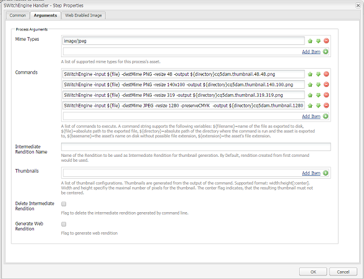

# Bibliothèque ITL {#imaging-transcoding-library}

La bibliothèque ITL (Imaging Transcoding Library) d’Adobe est une solution de traitement d’images propriétaire qui effectue des fonctions de gestion d’images essentielles, notamment :

* Encodage
* Transcodage (conversion des formats pris en charge)
* Rééchantillonnage d’images à l’aide des algorithmes PS et Intel IPP
* Préservation de la résolution binaire et du profil colorimétrique
* Qualité JPEG, compression
* Redimensionnement de l’image

La bibliothèque de transcodage d’images fournit la prise en charge CMJN et la prise en charge alpha complète, à l’exception de CMJN-Alpha.

Outre la prise en charge d’un large éventail de formats de fichier et de  de, la bibliothèque de transcodage d’images présente des avantages significatifs par rapport aux autres solutions tierces en matière de performances, d’évolutivité et de qualité. Voici quelques-uns des principaux avantages de l’utilisation de la bibliothèque de transcodage d’images :

* **Mise à l’échelle avec augmentation de la taille ou de la résolution du fichier** : la mise à l’échelle est principalement réalisée grâce à la fonctionnalité ITL brevetée de redimensionnement des fichiers lors de leur décodage. Cette capacité garantit que l’utilisation de la mémoire d’exécution est toujours optimale et n’est pas une fonction quadratique de l’augmentation de la taille du fichier ou de la résolution de l’image. La bibliothèque ITL peut traiter des fichiers haute résolution plus volumineux et haute résolution (contenant un nombre supérieur de mégapixels). Les outils tiers, tels qu’ImageMagick, ne peuvent pas gérer les fichiers volumineux et les blocages système lors du traitement de ces fichiers.
* **Algorithmes de compression de la qualité et du redimensionnement Photoshop** : cohérence avec les normes du secteur en terme de qualité de l’échantillonnage descendant (lisse, pointu et bicubique automatique) et de la qualité de compression. La bibliothèque de transcodage d’images évalue en outre le facteur de qualité de l’image d’entrée et utilise intelligemment des tableaux et des paramètres de qualité optimaux pour l’image de sortie. Cela permet de produire des fichiers de taille optimale sans compromettre la qualité visuelle.
* **Débit élevé :** Le temps de réponse est inférieur et le débit est constamment supérieur à ImageMagick. Par conséquent, la bibliothèque de transcodage d’images doit réduire le temps d’attente des utilisateurs et le coût de l’hébergement.
* **Optimisez l’évolutivité avec la charge simultanée :** La bibliothèque de transcodage d’images fonctionne de manière optimale dans des conditions de chargement simultanées. La bibliothèque offre un débit élevé avec une performance du processeur et une utilisation de la mémoire optimaux, et un temps de réponse faible, ce qui permet de réduire le coût de l’hébergement.

## Plateformes prises en charge {#supported-platforms}

La bibliothèque de transcodage d’images est disponible uniquement pour les distributions RHEL 7 et CentOS 7.

>[!NOTE]
>
>Les systèmes Mac OS et autres distributions de type *nix (par exemple, Debian et Ubuntu) ne sont pas pris en charge.

## Utilisation {#usage}

Les arguments de ligne de commande de la bibliothèque ITL peuvent inclure les éléments suivants :

```shell
 -destMime PNG/JPEG: Mime type of output rendition
 -BitDepth 8/16: Preserves Bit Depth. Bitdepth ‘4’ is automatically converted to ‘8’
 -preserveBitDepth: Downscales Bit Depth (No upscaling)
 -preserveCMYK: Preserves CMYK color space
 -jpegQuality: Provides jpeg quality parameter (0-12 , corresponding to Photoshop qualities)
 -ResamplingMethod BiCubic/Lanczos/PSBicubic: Provides resampling methods. PSBicubic is a Photoshop quality resampling method.
 -resize
```

You can configure the following options for the `-resize` parameter:

* `X`: `Works similar to AEM. For example -resize 319.`
* `WxH`: `Aspect Ratio will not be maintained, For example -resize 319X319.`
* `Wx`: `Fixes the width and calculates the height maintaining the aspect ratio. For example -resize 319x.`
* `xH`: `Fixes the height and calculates the width maintaining the aspect ratio. For example -resize x319.`

```shell
 -AllowUpsampling (Resizes smaller images)
 -input <fileName>
 -output <fileName>
```

## Configuration de la bibliothèque ITL {#configuring-imaging-transcoding-library}

Pour configurer le traitement ITL, créez un fichier de configuration et mettez à jour le processus pour l’exécuter.

### Créer un fichier de configuration pour le lot extrait {#create-conf-file}

Pour configurer la bibliothèque, créez un fichier .conf pour indiquer les bibliothèques à l’aide des étapes suivantes. Vous avez besoin d’autorisations d’administrateur ou de root.

1. Download the [Imaging Transcoding Library package](https://www.adobeaemcloud.com/content/marketplace/marketplaceProxy.html?packagePath=/content/companies/public/adobe/packages/aem630/product/assets/aem-assets-imaging-transcoding-library-pkg) and install it using the Package Manager. Le package est compatible avec AEM 6.5.

1. Pour connaître un ID d’assemblage pour `com.day.cq.dam.cq-dam-switchengine`, connectez-vous à la console Web et appuyez sur **[!UICONTROL OSGi > Bundles]**. Vous pouvez également ouvrir la console des lots en accédant à `https://[aem_server:[port]/system/console/bundles/` l’URL. Localisez le `com.day.cq.dam.cq-dam-switchengine` lot et son ID.

1. Assurez-vous que toutes les bibliothèques requises sont extraites en vérifiant le dossier à l’aide de la commande `ls -la /aem65/author/crx-quickstart/launchpad/felix/bundle<id>/data/binaries/`, où le nom du dossier est créé à l’aide de l’ID d’assemblage. Par exemple, la commande est `ls -la /aem65/author/crx-quickstart/launchpad/felix/bundle588/data/binaries/` si l’ID d’assemblage est `588`.

1. Créez un `SWitchEngineLibs.conf` fichier à lier à la bibliothèque.

   ```shell
   cd `/etc/ld.so.conf.d`
   touch SWitchEngineLibs.conf
   vi SWitchEngineLibs.conf
   ```

1. Ajouter `/aem65/author/crx-quickstart/launchpad/felix/bundle<id>/data/binaries/` chemin d’accès au fichier conf à l’aide de `cat SWitchEngineLibs.conf` la commande.

1. Exécutez `ldconfig` la commande pour créer les liens et le cache nécessaires.

1. Dans le compte utilisé pour  AEM, modifiez `.bash_profile` le fichier. Ajouter `LD_LIBRARY_PATH` en ajoutant ce qui suit.

   ```shell
   LD_LIBRARY_PATH=.
   export LD_LIBRARY_PATH
   ```

1. Pour vous assurer que la valeur du chemin est définie sur `.`, utilisez `echo $LD_LIBRARY_PATH` command. La sortie ne devrait être que `.`. Si la valeur n’est pas définie sur `.`, redémarrez la session.

### Configuration du processus de mise à jour des ressources  DAM {#configure-dam-asset-update-workflow}

Mettez à jour le flux de travail [!UICONTROL DAM Update Asset] afin d’utiliser la bibliothèque pour le traitement des images.

1. Appuyez/cliquez sur le logo AEM et accédez à **[!UICONTROL Outils > Workflow > Modèles]**.

1. From the **[!UICONTROL Workflow Models]** page, open the **[!UICONTROL DAM Update Asset]** workflow model in edit mode.

1. Open the **[!UICONTROL Process Thumbnails]** workflow process step. In the **[!UICONTROL Thumbnails]** tab, add the MIME types for which you want to skip the default thumbnail generation process in the **[!UICONTROL Skip Mime Types]** list.
For example, if you want to create thumbnails for a TIFF image using Imaging Transcoding Library, specify `image/tiff` in the **[!UICONTROL Skip Mime Types]** field.

1. Dans l’onglet **[!UICONTROL Image Web]**, ajoutez les types MIME pour lesquels vous souhaitez ignorer le processus de génération de rendu web par défaut dans **[!UICONTROL Liste à ignorer]**. For example, if you skipped MIME type `image/tiff` in the above step, add `image/tiff` to the skip list.

1. Open the **[!UICONTROL EPS thumbnails (powered by ImageMagick)]** step, navigate to the **[!UICONTROL Arguments]** tab. In the **[!UICONTROL Mime Types]** list, add the MIME types you want Imaging Transcoding Library to process. For example, if you skipped the MIME type `image/tiff` in the above step, add `image/jpeg` to the **[!UICONTROL Mime Types]** list.

1. Supprimez les commandes par défaut, le cas échéant.

1. Active/désactive le panneau latéral et ajoute le **[!UICONTROL gestionnaire SWitchEngine]** à la liste des étapes.

1. Ajouter des commandes au gestionnaire [!UICONTROL SwitchEngine] en fonction de vos besoins personnalisés. Réglez les paramètres des commandes que vous spécifiez pour répondre à vos besoins. Par exemple, si vous souhaitez préserver le profil colorimétrique de votre image JPEG, ajoutez les commandes suivantes à la liste **[!UICONTROL Commandes]** :

   * `SWitchEngine -input ${file} -destMime PNG -resize 48 -output ${directory}cq5dam.thumbnail.48.48.png`
   * `SWitchEngine -input ${file} -destMime PNG -resize 140x100 -output ${directory}cq5dam.thumbnail.140.100.png`
   * `SWitchEngine -input ${file} -destMime PNG -resize 319 -output ${directory}cq5dam.thumbnail.319.319.png`
   * `SWitchEngine -input ${file} -destMime JPEG -resize 1280 -preserveCMYK -output ${directory}cq5dam.web.1280.1280.jpeg`
   

1. (Facultatif) Générez des miniatures à partir d’un rendu intermédiaire à l’aide d’une seule commande. Le rendu intermédiaire sert de source pour générer des rendus statiques et des rendus web. Cette méthode est plus rapide que la méthode précédente. Toutefois, vous ne pouvez pas appliquer de paramètres personnalisés aux miniatures à l’aide de cette méthode.

   

1. Pour générer des rendus Web, configurez les paramètres dans l’onglet Image **[!UICONTROL activée pour le]** Web.

1. Synchronisez le modèle de flux de travaux [!UICONTROL DAM Update Asset] mis à jour. Enregistrez le workflow.

Vérifiez la configuration, téléchargez une image TIFF et surveillez le fichier error.log. Vous remarquerez `INFO` les messages avec des mentions de `SwitchEngineHandlingProcess execute: executing command line`. Les journaux mentionnent les rendus générés. Une fois le processus terminé, vous pouvez  les nouveaux rendus dans AEM.

>[!MORELIKETHIS]
>
>* [Article sur les types MIME pris en charge](assets-formats.md#supported-image-transcoding-library)