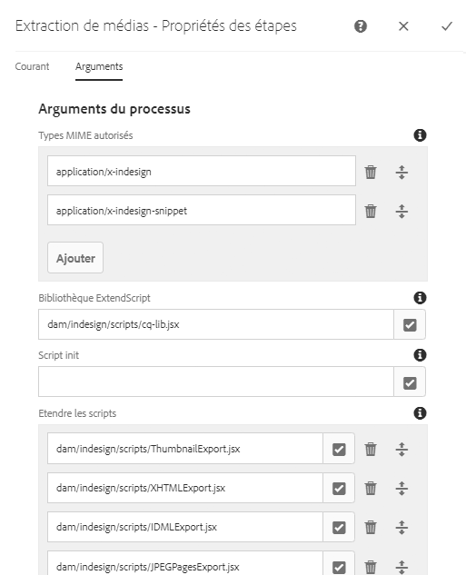
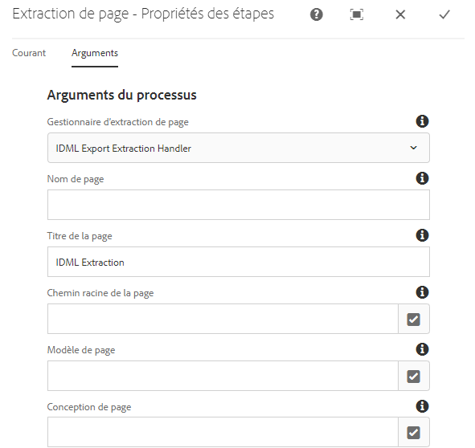
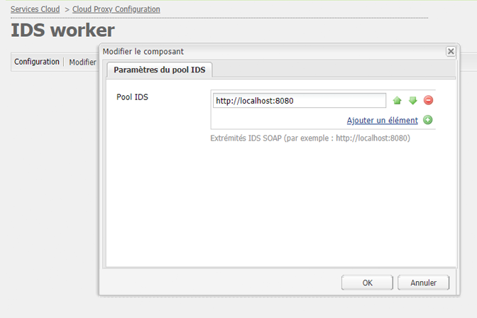

# Intégration [!DNL Adobe Experience Manager Assets] de [!DNL Adobe InDesign Server] {#integrating-aem-assets-with-indesign-server}

[!DNL Adobe Experience Manager Assets] utilise:

* Un proxy pour distribuer la charge de certaines tâches de traitement. A proxy is an [!DNL Experience Manager] instance that communicates with a proxy worker to fulfil a specific task, and other [!DNL Experience Manager] instances to deliver the results.
* Le programme de traitement du proxy définit et gère une tâche spécifique.
These can cover a wide variety of tasks; for example, using an [!DNL InDesign Server] to process files.

To fully upload files to [!DNL Experience Manager Assets] that you have created with [!DNL Adobe InDesign] a proxy is used. This uses a proxy worker to communicate with the [!DNL Adobe InDesign Server], where [scripts](https://www.adobe.com/devnet/indesign/documentation.html#idscripting) are run to extract metadata and generate various renditions for [!DNL Experience Manager Assets]. The proxy worker enables the two-way communication between the [!DNL InDesign Server] and the [!DNL Experience Manager] instance(s) in a cloud configuration.

>[!NOTE]
>
>[!DNL Adobe InDesign] est proposé sous forme de deux offres distinctes. [Application de bureau Adobe InDesign](https://www.adobe.com/fr/products/indesign.html) qui permet de concevoir des mises en page pour l’impression et la distribution numérique. [Adobe InDesign Server](https://www.adobe.com/fr/products/indesignserver.html) vous permet de créer par programmation des documents automatisés en fonction de ce que vous avez créé [!DNL InDesign]. Il fonctionne comme un service offrant une interface à son moteur [ExtendScript](https://www.adobe.com/devnet/scripting.html) . Les scripts sont écrits dans [!DNL ExtendScript], ce qui est similaire à [!DNL JavaScript]la méthode. For information about [!DNL InDesign] scripts see [https://www.adobe.com/devnet/indesign/documentation.html#idscripting](https://www.adobe.com/devnet/indesign/documentation.html#idscripting).

## How the extraction works {#how-the-extraction-works}

The [!DNL Adobe InDesign Server] can be integrated with [!DNL Experience Manager Assets] so that INDD files created with [!DNL InDesign] can be uploaded, renditions generated, all media extracted (for example, video) and stored as assets:

>[!NOTE]
>
>Previous versions of [!DNL Experience Manager] were able to extract XMP and the thumbnail, now all media can be extracted.

1. Upload your INDD file to [!DNL Experience Manager Assets].
1. A framework sends command script(s) to the [!DNL InDesign Server] via SOAP (Simple Object Access Protocol).
Ce script de commande permet d’effectuer les opérations suivantes :

   * Récupérer le fichier INDD.
   * Exécuter [!DNL InDesign Server] les commandes :

      * La structure, le texte et tous les fichiers multimédias sont extraits.
      * Des rendus PDF et JPG sont générés.
      * Des rendus HTML et IDML sont générés.
   * Post the resulting files back to [!DNL Experience Manager Assets].
   >[!NOTE]
   >
   >IDML est un format XML qui effectue le rendu de tout le contenu du [!DNL InDesign] fichier. It is stored as an compressed package using [ZIP](https://www.techterms.com/definition/zip) compression. Pour plus d’informations, voir Formats d’échange [InDesign INX et IDML](http://www.peachpit.com/articles/article.aspx?p=1381880&amp;seqNum=8).

   >[!CAUTION]
   >
   >If the [!DNL InDesign Server] is not installed or not configured, then you can still upload an INDD file into [!DNL Experience Manager]. Toutefois, les rendus générés seront limités aux formats PNG et JPEG. Vous ne pourrez pas générer de code HTML ou .idml, ni générer des rendus de page.

1. Après l’extraction et la génération du rendu :

   * La structure est identique à `cq:Page` (type de rendu).
   * Le texte et les fichiers extraits sont stockés dans [!DNL Experience Manager Assets].
   * All renditions are stored in [!DNL Experience Manager Assets], in the asset itself.

## Intégration de la variable [!DNL InDesign Server] avec AEM {#integrating-the-indesign-server-with-aem}

To integrate the [!DNL InDesign Server] for use with [!DNL Experience Manager Assets] and after configuring your proxy, you need to:

1. [Installer InDesign Server](#installing-the-indesign-server).
1. If required, [configure the Experience Manager Assets Workflow](#configuring-the-aem-assets-workflow).
Cette opération n’est nécessaire que si les valeurs par défaut ne sont pas adaptées à votre instance.
1. Configurer un [programme de traitement du proxy pour InDesign Server](#configuring-the-proxy-worker-for-indesign-server).

### Installez le [!DNL InDesign Server] {#installing-the-indesign-server}

To install and start the [!DNL InDesign Server] for use with [!DNL Experience Manager]:

1. Download and install the [!DNL InDesign Server].

1. If required, you can customize the configuration of your [!DNL InDesign Server] instance.

1. À partir de la ligne de commande, démarrez le serveur :

   `<*ids-installation-dir*>/InDesignServer.com -port 8080`

   Cela démarre le serveur avec le module complémentaire SOAP en écoute sur le port 8080. Tous les messages de journal et les résultats sont écrits directement dans la fenêtre de commande.

   >[!NOTE]
   >
   >Si vous souhaitez enregistrer les messages de sortie vers un fichier, puis utiliser une redirection ; par exemple, sous Windows :
   >`<ids-installation-dir>/InDesignServer.com -port 8080 > ~/temp/INDD-logfile.txt 2>&1`

### Configuration du [!DNL Experience Manager Assets] processus {#configuring-the-aem-assets-workflow}

[!DNL Experience Manager Assets] dispose d&#39;une ressource **[!UICONTROL de mise à jour]** DAM de processus préconfigurée, qui comprend plusieurs étapes de processus spécifiques pour [!DNL InDesign]:

* [Extraction de médias](#media-extraction)
* [Extraction de page  ](#page-extraction)

Ce processus est configuré avec les valeurs par défaut qui peuvent être adaptées à votre configuration pour diverses instances d’auteur (il s’agit d’un processus standard, aussi des informations supplémentaires sont disponibles sous [Modifier un processus](/help/sites-developing/workflows-models.md#configuring-a-workflow-step)). Si vous utilisez les valeurs par défaut (y compris le port SOAP), aucune configuration n’est nécessaire.

After the setup, uploading [!DNL InDesign] files into [!DNL Experience Manager Assets] (by any of the usual methods) triggers the workflow to process the asset and prepare the various renditions. Test your configuration by uploading an INDD file into [!DNL Experience Manager Assets] to confirm that you see the different renditions created by IDS under `<*your_asset*>.indd/Renditions`

#### Media extraction {#media-extraction}

Cette étape commande l’extraction de médias à partir du fichier INDD.

Pour la personnaliser, vous pouvez modifier l’onglet **[!UICONTROL Arguments]** dans l’étape **[!UICONTROL Extraction de médias]**.

Arguments d’extraction de médias et chemins de scripts

* **Bibliothèque** ExtendScript : Il s’agit d’une simple bibliothèque de méthodes get/post http, requise par les autres scripts.

* **Étendre les scripts**: Vous pouvez spécifier différentes combinaisons de script ici. If you want your own scripts to be executed on the [!DNL InDesign Server], save the scripts at `/apps/settings/dam/indesign/scripts`.

Pour plus d’informations sur les scripts Indesign, reportez-vous à la documentation destinée aux développeurs [InDesign.](https://www.adobe.com/devnet/indesign/documentation.html#idscripting)

>[!CAUTION]
>
>Ne modifiez pas la bibliothèque ExtendScript. Cette bibliothèque fournit la fonctionnalité HTTP requise pour communiquer avec Sling. This setting specifies the library to be send to the [!DNL InDesign Server] for use there.

The `ThumbnailExport.jsx` script run by the Media Extraction workflow step generates a thumbnail rendition in JPG format. Ce rendu est utilisé par l’étape du workflow Miniatures des processus afin de générer les rendus statiques requis par [!DNL Experience Manager].

Vous pouvez configurer l’étape du workflow Miniatures des processus de manière à générer des rendus statiques de différentes tailles. Ensure that you do not remove the defaults, because they are required by the [!DNL Experience Manager Assets] interface. Enfin, l’étape de flux de travaux Supprimer le rendu de Prévisualisation d’images supprime le rendu de miniature JPG, car il n’est plus nécessaire.

#### Page extraction {#page-extraction}

This creates an [!DNL Experience Manager] page from the extracted elements. Un gestionnaire d’extraction est utilisé pour extraire les données d’un rendu (actuellement HTML ou IDML). Ces données sont ensuite utilisées pour créer une page avec PageBuilder.

Pour la personnaliser, vous pouvez modifier l’onglet **[!UICONTROL Arguments]** dans l’étape **[!UICONTROL Extraction de page]**.

* **Gestionnaire** d&#39;Extractions de page : Dans la liste contextuelle, sélectionnez le gestionnaire à utiliser. Un gestionnaire d’extraction fonctionne sur un rendu spécifique, sélectionné par un `RenditionPicker` associé (voir l’API `ExtractionHandler`).
In a standard [!DNL Experience Manager] installation the following is available:
   * IDML Export Extraction Handle: Operates on the `IDML` rendition generated in the MediaExtract step.

* **Nom** de page : Indiquez le nom que vous souhaitez attribuer à la page résultante. Si vous laissez le champ vide, le nom est « page » (ou une variante si « page » existe déjà).

* **Titre** de la page : Indiquez le titre que vous souhaitez affecter à la page résultante.

* **Chemin** racine de la page : Chemin d’accès à l’emplacement racine de la page résultante. Si vous laissez le champ vide, le nœud contenant les rendus de la ressource sera utilisé.

* **Modèle** de page : Modèle à utiliser lors de la génération de la page résultante.

* **Conception** de page : Conception de page à utiliser lors de la génération de la page résultante.

### Configuration du proxy worker pour [!DNL InDesign Server] {#configuring-the-proxy-worker-for-indesign-server}

>[!NOTE]
>
>Le programme de traitement réside sur une instance de proxy.

1. Dans la console Outils, développez **[!UICONTROL Configurations Cloud Services]** dans le volet de gauche. Développez ensuite **[!UICONTROL Configuration de proxy Cloud]**.

1. Double-cliquez sur **[!UICONTROL IDS Worker]** pour ouvrir la configuration.

1. Cliquez sur **[!UICONTROL Modifier]** pour ouvrir la boîte de dialogue de configuration et définir les paramètres requis :

   

   * **Pool IDS**
Points d’extrémité SOAP à utiliser pour communiquer avec [!DNL InDesign Server]. Vous pouvez ajouter, supprimer ou trier les éléments au besoin.

1. Cliquez sur OK pour enregistrer.

###  de Day CQ Link Externalizer{#configuring-day-cq-link-externalizer}

If the [!DNL InDesign Server] and [!DNL Experience Manager] run on different hosts or either or both these applications do not run on default ports, configure [!UICONTROL Day CQ Link Externalizer] to set the host name, port, and content path for the [!DNL InDesign Server].

1. Access the Web Console at `https://[aem_server]:[port]/system/console/configMgr`.
1. Locate the configuration **[!UICONTROL Day CQ Link Externalizer]**, and click **[!UICONTROL Edit]** to open it.
1. Specify the host name and context path for the [!DNL Indesign Server] and click **Save**.

   

### Activer le traitement des tâches parallèles pour [!DNL InDesign Server] {#enabling-parallel-job-processing-for-indesign-server-s}

Vous pouvez désormais activer le traitement parallèle des tâches pour IDS. Déterminer le nombre maximal de tâches parallèles (`x`) qu’une [!DNL InDesign Server] peut traiter :

* On a single multiprocessor machine, the maximum number of parallel jobs (`x`) that an [!DNL InDesign Server] can process is one less than the number of processors running IDS.
* Lorsque vous exécutez IDS sur plusieurs machines, vous devez compter le nombre total de processeurs disponibles (sur chaque ordinateur) et soustraire le nombre total d’ordinateurs.

Pour configurer le nombre de tâches parallèles d’IDS :

1. Ouvrez l’onglet **[!UICONTROL Configurations]** de la console Felix ; par exemple :   `https://[aem_server]:[port]/system/console/configMgr`.

1. Select the IDS processing queue under `Apache Sling Job Queue Configuration`.

1. Définissez :

   * **Type** - `Parallel`
   * **Nombre max. de tâches parallèles** - `<*x*>` (conformément au calcul ci-dessus)

1. Enregistrez ces modifications.
1. Pour activer la prise en charge de plusieurs sessions pour Adobe CS6 et versions ultérieures, cochez `enable.multisession.name` la case, sous `com.day.cq.dam.ids.impl.IDSJobProcessor.name` configuration.
1. Créez un [groupe de `x` traitement IDS en ajoutant des points d’extrémité SOAP à la configuration du traitement IDS](#configuring-the-proxy-worker-for-indesign-server).

   If there are multiple machines running [!DNL InDesign Server], add SOAP endpoints (number of processors per machine -1) for each machine.

   >[!NOTE]
   >
   >Vous pouvez activer la mise sur liste noire du traitement IDS lorsque vous travaillez avec un groupe de programmes de traitement.
   >
   >
   >To do so, enable the **[!UICONTROL enable.retry.name]** checkbox, under the `com.day.cq.dam.ids.impl.IDSJobProcessor.name` configuration, which enables IDS job retrials.
   >
   >
   >Also, under the `com.day.cq.dam.ids.impl.IDSPoolImpl.name` configuration, set a positive value for `max.errors.to.blacklist` parameter which determines number of job retrials before barring an IDS from the job handlers list.
   >
   >
   >Par défaut, le traitement IDS est revalidé après une durée en minutes configurable (retry.interval.to.whitelist.name). Si le programme de traitement est en ligne, il est retiré de la liste noire..

## Activation de la prise en charge de la version [!DNL InDesign Server] 10.0 ou ultérieure {#enabling-support-for-indesign-server-or-later}

For [!DNL InDesign Server] 10.0 or higher, perform the following steps to enable multi-session support.

1. Open Configuration Manager from your [!DNL Experience Manager Assets] instance `https://[aem_server]:[port]/system/console/configMgr`.
1. Modifiez la configuration de `com.day.cq.dam.ids.impl.IDSJobProcessor.name`.
1. Sélectionnez l’option **[!UICONTROL ids.cc.enable]**, puis cliquez sur **[!UICONTROL Enregistrer]**.

>[!NOTE]
>
>For [!DNL InDesign Server] integration with [!DNL Experience Manager Assets], use a multi-core processor because the Session Support feature necessary for the integration is not supported on single core systems.

## Configure [!DNL Experience Manager] credentials {#configure-aem-credentials}

You can change the default administrator credentials (user name and password) for accessing the [!DNL InDesign Server] from your [!DNL Experience Manager] instance without breaking the integration with the [!DNL InDesign Server].

1. Accédez à `/etc/cloudservices/proxy.html`.
1. Dans la boîte de dialogue, indiquez le nouveau nom d’utilisateur et le nouveau mot de passe.
1. Enregistrez les identifiants.

>[!MORELIKETHIS]
>
>* [A propos d’Adobe InDesign Server](https://www.adobe.com/products/indesignserver/faq.html)

