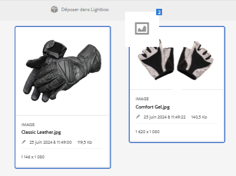

# Lightbox {#lightbox}

Lightbox est un type spécial de collection fournissant un accès aisé aux ressources. Vous pouvez accéder rapidement à Lightbox pour ajouter ou supprimer des ressources. Il sert de galerie d’images personnelle.

Si vous êtes un utilisateur [!DNL Adobe Experience Manager Assets], Lightbox est automatiquement créé lorsque vous vous connectez à l’application pour la première fois. Il est exclusif à votre connexion. Les autres utilisateurs ne peuvent pas accéder à votre Lightbox.

## Ajout de ressources à Lightbox {#adding-assets-to-lightbox}

1. Dans l&#39;interface utilisateur [!DNL Assets], sélectionnez les ressources à ajouter à Lightbox.
1. Faites glisser les ressources jusqu’à la zone **[!UICONTROL Déposer dans Lightbox]**. Relâchez lorsque la zone de dépôt devient principale et que son libellé devient **[!UICONTROL Déposez pour Ajouter]**.

   

1. Dans la boîte de dialogue, cliquez sur **[!UICONTROL Ajouter]**, puis fermez-la pour terminer le processus. Les ressources sélectionnées sont ajoutées à Lightbox.
1. Pour afficher Lightbox, accédez à la console Collections.
1. Cliquez sur **[!UICONTROL Lightbox]** pour vue des ressources qu’il contient.

   >[!NOTE]
   >
   >Bien que Lightbox ressemble à une collection, vous ne pouvez pas effectuer les actions que vous effectuez normalement sur les collections. Par exemple, vous ne pouvez pas supprimer, partager ou afficher des paramètres pour une Lightbox. Vous ne pouvez pas non plus l’ajouter à d’autres collections. Néanmoins, vous pouvez modifier les ressources d’une Lightbox.

## Suppression de fichiers de Lightbox {#removing-assets-from-lightbox}

1. Accédez à la console Collections, cliquez sur Lightbox pour vue de ses ressources.
1. Sélectionnez les ressources à supprimer.
1. Dans la barre d’outils, cliquez sur **[!UICONTROL Supprimer]**.
1. Dans la boîte de dialogue, cliquez sur **[!UICONTROL Supprimer]** pour confirmer l&#39;action de suppression. Les ressources sont supprimées de Lightbox.
