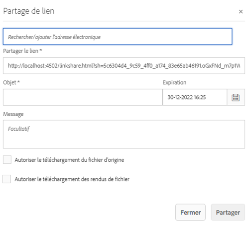

# Partage de ressources en tant que lien {#asset-link-sharing}

| Version | Lien de l’article |
| -------- | ---------------------------- |
| AEM as a Cloud Service | [Cliquez ici](https://experienceleague.adobe.com/docs/experience-manager-cloud-service/content/assets/manage/share-assets.html?lang=fr) |
| AEM 6.5 | Cet article |

[!DNL Adobe Experience Manager Assets] vous permet de partager des ressources, des dossiers et des collections sous forme d’URL avec des collaborateurs de l’entreprise et des tiers, notamment des partenaires et des fournisseurs. Le partage de ressources au moyen d’un lien est très pratique dans la mesure où il permet à des tiers d’y accéder sans avoir besoin de se connecter au préalable à [!DNL Assets].

>[!PREREQUISITES]
>
>* Vous devez disposer de l’autorisation `Edit ACL` pour le dossier ou la ressource que vous souhaitez partager sous forme d’un lien.
>* Pour envoyer des e-mails aux utilisateurs, configurez les détails du serveur SMTP dans le [Service de messagerie Day CQ](#configmailservice).

## Partager des ressources {#share-assets}

Pour générer une URL pour les ressources que vous souhaitez partager avec des utilisateurs, utilisez la boîte de dialogue [!UICONTROL Partage de lien].

* Les utilisateurs disposant de privilèges d’administrateur ou avec des autorisations en lecture à l’emplacement `/var/dam/share` peuvent afficher les liens partagés avec eux.
* Les utilisateurs disposant d’autorisations en lecture à l’emplacement `/var/dam/jobs/download` peuvent télécharger des ressources à partir du lien partagé.

1. Dans l’interface utilisateur d’[!DNL Assets], sélectionnez la ressource à partager sous forme de lien.

1. Dans la barre d’outils, cliquez sur **[!UICONTROL Partager un lien]** . Le lien qui sera créé après avoir cliqué sur **[!UICONTROL Partager]** s’affiche à l’avance dans le champ [!UICONTROL Partager un lien]. Le lien n’est pas créé tant que vous n’avez pas sélectionné **[!UICONTROL Envoyer]**.

   

   *Image : boîte de dialogue permettant de partager des ressources sous la forme d’un lien.*

1. Dans la zone Adresse e-mail de la boîte de dialogue **[!UICONTROL Partage de liens]**, saisissez l’ID d’e-mail de la personne avec laquelle vous souhaitez partager le lien. Vous pouvez ajouter une ou plusieurs personnes.

   >[!NOTE]
   >
   >Si vous saisissez l’ID d’e-mail d’une personne qui ne fait pas partie de votre entreprise, les mots [!UICONTROL Utilisateur externe] sont ajoutés à son ID d’e-mail.

1. Dans la zone **[!UICONTROL Objet]**, indiquez l’objet de la ressource que vous souhaitez partager.

1. Dans la zone **[!UICONTROL Message]**, saisissez un message facultatif.

1. Dans le champ **[!UICONTROL Expiration]**, spécifiez la date et l’heure d’expiration du lien à l’aide du sélecteur de date. Le délai d’expiration par défaut du lien est de 1 jour.

   

1. Pour permettre aux utilisateurs de télécharger la ressource d’origine, sélectionnez **[!UICONTROL Autoriser le téléchargement du fichier d’origine]**. Pour permettre aux utilisateurs de télécharger uniquement les rendus des ressources partagées, sélectionnez **[!UICONTROL Autorise le téléchargement des rendus du fichier]**.

1. Cliquez sur **[!UICONTROL Partager]**. Un message confirme le partage du lien avec les utilisateurs et les utilisatrices par e-mail.

1. Pour afficher la ressource partagée, cliquez sur le lien dans l’e-mail envoyé. Pour générer un aperçu de la ressource, cliquez sur la ressource partagée. Pour fermer l’aperçu, cliquez sur **[!UICONTROL Précédent]**. Si vous avez partagé un dossier, cliquez sur **[!UICONTROL Dossier parent]** pour revenir au dossier parent.

   

   >[!NOTE]
   >
   >[!DNL Experience Manager] prend en charge la génération de l’aperçu des ressources uniquement pour [les types de fichiers pris en charge](/help/assets/assets-formats.md). Si d’autres types MIME sont partagés, vous pouvez uniquement télécharger les ressources et ne pouvez pas les prévisualiser.

1. Pour télécharger la ressource partagée, cliquez sur **[!UICONTROL Sélectionner]** dans la barre d’outils, cliquez sur la ressource, puis sur **[!UICONTROL Télécharger]** dans la barre d’outils.

   

1. Pour afficher les ressources que vous avez partagées en tant que liens, accédez à l’interface utilisateur d’[!DNL Assets], puis cliquez sur le logo [!DNL Experience Manager]. Sélectionnez **[!UICONTROL Navigation]**. Dans le volet Navigation, sélectionnez **[!UICONTROL Liens partagés]** pour afficher la liste des ressources partagées.

1. Pour annuler le partage d’une ressource, sélectionnez-la et cliquez sur **[!UICONTROL Annuler le partage]** dans la barre d’outils. Un message de confirmation apparaît. L’entrée correspondante est supprimée de la liste.

## Configuration du service de messagerie Day CQ {#configure-day-cq-mail-service}

1. Sur la [!DNL Experience Manager] page d’accueil, accédez à **[!UICONTROL Outils]** > **[!UICONTROL Opérations]** > **[!UICONTROL Console web]**.
1. Dans la liste des services, recherchez le **[!UICONTROL service de messagerie Day CQ]**.
1. Cliquez sur **[!UICONTROL Modifier]** en regard du service, puis configurez les paramètres suivants pour le **[!UICONTROL service de messagerie Day CQ]** avec les détails mentionnés par rapport à leur nom :

   * Nom d’hôte du serveur SMTP : nom d’hôte du serveur de messagerie
   * Port du serveur SMTP : port du serveur de messagerie
   * Utilisateur SMTP : nom d’utilisateur du serveur de messagerie
   * Mot de passe SMTP : mot de passe du serveur de messagerie

   

1. Cliquez sur **[!UICONTROL Enregistrer]**.

## Configuration de la taille maximale des données {#configure-maximum-data-size}

Lorsque vous téléchargez des ressources via le lien partagé avec la fonction Partage de lien, [!DNL Experience Manager] compresse l’intégralité de la hiérarchie de cette ressource depuis le référentiel et renvoie la ressource sous forme de fichier ZIP. Toutefois, en l’absence de limite à la quantité de données pouvant être compressées dans un fichier ZIP, il est possible que des volumes de données considérables à compresser entraînent des erreurs d’insuffisance de mémoire dans JVM. Afin de protéger le système contre une potentielle attaque par déni de service (DoS) résultant de cette situation, configurez la taille maximale à l’aide du paramètre **[!UICONTROL Taille max. de contenu (sans compression)]** pour le **[!UICONTROL servlet proxy du partage de ressource adhoc de la gestion des ressources numériques Day CQ]** dans le gestionnaire de configuration. Si la taille non compressée de la ressource dépasse la valeur configurée, les demandes de téléchargement sont rejetées. La valeur par défaut est de 100 Mo.

1. Cliquez sur le logo [!DNL Experience Manager] puis accédez à **[!UICONTROL Outils]** > **[!UICONTROL Opérations]** > **[!UICONTROL Console web]**.
1. Dans la console web, recherchez la configuration du **[!UICONTROL servlet proxy du partage de ressource adhoc de la gestion des ressources numériques Day CQ]**.
1. Ouvrez la configuration **[!UICONTROL servlet proxy du partage de ressource adhoc de la gestion des ressources numériques Day CQ]** en mode d’édition, puis modifiez la valeur du paramètre **[!UICONTROL Taille max. de contenu (sans compression)]**.

   

1. Enregistrez les modifications.

## Bonnes pratiques et résolution des problèmes {#best-practices-and-troubleshooting}

* Les collections ou les dossiers de ressources dont le nom contient un espace blanc risquent de ne pas être partagés.
* Si des personnes ne peuvent pas télécharger les ressources partagées, contactez votre équipe d’administration [!DNL Experience Manager] pour connaître les [limites de téléchargement](#configure-maximum-data-size).
* Si vous ne pouvez pas envoyer d’e-mail avec des liens vers des ressources partagées ou si les autres personnes ne peuvent pas recevoir votre e-mail, contactez votre équipe d’administration [!DNL Experience Manager] pour savoir si le [service de messagerie](#configure-day-cq-mail-service) est configuré ou non.
* Si vous ne pouvez pas partager des fichiers à l’aide de la fonctionnalité de partage de liens, assurez-vous que vous disposez des autorisations appropriées. Voir [Partager des fichiers](#share-assets).
* Si une ressource partagée est déplacée vers un autre emplacement, son lien cesse de fonctionner. Recréez ce lien et partagez-le de nouveau avec les utilisateurs.

* Si vous souhaitez partager des liens depuis votre déploiement auteur [!DNL Experience Manager] vers des entités externes, assurez-vous de ne présenter les URL suivantes que pour des requêtes de type `GET` (spécifiquement utilisées pour le partage de liens). Bloquez les autres URL pour des raisons de sécurité.

   * `http://[aem_server]:[port]/linkshare.html`
   * `http://[aem_server]:[port]/linksharepreview.html`
   * `http://[aem_server]:[port]/linkexpired.html`

  Dans l’interface d’[!DNL Experience Manager], accédez à **[!UICONTROL Outils]** > **[!UICONTROL Opérations]** > **[!UICONTROL Console web]**. Ouvrez la configuration de **[!UICONTROL l’externaliseur de liens Day CQ]** et modifiez les propriétés suivantes dans le champ **[!UICONTROL Domaines]** avec les valeurs correspondantes pour : `local`, `author` et `publish`. Pour les propriétés `local` et `author`, saisissez respectivement l’URL du site local et l’URL de l’instance d’auteur. Si vous exécutez une seule Instance de création [!DNL Experience Manager], utilisez la même valeur pour les propriétés `local` et `author`. Pour les instances de Publication, indiquez l’URL de l’instance de publication [!DNL Experience Manager].
