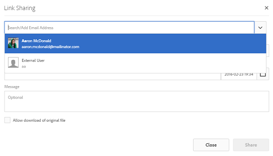
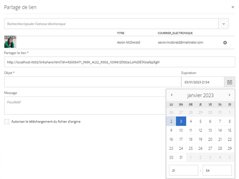
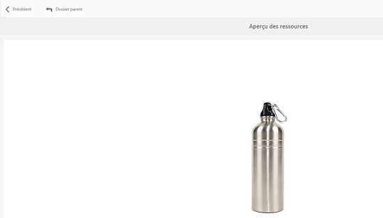
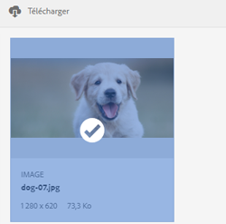

# Partage d’un fichier via un lien {#asset-link-sharing}

Adobe Experience Manager (AEM) Assets vous permet de partager des ressources, des dossiers et des collections sous forme d’URL avec des collaborateurs dans l’entreprise et des tiers, notamment des partenaires et des fournisseurs. Le partage de ressources au moyen d’un lien est très pratique dans la mesure où il permet à des tiers d’y accéder sans avoir besoin de se connecter au préalable à AEM Assets.

>[!NOTE]
>
>Vous devez disposer de l’autorisation Modifier la liste de contrôle d’accès sur le dossier ou la ressource que vous souhaitez partager en tant que lien.

## Partage de ressources {#sharelink}

Pour générer une URL pour les ressources que vous souhaitez partager avec des utilisateurs, utilisez la boîte de dialogue Partage de lien. Les utilisateurs disposant de privilèges d’administrateur ou avec des autorisations de lecture à l’emplacement `/var/dam/share` peuvent afficher les liens partagés avec eux.

>[!NOTE]
>
>Avant de partager un lien avec des utilisateurs, assurez-vous que le service de messagerie Day CQ est bien configuré. Une erreur se produira si vous tentez de partager un lien sans d’abord [configurer le service de messagerie DAY CQ](/help/assets/link-sharing.md#configmailservice).

1. Dans l’interface utilisateur Assets, sélectionnez la ressource à partager sous forme de lien.
1. From the toolbar, click/tap the **[!UICONTROL Share Link]** .

   Le lien de la ressource est créé automatiquement dans le champ **[!UICONTROL Partager le lien]**. Copiez ce lien et partagez-le avec les utilisateurs. Le délai d’expiration par défaut du lien est de 1 jour.

   

   *Figure : Boîte de dialogue de partage de fichiers sous forme de lien.*

   Vous pouvez également effectuer les étapes 3 à 7 de cette procédure pour ajouter des destinataires de courrier électronique, configurer le délai d’expiration du lien et l’envoyer à partir de la boîte de dialogue.

   >[!NOTE]
   >
   >If you want to share links from your AEM Author instance to external entities, ensure that you only expose the following URLs (which are used for link sharing) for `GET` requests only. Bloquez d’autres URL pour garantir la sécurité d’AEM Author.
   >
   >* http://&lt;serveur_aem>:&lt;port>/linkshare.html
   * http://&lt;serveur_aem>:&lt;port>/linksharepreview.html
   * http://&lt;serveur_aem>:&lt;port>/linkexpired.html

   >[!NOTE]
   Si une ressource partagée est déplacée vers un autre emplacement, son lien cesse de fonctionner. Recréez ce lien et partagez-le de nouveau avec les utilisateurs.

1. In AEM interface, access **[!UICONTROL Tools]** > **[!UICONTROL Operations]** > **[!UICONTROL Web Console]**.

1. Open the **[!UICONTROL Day CQ Link Externalizer]** configuration and modify the following properties in the **[!UICONTROL Domains]** field with the values mentioned against `local`, `author`, and `publish`. For the `local` and `author` properties, provide the URL for the local and the author instance respectively. Both `local` and `author` properties have the same value if you run a single Experience Manager Author instance. For `publish`, provide the URL for the Experience Manager publish instance.

1. Dans la zone Adresse électronique de la boîte de dialogue **[!UICONTROL Partage de liens]**, saisissez l’ID de courrier électronique de l’utilisateur avec lequel vous souhaitez partager le lien. Vous pouvez également partager le lien avec plusieurs utilisateurs.

   Si l’utilisateur fait partie de votre entreprise, sélectionnez son ID de message électronique dans la liste des ID de message électronique suggérés, affichée sous la zone de saisie. Dans le cas d’un utilisateur externe, saisissez l’ID de message électronique complet puis sélectionnez-le dans la liste.

   Pour que les courriers électroniques soient envoyés aux utilisateurs, configurez les détails de serveur SMTP dans le [service de messagerie Day CQ](#configmailservice).

   

   *Figure : Partagez des liens vers des ressources directement depuis la boîte de dialogue Partage[!UICONTROL de]liens.*

   >[!NOTE]
   If you enter an email ID of a user that is not a member of your organization, the words [!UICONTROL External User] are prefixed with the email ID of the user.

1. In the **[!UICONTROL Subject]** field, enter a subject for the asset you want to share.

1. In the **[!UICONTROL Message]** field, enter an optional message.

1. Dans le champ **[!UICONTROL Expiration]**, spécifiez la date et l’heure d’expiration du lien à l’aide du sélecteur de date. Par défaut, la date d’expiration est définie sur une semaine à compter de la date à laquelle vous partagez le lien.

   

1. Pour autoriser les utilisateurs à télécharger l’image originale avec les rendus, sélectionnez **[!UICONTROL Autoriser le téléchargement du fichier d’origine]**.

   >[!NOTE]
   Par défaut, les utilisateurs peuvent uniquement télécharger les rendus de la ressource que vous partagez sous forme de lien.

1. Cliquez sur **[!UICONTROL Partager]**. Un message confirme le partage du lien avec le ou les utilisateurs par e-mail.
1. Pour afficher la ressource partagée, cliquez/appuyez sur le lien dans le courrier électronique envoyé à l’utilisateur. La ressource partagée s’affiche sur la page **[!UICONTROL Adobe Marketing Cloud]**.

   

   Pour accéder au , cliquez/appuyez sur l’option de mise en page dans la barre d’outils.

1. Pour générer un aperçu de la ressource, cliquez/appuyez sur la ressource partagée. Pour fermer l’aperçu et revenir à la page **[!UICONTROL Marketing Cloud]**, cliquez/appuyez sur **[!UICONTROL Précédent]** dans la barre d’outils. Si vous avez partagé un dossier, cliquez/appuyez sur **[!UICONTROL Dossier parent]** pour revenir au dossier parent.

   

   >[!NOTE]
   AEM prend en charge la génération de l’aperçu des ressources des types MIME suivants : JPG, PNG, GIF, BMP, INDD, PDF et PPT. Vous pouvez uniquement télécharger les ressources des autres types MIME.

1. To download the shared asset, tap **[!UICONTROL Select]** from the toolbar, click/tap the asset, and then click/tap **[!UICONTROL Download]** from the toolbar.

   

1. Pour  les ressources que vous avez partagées en tant que liens, accédez à l’interface utilisateur Ressources et appuyez sur le logo d’Experience Manager. Sélectionnez **[!UICONTROL Navigation]** dans la liste pour afficher le panneau Navigation.
1. Dans le panneau Navigation, sélectionnez **[!UICONTROL Liens partagés]** pour afficher la liste des ressources partagées.
1. Pour annuler le partage d’une ressource, sélectionnez-la et appuyez/cliquez sur **[!UICONTROL Annuler le partage]** dans la barre d’outils. Un message de confirmation s’affiche. L’entrée du fichier est supprimée du .

## Configuration du service service de messagerie Day CQ {#configmailservice}

1. Dans le Experience Manager, accédez à **[!UICONTROL Outils]** > **[!UICONTROL Opérations]** > Console **** Web.
1. Dans la liste des services, recherchez le **[!UICONTROL service de messagerie Day CQ]**.
1. Tap **[!UICONTROL Edit]** beside the service, and configure the following parameters for **[!UICONTROL Day CQ Mail Service]** with the details mentioned against their names:

   * Nom d’hôte du serveur SMTP : nom d’hôte du serveur de messagerie
   * Port du serveur SMTP : port du serveur de messagerie
   * Utilisateur SMTP : nom d’utilisateur du serveur de messagerie
   * Mot de passe SMTP : mot de passe du serveur de messagerie
   

1. Cliquez/appuyez sur **[!UICONTROL Enregistrer]**.

## Configuration de la taille maximale des données   {#maxdatasize}

Lorsque vous téléchargez des ressources via le lien partagé avec la fonction de partage de lien, AEM compresse l’intégralité de la hiérarchie de cette ressource depuis le référentiel et renvoie la ressource sous forme de fichier ZIP. Toutefois, en l’absence de limite à la quantité de données pouvant être compressées dans un fichier ZIP, il est possible que des volumes de données considérables à compresser entraînent des erreurs d’insuffisance de mémoire dans JVM. Afin de protéger le système contre une potentielle attaque par déni de service (DoS) résultant de cette situation, configurez la taille maximale à l’aide du paramètre **[!UICONTROL Taille max. de contenu (sans compression)]** pour le servlet proxy du partage de ressource adhoc de la gestion des ressources numériques Day CQ dans le gestionnaire de configuration.  Si la taille non compressée de la ressource dépasse la valeur configurée, les demandes de téléchargement sont rejetées. La valeur par défaut est de 100 Mo.

1. Cliquez ou appuyez sur le logo AEM puis accédez à **[!UICONTROL Outils]** > **[!UICONTROL Opérations]** > **[!UICONTROL Console web]**.
1. From the Web Console, locate the **[!UICONTROL Day CQ DAM Adhoc Asset Share Proxy Servlet]** configuration.
1. Ouvrez la configuration **[!UICONTROL Day CQ DAM Adhoc Asset Share Proxy Servlet]** en mode d’édition, puis modifiez la valeur du paramètre **[!UICONTROL Taille max. de contenu (sans compression)]**.

   

1. Enregistrez les modifications.

## Bonnes pratiques et résolution des problèmes {#bestpractices}

* Les collections ou les dossiers de ressources dont le nom contient un espace blanc risquent de ne pas être partagés.
* Si les utilisateurs ne peuvent pas télécharger les ressources partagées, contactez votre administrateur AEM pour connaître les [limites de téléchargement](#maxdatasize).
* Si vous ne pouvez pas envoyer de courrier électronique avec des liens vers des ressources partagées ou si les autres utilisateurs ne peuvent pas recevoir votre courrier électronique, contactez votre administrateur AEM pour savoir si le [service de messagerie](#configmailservice) est configuré ou non.
* Si vous ne pouvez pas partager des fichiers à l’aide de la fonctionnalité de partage de liens, assurez-vous que vous disposez des autorisations appropriées. Voir [Partager des fichiers](#sharelink).
