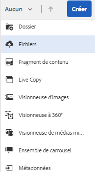
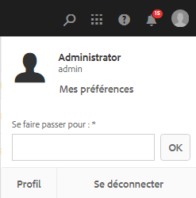

# Gérer vos ressources numériques {#manage-digital-assets}

| Version | Lien de l’article |
| -------- | ---------------------------- |
| AEM as a Cloud Service | [Cliquez ici](https://experienceleague.adobe.com/docs/experience-manager-cloud-service/content/assets/manage/manage-digital-assets.html?lang=fr) |
| AEM 6.5 | Cet article |

Dans [!DNL Adobe Experience Manager Assets], vous pouvez faire plus que stocker et gérer vos ressources. [!DNL Experience Manager] offre des fonctionnalités de gestion des ressources de niveau entreprise. Vous pouvez modifier et partager des ressources, lancer des recherches avancées et créer plusieurs rendus de dizaines de formats de fichiers pris en charge. Vous pouvez également gérer les versions et les droits numériques, automatiser le traitement des ressources, gérer et gouverner les métadonnées, collaborer à l’aide d’annotations, et bien plus.

Cet article décrit les tâches de base de la gestion des ressources, telles que la création ou le chargement, la mise à jour des métadonnées, la copie, le déplacement et la suppression, la publication, la dépublication et la recherche de ressources. Pour comprendre l’interface utilisateur, consultez la [prise en main de l’interface utilisateur d’Assets](/help/sites-authoring/basic-handling.md). Pour gérer les fragments de contenu, consultez les ressources [Gestion des fragments de contenu](/help/assets/content-fragments/content-fragments-managing.md).

## Création de dossiers  {#creating-folders}

Lorsque vous organisez une collection de ressources, comme toutes les images `Nature`, vous pouvez créer des dossiers pour les conserver ensemble. Vous pouvez utiliser des dossiers pour classer et organiser vos ressources. [!DNL Experience Manager Assets] ne nécessite pas de classer les ressources dans des dossiers pour mieux fonctionner.

>[!NOTE]
>
>* Le partage d’un dossier [!DNL Assets] du type `sling:OrderedFolder` n’est pas pris en charge lors du partage vers Experience Cloud. Si vous souhaitez partager un dossier, ne sélectionnez pas [!UICONTROL Ordonné] lors de la création du dossier.
>* [!DNL Experience Manager] n’autorise pas l’utilisation du mot `subassets` comme nom de dossier. Il s’agit d’un mot-clé réservé au nœud qui contient des sous-ressources pour les ressources composites.


1. Dans le dossier Ressources numériques, accédez à l’emplacement où vous souhaitez créer un dossier. Dans le menu, cliquez sur **[!UICONTROL Créer]**. Sélectionnez **[!UICONTROL Nouveau dossier]**.
1. Dans le champ **[!UICONTROL Titre]**, indiquez le nom du dossier. Par défaut, DAM utilise le titre que vous avez fourni comme nom du dossier. Une fois le dossier créé, vous pouvez remplacer la valeur par défaut et spécifier un autre nom de dossier.
1. Cliquez sur **[!UICONTROL Créer]**. Le dossier apparaît dans le dossier Ressources numériques.

Les caractères suivants ne sont pas pris en charge (ils sont répertoriés ici et séparés par des espaces) :

* Le nom d’un fichier de ressource ne peut pas contenir les caractères suivants : `* / : [ \\ ] | # % { } ? &`
* Le nom d’un dossier de ressources ne peut pas contenir les caractères suivants : `* / : [ \\ ] | # % { } ? \" . ^ ; + & \t`

N’incluez pas de caractères spéciaux dans les extensions des noms de fichier des ressources.

## Chargement de ressources {#uploading-assets}

<!-- TBD the following:
Move this section into a new article. CQDOC-14874 ticket is created for this.
In this complete article, replace emphasis with UICONTROL where appropriate.
-->

Vous pouvez charger différents types de ressource (dont des images, des fichiers PDF, des fichiers RAW, etc.) de votre dossier local ou d’un lecteur réseau vers [!DNL Experience Manager Assets].

>[!NOTE]
>
>Dans Dynamic Media en mode Scene7, la taille de fichier de chargement de ressource par défaut est de 2 Go ou moins. Pour configurer le chargement de ressources dont la taille est supérieure à 2 Go (jusque 15 Go), consultez la section [(Facultatif) Configuration de Dynamic Media en mode Scene7 pour le chargement de ressources d’une taille supérieure à 2 Go](/help/assets/config-dms7.md#optional-config-dms7-assets-larger-than-2gb).

Vous pouvez choisir de charger des ressources dans des dossiers auxquels ou sans profil de traitement est affecté.

Pour les dossiers auxquels un profil de traitement est affecté, le nom du profil s’affiche sur la vignette en mode Carte. Dans la vue Liste, le nom du profil s’affiche dans la colonne **Profil de traitement**. Reportez-vous à la section [Profils de traitement](/help/assets/processing-profiles.md).

Avant de charger une ressource, assurez-vous que son [format](/help/assets/assets-formats.md) est pris en charge par [!DNL Experience Manager Assets].

1. Dans l’interface utilisateur [!DNL Assets], accédez à l’emplacement où vous voulez ajouter des ressources numériques.
1. Pour charger les ressources, effectuez l’une des opérations suivantes :

   * Dans la barre d’outils, cliquez sur **[!UICONTROL Créer]**. Ensuite, dans le menu, cliquez sur **[!UICONTROL Fichiers]**. Au besoin, vous pouvez renommer le fichier dans la boîte de dialogue affichée.
   * Dans un navigateur prenant en charge HTML5, faites glisser directement les ressources dans l’interface utilisateur [!DNL Assets]. La boîte de dialogue permettant de renommer les fichiers n’est pas affichée.

   

   Pour sélectionner plusieurs fichiers, sélectionnez la touche `Ctrl` ou `Command` et sélectionnez les ressources dans la boîte de dialogue de sélecteur de fichiers. Si vous utilisez un iPad, vous ne pouvez sélectionner qu’un seul fichier à la fois.

   Vous pouvez suspendre le chargement des ressources volumineuses (dont la taille est supérieure à 500 Mo) et reprendre ultérieurement à partir de la même page. Cliquez sur **[!UICONTROL Pause]** à côté de la barre de progression qui s’affiche au démarrage d’un chargement.

   

La taille au-dessus de laquelle une ressource est considérée comme une ressource volumineuse est configurable. Par exemple, vous pouvez configurer le système de sorte qu’il considère les ressources dont la taille est supérieure à 1 000 Mo (au lieu de 500 Mo) comme des ressources volumineuses. Dans ce cas, le bouton **[!UICONTROL Pause]** figurant dans la barre de progression s’affiche lors du chargement de fichiers d’une taille supérieure à 1 000 Mo.

L’option [!UICONTROL Pause] ne s’affiche pas si un fichier supérieur à 1 000 Mo est chargé avec un fichier inférieur à 1 000 Mo. Toutefois, si vous annulez le chargement du fichier inférieur à 1 000 Mo, l’option **[!UICONTROL Pause]** apparaît.

Pour modifier la limite de taille, configurez la propriété `chunkUploadMinFileSize` du nœud `fileupload` dans le référentiel CRX disponible sur `/apps/dam/gui/content/assets/jcr:content/actions/secondary/create/items/fileupload`.

Lorsque vous cliquez sur **[!UICONTROL Pause]**, vous basculez l’option sur **[!UICONTROL Reprendre]**. Pour reprendre le chargement, cliquez sur **[!UICONTROL Reprendre]**.

Pour annuler une opération de chargement en cours, cliquez sur le bouton de fermeture (`X`) en regard de la barre de progression. Lorsque vous annulez le chargement, [!DNL Assets] supprime la partie partiellement chargée de la ressource.

La possibilité de reprendre le chargement est particulièrement utile dans les scénarios à faible bande passante et les pannes de réseau, où le chargement d’une ressource volumineuse prend beaucoup de temps. Vous pouvez suspendre l’opération de chargement et continuer ultérieurement lorsque la situation s’améliore. Lorsque vous reprenez, le téléchargement commence à partir du point où vous l’avez mis en pause.

Pendant l’opération de chargement, [!DNL Experience Manager] enregistre les parties de la ressource en cours de chargement sous forme de blocs de données dans le référentiel CRX. Une fois le chargement terminé, [!DNL Experience Manager] regroupe ces blocs en un seul bloc de données dans le référentiel.

Pour configurer la tâche de nettoyage pour les tâches de chargement de blocs non terminées, reportez-vous à `https://[aem_server]:[port]/system/console/configMgr/org.apache.sling.servlets.post.impl.helper.ChunkCleanUpTask`.

>[!CAUTION]
>
>Le chargement des blocs est déclenché lorsque la valeur par défaut est de 500 Mo et que la taille du bloc est de 50 Mo. Si vous modifiez la [Configuration du jeton Apache Jackrabbit Oak](https://experienceleague.adobe.com/docs/experience-cloud-kcs/kbarticles/KA-16464.html?lang=fr) et définissez la variable `timeout configuration` à un temps inférieur au temps de chargement d’une ressource, vous rencontrez un délai d’expiration de session pendant le chargement de la ressource. Par conséquent, modifiez les variables `chunkUploadMinFileSize` et `chunksize` afin que chaque requête de bloc actualise la session.
>
>Compte tenu du délai d’expiration des informations d’identification, de la latence, de la bande passante et des chargements simultanés prévus, la valeur qui est sélectionnée est la plus élevée pour vous assurer des éléments suivants :
>
>* Le chargement des blocs est activé pour les fichiers dont la taille risque de provoquer l’expiration des informations d’identification lorsque le chargement est en cours.
>
>* Chaque bloc se termine avant l’expiration des informations d’identification.


Si vous transférez une ressource portant le même nom qu’une ressource déjà disponible à l’emplacement où vous transférez la ressource, un message d’avertissement s’affiche.

Vous pouvez choisir de remplacer une ressource existante, de créer une autre version ou de garder les deux en renommant la nouvelle ressource téléchargée. Si vous remplacez une ressource existante, les métadonnées de la ressource et les modifications antérieures (par exemple les annotations et le recadrage) apportées à une ressource existante sont supprimées. Si vous choisissez de conserver les deux ressources, la nouvelle ressource est renommée en ajoutant le chiffre `1` à son nom.


>[!NOTE]
>
>Lorsque vous sélectionnez **[!UICONTROL Remplacer]** dans la boîte de dialogue [!UICONTROL Conflit de noms], l’ID de la ressource est régénéré pour la nouvelle ressource. Cet ID est différent de celui de la ressource précédente.
>
>Si la fonction Statistiques sur les ressources est activée pour effectuer le suivi des impressions/clics avec [!DNL Adobe Analytics], l’ID de ressource régénéré invalide les données capturées pour la ressource dans [!DNL Analytics].

Si la ressource que vous téléchargez existe dans [!DNL Assets], la boîte de dialogue **[!UICONTROL Doublons détectés]** vous avertit que vous tentez de charger une ressource en double. La boîte de dialogue s’affiche uniquement si la valeur de somme de contrôle `SHA 1` du fichier binaire des ressources existantes correspond à celle de la ressource que vous téléchargez. Dans ce cas, les noms des ressources n’ont pas d’importance.

>[!NOTE]
>
>La boîte de dialogue [!UICONTROL Doublons détectés] ne s’affiche que lorsque la fonctionnalité de détection de doublons est activée. Pour activer la fonctionnalité de détection de doublons, consultez la section [Activation de la détection de doublons](/help/assets/duplicate-detection.md).


Pour conserver le duplicata de ressource dans [!DNL Assets], cliquez sur **[!UICONTROL Conserver]**. Pour supprimer la ressource en double que vous avez chargée, appuyez/cliquez sur **[!UICONTROL Supprimer]**.

[!DNL Experience Manager Assets] vous empêche de charger des ressources dont le nom de fichier contient des caractères interdits. Si vous essayez de charger une ressource dont le nom de fichier contient un ou plusieurs caractères interdits, [!DNL Assets] affiche un message d’avertissement à ce sujet et interrompt l’opération jusqu’à ce que vous supprimiez les caractères concernés ou utilisiez un nom autorisé.

Pour prendre en compte les conventions d’appellation en vigueur dans votre entreprise, la boîte de dialogue [!UICONTROL Charger les ressources] vous permet de spécifier des noms longs pour les fichiers chargés.

Toutefois, la liste de caractères suivante, séparée par des espaces, n’est pas prise en charge :

* Le nom du fichier de ressource ne doit pas contenir `* / : [ \\ ] | # % { } ? &`
* Le nom du dossier de ressources ne doit pas contenir `* / : [ \\ ] | # % { } ? \" . ^ ; + & \t`

N’incluez pas de caractères spéciaux dans les extensions des noms de fichier des ressources.


De plus, l’interface utilisateur [!DNL Assets] affiche la ressource la plus récente que vous avez chargée ou le dossier que vous avez créé en premier.

Si vous annulez le chargement avant la fin de l’opération, [!DNL Assets] arrête le chargement du fichier en cours et actualise le contenu. Toutefois, les fichiers déjà chargés ne sont pas supprimés.

La boîte de dialogue de progression du chargement dans [!DNL Assets] affiche le nombre de fichiers dont le chargement a réussi et ceux dont le chargement a échoué.

### Chargements en série {#serialuploads}

Le chargement en bloc de nombreuses ressources consomme d’importantes ressources d’E/S, ce qui peut avoir des répercussions négatives sur les performances de votre déploiement [!DNL Assets]. Si votre connexion Internet est lente, le temps de chargement augmente considérablement en raison d’un pic dans l’E/S du disque. De plus, votre navigateur web peut appliquer des restrictions supplémentaires au nombre de requêtes POST qui peuvent être gérées par [!DNL Assets] dans le cadre de chargements simultanés de ressources. Par conséquent, l’opération de chargement échoue ou prend fin prématurément. Autrement dit, [!DNL Experience Manager Assets] peut ignorer certains fichiers lors de l’ingestion, voire n’ingérer aucun fichier.

Pour remédier à cette situation, [!DNL Assets] n’ingère qu’une ressource à la fois (chargement en série) au cours d’une opération de chargement en bloc, plutôt que d’ingérer toutes les ressources simultanément.

Le chargement en série de ressources est activé par défaut. Pour désactiver la fonctionnalité et permettre le chargement simultané, recouvrez le nœud `fileupload` dans Crx-de et définissez la valeur de la propriété `parallelUploads` sur `true`.

### Chargement de ressources par FTP {#uploading-assets-using-ftp}

Dynamic Media permet de charger des ressources par lots via un serveur FTP. Si vous avez l’intention de charger des ressources de très grande taille (> 1 Go) ou des dossiers ou des sous-dossiers entiers, utilisez la méthode FTP. Vous pouvez même configurer le chargement FTP pour qu’il s’effectue de manière récurrente.

>[!NOTE]
>
>Dans Dynamic Media en mode Scene7, la taille de fichier de chargement de ressource par défaut est de 2 Go ou moins. Pour configurer le chargement de ressources dont la taille est supérieure à 2 Go (jusque 15 Go), consultez la section [(Facultatif) Configuration de Dynamic Media en mode Scene7 pour le chargement de ressources d’une taille supérieure à 2 Go](/help/assets/config-dms7.md#optional-config-dms7-assets-larger-than-2gb).

>[!NOTE]
>
>Pour charger des ressources via FTP dans Dynamic Media Scene7, installez le pack de fonctionnalités 18912 dans les instances d’auteur [!DNL Experience Manager]. Contactez l’[assistance clientèle Adobe](https://experienceleague.adobe.com/?support-solution=General&amp;lang=fr#support) pour obtenir l’accès au pack de fonctionnalités 18912 et terminer la configuration de votre compte FTP. Pour plus d’informations, consultez la section [Installation du pack de fonctionnalités 18912 pour la migration de ressources en bloc](/help/assets/bulk-ingest-migrate.md).
>
>Si vous utilisez le protocole FTP pour charger des ressources, les paramètres de chargement spécifiés dans [!DNL Experience Manager] sont ignorés. Des règles de traitement de fichiers telles que définies dans Dynamic Media Classic sont utilisées à la place. 

**Pour télécharger des ressources via FTP**

1. À l’aide du client FTP de votre choix, connectez-vous au serveur FTP à l’aide du nom d’utilisateur et du mot de passe FTP que vous avez reçus de l’e-mail de mise en service. Dans le client FTP, téléchargez des fichiers ou des dossiers sur le serveur FTP.

1. Ouvrez [l’application de bureau Dynamic Media Classic](https://experienceleague.adobe.com/docs/dynamic-media-classic/using/intro/dynamic-media-classic-desktop-app.html?lang=fr#system-requirements-dmc-app) puis connectez-vous à votre compte.

   Vos informations d’identification et de connexion vous ont été communiquées par Adobe au moment de la configuration. Si vous ne possédez pas ces informations, contactez l’assistance clientèle d’Adobe.

1. Cliquez sur **[!UICONTROL Charger]** dans la barre de navigation globale.
1. Sur la page Télécharger , près du coin supérieur gauche, cliquez sur le bouton **[!UICONTROL Via FTP]** .
1. Sur le côté gauche de la page, sélectionnez un dossier FTP à partir duquel charger les fichiers. sur le côté droit de la page, sélectionnez un dossier de destination.
1. Dans le coin inférieur droit de la page, cliquez sur **[!UICONTROL Options de tâche]** puis définissez les options de votre choix en fonction des ressources du dossier que vous avez sélectionné.

   Voir [Télécharger les options de la tâche](#upload-job-options).

   >[!NOTE]
   >
   >Lorsque vous transférez des ressources via FTP, les options de la tâche de chargement définies dans Dynamic Media Classic (S7) sont prioritaires sur les paramètres de traitement des ressources définis dans [!DNL Experience Manager].

1. Dans le coin inférieur droit de la boîte de dialogue Charger les options de la tâche, cliquez sur **[!UICONTROL Enregistrer]**.
1. Dans le coin inférieur droit de la page Charger, cliquez sur **[!UICONTROL Lancer le chargement]**.

   Pour afficher la progression du chargement, dans la barre de navigation globale, cliquez sur **[!UICONTROL Tâches]**. La page Tâches affiche la progression du téléchargement. Vous pouvez continuer à travailler dans [!DNL Experience Manager] et revenir à tout moment à la page Tâches dans Dynamic Media Classic afin de consulter une tâche en cours.
Pour annuler une tâche de chargement en cours, cliquez sur **[!UICONTROL Annuler]** en regard de la durée.

#### Options de la tâche de chargement {#upload-job-options}

| Option de chargement | Sous-option | Description |
|---|---|---|
| Nom de la tâche |  | Le nom par défaut qui est prérempli dans le champ de texte comprend la portion du nom saisie par l’utilisateur, ainsi que l’horodatage. Vous pouvez utiliser le nom par défaut ou indiquer un nom personnalisé pour cette tâche de chargement. <br>Cette tâche, ainsi que les autres tâches de chargement et de publication, sont enregistrées sur la page Tâches, où vous pouvez vérifier leur statut. |
| Publier après le chargement |  | Publie automatiquement les ressources que vous chargez. |
| Remplacer dans un dossier, même nom de ressource de base, quelle que soit l’extension |  | Sélectionnez cette option si vous souhaitez que les fichiers que vous téléchargez remplacent les fichiers existants portant le même nom. Le nom de cette option peut être différent, en fonction des paramètres définis dans **[!UICONTROL Configuration de l’application]** > **[!UICONTROL Paramètres généraux]** > **[!UICONTROL Téléchargement vers l’application]** > **[!UICONTROL Remplacer les images]**. |
| Décompresser les fichiers Zip ou Tar lors du téléchargement |  |  |
| Options de tâche |  | Cliquez sur **[!UICONTROL Options de tâche]** afin d’ouvrir la boîte de dialogue [!UICONTROL Charger les options de la tâche] et de sélectionner des options qui affectent l’ensemble de la tâche de chargement. Ces options sont identiques pour tous les types de fichiers.<br>Vous pouvez choisir les options par défaut pour charger les fichiers en commençant sur la page Paramètres généraux de l’application. Pour ouvrir cette page, sélectionnez **[!UICONTROL Configuration]** > **[!UICONTROL Configuration de l’application.]**. Sélectionnez l’option **[!UICONTROL Options de chargement par défaut]** pour ouvrir la boîte de dialogue [!UICONTROL Charger les options de la tâche]. |
|  | Quand | Sélectionnez Unique ou Récurrente. Pour définir une tâche récurrente, sélectionnez une option Répéter (Quotidienne, Hebdomadaire, Mensuelle ou Personnalisée) pour indiquer à quel moment la tâche de transfert FTP doit se répéter. Spécifiez ensuite les options de planification selon vos besoins. |
|  | Inclure les sous-dossiers | Transférez tous les sous-dossiers dans le dossier que vous avez l’intention de charger. Les noms du dossier et des sous-dossiers transférés sont saisis automatiquement dans [!DNL Experience Manager Assets]. |
|  | Options de recadrage | Pour recadrer manuellement les bords d’une image, sélectionnez le menu Recadrer, puis choisissez Manuel. Saisissez ensuite le nombre de pixels à recadrer d’un côté ou de chaque côté de l’image. La quantité de recadrage de l’image dépend du paramètre ppi (pixels par pouce) défini dans le fichier image. Par exemple, si l’image affiche 150 ppp et que vous entrez 75 dans les zones de texte Haut, Droite, Bas et Gauche, un demi-pouce est rogné de chaque côté.<br> Pour supprimer automatiquement d’une image les pixels représentant des espaces blancs, sélectionnez le menu Recadrer, cliquez sur Manuel, puis saisissez les mesures en pixels dans les champs Haut, Droite, Bas et Gauche pour recadrer au niveau des bords. Vous pouvez également sélectionner Rognage dans le menu Recadrer et choisir les options suivantes :<br> **Rogner en fonction de** <ul><li>**Couleur** : sélectionnez l’option Couleur. Sélectionnez ensuite le menu Coin, puis choisissez l’angle de l’image présentant la couleur qui correspond le mieux à l’espace blanc à rogner.</li><li>**Transparence** : sélectionnez l’option Transparence.<br> **Tolérance** : faites glisser le curseur pour définir une tolérance de 0 à 1. Pour un rognage en fonction de la couleur, spécifiez 0 pour rogner les pixels uniquement s’ils correspondent exactement à la couleur sélectionnée dans le coin de l’image. Les valeurs qui se rapprochent de 1 autorisent une plus grande différence de couleurs.<br>Pour l’option de rognage en fonction de la transparence, indiquez 0 pour rogner les pixels seulement s’ils sont transparents. Les valeurs plus proches de 1 permettent une plus grande transparence.</li></ul><br>Ces options de recadrage sont non destructives. |
|  | Options de profil colorimétrique | Choisissez une conversion de couleurs lorsque vous créez des fichiers optimisés utilisés pour la diffusion :<ul><li>Conservation des couleurs par défaut : Conserve les couleurs de l’image source chaque fois que les images contiennent des informations sur l’espace colorimétrique ; il n’existe aucune conversion de couleur. Presque toutes les images d’aujourd’hui ont déjà un profil colorimétrique approprié incorporé. Cependant, si une image source CMJN ne contient pas de profil colorimétrique incorporé, les couleurs sont converties dans l’espace colorimétrique sRVB (Rouge Vert Bleu standard). sRVB est l’espace colorimétrique recommandé pour l’affichage des images sur les pages web.</li><li>Conserver l’espace colorimétrique d’origine : Conserve les couleurs d’origine sans conversion des couleurs au niveau du point. Pour les images sans profil colorimétrique incorporé, toute conversion de couleurs est effectuée à l’aide des profils colorimétriques par défaut configurés dans les paramètres de publication. Les profils de couleurs peuvent ne pas correspondre à la couleur des fichiers créés avec cette option. Par conséquent, nous vous recommandons d’utiliser l’option Conservation des couleurs par défaut.</li><li>Personnaliser de > à<br> Ouvre les menus pour vous permettre de choisir un espace colorimétrique Convertir à partir de et Convertir en . Cette option avancée remplace toutes les informations de couleur incorporées dans le fichier source. Sélectionnez cette option uniquement lorsque toutes les images que vous envoyez contiennent des données de profil de couleurs incorrectes ou manquantes.</li></ul> |
|  | Options d’édition d’images | Vous pouvez conserver les masques d’écrêtage dans les images et choisir un profil de couleurs.<br> Consultez la section [Définition des options de modification d’image au moment du chargement](#setting-image-editing-options-at-upload). |
|  | Options Postscript | Vous pouvez pixelliser des fichiers PostScript®, recadrer des fichiers, conserver des arrière-plans transparents, choisir une résolution et choisir un espace colorimétrique.<br> Consultez la section [Définition des options de chargement PostScript et Illustrator](#setting-postscript-and-illustrator-upload-options). |
|  | Options Photoshop | Vous pouvez créer des modèles à partir de fichiers Adobe® Photoshop®, conserver les calques, définir la méthode d’attribution des noms de calque, extraire du texte et indiquer le mode d’ancrage des images dans les modèles.<br> Les modèles ne sont pas pris en charge dans [!DNL Experience Manager].<br> Consultez la section [Définition des options de chargement Photoshop](#setting-photoshop-upload-options). |
|  | Options de PDF | Vous pouvez pixelliser les fichiers, extraire des mots de recherche et des liens, générer automatiquement un catalogue électronique, définir la résolution et choisir un espace colorimétrique.<br>Les catalogues électroniques ne sont pas pris en charge dans [!DNL Experience Manager]. <br> Consultez la section [Définition des options de chargement PDF](#setting-pdf-upload-options).<br>**Remarque** : le nombre maximal de pages de PDF acceptable pour une extraction est de 5 000 pour les nouveaux chargements. Le 31 décembre 2022, cette limite passera à 100 pages (pour tous les PDF). Consultez également la section [Limites de Dynamic Media](/help/assets/limitations.md). |
|  | Options Illustrator | Vous pouvez pixelliser les fichiers Adobe Illustrator®, conserver l’arrière-plan transparent, choisir une résolution et sélectionner un espace colorimétrique.<br> Consultez la section [Définition des options de chargement PostScript et Illustrator](#setting-postscript-and-illustrator-upload-options). |
|  | Options eVideo | Vous pouvez transcoder un fichier vidéo en sélectionnant un paramètre vidéo prédéfini.<br> Consultez la section [Définition des options de chargement eVideo](#setting-evideo-upload-options). |
|  | Paramètres prédéfinis de lot | Pour créer une visionneuse d’images ou une visionneuse à 360° à partir des fichiers chargés, cliquez sur la colonne Principale du paramètre prédéfini à utiliser. Vous pouvez sélectionner plusieurs paramètres prédéfinis. Vous créez les paramètres prédéfinis sur la page Configuration de l’application/Paramètres prédéfinis d’ensemble par lot de Dynamic Media Classic.<br>Pour en savoir plus sur la création de paramètres prédéfinis d’ensemble par lot, consultez la section [Configuration de paramètres prédéfinis d’ensemble par lot pour générer automatiquement des visionneuses d’images et des visionneuses à 360°](config-dms7.md#creating-batch-set-presets-to-auto-generate-image-sets-and-spin-sets).<br> Consultez la section [Définition de paramètres prédéfinis de lot lors du chargement](#setting-batch-set-presets-at-upload). |

#### Définition d’options pour les modifications d’image lors du chargement {#setting-image-editing-options-at-upload}

Lors du chargement de fichiers d’image, y compris de fichiers AI, EPS et PSD, vous pouvez effectuer les opérations d’édition suivantes à partir de la boîte de dialogue [!UICONTROL Charger les options de la tâche] :

* Recadrer manuellement des images par leurs côtés (voir la description dans le tableau ci-dessus).
* Recadrez manuellement les images à partir des côtés (voir la description dans le tableau ci-dessus).
* Choisissez un profil colorimétrique (voir la description de l’option dans le tableau ci-dessus).
* Créez un masque à partir d’un chemin de détourage.
* Accentuer les images à l’aide des options de masquage flou
* Présentation

<!--
| Option | Sub-option | Description |
|---|---|---|
| Create Mask From Clipping Path | | Create a mask for the image based on its clipping path information. This option applies to images created with image-editing applications in which a clipping path was created. |
| Unsharp Masking | | Lets you fine-tune a sharpening filter effect on the final downsampled image, controlling the intensity of the effect, the radius of the effect (as measured in pixels), and a threshold of contrast that is ignored.<br> This effect uses the same options as Photoshop's Unsharp Mask filter. Contrary to what the name suggests, Unsharp Mask is a sharpening filter. Under Unsharp Masking, set the options you want. Setting options are described in the following: |
| | Amount | Controls the amount of contrast that is applied to edge pixels.<br> Think of it as the intensity of the effect. The main difference between the amount values of Unsharp Mask in Dynamic Media and the amount values in Adobe Photoshop, is that Photoshop has an amount range of 1% to 500%. Whereas, in Dynamic Media, the value range is 0.0 to 5.0. A value of 5.0 is the rough equivalent of 500% in Photoshop; a value of 0.9 is the equivalent of 90%, and so on. |
| | Radius | Controls the radius of the effect. The value range is 0-250.<br> The effect is run on all pixels in an image and radiates out from all pixels in all directions. The radius is measured in pixels. For example, to get a similar sharpening effect for a 2000 x 2000 pixel image and 500 x 500 pixel image, you would set a radius of two pixels on the 2000 x 2000 pixel image and a radius value of one pixel on the 500 x 500 pixel image. A larger value is used for an image that has more pixels. |
| | Threshold | Threshold is a range of contrast that is ignored when the Unsharp Mask filter is applied. It is important so that no "noise" is introduced to an image when this filter is used. The value range is 0-255, which is the number of brightness steps in a grayscale image. 0=black, 128=50% gray and 255=white.<br> For example, a threshold value of 12 ignores slight variations is skin tone brightness to avoid adding noise, but still add edge contrast to areas such as where eyelashes meet skin.<br> For example, if you have a photo of someone's face, the Unsharp Mask affects the parts of the image, such as where eyelashes and skin meet to create an obvious area of contrast, and the smooth skin itself. Even the smoothest skin exhibits subtle changes in brightness values. If you do not use a threshold value, the filter accentuates these subtle changes in skin pixels. In turn, a noisy and undesirable effect is created while contrast on the eyelashes is increased, enhancing sharpness.<br> To avoid this issue, a threshold value is introduced that tells the filter to ignore pixels that do not change contrast dramatically, like smooth skin.<br> In the zipper graphic shown earlier, notice the texture next to the zippers. Image noise is exhibited because the threshold values were too low to suppress the noise. |
| | Monochrome | Select to unsharp-mask image brightness (intensity).<br> Deselect to unsharp-mask each color component separately. |
| Knockout Background | | Automatically removes the background of an image when you upload it. This technique is useful to draw attention to a particular object and make it stand out from a busy background. Select to enable or "turn on" the Knockout Background feature and the following sub-options: |
| | Corner | Required.<br> The corner of the image that is used to define the background color to knockout.<br> You can choose from **Upper Left**, **Bottom Left**, **Upper Right**, or **Bottom Right**. |
| | Fill Method | Required.<br> Controls pixel transparency from the Corner location that you set.<br> You can choose from the following fill methods: <ul><li>**Flood Fill** - turns all pixels transparent that match the Corner that you have specified and are connected to it.</li><li>**Match Pixel** - turns all matching pixels transparent, regardless of their location on the image.</li></ul> |
| | Tolerance | Optional.<br> Controls the allowable amount of variation in pixel color matching based on the Corner location that you set.<br> Use a value of 0.0 to match pixel colors exactly or, use a value of 1.0 to allow for the greatest variation. |
-->

#### Définition des options de chargement PostScript et Illustrator {#setting-postscript-and-illustrator-upload-options}

Lorsque vous chargez des fichiers image PostScript (EPS) ou Illustrator (AI), vous pouvez les mettre en forme de différentes manières. Vous pouvez pixelliser les fichiers, conserver l’arrière-plan transparent, choisir une résolution et sélectionner un espace colorimétrique. Les options de formatage des fichiers PostScript et Illustrator sont disponibles dans les sections [!UICONTROL Options PostScript] et [!UICONTROL Options Illustrator] de la boîte de dialogue [!UICONTROL Charger les options de la tâche].

| Option | Sous-option | Description |
|---|---|---|
| Traitement |  | Choisir **[!UICONTROL Pixelliser]** pour convertir des graphiques vectoriels dans le fichier au format bitmap. |
| Conserver l’arrière-plan transparent dans l’image rendue |  | Maintenez la transparence en arrière-plan du fichier. |
| Résolution |  | Détermine le paramètre de résolution. Ce paramètre détermine le nombre de pixels affichés par pouce dans le fichier. |
| Espace colorimétrique |  | Dans le menu Espace colorimétrique, sélectionnez l’une des options d’espace colorimétrique suivantes : |
|  | Détecter automatiquement | Conserve l’espace colorimétrique du fichier. |
|  | Forcer en RVB | Applique l’espace colorimétrique RVB. |
|  | Forcer en CMJN | Applique l’espace colorimétrique CMJN. |
|  | Forcer en Niveaux de gris | Applique l’espace colorimétrique Niveaux de gris. |

#### Définition des options de chargement Photoshop {#setting-photoshop-upload-options}

Les fichiers Photoshop Document (PSD) sont généralement utilisés pour créer des modèles d’image. Lorsque vous transférez un fichier PSD, vous pouvez créer automatiquement un modèle d’image à partir de celui-ci (sélectionnez l’option [!UICONTROL Créer un modèle] sur l’écran Charger).

Dynamic Media crée plusieurs images à partir d’un fichier PSD avec des calques si vous utilisez ce fichier pour créer un modèle ; il crée une image par calque.

Utilisez les [!UICONTROL options de recadrage] et de [!UICONTROL profil de couleurs], décrites ci-dessus, avec les options de chargement de Photoshop.

>[!NOTE]
>
>Les modèles ne sont pas pris en charge dans [!DNL Experience Manager].

| Option | Sous-option | Description |
|---|---|---|
| Conserver les calques |  | Pixellise les calques du PSD, le cas échéant, dans des ressources individuelles. Les calques de ces fichiers restent associés au fichier PSD. Vous pouvez les afficher en ouvrant le fichier de PSD dans la vue Détails et en sélectionnant le panneau Calque. |
| Créer un modèle |  | Crée un modèle à partir des calques du fichier PSD. |
| Extraction de texte |  | Extrait le texte pour permettre aux utilisateurs de rechercher une chaîne de caractères dans une visionneuse. |
| Étendre les calques à la taille de l’arrière-plan |  | Étend la taille des calques d’image pixellisés à celle du calque en arrière-plan. |
| Nom de calque |  | Les calques du fichier PSD sont téléchargés comme des images distinctes. |
|  | Nom de calque | Nomme les images en fonction de leur nom de calque dans le fichier de PSD. Par exemple, un calque nommé Étiquette de prix dans le fichier PSD d’origine devient une image nommée Étiquette de prix. Cependant, si les calques du fichier PSD portent les noms de calques Photoshop par défaut (Arrière-plan, Calque 1, Calque 2, etc.), les images sont nommées d’après leur numéro de calque dans le fichier PSD. Ils ne sont pas nommés en fonction de leurs noms de calque par défaut. |
|  | Photoshop et numéro de calque | Nomme les images en fonction de leur numéro de calque dans le fichier de PSD, en ignorant les noms de calque d’origine. Le nom des images est composé du nom de fichier Photoshop et d’un numéro de calque annexé. Par exemple, le deuxième calque d’un fichier appelé Pub printemps.psd est appelé Pub printemps_2 même s’il portait un nom autre que celui par défaut dans Photoshop. |
|  | Photoshop et nom de calque | Nomme les images après le fichier de PSD suivi du nom ou du numéro de calque. Le numéro de calque est utilisé si le nom du calque dans le fichier PSD est un nom de calque Photoshop par défaut. Par exemple, un calque appelé Balise de prix dans un fichier de PSD nommé SpringAd est nommé Balise de prix de publicité Printemps. Un calque portant le nom par défaut Calque 2 est appelé Pub printemps_2. |
| Ancrer |  | Indiquez le mode d’ancrage des images dans les modèles générés à partir de la composition superposée produite à partir du fichier de PSD. Par défaut, l’ancre est le centre. Une ancre centrale permet aux images de remplacement de remplir au mieux le même espace, quel que soit le rapport L/H de l’image de remplacement. Les images avec un aspect différent qui remplacent cette image, lors du référencement du modèle et de l’utilisation de la substitution des paramètres, occupent effectivement le même espace. Définissez un autre paramètre si votre application nécessite que les images de remplacement remplissent l’espace alloué dans le modèle. |

#### Définition des options de chargement de PDF {#setting-pdf-upload-options}

Lorsque vous chargez un fichier de PDF, vous pouvez le formater de différentes manières. Vous pouvez recadrer ses pages, extraire des mots de recherche, saisir une résolution en pixels par pouce et choisir un espace colorimétrique. Les fichiers PDF contiennent souvent une marge de rognage, des traits de coupe, des repères de montage et d’autres repères d’impression. Vous pouvez éliminer ces marques sur les côtés des pages lorsque vous téléchargez un fichier PDF.

Le nombre maximal de pages de PDF acceptable pour une extraction est de 5 000 pour les nouveaux chargements. Le 31 décembre 2022, cette limite passera à 100 pages (pour tous les PDF). Consultez également la section [Limites de Dynamic Media](/help/assets/limitations.md).

>[!NOTE]
>
>Les catalogues électroniques ne sont pas pris en charge dans [!DNL Experience Manager].

Faites votre choix parmi les options suivantes :

| Option | Sous-option | Description |
|---|---|---|
| Traitement | Pixelliser | (Par défaut) Pixellise les pages du fichier PDF et convertit les graphiques vectoriels en images bitmap. Choisissez cette option si vous souhaitez créer un catalogue électronique. |
| Extraire | Mots de recherche | Extrait les mots du fichier du PDF afin que le fichier puisse être recherché par mot-clé dans une visionneuse de catalogue électronique. |
|  | Liens | Extrait les liens des fichiers du PDF et les convertit en zones cliquables utilisées dans une visionneuse de catalogue électronique. |
| Génération automatique d’un catalogue électronique à partir de plusieurs PDF de page |  | Crée automatiquement un catalogue électronique à partir du fichier du PDF. Le catalogue électronique est nommé d’après le fichier de PDF que vous avez chargé. (Cette option n’est disponible que si vous pixellisez le fichier du PDF au fur et à mesure de son chargement.) |
| Résolution |  | Détermine le paramètre de résolution. Ce paramètre détermine le nombre de pixels affichés par pouce dans le fichier du PDF. La valeur par défaut est de 150. |
| Espace colorimétrique |  | Sélectionnez le menu Espace colorimétrique et choisissez un espace colorimétrique pour le fichier de PDF. La plupart des fichiers de PDF comportent des images en couleur RGB et CMJN. L’espace colorimétrique du RGB est préférable pour l’affichage en ligne. |
|  | Détecter automatiquement | Conserve l’espace colorimétrique du fichier de PDF. |
|  | Forcer comme RVB | Applique l’espace colorimétrique RVB. |
|  | Forcer comme CMJN | Applique l’espace colorimétrique CMJN. |
|  | Forcer comme Niveaux de gris | Applique l’espace colorimétrique Niveaux de gris. |

#### Définition des options de chargement eVideo {#setting-evideo-upload-options}

Pour transcoder un fichier vidéo en choisissant parmi divers paramètres vidéo prédéfinis.

| Option | Sous-option | Description |
|---|---|---|
| Vidéo adaptative |  | Paramètre prédéfini de codage unique qui fonctionne avec n’importe quelles proportions pour créer des vidéos à diffuser sur mobile, tablette et ordinateur de bureau. Les vidéos source transférées qui sont codées à l’aide de ce paramètre prédéfini sont définies avec une hauteur fixe. Toutefois, la largeur est automatiquement mise à l’échelle pour conserver le format de la vidéo. <br>Il est recommandé d’utiliser le codage de vidéo adaptative. |
| Paramètres prédéfinis de codage unique | Tri des paramètres prédéfinis de codage | Sélectionnez **[!UICONTROL Nom]** ou **[!UICONTROL Taille]** si vous souhaitez trier les paramètres prédéfinis de codage répertoriés sous Bureau, Mobile et Tablette par leur nom ou leur taille de résolution. |
|  | Poste de travail | Créez un fichier MP4 pour diffuser une expérience vidéo progressive ou en flux continu sur les ordinateurs de bureau. Sélectionnez une ou plusieurs proportions avec la résolution et le débit cible de votre choix. |
|  | Mobile | Créez un fichier MP4 à diffuser sur les appareils mobiles iPhone ou Android™. Sélectionnez une ou plusieurs proportions avec la résolution et le débit cible de votre choix. |
|  | Tablette | Créez un fichier MP4 à diffuser sur les tablettes iPad ou Android™. Sélectionnez une ou plusieurs proportions avec la résolution et le débit cible de votre choix. |

#### Définition de paramètres prédéfinis d’ensemble par lot lors du chargement {#setting-batch-set-presets-at-upload}

Si vous souhaitez créer automatiquement une visionneuse d’images ou une visionneuse à 360° à partir d’images transférées, cliquez sur la colonne Actif correspondant au paramètre prédéfini à utiliser. Vous pouvez sélectionner plusieurs paramètres prédéfinis. 

Pour en savoir plus sur la création de paramètres prédéfinis d’ensemble par lot, consultez la section [Configuration de paramètres prédéfinis d’ensemble par lot pour générer automatiquement des visionneuses d’images et des visionneuses à 360°](/help/assets/config-dms7.md#creating-batch-set-presets-to-auto-generate-image-sets-and-spin-sets).

### Chargements en continu {#streamed-uploads}

Si vous chargez de nombreuses ressources vers Adobe Experience Manager, les requêtes d’E/S vers le serveur augmentent considérablement, ce qui réduit l’efficacité du chargement et peut même entraîner l’expiration de certaines tâches de chargement. [!DNL Experience Manager Assets] prend en charge le chargement de ressources en continu. Le chargement en continu réduit les E/S de disque lors de l’opération de chargement en évitant de stocker les ressources dans un dossier temporaire sur le serveur avant de les copier dans le référentiel. Au lieu de cela, les données sont directement transférées vers le référentiel. Ainsi, le temps de chargement des ressources volumineuses et la possibilité de dépassements de délai sont réduits. Le transfert en continu est activé par défaut dans [!DNL Assets].

>[!NOTE]
>
>Le chargement en continu est désactivé lorsqu’Adobe Experience Manager s’exécute sur un serveur JEE équipé d’une version de servlet-api antérieure à 3.1.

### Extraction d’une archive ZIP contenant des ressources {#extractzip}

Vous pouvez télécharger des archives ZIP comme toute autre ressource prise en charge. Les mêmes règles de nom de fichier s’appliquent aux fichiers ZIP. [!DNL Experience Manager] vous permet d’extraire une archive ZIP vers un emplacement de gestion des ressources numériques. Si les fichiers d’archives ne contiennent pas d’extension ZIP, activez la détection du type de fichier à l’aide du contenu.

Sélectionnez une archive ZIP à la fois, cliquez sur **[!UICONTROL Extraire l’archive]**, puis sélectionnez un dossier de destination. Sélectionnez une option pour gérer les conflits, le cas échéant. Si les ressources du fichier ZIP existent déjà dans le dossier de destination, vous pouvez sélectionner l’une des options suivantes : ignorer l’extraction, remplacer les fichiers existants, conserver les deux fichiers en attribuant un nouveau nom ou créer une nouvelle version.

Une fois l’extraction terminée, [!DNL Experience Manager] vous avertit dans la zone de notification. Lorsqu’[!DNL Experience Manager] extrait le fichier ZIP, vous pouvez reprendre votre travail sans interrompre l’extraction.


La fonctionnalité présente certaines limites :

* Si un dossier portant le même nom existe au niveau de la destination, les ressources du fichier ZIP sont extraites dans le dossier existant.
* Si vous annulez l’extraction, les ressources déjà extraites ne sont pas supprimées.
* Vous ne pouvez pas sélectionner simultanément deux fichiers ZIP et les extraire. Vous ne pouvez extraire qu’une seule archive ZIP à la fois.
* Lors du chargement d’une archive ZIP, si la boîte de dialogue de chargement affiche un message d’erreur de serveur 500, réessayez après avoir installé le [dernier pack de services](/help/release-notes/release-notes.md).

## Aperçu des ressources {#previewing-assets}

Pour prévisualiser une ressource, procédez comme suit.

1. Dans l’interface utilisateur d’[!DNL Assets], accédez à l’emplacement de la ressource à prévisualiser.
1. Cliquez sur la ressource de votre choix pour l’ouvrir.

1. En mode Aperçu, les options de zoom sont disponibles pour les [types d’images pris en charge](/help/assets/assets-formats.md#supported-raster-image-formats) (avec modification interactive).

   Pour effectuer un zoom avant sur une ressource, cliquez sur `+` (ou cliquez sur la loupe au niveau de la ressource). Pour effectuer un zoom arrière, cliquez sur `-`. Lorsque vous effectuez un zoom avant, vous pouvez observer en détail une zone de l’image en réalisant un panoramique. La flèche de réinitialisation du zoom rétablit la vue initiale. Pour rétablir la taille d’origine de la vue, cliquez sur **[!UICONTROL Réinitialiser]** .

**Aperçu des ressources à l’aide des touches du clavier uniquement**

Pour prévisualiser une ressource à l’aide du clavier, procédez comme suit :

1. Dans l’interface utilisateur d’[!DNL Assets], accédez à la ressource de votre choix à l’aide de la touche `Tab` et des touches fléchées.

1. Appuyez sur `Enter` sur la ressource souhaitée pour pouvoir l’ouvrir. Vous pouvez zoomer sur les ressources en mode d’aperçu.

1. Pour effectuer un zoom avant sur la ressource, suivez les étapes suivantes :
   1. Utilisez `Tab` pour déplacer la sélection vers l’option de zoom avant.
   1. Utilisez `Enter` pour effectuer un zoom avant sur l’image.

   Pour effectuer un zoom arrière, utilisez la touche `Tab` pour placer la sélection sur l’option de zoom arrière et appuyez sur `Enter`.

1. Utilisez les touches `Shift` + `Tab` pour ramener la sélection sur l’image.

1. Utilisez les touches fléchées pour vous déplacer autour de l’image agrandie.

>[!MORELIKETHIS]
>
>* [Aperçu de ressources Dynamic Media](/help/assets/previewing-assets.md).
>* [Affichage des sous-ressources](managing-linked-subassets.md#viewing-subassets).


## Modification des propriétés et des métadonnées {#editing-properties}

1. Accédez à l’emplacement de la ressource dont vous souhaitez modifier les métadonnées.

1. Sélectionnez la ressource, puis, dans la barre d’outils, sélectionnez **[!UICONTROL Propriétés]** pour pouvoir afficher les propriétés de la ressource. Vous pouvez également sélectionner l’action rapide **[!UICONTROL Propriétés]** sur la carte de la ressource.

   

1. Sur la page [!UICONTROL Propriétés], modifiez les propriétés de métadonnées sous différents onglets. Par exemple, sous l’onglet **[!UICONTROL De base]**, modifiez le titre et la description.

   >[!NOTE]
   >
   >La disposition de la page [!UICONTROL Propriétés] et les propriétés des métadonnées disponibles dépendent du schéma de métadonnées sous-jacent. Pour savoir comment modifier la disposition de la page [!UICONTROL Propriétés], voir [Schémas des métadonnées](/help/assets/metadata-schemas.md).

1. Pour planifier une date/heure spécifique pour l’activation de la ressource, utilisez le sélecteur de date situé en regard du champ **[!UICONTROL Heure d’activation]**.

   

   *Image : utilisez le sélecteur de date pour planifier l’activation de la ressource.*

1. Pour désactiver la ressource après une durée spécifique, choisissez la date/l’heure de désactivation du sélecteur de date en regard du champ **[!UICONTROL Heure de désactivation]**. La date de désactivation doit être postérieure à la date d’activation de la ressource. Après l’[!UICONTROL heure de désactivation], une ressource et ses rendus ne sont plus disponibles via l’interface web [!DNL Assets] ou via l’API HTTP.

1. Sélectionnez une ou plusieurs balises dans le champ **[!UICONTROL Balises]**. Pour ajouter une balise personnalisée, saisissez son nom dans la zone appropriée et sélectionnez ensuite `Enter`. La nouvelle balise est enregistrée dans [!DNL Experience Manager]. [!DNL YouTube] A besoin de balises pour la publication. Reportez-vous à la section [Publication de vidéos sur YouTube](video.md#publishing-videos-to-youtube).

   >[!NOTE]
   >
   >Pour créer des balises, vous devez disposer d’une autorisation en écriture sur `/content/cq:tags/default` dans le référentiel CRX.

1. Pour obtenir une évaluation de la ressource, cliquez sur l’onglet **[!UICONTROL Avancé]**, puis cliquez sur l’étoile à l’emplacement approprié pour affecter l’évaluation de votre choix.

   

   Le score d’évaluation que vous affectez à la ressource s’affiche sous **[!UICONTROL Vos évaluations]**. Le score d’évaluation moyen que la ressource a reçu des utilisateurs qui ont évalué la ressource s’affiche sous **[!UICONTROL Évaluation]**. En outre, la ventilation des scores d’évaluation qui contribuent au score d’évaluation moyen s’affiche sous **[!UICONTROL Ventilation des évaluations]**. Vous pouvez rechercher des ressources en fonction de scores d’évaluation moyens.

1. Pour afficher les statistiques d’utilisation de la ressource, cliquez sur l’onglet **[!UICONTROL Statistiques]**.

   Les statistiques d’utilisation incluent :

   * Nombre de fois où la ressource a été visualisée ou téléchargée
   * Canaux/appareils par lesquels la ressource a été utilisée
   * Solutions de création dans lesquelles la ressource a été récemment utilisée

   Pour plus d’informations, reportez-vous à la section [Informations sur les ressources](/help/assets/asset-insights.md).

1. Cliquez sur **[!UICONTROL Enregistrer et fermer]**.
1. Accédez à l’interface utilisateur d’[!DNL Assets]. Les propriétés des métadonnées modifiées, notamment le titre, la description et les évaluations, sont affichées sur la carte des ressources dans la vue Carte et dans leurs colonnes dans la vue Liste.

## Copie de ressources {#copying-assets}

Lorsque vous copiez une ressource ou un dossier, l’intégralité de la ressource ou du dossier est copiée, ainsi que sa structure de contenu. Une ressource ou un dossier copié est dupliqué à l’emplacement cible. La ressource à l’emplacement source n’est pas modifiée.

Certains attributs propres à une copie spécifique d’une ressource ne sont pas transférés. Voici quelques exemples :

* ID de la ressource, date et heure de création, versions et historique des versions. Certaines de ces propriétés sont indiquées par les propriétés `jcr:uuid`, `jcr:created` et `cq:name`.

* L’heure de création et les chemins référencés sont uniques pour chaque ressource et chaque rendu.

Les autres propriétés et informations de métadonnées sont conservées. Une copie partielle n’est pas créée lors de la copie d’une ressource.

1. Dans l’interface [!DNL Assets], sélectionnez une ou plusieurs ressources, puis cliquez sur **[!UICONTROL Copier]** dans la barre d’outils. Vous pouvez également sélectionner l’action rapide **[!UICONTROL Copier]**  à partir de la carte de la ressource.

   >[!NOTE]
   >
   >Si vous utilisez l’action rapide [!UICONTROL Copier], vous ne pouvez copier qu’une ressource à la fois.

1. Accédez à l’emplacement où vous souhaitez copier les ressources.

   >[!NOTE]
   >
   >Si vous copiez une ressource au même endroit, [!DNL Experience Manager] génère automatiquement une variante du nom. Par exemple, si vous copiez une ressource intitulée `Square`, [!DNL Experience Manager] génère automatiquement le titre de sa copie `Square1`.

1. Cliquez sur l’option **[!UICONTROL Coller]** de la ressource  de la barre d’outils. Les ressources sont alors copiées à cet emplacement.

   >[!NOTE]
   >
   >L’option **[!UICONTROL Coller]** est disponible dans la barre d’outils tant que l’opération de collage n’est pas terminée.

## Déplacement ou changement du nom des ressources {#moving-or-renaming-assets}

Lorsque vous déplacez des ressources (ou des dossiers) vers un autre emplacement, les ressources (ou dossiers) ne sont pas dupliquées, contrairement à lors de la copie de la ressource. Les ressources (ou les dossiers) sont placés à l’emplacement cible et sont supprimés de l’emplacement source. Vous pouvez également renommer la ressource lorsque vous la déplacez vers le nouvel emplacement.
Si vous déplacez une ressource publiée vers un autre emplacement, vous pouvez éventuellement la republier. Par défaut, l’opération de déplacement sur une ressource publiée la dépublie automatiquement. Une ressource déplacée est republiée si l’auteur sélectionne la variable [!UICONTROL Republier] lors du déplacement de la ressource.


Pour déplacer des ressources ou des dossiers :

1. Accédez à l’emplacement de la ressource à déplacer.

1. Sélectionnez la ressource et cliquez sur l’option **[!UICONTROL Déplacer]** dans la barre d’outils.
   

1. Dans l’assistant de [!UICONTROL déplacement des ressources], procédez comme suit :

   * Spécifiez le nom de la ressource après l’avoir déplacée. Ensuite, cliquez sur **[!UICONTROL Suivant]** pour continuer.

   * Cliquez sur **[!UICONTROL Annuler]** pour arrêter le processus.
   >[!NOTE]
   >
   >* Vous pouvez spécifier le même nom pour la ressource si aucune ressource portant ce nom n’existe au nouvel emplacement. Cependant, vous devez utiliser un nom différent si vous déplacez la ressource vers un emplacement où il existe une ressource portant le même nom. Si vous utilisez le même nom, le système génère automatiquement une variante du nom. Par exemple, si votre ressource porte le nom Carré, le système génère le nom Carré1 pour sa copie.
   >* Lors du changement de nom, le nom du fichier ne contient pas d’espace.


1. Dans la boîte de dialogue **[!UICONTROL Sélectionner la destination]**, procédez comme suit :

   * Accédez au nouvel emplacement des ressources, puis cliquez sur **[!UICONTROL Suivant]** pour continuer.

   * Cliquez sur **[!UICONTROL Précédent]** pour revenir à l’écran **[!UICONTROL Renommer]**.

1. Si les ressources déplacées sont référencées par des pages, des ressources ou des collections, l’onglet **[!UICONTROL Adapter les références]** s’affiche à côté de l’onglet **[!UICONTROL Sélectionner la destination]**.

   Dans l’écran **[!UICONTROL Adapter les références]**, effectuez l’une des actions suivantes :

   * Spécifiez les références à ajuster en fonction des nouveaux détails, puis cliquez sur **[!UICONTROL Déplacer]** pour continuer.

   * Dans la colonne **[!UICONTROL Ajuster]**, sélectionnez ou annulez la sélection des références aux ressources.
   * Cliquez sur **[!UICONTROL Précédent]** pour revenir à l’écran **[!UICONTROL Sélectionner la destination]**.

   * Cliquez sur **[!UICONTROL Annuler]** pour abandonner l’opération de déplacement.

   Si vous ne mettez pas à jour les références, elles continuent à pointer vers le chemin précédent de la ressource. Si vous adaptez les références, elles sont mises à jour avec le nouveau chemin de la ressource.

### Déplacement de ressources à l’aide de l’opération Glisser {#move-using-drag}

Vous pouvez déplacer des ressources (ou des dossiers) vers un dossier frère en les faisant glisser vers l’emplacement cible, au lieu d’utiliser l’option [!UICONTROL Déplacer] dans l’interface utilisateur. Toutefois, cette opération n’est possible que dans la vue Liste.

Le déplacement de ressources par glisser-déposer n’ouvre pas l’assistant [!UICONTROL Déplacer une ressource], vous n’avez par conséquent pas la possibilité de renommer les ressources lors du déplacement. En outre, les ressources déjà publiées sont republiées lors de leur déplacement par glisser-déposer, sans approbation préalable de la republication.


## Gestion des rendus {#managing-renditions}

1. Vous pouvez ajouter ou supprimer des rendus correspondant à une ressource, à l’exception de celle d’origine. Accédez à l’emplacement de la ressource pour laquelle vous souhaitez ajouter ou supprimer des rendus.

1. Cliquez sur la ressource pour ouvrir sa page.
1. Dans l’interface d’Experience Manager, sélectionnez les **[!UICONTROL Rendus]** dans la liste.
1. Dans le panneau **[!UICONTROL Rendus]**, consultez la liste des rendus générés pour la ressource.

   

   >[!NOTE]
   >
   >Par défaut, [!DNL Assets] n’affiche pas le rendu d’origine de la ressource en mode Aperçu. Si vous êtes administrateur, vous pouvez utiliser des incrustations pour configurer [!DNL Assets] de manière à afficher les rendus d’origine dans ce mode.

1. Sélectionnez un rendu afin de l’afficher ou de le supprimer.

   **Suppression d’un rendu**

   Sélectionnez un rendu dans le panneau **[!UICONTROL Rendus]** puis cliquez sur l’option **[!UICONTROL Supprimer le rendu]**  dans la barre d’outils. Une fois le traitement des ressources terminé, il est impossible de supprimer les rendus en masse. Pour les ressources individuelles, vous pouvez supprimer manuellement les rendus à l’aide de l’interface utilisateur. Si plusieurs ressources sont concernées, vous pouvez personnaliser Experience Manager pour qu’il supprime des rendus spécifiques ou pour qu’il supprime les ressources et les charge à nouveau.

   **Chargement d’un nouveau rendu**

   Accédez à la page de détails de la ressource et cliquez sur l’option **[!UICONTROL Ajouter le rendu]**  de la barre d’outils pour charger un nouveau rendu pour la ressource.

   >[!NOTE]
   >
   >Si vous sélectionnez un rendu dans le panneau **[!UICONTROL Rendus]**, la barre d’outils change de contexte et affiche uniquement les actions pertinentes par rapport au rendu. Certaines options, telles que l’option [!UICONTROL Charger le rendu], ne sont pas visibles. Pour afficher ces options dans la barre d’outils, accédez à la page des détails de la ressource.

   Vous pouvez configurer les dimensions du rendu à afficher dans la page de détails d’une ressource image ou vidéo. [!DNL Assets] affiche le rendu selon les dimensions exactes ou les plus proches de celles spécifiées.

   Pour configurer les dimensions du rendu d’une image au niveau des détails de la ressource, recouvrez le nœud `renditionpicker` (`libs/dam/gui/content/assets/assetpage/jcr:content/body/content/content/items/assetdetail/items/col1/items/assetview/renditionpicker`) et configurez la valeur de la propriété de largeur. Configurez la propriété **[!UICONTROL taille (longueur) en Ko]** à la place de la largeur pour personnaliser le rendu dans la page des détails de la ressource selon la taille de l’image. Pour une personnalisation dépendant de la taille, la propriété `preferOriginal` affecte les préférences à l’image initiale si la taille du rendu correspondant est supérieure à celle de l’image initiale.

   De même, vous pouvez personnaliser l’image de la page Annotation en recouvrant `libs/dam/gui/content/assets/annotate/jcr:content/body/content/content/items/content/renditionpicker`.

   

   Pour configurer les dimensions du rendu d’une ressource vidéo, accédez au nœud `videopicker` dans le référentiel CRX à l’emplacement `/libs/dam/gui/content/assets/assetpage/jcr:content/body/content/content/items/assetdetail/items/col1/items/assetview/videopicker`, recouvrez le nœud, puis modifiez la propriété adéquate.

   >[!NOTE]
   >
   >Les annotations vidéo ne sont prises en charge que sur les navigateurs qui acceptent les formats vidéo compatibles avec HTML5. Selon le navigateur, différents formats vidéo sont en outre pris en charge. Toutefois, le format vidéo MXF n’est pas encore pris en charge avec les annotations vidéo.

Pour plus d’informations sur la génération et l’affichage de sous-ressources, consultez la section [gestion des sous-ressources](managing-linked-subassets.md#generate-subassets).

## Suppression des ressources {#deleting-assets}

Pour supprimer des ressources, vous devez disposer d’autorisations en suppression sur `dam/asset`. Si vous disposez uniquement des autorisations de modification, vous pouvez uniquement modifier les métadonnées de la ressource et ajouter des annotations à la ressource. Cependant, vous ne pouvez pas supprimer la ressource ou ses métadonnées.

Pour résoudre ou supprimer les références entrantes provenant d’autres pages, mettez à jour les références appropriées avant de supprimer une ressource. Pour empêcher les utilisateurs de supprimer des ressources référencées et de conserver des liens rompus, désactivez l’option Forcer la suppression à l’aide d’une superposition.

Pour supprimer une ressource ou un dossier contenant une ressource, procédez comme suit :

1. Accédez à l’emplacement de la ressource ou du dossier que vous souhaitez supprimer.

1. Sélectionnez la ressource et cliquez sur l’option **[!UICONTROL Supprimer]**  de la barre d’outils.

   Une fois la suppression confirmée :

   * Si la ressource ne comporte aucune référence, elle est supprimée.

   * Si la ressource comporte des références, un message d’erreur vous informe qu’**une ou plusieurs ressources sont référencées.** Vous pouvez sélectionner **[!UICONTROL Forcer la suppression]** ou **[!UICONTROL Annuler]**.
   >[!NOTE]
   >
   >* Pour résoudre ou supprimer les références entrantes provenant d’autres pages, mettez à jour les références appropriées avant de supprimer une ressource. De plus, désactivez l’option Forcer la suppression à l’aide d’un recouvrement afin de prévenir la suppression de ressources référencées et la conservation de liens rompus.
   >* Il est possible de supprimer un *dossier* contenant des fichiers de ressources extraits. Avant de supprimer un dossier, assurez-vous qu’aucune ressource numérique n’ait été extraite par les utilisateurs.


>[!NOTE]
>
>Si vous supprimez un dossier de l’interface utilisateur à l’aide de la méthode ci-dessus, les groupes d’utilisateurs associés sont également supprimés.
>
>Cependant, les groupes d’utilisateurs existants redondants, inutilisés et générés automatiquement peuvent être nettoyés du référentiel à l’aide de la méthode `clean` dans JMX dans votre instance de création (`https://[server]:[port]/system/console/jmx/com.day.cq.dam.core.impl.team%3Atype%3DClean+redundant+groups+for+Assets`).

## Téléchargement de ressources {#downloading-assets}

Consultez la section [Téléchargement de ressources à partir d’Experience Manager](/help/assets/download-assets-from-aem.md).

## Publication ou dépublication de ressources {#publish-assets}

Après avoir chargé, traité ou modifié vos ressources sur l’auteur [!DNL Experience Manager], vous publiez la ressource sur le serveur de publication. La publication rend la ressource disponible publiquement. L’action de dépublication a supprimé la ressource du serveur de publication, mais pas du serveur auteur.

Pour plus d’informations spécifiques à [!DNL Dynamic Media], consultez la section [Publication de ressources  [!DNL Dynamic Media] ](/help/assets/publishing-dynamicmedia-assets.md).

1. Accédez à l’emplacement de la ressource ou du dossier de ressources que vous souhaitez publier ou dépublier dans l’environnement de publication (dépublication).

1. Sélectionnez la ressource ou le dossier à publier ou dont vous souhaitez annuler la publication, puis cliquez l’option **[!UICONTROL Gérer la publication]**  dans la barre d’outils. Pour publier rapidement, vous pouvez également sélectionner l’option **[!UICONTROL Publication rapide]** dans la barre d’outils. Si le dossier que vous souhaitez publier comprend un sous-dossier vide, ce dernier n’est pas publié.

1. Sélectionnez l’option **[!UICONTROL Modifier]** ou **[!UICONTROL Dépublier]** selon vos besoins.

   
   *Figure : options Publier et Dépublier, et option de planification.*

1. Sélectionnez **[!UICONTROL Maintenant]** pour agir immédiatement sur la ressource ou sélectionnez **[!UICONTROL Plus tard]** pour planifier l’action. Sélectionnez une date et une heure si vous choisissez l’option **[!UICONTROL Plus tard]**. Cliquez sur **[!UICONTROL Suivant]**.

1. Lors d’une publication, si la ressource fait référence à d’autres ressources, ses références sont répertoriées dans l’Assistant. Seules les références qui ont été dépubliées ou modifiées depuis la dernière publication s’affichent. Choisissez les références que vous souhaitez publier.

1. Lors de la dépublication, si une ressource fait référence à d’autres ressources, sélectionnez les références que vous souhaitez dépublier. Cliquez sur **[!UICONTROL Dépublier]**. Dans la boîte de dialogue de confirmation, cliquez sur **[!UICONTROL Annuler]** pour arrêter l’action ou sur **[!UICONTROL Dépublier]** pour confirmer que les ressources doivent être dépubliées à la date spécifiée.

Gardez à l’esprit les limites et conseils suivants liés à la publication ou la dépublication de ressources ou de dossiers :

* L’option [!UICONTROL Gérer la publication] n’est disponible que pour les comptes d’utilisateurs disposant d’autorisations de réplication.
* Lors de la dépublication d’une ressource complexe, dépubliez uniquement la ressource. Évitez d’annuler la publication des références, car elles peuvent être référencées par d’autres ressources publiées.
* Les dossiers vides ne sont pas publiés.
* Si vous publiez une ressource en cours de traitement, seul le contenu original est publié. Les rendus sont absents. Vous pouvez attendre la fin du traitement avant de publier ou republier la ressource une fois le traitement terminé.

## Groupe d’utilisateurs fermé {#closed-user-group}

Les groupes d’utilisateurs fermés permettent de limiter l’accès à des dossiers de ressources spécifiques publiés à partir d’[!DNL Experience Manager]. Si vous créez un groupe d’utilisateurs fermé pour un fichier, l’accès au dossier (y compris aux ressources du dossier et à ses sous-dossiers) est limité aux membres ou aux groupes attribués. Pour accéder au dossier, ils doivent se connecter à l’aide de leurs informations d’identification de sécurité.

Les groupes d’utilisateurs fermés sont un moyen supplémentaire de restreindre l’accès à vos ressources. Vous pouvez également configurer une page de connexion pour le dossier.

1. Sélectionnez un dossier dans l’interface [!DNL Assets], puis cliquez sur l’option [!UICONTROL Propriétés] dans la barre d’outils afin d’afficher la page des propriétés.
1. Sous l’onglet **[!UICONTROL Autorisations]**, ajoutez les membres ou les groupes sous **[!UICONTROL Groupe d’utilisateurs fermé]**.

   

1. Pour afficher un écran de connexion lorsque les utilisateurs accèdent au dossier, sélectionnez l’option **[!UICONTROL Activer]**. Sélectionnez ensuite le chemin de la page de connexion dans [!DNL Experience Manager] et enregistrez les modifications.

   

   >[!NOTE]
   >
   >Si vous ne spécifiez pas le chemin d’une page de connexion, [!DNL Experience Manager] affiche la page de connexion par défaut dans l’instance de publication.

1. Publiez le dossier, puis essayez d’y accéder à partir de l’instance de publication. Un écran de connexion s’affiche.
1. Si vous êtes membre d’un groupe d’utilisateurs fermé, saisissez vos informations d’identification de sécurité. Le dossier s’affiche après qu’[!DNL Experience Manager] vous a authentifié.

## Recherche de ressources {#assetsearch}

La recherche de ressources est essentielle à l’utilisation d’un système de gestion des ressources numériques. Cette fonctionnalité est importante pour les créatifs, pour une gestion robuste des ressources par les utilisateurs professionnels et les spécialistes du marketing, ou pour l’administration par les administrateurs de gestion des ressources numériques.

Pour des recherches simples, avancées et personnalisées pour découvrir et utiliser les ressources les plus appropriées, consultez la section [Recherche de ressources dans Experience Manager](search-assets.md).

## Actions rapides {#quick-actions}

Les icônes d’action rapide sont disponibles pour une ressource à la fois. Selon l’appareil, effectuez les actions suivantes pour afficher les icônes d’action rapide :

* Appareils tactiles : appuyez longuement. Par exemple, sur un iPad, vous pouvez appuyer longuement sur une ressource pour afficher les actions rapides.
* Appareils non tactiles : survolez avec le pointeur. Par exemple, sur un poste de travail, la barre d’actions rapides s’affiche si vous survolez la miniature de la ressource avec le pointeur de la souris.

### Navigation et sélection des ressources {#navigating-and-selecting-assets}

Grâce à l’option **[!UICONTROL Sélectionner]**, vous pouvez afficher des ressources, les parcourir et les sélectionner dans les modes disponibles (Carte, Colonnes et Liste). 

Dans la vue Liste et la vue Colonnes, l’option **[!UICONTROL Sélectionner]** s’affiche lorsque vous placez le pointeur sur la miniature de la ressource.

En mode Carte, l’option **[!UICONTROL Sélectionner]** s’affiche sous la forme d’une action rapide.

Lorsque vous parcourez un dossier ou une collection dans l’interface utilisateur d’[!DNL Assets] dans un navigateur, vous pouvez sélectionner toutes les ressources affichées ou chargées à l’aide de l’option [!UICONTROL Tout sélectionner] dans le coin supérieur droit. Au départ, seules 100 ressources sont chargées dans la vue Carte et 200 dans la vue Liste. Des ressources supplémentaires sont chargées en aperçu lorsque vous faites défiler la page des résultats de la recherche. L’option [!UICONTROL Tout sélectionner] sélectionne uniquement les ressources chargées.

Pour plus d’informations, reportez-vous à la section [Affichage et sélection des ressources](/help/sites-authoring/basic-handling.md#viewing-and-selecting-resources).

## Modification des images {#editing-images}

Les outils de modification de l’interface d’[!DNL Assets] permettent d’effectuer de petites tâches de modification sur les ressources d’image. Vous pouvez recadrer, faire pivoter, retourner et effectuer d’autres tâches de modification sur les images. Vous pouvez également ajouter des zones cliquables aux ressources.

>[!NOTE]
>
>Pour certains composants, des options supplémentaires sont disponibles pour le mode Plein écran.

1. Pour ouvrir une ressource en mode d’édition, effectuez l’une des opérations suivantes :

   * Sélectionnez la ressource puis cliquez sur **[!UICONTROL Modifier]** dans la barre d’outils.
   * Cliquez sur l’option **[!UICONTROL Modifier]** qui s’affiche sur une ressource en mode Carte.
   * Cliquez sur **[!UICONTROL Modifier]** dans la barre d’outils .

1. Pour recadrer l’image, cliquez sur **[!UICONTROL Recadrer]** .

1. Sélectionnez une option dans la liste. La zone de recadrage s’affiche sur l’image en fonction de l’option choisie. L’option **Main libre** vous permet de recadrer l’image sans restriction de format.

1. Sélectionnez la zone à recadrer et redimensionnez ou repositionnez-la sur l’image.

1. Utilisez les options **[!UICONTROL Annuler]**  et **[!UICONTROL Rétablir]**  pour rétablir l’image non recadrée ou conserver l’image recadrée, respectivement.
1. Cliquez sur l’option **[!UICONTROL Faire pivoter]** adéquate pour faire pivoter l’image dans le sens des aiguilles d’une montre ou dans le sens inverse des aiguilles d’une montre.

   

1. Cliquez sur les options **[!UICONTROL Retourner]** appropriées selon que vous souhaitez retourner l’image horizontalement  ou verticalement .

1. Pour terminer la modification de l’image, cliquez sur **[!UICONTROL Terminer]** . Cliquer sur **Terminer** lance également la régénération des rendus.

>[!NOTE]
>
>La modification d’images est prise en charge pour les formats de fichiers BMP, GIF, PNG et JPEG.

Vous pouvez également ajouter des zones cliquables à l’aide de l’éditeur d’images. Pour plus d’informations, voir [Ajout de zones cliquables](/help/assets/image-maps.md).

>[!NOTE]
>
>Pour modifier un fichier TXT, paramétrez l’**Externalisateur de lien Day CQ** à partir du gestionnaire de configuration.

## Chronologie {#timeline}

La chronologie permet d’afficher différents événements d’un élément sélectionné, comme les workflows actifs pour une ressource, les commentaires/annotations, les journaux d’activité et les versions.


*Image : tri des entrées de chronologie d’un fichier.*

>[!NOTE]
>
>Dans la [console Collections](/help/assets/manage-collections.md#navigating-the-collections-console), la liste **[!UICONTROL Tout afficher]** contient des options permettant de n’afficher que les commentaires et les workflows. De plus, la chronologie ne s’affiche que pour les collections de niveau supérieur répertoriées dans la console. Elle ne s’affiche pas si vous naviguez dans l’une des collections.

>[!NOTE]
>
>La chronologie contient plusieurs [options spécifiques aux fragments de contenu](/help/assets/content-fragments/content-fragments-managing.md#timeline-for-content-fragments).

## Appliquer des annotations à des ressources {#annotating}

Les annotations sont des commentaires ou des notes d’explication ajoutées aux images ou vidéos. Les annotations offrent aux spécialistes marketing la possibilité de collaborer et de laisser des commentaires sur des ressources.

Les annotations vidéo ne sont prises en charge que sur les navigateurs qui acceptent les formats vidéo compatibles avec HTML5. Les formats vidéo pris en charge par [!DNL Assets] dépendent du navigateur. Toutefois, le format vidéo MXF n’est pas encore pris en charge avec les annotations vidéo.

>[!NOTE]
>
>Pour les fragments de contenu, [les annotations sont créées dans l’éditeur de fragments.](/help/assets/content-fragments/content-fragments-variations.md#annotating-a-content-fragment).

1. Accédez à l’emplacement de la ressource à laquelle vous souhaitez ajouter des annotations.
1. Cliquez sur l’option **[!UICONTROL Annoter]** à partir de l’une des options suivantes :

   * [Actions rapides](/help/assets/manage-assets.md#quick-actions)
   * Dans la barre d’outils, après avoir sélectionné la ressource    ou avoir accédé à la page de la ressource.

1. Ajoutez un commentaire dans la zone **[!UICONTROL Commentaire]** en bas de la chronologie. Une autre solution consiste à marquer une zone de l’image et à ajouter une annotation dans la boîte de dialogue **[!UICONTROL Ajouter une annotation]**.

1. Pour informer un utilisateur d’une annotation, indiquez l’adresse électronique de l’utilisateur et ajoutez le commentaire. Par exemple, pour informer Aaron MacDonald d’une annotation, saisissez @aa. Des conseils à l’attention des utilisateurs concernés apparaissent dans une liste. Sélectionnez l’adresse e-mail d’Aaron dans la liste afin de taguer la personne avec le commentaire. De même, vous pouvez taguer d’autres personnes à n’importe quel emplacement de l’annotation, avant ou après celle-ci.

   

   >[!NOTE]
   >
   >Si l’utilisateur ne dispose pas des droits d’administration, les suggestions s’affichent uniquement s’il dispose de droits en lecture sur le chemin `/home` dans CRXDE.

1. Après avoir ajouté l’annotation, cliquez sur **[!UICONTROL Ajouter]** pour l’enregistrer. Une notification relative à l’annotation est envoyée à Aaron.

   >[!NOTE]
   >
   >Vous pouvez ajouter plusieurs annotations avant de les enregistrer.

1. Cliquez sur **[!UICONTROL Fermer]** pour quitter le mode Annotation.
1. Pour afficher la notification, connectez-vous à [!DNL Assets] avec les informations d’identification d’Aaron MacDonald et cliquez ensuite sur l’option **[!UICONTROL Notifications]**.

   >[!NOTE]
   >
   >Vous pouvez également ajouter des annotations aux ressources vidéo. Lorsque vous annotez des vidéos, le lecteur se met en pause pour vous permettre d’ajouter une annotation sur une image. Pour plus d’informations, consultez la section [Gestion de ressources vidéo](/help/assets/managing-video-assets.md). Le format vidéo MXF n’est pas encore pris en charge avec les annotations de vidéo.

1. Pour sélectionner une autre couleur afin de différencier les utilisateurs, cliquez sur l’option Profil et ensuite sur **[!UICONTROL Mes préférences]**.

   

   Indiquez la couleur de votre choix dans la zone **[!UICONTROL Couleur de l’annotation]**, puis cliquez sur **[!UICONTROL Accepter]**.

   

>[!NOTE]
>
>Vous pouvez également ajouter des annotations à une collection. Toutefois, si une collection contient des collections enfants, vous pouvez ajouter des annotations/commentaires uniquement à la collection parent. L’option Annoter n’est pas disponible pour les collections enfants.

### Affichage des annotations enregistrées {#viewing-saved-annotations}

Vous ne pouvez afficher qu’une annotation à la fois.

>[!NOTE]
>
>Si vous sélectionnez plusieurs annotations, la dernière en date est visible dans l’interface utilisateur.
>
>La sélection multiple est prise en charge uniquement pour l’impression de la ressource annotée au format PDF.

**Pour afficher les annotations enregistrées d’une ressource :**

1. Accédez à l’emplacement de la ressource et ouvrez la page Ressource.

1. Dans l’interface d’Experience Manager, choisissez **[!UICONTROL Chronologie]**.
1. Dans la liste **[!UICONTROL Tout afficher]** de la chronologie, sélectionnez **[!UICONTROL Commentaires]** pour filtrer les résultats selon les annotations.

   Dans le panneau **[!UICONTROL Chronologie]**, cliquez sur un commentaire si vous souhaitez afficher l’annotation correspondante sur l’image.

   

   Pour supprimer un commentaire spécifique, cliquez sur **[!UICONTROL Supprimer]**.

### Impression des annotations {#printing-annotations}

Si une ressource comporte des annotations ou si elle a fait l’objet d’un workflow de révision, vous pouvez l’imprimer avec les annotations et le statut de révision sous la forme d’un fichier PDF en vue d’effectuer une révision hors ligne.

Vous pouvez également choisir de n’imprimer que les annotations ou le statut de révision.

>[!NOTE]
>
>Vous pouvez sélectionner plusieurs annotations lors de l’impression de la ressource annotée au format PDF.

Pour imprimer les annotations et le statut de révision, cliquez sur **[!UICONTROL Imprimer]** et suivez les instructions de l’assistant. L’option **[!UICONTROL Imprimer]** ne s’affiche dans la barre d’outils que lorsque la ressource est associée à au moins une annotation ou un statut de révision.

1. Ouvrez la page d’aperçu d’une ressource à partir de l’interface [!DNL Assets].
1. Utilisez l’une des méthodes suivantes :

   * Pour imprimer toutes les annotations et le statut de révision, ignorez l’étape 3 et passez directement à l’étape 4.
   * Pour imprimer des annotations et un statut de révision spécifiques, ouvrez la [chronologie](/help/assets/manage-assets.md#timeline), puis passez à l’étape 3.

1. Pour imprimer des annotations spécifiques, sélectionnez-les dans la chronologie.

   

   Pour n’imprimer que le statut de révision, sélectionnez-le dans la chronologie.

1. Cliquez sur **[!UICONTROL Imprimer]** dans la barre d’outils.

1. Dans la boîte de dialogue Imprimer, sélectionnez la position dans laquelle vous souhaitez afficher les annotations/le statut de révision dans le fichier PDF. Par exemple, si vous souhaitez que les annotations ou le statut de révision soient imprimés dans le coin supérieur droit de la page qui contient l’image imprimée, sélectionnez le paramètre **Haut et gauche**. Ce paramètre est sélectionné par défaut.

   Vous pouvez choisir d’autres paramètres selon la position à laquelle vous souhaitez que les annotations ou le statut de révision apparaissent dans le document PDF imprimé. Si vous souhaitez que les annotations ou le statut de révision apparaissent sur une page différente de la ressource imprimée, sélectionnez **[!UICONTROL Page suivante]**.

1. Cliquez sur **[!UICONTROL Imprimer]**. En fonction de l’option sélectionnée à l’étape 2, le fichier PDF généré affiche les annotations ou le statut de révision à l’emplacement spécifié. Par exemple, si vous choisissez d’imprimer à la fois les annotations et le statut de révision à l’aide du paramètre **Haut et gauche**, vous obtiendrez un fichier PDF comparable à l’illustration ci-dessous.

   

1. Téléchargez  ou imprimez les  le PDF à l’aide des options en haut à droite.

   >[!NOTE]
   >
   >Si la ressource contient des sous-ressources, vous pouvez les imprimer avec leurs annotations spécifiques.

   Pour modifier l’aspect du fichier PDF généré (la couleur, la taille et le style de la police), ouvrez la **[!UICONTROL configuration du PDF d’annotation]** dans le gestionnaire de configuration et modifiez ensuite les options souhaitées. Par exemple, pour modifier la couleur d’affichage du statut approuvé, modifiez le code couleur dans le champ correspondant. Pour plus d’informations sur la modification de la couleur de police des annotations, voir [Annotation](/help/assets/manage-assets.md#annotating).

   

   Revenez au fichier de PDF rendu et actualisez-le. Le PDF actualisé reflète les modifications que vous avez apportées.

Si une ressource contient des annotations dans des langues étrangères (en particulier dans des langues non latines), vous devez d’abord configurer le service Font Manager CQ-DAM-Handler-Gibson sur le serveur [!DNL Experience Manager] pour pouvoir les imprimer. Lorsque vous configurez ce service, indiquez le chemin d’accès aux polices à utiliser pour ces langues.

1. Ouvrez la page de configuration du service Font Manager CQ-DAM-Handler-Gibson à partir de l’URL `https://[aem_server]:[port]/system/console/configMgr/com.day.cq.dam.handler.gibson.fontmanager.impl.FontManagerServiceImpl`.
1. Pour configurer le service Font Manager CQ-DAM-Handler-Gibson, effectuez l’une des opérations suivantes :

   * Dans l’option Répertoire des polices système , indiquez le chemin d’accès complet au répertoire des polices de votre système. Par exemple, si vous êtes un utilisateur Mac, vous pouvez spécifier le chemin comme */Library/Fonts* dans l’option du répertoire des polices système . [!DNL Experience Manager] récupère les polices dans ce répertoire.
   * Créez un répertoire nommé `fonts` dans le dossier `crx-quickstart`. Le service Font Manager CQ-DAM-Handler-Gibson récupère automatiquement les polices à l’emplacement `crx-quickstart/fonts`. Vous pouvez remplacer ce chemin d’accès par défaut dans l’option Répertoire des polices Adobe Server.

   * Créez un dossier pour les polices sur votre système et stockez-y les polices de votre choix. Indiquez ensuite le chemin d’accès complet à ce dossier sous Répertoire des polices du client.

1. Accédez à la configuration du PDF d’annotation à partir de l’URL `https://[aem_server]:[4502]/system/console/configMgr/com.day.cq.dam.core.impl.annotation.pdf.AnnotationPdfConfig`.
1. Configurez le PDF d’annotation avec le jeu correct de famille de polices en procédant comme suit :

   * Incluez la chaîne `<font_family_name_of_custom_font, sans-serif>` dans l’option font-family. Par exemple, si vous souhaitez imprimer des annotations en chinois, en japonais et en coréen (CJC), insérez la chaîne `Arial Unicode MS, Noto Sans, Noto Sans CJK JP, sans-serif` dans l’option font-family. Si vous souhaitez imprimer des annotations en hindi, téléchargez la police appropriée et configurez la famille de polices comme suit : Arial® Unicode MS®, Noto Sans, Noto Sans CJK JP, Noto Sans Devanagari, sans-serif.

1. Redémarrez le déploiement [!DNL Experience Manager].

Voici un exemple de configuration d[!DNL Experience Manager] en vue d’imprimer des annotations en chinois, en japonais et en coréen (CJC) :

1. Téléchargez les polices Google Noto CJK à partir des liens ci-dessous et enregistrez-les dans le répertoire des polices configuré dans le service Font Manager.

   * Police tout-en-un Super CJK : [https://www.google.com/get/noto/help/cjk/](https://www.google.com/get/noto/help/cjk/)
   * Noto Sans (pour les langues européennes) : [https://www.google.com/get/noto/](https://www.google.com/get/noto/)
   * Polices Noto pour une langue de votre choix : [https://www.google.com/get/noto/](https://www.google.com/get/noto/)

1. Configurez le fichier PDF d’annotation en définissant le paramètre font-family sur `Arial Unicode MS, Noto Sans, Noto Sans CJK JP, sans-serif`. Cette configuration est disponible par défaut et fonctionne pour toutes les langues européennes et CJK.
1. Si la langue de votre choix est différente de celles mentionnées à l’étape 2, ajoutez une entrée appropriée (séparée par des virgules) à la famille de polices font-family par défaut.

## Création, gestion, prévisualisation et rétablissement des versions de ressources {#asset-versioning}

Le contrôle de version permet de créer un instantané des ressources numériques à un moment donné. Le contrôle de version permet de restaurer ultérieurement des ressources à leur état précédent. Par exemple, si vous souhaitez annuler une modification apportée à une ressource, restaurez la version non modifiée de la ressource. Dans [!DNL Experience Manager], vous pouvez créer une version, afficher la révision actuelle, afficher les différences côte à côte entre deux versions d’images et restaurer une ressource dans sa version précédente.

Vous pouvez créer des versions dans [!DNL Experience Manager] dans les scénarios suivants :

* Vous chargez une ressource dont le nom de fichier existe au même emplacement. Il peut s’agir d’une nouvelle ressource ou d’une version modifiée de la même ressource.
* Vous modifiez une image dans [!DNL Experience Manager] et enregistrez les modifications.
* Vous modifiez les métadonnées d’une ressource.
* Vous utilisez l’appli de bureau [!DNL Experience Manager] pour extraire une ressource existante, la modifier et [charger vos modifications](https://experienceleague.adobe.com/docs/experience-manager-desktop-app/using/using.html?lang=fr#edit-assets-upload-updated-assets).

Vous pouvez également activer le contrôle de version automatique à l’aide d’un workflow. Lorsque vous créez une version d’une ressource, les métadonnées et les rendus sont enregistrés avec la version. Les rendus sont d’autres affichages d’une même image (un rendu PNG d’un fichier JPEG téléchargé, par exemple).

1. Accédez à l’emplacement de la ressource pour laquelle vous souhaitez créer une version et cliquez dessus pour afficher son aperçu. Dans le coin supérieur gauche de la page, ouvrez le menu, puis sélectionnez **[!UICONTROL Chronologie]**.

   

   *Image : ouvrez le menu dans la zone supérieure gauche de la page et sélectionnez [!UICONTROL Chronologie].*

1. Pour créer une version d’une ressource :

   * Cliquez sur **[!UICONTROL Actions]** située dans la partie inférieure.
   * Cliquez sur **[!UICONTROL Enregistrer comme version]** pour créer une version de la ressource. Vous pouvez éventuellement ajouter un libellé et un commentaire.
   * Cliquez sur **[!UICONTROL Créer]** pour créer une version.

      

      *Image : création d’une version d’une ressource à partir de la barre latérale gauche [!UICONTROL Chronologie].*

1. Pour afficher une version d’une ressource :

   * Cliquez sur **[!UICONTROL Tout afficher]** dans la [!UICONTROL Chronologie].
   * Cliquez sur **[!UICONTROL Versions]**. Toutes les versions créées pour une ressource sont répertoriées dans la barre latérale gauche.

   * Sélectionnez une version spécifique de la ressource, puis cliquez sur **[!UICONTROL Aperçu de la version]**.

1. Pour revenir à une ancienne version de la ressource, procédez comme suit. Après la restauration, cette version s’affiche dans l’interface d’[!DNL Assets] et est disponible pour être utilisée.

   * Cliquez sur une version de la ressource. Vous pouvez éventuellement ajouter un libellé et un commentaire.
   * Cliquez sur **[!UICONTROL Revenir à cette version]**.

      

      *Image : sélectionnez une version et revenez-y. Il devient la version actuelle qui est ensuite disponible pour les utilisateurs de la gestion des ressources numériques.*

1. Pour comparer deux versions d’une image, procédez comme suit :
   * Cliquez sur la version à comparer à la version actuelle.
   * Faites glisser le curseur vers la gauche pour superposer cette version sur la version actuelle et la comparer.

   

   *Image : utilisez le curseur pour comparer facilement les versions sélectionnées d’une ressource à la version actuelle.*

### Démarrage d’un workflow sur une ressource {#starting-a-workflow-on-an-asset}

Pour appliquer un workflow afin de traiter une ressource, reportez-vous à la section [Démarrage d’un workflow sur une ressource](/help/assets/assets-workflow.md#apply-a-workflow-to-an-asset).

## Collections {#collections}

Une collection est un ensemble ordonné de ressources. Utilisez des collections pour partager des ressources connexes entre les utilisateurs ou pour regrouper des ressources similaires afin de faciliter leur découverte.

* Une collection peut inclure des ressources provenant de différents emplacements, car elle ne contient que des références à ces ressources. Chaque collection conserve l’intégrité référentielle des ressources.
* Vous pouvez partager des collections avec plusieurs utilisateurs avec différents niveaux de privilèges, y compris la modification, l’affichage, etc.

Pour plus d’informations sur la gestion des collections, voir [Gestion des collections](/help/assets/manage-collections.md).

## Masquer les ressources parvenues à expiration lors de l’affichage de ressources dans l’appli de bureau ou Adobe Asset Link {#hide-expired-assets-via-acp-api}

L’appli de bureau [!DNL Experience Manager] permet d’accéder au référentiel DAM à partir de l’appli de bureau Windows ou Mac. Adobe Asset Link permet d’accéder aux ressources à partir des applications de bureau [!DNL Creative Cloud] prises en charge.

Lors de la navigation dans des ressources de l’interface utilisateur [!DNL Experience Manager], les ressources parvenues à expiration ne s’affichent pas. Pour empêcher l’affichage, la recherche et la récupération de fichiers parvenus à expiration lors de la navigation dans des fichiers à partir d’une application de bureau et d’un lien d’actif, les administrateurs peuvent appliquer la configuration suivante. La configuration fonctionne pour tous les utilisateurs, quel que soit le privilège d’administrateur.

Exécutez la commande de base de données suivante. Assurez-vous que les utilisateurs qui accèdent aux ressources bénéficient d’un accès en lecture à `/conf/global/settings/dam/acpapi/`. Les utilisateurs appartenant au groupe `dam-user` disposent par défaut d’une autorisation.

```curl
curl -v -u admin:admin --location --request POST 'http://localhost:4502/conf/global/settings/dam/acpapi/configuration/_jcr_content' \
--header 'Content-Type: application/x-www-form-urlencoded' \
--data-urlencode 'jcr:title=acpapiconfig' \
--data-urlencode 'hideExpiredAssets=true' \
--data-urlencode 'hideExpiredAssets@TypeHint=Boolean' \
--data-urlencode 'jcr:primaryType=nt:unstructured' \
--data-urlencode '../../jcr:primaryType=sling:Folder'
```

Pour en savoir plus, découvrez comme [parcourir les ressources DAM à l’aide de l’appli de bureau](https://experienceleague.adobe.com/docs/experience-manager-desktop-app/using/using.html?lang=fr#browse-search-preview-assets) et [comment utiliser Adobe Asset Link](https://helpx.adobe.com/fr/enterprise/admin-guide.html/enterprise/using/manage-assets-using-adobe-asset-link.ug.html).
