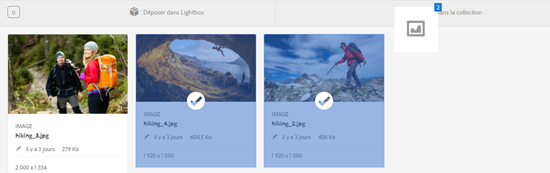
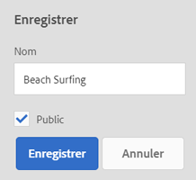
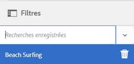

# Gestion des collections {#managing-collections}

| Version | Lien de l’article |
| -------- | ---------------------------- |
| AEM as a Cloud Service | [Cliquez ici](https://experienceleague.adobe.com/docs/experience-manager-cloud-service/content/assets/manage/manage-collections.html?lang=fr) |
| AEM 6.5 | Cet article |

Une collection est un ensemble de ressources dans [!DNL Adobe Experience Manager Assets]. Vous pouvez utiliser des collections pour partager des ressources entre utilisateurs. Il peut s’agir d’une collection statique ou dynamique basée sur les résultats de la recherche.

Contrairement aux dossiers, une collection peut comporter des ressources provenant de différents emplacements. Vous pouvez partager des collections avec plusieurs utilisateurs et utilisatrices auxquels sont attribués différents niveaux de privilèges, notamment l’affichage, la modification, etc.

Vous pouvez partager plusieurs collections avec un utilisateur ou une utilisatrice. Chaque collection contient des références aux ressources. L’intégrité du référentiel des ressources est préservée dans les collections.

Les collections sont composées des types suivants, en fonction de la manière dont elles collectent les ressources :

* Collection contenant une liste de référence statique de ressources, dossiers et autres collections

* Collection dynamique qui rassemble de manière dynamique des ressources selon des critères de recherche

## Accès à la console Collections {#navigating-the-collections-console}

Pour ouvrir les **[!UICONTROL Collections]**, dans l’interface d’[!DNL Experience Manager], accédez à **[!UICONTROL Ressources]** > **[!UICONTROL Collections]**.

## Création d’une collection {#creating-a-collection}

Vous pouvez créer une collection contenant des [références statiques](#creating-a-collection-with-static-references) ou reposant sur un [filtre de critères de recherche](#creating-a-smart-collection). Vous pouvez également créer une collection à partir d’une Lightbox.

### Création d’une collection avec des références statiques {#creating-a-collection-with-static-references}

Vous pouvez créer une collection avec des références statiques, par exemple une collection avec des références à des ressources, des dossiers, des collections, des visionneuses à 360° et des visionneuses d’images.

1. Accédez à la console **[!UICONTROL Collections]**.
1. **[!UICONTROL Créer]**.
1. Sur la page **[!UICONTROL Créer une collection]**, saisissez un titre et une description facultative de la collection.
1. Ajoutez des membres à la collection et affectez les autorisations appropriées. Vous pouvez également sélectionner **[!UICONTROL Collection publique]** pour permettre à tous les utilisateurs d’accéder à la collection.

   >[!NOTE]
   >
   >Pour permettre aux membres de partager des collections avec d’autres utilisateurs, vous devez accorder les autorisations de lecture au groupe `dam-users` dans le chemin `home/users`. Donnez l’autorisation aux utilisateurs à l’emplacement `/content/dam/collections` afin de leur permettre d’afficher les collections dans les listes contextuelles. Vous pouvez également intégrer l’utilisateur au groupe `dam-users`.

1. (Facultatif) Ajoutez une image de miniature pour la collection.
1. Cliquez sur **[!UICONTROL Créer]**, puis sur **[!UICONTROL OK]** pour fermer la boîte de dialogue. Une collection avec le titre et les propriétés spécifiés s’ouvre dans la console Collections.

   >[!NOTE]
   >
   >[!DNL Experience Manager Assets] vous permet de créer des tâches de révision pour une collection de la même façon que vous créez des tâches de révision pour un dossier de ressources.

   Pour ajouter des ressources à la collection, accédez à l’interface utilisateur d’[!DNL Assets]. Pour plus d’informations, consultez la section [Ajout de ressources à une collection](#adding-assets-to-a-collection).

### Création de collections à l’aide de la zone de dépôt {#create-collections-using-dropzone}

Vous pouvez faire glisser des ressources de l’interface utilisateur d’[!DNL Assets] jusqu’à une collection. Vous pouvez également créer une copie d’une collection et faire glisser les ressources jusqu’à celle-ci.

1. Dans l’interface utilisateur d’[!DNL Assets], sélectionnez les ressources à ajouter à une collection.
1. Faites glisser les ressources jusqu’à la zone **[!UICONTROL Déposer dans la collection]**. Vous pouvez également cliquer sur **[!UICONTROL À la collection]** dans la barre d’outils.

   

1. Sur la page **[!UICONTROL Ajouter à la collection]**, cliquez sur **[!UICONTROL Créer une collection]** dans la barre d’outils.

   Si vous souhaitez ajouter les ressources à une collection existante, sélectionnez-la dans la page, puis cliquez sur **[!UICONTROL Ajouter]**. Par défaut, la collection la plus récemment mise à jour est sélectionnée.

1. Dans la boîte de dialogue **[!UICONTROL Créer une collection]**, indiquez le nom de la collection. Si vous souhaitez que la collection soit accessible à tous les utilisateurs, sélectionnez **[!UICONTROL Collection publique]**.
1. Cliquez sur **[!UICONTROL Continuer]** pour créer la collection.

### Création d’une collection dynamique {#creating-a-smart-collection}

Une collection dynamique utilise des critères de recherche pour rassembler les ressources de manière dynamique. Vous pouvez créer une collection dynamique en utilisant uniquement des fichiers et non pas des dossiers ou des fichiers et des dossiers.

Pour créer une collection dynamique, procédez comme suit :

1. Accédez à l’interface utilisateur d’[!DNL Assets], puis cliquez sur rechercher.

1. Saisissez le mot-clé de recherche dans la zone Omnisearch et sélectionnez `Enter`. Ouvrez le panneau Filtres et appliquez un filtre de recherche.

1. Dans la liste **[!UICONTROL Fichiers et dossiers]**, sélectionnez **[!UICONTROL Fichiers]**.

   

1. Cliquez sur **[!UICONTROL Enregistrer la collection dynamique]**.

1. Attribuez un nom à la collection. Sélectionnez **[!UICONTROL Public]** pour ajouter le groupe Utilisateurs DAM avec le rôle Observateur à la collection dynamique.

   

   >[!NOTE]
   >
   >Si vous sélectionnez **[!UICONTROL Public]**, la collection dynamique est disponible pour chaque personne possédant le rôle de propriétaire une fois que vous la créez. Si vous désactivez l’option **[!UICONTROL Public]**, le groupe d’utilisateurs de la gestion des ressources numériques n’est plus associé à la collection dynamique.

1. Cliquez sur **[!UICONTROL Enregistrer]** pour créer la collection dynamique, puis fermez la boîte de message et terminez le processus.

   La nouvelle collection dynamique est également ajoutée à la liste **[!UICONTROL Recherches enregistrées]**.

   

   Le libellé de l’option **[!UICONTROL Créer une collection dynamique]** se transforme en **[!UICONTROL Modifier la collection dynamique]**. Pour modifier les paramètres de la collection dynamique, sélectionnez **[!UICONTROL Fichiers]** dans la liste **[!UICONTROL Fichiers et dossiers]**. Cliquez sur l’option **[!UICONTROL Modifier la collection dynamique]** .

## Ajout de ressources à une collection {#adding-assets-to-a-collection}

Vous pouvez ajouter des ressources à une collection qui comporte une liste de ressources ou de dossiers référencés. Les collections dynamiques utilisent une requête de recherche pour renseigner les ressources. Par conséquent, les références statiques aux ressources et aux dossiers ne s’y appliquent pas.

1. Dans l’interface utilisateur [!DNL A]ssets, sélectionnez la ressource, puis cliquez sur **[!UICONTROL À la collection]**  dans la barre d’outils.
Vous pouvez également faire glisser la ressource sur la zone **[!UICONTROL Déposer dans la collection]** dans l’interface. Ajoutez les ressources lorsque le libellé de la zone devient **[!UICONTROL Déposer pour ajouter]**.

1. Sur la page **[!UICONTROL Ajouter à la collection]**, sélectionnez la collection à laquelle vous souhaitez ajouter la ressource.

1. Cliquez sur **[!UICONTROL Ajouter]**, puis fermez le message de confirmation. La ressource est ajoutée à la collection.

## Modification d’une collection dynamique {#editing-a-smart-collection}

Les collections dynamiques sont créées en enregistrant une recherche afin que vous puissiez modifier leur contenu en changeant les paramètres de recherche de la [recherche enregistrée](#saved-searches).

1. Dans l’interface utilisateur d’[!DNL Assets], cliquez sur l’option de recherche  dans la barre d’outils.
1. Placez le curseur dans la zone Omnisearch et sélectionnez la touche `Return`.
1. Dans l’interface d’[!DNL Experience Manager], ouvrez le panneau Filtres.
1. Dans la liste **[!UICONTROL Recherches enregistrées]**, sélectionnez la collection dynamique que vous souhaitez modifier. Le panneau de recherche affiche les filtres configurés pour la recherche enregistrée.

   

1. Dans la liste **[!UICONTROL Fichiers et dossiers]**, sélectionnez **[!UICONTROL Fichiers]**.
1. Modifiez un ou plusieurs filtres selon vos besoins. Cliquez sur **[!UICONTROL Modifier la collection dynamique]**.

   Vous pouvez également modifier le nom de la collection dynamique.

   

1. Cliquez sur **[!UICONTROL Enregistrer]**. La boîte de dialogue **[!UICONTROL Modification de la collection dynamique]** s’affiche.
1. Cliquez sur **[!UICONTROL Remplacer]** pour remplacer la collection dynamique d’origine par la collection modifiée. Sinon, sélectionnez **[!UICONTROL Enregistrer sous]** pour enregistrer la collection modifiée séparément.
1. Dans la boîte de dialogue de confirmation, cliquez sur **[!UICONTROL Enregistrer]** pour terminer le processus.

## Affichage et modification des métadonnées {#view-edit-collection-metadata}

Les métadonnées de collection incluent les données sur la collection, notamment toute balise qui est ajoutée.

1. Dans la console [!UICONTROL Collections], sélectionnez une collection, puis cliquez sur les **[!UICONTROL Propriétés]** dans la barre d’outils.
1. Sur la page **[!UICONTROL Métadonnées de collection]**, affichez les métadonnées de collection à partir des onglets **[!UICONTROL De base]** et **[!UICONTROL Avancé]**.
1. Modifiez les métadonnées selon vos besoins. Pour enregistrer les modifications, cliquez sur **[!UICONTROL Enregistrer et fermer]** dans la barre d’outils.

## Modification en bloc des métadonnées de plusieurs collections {#editing-collection-metadata-in-bulk}

Vous pouvez modifier les métadonnées de plusieurs collections simultanément. Cette fonctionnalité vous permet de répliquer rapidement des métadonnées communes dans plusieurs collections.

1. Dans la console Collections, sélectionnez deux collections ou plus.
1. Dans la barre d’outils, cliquez sur **[!UICONTROL Propriétés]**.
1. Sur la page **[!UICONTROL Métadonnées de collection]**, modifiez les métadonnées sous **[!UICONTROL De base]** et **[!UICONTROL Avancé]**, selon les besoins.
1. Pour afficher les propriétés de métadonnées associées à une collection spécifique, désélectionnez les autres collections dans la liste. Les champs de l’éditeur de métadonnées sont renseignés avec les métadonnées de la collection particulière.

   >[!NOTE]
   >
   >* Dans la page des [!UICONTROL propriétés], vous pouvez supprimer des collections de la liste des collections en les désélectionnant. La liste des collections contient toutes les collections sélectionnées par défaut. [!DNL Experience Manager] ne met pas à jour les métadonnées des collections que vous supprimez.
   >* En haut de la liste, cochez la case située en regard de l’option **[!UICONTROL Titre]** pour passer de la sélection des collections à l’effacement de la liste, et inversement.

1. Cliquez sur **[!UICONTROL Enregistrer et fermer]** dans la barre d’outils, puis fermez la boîte de dialogue de confirmation.
1. Pour ajouter les nouvelles métadonnées aux métadonnées existantes, sélectionnez le **[!UICONTROL mode d’ajout]**. Si vous ne sélectionnez pas cette option, les nouvelles métadonnées remplacent les métadonnées existantes dans les champs. Cliquez sur **[!UICONTROL Envoyer]**.

   >[!NOTE]
   >
   >Les métadonnées que vous ajoutez pour les collections sélectionnées remplacent les métadonnées précédentes de ces collections. Utilisez le [!UICONTROL Mode d’ajout] pour ajouter de nouvelles valeurs aux métadonnées existantes dans les champs pouvant contenir plusieurs valeurs. Les champs à valeur unique sont toujours remplacés. Toutes les balises que vous ajoutez dans le champ [!UICONTROL Balises] sont ajoutées à la liste existante des balises dans les métadonnées.

Pour personnaliser la page [!UICONTROL Propriétés] des métadonnées, et notamment ajouter, modifier et supprimer des propriétés de métadonnées, utilisez l’éditeur de schéma.

>[!TIP]
>
>Les méthodes de modification en bloc fonctionnent pour les ressources disponibles dans une collection. Pour les ressources disponibles dans plusieurs dossiers ou correspondant à un critère commun, il est possible de mettre à jour [les métadonnées en bloc après une recherche](/help/assets/search-assets.md#metadataupdates).

## Recherche de collections {#searching-collections}

Vous pouvez effectuer des recherches dans des collections à partir de la console Collections. Lorsque vous effectuez des recherches avec des mots-clés dans la zone Omni-recherche, [!DNL Assets] recherche les noms des collections, les métadonnées et les balises ajoutées aux collections.

Si vous recherchez des collections à partir du niveau supérieur, seules les collections individuelles sont renvoyées dans les résultats de recherche. Les [!DNL Assets] ou dossiers à l’intérieur des collections sont exclus. Dans tous les autres cas (par exemple, dans une collection individuelle ou dans une hiérarchie de dossiers), toutes les ressources, dossiers et collections appropriés sont renvoyés.

## Recherche dans les collections {#searching-within-collections}

Dans la console Collections, cliquez sur une collection pour l’ouvrir.

Dans une collection, la recherche [!DNL Experience Manager] se limite aux ressources (ainsi qu’aux balises et métadonnées) de la collection en cours d’affichage. Lorsque vous effectuez une recherche dans un dossier, toutes les ressources correspondantes et les dossiers enfants du dossier actif sont renvoyés. Lorsque vous effectuez une recherche dans une collection, seuls les ressources, dossiers et autres collections correspondant aux membres directs de la collection sont renvoyés.

## Modification des paramètres d’une collection {#editing-collection-settings}

Vous pouvez modifier les paramètres d’une collection, tels que le titre et la description, ou ajouter des membres à une collection.

1. Sélectionnez une collection et cliquez sur les **[!UICONTROL Paramètres]** dans la barre d’outils. Vous pouvez également utiliser l’action rapide **[!UICONTROL Paramètres]** à partir de la miniature de la collection.
1. Modifiez les paramètres de collection sur la page **[!UICONTROL Paramètres de la collection]**. Par exemple, modifiez le titre, les descriptions, les membres et les autorisations de la collection comme décrit dans la section [Ajout de collections](#creating-a-collection).

1. Pour enregistrer les modifications, cliquez sur **[!UICONTROL Enregistrer]**.

## Suppression d’une collection {#deleting-a-collection}

1. Dans la console Collections, sélectionnez une ou plusieurs collections, puis cliquez sur supprimer dans la barre d’outils.

1. Dans la boîte de dialogue, cliquez sur **[!UICONTROL Supprimer]** pour confirmer la suppression.

   >[!NOTE]
   >
   >Vous pouvez également supprimer les collections dynamiques en [supprimant les recherches enregistrées](#saved-searches).

## Téléchargement d’une collection {#downloading-a-collection}

Lorsque vous téléchargez une collection, la hiérarchie complète des ressources dans la collection est téléchargée, y compris les dossiers et les collections enfants.

1. Dans la console Collections, sélectionnez une ou plusieurs collections à télécharger.
1. Dans la barre d’outils, cliquez sur **[!UICONTROL Télécharger]**.
1. Dans la boîte de dialogue **[!UICONTROL Télécharger]**, cliquez sur **[!UICONTROL Télécharger]**. Si vous souhaitez télécharger les rendus des ressources dans la collection, sélectionnez **[!UICONTROL Rendus]**. Sélectionnez l’option **[!UICONTROL E-mail]** pour envoyer une notification par e-mail au propriétaire de la collection.

   Lorsque vous sélectionnez une collection à télécharger, l’ensemble de la hiérarchie de dossiers sous cette collection est téléchargé. Pour inclure chaque collection que vous téléchargez (y compris les ressources figurant dans des collections enfant imbriquées dans la collection parent) dans un dossier individuel, sélectionnez **[!UICONTROL Créer un dossier distinct pour chaque ressource]**.

## Création de collections imbriquées {#creating-nested-collections}

Vous pouvez ajouter une collection à une autre collection, créant ainsi une collection imbriquée.

1. Dans la console Collections, sélectionnez la collection ou le groupe de collections désiré, et cliquez sur **[!UICONTROL À la collection]** dans la barre d’outils.

1. Sur la page **[!UICONTROL Ajouter à la collection]**, sélectionnez la collection à laquelle vous souhaitez ajouter la collection.

   >[!NOTE]
   >
   >La collection mise le plus récemment à jour est sélectionnée par défaut sur la page **[!UICONTROL Ajouter à la collection]**.

1. Cliquez sur **[!UICONTROL Ajouter]**. Un message confirme l’ajout de la collection à la collection cible sur la page **[!UICONTROL Sélectionner la destination]**. Fermez le message pour terminer le processus.

>[!NOTE]
>
>Les collections dynamiques ne peuvent pas être imbriquées. En d’autres termes, les collections dynamiques ne peuvent pas contenir d’autres collections.

## Recherches enregistrées {#saved-searches}

Dans l’interface utilisateur d’[!DNL Assets], vous pouvez rechercher ou filtrer des ressources selon des règles, critères de recherche ou facettes de recherche personnalisées. Si vous enregistrez ces éléments en tant que **[!UICONTROL recherches enregistrées]**, vous pouvez y accéder ultérieurement à partir de la liste **[!UICONTROL Recherches enregistrées]** du panneau Filtrer. La création d’une recherche enregistrée entraîne celle d’une collection dynamique.

Les recherches enregistrées sont créées lorsque vous créez une collection dynamique. Les collections dynamiques sont automatiquement ajoutées à la liste **[!UICONTROL Recherches enregistrées]**. La requête [!UICONTROL Recherches enregistrées] de la collection est enregistrée dans la propriété `dam:query` de CRXDE à l’emplacement relatif `/content/dam/collections/`. Les recherches que vous pouvez enregistrer et les recherches enregistrées affichées dans la liste ne sont pas limitées.

>[!NOTE]
>
>Vous pouvez partager les collections dynamiques comme s’il s’agissait de collections statiques.

La modification des recherches enregistrées est identique à celle des collections dynamiques. Pour plus d’informations, consultez la section [Modification d’une collection dynamique](#editing-a-smart-collection).

Pour supprimer des recherches enregistrées, procédez comme suit :

1. Dans l’interface utilisateur [!DNL Assets], cliquez sur rechercher .
1. Placez le curseur dans le champ Omnisearch et appuyez sur la touche `Return`.
1. Dans l’interface d’[!DNL Experience Manager], ouvrez le panneau Filtres.
1. Dans la liste **[!UICONTROL Recherches enregistrées]**, cliquez sur l’icône **[!UICONTROL Supprimer]** en regard de la collection dynamique à supprimer.

   

1. Dans la boîte de dialogue, cliquez sur **[!UICONTROL Supprimer]** pour supprimer la recherche enregistrée.

## Exécution d’un workflow sur une collection {#running-a-workflow-on-a-collection}

Vous pouvez exécuter un workflow pour les ressources d’une collection. Si la collection contient des collections imbriquées, le workflow s’exécute également sur les ressources de ces dernières. Toutefois, si la collection et les collections imbriquées contiennent des ressources en double, le workflow ne s’exécute qu’une seule fois pour ces ressources.

1. Ouvrez **[!UICONTROL Ressources]** > **[!UICONTROL Collections]**. Pour exécuter un workflow sur une collection spécifique, sélectionnez-le.
1. Ouvrez le rail **[!UICONTROL Chronologie]**. Cliquez sur  et cliquez sur **[!UICONTROL Démarrer le workflow]**.
1. Dans la section **[!UICONTROL Démarrer le workflow]**, sélectionnez un modèle de workflow dans la liste. Par exemple, sélectionnez le modèle **[!UICONTROL Ressources de mise à jour de DAM]**.
1. Saisissez un titre pour le workflow puis cliquez sur **[!UICONTROL Démarrer]**.
1. Dans la boîte de dialogue, cliquez sur **[!UICONTROL Poursuivre]**. Le workflow traite toutes les ressources de la collection sélectionnée.

>[!MORELIKETHIS]
>
>* [Configuration des notifications par e-mail d’Experience Manager Assets](/help/sites-administering/notification.md#assetsconfig)
>* [Création d’une tâche de révision pour les collections](bulk-approval.md)
