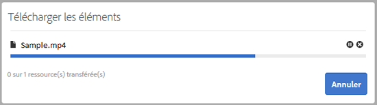
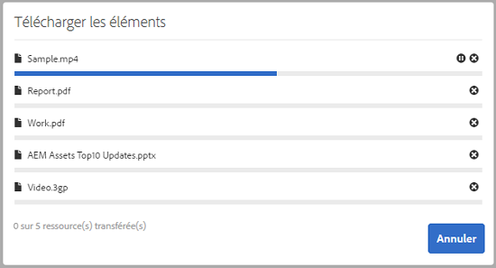
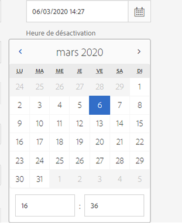
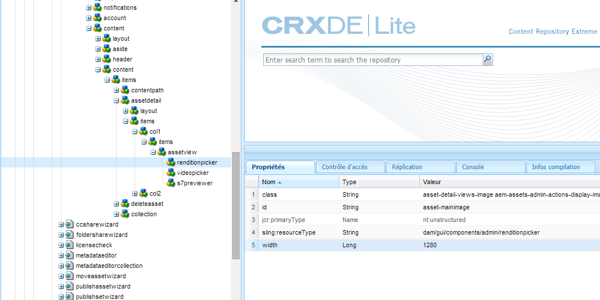
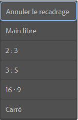
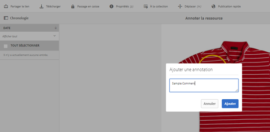
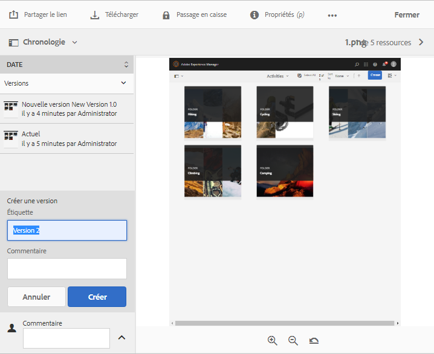

# Gérer vos ressources numériques {#manage-digital-assets}

Vous [!DNL Adobe Experience Manager Assets] pouvez faire plus que simplement stocker et gérer vos actifs. [!DNL Experience Manager] offres des fonctionnalités de gestion des actifs de niveau entreprise. Vous pouvez modifier et partager des fichiers, lancer des recherches avancées, créer plusieurs rendus de dizaines de formats de fichier pris en charge, gérer des versions et des droits numériques, automatiser le traitement des fichiers, gérer et gérer les métadonnées, collaborer à l’aide d’annotations, etc.

Cet article décrit les tâches de base de la gestion des ressources, telles que la création ou le transfert ; mises à jour des métadonnées ; copier, déplacer et supprimer ; publier, annuler la publication et rechercher des ressources. Pour comprendre l’interface utilisateur, voir [Prise en main de l’interface](/help/sites-authoring/basic-handling.md)utilisateur des ressources. To manage Content Fragments, see [manage Content Fragments](/help/assets/content-fragments/content-fragments-managing.md) assets.

## Création de dossiers {#creating-folders}

Lorsque vous organisez une collection de ressources, comme toutes les images `Nature`, vous pouvez créer des dossiers pour les conserver ensemble. Vous pouvez utiliser des dossiers pour classer et organiser vos ressources. [!DNL Experience Manager Assets] ne nécessite pas de classer les ressources dans des dossiers pour mieux fonctionner.

>[!NOTE]
>
>* Sharing an [!DNL Assets] folder of the type `sling:OrderedFolder` is not supported when sharing to Marketing Cloud. Si vous souhaitez partager un dossier, ne sélectionnez pas [!UICONTROL Ordonné] lors de la création du dossier.
>* [!DNL Experience Manager] n’autorise pas l’utilisation du mot `subassets` comme nom de dossier. Il s’agit d’un mot-clé réservé au noeud qui contient des sous-ressources pour les ressources composées.

1. Dans le dossier Ressources numériques, accédez à l’emplacement où vous souhaitez créer un dossier. Dans le menu, cliquez sur **[!UICONTROL Créer]**. Sélectionnez **[!UICONTROL Nouveau dossier]**.
1. Dans le champ **[!UICONTROL Titre]**, indiquez le nom du dossier. Par défaut, DAM utilise le titre que vous avez fourni comme nom du dossier. Une fois le dossier créé, vous pouvez remplacer le nom par défaut et entrer un autre nom de dossier.
1. Cliquez sur **[!UICONTROL Créer]**. Le dossier apparaît dans le dossier Ressources numériques.

Les caractères suivants (liste de ceux-ci séparés par des espaces) ne sont pas pris en charge :

* Le nom d’un fichier de ressource ne peut pas contenir les caractères suivants : `* / : [ \\ ] | # % { } ? &`
* Le nom d’un dossier de ressources ne peut pas contenir les caractères suivants : `* / : [ \\ ] | # % { } ? \" . ^ ; + & \t`

N’incluez pas de caractères spéciaux dans les extensions des noms de fichier.

## Chargement des ressources {#uploading-assets}

<!-- TBD the following:
Move this section into a new article. CQDOC-14874 ticket is created for this.
In this complete article, replace emphasis with UICONTROL where appropriate.
-->

Vous pouvez transférer différents types de ressource (dont des images, des fichiers PDF, des fichiers RAW, etc.) de votre dossier local ou d’un lecteur réseau vers [!DNL Experience Manager Assets].

>[!NOTE]
>
>Dans le mode Scene 7 de Dynamic Media, vous pouvez télécharger uniquement des ressources dont la taille de fichier est de 2 Go ou inférieure.

Vous pouvez choisir de transférer des ressources vers des dossiers avec ou sans un profil de traitement attribué.

Pour les dossiers auxquels un profil de traitement est affecté, le nom du profil s’affiche sur la vignette en mode Carte. En mode Liste, le nom du profil s’affiche dans la colonne **Profil de traitement.** Reportez-vous à la section [Profils de traitement](/help/assets/processing-profiles.md).

Before uploading an asset, ensure that it is in a [format](/help/assets/assets-formats.md) that [!DNL Experience Manager Assets] supports.

1. Dans l’interface utilisateur [!DNL Assets], accédez à l’emplacement où vous voulez ajouter des ressources numériques.
1. Pour charger les ressources, effectuez l’une des opérations suivantes :

   * On the toolbar, click **[!UICONTROL Create]**. Dans le menu, cliquez ensuite sur **[!UICONTROL Fichiers]**. Au besoin, vous pouvez renommer le fichier dans la boîte de dialogue affichée.
   * Dans un navigateur prenant en charge HTML5, faites glisser directement les ressources dans l’interface utilisateur [!DNL Assets]. La boîte de dialogue permettant de renommer les fichiers n’est pas affichée.

   

   Pour sélectionner plusieurs fichiers, appuyez sur la touche Ctrl ou Commande et sélectionnez les ressources dans la boîte de dialogue de sélecteur de fichiers. Si vous utilisez un iPad, vous ne pouvez sélectionner qu’un seul fichier à la fois.

   Vous pouvez suspendre le transfert des ressources volumineuses (dont la taille est supérieure à 500 Mo) et reprendre ultérieurement à partir de la même page. Cliquez sur **[!UICONTROL Pause]** en regard de la barre de progression qui s’affiche lorsqu’un téléchargement se début.

   

Vous pouvez configurer la taille au-dessus de laquelle une ressource est considérée comme volumineuse. Par exemple, vous pouvez configurer le système de sorte qu’il considère les ressources dont la taille est supérieure à 1 000 Mo (au lieu de 500 Mo) comme des ressources volumineuses. In this case, **[!UICONTROL Pause]** appears on the progress bar when assets of size greater than 1000 MB are uploaded.

Le bouton Pause ne s’affiche pas si un fichier supérieur à 1 000 Mo est chargé avec un fichier inférieur à 1 000 Mo. Toutefois, si vous annulez le téléchargement de fichier inférieur à 1 000 Mo, le bouton **[!UICONTROL Pause]** apparaît.

To modify the size limit, configure the `chunkUploadMinFileSize` property of the `fileupload`node in the CRX repository.

Lorsque vous cliquez sur **[!UICONTROL Pause]**, l’option **[!UICONTROL Lecture]** est activée. Pour reprendre le téléchargement, cliquez sur **[!UICONTROL Lecture]**.

Pour annuler une opération de chargement en cours, cliquez sur le bouton de fermeture (`X`) en regard de la barre de progression. Lorsque vous annulez le chargement, [!DNL Assets] supprime la partie partiellement chargée de la ressource.

La possibilité de reprendre le téléchargement s’avère particulièrement utile dans les scénarios dans lesquels la bande passante est faible et le réseau dysfonctionne, car le téléchargement d’une ressource volumineuse prend un long moment. Vous pouvez suspendre l’opération de transfert et la reprendre ultérieurement lorsque la situation s’améliore. Lorsque vous reprenez le transfert, il commence au niveau où vous l’avez suspendu.

During the upload operation, [!DNL Experience Manager] saves the portions of the asset being uploaded as chunks of data in the CRX repository. When the upload completes, [!DNL Experience Manager] consolidates these chunks into a single block of data in the repository.

To configure the cleanup task for the unfinished chunk upload jobs, go to `https://[aem_server]:[port]/system/console/configMgr/org.apache.sling.servlets.post.impl.helper.ChunkCleanUpTask`.

>[!CAUTION]
>
>La valeur par défaut lorsque le transfert de blocs est déclenché est de 500 Mo et la taille du bloc est de 50 Mo. Si vous modifiez la configuration [de jetonOak d&#39;](https://helpx.adobe.com/experience-manager/kb/How-to-set-token-session-expiration-AEM.html) Apache Jackrabbit pour la définir sur `timeout configuration` une valeur inférieure au temps nécessaire au téléchargement d&#39;un fichier, vous pouvez alors vous trouver dans une situation de dépassement de délai de session pendant que le chargement de l&#39;actif est en cours. Par conséquent, vous devez modifier le `chunkUploadMinFileSize` et `chunksize`, de sorte que chaque requête de bloc actualise la session.
>
>Compte tenu du délai d’expiration des informations d’identification, de la latence, de la bande passante et des chargements simultanés attendus, la valeur la plus élevée qui vous permet de vous assurer que les éléments suivants sont sélectionnés :
>
>* Assurez-vous que le transfert de blocs est activé pour les fichiers dont la taille risque de provoquer l’expiration des informations d’identification pendant le transfert est en cours.
   >
   >
* Pour s’assurer que chaque segment se termine avant l’expiration des informations d’identification.

Si vous transférez une ressource portant le même nom qu’une ressource déjà disponible à l’emplacement où vous transférez la ressource, un message d’avertissement s’affiche.

Vous pouvez choisir de remplacer une ressource existante, de créer une autre version ou de garder les deux en renommant la nouvelle ressource téléchargée. Si vous remplacez une ressource existante, les métadonnées de la ressource et les éventuelles modifications antérieures (annoter ou recadrer, par exemple) que vous avez apportées à la ressource existante sont supprimées. If you choose to keep both assets, the new asset is renamed with number `1` appended to its name.

>[!NOTE]
>
>Lorsque vous sélectionnez **[!UICONTROL Remplacer]** dans la boîte de dialogue [!UICONTROL Conflit de noms], l’ID de la ressource est régénéré pour la nouvelle ressource. Cet ID est différent de celui de la ressource précédente.
>
>Si la fonction Statistiques sur les ressources est activée pour effectuer le suivi des impressions/clics avec Adobe Analytics, l’ID de ressource régénéré invalide les données capturées pour la ressource dans Analytics.

If the asset you upload exists in [!DNL Assets], the **[!UICONTROL Duplicates Detected]** dialog warns that you are attempting to upload a duplicate asset. The dialog appears only if the `SHA 1` checksum value of the binary of the existing asset matches the checksum value of the asset you upload. Dans ce cas, les noms des fichiers n’ont pas d’importance.

>[!NOTE]
>
>The [!UICONTROL Duplicates Detected] dialog appears only when the duplicate detection feature is enabled. To enable the duplicate detection feature, see [Enable Duplicate Detection](/help/assets/duplicate-detection.md).

Pour conserver le duplicata de ressource dans [!DNL Assets], cliquez sur **[!UICONTROL Conserver]**. To delete the duplicate asset you uploaded, click **[!UICONTROL Delete]**.

[!DNL Experience Manager Assets] vous empêche de charger des ressources dont le nom de fichier contient des caractères interdits. Si vous essayez de charger une ressource dont le nom de fichier contient un ou plusieurs caractères interdits, [!DNL Assets] affiche un message d’avertissement à ce sujet et interrompt l’opération jusqu’à ce que vous supprimiez les caractères concernés ou utilisiez un nom autorisé.

Pour prendre en compte les conventions d’appellation en vigueur dans votre entreprise, la boîte de dialogue [!UICONTROL Charger les ressources] vous permet de spécifier des noms longs pour les fichiers chargés.

Toutefois, la liste de caractères suivante, séparée par des espaces, n’est pas prise en charge :

* Le nom du fichier de ressource ne doit pas contenir `* / : [ \\ ] | # % { } ? &`
* Le nom du dossier de ressources ne doit pas contenir `* / : [ \\ ] | # % { } ? \" . ^ ; + & \t`

N’incluez pas de caractères spéciaux dans les extensions des noms de fichier.

In addition, the [!DNL Assets] user interface displays the most recent asset that you upload or the folder that you created first.

Si vous annulez le chargement avant la fin de l’opération, [!DNL Assets] arrête le chargement du fichier en cours et actualise le contenu. Toutefois, les fichiers déjà chargés ne sont pas supprimés.

La boîte de dialogue de progression du chargement dans [!DNL Assets] affiche le nombre de fichiers dont le chargement a réussi et ceux dont le chargement a échoué.

### Transferts en série {#serialuploads}

Uploading numerous assets in bulk consumes significant I/O resources, which may adversely impact the performance of your [!DNL Assets] deployment. In particular, if you have a slow internet connection, the time to upload drastically increases due to a spike in disk I/O. Moreover, your web browser may introduce additional restrictions to the number of POST requests [!DNL Assets] can handle for concurrent asset uploads. Par conséquent, l’opération de chargement échoue ou prend fin prématurément. In other words, [!DNL Experience Manager Assets] may miss some files while ingesting a bunch of files or altogether fail to ingest any file.

To overcome this situation, [!DNL Assets] ingests one asset at a time (serial upload) during a bulk upload operation, instead of the concurrently ingesting all the assets.

Le chargement en série de ressources est activé par défaut. To disable the feature and allow concurrent uploading, overlay the `fileupload` node in Crx-de and set the value of the `parallelUploads` property to `true`.

### Upload assets using FTP {#uploading-assets-using-ftp}

Dynamic Media permet de transférer des ressources par lots via un serveur FTP. Si vous avez l’intention de télécharger des fichiers volumineux (>1 Go) ou des dossiers et sous-dossiers entiers, vous devez utiliser FTP. Vous pouvez même configurer le transfert FTP pour qu’il s’effectue de manière récurrente.

>[!NOTE]
>
>Dans le mode Scene 7 de Dynamic Media, vous pouvez télécharger uniquement des ressources dont la taille de fichier est de 2 Go ou inférieure.

>[!NOTE]
>
>Pour télécharger des fichiers par FTP en mode Scene7 - Contenu multimédia dynamique, installez Feature Pack 18912 sur les instances d’ [!DNL Experience Manager] auteur. Contact [Adobe Customer Care](https://helpx.adobe.com/fr/contact/enterprise-support.ec.html) to get access to FP-18912 and complete the setup of your FTP account. Pour plus d’informations, voir [Installation de Feature Pack 18912 pour la migration](/help/assets/bulk-ingest-migrate.md)de ressources en vrac.
>
>If you use FTP for uploading assets, the upload settings specified in [!DNL Experience Manager] are ignored. Des règles de traitement de fichiers, telles qu’elles sont définies dans Dynamic Media Classic, sont utilisées à la place.  

**Pour télécharger des ressources via FTP, procédez comme suit :**

1. Sélectionnez le client FTP de votre choix, puis connectez-vous à l’aide du nom d’utilisateur et du mot de passe FTP qui vous ont été envoyés par courrier électronique. Dans le client FTP, téléchargez les fichiers et/ou dossiers vers le serveur FTP.
1. [Connectez-vous à Dynamic Media Classic](https://www.adobe.com/fr/marketing-cloud/experience-manager/scene7-login.html) à l’aide des informations de connexion qui vous ont été envoyées par e-mail. Cliquez sur **[!UICONTROL Télécharger]** dans la barre de navigation globale.

1. Cliquez sur l’onglet **[!UICONTROL Via FTP]** dans le coin supérieur gauche de la page Télécharger.
1. Sélectionnez le dossier FTP source à utiliser pour le transfert des fichiers dans la partie gauche de la page et le dossier de destination dans la partie droite.
1. Cliquez sur **[!UICONTROL Options tâche]** dans le coin inférieur droit de la page, puis définissez les options de votre choix sur la base des ressources du dossier que vous avez sélectionné.

   Voir [Options de la tâche de transfert](#upload-job-options).

   >[!NOTE]
   >
   >Lorsque vous transférez des ressources via FTP, les options de la tâche de transfert définies dans Dynamic Media Classic (S7) sont prioritaires sur les paramètres de traitement des ressources définis dans [!DNL Experience Manager].

1. Dans le coin inférieur droit de la boîte de dialogue Télécharger les options de la tâche, cliquez sur **[!UICONTROL Enregistrer]**.
1. Dans le coin inférieur droit de la page Télécharger, cliquez sur **[!UICONTROL Lancer le téléchargement]**.

   Pour afficher la progression du téléchargement, cliquez sur **[!UICONTROL Tâches]** dans la barre de navigation globale. La page Tâches affiche la progression du téléchargement. You can continue working in [!DNL Experience Manager] and return to the Jobs page in Dynamic Media Classic at any time to review an in-progress job.
To cancel an upload job in progress, click **[!UICONTROL Cancel]** next to the Duration time.

#### Options de la tâche de transfert {#upload-job-options}

| Option de téléchargement | Sous-option | Description |
|---|---|---|
| Nom de la tâche |  | Le nom par défaut qui est prérempli dans le champ de texte comprend la portion du nom saisie par l’utilisateur, ainsi que l’horodatage. Vous pouvez utiliser le nom par défaut ou indiquer un nom personnalisé pour cette tâche de transfert.  Cette tâche, ainsi que les autres tâches de transfert et de publication, sont enregistrées sur la page Tâches, où vous pouvez vérifier leur état. |
| Publier après le téléchargement |  | Publie automatiquement les ressources que vous téléchargez. |
| Écraser dans n’importe quel dossier, même nom de ressource de base, quelle que soit l’extension |  | Sélectionnez cette option si vous voulez que les fichiers que vous téléchargez remplacent les fichiers existants portant le même nom. Le nom de cette option peut varier en fonction des paramètres définis sous **[!UICONTROL Configuration de l’application]** > **[!UICONTROL Paramètres généraux]** > **[!UICONTROL Télécharger dans l’application]** > **[!UICONTROL Écraser les images]**. |
| Décompresser les fichiers zip ou tar lors du téléchargement |  |  |
| Options de tâche |  | Click **[!UICONTROL Job Options]** to open the [!UICONTROL Upload Job Options] dialog box and choose options that affect the entire upload job. Ces options sont identiques pour tous les types de fichiers. Vous pouvez choisir les options par défaut pour télécharger les fichiers en commençant sur la page Paramètres généraux de l’application. Pour ouvrir cette page, sélectionnez **[!UICONTROL Configuration]** > **[!UICONTROL Configuration de l’application.]**. Click the **[!UICONTROL Default Upload Options]** button to open the [!UICONTROL Upload Job Options] dialog box. |
|  | Quand | Sélectionnez Unique ou Périodique. Pour définir une tâche périodique, sélectionnez une option de répétition (Quotidien, Hebdomadaire, Mensuel ou Personnalisé) afin d’indiquer la fréquence souhaitée pour la tâche de transfert FTP. Indiquez ensuite les options de planification suivant vos besoins. |
|  | Inclure les sous-dossiers | Téléchargez tous les sous-dossiers du dossier que vous avez l’intention de télécharger. Les noms du dossier et des sous-dossiers transférés sont saisis automatiquement dans [!DNL Experience Manager Assets]. |
|  | Options de recadrage | Pour recadrer manuellement une image par ses côtés, sélectionnez le menu Recadrer, puis choisissez Manuel. Indiquez ensuite le nombre de pixels à recadrer d’un seul côté ou de chaque côté de l’image. La proportion de l’image qui est rognée dépend du paramètre ppp (pixels par pouce) défini dans le fichier d’image. Par exemple, si l’image affiche 150 ppp et que vous saisissez 75 dans les zones de texte Haut, Droite, Bas et Gauche, un demi-pouce est rogné de chaque côté.  Pour supprimer automatiquement d’une image les pixels représentant des espaces blancs, sélectionnez le menu Recadrer, cliquez sur Manuel, puis saisissez les mesures en pixels dans les champs Haut, Droite, Bas et Gauche pour recadrer au niveau des bords. Vous pouvez également sélectionner Rognage dans le menu Recadrer et choisir les options suivantes :  **Rogner en fonction de** <ul><li>**Couleur** - Choisissez l&#39;option Couleur. Sélectionnez ensuite le menu Coin, puis choisissez l’angle de l’image présentant la couleur qui correspond le mieux à l’espace blanc à rogner.</li><li>**** Transparence : sélectionnez l’option Transparence.  **Tolérance** : faites glisser le curseur pour définir une tolérance comprise entre 0 et 1. Pour effectuer un rognage en fonction de la couleur, indiquez 0 pour rogner les pixels uniquement s’ils correspondent exactement à la couleur sélectionnée dans l’angle de l’image. Les valeurs qui se rapprochent de 1 autorisent une plus grande différence de couleurs. Pour l’option de rognage en fonction de la transparence, indiquez 0 pour rogner les pixels seulement s’ils sont transparents. Les valeurs plus proches de 1 permettent une plus grande transparence.</li></ul> Notez que ces options de recadrage sont non destructives. |
|  | Options de profils de couleurs | Sélectionnez une conversion de couleurs lorsque vous créez des fichiers optimisés utilisés pour la livraison :<ul><li>Conservation des couleurs par défaut : conserve les couleurs des images sources lorsque les images comportent des informations d’espace colorimétrique ; il n’y a aucune conversion des couleurs. Actuellement, le profil colorimétrique approprié est déjà intégré dans pratiquement toutes les images. Cependant, si une image source CMJN ne contient pas de profil colorimétrique intégré, les couleurs sont converties dans l’espace colorimétrique sRVB (Rouge Vert Bleu standard). sRVB est l’espace colorimétrique recommandé pour l’affichage d’images sur des pages web.</li><li>Conserver l’espace colorimétrique original : conserve les couleurs d’origine sans conversion des couleurs au niveau du point. Pour les images sans profil colorimétrique incorporé, toute conversion des couleurs s’effectue à l’aide des profils colorimétriques par défaut configurés dans les Paramètres de publication. Les profils de couleurs peuvent ne pas correspondre aux couleurs des fichiers créés avec cette option. Par conséquent, vous êtes invité à utiliser l’option de conservation des couleurs par défaut.</li><li>Personnaliser de > en  Permet d’accéder aux menus pour sélectionner un espace colorimétrique source (Convertir de) et un espace colorimétrique cible (Convertir en). Cette option avancée remplace toutes les informations de couleur incorporées dans le fichier source. Sélectionnez cette option uniquement lorsque toutes les images que vous envoyez contiennent des données de profil de couleurs incorrectes ou manquantes.</li></ul> |
|  | Options d’édition d’images | Vous pouvez conserver les masques d’écrêtage dans les images et choisir un profil de couleurs.  Voir [Définition des options d’édition d’image lors du téléchargement](#setting-image-editing-options-at-upload). |
|  | Options Postscript | Vous pouvez pixelliser les fichiers PostScript®, recadrer les fichiers, conserver les arrière-plans transparents et choisir une résolution ainsi qu’un espace colorimétrique.  Voir [Définition des options de téléchargement PostScript et Illustrator](#setting-postscript-and-illustrator-upload-options). |
|  | Options Photoshop | Vous pouvez créer des modèles à partir de fichiers Adobe® Photoshop®, conserver les calques, définir la méthode d’attribution des noms de calque, extraire du texte et indiquer le mode d’ancrage des images dans les modèles.  Notez que les modèles ne sont pas pris en charge dans [!DNL Experience Manager].  Voir [Définition des options de téléchargement Photoshop](#setting-photoshop-upload-options). |
|  | Options PDF | Vous pouvez pixelliser les fichiers, extraire des mots de recherche et des liens, générer automatiquement un catalogue électronique, définir la résolution et choisir un espace de couleurs.  Notez que les catalogues électroniques ne sont pas pris en charge dans [!DNL Experience Manager].   Voir [Définition des options de téléchargement PDF](#setting-pdf-upload-options). |
|  | Options Illustrator | Vous pouvez pixelliser les fichiers Adobe Illustrator®, conserver l’arrière-plan transparent, choisir une résolution et sélectionner un espace de couleurs.  Voir [Définition des options de téléchargement PostScript et Illustrator](#setting-postscript-and-illustrator-upload-options). |
|  | Options eVideo | Vous pouvez transcoder un fichier vidéo en sélectionnant un paramètre vidéo prédéfini.  Voir [Définition des options de téléchargement eVideo](#setting-evideo-upload-options). |
|  | Paramètres prédéfinis d’ensemble par lot | Pour créer automatiquement une visionneuse d’images ou une visionneuse à 360° à partir de fichiers téléchargés, cliquez sur la colonne Actif correspondant au paramètre prédéfini à utiliser. Vous pouvez sélectionner plusieurs paramètres prédéfinis. Les paramètres prédéfinis sont créés sur la page Configuration de l’application/Paramètres prédéfinis d’ensemble par lot de Dynamic Media Classic. Pour en savoir plus sur la création de paramètres prédéfinis d’ensemble par lot, voir [Configuration de paramètres prédéfinis d’ensemble par lot pour générer automatiquement des visionneuses d’images et des visionneuses à 360°](config-dms7.md#creating-batch-set-presets-to-auto-generate-image-sets-and-spin-sets).  Voir [Définition de paramètres prédéfinis d’ensemble par lot lors du téléchargement](#setting-batch-set-presets-at-upload). |

#### Set image editing options at upload {#setting-image-editing-options-at-upload}

When uploading image files, including AI, EPS, and PSD files, you can take the following editing actions in the [!UICONTROL Upload Job Options] dialog box:

* Recadrer l’espace blanc à partir du bord des images (voir la description dans le tableau ci-dessus).
* Recadrer manuellement des images par leurs côtés (voir la description dans le tableau ci-dessus).
* Choisir un profil colorimétrique (voir la description de l’option dans le tableau ci-dessus).
* Créer un masque à partir d’un chemin de tracé.
* Accentuer les images grâce aux options de masquage flou.
* Masquer l’arrière-plan.

<!--
| Option | Sub-option | Description |
|---|---|---|
| Create Mask From Clipping Path | | Create a mask for the image based on its clipping path information. This option applies to images created with image-editing applications in which a clipping path was created. |
| Unsharp Masking | | Lets you fine-tune a sharpening filter effect on the final downsampled image, controlling the intensity of the effect, the radius of the effect (as measured in pixels), and a threshold of contrast that is ignored.  This effect uses the same options as Photoshop’s Unsharp Mask filter. Contrary to what the name suggests, Unsharp Mask is a sharpening filter. Under Unsharp Masking, set the options you want. Setting options are described in the following: |
| | Amount | Controls the amount of contrast that is applied to edge pixels.  Think of it as the intensity of the effect. The main difference between the amount values of Unsharp Mask in Dynamic Media and the amount values in Adobe Photoshop, is that Photoshop has an amount range of 1% to 500%. Whereas, in Dynamic Media, the value range is 0.0 to 5.0. A value of 5.0 is the rough equivalent of 500% in Photoshop; a value of 0.9 is the equivalent of 90%, and so on. |
| | Radius | Controls the radius of the effect. The value range is 0-250.  The effect is run on all pixels in an image and radiates out from all pixels in all directions. The radius is measured in pixels. For example, to get a similar sharpening effect for a 2000 x 2000 pixel image and 500 x 500 pixel image, you would set a radius of two pixels on the 2000 x 2000 pixel image and a radius value of one pixel on the 500 x 500 pixel image. A larger value is used for an image that has more pixels. |
| | Threshold | Threshold is a range of contrast that is ignored when the Unsharp Mask filter is applied. It is important so that no "noise" is introduced to an image when this filter is used. The value range is 0-255, which is the number of brightness steps in a grayscale image. 0=black, 128=50% gray and 255=white.  For example, a threshold value of 12 ignores slight variations is skin tone brightness to avoid adding noise, but still add edge contrast to areas such as where eyelashes meet skin.  For example, if you have a photo of someone’s face, the Unsharp Mask affects the parts of the image, such as where eyelashes and skin meet to create an obvious area of contrast, and the smooth skin itself. Even the smoothest skin exhibits subtle changes in brightness values. If you do not use a threshold value, the filter accentuates these subtle changes in skin pixels. In turn, a noisy and undesirable effect is created while contrast on the eyelashes is increased, enhancing sharpness.  To avoid this issue, a threshold value is introduced that tells the filter to ignore pixels that do not change contrast dramatically, like smooth skin.  In the zipper graphic shown earlier, notice the texture next to the zippers. Image noise is exhibited because the threshold values were too low to suppress the noise. |
| | Monochrome | Select to unsharp-mask image brightness (intensity).  Deselect to unsharp-mask each color component separately. |
| Knockout Background | | Automatically removes the background of an image when you upload it. This technique is useful to draw attention to a particular object and make it stand out from a busy background. Select to enable or “turn on” the Knockout Background feature and the following sub-options: |
| | Corner | Required.  The corner of the image that is used to define the background color to knockout.  You can choose from **Upper Left**, **Bottom Left**, **Upper Right**, or **Bottom Right**. |
| | Fill Method | Required.  Controls pixel transparency from the Corner location that you set.  You can choose from the following fill methods: <ul><li>**Flood Fill** - turns all pixels transparent that match the Corner that you have specified and are connected to it.</li><li>**Match Pixel** - turns all matching pixels transparent, regardless of their location on the image.</li></ul> |
| | Tolerance | Optional.  Controls the allowable amount of variation in pixel color matching based on the Corner location that you set.  Use a value of 0.0 to match pixel colors exactly or, use a value of 1.0 to allow for the greatest variation. |
-->

#### Set PostScript and Illustrator upload options {#setting-postscript-and-illustrator-upload-options}

Lorsque vous transférez des fichiers d’image PostScript (EPS) ou Illustrator (AI), vous pouvez les formater de différentes manières. Vous pouvez pixelliser les fichiers, conserver l’arrière-plan transparent, choisir une résolution et sélectionner un espace colorimétrique. Options for formatting PostScript and Illustrator files are available in the [!UICONTROL Upload Job Options] dialog box under [!UICONTROL PostScript Options] and [!UICONTROL Illustrator Options].

| Option | Sous-option | Description |
|---|---|---|
| Traitement en cours |  | Sélectionnez **[!UICONTROL Pixelliser]** pour convertir les graphiques vectoriels du fichier au format bitmap. |
| Conserver la transparence en arrière-plan dans l’image rendue |  | Conserve la transparence en arrière-plan du fichier. |
| Résolution |  | Détermine le paramètre de résolution. Ce paramètre détermine le nombre de pixels affichés par pouce dans le fichier. |
| Espace colorimétrique |  | Dans le menu Espace colorimétrique, sélectionnez l’une des options d’espace colorimétrique suivantes : |
|  | Détecter automatiquement | Conserve l’espace colorimétrique du fichier. |
|  | Forcer comme RVB | Applique l’espace colorimétrique RVB. |
|  | Forcer comme CMJN | Applique l’espace colorimétrique CMJN. |
|  | Forcer comme Niveaux de gris | Applique l’espace colorimétrique Niveaux de gris. |

#### Définition des options de transfert Photoshop {#setting-photoshop-upload-options}

Les fichiers Photoshop Document (PSD) sont le plus souvent utilisés pour créer des modèles d’image. When you upload a PSD file, you can create an image template automatically from the file (select the [!UICONTROL Create Template] option on the Upload screen).

Dynamic Media crée plusieurs images à partir d’un fichier PSD avec des calques si vous utilisez ce fichier pour créer un modèle ; il crée une image par calque.

Use the [!UICONTROL Crop Options] and [!UICONTROL Color Profile Options], described above, with Photoshop upload options.

>[!NOTE]
>
>Les modèles ne sont pas pris en charge dans [!DNL Experience Manager].

| Option | Sous-option | Description |
|---|---|---|
| Conserver les calques |  | Pixellise les calques du fichier PSD, le cas échéant, dans des fichiers individuels. Les calques de ces fichiers restent associés au fichier PSD. Pour les afficher, ouvrez le fichier PSD dans le mode d’affichage Détail et sélectionnez le panneau Calque. |
| Créer un modèle |  | Crée un modèle à partir des calques du fichier PSD. |
| Extraire du texte |  | Extrait le texte pour permettre aux utilisateurs de rechercher une chaîne de caractères dans une visionneuse. |
| Étendre les calques à la taille du fond |  | Étend la taille des calques d’image pixellisés à celle du calque en arrière-plan. |
| Affectation de nom de calque |  | Les calques du fichier PSD sont téléchargés comme des images distinctes. |
|  | Nom de couche | Les images adoptent le nom de leur calque dans le fichier PSD. Par exemple, un calque nommé Étiquette de prix dans le fichier PSD d’origine devient une image nommée Étiquette de prix. Cependant, si les calques du fichier PSD portent les noms de calques Photoshop par défaut (Arrière-plan, Calque 1, Calque 2, etc.), les images sont nommées d’après leur numéro de calque dans le fichier PSD, et non d’après leur nom de calque par défaut. |
|  | Photoshop et numéro de couche | Nomme les images d’après leur numéro de calque dans le fichier PSD, leur nom de calque d’origine étant ignoré. Le nom des images est composé du nom de fichier Photoshop et d’un numéro de calque. Par exemple, le deuxième calque d’un fichier appelé Pub printemps.psd est nommé Pub printemps_2, même s’il portait un nom personnalisé dans Photoshop. |
|  | Photoshop et nom de couche | Nomme les images en reprenant le nom du fichier PSD suivi du nom ou du numéro de calque. Le numéro de calque est utilisé si le nom du calque dans le fichier PSD est un nom de calque Photoshop par défaut. Par exemple, un calque nommé Étiquette de prix dans un fichier PSD appelé Pub Printemps est nommé Pub Printemps_Étiquette de prix. Un calque portant le nom par défaut Calque 2 est nommé Pub Printemps_2. |
| Ancre |  | Indiquez le mode d’ancrage des images dans les modèles qui sont générés à partir de la composition superposée produite à partir du fichier PSD. Par défaut, l’ancrage est au centre. Un ancrage au centre permet aux images de remplacement de remplir de manière optimale le même espace, quelles que soient les proportions de l’image de remplacement. Les images qui remplacent cette image et qui présentent un aspect différent occupent le même espace lorsque le modèle est référencé et le paramètre de substitution utilisé. Changez de paramètre si votre application exige que les images de remplacement occupent l’espace alloué dans le modèle. |

#### Définition des options de téléchargement de PDF {#setting-pdf-upload-options}

Lorsque vous transférez un fichier PDF, vous pouvez le formater de différentes manières. Vous pouvez recadrer les pages, extraire des mots de recherche, spécifier une résolution en pixels par pouce et choisir un espace colorimétrique. Les fichiers PDF contiennent souvent une marge de rognage, des traits de coupe, des repères de montage et d’autres repères d’impression. Vous pouvez éliminer ces marques sur les côtés des pages lorsque vous transférez un fichier PDF.

>[!NOTE]
>
>Les catalogues électroniques ne sont pas pris en charge dans [!DNL Experience Manager].

Faites votre choix parmi les options suivantes :

| Option | Sous-option | Description |
|---|---|---|
| Traitement en cours | Pixelliser | (Par défaut) Pixellise les pages du fichier PDF et convertit les graphiques vectoriels en images bitmap. Sélectionnez cette option pour créer un catalogue électronique. |
| Extraire | Termes de recherche | Extrait les termes du fichier PDF afin qu’ils puissent être recherchés par mot-clé dans une visionneuse de catalogue électronique. |
|  | Liens | Extrait les liens des fichiers PDF et les convertit en zones cliquables utilisées dans une visionneuse de catalogue électronique. |
| Générer automatiquement un catalogue électronique à partir d’un PDF de plusieurs pages |  | Crée automatiquement un catalogue électronique à partir du fichier PDF. Le catalogue électronique reprend le nom du fichier PDF que vous avez transféré (cette option n’est disponible que si vous pixellisez le fichier PDF au moment du transfert). |
| Résolution |  | Détermine le paramètre de résolution. Ce paramètre définit le nombre de pixels affichés par pouce dans le fichier PDF. La valeur par défaut est de 150. |
| Espace colorimétrique |  | Dans le menu Espace colorimétrique, sélectionnez un espace colorimétrique pour le fichier PDF. La plupart des fichiers PDF contiennent des images en couleurs RVB et CMJN. L’espace colorimétrique RVB est préférable pour un affichage à l’écran. |
|  | Détecter automatiquement | Conserve l’espace colorimétrique du fichier PDF. |
|  | Forcer comme RVB | Applique l’espace colorimétrique RVB. |
|  | Forcer comme CMJN | Applique l’espace colorimétrique CMJN. |
|  | Forcer comme Niveaux de gris | Applique l’espace colorimétrique Niveaux de gris. |

#### Définition des options de téléchargement eVideo {#setting-evideo-upload-options}

Pour transcoder un fichier vidéo en choisissant parmi divers paramètres vidéo prédéfinis.

| Option | Sous-option | Description |
|---|---|---|
| Vidéo adaptative |  | Un paramètre prédéfini de codage unique qui fonctionne avec n’importe quelle proportion pour créer des vidéos pour diffusion sur mobile, tablette et ordinateur de bureau. Les vidéos source transférées qui sont codées à l’aide de ce paramètre prédéfini sont définies avec une hauteur fixe. Toutefois, la largeur est automatiquement mise à l’échelle pour conserver les proportions de la vidéo.  Il est recommandé d’utiliser le codage de vidéo adaptative. |
| Paramètres prédéfinis de codage uniques | Trier les paramètres prédéfinis de codage | Sélectionnez Nom ou Taille pour trier les paramètres prédéfinis de codage répertoriés sous Bureau, Mobile et Tablette par nom ou par taille de résolution. |
|  | Poste de travail | Créez un fichier MP4 pour diffuser une expérience vidéo progressive ou en flux continu sur des ordinateurs de bureau.Sélectionnez un ou plusieurs formats avec la taille de résolution et le débit de données de cible désirés. |
|  | Mobile | Créez un fichier MP4 pour la diffusion sur les appareils mobiles iPhone ou Android.Sélectionnez un ou plusieurs formats avec la taille de résolution et le débit de données de cible désirés. |
|  | Tablette | Créez un fichier MP4 pour la diffusion sur les tablettes iPad ou Android.Sélectionnez un ou plusieurs proportions avec la taille de résolution et le débit de données de cible désirés. |

#### Set Batch Set Presets at upload {#setting-batch-set-presets-at-upload}

Si vous souhaitez créer automatiquement une visionneuse d’images ou une visionneuse à 360° à partir d’images téléchargées, cliquez sur la colonne Principale du paramètre prédéfini à utiliser. Vous pouvez sélectionner plusieurs paramètres prédéfinis. 

Pour en savoir plus sur la création de paramètres prédéfinis d’ensemble par lot, voir [Configuration de paramètres prédéfinis d’ensemble par lot pour générer automatiquement des visionneuses d’images et des visionneuses à 360°](/help/assets/config-dms7.md#creating-batch-set-presets-to-auto-generate-image-sets-and-spin-sets).

### Chargements en continu {#streamed-uploads}

Si vous téléchargez de nombreux fichiers vers Adobe Experience Manager, les requêtes d’E/S sur le serveur augmentent considérablement, ce qui réduit l’efficacité du transfert et peut même entraîner l’expiration de certaines tâches de transfert. [!DNL Experience Manager Assets] prend en charge le téléchargement en flux continu des ressources. Le chargement en continu réduit les E/S de disque lors de l’opération de chargement en évitant de stocker les ressources dans un dossier temporaire sur le serveur avant de les copier dans le référentiel. Au lieu de cela, les données sont transférées directement vers le référentiel. Cela permet à la fois d’accélérer le transfert de ressources volumineuses et de réduire les risques d’expiration. Streamed upload is enabled by default in [!DNL Assets].

>[!NOTE]
>
>Le téléchargement en flux continu est désactivé pour Adobe Experience Manager s’exécutant sur le serveur JEE avec une version servlet-api inférieure à 3.1.

### Extraction d’une archive ZIP contenant des ressources {#extractzip}

Vous pouvez télécharger des archives ZIP comme toute autre ressource prise en charge. Les mêmes règles de nom de fichier s’appliquent aux fichiers ZIP. [!DNL Experience Manager] vous permet d’extraire une archive ZIP vers un emplacement DAM. Si les fichiers d’archives ne contiennent pas d’extension ZIP, activez la détection du type de fichier à l’aide du contenu.

Sélectionnez une archive ZIP à la fois, cliquez sur **[!UICONTROL Extraire l’archive]**, puis sélectionnez un dossier de destination. Sélectionnez une option pour gérer les conflits, le cas échéant. Si les ressources du fichier ZIP existent déjà dans le dossier de destination, vous pouvez sélectionner l’une des options suivantes : ignorer l’extraction, remplacer les fichiers existants, conserver les deux fichiers en attribuant un nouveau nom ou créer une nouvelle version.

After the extraction is complete, [!DNL Experience Manager] notifies you in the notification area. While [!DNL Experience Manager] extracts the ZIP, you can go back to your work without interrupting the extraction.

La fonctionnalité présente certaines limites :

* Si un dossier portant le même nom existe au niveau de la destination, les ressources du fichier ZIP sont extraites dans le dossier existant.
* Si vous annulez l’extraction, les ressources déjà extraites ne sont pas supprimées.
* Vous ne pouvez pas sélectionner deux fichiers ZIP simultanément et les extraire. Vous pouvez seulement extraire une archive ZIP à la fois.
* Lors du chargement d’une archive ZIP, si la boîte de dialogue de chargement affiche un message d’erreur de serveur 500, réessayez après avoir installé le dernier Service Pack.

## Aperçu des ressources {#previewing-assets}

Pour prévisualiser une ressource, procédez comme suit.

1. From the [!DNL Assets] user interface, navigate to the location of the asset you want to preview.
1. Cliquez sur la ressource de votre choix pour l’ouvrir.

1. En mode Aperçu, les options de zoom sont disponibles pour les [types d’images pris en charge](/help/assets/assets-formats.md#supported-raster-image-formats) (avec modification interactive).

   To zoom into an asset, click `+` (or click the magnifying glass on the asset). To zoom out, click `-`. Lorsque vous effectuez un zoom avant, vous pouvez observer en détail une zone de l’image en réalisant un panoramique. La flèche de réinitialisation du zoom rétablit la vue initiale. Pour rétablir la taille d’origine de la vue, cliquez sur **[!UICONTROL Réinitialiser]** .

**Prévisualisation de fichiers à l’aide des touches du clavier uniquement**

Pour prévisualisation d’un fichier à l’aide du clavier, procédez comme suit :

1. Dans l’interface [!DNL Assets] utilisateur, accédez à la ressource de votre choix à l’aide `Tab` des touches fléchées.

1. Appuyez sur `Enter` la touche &lt;Entrée> pour l’ouvrir. Vous pouvez effectuer un zoom sur les ressources en mode prévisualisation.

1. Pour effectuer un zoom avant sur le fichier :
   1. Utilisez `Tab` la touche pour déplacer la cible d’action vers l’option de zoom avant.
   1. Utilisez `Enter` la touche pour effectuer un zoom avant sur l’image.

   Pour effectuer un zoom arrière, utilisez `Tab` la touche pour déplacer la cible d’action vers l’option de zoom arrière et appuyez sur `Enter`la touche.

1. Utilisez les touches `Shift` + `Tab` pour recentrer la mise au point sur l’image.

1. Utilisez les touches fléchées pour vous déplacer dans l’image agrandie.

>[!MORELIKETHIS]
>
>* [Prévisualisation des ressources](/help/assets/previewing-assets.md)de médias dynamiques.
>* [Affichage des sous-ressources](managing-linked-subassets.md#viewing-subassets).

## Modification des propriétés et des métadonnées {#editing-properties}

1. Accédez à l’emplacement de la ressource pour modifier ses métadonnées.

1. Select the asset, and click **[!UICONTROL Properties]** from the toolbar to view asset properties. Vous pouvez également sélectionner l’action rapide **[!UICONTROL Propriétés]** sur la carte de la ressource.

   

1. Sur la page [!UICONTROL Propriétés], modifiez les propriétés de métadonnées sous différents onglets. Par exemple, sous l’onglet **[!UICONTROL De base]**, modifiez le titre, la description et ainsi de suite.

   >[!NOTE]
   >
   >La disposition de la page [!UICONTROL Propriétés] et les propriétés des métadonnées disponibles dépendent du schéma de métadonnées sous-jacent. Pour savoir comment modifier la disposition de la page [!UICONTROL Propriétés], voir [Schémas des métadonnées](/help/assets/metadata-schemas.md).

1. Pour planifier une date/heure spécifique pour l’activation de la ressource, utilisez le sélecteur de date situé en regard du champ **[!UICONTROL Heure d’activation]**.

   

   *Figure : Utilisez le sélecteur de date pour planifier l’activation des ressources.*

1. Pour désactiver la ressource après une durée spécifique, choisissez la date/l’heure de désactivation du sélecteur de date en regard du champ **[!UICONTROL Heure de désactivation]**. La date de désactivation doit être postérieure à la date d’activation de la ressource. Après l’[!UICONTROL heure de désactivation], une ressource et ses rendus ne sont plus disponibles via l’interface web ou via l’API HTTP.[!DNL Assets]

1. Sélectionnez une ou plusieurs balises dans le champ **[!UICONTROL Balises]**. Pour ajouter une balise personnalisée, saisissez son nom dans la zone appropriée et appuyez ensuite sur Entrée. La nouvelle balise est enregistrée dans [!DNL Experience Manager]. [!DNL YouTube] requiert des balises pour la publication. See [publish videos to YouTube](video.md#publishing-videos-to-youtube).

   >[!NOTE]
   >
   >To create tags, you need write permission at `/content/cq:tags/default` in the CRX repository.

1. Pour obtenir une évaluation de la ressource, cliquez sur l’onglet **[!UICONTROL Avancé]**, puis cliquez sur l’étoile à l’emplacement approprié pour affecter l’évaluation de votre choix.

   

   Le score d’évaluation que vous affectez à la ressource s’affiche sous **[!UICONTROL Vos évaluations]**. Le score d’évaluation moyen que la ressource a reçu des utilisateurs qui ont évalué la ressource s’affiche sous **[!UICONTROL Évaluation]**. De plus, la répartition des scores d’évaluation contribuant au score d’évaluation moyen s’affiche sous **[!UICONTROL Ventilation d’évaluation]**. Vous pouvez rechercher des ressources en fonction de leur score d’évaluation moyen.

1. To view usage usage statistics for the asset, click the **[!UICONTROL Insights]** tab.

   Les statistiques d’utilisation comprennent les suivantes :

   * Le nombre de fois que la ressource a été visualisée ou téléchargée.
   * Les canaux/périphériques via lesquels la ressource a été utilisée.
   * Des solutions de création où la ressource a été récemment utilisée.

   Pour plus d’informations, reportez-vous à la section [Informations sur les ressources](/help/assets/touch-ui-asset-insights.md).

1. Cliquez sur **[!UICONTROL Enregistrer et fermer]**.
1. Navigate to the [!DNL Assets] user interface. Les propriétés des métadonnées modifiées, notamment le titre, la description et les évaluations, sont affichées sur la carte des ressources en mode Carte et dans les colonnes pertinentes en mode Liste.

## Copie de ressources {#copying-assets}

Lorsque vous copiez une ressource ou un dossier, l’intégralité de la ressource ou le dossier sont copiés, avec la structure du contenu. Une ressource copiée ou un dossier sont dupliqués à l’emplacement cible. La ressource stockée à l’emplacement source n’est pas modifiée.

Quelques attributs uniques à une copie spécifique d’une ressource ne sont pas reportés. Voici quelques exemples :

* ID de la ressource, date et heure de création, versions et historique des versions. Certaines de ces propriétés sont indiquées par les propriétés `jcr:uuid`, `jcr:created` et `cq:name`.

* L’heure de création et les chemins référencés sont uniques pour chaque ressource et chaque rendu.

Les autres propriétés et informations de métadonnées sont conservées. Une copie partielle n’est pas créée lors de la copie d’une ressource.

1. Dans [!DNL Assets] l’interface, sélectionnez un ou plusieurs fichiers, puis cliquez sur **[!UICONTROL Copier]** dans la barre d’outils. Vous pouvez également sélectionner l’option **[!UICONTROL Copier]**  Ressources à partir de la carte de ressources.

   >[!NOTE]
   >
   >Si vous utilisez l’action rapide [!UICONTROL Copier], vous ne pouvez copier qu’une ressource à la fois.

1. Accédez à l’emplacement où vous souhaitez copier les ressources.

   >[!NOTE]
   >
   >If you copy an asset at the same location, [!DNL Experience Manager] automatically generates a variation of the name. For example, if you copy an asset titled `Square`, [!DNL Experience Manager] automatically generates the title for its copy as `Square1`.

1. Cliquez sur l’option **[!UICONTROL Coller]**  de la barre d’outils. Les ressources sont ensuite copiées à cet emplacement.

   >[!NOTE]
   >
   >The **[!UICONTROL Paste]** option is available in the toolbar until the paste operation is completed.

### Déplacement ou changement du nom des ressources {#moving-or-renaming-assets}

1. Accédez à l’emplacement de la ressource à déplacer.

1. Select the asset, and click **[!UICONTROL Move]** option from the toolbar.
   

1. In the [!UICONTROL Move Assets] wizard, do one of the following:

   * Spécifiez le nom de la ressource après l’avoir déplacée. Then click **[!UICONTROL Next]** to proceed.

   * Click **[!UICONTROL Cancel]** to stop the process.
   >[!NOTE]
   >
   >* Vous pouvez attribuer le même nom à la ressource si aucune autre ressource portant ce nom n’existe dans le nouvel emplacement. Cependant, vous devez utiliser un nouveau nom si vous déplacez la ressource vers un emplacement dans lequel une ressource portant le même nom existe. Si vous utilisez le même nom, le système génère automatiquement une variante du nom. Par exemple, si votre ressource porte le nom Carré, le système génère le nom Carré1 pour sa copie.
   >* Lors de l’attribution d’un nouveau nom à un fichier, aucun espace n’est autorisé dans le nom.

1. Dans la boîte de dialogue **[!UICONTROL Sélectionner la destination]**, procédez comme suit :

   * Navigate to the new location for the assets, and then click **[!UICONTROL Next]** to proceed.

   * Click **[!UICONTROL Back]** to return to the **[!UICONTROL Rename]** screen.

1. Si les ressources déplacées sont référencées par des pages, des ressources ou des collections, l’onglet **[!UICONTROL Adapter les références]** s’affiche à côté de l’onglet **[!UICONTROL Sélectionner la destination]**.

   Dans l’écran **[!UICONTROL Adapter les références]**, effectuez l’une des actions suivantes :

   * Specify the references to be adjusted based on the new details, and then click **[!UICONTROL Move]** to proceed.

   * Dans la colonne **[!UICONTROL Ajuster]**, sélectionnez/annulez la sélection des références aux ressources.
   * Click **[!UICONTROL Back]** to return to the **[!UICONTROL Select Destination]** screen.

   * Click **[!UICONTROL Cancel]** to stop the move operation.

   Si vous ne mettez pas à jour les références, elles continuent à pointer vers le chemin précédent de la ressource. Si vous adaptez les références, elles sont mises à jour avec le nouveau chemin de la ressource.

## Gestion des rendus {#managing-renditions}

1. Vous pouvez ajouter ou supprimer des rendus correspondant à une ressource, à l’exception de celle d’origine. Accédez à l’emplacement de la ressource pour laquelle vous souhaitez ajouter ou supprimer des rendus.

1. Cliquez sur le fichier pour ouvrir sa page.
1. Dans l’interface du Experience Manager, sélectionnez **[!UICONTROL Rendus]** dans la liste.

   

1. Dans le panneau **[!UICONTROL Rendus]**, consultez la liste des rendus générés pour la ressource.

   

   >[!NOTE]
   >
   >By default, [!DNL Assets] does not display the original rendition of the asset in the preview mode. If you are an administrator, you can use overlays to configure [!DNL Assets] to display original renditions in the preview mode.

1. Sélectionnez un rendu afin de l’afficher ou de le supprimer.

   **Suppression d’un rendu**

   Sélectionnez un rendu dans le panneau **[!UICONTROL Rendus]** , puis cliquez sur l’ **[!UICONTROL option]** Supprimer le rendu  de la barre d’outils. Une fois le traitement des ressources terminé, il est impossible de supprimer les rendus en masse. Pour les ressources individuelles, vous pouvez supprimer manuellement les rendus à l’aide de l’interface utilisateur. Pour plusieurs fichiers, vous pouvez personnaliser le Experience Manager pour supprimer des rendus spécifiques ou supprimer les fichiers et télécharger à nouveau les fichiers supprimés.

   **Téléchargement d’un nouveau rendu**

   Navigate to the asset details page for the asset, and click the **[!UICONTROL Add Rendition]**  option in the toolbar to upload a new rendition for the asset.

   >[!NOTE]
   >
   >Si vous sélectionnez un rendu dans le panneau **[!UICONTROL Rendus]**, la barre d’outils change de contexte et affiche uniquement les actions pertinentes par rapport au rendu. Options, such as the [!UICONTROL Upload Rendition] option is not displayed. Pour afficher ces options dans la barre d’outils, accédez à la page des détails de la ressource.

   Vous pouvez configurer les dimensions du rendu à afficher dans la page de détails d’une ressource image ou vidéo. Based on the dimensions you specify, [!DNL Assets] displays the rendition with the exact or closest dimensions.

   Pour configurer les dimensions du rendu d’une image au niveau des détails de la ressource, recouvrez le nœud `renditionpicker` (`libs/dam/gui/content/assets/assetpage/jcr:content/body/content/content/items/assetdetail/items/col1/items/assetview/renditionpicker`) et configurez la valeur de la propriété de largeur. Configurez la propriété **[!UICONTROL size (Long) in KB]** (taille (Longueur) en Ko) à la place de la largeur pour personnaliser le rendu dans la page des détails de la ressource selon la taille de l’image. Pour une personnalisation dépendant de la taille, la propriété `preferOriginal` affecte les préférences à l’image initiale si la taille du rendu correspondant est supérieure à celle de l’image initiale.

   De même, vous pouvez personnaliser l’image de la page Annotation en recouvrant `libs/dam/gui/content/assets/annotate/jcr:content/body/content/content/items/content/renditionpicker`.

   

   Pour configurer les dimensions du rendu d’une ressource vidéo, accédez au nœud `videopicker` dans le référentiel CRX à l’emplacement `/libs/dam/gui/content/assets/assetpage/jcr:content/body/content/content/items/assetdetail/items/col1/items/assetview/videopicker`, recouvrez le nœud, puis modifiez la propriété adéquate.

   >[!NOTE]
   >
   >Les annotations vidéo ne sont prises en charge que sur les navigateurs qui acceptent les formats vidéo compatibles avec HTML5. Selon le navigateur, différents formats vidéo sont en outre pris en charge.

Pour plus d’informations sur la création et l’affichage des sous-ressources, voir [Gestion des sous-ressources](managing-linked-subassets.md#generate-subassets).

## Suppression des ressources {#deleting-assets}

Pour supprimer des fichiers, un utilisateur doit disposer d’autorisations de suppression sur `dam/asset`. Si vous disposez uniquement d’autorisations de modification, vous pourrez seulement modifier les métadonnées de la ressource et ajouter des annotations à cette dernière. Toute suppression s’avérera impossible.

Pour résoudre ou supprimer les références entrantes provenant d’autres pages, mettez à jour les références appropriées avant de supprimer une ressource. Pour empêcher les utilisateurs de supprimer des ressources référencées et de laisser des liens rompus, désactivez l’option Forcer la suppression à l’aide d’une incrustation, .

1. Accédez à l’emplacement des ressources que vous souhaitez supprimer.

1. Select the asset, and click **[!UICONTROL Delete]**  from the toolbar.

1. Dans la boîte de dialogue de confirmation, sélectionnez l’une des options suivantes :

   * **[!UICONTROL Annuler]** pour arrêter l’action
   * **[!UICONTROL Supprimer]** pour confirmer l’action :

      * Si la ressource ne comporte aucune référence, elle est supprimée.
      * Si la ressource comporte des références, un message d’erreur vous informe qu’**une ou plusieurs ressources sont référencées.** Vous pouvez sélectionner **[!UICONTROL Forcer la suppression]** ou **[!UICONTROL Annuler]**.

   >[!NOTE]
   >
   >* Pour résoudre ou supprimer les références entrantes provenant d’autres pages, mettez à jour les références appropriées avant de supprimer une ressource. De plus, désactivez le bouton Forcer la suppression à l’aide d’un recouvrement afin d’empêcher les utilisateurs de supprimer des ressources référencées et de conserver des liens rompus.
   >* Il est possible de supprimer un *dossier* contenant des fichiers extraits. Avant de supprimer un dossier, assurez-vous qu’aucun fichier numérique n’est extrait par les utilisateurs.

## Téléchargement de ressources {#downloading-assets}

Voir [Téléchargement de fichiers à partir d’un Experience Manager](/help/assets/download-assets-from-aem.md).

## Publication des ressources {#publishing-assets}

>[!NOTE]
>
>Pour obtenir des informations spécifiques à Dynamic Media, voir [Publication de ressources Dynamic Media.](/help/assets/publishing-dynamicmedia-assets.md)

1. Accédez à l’emplacement des ressources/dossiers que vous souhaitez publier.

1. Either select the **[!UICONTROL Publish]** quick action from the asset card, or select the asset and click the **[!UICONTROL Quick Publish]** option from the toolbar.
1. Si la ressource fait référence à d’autres ressources, ses références sont répertoriées dans l’Assistant. Seules les références qui ont été modifiées ou dont la publication a été annulée depuis leur dernière publication/annulation de publication sont affichées. Choisissez les références que vous souhaitez publier.

   >[!NOTE]
   >
   >Les dossiers vides, qui font partie d’un dossier que vous avez publié, ne sont pas publiés.

1. Cliquez sur **[!UICONTROL Publier]** pour confirmer la d’activation pour les ressources.

>[!CAUTION]
>
>Si vous publiez une ressource qui est en cours de traitement, seul le contenu original est publié. Les rendus sont absents. Vous pouvez attendre la fin du traitement avant de publier ou republier la ressource une fois le traitement terminé.

## Annulation de la publication de ressources {#unpublishing-assets}

1. Accédez à l’emplacement de la ressource/du dossier de ressources que vous souhaitez supprimer de l’environnement de publication (annuler la publication).

1. Sélectionnez le fichier/dossier à annuler la publication, puis cliquez sur l’option **** Gérer la publication  gérer la publication dans la barre d’outils.

1. Sélectionnez l’action **[!UICONTROL Annuler la publication]** dans la liste.

   

1. Pour annuler la publication de la ressource à une date ultérieure, sélectionnez **[!UICONTROL Annuler la publication ultérieurement]**, puis choisissez une date d’annulation de la publication de la ressource.
1. Planifiez une date à laquelle la ressource devient indisponible dans l’environnement de publication.
1. Si la ressource fait référence à d’autres ressources, sélectionnez les références dont vous souhaitez annuler la publication. Cliquez sur **[!UICONTROL Annuler la publication]**.
1. Dans la boîte de dialogue de confirmation, cliquez sur :

   * **[!UICONTROL Annuler]** pour arrêter l’action
   * **[!UICONTROL Annuler la publication]** pour confirmer l’annulation de la publication des ressources (elles ne sont plus disponibles dans l’environnement de publication) à la date indiquée.

   >[!NOTE]
   >
   >Lors de l’annulation de la publication d’une ressource complexe, annulez uniquement la publication de la ressource. Évitez d’annuler la publication des références car elles peuvent être référencées par d’autres ressources publiées.

## Groupe d’utilisateurs fermé {#closed-user-group}

A closed user group (CUG) is used to limit access to specific asset folders published from [!DNL Experience Manager]. Si vous créez un groupe d’utilisateurs fermé pour un fichier, l’accès au dossier (y compris aux ressources du dossier et à ses sous-dossiers) est limité aux membres ou aux groupes attribués. Pour accéder au dossier, ils doivent se connecter à l’aide de leurs informations d’identification de sécurité.

Les groupes d’utilisateurs fermés constituent un moyen supplémentaire de limiter l’accès à vos ressources. Vous pouvez également configurer une page de connexion pour le dossier.

1. Select a folder from the [!DNL Assets] interface, and click the [!UICONTROL Properties] option from the toolbar to display the properties page.
1. Sous l’onglet **[!UICONTROL Autorisations]**, ajoutez les membres ou les groupes sous **[!UICONTROL Groupe d’utilisateurs fermé]**.

   

1. Pour afficher un écran de connexion lorsque les utilisateurs accèdent au dossier, sélectionnez l’option **[!UICONTROL Activer]**. Then, select the path to a login page in [!DNL Experience Manager], and save the changes.

   

   >[!NOTE]
   >
   >If you do not specify the path to a login page, [!DNL Experience Manager] displays the default login page in the publish instance.

1. Publiez le dossier, puis tentez d’y accéder à partir de l’instance de publication. Un écran de connexion s’affiche.
1. Si vous êtes membre d’un groupe d’utilisateurs fermé, saisissez vos informations d’identification de sécurité. The folder is displayed after [!DNL Experience Manager] authenticates you.

## Recherche de ressources  {#assetsearch}

La recherche de ressources est essentielle pour l’utilisation d’un système de gestion des ressources numériques, que ce soit pour une utilisation plus poussée par les créatifs, pour une gestion robuste des ressources par les utilisateurs et spécialistes marketing ou pour l’administration par les administrateurs DAM.

For simple, advanced, and custom searches to discover and use the most appropriate assets, see [search assets in Experience Manager](search-assets.md).

## Actions rapides {#quick-actions}

Les icônes d’action rapide sont disponibles pour une ressource à la fois. Selon l’appareil, effectuez les actions suivantes pour afficher les icônes d’action rapide :

* Appareils tactiles : appuyez longuement. Par exemple, sur un iPad, vous pouvez appuyer longuement sur une ressource pour afficher les actions rapides.
* Appareils non tactiles : survolez avec le pointeur. Par exemple, sur un poste de travail, la barre d’actions rapides s’affiche si vous survolez la miniature de la ressource avec le pointeur de la souris.

### Navigation et sélection de fichiers {#navigating-and-selecting-assets}

You can view, navigate through, and select assets with any of the available views (Card, Column, and List) using the **[!UICONTROL Select]** option.

Dans la vue de la vue de liste et de la colonne, l’option **[!UICONTROL Sélectionner]** s’affiche lorsque vous placez le pointeur sur la miniature de la ressource.

Dans la vue de carte, l’option **[!UICONTROL Sélectionner]** s’affiche sous la forme d’une action rapide.

Lorsque vous parcourez un dossier ou une collection dans l’interface [!DNL Assets] utilisateur d’un navigateur, vous pouvez sélectionner tous les fichiers affichés ou chargés à l’aide de l’option [!UICONTROL Sélectionner tout] située dans le coin supérieur droit. Au départ, seules 100 ressources sont chargées dans la vue de cartes et 200 dans la vue de listes. D’autres ressources sont chargées dans la vue lorsque vous faites défiler la page des résultats de la recherche. L’option [!UICONTROL Sélectionner tout] sélectionne uniquement les ressources chargées.

For more information, see [view and selecting your resources](/help/sites-authoring/basic-handling.md#viewing-and-selecting-resources).

## Modification des images {#editing-images}

The editing tools in the [!DNL Assets] interface let you perform small editing jobs on image assets. Vous pouvez recadrer les images, les faire pivoter, les retourner et effectuer d’autres tâches de modification. Vous pouvez également ajouter des zones cliquables aux ressources.

>[!NOTE]
>
>Pour certains composants, le mode plein écran comporte des options supplémentaires disponibles.

1. Pour ouvrir une ressource en mode d’édition, effectuez l’une des opérations suivantes :

   * Select the asset and then click **[!UICONTROL Edit]** in the toolbar.
   * Click **[!UICONTROL Edit]** option that displays on an asset in the card view.
   * Cliquez sur **[!UICONTROL Modifier]** dans la barre d’outils.

   

1. Pour recadrer l’image, cliquez sur **[!UICONTROL Recadrer]** .

1. Sélectionnez une option dans la liste. La zone de recadrage s’affiche sur l’image en fonction de l’option choisie. L’option **Main libre** vous permet de recadrer l’image sans restriction de format.

   

1. Sélectionnez la zone à recadrer et redimensionnez ou repositionnez-la sur l’image.

1. Utilisez l’option **** Annuler  Annuler la barre d’outils et l’option **[!UICONTROL Rétablir]** 
1. Click the appropriate **[!UICONTROL Rotate]** option to rotate the image clockwise or anti-clockwise.

   

1. Cliquez sur les options **[!UICONTROL Retourner]** appropriées pour retourner l’image horizontalement,  ou verticale.

1. Pour terminer la modification de l’image, cliquez sur l’option **** Terminer Terminer. Le fait de cliquer sur **Terminer** début également la régénération des rendus.

>[!NOTE]
>
>La modification d’images est prise en charge pour les formats de fichiers BMP, GIF, PNG et JPEG.

Vous pouvez également ajouter des zones cliquables à l’aide de l’éditeur d’image. Pour plus d’informations, voir [Ajout de zones cliquables](/help/assets/image-maps.md).

>[!NOTE]
>
>Pour modifier un fichier TXT, définissez **Day CQ Link Externalizer** (Externalisateur de lien Day CQ) à partir de Configuration Manager.

## Chronologie {#timeline}

La chronologie permet d’afficher différents événements d’un élément sélectionné, comme les workflows actifs pour une ressource, les commentaires/annotations, les journaux d’activité et les versions.

*Figure : Tri des entrées de chronologie pour une ressource.*

>[!NOTE]
>
>Dans la [console Collections](/help/assets/managing-collections-touch-ui.md#navigating-the-collections-console), la liste **[!UICONTROL Tout afficher]** contient des options permettant de n’afficher que les commentaires et les workflows. De plus, la frise chronologique ne s’affiche que pour les collections de niveau supérieur répertoriées dans la console. Elle ne s’affiche pas si vous accédez à l’intérieur des collections.

>[!NOTE]
>
>La chronologie comprend plusieurs [options spécifiques aux fragments de contenu](/help/assets/content-fragments/content-fragments-managing.md#timeline-for-content-fragments).

## Annotation de fichiers {#annotating}

Les annotations sont des commentaires ou des notes d’explication ajoutées aux images ou vidéos. Les annotations offrent aux spécialistes marketing la possibilité de collaborer et de laisser des commentaires sur des ressources.

Les annotations vidéo ne sont prises en charge que sur les navigateurs qui acceptent les formats vidéo compatibles avec HTML5. Video formats that [!DNL Assets] supports depend on the browser.

>[!NOTE]
>
>Pour les fragments de contenu, [les annotations sont créées dans l’éditeur de fragment](/help/assets/content-fragments/content-fragments-variations.md#annotating-a-content-fragment).

1. Accédez à l’emplacement de la ressource à laquelle vous souhaitez ajouter des annotations.
1. Click the **[!UICONTROL Annotate]** option from one of the following:

   * [Actions rapides](/help/assets/managing-assets-touch-ui.md#quick-actions)
   * Dans la barre d’outils, après avoir sélectionné la ressource  ou avoir accédé à la page de la ressource

   

1. Ajoutez un commentaire dans la zone **[!UICONTROL Commentaire]** en bas de la chronologie. Une autre solution consiste à marquer une zone de l’image et à ajouter une annotation dans la boîte de dialogue **[!UICONTROL Ajouter une annotation]**.

   

1. Pour signaler une annotation à un utilisateur, indiquez l’adresse électronique de l’utilisateur et ajoutez le commentaire. Par exemple, pour signaler une annotation à Aaron MacDonald, saisissez @aa. Des conseils à l’usage des utilisateurs correspondant s’affichent dans une liste. Sélectionnez l’adresse électronique d’Aaron dans la liste pour la marquer avec le commentaire. De même, vous pouvez marquer d’autres utilisateurs à n’importe quel emplacement de l’annotation, avant ou après celle-ci.

   

   >[!NOTE]
   >
   >For a non-administrator user, the suggestions appear only if the user has read permissions at `/home` path in CRXDE.

1. Après avoir ajouté l’annotation, cliquez sur **[!UICONTROL Ajouter]** pour l’enregistrer. Une notification relative à l’annotation est envoyée à Aaron.

   

   >[!NOTE]
   >
   >Vous pouvez ajouter plusieurs annotations avant de les enregistrer.

1. Cliquez sur **[!UICONTROL Fermer]** pour quitter le mode Annotation.
1. To view the notification, log in to [!DNL Assets] with Aaron MacDonald&#39;s credentials and click the **[!UICONTROL Notifications]** option to view the notification.

   >[!NOTE]
   >
   >Vous pouvez ajouter des annotations à des ressources vidéo. Lorsque vous annotez des vidéos, le lecteur se met en pause pour vous permettre d’ajouter une annotation sur une image. Pour plus d’informations, voir [Gestion de ressources vidéo](/help/assets/managing-video-assets.md).

1. To choose a different color so you can differentiate between users, click the Profile option and click **[!UICONTROL My Preferences]**.

   

   Specify the desired color in the **[!UICONTROL Annotation Color]** box and then click **[!UICONTROL Accept]**.

   

>[!NOTE]
>
>Vous pouvez également ajouter des annotations à une collection. Cependant, si une collection contient des collections enfants, vous ne pouvez ajouter des annotations/commentaires qu’à la collection parent. L’option Annoter n’est pas disponible pour les collections enfants.

### Affichage des annotations enregistrées {#viewing-saved-annotations}

1. Pour afficher les annotations enregistrées pour une ressource, accédez à l’emplacement de la ressource et ouvrez la page de la ressource.

1. Dans l’interface du Experience Manager, sélectionnez **[!UICONTROL Chronologie]**.

   

1. Dans la liste **[!UICONTROL Tout afficher]** de la chronologie, sélectionnez **[!UICONTROL Commentaires]** pour filtrer les résultats selon les annotations.

   

   Dans le panneau **[!UICONTROL Frise chronologique]**, cliquez sur un commentaire pour afficher l’annotation correspondate sur l’image.

   

   Pour supprimer un commentaire spécifique, cliquez sur **[!UICONTROL Supprimer]**.

### Impression des annotations {#printing-annotations}

Si une ressource comporte des annotations ou si elle a fait l’objet d’un workflow de révision, vous pouvez l’imprimer avec les annotations et l’état de révision sous la forme d’un fichier PDF en vue d’effectuer une révision hors ligne.

Vous pouvez également choisir de n’imprimer que les annotations ou l’état de révision.

To print the annotations and review status, click **[!UICONTROL Print]** and follow the instructions in the wizard. The **[!UICONTROL Print]** option appears in the toolbar only when the asset has at least one annotation or review status assigned to it.

1. From the [!DNL Assets] interface, open the preview page for an asset.
1. Utilisez l’une des méthodes suivantes :

   * Pour imprimer toutes les annotations et l’état de révision, ignorez l’étape 3 et passez directement à l’étape 4.
   * Pour imprimer des annotations et un état de révision spécifiques, ouvrez la [chronologie](/help/assets/managing-assets-touch-ui.md#timeline), puis passez à l’étape 3.

1. Pour imprimer des annotations spécifiques, sélectionnez-les dans la chronologie.

   

   Pour n’imprimer que l’état de révision, sélectionnez-le dans la chronologie.

1. Click **[!UICONTROL Print]** from the toolbar.

   

1. Dans la boîte de dialogue Imprimer, sélectionnez la position dans laquelle vous souhaitez afficher les annotations/l’état de révision dans le fichier PDF. Par exemple, si vous souhaitez que les annotations ou l’état de révision soient imprimés dans le coin supérieur droit de la page qui contient l’image imprimée, sélectionnez le paramètre **Haut et gauche**. Ce paramètre est sélectionné par défaut.

   

   Vous pouvez choisir d’autres paramètres selon la position à laquelle vous souhaitez que les annotations ou l’état de révision apparaissent dans le document PDF imprimé. Si vous souhaitez que les annotations ou l’état de révision apparaissent sur une page différente de la ressource imprimée, sélectionnez **[!UICONTROL Page suivante]**.

   >[!NOTE]
   >
   >Il se peut que les annotations trop longues ne s’affichent pas correctement dans le fichier PDF. Pour un rendu optimal, Adobe recommande de limiter la taille des annotations à 50 mots.

1. Cliquez sur **[!UICONTROL Imprimer]**. En fonction de l’option sélectionnée à l’étape 2, le fichier PDF généré affiche les annotations/l’état de révision à l’emplacement spécifié. Par exemple, si vous choisissez d’imprimer à la fois les annotations et l’état de révision à l’aide du paramètre **Haut et gauche**, vous obtiendrez un fichier PDF comparable à l’illustration ci-dessous.

   

1. Télécharger l’option  impression ou de téléchargement au format PDF  en utilisant les options en haut à droite.

   >[!NOTE]
   >
   >Si la ressource contient des sous-ressources, vous pouvez les imprimer avec leurs annotations spécifiques.

   Pour modifier l’aspect du fichier PDF généré (la couleur, la taille et le style de la police, la couleur d’arrière-plan des commentaires et des états, par exemple), ouvrez la **[!UICONTROL configuration du PDF d’annotation]** dans Configuration Manager et modifiez ensuite les options souhaitées. Par exemple, pour modifier la couleur d’affichage de l’état approuvé, modifiez le code couleur dans le champ correspondant. Pour plus d’informations sur la modification de la couleur de police des annotations, voir [Annotations](/help/assets/managing-assets-touch-ui.md#annotating).

   

   Revenez au fichier PDF généré et actualisez-le. Le fichier PDF actualisé affiche désormais les modifications que vous avez effectuées.

If an asset includes annotations in foreign languages (especially non-latin languages), you must first configure CQ-DAM-Handler-Gibson Font Manager Service on the [!DNL Experience Manager] server to be able to print these annotations. Lorsque vous configurez ce service, indiquez le chemin d’accès aux polices à utiliser pour ces langues.

1. Ouvrez la page de configuration du service Font Manager CQ-DAM-Handler-Gibson à partir de l’URL `https://[aem_server]:[port]/system/console/configMgr/com.day.cq.dam.handler.gibson.fontmanager.impl.FontManagerServiceImpl`.
1. Pour configurer le service Font Manager CQ-DAM-Handler-Gibson, effectuez l’une des opérations suivantes :

   * Dans Répertoire des polices système, indiquez le chemin d’accès complet au répertoire des polices sur votre système. Par exemple, si vous utilisez un Mac, vous pouvez indiquer */Library/Fonts*. [!DNL Experience Manager] récupère les polices dans ce répertoire.
   * Créez un répertoire nommé `fonts` dans le dossier `crx-quickstart`. Le service Font Manager CQ-DAM-Handler-Gibson récupère automatiquement les polices à l’emplacement `crx-quickstart/fonts`. Vous pouvez remplacer ce chemin d’accès par défaut dans l’option Répertoire des polices Adobe Server.

   * Créez un dossier pour les polices sur votre système et stockez-y les polices de votre choix. Indiquez ensuite le chemin d’accès complet à ce dossier sous Répertoire des polices du client.

1. Accédez à la configuration du PDF d’annotation à partir de l’URL `https://[aem_server]:[4502]/system/console/configMgr/com.day.cq.dam.core.impl.annotation.pdf.AnnotationPdfConfig`.
1. Configurez le PDF d’annotation avec le jeu correct de famille de polices en procédant comme suit :

   * Incluez la chaîne `<font_family_name_of_custom_font, sans-serif>` dans l’option font-family. Par exemple, si vous souhaitez imprimer des annotations en chinois, en japonais et en coréen (CJC), insérez la chaîne `Arial Unicode MS, Noto Sans, Noto Sans CJK JP, sans-serif` dans l’option font-family. Si vous souhaitez imprimer des annotations en hindi, téléchargez la police appropriée et configurez la famille de polices comme suit : Arial Unicode MS, Noto Sans, Noto Sans CJK JP, Noto Sans Devanagari, sans-serif.

1. Redémarrez le [!DNL Experience Manager] déploiement.

Here is an example of how you can configure [!DNL Experience Manager] to print annotations in CJK (Chinese, Japanese and Korean):

1. Téléchargez les polices Google Noto CJK à partir des liens ci-dessous et enregistrez-les dans le répertoire des polices configuré dans le service Font Manager.

   * Police tout-en-un Super CJK : [https://www.google.com/get/noto/help/cjk/](https://www.google.com/get/noto/help/cjk/)
   * Noto Sans (pour les langues européennes) : [https://www.google.com/get/noto/](https://www.google.com/get/noto/)
   * Polices Noto pour une langue de votre choix : [https://www.google.com/get/noto/](https://www.google.com/get/noto/)

1. Configurez le fichier PDF d’annotation en définissant le paramètre font-family sur `Arial Unicode MS, Noto Sans, Noto Sans CJK JP, sans-serif`. Cette configuration est disponible par défaut et fonctionne pour l’ensemble des langues européennes, ainsi que pour le chinois, le japonais et le coréen (CJC).
1. Si la langue de votre choix est différente de celles mentionnées à l’étape 2, ajoutez une entrée appropriée (séparée par des virgules) à la famille de polices font-family par défaut.

## Créer, gérer, prévisualisation et rétablir des versions de ressources {#asset-versioning}

Le contrôle de version permet de créer un instantané des ressources numériques à un moment donné. De plus, il aide à restaurer ultérieurement des ressources dans leur état précédent. Par exemple, si vous souhaitez annuler une modification apportée à une ressource, restaurez la version non modifiée de la ressource. Dans [!DNL Experience Manager], vous pouvez créer une version, vue la révision actuelle, vue des différences côte à côte entre deux versions d’images et restaurer une ressource dans sa version précédente.

Vous pouvez créer des versions dans [!DNL Experience Manager] les cas suivants :

* Téléchargez un fichier portant le même nom de fichier qu’il existe au même emplacement. Il peut s’agir d’une nouvelle ressource ou d’une version modifiée de la même ressource.
* Modifiez une image dans [!DNL Experience Manager] et enregistrez les modifications.
* Modifiez les métadonnées d’un fichier.
* Utilisez [!DNL Experience Manager] l’application de bureau pour extraire une ressource existante, la modifier et [télécharger vos modifications](https://docs.adobe.com/content/help/en/experience-manager-desktop-app/using/using.html#edit-assets-upload-updated-assets).

Vous pouvez également activer le contrôle de version automatique à l’aide d’un workflow. Lorsque vous créez une version d’une ressource, les métadonnées et les rendus sont enregistrés avec la version. Les rendus sont d’autres affichages d’une même image (un rendu PNG d’un fichier JPEG téléchargé, par exemple).

1. Accédez à l’emplacement de la ressource pour laquelle vous souhaitez créer une version et cliquez dessus pour ouvrir sa prévisualisation. Dans le coin supérieur gauche de la page, ouvrez le menu, puis sélectionnez **[!UICONTROL Chronologie]**.

   

   *Figure : Ouvrez le menu en haut à gauche de la page et sélectionnez l’option[!UICONTROL Chronologie].*

1. Pour créer une version de la ressource :

   * Click the **[!UICONTROL Actions]** at the bottom.
   * Cliquez sur **[!UICONTROL Enregistrer comme version]** pour créer une version de la ressource. Vous pouvez éventuellement ajouter une étiquette et un commentaire.
   * Cliquez sur **[!UICONTROL Créer]** pour créer une version.

      

      *Figure : Créez une version d’un fichier à partir de la barre latérale gauche du[!UICONTROL journal]chronologique.*

1. Pour vue d’une version d’une ressource :

   * Cliquez sur **[!UICONTROL Afficher tout]** dans le [!UICONTROL journal].
   * Cliquez sur **[!UICONTROL Versions]**. Toutes les versions créées pour une ressource sont répertoriées dans la barre latérale gauche.

      

   * Sélectionnez une version spécifique de la ressource, puis cliquez sur Version **[!UICONTROL de la]** Prévisualisation.

1. Pour revenir à une ancienne version de la ressource, procédez comme suit. Une fois la version rétablie, elle s’affiche dans l’ [!DNL Assets] interface et peut être utilisée.

   * Cliquez sur une version de la ressource. Vous pouvez éventuellement ajouter une étiquette et un commentaire.
   * Click **[!UICONTROL Revert to this Version]**.

      

      *Figure : Sélectionnez une version et revenez-y. Il devient la version actuelle qui est ensuite disponible pour les utilisateurs de DAM.*

1. Pour comparer deux versions d’une image, procédez comme suit :
   * Cliquez sur la version à comparer à la version actuelle.
   * Faites glisser le curseur vers la gauche pour superposer cette version sur la version actuelle et la comparer.

   

   *Figure : Utilisez le curseur pour comparer facilement les versions sélectionnées d’un fichier à la version actuelle.*

### Start a workflow on an asset {#starting-a-workflow-on-an-asset}

Pour appliquer un processus au traitement d’une ressource, reportez-vous à la section Processus de [début sur une ressource](/help/assets/assets-workflow.md#apply-a-workflow-to-an-asset).

## Collections {#collections}

Une collection est un ensemble de ressources classées. Utilisez les collections pour partager des ressources connexes entre utilisateurs ou pour regrouper des ressources similaires afin de faciliter la découverte.

* Une collection peut comporter des ressources provenant de différents emplacements, car elle ne contient que les références à ces ressources. Chaque collection préserve l’intégrité du référentiel des ressources.
* Vous pouvez partager des ressources avec plusieurs utilisateurs dont les niveaux de privilèges sont différents (modification, affichage, etc.).

See [manage collections](/help/assets/managing-collections-touch-ui.md) for details on collection management.
