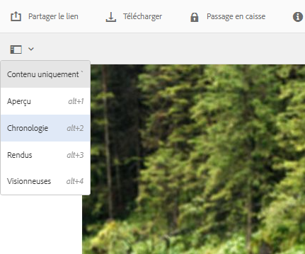

# Gestion des ressources numériques {#managing-assets-with-the-touch-optimized-ui}

Cet article explique comment gérer et modifier des ressources dans les ressources Adobe Experience Manager (AEM). Pour commencer avec l’interface utilisateur et la mise en page, voir Gestion [de base de l’interface utilisateur](/help/sites-authoring/basic-handling.md)tactile. Pour gérer les fragments de contenu, voir [Gestion des ressources de fragments](content-fragments-managing.md) de contenu.

## Création de dossiers {#creating-folders}

Lorsque vous organisez une collection de ressources, comme toutes les images `Nature`, vous pouvez créer des dossiers pour les conserver ensemble. Vous pouvez utiliser des dossiers pour classer et organiser vos ressources. AEM Assets ne nécessite pas de classer les ressources dans des dossiers pour mieux fonctionner.

>[!NOTE]
>
>* Partager un dossier de ressources du type `sling:OrderedFolder` n’est pas pris en charge lors du partage vers Marketing Cloud. If you want to share a folder, do not select [!UICONTROL Ordered] when creating a folder.
>* Experience Manager n’autorise pas l’utilisation de `subassets` mot comme nom d’un dossier. Il s’agit d’un mot-clé réservé au noeud qui contient des sous-ressources pour les ressources composées.

1. Dans le dossier Ressources numériques, accédez à l’emplacement où vous souhaitez créer un dossier. Dans le menu, cliquez sur **[!UICONTROL Créer]**. Select **[!UICONTROL New Folder]**.
1. In the **[!UICONTROL Title]** field, provide a folder name. Par défaut, DAM utilise le titre que vous avez fourni comme nom du dossier. Une fois le dossier créé, vous pouvez remplacer le nom par défaut et entrer un autre nom de dossier.
1. Cliquez sur **[!UICONTROL Créer]**. Le dossier apparaît dans le dossier Ressources numériques.

Les caractères suivants (liste de ceux-ci séparés par des espaces) ne sont pas pris en charge :

* Un nom de fichier ne peut pas contenir les caractères suivants : `* / : [ \\ ] | # % { } ? &`
* Un nom de dossier de ressources ne peut pas contenir les caractères suivants : `* / : [ \\ ] | # % { } ? \" . ^ ; + & \t`

## Upload assets {#uploading-assets}

<!-- TBD the following:
Move this section into a new article. CQDOC-14874 ticket is created for this.
In this complete article, replace emphasis with UICONTROL where appropriate.
-->

Vous pouvez transférer différents types de ressource (dont des images, des fichiers PDF, des fichiers RAW, etc.) de votre dossier local ou d’un lecteur réseau vers AEM Assets.

>[!NOTE]
>
>Dans le mode Scene 7 de Dynamic Media, vous pouvez télécharger uniquement des ressources dont la taille de fichier est de 2 Go ou inférieure.

Vous pouvez choisir de transférer des ressources vers des dossiers avec ou sans un profil de traitement attribué.

Pour les dossiers auxquels un profil de traitement est affecté, le nom du profil s’affiche sur la vignette en mode Carte. En mode Liste, le nom du profil s’affiche dans la colonne **Profil de traitement**. Reportez-vous à la section [Profils de traitement](/help/assets/processing-profiles.md).

Before uploading an asset, ensure that it is in a [format](/help/assets/assets-formats.md) that AEM Assets supports.

1. Dans l’interface utilisateur Ressources, accédez à l’emplacement où vous souhaitez ajouter des ressources numériques.
1. Pour transférer les ressources, effectuez l’une des opérations suivantes :

   * On the toolbar, tap the **[!UICONTROL Create]** icon. Then on the menu, tap **[!UICONTROL Files]**. Au besoin, vous pouvez renommer le fichier dans la boîte de dialogue affichée.
   * Dans un navigateur prenant en charge HTML5, faites glisser les ressources directement sur l’interface utilisateur Ressources. La boîte de dialogue permettant de renommer les fichiers n’est pas affichée.
   

   Pour sélectionner plusieurs fichiers, appuyez sur la touche Ctrl ou Commande et sélectionnez les fichiers dans la boîte de dialogue du sélecteur de fichiers. Lorsque vous utilisez un iPad, vous ne pouvez sélectionner qu’un seul fichier à la fois.

   Vous pouvez suspendre le transfert des ressources volumineuses (dont la taille est supérieure à 500 Mo) et reprendre ultérieurement à partir de la même page. Tap the **[!UICONTROL Pause]** icon beside progress bar that appears when an upload starts.

   

   Vous pouvez configurer la taille au-dessus de laquelle une ressource est considérée comme volumineuse. Par exemple, vous pouvez configurer le système de sorte qu’il considère les ressources dont la taille est supérieure à 1 000 Mo (au lieu de 500 Mo) comme des ressources volumineuses. In this case, **[!UICONTROL Pause]** appears on the progress bar when assets of size greater than 1000 MB are uploaded.

   Le bouton Pause ne s’affiche pas si un fichier supérieur à 1 000 Mo est chargé avec un fichier inférieur à 1 000 Mo. Toutefois, si vous annulez le téléchargement de fichier inférieur à 1 000 Mo, le bouton **[!UICONTROL Pause]** apparaît.

   To modify the size limit, configure the `chunkUploadMinFileSize` property of the `fileupload`node in the CRX repository.

   Lorsque vous cliquez sur l’icône **[!UICONTROL Pause]**, elle devient une icône **[!UICONTROL Lire]**. Pour reprendre le transfert, cliquez sur l’icône **[!UICONTROL Lire.]**

   

   To cancel an ongoing upload, click close (`X`) next to the progress bar. Lorsque vous annulez le transfert, AEM Assets supprime la partie partiellement transférée de la ressource.

   La possibilité de reprendre le téléchargement s’avère particulièrement utile dans les scénarios dans lesquels la bande passante est faible et le réseau dysfonctionne, car le téléchargement d’une ressource volumineuse prend un long moment. Vous pouvez suspendre l’opération de transfert et la reprendre ultérieurement lorsque la situation s’améliore. Lorsque vous reprenez le transfert, il commence au niveau où vous l’avez suspendu.

   Pendant l’opération de transfert, AEM enregistre les parties de la ressource en cours de transfert sous forme de blocs de données dans le référentiel CRX. Une fois le transfert terminé, AEM regroupe ces blocs en un seul bloc de données dans le référentiel.

   To configure the cleanup task for the unfinished chunk upload jobs, go to `https://[aem_server]:[port]/system/console/configMgr/org.apache.sling.servlets.post.impl.helper.ChunkCleanUpTask`.

   Si vous transférez une ressource portant le même nom qu’une ressource déjà disponible à l’emplacement où vous transférez la ressource, un message d’avertissement s’affiche.

   Vous pouvez choisir de remplacer une ressource existante, de créer une autre version ou de garder les deux en renommant la nouvelle ressource téléchargée. Si vous remplacez une ressource existante, les métadonnées de la ressource et les modifications antérieures (annotation ou recadrage, par exemple) que vous avez apportées à la ressource existante sont supprimées. If you choose to keep both assets, the new asset is renamed with number `1` appended to its name.

   

   >[!NOTE]
   >
   >When you select **[!UICONTROL Replace]** in the [!UICONTROL Name Conflict] dialog, the asset ID is regenerated for the new asset. Cet ID est différent de l’ID de la ressource précédente.
   >
   >Si l’option Statistiques des ressources est activée pour effectuer le suivi des impressions/clics avec Adobe Analytics, l’ID de ressource régénéré invalide les données capturées pour la ressource sur Analytics.

   If the asset you upload exists in AEM Assets, the **[!UICONTROL Duplicates Detected]** dialog warns that you are attempting to upload a duplicate asset. The dialog appears only if the `SHA 1` checksum value of the binary of the existing asset matches the checksum value of the asset you upload. Dans ce cas, les noms des fichiers n’ont pas d’importance.

   >[!NOTE]
   >
   >The [!UICONTROL Duplicates Detected] dialog appears only when the duplicate detection feature is enabled. To enable the duplicate detection feature, see [Enable Duplicate Detection](/help/assets/duplicate-detection.md).

   

   Pour conserver la ressource en double dans les ressources AEM, appuyez/cliquez sur **[!UICONTROL Conserver]**. Pour supprimer le fichier en double que vous avez téléchargé, appuyez/cliquez sur **[!UICONTROL Supprimer]**.

   AEM Assets vous empêche de télécharger des fichiers dont les noms contiennent des caractères interdits. Si vous tentez de télécharger un fichier dont le nom de fichier contient un caractère non autorisé ou plus, AEM Assets affiche un message d’avertissement et interrompt le téléchargement jusqu’à ce que vous supprimiez ces caractères ou que vous les téléchargiez avec un nom autorisé.

   To suit specific file naming conventions for your organization, the [!UICONTROL Upload Assets] dialog lets you specify long names for the files that you upload.

   Toutefois, la liste de caractères suivante, séparée par des espaces, n’est pas prise en charge :

   * asset file name must not contain `* / : [ \\ ] | # % { } ? &`
   * asset folder name must not contain `* / : [ \\ ] | # % { } ? \" . ^ ; + & \t`
   

   De plus, l’interface utilisateur Assets affiche la ressource la plus récente que vous avez téléchargée ou le dossier que vous avez créé en premier.

   Si vous annulez le transfert avant la fin de l’opération, AEM Assets arrête le transfert du fichier en cours et actualise le contenu. Toutefois, les fichiers déjà téléchargés ne sont pas supprimés.

   La boîte de dialogue Télécharger les éléments d’AEM Assets affiche le nombre de fichiers dont le transfert a réussi et ceux dont le transfert a échoué.

### Transferts en série {#serialuploads}

Le chargement en masse de nombreuses ressources consomme d’importantes ressources d’E/S, ce qui peut avoir des répercussions négatives sur les performances de votre instance AEM Assets. Si votre connexion Internet est lente, le temps de chargement augmente considérablement en raison d’un pic dans l’E/S du disque. De plus, votre navigateur web peut appliquer des restrictions supplémentaires au nombre de requêtes POST qui peuvent être gérées par AEM Assets dans le cadre de chargements simultanés de ressources. Par conséquent, l’opération de chargement échoue ou prend fin prématurément. Autrement dit, AEM Assets peut ignorer certains fichiers lors de l’assimilation, voire n’assimiler aucun fichier.

Pour remédier à cette situation, AEM Assets assimile une ressource à la fois (chargement en série) au cours d’une opération de chargement en masse, plutôt que d’assimiler toutes les ressources simultanément.

Le chargement en série de ressources est activé par défaut. To disable the feature and allow concurrent uploading, overlay the `fileupload` node in Crx-de and set the value of the `parallelUploads` property to `true`.

### Upload assets using FTP {#uploading-assets-using-ftp}

Dynamic Media permet de transférer des ressources par lots via un serveur FTP. Si vous avez l’intention de télécharger des fichiers volumineux (> 1 Go) ou des dossiers et sous-dossiers entiers, utilisez FTP. Vous pouvez même configurer le transfert FTP pour qu’il s’effectue de manière récurrente.

>[!NOTE]
>
>Dans le mode Scene 7 de Dynamic Media, vous pouvez télécharger uniquement des ressources dont la taille de fichier est de 2 Go ou inférieure.

>[!NOTE]
>
>Pour télécharger des fichiers via FTP en mode Contenu multimédia dynamique - Scene7, installez Feature Pack 18912 sur les instances d’auteur AEM. Contact [Adobe Customer Care](https://helpx.adobe.com/contact/enterprise-support.ec.html) to get access to FP-18912 and complete the setup of your FTP account. Pour plus d’informations, voir [Installation de Feature Pack 18912 pour la migration](/help/assets/bulk-ingest-migrate.md)des ressources en vrac.
>
>Si vous utilisez le protocole FTP pour télécharger des ressources, les paramètres de téléchargement spécifiés dans AEM sont ignorés. Des règles de traitement de fichiers, telles qu’elles sont définies dans Dynamic Media Classic, sont utilisées à la place.  

**Pour télécharger des ressources via FTP, procédez comme suit :**

1. Sélectionnez le client FTP de votre choix, puis connectez-vous à l’aide du nom d’utilisateur et du mot de passe FTP qui vous ont été envoyés par courrier électronique. Dans le client FTP, téléchargez les fichiers et/ou dossiers vers le serveur FTP.
1. [Connectez-vous à Dynamic Media Classic](https://www.adobe.com/marketing-cloud/experience-manager/scene7-login.html) à l’aide des informations de connexion qui vous ont été envoyées par e-mail. Appuyez ou cliquez sur **[!UICONTROL Télécharger]** dans la barre de navigation globale.

1. Cliquez sur l’onglet **[!UICONTROL Via FTP]** dans le coin supérieur gauche de la page Télécharger.
1. Sélectionnez le dossier FTP source à utiliser pour le transfert des fichiers dans la partie gauche de la page et le dossier de destination dans la partie droite.
1. Cliquez sur **[!UICONTROL Options tâche]** dans le coin inférieur droit de la page, puis définissez les options de votre choix sur la base des ressources du dossier que vous avez sélectionné.

   Voir [Options de la tâche de transfert](#upload-job-options).

   >[!NOTE]
   >
   >Lorsque vous transférez des ressources via FTP, les options de la tâche de transfert définies dans Dynamic Media Classic (S7) sont prioritaires sur les paramètres de traitement des ressources définis dans AEM.

1. Dans le coin inférieur droit de la boîte de dialogue Télécharger les options de la tâche, appuyez sur **[!UICONTROL Enregistrer]**.
1. Dans le coin inférieur droit de la page Télécharger, appuyez sur **[!UICONTROL Lancer le téléchargement]**.

   Pour afficher la progression du téléchargement, appuyez sur **[!UICONTROL Tâches]** dans la barre de navigation globale. La page Tâches affiche la progression du téléchargement. Vous pouvez continuer à travailler dans AEM et revenir, à tout moment, à la page Tâches dans Dynamic Media Classic afin de consulter une tâche en cours.
Pour annuler une tâche de téléchargement en cours, appuyez ou cliquez sur **[!UICONTROL Annuler]** à côté de la durée.

#### Options de la tâche de transfert {#upload-job-options}

| Option de téléchargement | Sous-option | Description |
|---|---|---|
| Nom de la tâche |  | Le nom par défaut qui est prérempli dans le champ de texte comprend la portion du nom saisie par l’utilisateur, ainsi que l’horodatage. Vous pouvez utiliser le nom par défaut ou indiquer un nom personnalisé pour cette tâche de transfert.  Cette tâche, ainsi que les autres tâches de transfert et de publication, sont enregistrées sur la page Tâches, où vous pouvez vérifier leur état. |
| Publier après le téléchargement |  | Publie automatiquement les ressources que vous téléchargez. |
| Écraser dans n’importe quel dossier, même nom de ressource de base, quelle que soit l’extension |  | Sélectionnez cette option si vous voulez que les fichiers que vous téléchargez remplacent les fichiers existants portant le même nom. Le nom de cette option peut varier en fonction des paramètres définis sous **[!UICONTROL Configuration de l’application]** > **[!UICONTROL Paramètres généraux]** > **[!UICONTROL Télécharger dans l’application]** > **[!UICONTROL Écraser les images]**. |
| Décompresser les fichiers zip ou tar lors du téléchargement |  |  |
| Options de tâche |  | Tap/ click **[!UICONTROL Job Options]** to open the [!UICONTROL Upload Job Options] dialog box and choose options that affect the entire upload job. Ces options sont identiques pour tous les types de fichiers. Vous pouvez choisir les options par défaut pour télécharger les fichiers en commençant sur la page Paramètres généraux de l’application. Pour ouvrir cette page, sélectionnez **[!UICONTROL Configuration]** > **[!UICONTROL Configuration de l’application.]**. Tap the **[!UICONTROL Default Upload Options]** button to open the [!UICONTROL Upload Job Options] dialog box. |
|  | Quand | Sélectionnez Unique ou Périodique. Pour définir une tâche périodique, sélectionnez une option de répétition (Quotidien, Hebdomadaire, Mensuel ou Personnalisé) afin d’indiquer la fréquence souhaitée pour la tâche de transfert FTP. Indiquez ensuite les options de planification suivant vos besoins. |
|  | Inclure les sous-dossiers | Téléchargez tous les sous-dossiers du dossier que vous avez l’intention de télécharger. Les noms du dossier et des sous-dossiers transférés sont saisis automatiquement dans AEM Assets. |
|  | Options de recadrage | Pour recadrer manuellement une image par ses côtés, sélectionnez le menu Recadrer, puis choisissez Manuel. Indiquez ensuite le nombre de pixels à recadrer d’un seul côté ou de chaque côté de l’image. La proportion de l’image qui est rognée dépend du paramètre ppp (pixels par pouce) défini dans le fichier d’image. Par exemple, si l’image affiche 150 ppp et que vous saisissez 75 dans les zones de texte Haut, Droite, Bas et Gauche, un demi-pouce est rogné de chaque côté.  Pour supprimer automatiquement d’une image les pixels représentant des espaces blancs, sélectionnez le menu Recadrer, cliquez sur Manuel, puis saisissez les mesures en pixels dans les champs Haut, Droite, Bas et Gauche pour recadrer au niveau des bords. Vous pouvez également sélectionner Rognage dans le menu Recadrer et choisir les options suivantes :  **Rogner en fonction de** <ul><li>**Couleur** - Choisissez l&#39;option Couleur. Sélectionnez ensuite le menu Coin, puis choisissez l’angle de l’image présentant la couleur qui correspond le mieux à l’espace blanc à rogner.</li><li>**** Transparence : sélectionnez l’option Transparence.  **Tolérance** - Faites glisser le curseur pour définir une tolérance de 0 à 1.Pour le rognage en fonction de la couleur, indiquez 0 pour rogner les pixels uniquement s’ils correspondent exactement à la couleur que vous avez sélectionnée dans l’angle de l’image. Les valeurs qui se rapprochent de 1 autorisent une plus grande différence de couleurs. Pour l’option de rognage en fonction de la transparence, indiquez 0 pour rogner les pixels seulement s’ils sont transparents. Les valeurs plus proches de 1 permettent une plus grande transparence.</li></ul> Notez que ces options de recadrage sont non destructives. |
|  | Options de profils de couleurs | Sélectionnez une conversion de couleurs lorsque vous créez des fichiers optimisés utilisés pour la livraison :<ul><li>Conservation des couleurs par défaut : conserve les couleurs des images sources lorsque les images comportent des informations d’espace colorimétrique ; il n’y a aucune conversion des couleurs. Actuellement, le profil colorimétrique approprié est déjà intégré dans pratiquement toutes les images. Cependant, si une image source CMJN ne contient pas de profil colorimétrique intégré, les couleurs sont converties dans l’espace colorimétrique sRVB (Rouge Vert Bleu standard). sRVB est l’espace colorimétrique recommandé pour l’affichage d’images sur des pages web.</li><li>Conserver l’espace colorimétrique original : conserve les couleurs d’origine sans conversion des couleurs au niveau du point. Pour les images sans profil colorimétrique incorporé, toute conversion des couleurs s’effectue à l’aide des profils colorimétriques par défaut configurés dans les Paramètres de publication. Les profils de couleurs peuvent ne pas correspondre aux couleurs des fichiers créés avec cette option. Par conséquent, vous êtes invité à utiliser l’option de conservation des couleurs par défaut.</li><li>Personnaliser de > en  Permet d’accéder aux menus pour sélectionner un espace colorimétrique source (Convertir de) et un espace colorimétrique cible (Convertir en). Cette option avancée remplace toutes les informations de couleur incorporées dans le fichier source. Sélectionnez cette option uniquement lorsque toutes les images que vous envoyez contiennent des données de profil de couleurs incorrectes ou manquantes.</li></ul> |
|  | Options d’édition d’images | Vous pouvez conserver les masques d’écrêtage dans les images et choisir un profil de couleurs.  Voir [Définition des options d’édition d’image lors du téléchargement](#setting-image-editing-options-at-upload). |
|  | Options Postscript | Vous pouvez pixelliser les fichiers PostScript®, recadrer les fichiers, conserver les arrière-plans transparents et choisir une résolution ainsi qu’un espace colorimétrique.  Voir [Définition des options de téléchargement PostScript et Illustrator](#setting-postscript-and-illustrator-upload-options). |
|  | Options Photoshop | Vous pouvez créer des modèles à partir de fichiers Adobe® Photoshop®, conserver les calques, définir la méthode d’attribution des noms de calque, extraire du texte et indiquer le mode d’ancrage des images dans les modèles.  Notez que les modèles ne sont pas pris en charge dans AEM.  Voir [Définition des options de téléchargement Photoshop](#setting-photoshop-upload-options). |
|  | Options PDF | Vous pouvez pixelliser les fichiers, extraire des mots de recherche et des liens, générer automatiquement un catalogue électronique, définir la résolution et choisir un espace de couleurs.  Notez que les catalogues électroniques ne sont pas pris en charge dans AEM.   Voir [Définition des options de téléchargement PDF](#setting-pdf-upload-options). |
|  | Options Illustrator | Vous pouvez pixelliser les fichiers Adobe Illustrator®, conserver l’arrière-plan transparent, choisir une résolution et sélectionner un espace de couleurs.  Voir [Définition des options de téléchargement PostScript et Illustrator](#setting-postscript-and-illustrator-upload-options). |
|  | Options eVideo | Vous pouvez transcoder un fichier vidéo en sélectionnant un paramètre vidéo prédéfini.  Voir [Définition des options de téléchargement eVideo](#setting-evideo-upload-options). |
|  | Paramètres prédéfinis d’ensemble par lot | Pour créer automatiquement une visionneuse d’images ou une visionneuse à 360° à partir de fichiers téléchargés, cliquez sur la colonne Actif correspondant au paramètre prédéfini à utiliser. Vous pouvez sélectionner plusieurs paramètres prédéfinis. Les paramètres prédéfinis sont créés sur la page Configuration de l’application/Paramètres prédéfinis d’ensemble par lot de Dynamic Media Classic. Pour en savoir plus sur la création de paramètres prédéfinis d’ensemble par lot, voir [Configuration de paramètres prédéfinis d’ensemble par lot pour générer automatiquement des visionneuses d’images et des visionneuses à 360°](config-dms7.md#creating-batch-set-presets-to-auto-generate-image-sets-and-spin-sets).  Voir [Définition de paramètres prédéfinis d’ensemble par lot lors du téléchargement](#setting-batch-set-presets-at-upload). |

#### Set image editing options at upload {#setting-image-editing-options-at-upload}

When uploading image files, including AI, EPS, and PSD files, you can take the following editing actions in the [!UICONTROL Upload Job Options] dialog box:

* Rogner l’espace blanc du contour des images (voir la description dans le tableau ci-dessus).
* Recadrer manuellement des images par leurs côtés (voir la description dans le tableau ci-dessus).
* Choisir un profil colorimétrique (voir la description de l’option dans le tableau ci-dessus).
* Créer un masque à partir d’un chemin de tracé.
* Accentuer les images grâce aux options de masquage flou.
* Masquer l’arrière-plan.

<!--
| Option | Sub-option | Description |
|---|---|---|
| Create Mask From Clipping Path | | Create a mask for the image based on its clipping path information. This option applies to images created with image-editing applications in which a clipping path was created. |
| Unsharp Masking | | Lets you fine-tune a sharpening filter effect on the final downsampled image, controlling the intensity of the effect, the radius of the effect (as measured in pixels), and a threshold of contrast that is ignored.  This effect uses the same options as Photoshop’s Unsharp Mask filter. Contrary to what the name suggests, Unsharp Mask is a sharpening filter. Under Unsharp Masking, set the options you want. Setting options are described in the following: |
| | Amount | Controls the amount of contrast that is applied to edge pixels.  Think of it as the intensity of the effect. The main difference between the amount values of Unsharp Mask in Dynamic Media and the amount values in Adobe Photoshop, is that Photoshop has an amount range of 1% to 500%. Whereas, in Dynamic Media, the value range is 0.0 to 5.0. A value of 5.0 is the rough equivalent of 500% in Photoshop; a value of 0.9 is the equivalent of 90%, and so on. |
| | Radius | Controls the radius of the effect. The value range is 0-250.  The effect is run on all pixels in an image and radiates out from all pixels in all directions. The radius is measured in pixels. For example, to get a similar sharpening effect for a 2000 x 2000 pixel image and 500 x 500 pixel image, you would set a radius of two pixels on the 2000 x 2000 pixel image and a radius value of one pixel on the 500 x 500 pixel image. A larger value is used for an image that has more pixels. |
| | Threshold | Threshold is a range of contrast that is ignored when the Unsharp Mask filter is applied. It is important so that no "noise" is introduced to an image when this filter is used. The value range is 0-255, which is the number of brightness steps in a grayscale image. 0=black, 128=50% gray and 255=white.  For example, a threshold value of 12 ignores slight variations is skin tone brightness to avoid adding noise, but still add edge contrast to areas such as where eyelashes meet skin.  For example, if you have a photo of someone’s face, the Unsharp Mask affects the parts of the image, such as where eyelashes and skin meet to create an obvious area of contrast, and the smooth skin itself. Even the smoothest skin exhibits subtle changes in brightness values. If you do not use a threshold value, the filter accentuates these subtle changes in skin pixels. In turn, a noisy and undesirable effect is created while contrast on the eyelashes is increased, enhancing sharpness.  To avoid this issue, a threshold value is introduced that tells the filter to ignore pixels that do not change contrast dramatically, like smooth skin.  In the zipper graphic shown earlier, notice the texture next to the zippers. Image noise is exhibited because the threshold values were too low to suppress the noise. |
| | Monochrome | Select to unsharp-mask image brightness (intensity).  Deselect to unsharp-mask each color component separately. |
| Knockout Background | | Automatically removes the background of an image when you upload it. This technique is useful to draw attention to a particular object and make it stand out from a busy background. Select to enable or “turn on” the Knockout Background feature and the following sub-options: |
| | Corner | Required.  The corner of the image that is used to define the background color to knockout.  You can choose from **Upper Left**, **Bottom Left**, **Upper Right**, or **Bottom Right**. |
| | Fill Method | Required.  Controls pixel transparency from the Corner location that you set.  You can choose from the following fill methods: <ul><li>**Flood Fill** - turns all pixels transparent that match the Corner that you have specified and are connected to it.</li><li>**Match Pixel** - turns all matching pixels transparent, regardless of their location on the image.</li></ul> |
| | Tolerance | Optional.  Controls the allowable amount of variation in pixel color matching based on the Corner location that you set.  Use a value of 0.0 to match pixel colors exactly or, use a value of 1.0 to allow for the greatest variation. |
-->

#### Set PostScript and Illustrator upload options {#setting-postscript-and-illustrator-upload-options}

Lorsque vous transférez des fichiers d’image PostScript (EPS) ou Illustrator (AI), vous pouvez les formater de différentes manières. Vous pouvez pixelliser les fichiers, conserver l’arrière-plan transparent, choisir une résolution et sélectionner un espace colorimétrique. Options for formatting PostScript and Illustrator files are available in the [!UICONTROL Upload Job Options] dialog box under [!UICONTROL PostScript Options] and [!UICONTROL Illustrator Options].

| Option | Sous-option | Description |
|---|---|---|
| Traitement en cours |  | Sélectionnez **[!UICONTROL Pixelliser]** pour convertir les graphiques vectoriels du fichier au format bitmap. |
| Conserver la transparence en arrière-plan dans l’image rendue |  | Conserve la transparence en arrière-plan du fichier. |
| Résolution |  | Détermine le paramètre de résolution. Ce paramètre détermine le nombre de pixels affichés par pouce dans le fichier. |
| Espace colorimétrique |  | Dans le menu Espace colorimétrique, sélectionnez l’une des options d’espace colorimétrique suivantes : |
|  | Détecter automatiquement | Conserve l’espace colorimétrique du fichier. |
|  | Forcer comme RVB | Applique l’espace colorimétrique RVB. |
|  | Forcer comme CMJN | Applique l’espace colorimétrique CMJN. |
|  | Forcer comme Niveaux de gris | Applique l’espace colorimétrique Niveaux de gris. |

#### Définition des options de téléchargement Photoshop {#setting-photoshop-upload-options}

Les fichiers de document Photoshop (PSD) sont le plus souvent utilisés pour créer des modèles d’image. When you upload a PSD file, you can create an image template automatically from the file (select the [!UICONTROL Create Template] option on the Upload screen).

Dynamic Media crée plusieurs images à partir d’un fichier PSD avec des calques si vous utilisez ce fichier pour créer un modèle ; il crée une image par calque.

Use the [!UICONTROL Crop Options] and [!UICONTROL Color Profile Options], described above, with Photoshop upload options.

>[!NOTE]
>
>Les modèles ne sont pas pris en charge dans AEM.

| Option | Sous-option | Description |
|---|---|---|
| Conserver les calques |  | Pixellise les calques du fichier PSD, le cas échéant, dans des fichiers individuels. Les calques de ces fichiers restent associés au fichier PSD. Pour les afficher, ouvrez le fichier PSD dans le mode d’affichage Détail et sélectionnez le panneau Calque. |
| Créer un modèle |  | Crée un modèle à partir des calques du fichier PSD. |
| Extraire du texte |  | Extrait le texte pour permettre aux utilisateurs de rechercher une chaîne de caractères dans une visionneuse. |
| Étendre les calques à la taille du fond |  | Étend la taille des calques d’image pixellisés à celle du calque en arrière-plan. |
| Affectation de nom de calque |  | Les calques du fichier PSD sont téléchargés comme des images distinctes. |
|  | Nom de couche | Les images adoptent le nom de leur calque dans le fichier PSD. Par exemple, un calque nommé Étiquette de prix dans le fichier PSD d’origine devient une image nommée Étiquette de prix. Cependant, si les calques du fichier PSD portent les noms de calques Photoshop par défaut (Arrière-plan, Calque 1, Calque 2, etc.), les images sont nommées d’après leur numéro de calque dans le fichier PSD, et non d’après leur nom de calque par défaut. |
|  | Photoshop et numéro de couche | Nomme les images d’après leur numéro de calque dans le fichier PSD, leur nom de calque d’origine étant ignoré. Le nom des images est composé du nom de fichier Photoshop et d’un numéro de calque. Par exemple, le deuxième calque d’un fichier appelé Pub printemps.psd est nommé Pub printemps_2, même s’il portait un nom personnalisé dans Photoshop. |
|  | Photoshop et nom de couche | Nomme les images en reprenant le nom du fichier PSD suivi du nom ou du numéro de calque. Le numéro de calque est utilisé si le nom du calque dans le fichier PSD est un nom de calque Photoshop par défaut. Par exemple, un calque nommé Étiquette de prix dans un fichier PSD appelé Pub Printemps est nommé Pub Printemps_Étiquette de prix. Un calque portant le nom par défaut Calque 2 est nommé Pub Printemps_2. |
| Ancre |  | Indiquez le mode d’ancrage des images dans les modèles qui sont générés à partir de la composition superposée produite à partir du fichier PSD. Par défaut, l’ancrage est au centre. Un ancrage au centre permet aux images de remplacement de remplir de manière optimale le même espace, quelles que soient les proportions de l’image de remplacement. Les images qui remplacent cette image et qui présentent un aspect différent occupent le même espace lorsque le modèle est référencé et le paramètre de substitution utilisé. Changez de paramètre si votre application exige que les images de remplacement occupent l’espace alloué dans le modèle. |

#### Définition des options de téléchargement de PDF {#setting-pdf-upload-options}

Lorsque vous transférez un fichier PDF, vous pouvez le formater de différentes manières. Vous pouvez recadrer les pages, extraire des mots de recherche, spécifier une résolution en pixels par pouce et choisir un espace colorimétrique. Les fichiers PDF contiennent souvent une marge de rognage, des traits de coupe, des repères de montage et d’autres repères d’impression. Vous pouvez éliminer ces marques sur les côtés des pages lorsque vous transférez un fichier PDF.

>[!NOTE]
>
>Les catalogues électroniques ne sont pas pris en charge dans AEM.

Faites votre choix parmi les options suivantes :

| Option | Sous-option | Description |
|---|---|---|
| Traitement en cours | Pixelliser | (Par défaut) Pixellise les pages du fichier PDF et convertit les graphiques vectoriels en images bitmap. Sélectionnez cette option pour créer un catalogue électronique. |
| Extraire | Termes de recherche | Extrait les termes du fichier PDF afin qu’ils puissent être recherchés par mot-clé dans une visionneuse de catalogue électronique. |
|  | Liens | Extrait les liens des fichiers PDF et les convertit en zones cliquables utilisées dans une visionneuse de catalogue électronique. |
| Générer automatiquement un catalogue électronique à partir d’un PDF de plusieurs pages |  | Crée automatiquement un catalogue électronique à partir du fichier PDF. Le catalogue électronique reprend le nom du fichier PDF que vous avez transféré (cette option n’est disponible que si vous pixellisez le fichier PDF au moment du transfert). |
| Résolution |  | Détermine le paramètre de résolution. Ce paramètre définit le nombre de pixels affichés par pouce dans le fichier PDF. La valeur par défaut est 150. |
| Espace colorimétrique |  | Dans le menu Espace colorimétrique, sélectionnez un espace colorimétrique pour le fichier PDF. La plupart des fichiers PDF contiennent des images en couleurs RVB et CMJN. L’espace colorimétrique RVB est préférable pour un affichage à l’écran. |
|  | Détecter automatiquement | Conserve l’espace colorimétrique du fichier PDF. |
|  | Forcer comme RVB | Applique l’espace colorimétrique RVB. |
|  | Forcer comme CMJN | Applique l’espace colorimétrique CMJN. |
|  | Forcer comme Niveaux de gris | Applique l’espace colorimétrique Niveaux de gris. |

#### Définition des options de téléchargement eVideo {#setting-evideo-upload-options}

Pour transcoder un fichier vidéo en choisissant parmi divers paramètres vidéo prédéfinis.

| Option | Sous-option | Description |
|---|---|---|
| Vidéo adaptative |  | Un paramètre prédéfini de codage unique qui fonctionne avec n’importe quel format pour créer des vidéos à diffuser sur des périphériques mobiles, des tablettes et des ordinateurs de bureau. Les vidéos source transférées qui sont codées à l’aide de ce paramètre prédéfini sont définies avec une hauteur fixe. Toutefois, la largeur est automatiquement mise à l’échelle pour conserver les proportions de la vidéo.  Il est recommandé d’utiliser le codage de vidéo adaptative. |
| Paramètres prédéfinis de codage uniques | Trier les paramètres prédéfinis de codage | Sélectionnez Nom ou Taille pour trier les paramètres prédéfinis de codage répertoriés sous Bureau, Mobile et Tablette par nom ou par taille de résolution. |
|  | Poste de travail | Créez un fichier MP4 pour diffuser une expérience vidéo progressive ou en flux continu sur les ordinateurs de bureau.Sélectionnez un ou plusieurs formats avec la taille de résolution et le débit de données cible de votre choix. |
|  | Mobile | Créez un fichier MP4 pour une diffusion sur des périphériques mobiles iPhone ou Android.Sélectionnez un ou plusieurs formats avec la taille de résolution et le débit de données cible de votre choix. |
|  | Tablette | Créez un fichier MP4 pour une diffusion sur des tablettes iPad ou Android.Sélectionnez un ou plusieurs formats avec la taille de résolution et le débit de données cible de votre choix. |

#### Set Batch Set Presets at upload {#setting-batch-set-presets-at-upload}

Si vous souhaitez créer automatiquement une visionneuse d’images ou une visionneuse à 360° à partir d’images téléchargées, cliquez sur la colonne Actif correspondant au paramètre prédéfini à utiliser. Vous pouvez sélectionner plusieurs paramètres prédéfinis. 

Pour en savoir plus sur la création de paramètres prédéfinis d’ensemble par lot, voir [Configuration de paramètres prédéfinis d’ensemble par lot pour générer automatiquement des visionneuses d’images et des visionneuses à 360°](/help/assets/config-dms7.md#creating-batch-set-presets-to-auto-generate-image-sets-and-spin-sets).

### Transferts en continu {#streamed-uploads}

Si vous transférez de nombreux fichiers vers AEM, les demandes d’E/S vers le serveur augmentent considérablement, ce qui réduit l’efficacité du transfert et peut même entraîner l’expiration de certaines tâches de transfert. AEM Assets prend en charge le transfert en continu de ressources. Le transfert en flux continu réduit les E/S disque pendant l’opération de transfert en évitant le stockage des ressources dans un dossier temporaire sur le serveur avant de le copier dans le référentiel. Au lieu de cela, les données sont transférées directement vers le référentiel. Cela permet à la fois d’accélérer le transfert de ressources volumineuses et de réduire les risques d’expiration. Le transfert en continu est activé par défaut dans AEM Assets.

>[!NOTE]
>
>Le téléchargement en flux continu est désactivé pour AEM s’exécutant sur le serveur JEE avec une version servlet-api inférieure à 3.1.

### Extraction d’une archive ZIP contenant des ressources {#extractzip}

Vous pouvez télécharger des archives ZIP comme tout autre ressource prise en charge. Les mêmes règles de nom de fichier s’appliquent aux fichiers ZIP. AEM vous permet d’extraire une archive ZIP vers un emplacement DAM. Si les fichiers d’archives ne contiennent pas d’extension ZIP, activez la détection de type de fichier à l’aide du contenu.

Sélectionnez une archive ZIP à la fois, cliquez sur **[!UICONTROL Extraire l’archive]**, puis sélectionnez un dossier de destination. Sélectionnez une option pour gérer les conflits, le cas échéant. Si les ressources du fichier ZIP existent déjà dans le dossier de destination, vous pouvez sélectionner l’une des options suivantes : ignorer l’extraction, remplacer les fichiers existants, conserver les deux fichiers en attribuant un nouveau nom ou créer une nouvelle version.

Une fois l’extraction terminée, AEM vous avertit dans la zone de notification. Lorsqu’AEM extrait le fichier ZIP, vous pouvez reprendre votre travail sans interrompre l’extraction.

La fonctionnalité présente certaines limites :

* Si un dossier portant le même nom existe à la destination, les ressources du fichier ZIP sont extraites dans le dossier existant.
* Si vous annulez l’extraction, les ressources déjà extraites ne sont pas supprimées.
* Vous ne pouvez pas sélectionner deux fichiers ZIP simultanément et les extraire. Vous pouvez seulement extraire une archive ZIP à la fois.
* Lors du téléchargement d’une archive ZIP, si la boîte de dialogue de téléchargement affiche un message d’erreur de serveur 500, réessayez après avoir installé le dernier Service Pack.

## Aperçu des fichiers {#previewing-assets}

Pour prévisualiser un fichier, procédez comme suit.

1. Dans l’interface utilisateur Ressources, accédez à l’emplacement de la ressource à prévisualiser.
1. Appuyez sur la ressource concernée pour l’ouvrir.

1. En mode Aperçu, les options de zoom sont disponibles pour les [types d’images pris en charge](/help/assets/assets-formats.md#supported-raster-image-formats) (avec modification interactive).

   To zoom into an asset, tap/click `+` (or tap/click the magnifying glass on the asset). Pour effectuer un zoom arrière, appuyez/cliquez sur `-`. Lorsque vous effectuez un zoom avant, vous pouvez observer en détail une zone de l’image en réalisant un panoramique. La flèche de zoom réinitialisé vous ramène à la vue d’origine.

   

   Tap **[!UICONTROL Reset]** to reset the view to the original size.

   

**Prévisualisation de fichiers à l’aide de touches du clavier uniquement**

Pour prévisualiser un fichier à l’aide du clavier, procédez comme suit :

1. Dans l’interface utilisateur Ressources, accédez à l’emplacement de la ressource à prévisualiser, à l’aide des touches fléchées `Tab` et des touches fléchées.

1. Ouvrez le fichier souhaité.

   In the preview mode, zoom and reset options are available for [supported Image types](/help/assets/assets-formats.md#supported-raster-image-formats) (with interactive editing).
1. Pour effectuer un zoom avant sur le fichier :
   1. Utilisez `Tab` la touche pour déplacer la cible d’action vers l’icône de zoom avant.
   1. Utilisez `Enter` la touche pour effectuer un zoom avant sur l’image.
   Pour effectuer un zoom arrière, utilisez `Tab` la touche pour déplacer la cible d’action vers l’icône de zoom arrière et appuyez sur `Enter`.

1. Utilisez `Shift` + `Tab` touches pour recentrer la mise au point sur l’image.

1. Utilisez les touches fléchées pour vous déplacer dans l’image agrandie.

See also [Preview Dynamic Media Assets.](/help/assets/previewing-assets.md)

## Modification des propriétés et des métadonnées {#editing-properties}

1. Accédez à l’emplacement de la ressource dont vous souhaitez modifier les métadonnées.

1. Select the asset, and tap/click **[!UICONTROL Properties]** from the toolbar to view asset properties. Vous pouvez également sélectionner l’action rapide **[!UICONTROL Propriétés]** sur la carte de la ressource.

   

1. In the [!UICONTROL Properties] page, edit the metadata properties under various tabs. Par exemple, sous l’onglet **[!UICONTROL De base]**, modifiez le titre, la description et ainsi de suite.

   >[!NOTE]
   >
   >The layout of the [!UICONTROL Properties] page and the metadata properties available depend on the underlying metadata schema. To learn how to modify the layout of the [!UICONTROL Properties] page, see [Metadata Schemas](/help/assets/metadata-schemas.md).

1. Pour programmer une date/heure spécifique pour l’activation de la ressource, utilisez le sélecteur de date en regard du champ **[!UICONTROL Heure]**.

   

1. To deactivate the asset after a particular duration, choose the deactivation date/time from the date picker beside the **[!UICONTROL Off Time]** field. La date de désactivation doit être postérieure à la date d’activation de la ressource. Après l’heure [!UICONTROL de]désactivation, une ressource et ses rendus ne sont pas disponibles via l’interface Web Ressources ou via l’API HTTP.

   

1. Sélectionnez une ou plusieurs balises dans le champ **[!UICONTROL Balises]**. Pour ajouter une balise personnalisée, saisissez son nom dans la zone appropriée et appuyez ensuite sur Entrée. La nouvelle balise est enregistrée dans AEM. YouTube requiert la publication de balises. See [publish videos to YouTube](video.md#publishing-videos-to-youtube).

   >[!NOTE]
   >
   >Pour créer des balises, vous devez disposer de l’autorisation d’écriture `/content/cq:tags/default` dans le référentiel CRX.

1. Pour attribuer une évaluation à la ressource, appuyez/cliquez sur l’onglet **[!UICONTROL Avancé]**, puis appuyez/cliquez sur l’étoile à l’emplacement approprié pour attribuer l’évaluation souhaitée.

   

   Le score d’évaluation que vous affectez à la ressource s’affiche sous **[!UICONTROL Vos évaluations]**. Le score d’évaluation moyen que la ressource a reçu des utilisateurs qui ont évalué la ressource s’affiche sous **[!UICONTROL Évaluation]**. De plus, la répartition des scores d’évaluation contribuant au score d’évaluation moyen s’affiche sous **[!UICONTROL Ventilation d’évaluation]**. Vous pouvez rechercher des ressources en fonction de leur score d’évaluation moyen.

1. To view usage usage statistics for the asset, click/tap the **[!UICONTROL Insights]** tab.

   Les statistiques d’utilisation comprennent les suivantes :

   * Le nombre de fois que la ressource a été visualisée ou téléchargée.
   * Les canaux/périphériques via lesquels la ressource a été utilisée.
   * Des solutions de création où la ressource a été récemment utilisée.
   Pour plus d’informations, reportez-vous à la section [Informations sur les ressources](/help/assets/touch-ui-asset-insights.md).

1. Appuyez/cliquez sur **[!UICONTROL Enregistrer et fermer]**.
1. Accédez à l’interface utilisateur Ressources. Les propriétés des métadonnées modifiées, notamment le titre, la description et les évaluations, sont affichées sur la carte des ressources en mode Carte et dans les colonnes pertinentes en mode Liste.

## Copie de fichiers {#copying-assets}

Lorsque vous copiez une ressource ou un dossier, l’intégralité de la ressource ou le dossier sont copiés, avec la structure du contenu. Une ressource copiée ou un dossier sont dupliqués à l’emplacement cible. La ressource stockée à l’emplacement source n’est pas modifiée.

Quelques attributs uniques à une copie spécifique d’une ressource ne sont pas reportés. Voici quelques exemples :

* ID du fichier, date et heure de création, versions et historique des versions. Some of these properties are indicated by the properties `jcr:uuid`, `jcr:created`, and `cq:name`.

* L’heure de création et les chemins référencés sont uniques pour chaque ressource et chaque rendu.

Les autres propriétés et informations de métadonnées sont conservées. Une copie partielle n’est pas créée lors de la copie d’une ressource.

1. From the Assets UI, select one or more assets, and then tap/click the **[!UICONTROL Copy]** icon from the toolbar. Alternatively, select the **[!UICONTROL Copy]** quick action from the asset card.
   

   >[!NOTE]
   >
   >If you use the [!UICONTROL Copy] quick action, you can only copy one asset at a time.

1. Accédez à l’emplacement où vous souhaitez copier les ressources.

   >[!NOTE]
   >
   >Si vous copiez une ressource au même endroit, AEM génère automatiquement une variante du nom. For example, if you copy an asset titled `Square`, AEM automatically generates the title for its copy as `Square1`.

1. Click/ tap the **[!UICONTROL Paste]** asset icon from the toolbar.

   Les ressources sont ensuite copiées à cet emplacement.

   >[!NOTE]
   >
   >The **[!UICONTROL Paste]** icon is available in the toolbar until the paste operation is completed.

### Déplacer ou renommer des fichiers {#moving-or-renaming-assets}

1. Accédez à l’emplacement de la ressource à déplacer.

1. Select the asset, and tap/click the **[!UICONTROL Move]** icon from the toolbar.
   

1. Dans l’Assistant de déplacement des ressources, procédez comme suit :

   * Spécifiez le nom de la ressource après l’avoir déplacée. Then tap/click **[!UICONTROL Next]** to proceed.

   * Tap/click **[!UICONTROL Cancel]** to stop the process.
   >[!NOTE]
   >
   >* Vous pouvez attribuer le même nom à la ressource si aucune autre ressource portant ce nom n’existe dans le nouvel emplacement. Cependant, vous devez utiliser un nouveau nom si vous déplacez la ressource vers un emplacement dans lequel une ressource portant le même nom existe. Si vous utilisez le même nom, le système génère automatiquement une variante du nom. Par exemple, si votre ressource porte le nom Carré, le système génère le nom Carré1 pour sa copie.
   >* Lors de l’attribution d’un nouveau nom à un fichier, aucun espace n’est autorisé dans le nom.

1. On the **[!UICONTROL Select Destination]** dialog, do one of the following:

   * Navigate to the new location for the assets, and then tap/click **[!UICONTROL Next]** to proceed.

   * Tap/click **[!UICONTROL Back]** to return to the **[!UICONTROL Rename]** screen.

1. If the assets being moved have any referencing pages, assets, or collections, the **[!UICONTROL Adjust References]** tab appears beside the **[!UICONTROL Select Destination]** tab.

   Do one of the following in the **[!UICONTROL Adjust References]** screen:

   * Specify the references to be adjusted based on the new details, and then tap/click **[!UICONTROL Move]** to proceed.

   * Dans la colonne **[!UICONTROL Ajuster]**, sélectionnez/annulez la sélection des références aux ressources.
   * Tap/click **[!UICONTROL Back]** to return to the **[!UICONTROL Select Destination]** screen.

   * Tap/click **[!UICONTROL Cancel]** to stop the move operation.
   Si vous ne mettez pas à jour les références, elles continuent à pointer vers le chemin précédent de la ressource. Si vous adaptez les références, elles sont mises à jour avec le nouveau chemin de la ressource.

## Gestion des rendus {#managing-renditions}

1. Vous pouvez ajouter ou supprimer des rendus correspondant à une ressource, à l’exception de celle d’origine. Accédez à l’emplacement de la ressource pour laquelle vous souhaitez ajouter ou supprimer des rendus.

1. Appuyez/cliquez sur la ressource pour ouvrir sa page.

   

1. Tap/click the GlobalNav icon, and select **[!UICONTROL Renditions]** from the list.

   

1. Dans le panneau **[!UICONTROL Rendus]**, consultez la liste des rendus générés pour la ressource.

   

   >[!NOTE]
   >
   >Par défaut, AEM Assets n’affiche pas le rendu d’origine de la ressource en mode Aperçu. Si vous êtes administrateur, vous pouvez utiliser des incrustations pour configurer AEM Assets de manière à afficher les rendus d’origine dans ce mode.

1. Sélectionnez un rendu afin de l’afficher ou de le supprimer.

   **Suppression d’un rendu**

   Select a rendition from the **[!UICONTROL Renditions]** panel, and then tap/click the **[!UICONTROL Delete Rendition]** icon from the toolbar.

   

   **Téléchargement d’un nouveau rendu**

   Accédez à la page des détails de la ressource, puis appuyez/cliquez sur l’icône **[!UICONTROL Ajouter le rendu]** dans la barre d’outils pour télécharger un nouveau rendu pour la ressource.

   

   >[!NOTE]
   >
   >Si vous sélectionnez un rendu dans le panneau **[!UICONTROL Rendus]**, la barre d’outils change de contexte et affiche uniquement les actions pertinentes pour le rendu. Les options, telles que l’icône Télécharger le rendu, ne s’affichent pas. Pour afficher ces options dans la barre d’outils, accédez à la page des détails de la ressource.

   Vous pouvez configurer les dimensions du rendu à afficher dans la page de détails d’une ressource image ou vidéo. AEM Assets affiche le rendu selon les dimensions exactes ou les plus proches de celles spécifiées.

   Pour configurer les dimensions de rendu d’une image au niveau des détails de la ressource, superposez le nœud `renditionpicker` (`libs/dam/gui/content/assets/assetpage/jcr:content/body/content/content/items/assetdetail/items/col1/items/assetview/renditionpicker`) et configurez la valeur de la propriété de largeur. Configurez la **[!UICONTROL taille de la propriété (Long) en Ko]** au lieu de la largeur pour personnaliser le rendu sur la page des détails de la ressource en fonction de la taille de l’image. Pour effectuer une personnalisation basée sur la taille, la propriété `preferOriginal` attribue une préférence à l’original si la taille du rendu associé est supérieure à celle de l’original.

   De même, vous pouvez personnaliser l’image de la page Annotation en superposant `libs/dam/gui/content/assets/annotate/jcr:content/body/content/content/items/content/renditionpicker`.

   

   To configure rendition dimensions for a video asset, navigate to the `videopicker` node in the CRX repository at the location `/libs/dam/gui/content/assets/assetpage/jcr:content/body/content/content/items/assetdetail/items/col1/items/assetview/videopicker`, overlay the node, and then edit the appropriate property.

   >[!NOTE]
   >
   >Les annotations vidéo ne sont prises en charge que sur les navigateurs qui acceptent les formats vidéo compatibles avec HTML5. Selon le navigateur, différents formats vidéo sont en outre pris en charge.

Pour plus d’informations sur la génération et l’affichage des sous-ressources, voir [Gestion des sous-ressources](managing-linked-subassets.md#generate-subassets).

## Supprimer des ressources {#deleting-assets}

Pour résoudre ou supprimer les références entrantes provenant d’autres pages, mettez à jour les références appropriées avant de supprimer une ressource.

De plus, désactivez le bouton Forcer la suppression à l’aide d’un recouvrement afin d’empêcher les utilisateurs de supprimer des ressources référencées et de conserver des liens rompus.

1. Accédez à l’emplacement des ressources que vous souhaitez supprimer.

1. Select the asset, and tap/click the **[!UICONTROL Delete]** icon from the toolbar.

   

1. Dans la boîte de dialogue de confirmation, cliquez sur :

   * **[!UICONTROL Annuler]** pour arrêter l’action
   * **[!UICONTROL Supprimer]** pour confirmer l’action :

      * Si la ressource ne comporte aucune référence, elle est supprimée.
      * Si la ressource comporte des références, un message d’erreur vous informe qu’**une ou plusieurs ressources sont référencées.** Vous pouvez sélectionner **[!UICONTROL Forcer la suppression]** ou **[!UICONTROL Annuler]**.
   >[!NOTE]
   >
   >Pour supprimer des fichiers, un utilisateur doit disposer d’autorisations de suppression sur `dam/asset`. Si vous disposez uniquement d’autorisations de modification, vous pourrez seulement modifier les métadonnées de la ressource et ajouter des annotations à cette dernière. Toute suppression s’avérera impossible.

   >[!NOTE]
   >
   >Pour résoudre ou supprimer les références entrantes provenant d’autres pages, mettez à jour les références appropriées avant de supprimer une ressource. De plus, désactivez le bouton Forcer la suppression à l’aide d’un recouvrement afin d’empêcher les utilisateurs de supprimer des ressources référencées et de conserver des liens rompus.

## Téléchargement de ressources {#downloading-assets}

Voir [Téléchargement de ressources à partir d’AEM](/help/assets/download-assets-from-aem.md).

## Publish assets {#publishing-assets}

>[!NOTE]
>
>Pour obtenir des informations spécifiques à Dynamic Media, voir [Publication de ressources Dynamic Media.](/help/assets/publishing-dynamicmedia-assets.md)

1. Accédez à l’emplacement des ressources/du dossier que vous souhaitez publier.

1. Sélectionnez l’action rapide **[!UICONTROL Publier]** dans la carte de ressources ou sélectionnez la ressource et appuyez/cliquez sur l’icône **[!UICONTROL Publication rapide]** dans la barre d’outils.
1. Si la ressource fait référence à d’autres ressources, ses références sont répertoriées dans l’Assistant. Seules les références qui ont été modifiées ou dont la publication a été annulée depuis leur dernière publication/annulation de publication sont affichées. Choisissez les références que vous souhaitez publier.

   

   >[!NOTE]
   >
   >Les dossiers vides, qui font partie d’un dossier que vous avez publié, ne sont pas publiés.

1. Appuyez/cliquez sur **[!UICONTROL Publier]** pour confirmer l’activation des ressources.

>[!CAUTION]
>
>Si vous publiez une ressource qui est en cours de traitement, seul le contenu original est publié. Les rendus sont absents. Vous pouvez attendre la fin du traitement avant de publier ou republier la ressource une fois le traitement terminé.

## Annulation de la publication de fichiers {#unpublishing-assets}

1. Accédez à l’emplacement de la ressource/du dossier de ressources que vous souhaitez supprimer de l’environnement de publication (annuler la publication).

1. Select the asset/folder to unpublish, and tap/click the **[!UICONTROL Manage Publication]** icon from the toolbar.

   

1. Select the **[!UICONTROL Unpublish]** action from the list.

   

1. Pour annuler la publication de la ressource à une date ultérieure, sélectionnez **[!UICONTROL Annuler la publication ultérieurement]**, puis choisissez une date d’annulation de la publication de la ressource.
1. Planifiez une date à laquelle la ressource devient indisponible dans l’environnement de publication.
1. Si la ressource fait référence à d’autres ressources, sélectionnez les références dont vous souhaitez annuler la publication. Tap/click **[!UICONTROL Unpublish]**.
1. Dans la boîte de dialogue de confirmation, appuyez/cliquez sur :

   * **[!UICONTROL Annuler]** pour arrêter l’action
   * **[!UICONTROL Annulez la publication]** pour confirmer que les fichiers sont dépubliés (ils ne sont plus disponibles dans l’environnement de publication) à la date spécifiée.
   >[!NOTE]
   >
   >Lors de l’annulation de la publication d’une ressource complexe, annulez uniquement la publication de la ressource. Évitez d’annuler la publication des références car elles peuvent être référencées par d’autres ressources publiées.

## Groupe d’utilisateurs fermé {#closed-user-group}

Les groupes d’utilisateurs fermés permettent de limiter l’accès à des dossiers de ressources spécifiques publiés à partir d’AEM. Si vous créez un groupe d’utilisateurs fermé pour un fichier, l’accès au dossier (y compris aux ressources du dossier et à ses sous-dossiers) est limité aux membres ou aux groupes attribués. Pour accéder au dossier, ils doivent se connecter à l’aide de leurs informations d’identification de sécurité.

Les groupes d’utilisateurs fermés constituent un moyen supplémentaire de limiter l’accès à vos ressources. Vous pouvez également configurer une page de connexion pour le dossier.

1. Sélectionnez un dossier dans l’IU Assets, puis appuyez/cliquez sur l’icône Propriétés de la barre d’outils pour afficher la page de propriétés.
1. Sous l’onglet **[!UICONTROL Autorisations]**, ajoutez les membres ou les groupes sous **[!UICONTROL Groupe d’utilisateurs fermé]**.

   

1. Pour afficher un écran de connexion lorsque les utilisateurs accèdent au dossier, sélectionnez l’option **[!UICONTROL Activer]**. Ensuite, sélectionnez le chemin de la page de connexion dans AEM et enregistrez les modifications.

   

   >[!NOTE]
   >
   >Si vous ne spécifiez pas le chemin d’une page de connexion, AEM affiche la page de connexion par défaut dans l’instance de publication.

1. Publiez le dossier, puis tentez d’y accéder à partir de l’instance de publication. Un écran de connexion s’affiche.
1. Si vous êtes membre d’un groupe d’utilisateurs fermé, saisissez vos informations d’identification de sécurité. Le dossier s’affiche après qu’AEM vous a authentifié.

## Recherche de ressources {#assetsearch}

La recherche de ressources est essentielle pour l’utilisation d’un système de gestion des ressources numériques, que ce soit pour une utilisation plus poussée par les créatifs, pour une gestion robuste des ressources par les utilisateurs et spécialistes du marketing ou pour l’administration par les administrateurs DAM.

Pour des recherches simples, avancées et personnalisées pour découvrir et utiliser les ressources les plus appropriées, voir [Recherche des ressources dans AEM](search-assets.md).

## Actions rapides {#quick-actions}

Les icônes d’action rapide sont disponibles pour une ressource à la fois. Selon le périphérique, effectuez les actions suivantes pour afficher les icônes d’action rapide :

* Appareils tactiles : appuyez longuement. Par exemple, sur un iPad, vous pouvez appuyer sur un fichier et le maintenir en mémoire afin que les actions rapides s’affichent.
* Appareils non tactiles : survolez avec le pointeur de la souris. Sur un périphérique de bureau, par exemple, la barre d’action rapide s’affiche si vous passez le pointeur sur la miniature du fichier.

### Navigation et sélection de fichiers {#navigating-and-selecting-assets}

You can view, navigate through, and select assets with any of the available views (Card, Column, and List) using the **[!UICONTROL Select]** option.

En mode Liste et en mode Colonne, l’option **[!UICONTROL Sélectionner]** s’affiche lorsque vous passez le pointeur sur la miniature du fichier.

En mode Carte, l’option **[!UICONTROL Sélectionner]** s’affiche sous la forme d’une action rapide.

Lorsque vous parcourez un dossier ou une collection dans l’interface utilisateur Ressources d’un navigateur, vous pouvez sélectionner tous les fichiers affichés ou chargés à l’aide de l’option [!UICONTROL Sélectionner tout] située dans le coin supérieur droit. Si vous ne faites pas défiler l’écran ci-dessous, seuls 100 fichiers sont chargés en mode Carte et 200 en mode Liste. Sélectionner tout sélectionne uniquement ces nombreux fichiers.

For more information, see [view and selecting your resources](/help/sites-authoring/basic-handling.md#viewing-and-selecting-resources).

## Modification des images {#editing-images}

Les outils de modification de l’interface d’AEM Assets permettent d’effectuer de petites tâches de modification sur les ressources d’image. Vous pouvez recadrer les images, les faire pivoter, les retourner et effectuer d’autres tâches de modification. Vous pouvez également ajouter des zones cliquables aux ressources.

>[!NOTE]
>
>Pour certains composants, le mode plein écran comporte des options supplémentaires disponibles.

1. Pour ouvrir une ressource en mode Modification, effectuez l’une des opérations suivantes :

   * Select the asset and then click/tap the **[!UICONTROL Edit]** icon in the toolbar.
   * Tap/click the **[!UICONTROL Edit]** icon that appears on an asset in the Card view.
   * Sur la page Ressource, appuyez/cliquez sur l’icône **[!UICONTROL Modifier]** de la barre d’outils.
   

1. To crop the image, tap/click the **Crop** icon.

   

1. Sélectionnez une option dans la liste. La zone de recadrage s’affiche sur l’image en fonction de l’option choisie. L’option **Main libre** vous permet de recadrer l’image sans restriction de format.

   

1. Sélectionnez la zone à recadrer et redimensionnez ou repositionnez-la sur l’image.
1. Utilisez l’icône **Terminer** (coin supérieur droit) pour recadrer l’image. L’icône **Terminer** déclenche également la régénération des rendus.

   

1. Utilisez les icônes **Annuler** et **Rétablir** en haut à droite pour rétablir l’image non recadrée ou conserver l’image recadrée, respectivement.

   

1. Appuyez/cliquez sur l’icône Faire pivoter adéquate pour faire pivoter l’image dans le sens des aiguilles d’une montre ou dans le sens inverse des aiguilles d’une montre.

   

1. Appuyez/cliquez sur l’icône Symétrie adéquate pour retourner l’image horizontalement ou verticalement.

   

1. Tap/click the **Finish** icon to save the changes.

   

>[!NOTE]
>
>La modification d’images est prise en charge pour les formats de fichiers BMP, GIF, PNG et JPEG.

Vous pouvez également ajouter des zones cliquables à l’aide de l’éditeur d’image. Pour plus d’informations, voir [Ajout de zones cliquables](/help/assets/image-maps.md).

>[!NOTE]
>
>To edit a TXT file, set **Day CQ Link Externalizer** from Configuration Manager.

## Chronologie {#timeline}

La frise chronologique permet d’afficher différents événements d’un élément sélectionné, comme les workflows actifs pour une ressource, les commentaires/annotations, les journaux d’activité et les versions.

*Figure : Tri des entrées de chronologie d’un fichier*

>[!NOTE]
>
>Dans la [console Collections](/help/assets/managing-collections-touch-ui.md#navigating-the-collections-console), la liste **[!UICONTROL Tout afficher]** contient des options permettant de n’afficher que les commentaires et les workflows. De plus, la frise chronologique ne s’affiche que pour les collections de niveau supérieur répertoriées dans la console. Elle ne s’affiche pas si vous accédez à l’intérieur des collections.

>[!NOTE]
>
>La chronologie comprend plusieurs [options spécifiques aux fragments de contenu](/help/assets/content-fragments-managing.md#timeline-for-content-fragments).

## Annotation de fichiers {#annotating}

Les annotations sont des commentaires ou des notes d’explication ajoutées aux images ou vidéos. Les annotations offrent aux marketeurs la possibilité de collaborer et de laisser des commentaires sur des ressources.

Les annotations vidéo ne sont prises en charge que sur les navigateurs qui acceptent les formats vidéo compatibles avec HTML5. Les formats vidéo pris en charge par AEM Assets dépendent du navigateur.

>[!NOTE]
>
>Pour les fragments de contenu, [les annotations sont créées dans l’éditeur de fragment](/help/assets/content-fragments-variations.md#annotating-a-content-fragment).

1. Accédez à l’emplacement de la ressource à laquelle vous souhaitez ajouter des annotations.
1. Tap/click the **[!UICONTROL Annotate]** icon from one of the following:

   * [Actions rapides](/help/assets/managing-assets-touch-ui.md#quick-actions)
   * Dans la barre d’outils, après avoir sélectionné la ressource   ou avoir accédé à la page de la ressource
   

1. Ajoutez un commentaire dans la zone **[!UICONTROL Commentaire]** au bas du journal. Vous pouvez également marquer une zone de l’image et ajouter une annotation dans la boîte de dialogue **[!UICONTROL Ajouter une annotation]**.

   

1. Pour signaler une annotation à un utilisateur, indiquez l’adresse électronique de l’utilisateur et ajoutez le commentaire. Par exemple, pour signaler une annotation à Aaron MacDonald, saisissez @aa. Des conseils à l’usage des utilisateurs correspondant s’affichent dans une liste. Sélectionnez l’adresse électronique d’Aaron dans la liste pour la marquer avec le commentaire. De même, vous pouvez marquer d’autres utilisateurs à n’importe quel emplacement de l’annotation, avant ou après celle-ci.

   >[!NOTE]
   >
   >For a non-administrator user, suggestions appear only if the user has Read permissions at */home* in Crx-de.

   

1. Après avoir ajouté l’annotation, cliquez sur **[!UICONTROL Ajouter]** pour l’enregistrer. Une notification relative à l’annotation est envoyée à Aaron.

   

   >[!NOTE]
   >
   >Vous pouvez ajouter plusieurs annotations avant de les enregistrer.

1. Appuyez/cliquez sur **[!UICONTROL Fermer]** pour quitter le mode Annotation.
1. To view the notification, log in to AEM Assets with Aaron MacDonald&#39;s credentials and click the **[!UICONTROL Notifications]** icon to view the notification.

   >[!NOTE]
   >
   >Vous pouvez ajouter des annotations à des ressources vidéo. Lorsque vous annotez des vidéos, le lecteur se met en pause pour vous permettre d’ajouter une annotation sur une image. For details, see [managing video assets](/help/assets/managing-video-assets.md).

1. Pour sélectionner une autre couleur afin de différencier les utilisateurs, cliquez/appuyez sur l’icône Profil et ensuite sur **[!UICONTROL Mes préférences]**.

   

   Indiquez la couleur de votre choix dans la zone **[!UICONTROL Couleur d’annotation]**, puis cliquez/appuyez sur **[!UICONTROL Accepter]**.

   

>[!NOTE]
>
>Vous pouvez également ajouter des annotations à une collection. Cependant, si une collection contient des collections enfants, vous ne pouvez ajouter des annotations/commentaires qu’à la collection parent. L’option Annoter n’est pas disponible pour les collections enfants.

### Afficher les annotations enregistrées {#viewing-saved-annotations}

1. Pour afficher les annotations enregistrées pour une ressource, accédez à l’emplacement de la ressource et ouvrez la page Ressource de la ressource.

1. Tap/click the GlobalNav icon, and choose **[!UICONTROL Timeline]** from the list.

   

1. Dans la liste **[!UICONTROL Tout afficher]** du journal, sélectionnez **[!UICONTROL Commentaires]** pour filtrer les résultats en fonction des annotations.

   

   Dans le panneau **[!UICONTROL Frise chronologique]**, appuyez/cliquez sur un commentaire pour afficher l’annotation correspondante sur l’image.

   

   Pour supprimer un commentaire spécifique, appuyez/cliquez sur **[!UICONTROL Supprimer]**.

### Imprimer les annotations {#printing-annotations}

Si un fichier comporte des annotations ou a été soumis à un processus de révision, vous pouvez l’imprimer avec des annotations et l’état de révision en tant que fichier PDF pour révision hors ligne.

Vous pouvez également choisir de n’imprimer que les annotations ou l’état de révision.

Pour imprimer les annotations et l’état de révision, cliquez/appuyez sur l’icône **[!UICONTROL Imprimer]** et suivez les instructions de l’assistant. The **[!UICONTROL Print]** icon appears in the toolbar only when the asset has at least one annotation or review status assigned to it.

1. Ouvrez la page d’aperçu d’une ressource à partir de l’interface utilisateur d’Assets.
1. Utilisez l’une des méthodes suivantes :

   * Pour imprimer toutes les annotations et l’état de révision, ignorez l’étape 3 et passez directement à l’étape 4.
   * To print specific annotations and review status, open the [timeline](/help/assets/managing-assets-touch-ui.md#timeline) and then go to step 3.

1. Pour imprimer des annotations spécifiques, sélectionnez-les dans la frise chronologique.

   

   Pour n’imprimer que l’état de révision, sélectionnez-le dans la frise chronologique.

   

1. Appuyez/cliquez sur l’icône **[!UICONTROL Imprimer]** dans la barre d’outils.

   

1. Dans la boîte de dialogue Imprimer, sélectionnez la position dans laquelle vous souhaitez afficher les annotations/l’état de révision dans le fichier PDF. For example, if you want the annotations/status to be printed at the top-right of the page that contains the printed image, use the **Top-Left** setting. Ce paramètre est sélectionné par défaut.

   

   Vous pouvez choisir d’autres paramètres en fonction de l’emplacement où vous souhaitez que les annotations/l’état apparaissent dans le PDF imprimé. Si vous souhaitez que les annotations/états s’affichent dans une page distincte du fichier imprimé, choisissez **[!UICONTROL Page suivante]**.

   >[!NOTE]
   >
   >Il se peut que les annotations trop longues ne s’affichent pas correctement dans le fichier PDF. Pour un rendu optimal, Adobe recommande de limiter la taille des annotations à 50 mots.

1. Appuyez/cliquez sur **[!UICONTROL Imprimer]**. Selon l’option choisie à l’étape 2, le fichier PDF généré affiche les annotations/l’état à l’emplacement spécifié. Par exemple, si vous choisissez d’imprimer les annotations et l’état de révision à l’aide du paramètre **En haut à gauche**, la sortie générée ressemble au fichier PDF illustré ici.

   

1. Téléchargez ou imprimez le fichier PDF à l’aide des options situées dans le coin supérieur droit.

   

   >[!NOTE]
   >
   >Si la ressource contient des sous-ressources, vous pouvez imprimer ces dernières avec leurs annotations spécifiques.

   Pour modifier l’aspect du fichier PDF généré (la couleur, la taille et le style de la police, la couleur d’arrière-plan des commentaires et des états, par exemple), ouvrez la **[!UICONTROL configuration du PDF d’annotation]** dans Configuration Manager et modifiez ensuite les options souhaitées. Par exemple, pour modifier la couleur d’affichage de l’état approuvé, modifiez le code couleur dans le champ correspondant. Pour plus d’informations sur la modification de la couleur de police des annotations, voir [Annotations](/help/assets/managing-assets-touch-ui.md#annotating).

   

   Revenez au fichier PDF généré et actualisez-le. Le fichier PDF actualisé affiche désormais les modifications que vous avez effectuées.

Si une ressource contient des annotations dans des langues étrangères (en particulier dans des langues non latines), vous devez d’abord configurer le service Font Manager CQ-DAM-Handler-Gibson sur le serveur AEM pour pouvoir les imprimer. Lorsque vous configurez ce service, indiquez le chemin d’accès aux polices à utiliser pour ces langues.

1. Ouvrez la page de configuration du service CQ-DAM-Handler-Gibson Font Manager à partir de l’URL `https://[aem_server]:[port]/system/console/configMgr/com.day.cq.dam.handler.gibson.fontmanager.impl.FontManagerServiceImpl`.
1. Pour configurer le service Font Manager CQ-DAM-Handler-Gibson, effectuez l’une des opérations suivantes :

   * Dans Répertoire des polices système, indiquez le chemin d’accès complet au répertoire des polices sur votre système. Par exemple, si vous utilisez un Mac, vous pouvez indiquer */Library/Fonts*. AEM récupère les polices dans ce répertoire.
   * Create a directory named `fonts` inside the ``crx-quickstart`` folder. CQ-DAM-Handler-Gibson Font Manager Service automatically fetches the fonts at the location `crx-quickstart/fonts`. Vous pouvez remplacer ce chemin d’accès par défaut dans l’option Répertoire des polices Adobe Server.

   * Créez un dossier pour les polices sur votre système et stockez-y les polices de votre choix. Indiquez ensuite le chemin d’accès complet à ce dossier sous Répertoire des polices du client.

1. Accédez à la configuration Annotation PDF à partir de l’URL `https://[aem_server]:[4502]/system/console/configMgr/com.day.cq.dam.core.impl.annotation.pdf.AnnotationPdfConfig`.
1. Configurez le PDF d’annotation avec le jeu correct de famille de polices en procédant comme suit :

   * Incluez la chaîne `<font_family_name_of_custom_font, sans-serif>` dans l’option font-family. For example, if you want to print annotations in CJK (Chinese, Japanese and Korean), include the string `Arial Unicode MS, Noto Sans, Noto Sans CJK JP, sans-serif` in the font-family option. Si vous souhaitez imprimer des annotations en hindi, téléchargez la police appropriée et configurez la famille de polices comme Arial Unicode MS, Noto Sans, Noto Sans CJK JP, Noto Sans Devanagari, sans-serif.

1. Redémarrez l’instance AEM.

Voici un exemple de configuration d’AEM en vue d’imprimer des annotations en chinois, en japonais et en coréen (CJC) :

1. Téléchargez les polices Google Noto CJK à partir des liens ci-dessous et enregistrez-les dans le répertoire des polices configuré dans le service Font Manager.

   * All In One Super CJK font: [https://www.google.com/get/noto/help/cjk/](https://www.google.com/get/noto/help/cjk/)
   * Noto Sans (for European languages): [https://www.google.com/get/noto/](https://www.google.com/get/noto/)
   * Noto fonts for a language of your choice: [https://www.google.com/get/noto/](https://www.google.com/get/noto/)

1. Configure the annotation PDF file by setting the font-family parameter to `Arial Unicode MS, Noto Sans, Noto Sans CJK JP, sans-serif`. Cette configuration est disponible par défaut et fonctionne pour l’ensemble des langues européennes, ainsi que pour le chinois, le japonais et le coréen (CJC).
1. Si la langue de votre choix est différente de celles mentionnées à l’étape 2, ajoutez une entrée appropriée (séparée par des virgules) à la famille de polices par défaut.

## Versions des ressources {#asset-versioning}

La gestion de versions permet de créer un instantané de ressources numériques à un moment donné. De plus, elle aide à restaurer ultérieurement des ressources dans leur état précédent. Par exemple, si vous souhaitez annuler une modification apportée à une ressource, restaurez la version non modifiée de la ressource.

Voici quelques scénarios de création de versions :

* Vous modifiez une image dans une autre application et la téléchargez vers AEM Assets. Une version de l’image est créée afin que votre image d’origine ne soit pas remplacée.
* Vous modifiez les métadonnées d’une ressource.
* Vous utilisez l’application de bureau AEM pour extraire un fichier existant et enregistrer vos modifications. Une nouvelle version est créée chaque fois que la ressource est enregistrée.

Vous pouvez également activer la création de versions automatique à l’aide d’un workflow. Lorsque vous créez une version pour un fichier, les métadonnées et les rendus sont enregistrés avec la version. Les rendus sont d’autres affichages d’une même image (un rendu PNG d’un fichier JPEG téléchargé, par exemple).

La création de versions permet d’effectuer les opérations suivantes :

* créer une version d’une ressource ;
* afficher la révision actuelle d’une ressource ;
* restaurer une version précédente de la ressource.

1. Accédez à l’emplacement de la ressource pour laquelle vous souhaitez créer une version et appuyez/cliquez dessus pour afficher la page Ressource correspondante.

1. Appuyez/cliquez sur l’icône de navigation globale, puis sélectionnez **[!UICONTROL Frise chronologique]** dans le menu.

   

1. Tap/click the **[!UICONTROL Actions]** (arrow) icon at the bottom to view the available actions you can perform on the asset.

   

1. Appuyez/cliquez sur **[!UICONTROL Enregistrer comme version]** pour créer une version de la ressource.

   

1. Add a label and comment, and then click **[!UICONTROL Create]** to create a version. Alternatively, tap/click **Cancel** to exit the operation.

   

1. Pour afficher la nouvelle version, ouvrez la liste **[!UICONTROL Tout afficher]** dans le journal de la page des détails de la ressource ou de l’interface utilisateur d’Assets, puis choisissez **[!UICONTROL Versions]**. Toutes les versions créées pour un fichier sont répertoriées sous l’onglet journal. Vous pouvez filtrer la liste pour afficher les versions en cliquant sur la flèche et en sélectionnant **[!UICONTROL Versions]** dans la liste.

   

1. Sélectionnez une version spécifique de la ressource pour la prévisualiser ou lui permettre de s’afficher dans l’IU Assets.

   

   >[!NOTE]
   >
   >You can also select the asset from the [List view](/help/sites-authoring/basic-handling.md#viewing-and-selecting-resources) or the [Column view](/help/sites-authoring/basic-handling.md#viewing-and-selecting-resources).

1. Ajoutez un libellé et un commentaire pour la version afin de rétablir la version spécifique dans l’IU Assets.

   

1. Pour générer un aperçu de la version, appuyez/cliquez sur **[!UICONTROL Aperçu de la version]**.
1. To display this version in the Assets UI, select **[!UICONTROL Revert to this Version]**.
1. Pour comparer deux versions, accédez à la page Ressource de la ressource et appuyez/cliquez sur la version à comparer à la version actuelle.

   

1. Dans la frise chronologique, sélectionnez la version à comparer, puis faites glisser le curseur vers la gauche pour superposer cette version sur la version actuelle à comparer.

   

### Start a workflow on an asset {#starting-a-workflow-on-an-asset}

1. Accédez à l’emplacement de la ressource pour laquelle vous souhaitez commencer un workflow et appuyez/cliquez sur la ressource pour afficher la page Ressource.
1. Tap the GlobalNav icon, then select **[!UICONTROL Timeline]** from the menu to display the timeline.

   

1. Tap the **[!UICONTROL Actions]** (arrow) icon at the bottom to open the list of actions available for the asset.

   

1. Tap **[!UICONTROL Start Workflow]** from the list.

   

1. Dans la section **[!UICONTROL Démarrer le workflow]**, sélectionnez un modèle de workflow dans la liste.

   

1. (Facultatif) Spécifiez le titre du workflow, qui peut permettre de référencer l’instance du workflow.

   

1. Tap **[!UICONTROL Start]**, then tap **[!UICONTROL Proceed]** in the dialog to confirm. Chaque étape du processus est affichée dans la journal sous la forme d’un événement.

   

## Collections {#collections}

Une collection est un ensemble de ressources classées. Utilisez les collections pour partager des ressources connexes entre utilisateurs ou pour regrouper des ressources similaires afin de faciliter la découverte.

* Une collection peut comporter des ressources provenant de différents emplacements, car elle ne contient que les références à ces ressources. Chaque collection préserve l’intégrité du référentiel des ressources.
* Vous pouvez partager des ressources avec plusieurs utilisateurs dont les niveaux de privilèges sont différents (modification, affichage, etc.).

See [manage collections](/help/assets/managing-collections-touch-ui.md) for details on collection management.
