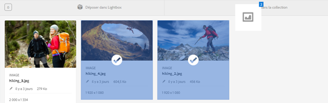
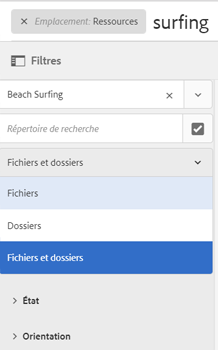
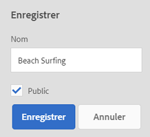
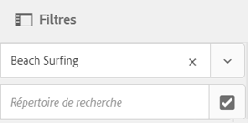
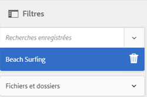
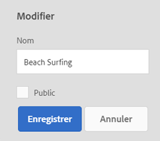
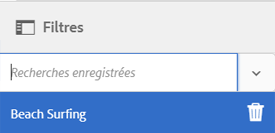

# Gestion des collections {#managing-collections}

A collection is a set of assets within [!DNL Adobe Experience Manager Assets]. Vous pouvez utiliser des collections pour partager des ressources entre utilisateurs. Il peut s’agir d’une collection statique ou dynamique basée sur les résultats de la recherche.

Contrairement aux dossiers, une collection peut comporter des ressources provenant de différents emplacements. Vous pouvez partager des ressources avec plusieurs utilisateurs dont les niveaux de privilèges sont différents (modification, affichage, etc.).

Vous pouvez partager plusieurs collections avec un utilisateur. Chaque collection contient des références aux ressources. L’intégrité du référentiel des ressources est préservée dans les collections.

Selon la façon dont elles rassemblent les ressources, les collections sont des types suivants :

* Collection contenant une liste de référence statique de ressources, dossiers et autres collections

* Collection dynamique qui rassemble de manière dynamique des ressources selon des critères de recherche

## Accès à la console Collections {#navigating-the-collections-console}

Pour ouvrir les **[!UICONTROL collections]**, dans l’ [!DNL Experience Manager] interface, accédez à **[!UICONTROL Ressources]** > **[!UICONTROL Collections]**.

## Création d’une collection {#creating-a-collection}

Vous pouvez créer une collection contenant des [références statiques](#creating-a-collection-with-static-references) ou reposant sur un [filtre de critères de recherche](#creating-a-smart-collection). Vous pouvez également créer une collection à partir d’une Lightbox.

### Création d’une collection avec des références statiques {#creating-a-collection-with-static-references}

Vous pouvez créer une collection avec des références statiques, par exemple, une collection avec des références aux ressources, aux dossiers, aux collections, aux visionneuses à 360° et aux visionneuses d’images.

1. Accédez à la console **[!UICONTROL Collections]**.
1. From the toolbar, click **[!UICONTROL Create]**.
1. Sur la page **[!UICONTROL Créer une collection]**, saisissez un titre et une description facultative pour la collection.
1. Ajoutez des membres à la collection et affectez les autorisations appropriées. Vous pouvez également sélectionner **[!UICONTROL Collection publique]** pour permettre à tous les utilisateurs d’accéder à la collection.

   >[!NOTE]
   >
   >Pour permettre aux membres de partager des collections avec d’autres utilisateurs, vous devez accorder les autorisations de lecture au groupe `dam-users` dans le chemin `home/users`. Donnez l’autorisation aux utilisateurs à l’emplacement `/content/dam/collections` afin de leur permettre d’afficher les collections dans les listes contextuelles. Vous pouvez également intégrer l’utilisateur au groupe `dam-users`.

1. (Facultatif) Ajoutez une image de miniature pour la collection.
1. Click **[!UICONTROL Create]**, and then click **[!UICONTROL OK]** to close the dialog. Une collection avec le titre et les propriétés spécifiés s’ouvre dans la console Collections.

   >[!NOTE]
   >
   >[!DNL Experience Manager Assets] vous permet de créer des tâches de révision pour une collection de la même façon que vous créez des tâches de révision pour un dossier de ressources.

   To add assets to the collection, navigate to the [!DNL Assets] user interface. Pour plus d’informations, voir [Ajout de ressources à une collection](#adding-assets-to-a-collection).

### Création de collections à l’aide de la zone de dépôt {#create-collections-using-dropzone}

You can drag assets from the [!DNL Assets] user interface to a collection. Vous pouvez également créer une copie d’une collection et faire glisser les ressources jusqu’à celle-ci.

1. From the [!DNL Assets] user interface, select the assets you want to add to a collection.
1. Faites glisser les ressources jusqu’à la zone **[!UICONTROL Déposer dans la collection]**. Vous pouvez également cliquer sur **[!UICONTROL Vers la collection]** dans la barre d’outils.

   

1. In the **[!UICONTROL Add To Collection]** page, click **[!UICONTROL Create Collection]** from the toolbar.

   If you want to add the assets to an existing collection, select it from the page, and click **[!UICONTROL Add]**. Par défaut, la collection la plus récemment mise à jour est sélectionnée.

1. Dans la boîte de dialogue **[!UICONTROL Créer une collection]**, indiquez le nom de la collection. Si vous souhaitez que la collection soit accessible à tous les utilisateurs, sélectionnez **[!UICONTROL Collection publique]**.
1. Click **[!UICONTROL Continue]** to create the collection.

### Création d’une collection dynamique {#creating-a-smart-collection}

Une collection dynamique utilise des critères de recherche pour rassembler les ressources de manière dynamique. Vous pouvez créer une collection dynamique en utilisant uniquement des fichiers ou en utilisant des fichiers et des dossiers.

Pour créer une collection dynamique, procédez comme suit :

1. Accédez à l’interface [!DNL Assets] utilisateur et cliquez sur Rechercher.

1. Tapez le mot-clé de recherche dans la zone Omnisearch et appuyez sur `Enter`. Ouvrez le panneau Filtres et appliquez un filtre de recherche.

1. Dans la liste **[!UICONTROL Fichiers et dossiers]**, sélectionnez **[!UICONTROL Fichiers]**.

   

1. Click **[!UICONTROL Save Smart Collection]**.

1. Spécifiez le nom de la collection. Sélectionnez **[!UICONTROL Public]** pour ajouter le groupe Utilisateurs DAM avec le rôle Observateur à la collection dynamique.

   

   >[!NOTE]
   >
   >If you select **[!UICONTROL Public]**, the smart collection becomes available to everyone with the owner role after you create it. Si vous désactivez la case à cocher **[!UICONTROL Public]**, le groupe Utilisateurs DAM n’est plus associé à la collection dynamique.

1. Click **[!UICONTROL Save]** to create the smart collection, and then close the message box to complete the process.

   La nouvelle collection dynamique est également ajoutée à la liste **[!UICONTROL Recherches enregistrées.]**

   

   The label of the **[!UICONTROL Create Smart Selection]** option changes to **[!UICONTROL Edit Smart Selection]**. Pour modifier les paramètres de la collection dynamique, sélectionnez **[!UICONTROL Fichiers]** dans la liste **[!UICONTROL Fichiers et dossiers]**. Cliquez sur l’option **[!UICONTROL Modifier la sélection]** dynamique pour  dynamique.

## Ajout de ressources à une collection {#adding-assets-to-a-collection}

Vous pouvez ajouter des ressources à une collection qui comporte une liste de ressources ou de dossiers référencés. Les collections dynamiques utilisent une requête de recherche pour rassembler les ressources. Pour cette raison, les références statiques aux ressources et dossiers ne s’appliquent pas à celles-ci.

1. Dans l’interface utilisateur des [!DNL A]ressources, sélectionnez la ressource, puis cliquez sur **[!UICONTROL À la collection]**  dans la barre d’outils.
Vous pouvez également faire glisser la ressource vers la zone **[!UICONTROL Déposer dans la collection]** de l’interface. Ajoutez les ressources lorsque le libellé de la région devient **[!UICONTROL Déposer pour Ajouter]**.

1. Sur la page **[!UICONTROL Ajouter à la collection]**, sélectionnez la collection à laquelle vous souhaitez ajouter la ressource.

1. Click **[!UICONTROL Add]**, and then close the confirmation message. La ressource est ajoutée à la collection.

## Modification d’une collection dynamique {#editing-a-smart-collection}

Les collections dynamiques sont créées en enregistrant une recherche afin que vous puissiez modifier leur contenu en changeant les paramètres de recherche de la [recherche enregistrée](#saved-searches).

1. Dans l’interface [!DNL Assets] utilisateur, cliquez sur l’option de recherche  Rechercher dans la barre d’outils.
1. Placez le curseur dans la zone Omni-recherche et appuyez sur la touche Entrée.
1. Dans l’ [!DNL Experience Manager] interface, ouvrez le panneau Filtres.
1. Dans la liste **[!UICONTROL Recherches enregistrées]**, sélectionnez la collection dynamique que vous souhaitez modifier. Le panneau de recherche affiche les filtres configurés pour la recherche enregistrée.

   

1. Dans la liste **[!UICONTROL Fichiers et dossiers]**, sélectionnez **[!UICONTROL Fichiers]**.
1. Modifiez un ou plusieurs filtres selon vos besoins. Cliquez sur **[!UICONTROL Modif. collection dynam.]**.

   Vous pouvez également modifier le nom de la collection dynamique.

   

1. Cliquez sur **[!UICONTROL Enregistrer]**. La boîte de dialogue **[!UICONTROL Modif. collection dynam.]** s’affiche.
1. Click **[!UICONTROL Overwrite]** to replace the original smart collection with the edited collection. Sinon, sélectionnez **[!UICONTROL Enregistrer sous]** pour enregistrer la collection modifiée séparément.
1. In the confirmation dialog, Click **[!UICONTROL Save]** to complete the process.

## Affichage et modification des métadonnées {#viewing-and-editing-collection-metadata}

Les métadonnées de collection incluent les données sur la collection, notamment toute balise qui est ajoutée.

1. From the [!UICONTROL Collections] console, select a collection and click **[!UICONTROL Properties]** from the toolbar.
1. Sur la page **[!UICONTROL Métadonnées de collection]**, affichez les métadonnées de collection à partir des onglets **[!UICONTROL De base]** et **[!UICONTROL Avancé]**.
1. Modifiez les métadonnées, si nécessaire. Pour enregistrer les modifications, cliquez sur **[!UICONTROL Enregistrer et fermer]** dans la barre d’outils.

## Modification des métadonnées de plusieurs collections en bloc {#editing-collection-metadata-in-bulk}

Vous pouvez modifier simultanément les métadonnées de plusieurs collections. Cette fonctionnalité vous aide à répliquer rapidement des métadonnées communes dans plusieurs collections.

1. Dans la console Collections, sélectionnez plusieurs collections.
1. Dans la barre d’outils, cliquez sur **[!UICONTROL Propriétés]**.
1. Sur la page **[!UICONTROL Métadonnées de collection]**, modifiez les métadonnées sous **[!UICONTROL De base]** et **[!UICONTROL Avancé]**, selon les besoins.
1. Pour afficher les propriétés de métadonnées associées à une collection spécifique, désélectionnez les autres collections dans la liste des collections. Les champs de l’éditeur de métadonnées sont renseignés avec les métadonnées de la collection particulière.

   >[!NOTE]
   >
   >* In the [!UICONTROL Properties] page, you can remove collections from the list of collections by deselecting them. La liste des collections contient toutes les collections sélectionnées par défaut. [!DNL Experience Manager] ne met pas à jour les métadonnées des collections que vous supprimez.
   >* En haut de la liste, cochez la case située en regard de l’option **[!UICONTROL Titre]** pour passer de la sélection des collections à l’effacement de la liste, et inversement.

1. Cliquez sur **[!UICONTROL Enregistrer et fermer]** dans la barre d’outils, puis fermez la boîte de dialogue de confirmation.
1. To append the new metadata with the existing metadata, select **[!UICONTROL Append mode]**. Si vous ne sélectionnez pas cette option, les nouvelles métadonnées remplacent les métadonnées existantes dans les champs. Cliquez sur **[!UICONTROL Envoyer]**.

   >[!NOTE]
   >
   >Les métadonnées que vous ajoutez pour les collections sélectionnées remplacent les métadonnées précédentes pour ces collections. Utilisez le mode  Ajouter pour ajouter de nouvelles valeurs aux métadonnées existantes dans les champs qui peuvent contenir plusieurs valeurs. Les champs à valeur unique sont toujours remplacés. Toutes les balises que vous ajoutez dans le champ [!UICONTROL Balises] sont ajoutées à la liste existante des balises dans les métadonnées.

Pour personnaliser la page [!UICONTROL Propriétés] de métadonnées, notamment ajouter, modifier et supprimer des propriétés de métadonnées, utilisez l’éditeur de schéma.

>[!TIP]
>
>La méthode de modification en masse fonctionne pour les ressources disponibles dans une collection. Pour les ressources disponibles dans plusieurs dossiers ou correspondant à un critère commun, il est possible de mettre à jour [les métadonnées en masse après une recherche](/help/assets/search-assets.md#metadataupdates).

## Recherche de collections {#searching-collections}

Vous pouvez effectuer des recherches dans des collections à partir de la console Collections. When you search with keywords in the Omnisearch box, [!DNL Assets] searches for collection names, metadata, and the tags added to the collections.

Si vous recherchez des collections à partir du niveau supérieur, seules les collections individuelles sont renvoyées dans les résultats de recherche. [!DNL Assets] ou les dossiers des collections sont exclus. Dans tous les autres cas (par exemple, dans une collection individuelle ou dans une hiérarchie de dossiers), tous les fichiers, dossiers et collections appropriés sont renvoyés.

## Search within collections {#searching-within-collections}

Dans la console Collections, cliquez sur une collection pour l’ouvrir.

Within a collection, [!DNL Experience Manager] search is restricted to assets (and their tags and metadata) within the collection that you are viewing. Lorsque vous effectuez une recherche dans un dossier, toutes les ressources correspondantes et les dossiers enfants du dossier actif sont renvoyés. Lorsque vous effectuez une recherche dans une collection, seuls les ressources, dossiers et autres collections correspondant aux membres directs de la collection sont renvoyés.

## Modification des paramètres d’une collection {#editing-collection-settings}

Vous pouvez modifier les paramètres d’une collection, tels que le titre et la description, ou ajouter des membres à une collection.

1. Select a collection, and click **[!UICONTROL Settings]** in the toolbar. Vous pouvez également utiliser l’action rapide **[!UICONTROL Paramètres]** à partir de la miniature de la collection.
1. Modify the collection settings in the **[!UICONTROL Collection Settings]** page. For example, modify the collection title, descriptions, members, and permissions as discussed in [Adding Collections](#creating-a-collection).

1. Pour enregistrer les modifications, cliquez sur **[!UICONTROL Enregistrer]**.

## Suppression d’une collection {#deleting-a-collection}

1. Dans la console Collections, sélectionnez une ou plusieurs collections, puis cliquez sur Supprimer dans la barre d’outils.

1. In the dialog, click **[!UICONTROL Delete]** to confirm the delete action.

   >[!NOTE]
   >
   >You can also delete smart collections by [deleting saved searches](#saved-searches).

## Téléchargement d’une collection {#downloading-a-collection}

Lorsque vous téléchargez une collection, la hiérarchie complète des ressources dans la collection est téléchargée, y compris les dossiers et les collections enfants.

1. Dans la console Collections, sélectionnez une ou plusieurs collections à télécharger.
1. Dans la barre d’outils, cliquez sur **[!UICONTROL Télécharger]**.
1. Dans la boîte de dialogue **[!UICONTROL Télécharger]**, cliquez sur **[!UICONTROL Télécharger]**. Si vous souhaitez télécharger les rendus des ressources dans la collection, sélectionnez **[!UICONTROL Rendus]**. Sélectionnez l’option **[!UICONTROL Courrier électronique]** pour envoyer une notification électronique au propriétaire de la collection.

   Lorsque vous sélectionnez une collection à télécharger, l’ensemble de la hiérarchie de dossiers sous cette collection est téléchargé. Pour inclure chaque collection que vous téléchargez (y compris les ressources figurant dans des collections enfant imbriquées dans la collection parent) dans un dossier individuel, sélectionnez **[!UICONTROL Créer un dossier distinct pour chaque ressource]**.

## Création de collections imbriquées {#creating-nested-collections}

Vous pouvez ajouter une collection à une autre collection, créant ainsi une collection imbriquée.

1. From the Collections console, select the desired collection or group of collections, and click **[!UICONTROL To Collection]** in the toolbar.

1. Sur la page **[!UICONTROL Ajouter à la collection]**, sélectionnez la collection à laquelle vous souhaitez ajouter la collection.

   >[!NOTE]
   >
   >La collection mise le plus récemment à jour est sélectionnée par défaut sur la page **[!UICONTROL Ajouter à la collection]**.

1. Cliquez sur **[!UICONTROL Ajouter]**. Un message confirme l’ajout de la collection à la collection cible sur la page **[!UICONTROL Sélectionner la destination.]** Fermez le message pour terminer le processus.

>[!NOTE]
>
>Les collections dynamiques ne peuvent pas être imbriquées. En d’autres termes, elles ne peuvent pas comporter d’autres collections.

## Recherches enregistrées   {#saved-searches}

In the [!DNL Assets] user interface, you can search or filter assets based on certain rules, search criteria, or custom search facets. Si vous enregistrez ces éléments en tant que **[!UICONTROL recherches enregistrées]**, vous pouvez y accéder ultérieurement à partir de la liste **[!UICONTROL Recherches enregistrées]** du panneau Filtrer. La création d’une recherche enregistrée entraîne celle d’une collection dynamique.

Les recherches enregistrées sont créées lorsque vous créez une collection dynamique. Les collections dynamiques sont automatiquement ajoutées à la liste **[!UICONTROL Recherches enregistrées]**. The [!UICONTROL Saved Searches] query for the collection is saved in the `dam:query` property in CRXDE at the relative location `/content/dam/collections/`. Les recherches que vous pouvez enregistrer et les recherches enregistrées affichées dans la liste ne sont pas limitées.

>[!NOTE]
>
>Vous pouvez partager les collections dynamiques comme s’il s’agissait de collections statiques.

La modification des recherches enregistrées est identique à celle des collections dynamiques. For details, see [edit a smart collection](#editing-a-smart-collection).

Pour supprimer des recherches enregistrées, procédez comme suit :

1. Dans l’interface [!DNL Assets] utilisateur, cliquez sur l’option Rechercher.
1. Avec le curseur dans le champ Omnisearch, appuyez sur la touche Retour.
1. Dans l’ [!DNL Experience Manager] interface, ouvrez le panneau Filtres.
1. From the **[!UICONTROL Saved Searches]** list, click **[!UICONTROL Delete]** next to the smart collection that you want to delete.

   

1. In the dialog, click **[!UICONTROL Delete]** to delete the saved search.

## Exécution d’un workflow sur une collection {#running-a-workflow-on-a-collection}

Vous pouvez exécuter un workflow pour les ressources d’une collection. Si la collection contient des collections imbriquées, le workflow s’exécute également sur les ressources de ces dernières. Toutefois, si la collection et les collections imbriquées contiennent des ressources en double, le workflow ne s’exécute qu’une seule fois pour ces ressources.

1. Ouvrez **[!UICONTROL Ressources]** > **[!UICONTROL Collections]**. Pour exécuter un processus sur une collection spécifique, sélectionnez-le.
1. Open **[!UICONTROL Timeline]** rail. Cliquez sur  , puis sur Processus **** Début.
1. Dans la section **[!UICONTROL Démarrer le workflow]**, sélectionnez un modèle de workflow dans la liste. Par exemple, sélectionnez le modèle **[!UICONTROL Ressources de mise à jour de DAM]**.
1. Enter a title for the workflow and click **[!UICONTROL Start]**.
1. Dans la boîte de dialogue, cliquez sur **[!UICONTROL Poursuivre]**. Le processus traite tous les actifs de la collection sélectionnée.

>[!MORELIKETHIS]
>
>* [Configuration des notifications électroniques des ressources Experience Manager](/help/sites-administering/notification.md#assetsconfig)
>* [Création d’une tâche de révision pour les collections](bulk-approval.md)

