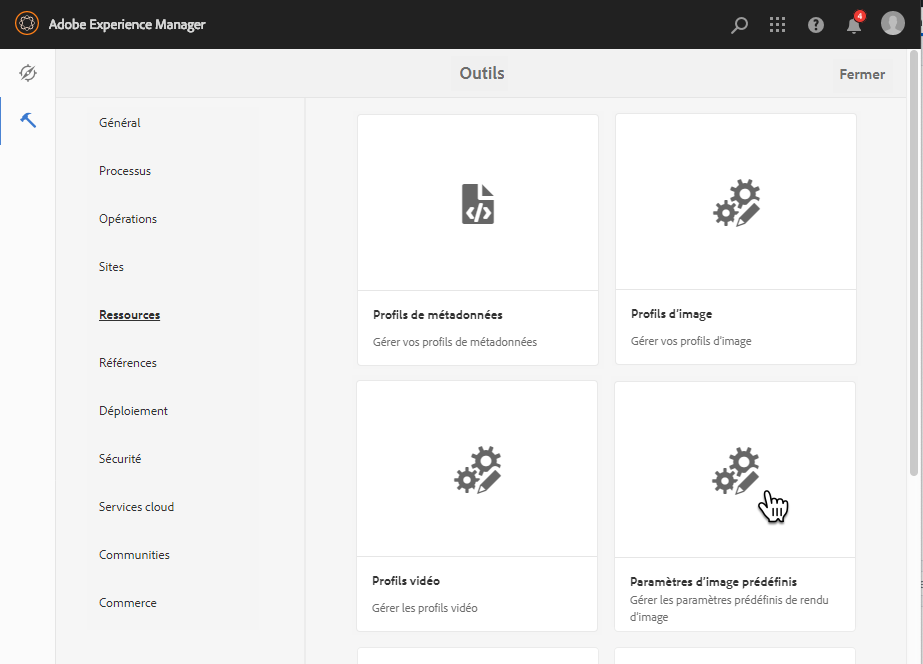
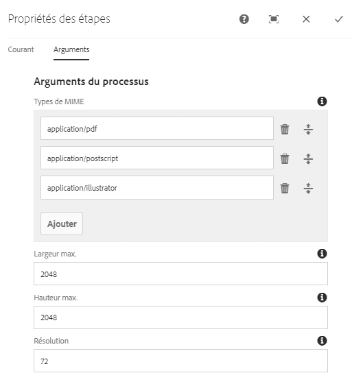
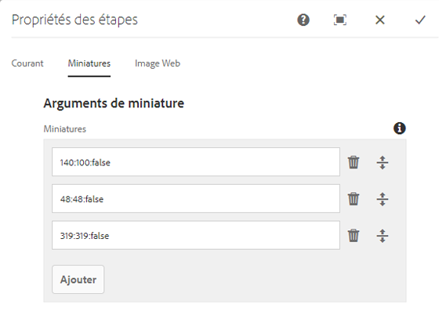
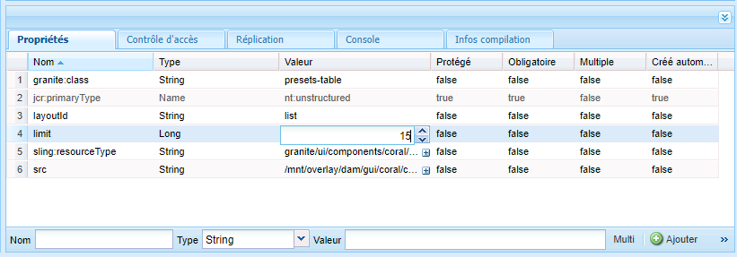
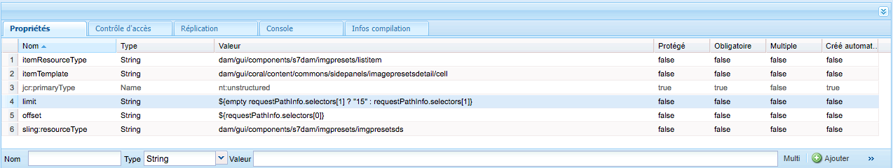
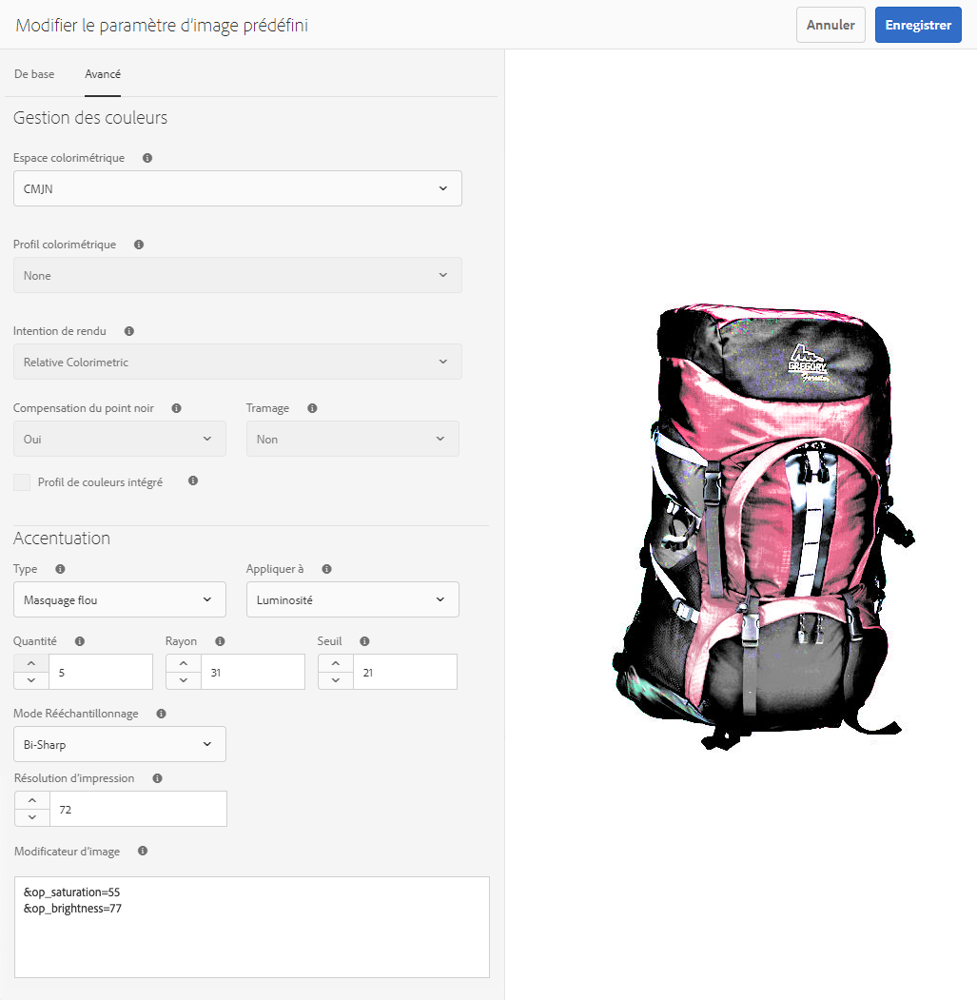
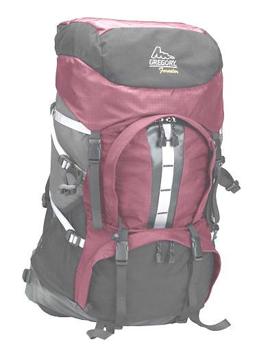
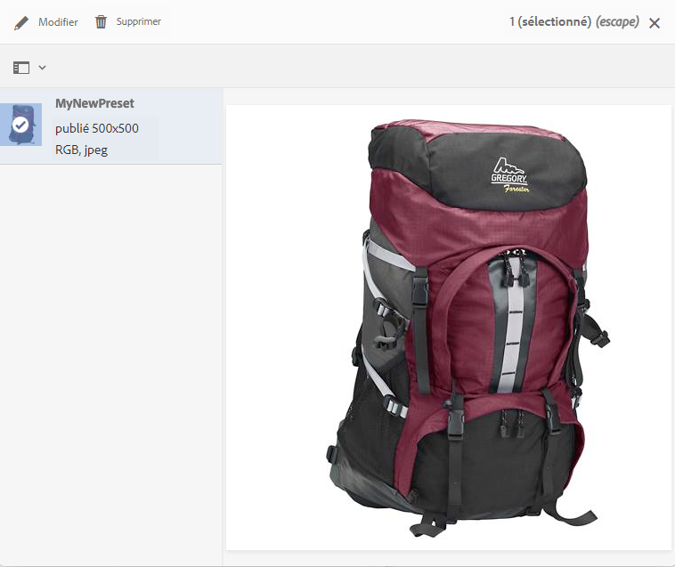
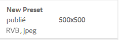

# Gestion des paramètres prédéfinis d’image Dynamic Media{#managing-image-presets}

Les paramètres d’image prédéfinis permettent à Adobe Experience Manager Assets d’afficher des images selon des tailles et des formats différents, ou avec d’autres propriétés d’image générées dynamiquement. Chaque paramètre d’image prédéfini représente un ensemble prédéfini de commandes de dimensionnement et de mise en forme pour l’affichage des images. Lorsque vous créez un paramètre d’image prédéfini, vous choisissez une taille pour la diffusion de l’image. Vous pouvez également choisir des commandes de mise en forme afin d’optimiser l’apparence de l’image lors de sa diffusion.

Les administrateurs peuvent créer des paramètres prédéfinis pour l’exportation de fichiers. Les utilisateurs peuvent choisir un paramètre prédéfini lors de l’exportation d’images, qui reformate également les images selon les spécifications définies par l’administrateur.

Vous pouvez également créer des paramètres d’image prédéfinis réactifs. Si vous appliquez un paramètre d’image prédéfini adapté à vos fichiers, il varie en fonction de l’appareil ou de la taille d’écran sur lequel ils sont affichés. Vous pouvez configurer des paramètres d’image prédéfinis de manière à utiliser CMJN dans l’espace colorimétrique, en plus de RVB ou gris.

Cette section décrit comment créer, modifier et gérer de manière générale les paramètres d’image prédéfinis. Vous pouvez appliquer un paramètre d’image prédéfini à une image lorsque vous la prévisualisez. Voir [Application de paramètres d’image prédéfinis](/help/assets/image-presets.md).

>[!NOTE]
>
>L’imagerie dynamique fonctionne avec vos paramètres d’image prédéfinis et utilise des informations à la dernière milliseconde de la diffusion pour réduire davantage encore la taille du fichier d’image en fonction de la vitesse de connexion du réseau et du navigateur. Voir [Imagerie numérique](/help/assets/imaging-faq.md) pour plus d’informations.

## Concepts des paramètres prédéfinis d’image Dynamic Media {#understanding-image-presets}

Tout comme une macro, un paramètre prédéfini d’image est un ensemble prédéfini de commandes de dimensionnement et de formatage enregistrées sous un nom. Pour comprendre le fonctionnement des paramètres prédéfinis d’image, supposons que votre site web exige que chaque image du produit s’affiche dans des tailles différentes, des formats différents et des taux de compression différents pour être diffusée sur les ordinateurs de bureau et les appareils mobiles.

>[!NOTE]
>
>Dans Dynamic Media en mode Scene7, les paramètres prédéfinis d’image sont pris en charge uniquement pour les ressources d’image.

Vous pouvez créer deux paramètres d’image prédéfinis : l’un avec 500 x 500 pixels pour la version de bureau et l’autre avec 150 x 150 pixels pour la version mobile. Vous créez deux paramètres d’image prédéfinis, l’un appelé `Enlarge` pour afficher des images à 500 x 500 pixels et l’autre appelé `Thumbnail` pour afficher des images à 150 x 150 pixels. Pour diffuser des images au format `Enlarge` et `Thumbnail`, Experience Manager recherche la définition du paramètre prédéfini d’image agrandie et du paramètre prédéfini d’image miniature. Ensuite, Experience Manager génère de manière dynamique une image dont la taille et le format correspondent à chaque paramètre d’image prédéfini.

Les images dont la taille est réduite lorsqu’elles sont diffusées dynamiquement peuvent perdre en netteté et en détail. C’est pourquoi chaque paramètre d’image prédéfini contient des commandes de mise en forme pour optimiser une image lorsqu’elle est diffusée à une taille spécifique. Ces commandes garantissent que vos images sont nettes et claires lorsqu’elles sont diffusées sur votre site web ou dans votre application.

Les administrateurs et administratrices peuvent créer des paramètres d’image prédéfinis. Pour créer un paramètre d’image prédéfini, vous pouvez partir de zéro ou partir d’un paramètre existant et l’enregistrer sous un nouveau nom.

## Gestion des paramètres prédéfinis d’image Dynamic Media {#managing-image-presets-1}

La gestion des paramètres d’image prédéfinis dans Experience Manager s’effectue en appuyant ou en cliquant sur le logo Experience Manager pour accéder à la console de navigation globale, puis en appuyant ou en cliquant sur l’icône Outils et en accédant à **[!UICONTROL Ressources > Paramètres d’image prédéfinis]**.



>[!NOTE]
>
>Tous les paramètres prédéfinis d’image que vous créez sont également disponibles en tant que rendus dynamiques lorsque vous prévisualisez ou livrez des ressources.
>
>En *mode Dynamic Media – Scene7*, il *n’est pas* nécessaire de publier les paramètres d’image prédéfinis, car ils le sont automatiquement.
>
>Dans le *mode hybride de Dynamic Media*, vous devez publier manuellement les paramètres prédéfinis d’image.
>
>Voir [Publication de paramètres d’image prédéfinis](#publishing-image-presets).

>[!NOTE]
>
>Le système affiche différents rendus lorsque vous sélectionnez **[!UICONTROL Rendus]** dans l’affichage des détails d’une ressource. Vous pouvez augmenter le nombre de paramètres d’image prédéfinis affichés. Voir [Augmentation du nombre de paramètres d’image prédéfinis affichés](#increasing-or-decreasing-the-number-of-image-presets-that-display).

### Recadrage intelligent, Adobe Illustrator (AI), PostScript (EPS) et formats de fichiers PDF {#adobe-illustrator-ai-postscript-eps-and-pdf-file-formats}

>[!NOTE]
>
>Cette rubrique s’applique uniquement au mode hybride de Dynamic Media.

Si vous avez l’intention de prendre en charge l’assimilation de fichiers AI, EPS et PDF de manière à pouvoir générer des rendus dynamiques de ces formats de fichiers, consultez les informations suivantes avant de créer des paramètres d’image prédéfinis.

Le format de fichier d’Adobe Illustrator est une variante du format PDF. Les principales différences, dans le cadre d’Experience Manager Assets, sont les suivantes :

* Les documents Adobe Illustrator se composent d’une seule page avec plusieurs calques. Chaque calque est extrait sous la forme d’une sous-ressource PNG sous la ressource Illustrator principale.
* Les documents PDF se composent d’une ou de plusieurs pages. Chaque page est extraite sous la forme d’une sous-ressource PDF d’une seule page sous le document PDF multi-pages principal.

Les sous-ressources sont créées par le composant `Create Sub Asset process` dans le workflow `DAM Update Asset` global. Pour voir ce composant de processus dans le workflow, sélectionnez **[!UICONTROL Outils]** > **[!UICONTROL Workflow]** > **[!UICONTROL Modèles]** > **[!UICONTROL Ressource de mise à jour DAM]** > **[!UICONTROL Modifier]**.

Consultez également la section [Affichage des pages d’un fichier multi-pages](/help/assets/managing-linked-subassets.md#view-pages-of-a-multi-page-file).

Vous pouvez afficher les sous-ressources ou les pages lorsque vous ouvrez la ressource, sélectionnez le menu Contenu et sélectionnez **[!UICONTROL Sous-ressources]** ou **[!UICONTROL Pages]**. Les sous-ressources sont des ressources à part entière. En d’autres termes, les pages PDF sont extraites par le composant de workflow `Create Sub Asset`. Elles sont ensuite stockées sous les noms `page1.pdf`, `page2.pdf`, etc. sous la ressource principale. Une fois qu’elles sont stockées, le workflow `DAM Update Asset` les traite.

Pour utiliser Dynamic Media afin de prévisualiser et de générer des rendus dynamiques pour des fichiers AI, EPS ou PDF, les étapes de traitement suivantes doivent être exécutées :

1. Dans le workflow `DAM Update Asset`, le composant de processus `Rasterize PDF/AI Image Preview Rendition` pixellise la première page de la ressource d’origine (à l’aide de la résolution configurée) dans un rendu `cqdam.preview.png`.

1. Le rendu `cqdam.preview.png` est ensuite optimisé dans un fichier PTIFF par le composant de processus `Dynamic Media Process Image Assets` au sein du workflow.

>[!NOTE]
>
>Dans le workflow de [!UICONTROL Ressource de mise à jour de gestion des ressources numériques], l’étape de **[!UICONTROL miniatures EPS]** génère des miniatures pour les fichiers EPS.

#### Propriétés des métadonnées de ressource PDF/AI/EPS {#pdf-ai-eps-asset-metadata-properties}

| **Propriété de métadonnées** | **Description** |
|---|---|
| `dam:Physicalwidthininches` | Largeur du document en pouces. |
| `dam:Physicalheightininches` | Hauteur du document en pouces. |

Vous accédez aux options des composants de processus `Rasterize PDF/AI Image Preview Rendition` par le biais du workflow `DAM Update Asset`.

Dans le coin supérieur gauche, sélectionnez Adobe Experience Manager, puis accédez à **[!UICONTROL Outils]** > **[!UICONTROL Workflow]** > **[!UICONTROL Modèles]**. Dans la page Modèles de workflow, sélectionnez **[!UICONTROL Ressource de mise à jour DAM]** puis, dans la barre d’outils, sélectionnez **[!UICONTROL Modifier]**. Dans la page du workflow [!UICONTROL Ressource de mise à jour DAM], double-cliquez sur le composant de processus `Rasterize PDF/AI Image Preview Rendition` pour ouvrir la boîte de dialogue Propriétés de l’étape.

#### Options Pixelliser le rendu d’aperçus d’image PDF/AI {#rasterize-pdf-ai-image-preview-rendition-options}



Arguments pour pixelliser le workflow PDF ou AI

<table>
 <tbody>
  <tr>
   <td><strong>Argument de processus</strong></td>
   <td><strong>Paramètre par défaut</strong></td>
   <td><strong>Description</strong></td>
  </tr>
  <tr>
   <td>Types MIME</td>
   <td><p>application/pdf</p> <p>application/postscript</p> <p>application/illustrator<br /> </p> </td>
   <td>Liste des types MIME de documents considérés comme des documents PDF ou Illustrator.<br /> </td>
  </tr>
  <tr>
   <td>Largeur max.</td>
   <td>2048</td>
   <td>Largeur maximale du rendu d’aperçu généré, en pixels.<br /> </td>
  </tr>
  <tr>
   <td>Hauteur max.</td>
   <td>2048</td>
   <td>Hauteur maximale du rendu d’aperçu généré, en pixels.<br /> </td>
  </tr>
  <tr>
   <td>Résolution</td>
   <td>72</td>
   <td>Résolution de pixellisation de la première page, en ppp (pixels par pouce).</td>
  </tr>
 </tbody>
</table>

À l’aide des arguments de processus par défaut, la première page d’un document PDF/AI est pixellisée à 72 ppp et l’image de prévisualisation générée est dimensionnée à 2 048 x 2 048 pixels. Pour un déploiement standard, vous pouvez augmenter la résolution à une valeur minimale de 150 ppi ou plus. Par exemple, un document de format Lettre US à 300 ppp doit avoir une largeur et une hauteur maximales de 2 550 x 3 300 pixels, respectivement.

Largeur max. et Hauteur max. limitent la résolution à laquelle la pixellisation doit être effectuée. Par exemple, si vous ne modifiez pas les valeurs maximales et que la résolution est définie sur 300 ppi, un document de lettre américaine est pixellisé à 186 ppi. En d’autres termes, le document fait 1 581 x 2 046 pixels.

Une valeur maximale est définie pour le composant de processus `Rasterize PDF/AI Image Preview Rendition`, afin de s’assurer qu’il ne crée pas d’images exagérément grandes en mémoire. Ces images volumineuses peuvent, en effet, dépasser la capacité de mémoire allouée à la machine virtuelle Java™ (JVM). Il faut veiller à fournir suffisamment de mémoire à la machine virtuelle Java pour gérer le nombre configuré de workflows parallèles, de sorte que chacun d’eux soit en mesure de créer une image à la taille maximale configurée.

### Format de fichier InDesign (INDD) {#indesign-indd-file-format}

Si vous avez l’intention de prendre en charge l’assimilation de fichiers INDD de manière à pouvoir générer le rendu dynamique de ce format de fichier, vous pouvez consulter les informations suivantes avant de créer des paramètres prédéfinis d’image.

Dans le cas des fichiers InDesign, les sous-ressources ne sont extraites que si Adobe InDesign Server est intégré à Experience Manager. Les ressources référencées sont liées en fonction de leurs métadonnées. InDesign Server n’est pas nécessaire pour la liaison. Cependant, les ressources référencées doivent être présentes dans Experience Manager avant que les fichiers InDesign soient traités, pour que les liens soient créés entre les fichiers InDesign et les ressources référencées.

Consultez la section [Intégration d’Experience Manager Assets à InDesign Server](/help/assets/indesign.md).

Le composant Extraction de médias du workflow `DAM Update Asset` exécute plusieurs scripts d’extension préconfigurés pour traiter des fichiers InDesign.


Les chemins ExtendScript dans les arguments du composant de processus Extraction de médias au sein du workflow [!UICONTROL Ressource de mise à jour de la gestion des ressources numériques].

Les scripts suivants sont utilisés par l’intégration de Dynamic Media :

<table>
 <tbody>
  <tr>
   <td><strong>Nom ExtendScript</strong></td>
   <td><strong>Valeur par défaut</strong></td>
   <td><strong>Description</strong></td>
  </tr>
  <tr>
   <td>ThumbnailExport.jsx</td>
   <td>Oui</td>
   <td>Génère un rendu <code>thumbnail.jpg</code> de 300 PPP optimisé et transformé en rendu PTIFF par le composant de processus <code>Dynamic Media Process Image Assets</code>.<br /> </td>
  </tr>
  <tr>
   <td>JPEGPagesExport.jsx</td>
   <td>Oui</td>
   <td>Génère une sous-ressource JPEG de 300 PPP pour chaque page. Une sous-ressource JPEG est une véritable ressource stockée sous la ressource InDesign. Elle est également optimisée et transformée en PTIFF par le workflow <code>DAM Update Asset</code>.<br /> </td>
  </tr>
  <tr>
   <td>PDFPagesExport.jsx</td>
   <td>Non</td>
   <td>Génère une sous-ressource PDF pour chaque page. La sous-ressource PDF est traitée comme indiqué précédemment. Étant donné que le PDF ne contient qu’une seule page, aucune sous-ressource n’est générée.<br /> </td>
  </tr>
 </tbody>
</table>

## Configuration de la taille des miniatures d’images {#configuring-image-thumbnail-size}

Vous pouvez définir la taille des miniatures en configurant ces paramètres dans le workflow **[!UICONTROL Ressource de mise à jour de gestion des actifs numériques (DAM)]**. Le workflow comprend deux étapes au cours desquelles vous pouvez configurer la taille de miniature des ressources d’images. Bien qu’un composant (**[!UICONTROL Ressources d’image du processus Dynamic Media]**) soit utilisé pour les ressources d’images dynamiques et que l’autre (**[!UICONTROL Traiter les miniatures]**) soit exécuté pour la génération des miniatures statiques ou lorsqu’aucun autre processus ne parvient à générer des miniatures, *tous deux* doivent posséder les mêmes paramètres.

Avec l’étape **[!UICONTROL Ressources d’image du processus Dynamic Media]**, les miniatures sont générées par le serveur d’images et cette configuration est indépendante de la configuration appliquée à l’étape des **[!UICONTROL miniatures de processus]**. La génération de miniatures en passant par l’étape **[!UICONTROL Miniatures des processus]** constitue la méthode la plus lente et la plus gourmande en mémoire.

Le dimensionnement des miniatures est défini au format suivant : **`width:height:center`**, par exemple : `80:80:false`. La largeur et la hauteur déterminent la taille en pixels de la miniature. La valeur « centrer » est soit false soit true. Si elle est définie sur true, elle indique que la miniature a exactement la taille spécifiée dans la configuration. Si l’image redimensionnée est plus petite, elle est centrée dans la miniature.

>[!NOTE]
>
>* La taille des miniatures pour les fichiers EPS est configurée à l’étape **[!UICONTROL Miniatures EPS]**, dans l’onglet **[!UICONTROL Arguments]** sous Miniatures.
>
>* Les tailles des miniatures pour les vidéos sont configurées à l’étape **[!UICONTROL Miniatures FFmpeg]**, dans l’onglet **[!UICONTROL Processus]** sous **[!UICONTROL Arguments]**.
>

**Pour configurer la taille des miniatures d’images :**

1. Sélectionnez **[!UICONTROL Outils]** > **[!UICONTROL Workflow]** > **[!UICONTROL Modèles]** > **[!UICONTROL Ressource de mise à jour DAM]** > **[!UICONTROL Modifier]**.
1. Sélectionnez l’étape **[!UICONTROL Ressources d’image du processus Dynamic Media]**, puis cliquez sur l’onglet **[!UICONTROL Miniatures]**. Modifiez la taille de la miniature, si nécessaire, puis sélectionnez **[!UICONTROL OK]**.

   

1. Sélectionnez l’étape **[!UICONTROL Miniatures des processus]**, puis sélectionnez l’onglet **[!UICONTROL Miniatures]**. Modifiez la taille de la miniature, si nécessaire, puis sélectionnez **[!UICONTROL OK]**.

   >[!NOTE]
   >
   >Les valeurs de l’argument des miniatures de l’étape **[!UICONTROL Miniatures des processus]** doivent correspondre à l’argument des miniatures de l’étape **[!UICONTROL Ressources d’image du processus Dynamic Media]**.

1. Sélectionnez **[!UICONTROL Enregistrer]** pour enregistrer les modifications apportées au workflow.

### Augmentation ou diminution du nombre de paramètres prédéfinis d’image Dynamic Media affichés {#increasing-or-decreasing-the-number-of-image-presets-that-display}

Les paramètres d’image prédéfinis que vous créez sont disponibles sous la forme de rendus dynamiques lorsque vous prévisualisez des ressources. Experience Manager affiche différents rendus dynamiques lors de l’affichage d’un fichier à partir de **[!UICONTROL Affichage des détails > Rendus]**. Vous pouvez augmenter ou diminuer la limite des rendus affichés.

**Augmentez ou réduisez le nombre de paramètres prédéfinis d’image Dynamic Media affichés :**

1. Accédez à CRXDE Lite ([https://localhost:4502/crx/de](https://localhost:4502/crx/de)).
1. Accédez au nœud de liste des paramètres d’image prédéfinis à l’adresse `/libs/dam/gui/coral/content/commons/sidepanels/imagepresetsdetail/imgagepresetslist`

   

1. Dans la propriété **[!UICONTROL limit]**, définissez la valeur de votre choix dans la colonne **[!UICONTROL Valeur]** ; par défaut, elle est définie sur 15.
1. Accédez à la source de données des paramètres d’image prédéfinis à l’adresse `/libs/dam/gui/coral/content/commons/sidepanels/imagepresetsdetail/imgagepresetslist/datasource`

   

1. Dans la propriété de limite, remplacez le nombre par le nombre souhaité, par exemple, `{empty requestPathInfo.selectors[1] ? "20" : requestPathInfo.selectors[1]}`.
1. Sélectionnez **[!UICONTROL Enregistrer tout]**.

## Création d’un paramètre prédéfini d’image Dynamic Media {#creating-image-presets}

La création d’un paramètre prédéfini d’image Dynamic Media vous permet d’appliquer ce paramètre à n’importe quelle image lors de la prévisualisation ou de la publication.

>[!NOTE]
>
>Si vous utilisez Internet Explorer 9, un paramètre prédéfini nouvellement créé n’apparaît pas immédiatement dans la liste après l’enregistrement. Pour contourner ce problème, désactivez le cache d’Internet Explorer 9.

Si vous avez l’intention de prendre en charge l’assimilation de fichiers AI, PDF et EPS de manière à pouvoir générer des rendus dynamiques de ces formats de fichiers, consultez les informations suivantes avant de créer des paramètres prédéfinis d’image.
Voir [Formats de fichiers Adobe Illustrator (AI), PostScript (EPS) et PDF](#adobe-illustrator-ai-postscript-eps-and-pdf-file-formats).

Si vous avez l’intention de prendre en charge l’assimilation de fichiers INDD de manière à pouvoir générer le rendu dynamique de ce format de fichier, vous pouvez consulter les informations suivantes avant de créer des paramètres d’image prédéfinis.
Voir [Format de fichier InDesign (INDD)](#indesign-indd-file-format).

>[!NOTE]
>
>Pour créer des paramètres prédéfinis d’image Dynamic Media, vous devez disposer de droits d’administrateur pour Experience Manager ou l’Admin Console.

**Pour créer un paramètre prédéfini d’image Dynamic Media :**

1. Dans Experience Manager, sélectionnez le logo Experience Manager pour accéder à la console de navigation globale, puis sélectionnez **[!UICONTROL Outils]** > **[!UICONTROL Ressources]** > **[!UICONTROL Paramètres d’image prédéfinis]**.
1. Cliquez sur **[!UICONTROL Créer]**. La fenêtre **[!UICONTROL Modifier le paramètre prédéfini d’image]** s’ouvre.

   

   >[!NOTE]
   >
   >Pour rendre ce paramètre d’image prédéfini réactif, effacez les valeurs des champs **[!UICONTROL largeur]** et **[!UICONTROL hauteur]** et laissez-les vides.

1. Entrez des valeurs dans les onglets **[!UICONTROL De base]** et **[!UICONTROL Avancé]** selon le cas, y compris un nom. Les options sont décrites dans [Options d’image prédéfinies](#image-preset-options). Les paramètres prédéfinis s’affichent dans le volet de gauche et peuvent être utilisés à la volée avec d’autres ressources.

   

1. Cliquez sur **[!UICONTROL Enregistrer]**.

## Création d’un paramètre prédéfini réactif d’image {#creating-a-responsive-image-preset}

Pour créer un paramètre d’image prédéfini réactif, suivez les étapes décrites dans la section [Création de paramètres d’image prédéfinis](#creating-image-presets). Lorsque vous saisissez la hauteur et la largeur dans la fenêtre **[!UICONTROL Modifier le paramètre d’image prédéfini]**, effacez les valeurs et laissez-les vides.

Si vous ne les laissez pas vides, cela indique à Experience Manager que ce paramètre d’image prédéfini est réactif. Vous pouvez, le cas échéant, ajuster les autres valeurs.


>[!NOTE]
>
>Pour que les boutons **[!UICONTROL URL]** et **[!UICONTROL RESS]** soient affichés lors de l’application d’un paramètre d’image prédéfini à une ressource, celle-ci doit être publiée.
>
>
>
>En mode Dynamic Media – Scene7, les paramètres d’image prédéfinis et les ressources d’image sont automatiquement publiés.
>
>En mode Dynamic Media – Hybride, vous devez publier manuellement les paramètres d’image prédéfinis et les ressources d’image. 

### Options des paramètres prédéfinis d’image {#image-preset-options}

Lorsque vous créez ou modifiez des paramètres d’image prédéfinis, vous disposez des options décrites dans cette section. En outre, Adobe recommande les options suivantes (correspondant aux « bonnes pratiques ») pour commencer :

* **[!UICONTROL Format]** (onglet **[!UICONTROL De base]**) : sélectionnez **[!UICONTROL JPEG]** ou un autre format adapté à vos exigences. Tous les navigateurs web prennent en charge le format d’image JPEG ; il offre un bon compromis entre les petites tailles de fichiers et la qualité de l’image. Cependant, les images au format JPEG utilisent un schéma de compression avec perte qui peut introduire des artefacts d’image indésirables si le paramètre de compression est trop bas. C’est pourquoi Adobe recommande de définir la qualité de compression sur 75. Ce paramètre offre un bon équilibre entre la qualité d’image et la taille de fichier réduite.

* **[!UICONTROL Activer l’accentuation simple]** : ne sélectionnez pas l’option **[!UICONTROL Activer l’accentuation simple]** (ce filtre d’accentuation est moins précis que les paramètres Accentuation).

* **[!UICONTROL Accentuation : Mode Rééchantillonnage]** : sélectionnez l’option **[!UICONTROL Sharp2]**.

#### Options de l’onglet De base {#basic-tab-options}

<table>
 <tbody>
  <tr>
   <td><strong>Champ</strong></td>
   <td><strong>Description</strong></td>
  </tr>
  <tr>
   <td><strong>Nom</strong></td>
   <td>Entrez un nom descriptif sans espaces. Ajoutez la spécification de taille de l’image dans le nom pour permettre aux utilisateurs d’identifier ce paramètre prédéfini d’image.</td>
  </tr>
  <tr>
   <td><strong>Largeur et hauteur</strong></td>
   <td>Saisissez la taille (en pixels) à utiliser pour la diffusion de l’image. La largeur et la hauteur doivent être supérieures à 0 pixel. Aucun paramètre prédéfini n’est en effet créé si l’une de ces valeurs est définie sur 0. Si aucune valeur n’est renseignée, un paramètre d’image prédéfini réactif est créé.</td>
  </tr>
  <tr>
   <td><strong>Format</strong></td>
   <td><p>Sélectionnez un format dans le menu.</p> <p>La sélection du format <strong>JPEG</strong> présente les options supplémentaires suivantes :</p>
    <ul>
     <li><strong>Qualité</strong> : contrôle le niveau de compression JPEG. Ce paramètre affecte à la fois la taille du fichier et la qualité de l’image. L’échelle de qualité JPEG s’étend de 1 à 100. L’échelle devient visible lorsque vous faites glisser le curseur.</li>
     <li><strong>Activer la réduction de la chrominance JPG</strong> : du fait que l’œil humain est moins sensible aux informations chromatiques à haute fréquence qu’à la luminance à fréquence élevée, les images JPEG divisent les informations graphiques en composantes de luminance et de couleur. Lorsqu’une image JPEG est compressée, la composante de luminance conserve sa pleine résolution, tandis que les composantes de couleur sont sous-échantillonnées par interpolation, c’est-à-dire en calculant la moyenne de groupes de pixels. Le sous-échantillonnage réduit de moitié ou d’un tiers le volume de données, quasiment sans nuire à la qualité perceptible par l’œil humain. Le sous-échantillonnage ne s’applique pas aux images en niveaux de gris. Cette technique réduit le niveau de compression nécessaire pour les images présentant un contraste élevé (par exemple, les images contenant du texte superposé).</li>
    </ul>
    <div>
      La sélection de l’option <strong>GIF</strong> ou <strong>GIF avec couche alpha</strong> offre les options <strong>Quantification de couleurs GIF</strong> supplémentaires suivantes :
    </div>
    <ul>
     <li><strong>Type </strong> : sélectionnez <strong>Adaptatif</strong> (valeur par défaut), <strong>Web</strong> ou <strong>Macintosh</strong>. Si vous sélectionnez <strong>GIF avec couche alpha</strong>, l’option Macintosh n’est pas disponible.</li>
     <li><strong>Juxtaposition</strong> : sélectionnez <strong>Diffus</strong> ou <strong>Désactivé</strong>.</li>
     <li><strong>Nombre de couleurs</strong> : saisissez un nombre compris entre 2 et 256.</li>
     <li><strong>Liste de couleurs</strong> : entrez une liste séparée par des virgules. Par exemple, pour blanc, gris et noir, saisissez <code>000000,888888,ffffff</code>.</li>
    </ul>
    <div>
      Lorsque vous sélectionnez les options <strong>PDF</strong>, <strong>TIFF</strong> ou <strong>TIFF avec couche alpha</strong>, les autres options suivantes sont proposées :
    </div>
    <ul>
     <li><strong>Compression</strong> : sélectionnez un algorithme de compression. Les options d’algorithme pour le format PDF sont <strong>Aucun</strong>, <strong>Zip</strong> et <strong>Jpeg</strong>. Les options pour le format TIFF sont <strong>Aucun</strong>, <strong>LZW</strong>, <strong>Jpeg</strong> et <strong>Zip</strong>. Les options pour le format TIFF avec couche alpha sont <strong>Aucun</strong>, <strong>LZW</strong> et <strong>Zip</strong>.</li>
    </ul> <p>Aucune option supplémentaire n’est fournie si vous sélectionnez <strong>PNG</strong>, <strong>PNG avec couche alpha</strong> ou <strong>EPS</strong>.</p> </td>
  </tr>
  <tr>
   <td><strong>Accentuation</strong></td>
   <td>Sélectionnez l’option <strong>Activer l’accentuation simple</strong> pour appliquer un filtre d’accentuation de base à l’image à l’issue des opérations de mise à l’échelle. L’accentuation peut compenser le flou produit lors de l’affichage d’une image à une taille différente. </td>
  </tr>
 </tbody>
</table>

#### Options de l’onglet Avancé {#advanced-tab-options}

<table>
 <tbody>
  <tr>
   <td><strong>Champ</strong></td>
   <td><strong>Description</strong></td>
  </tr>
  <tr>
   <td><strong>Espace colorimétrique</strong></td>
   <td>Sélectionnez l’espace colorimétrique <strong>RVB, CMJN</strong> ou <strong>Niveaux de gris</strong>.</td>
  </tr>
  <tr>
   <td><strong>Profil colorimétrique</strong></td>
   <td>Sélectionnez le profil de l’espace colorimétrique de sortie dans lequel doit être convertie la ressource s’il diffère du profil en cours d’utilisation.</td>
  </tr>
  <tr>
   <td><strong>Intention de rendu</strong></td>
   <td>Vous pouvez remplacer l’intention de rendu par défaut. Les intentions de rendu déterminent ce qui arrive aux couleurs qui ne peuvent pas être reproduites dans le profil colorimétrique cible (hors gamme). L’intention de rendu est ignorée si elle n’est pas compatible avec le profil ICC.
    <ul>
     <li>Sélectionnez <strong>Perception</strong> pour compresser la gamme totale d’un espace colorimétrique dans un autre lorsqu’une ou plusieurs couleurs de l’image d’origine se situent en dehors de la gamme de l’espace colorimétrique de destination.</li>
     <li>Sélectionnez <strong>Colorimétrie relative</strong> si une couleur de l’espace colorimétrique actuel se situe hors de la gamme des couleurs dans l’espace cible et si vous souhaitez la faire correspondre à la couleur la plus proche dans la gamme des couleurs de cet espace cible, sans affecter d’autres couleurs. </li>
     <li>Sélectionnez <strong>Saturation</strong> si vous voulez reproduire la saturation des couleurs de l’image d’origine lors de sa conversion dans l’espace colorimétrique cible. </li>
     <li>Sélectionnez <strong>Colorimétrie absolue</strong> pour faire correspondre exactement les couleurs sans aucun ajustement pour le point blanc ou noir qui altérerait la luminosité de l’image.</li>
    </ul> </td>
  </tr>
  <tr>
   <td><strong>Compensation du point noir</strong></td>
   <td>Sélectionnez cette option si le profil de sortie prend en charge cette fonctionnalité. La compensation du point noir est ignorée si elle n’est pas compatible avec le profil ICC spécifié.</td>
  </tr>
  <tr>
   <td><strong>Tramage</strong></td>
   <td>Sélectionnez cette option pour réduire les artefacts de bandes de couleurs ou éventuellement les éviter. </td>
  </tr>
  <tr>
   <td><strong>Type d’accentuation</strong></td>
   <td><p>Sélectionnez <strong>Aucun</strong>, <strong>Accentuer</strong> ou <strong>Accentuation</strong>. </p>
    <ul>
     <li>Sélectionnez <strong>Aucun</strong> si vous souhaitez désactiver l’accentuation.</li>
     <li>Sélectionnez l’option <strong>Accentuer</strong> pour appliquer un filtre d’accentuation de base à l’image à l’issue des opérations de mise à l’échelle. L’accentuation peut compenser le flou produit lors de l’affichage d’une image à une taille différente. </li>
     <li>Sélectionnez <strong>Accentuation</strong> pour affiner l’effet d’un filtre d’accentuation sur l’image finale sous-échantillonnée. Vous pouvez contrôler l’intensité de l’effet, le rayon de l’effet (mesuré en pixels) et un seuil de contraste qui est ignoré. Cet effet utilise les mêmes options que le filtre Photoshop « Accentuation ».</li>
    </ul> <p>L’option <strong>Accentuation</strong> propose les options suivantes :</p>
    <ul>
     <li><strong>Quantité</strong> : contrôle le degré de contraste appliqué aux pixels de contour. La valeur réelle par défaut est de 1,0. Pour les images à haute résolution, vous pouvez l’augmenter jusqu’à 5,0. Envisagez la quantité comme une mesure de l’intensité du filtre.</li>
     <li><strong>Rayon</strong> : détermine le nombre de pixels entourant les pixels de contour qui affectent l’accentuation. Pour les images haute résolution, entrez un nombre réel compris entre 1 et 2. Une valeur faible accentue uniquement les pixels de contour. Une valeur élevée accentue une bande plus large de pixels. La valeur correcte dépend de la taille de l’image.</li>
     <li><strong>Seuil</strong> : détermine la plage de contraste à ignorer lorsque le filtre d’accentuation est appliqué. En d’autres termes, cette option définit l’écart recherché entre les pixels accentués et la zone environnante avant qu’ils ne soient considérés comme des pixels de contour et ne soient accentués. Pour éviter d’introduire du bruit, essayez des valeurs comprises entre 2 et 20. </li>
     <li><strong>Appliquer à</strong> : détermine si l’accentuation s’applique à chaque couleur ou à la luminosité.</li>
    </ul>
    <div>
      L’accentuation est décrite dans <a href="https://experienceleague.adobe.com/docs/experience-manager-65/assets/sharpening_images.pdf">Accentuation des images</a>.
    </div> </td>
  </tr>
  <tr>
   <td><strong>Mode Rééchantillonnage</strong></td>
   <td>Sélectionnez une option <strong>Mode Rééchantillonnage</strong>. Ces options accentuent l’image lorsque sa résolution est réduite :
    <ul>
     <li><strong>Bilinéaire</strong> : il s’agit de la méthode de rééchantillonnage la plus rapide. Certains artefacts de crénelage sont visibles.</li>
     <li><strong>Bicubique</strong> : accroît l’utilisation du processeur, mais produit des images plus nettes avec des artefacts de crénelage plus discrets.</li>
     <li><strong>Sharp2</strong> : cette méthode peut produire des images légèrement plus nettes que celles obtenues avec l’option Bicubique, en sollicitant toutefois davantage le processeur.</li>
     <li><strong>Bi-Sharp</strong> : permet de sélectionner le rééchantillonneur Photoshop par défaut utilisé pour réduire la taille de l’image ; cette option se nomme <strong>Bicubique plus net</strong> dans Adobe Photoshop.</li>
     <li><strong>Chaque couleur</strong> et <strong>Luminosité</strong> – Chaque méthode peut être basée sur la couleur ou la luminosité. Par défaut, l’option <strong>Chaque couleur</strong> est sélectionnée.</li>
    </ul> </td>
  </tr>
  <tr>
   <td><strong>Résolution d’impression</strong></td>
   <td>Choisissez une résolution d’impression pour cette image ; 72 pixels est la valeur par défaut.</td>
  </tr>
  <tr>
   <td><strong>Modificateur d’image</strong></td>
   <td><p>Au-delà des paramètres d’image courants disponibles dans l’IU, Dynamic Media prend en charge de nombreuses modifications d’image avancées que vous pouvez spécifier dans le champ <strong>Modificateurs d’images</strong>. Ces paramètres sont définis dans la <a href="https://experienceleague.adobe.com/docs/dynamic-media-developer-resources/image-serving-api/image-serving-api/http-protocol-reference/command-reference/c-command-reference.html?lang=fr#image-serving-api">référence des commandes du protocole de serveur d’images</a>.</p> <p>Important : La fonctionnalité suivante répertoriée dans l’API n’est pas prise en charge :</p>
    <ul>
     <li>Commandes de base de création de modèles et de rendu de texte : <code>text= textAngle= textAttr= textFlowPath= textFlowXPath= textPath=</code> et <code>textPs=</code></li>
     <li>Commandes de localisation : <code>locale=</code> et <code>req=xlate</code></li>
     <li><code>req=set</code> n’est pas disponible pour l’utilisation générale.</li>
     <li><code>req=mbrset</code></li>
     <li><code>req=saveToFile</code></li>
     <li><code>req=targets</code></li>
     <li><code>template=</code></li>
     <li>Services Dynamic Media non essentiels : SVG, rendu d’image et impression en ligne</li>
    </ul> </td>
  </tr>
 </tbody>
</table>

## Définition des options de paramètre prédéfini d’image à l’aide des modificateurs d’image {#defining-image-preset-options-with-image-modifiers}

Outre les options disponibles dans les onglets Simple et Avancé, vous pouvez définir des modificateurs d’image afin de disposer d’un plus grand nombre d’options lors de la définition de paramètres prédéfinis d’image. Le rendu des images repose sur l’API de rendu d’images qui est défini en détail dans la [Référence du protocole HTTP](https://experienceleague.adobe.com/docs/dynamic-media-developer-resources/image-serving-api/image-serving-api/http-protocol-reference/command-reference/c-command-reference.html?lang=fr#image-serving-api).

Vous trouverez ci-dessous des exemples de tâches que vous pouvez exécuter à l’aide des modificateurs d’image.

>[!NOTE]
>
>Certains modificateurs d’image [ne peuvent pas être utilisés dans Experience Manager](#advanced-tab-options).

* [op_invert](https://experienceleague.adobe.com/docs/dynamic-media-developer-resources/image-serving-api/image-serving-api/http-protocol-reference/command-reference/r-op-invert.html?lang=fr#image-serving-api) : inverse chaque composant de couleur pour générer un effet d’image négative.

  ```xml
  &op_invert=1
  ```

  

* [op_blur](https://experienceleague.adobe.com/docs/dynamic-media-developer-resources/image-serving-api/image-serving-api/http-protocol-reference/command-reference/r-op-blur.html?lang=fr#image-serving-api) : applique un effet de flou à l’image.

  ```xml
  &op_blur=7
  ```

  

* Commandes combinées : op_blur et op-invert

  ```xml
  &op_invert=1&op_blur=7
  ```

  

* [op_brightness](https://experienceleague.adobe.com/docs/dynamic-media-developer-resources/image-serving-api/image-serving-api/http-protocol-reference/command-reference/r-op-brightness.html?lang=fr#image-serving-api) : augmente ou diminue la luminosité.

  ```xml
  &op_brightness=58
  ```

  

* [opac](https://experienceleague.adobe.com/docs/dynamic-media-developer-resources/image-serving-api/image-serving-api/http-protocol-reference/command-reference/r-opac.html?lang=fr#image-serving-api) : permet de régler l’opacité de l’image. Cet attribut vous permet de diminuer l’opacité du premier plan.

  ```xml
  opac=29
  ```

  

## Modification des paramètres prédéfinis d’image {#modifying-image-presets}

1. Dans Experience Manager, sélectionnez le logo Experience Manager pour accéder à la console de navigation globale, puis sélectionnez **[!UICONTROL Outils]** > **[!UICONTROL Ressources]** > **[!UICONTROL Paramètres d’image prédéfinis]**.

   

1. Sélectionnez un paramètre prédéfini, puis cliquez sur **[!UICONTROL Modifier]**. La fenêtre **[!UICONTROL Modifier le paramètre d’image prédéfini]** s’ouvre.
1. Apportez des modifications, puis cliquez sur **[!UICONTROL Enregistrer]** pour les enregistrer ou sur **[!UICONTROL Annuler]** pour les annuler.

## Application de paramètres prédéfinis d’image Dynamic Media {#publishing-image-presets}

Si vous utilisez le mode Dynamic Media – Hybride, vous devez publier manuellement les paramètres d’image prédéfinis.

(Si vous exécutez le mode Dynamic Media – Scene7, les paramètres d’image prédéfinis sont automatiquement publiés. Vous n’avez pas besoin d’effectuer ces étapes.)

**Pour publier manuellement les paramètres prédéfinis d’image dans le mode hybride de Dynamic Media, procédez comme suit :**

1. Dans Experience Manager, cliquez sur le logo Experience Manager pour accéder à la console de navigation globale, puis cliquez sur l’icône Outils et accédez à **[!UICONTROL Ressources]** > **[!UICONTROL Paramètres d’image prédéfinis]**.
1. Sélectionnez un ou plusieurs paramètres d’image prédéfinis dans la liste, puis cliquez sur **[!UICONTROL Publier]**.
1. Une fois le paramètre d’image prédéfini publié, le statut passe de non publié à publié.

   

## Suppression de paramètres prédéfinis d’image Dynamic Media {#deleting-image-presets}

1. Dans Experience Manager, cliquez sur le logo d’Experience Manager pour accéder à la console de navigation globale.
1. Sélectionnez l’icône **[!UICONTROL Outils]**, puis accédez à **[!UICONTROL Ressources]** > **[!UICONTROL Paramètres prédéfinis d’image]**.
1. Sélectionnez un paramètre prédéfini, puis cliquez sur **[!UICONTROL Supprimer]**. Dynamic Media vous invite à confirmer la suppression. Sélectionnez **[!UICONTROL Supprimer]** pour le supprimer ou **[!UICONTROL Annuler]** pour annuler.
