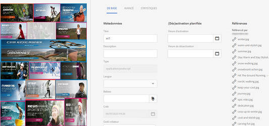
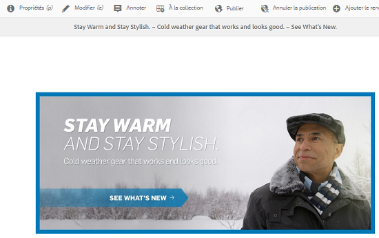
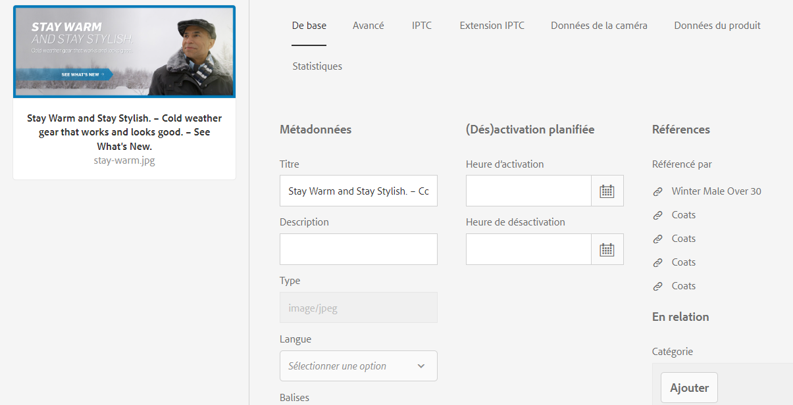
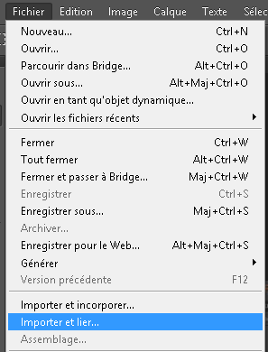

# Gestion des ressources composées et multi-pages {#managing-compound-assets}

[!DNL Adobe Experience Manager Assets] peut déterminer si un fichier téléchargé contient des références à des ressources qui existent déjà dans le référentiel. Cette fonctionnalité est disponible uniquement pour les types de formats pris en charge. If the uploaded asset contains any references to [!DNL Experience Manager] assets, a bidirectional link is created between the uploaded and referenced assets.

Besides eliminating redundancy, referencing the assets in [!DNL Adobe Creative Cloud] applications enhances collaboration and increases the efficiency and productivity of users.

[!DNL Experience Manager Assets] prend en charge le référencement bidirectionnel. Vous trouverez des ressources référencées dans la page des détails de la ressource du fichier chargé. En outre, vous pouvez  les fichiers de référencement dans la page des détails de la ressource référencée.

Les références sont résolues sur la base du chemin d’accès, du document et de l’ID d’instance des ressources référencées.

## Ajouter des ressources numériques en tant que références dans [!DNL Adobe Illustrator]{#refai}

You can reference existing digital assets from within an [!DNL Adobe Illustrator] file.

1. A l’aide de l’application [de bureau](https://docs.adobe.com/content/help/fr-FR/experience-manager-desktop-app/using/using.html)Experience Manager, récupérez les ressources numériques sur le système de fichiers local. Accédez à l’emplacement du système de fichiers de la ressource à référencer.
1. Drag the asset from the local folder to the [!DNL Illustrator] file.

1. Save the [!DNL Illustrator] file to the mounted drive, or [upload](/help/assets/managing-assets-touch-ui.md#uploading-assets) to the [!DNL Experience Manager] repository.

1. Une fois le workflow terminé, accédez à la page des détails de la ressource. The references to existing digital assets are listed under **[!UICONTROL Dependencies]** in the **[!UICONTROL References]** column.

   

1. Les ressources référencées qui apparaissent sous **[!UICONTROL Dépendances]** peuvent également être référencées par des fichiers autres que celui qui est actif. Pour afficher une liste des fichiers de référencement d’une ressource, cliquez sur son nom sous **[!UICONTROL Dépendances]**.

   

1. Click **[!UICONTROL View Properties]** from the toolbar. In the [!UICONTROL Properties] page, the list of files that reference the current asset appear under the **[!UICONTROL References]** column in the **[!UICONTROL Basic]** tab.

   

   *Figure : Références des ressources dans les détails des ressources.*

## Ajouter des ressources numériques en tant que références dans [!DNL Adobe InDesign]{#add-aem-assets-as-references-in-adobe-indesign}

To reference digital assets from within an [!DNL InDesign] file, either drag assets to the [!DNL InDesign] file or export the [!DNL InDesign] file as a ZIP archive.

Referenced assets already exist in [!DNL Experience Manager Assets]. You can extract subassets by [configuring InDesign Server](indesign.md). Embedded assets in an [!DNL InDesign] file are extracted as subassets.

>[!NOTE]
>
>If the [!DNL InDesign Server] is proxied, [!DNL InDesign] files have their preview embedded within their XMP metadata. Dans ce cas, l’extraction de miniature n’est pas explicitement requise. However, if the [!DNL InDesign Server] is not proxied, thumbnails must be explicitly extracted for [!DNL InDesign] files.

### Création de références en faisant glisser des ressources {#create-references-by-dragging-aem-assets}

This procedure is similar to [add digital assets as references in Adobe Illustrator](#refai).

### Création de références aux ressources en exportant un fichier ZIP {#create-references-to-aem-assets-by-exporting-a-zip-file}

1. Perform the steps in [Create workflow models](/help/sites-developing/workflows-models.md) to create a new workflow.
1. Use the Package feature of [!DNL Adobe InDesign] to export the document. [!DNL Adobe InDesign] peut exporter un document et les ressources liées sous la forme d’un assemblage. In this case, the exported folder contains a Links folder that contains sub-assets in the [!DNL InDesign] file.
1. Create a ZIP file and upload it to the [!DNL Experience Manager] repository.
1. Start the `Unarchiver` workflow.
1. Une fois le processus terminé, les références contenues dans le dossier Links sont automatiquement référencées en tant que sous-ressources. To view a list of referred assets, navigate to the asset details page of the [!DNL InDesign] asset and close the [Rail](/help/sites-authoring/basic-handling.md#rail-selector).

## Ajouter des ressources numériques en tant que références dans [!DNL Adobe Photoshop]{#refps}

1. Utilisez [!DNL Experience Manager] l’application de bureau pour y accéder [!DNL Experience Manager Assets]. Téléchargez et affichez les ressources sur le système de fichiers local. Utilisez la fonctionnalité [!UICONTROL Placer les liens] dans [!DNL Adobe Photoshop]. Voir [Placement de fichiers dans une application](https://docs.adobe.com/content/help/en/experience-manager-desktop-app/using/using.html#place-assets-in-native-documents)de bureau.

   

1. Save in [!DNL Photoshop] file to the mounted drive or or [upload](/help/assets/managing-assets-touch-ui.md#uploading-assets) to the [!DNL Experience Manager] repository.
1. After the workflow completes, the references to existing [!DNL Experience Manager] assets are listed in the asset details page.

   Pour afficher les ressources référencées, fermez le [rail](/help/sites-authoring/basic-handling.md#rail-selector) dans la page des détails de la ressource.

1. Les ressources référencées contiennent également la liste des ressources à partir desquelles elles sont référencées. Pour afficher la liste des ressources référencées, accédez à la page des détails de la ressource et fermez le [rail](/help/sites-authoring/basic-handling.md#rail-selector).

>[!NOTE]
>
>Les ressources contenues dans des ressources composites peuvent également être référencées par ID de document et ID d’instance. Cette fonctionnalité est disponible avec [!DNL Adobe Illustrator] et [!DNL Adobe Photoshop] versions uniquement. For others, referencing is done on the basis of relative path of linked assets in the main compound asset as done in earlier versions of [!DNL Experience Manager].

## Création de sous-ressources {#generate-subassets}

Pour les ressources prises en charge avec des formats de plusieurs pages — Fichiers PDF, fichiers AI [!DNL Microsoft PowerPoint] et [!DNL Apple Keynote] fichiers, ainsi que [!DNL Adobe InDesign] fichiers — [!DNL Experience Manager] peut générer des sous-ressources qui correspondent à chaque page individuelle de la ressource d’origine. Ces sous-ressources sont liées à la ressource *parente* et facilitent les  de plusieurs pages. Pour toutes les autres raisons, les sous-ressources sont traitées comme des actifs normaux dans [!DNL Experience Manager].

La génération de sous-ressources est désactivée par défaut. Pour activer la génération de sous-ressources, procédez comme suit :

1. Log into [!DNL Experience Manager] as an administrator. Access **[!UICONTROL Tools > Workflow > Models]**.
1. Sélectionnez **[!UICONTROL DAM Update Asset]** workflow et cliquez sur **[!UICONTROL Modifier]**.
1. Cliquez sur **[!UICONTROL Activer/désactiver le panneau]** latéral et recherchez l’étape **[!UICONTROL Créer un sous-fichier]** . Ajouter l’étape du processus. Cliquez sur **[!UICONTROL Synchroniser]**.

Pour générer les sous-ressources, procédez de l’une des manières suivantes :

* Nouveaux actifs : Le flux de travaux [!UICONTROL DAM Update Assets] s’exécute sur toute nouvelle ressource qui est téléchargée [!DNL Experience Manager]. Les sous-ensembles sont générés automatiquement pour les nouveaux actifs de plusieurs pages.
* Ressources multi-page existantes : Exécutez manuellement le flux de travaux [!UICONTROL DAM Update Assets] en procédant de l’une des manières suivantes :

   * Sélectionnez un fichier et cliquez sur [!UICONTROL Chronologie] pour ouvrir le panneau de gauche. Alternately, use the keyboard shortcut `alt + 3`. Cliquez sur [!UICONTROL Workflow], sélectionnez [!UICONTROL DAM Update Asset], cliquez sur , puis sur [!UICONTROL Continuer.]
   * Sélectionnez un fichier et cliquez sur [!UICONTROL Créer > Processus] dans la barre d’outils. Dans la boîte de dialogue contextuelle, sélectionnez [!UICONTROL Processus de mise à jour des ressources] de gestion des actifs, cliquez sur [!UICONTROL de][!UICONTROL , puis sur]Continuer.

Plus précisément pour les Microsoft Word, exécutez le flux de travail du **[!UICONTROL DAM Parse Word]** . Il génère un `cq:Page` composant à partir du contenu du Microsoft Word. Les images extraites du document sont référencées à partir du composant `cq:Page`. Elles sont extraites même si la génération des sous-ressources est désactivée.

## Affichage des sous-ressources {#viewing-subassets}

Les sous-ressources s’affichent uniquement si elles sont générées et disponibles pour la ressource multi-page sélectionnée. Pour  les sous-ressources générées, ouvrez le fichier de plusieurs pages. Dans le coin supérieur gauche de la page, cliquez sur l’icône  gauche, puis sur **[!UICONTROL Sous-ensembles]** dans le . Lorsque vous sélectionnez **[!UICONTROL Sous-]** ensemblesdans le  de. Alternately, use the keyboard shortcut `alt + 5`.

## Affichage des pages d’un fichier multipage   {#view-pages-of-a-multi-page-file}

Vous pouvez un fichier de plusieurs pages, tel que PDF, INDD, PPT, PPTX et AI, à l’aide de la fonction Visionneuse de [!DNL Experience Manager Assets]pages. Ouvrez un fichier de plusieurs pages et cliquez sur **[!UICONTROL Pages]** dans le coin supérieur gauche de la page. La visionneuse de pages qui s’ouvre affiche les pages du fichier et les commandes permettant de parcourir et de zoomer sur chaque page.

Pour [!DNL InDesign]cela, vous pouvez extraire des pages à l’aide [!DNL InDesign Server]. If the previews of pages are saved during [!DNL InDesign] file creation, then [!DNL InDesign Server] is not required for page extraction.

Les options suivantes sont disponibles dans la barre d’outils, dans le rail de gauche et dans les commandes de la visionneuse de pages :

* **[!UICONTROL Actions]** de bureau pour ouvrir ou afficher une sous-ressource spécifique à l’aide de l’application [!DNL Experience Manager] de bureau. Découvrez comment [configurer les actions](https://docs.adobe.com/content/help/en/experience-manager-desktop-app/using/using.html#desktopactions-v2) de bureau si vous utilisez une application [!DNL Experience Manager] de bureau.

* **[!UICONTROL L’option Propriétés]** ouvre la page [!UICONTROL Propriétés] de la sous-ressource spécifique.

* **[!UICONTROL L’option Annoter]** vous permet d’annoter la sous-ressource spécifique. Les annotations que vous utilisez sur des sous-ressources distinctes sont collectées et affichées ensemble lorsque le fichier parent est ouvert pour affichage.

* **[!UICONTROL L’option Aperçu]** de la page affiche toutes les sous-ressources simultanément.

* **[!UICONTROL L’option Chronologie]** du rail de gauche, après avoir cliqué sur l’icône  gauche, affiche le flux de   du fichier.

>[!MORELIKETHIS]
>
>* [Utilisation de l’appli de bureau Adobe Experience Manager](https://docs.adobe.com/content/help/fr-FR/experience-manager-desktop-app/using/using.html)
>* [Configuration des actions de bureau dans Adobe Experience Manager](https://docs.adobe.com/content/help/en/experience-manager-desktop-app/using/using.html#desktopactions-v2)
>* [Création d’objets dynamiques liés dans Adobe Photoshop](https://helpx.adobe.com/photoshop/using/create-smart-objects.html#create-linked-smart-objects)
>* [Importation de graphiques dans Adobe InDesign](https://helpx.adobe.com/fr/indesign/using/placing-graphics.html)