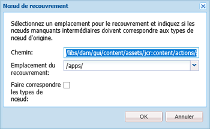
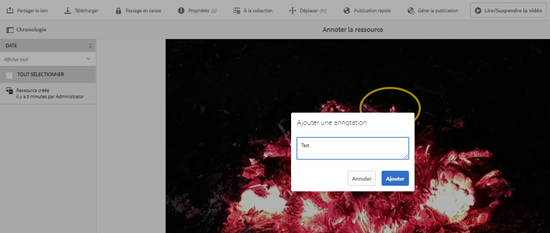
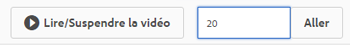
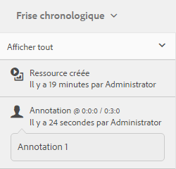

# Gestion des ressources vidéo  {#manage-video-assets}

Le format vidéo est un élément essentiel des ressources numériques d’une entreprise. [!DNL Adobe Experience Manager] Les offres développent des offres et des fonctionnalités pour gérer tout le cycle de vie des ressources vidéo après leur création.

Learn how to manage and edit the video assets in [!DNL Adobe Experience Manager Assets]. Also, if you are licensed to use [!DNL Dynamic Media], see the [Dynamic Media video documentation](/help/assets/video.md).

## Chargement et prévisualisation des ressources vidéo {#upload-and-preview-video-assets}

[!DNL Adobe Experience Manager Assets] génère des prévisualisations pour les fichiers vidéo avec l’extension MP4. Si le format de la ressource n’est pas MP4, installez le pack FFmpeg pour générer une prévisualisation. FFmpeg crée des rendus vidéo de type OGG et MP4. Vous pouvez prévisualisation les rendus dans l’interface utilisateur Ressources.

1. Dans le dossier Ressources numériques ou ses sous-dossiers, accédez à l’emplacement où vous souhaitez ajouter les ressources numériques.
1. To upload the asset, click **[!UICONTROL Create]** from the toolbar and then choose **[!UICONTROL Files]**. Vous pouvez également le faire glisser directement jusqu’à la zone des ressources. See [upload assets](managing-assets-touch-ui.md#uploading-assets) for details around the upload operation.
1. To preview a video in the Card view, click the **[!UICONTROL Play]** button on the video asset.

   

   Vous pouvez suspendre ou lire une vidéo en mode Carte uniquement. Les boutons [!UICONTROL Lecture] et [!UICONTROL Pause] ne sont pas disponibles dans la vue Liste.

1. To preview the video in the asset details page, click the **[!UICONTROL Edit]** icon on the card.

   La vidéo se joue dans le lecteur vidéo natif du navigateur. Vous pouvez lire, suspendre, afficher la vidéo en plein écran et en contrôler le volume.

   

## Configuration pour télécharger des ressources d’une taille supérieure à 2 Go {#configuration-to-upload-assets-that-are-larger-than-gb}

By default, [!DNL Assets] does not let you upload any assets that are larger than 2 GB because of a file size limit. Néanmoins, vous pouvez contourner cette limite en accédant à CRXDE Lite et en créant un nœud dans le répertoire `/apps`. Le nœud doit comporter le même nom, la même structure de répertoire et des propriétés comparables.

In addition to [!DNL Assets] configuration, change the following configurations to upload large assets:

* Augmentez le délai d’expiration du jeton. Voir Servlet [!UICONTROL CSRF] Adobe Granite dans la console Web à l’adresse `https://[aem_server]:[port]/system/console/configMgr`. Pour plus d’informations, voir Protection CSRF.
* Augmentez la configuration `receiveTimeout` du répartiteur. Pour plus d’informations, voir [Configuration du répartiteur Experience Manager](https://docs.adobe.com/content/help/en/experience-manager-dispatcher/using/configuring/dispatcher-configuration.html#renders-options).

>[!NOTE]
>
>The [!DNL Experience Manager] Classic user interface does not have a 2-GB file size limit restriction. Par ailleurs, le processus de bout en bout pour des vidéos volumineuses n’est pas entièrement pris en charge.

Pour configurer une limite de taille de fichier supérieure, procédez comme suit dans le répertoire `/apps`.

1. In [!DNL Experience Manager], click **[!UICONTROL Tools]** > **[!UICONTROL General]** > **[!UICONTROL CRXDE Lite]**.
1. Dans CRXDE Lite, accédez à `/libs/dam/gui/content/assets/jcr:content/actions/secondary/create/items/fileupload`. To see the directory window, click the `>>`.
1. From the toolbar, click the **[!UICONTROL Overlay Node]**. Vous pouvez également sélectionner **[!UICONTROL Nœud de recouvrement]** dans le menu contextuel.
1. In the **[!UICONTROL Overlay Node]** dialog, click **[!UICONTROL OK]**.

   

1. Actualisez le navigateur. Le nœud de recouvrement `/jcr_root/apps/dam/gui/content/assets/jcr:content/actions/secondary/create/items/fileupload` est sélectionné.
1. Dans l’onglet **[!UICONTROL Propriétés]**, saisissez la valeur appropriée en octets pour définir la taille maximale souhaitée. Par exemple, pour augmenter la taille limite à 30 Go, entrez la valeur `{sizeLimit : "32212254720"}`.

1. From the toolbar, click **[!UICONTROL Save All]**.
1. In [!DNL Experience Manager], click **[!UICONTROL Tools]** > **[!UICONTROL Operations]** > **[!UICONTROL Web Console]**.
1. On the [!DNL Adobe Experience Manager] [!UICONTROL Web Console Bundles] page, under the Name column of the table, locate and click **[!UICONTROL Adobe Granite Workflow External Process Job Handler]**.
1. On the [!UICONTROL Adobe Granite Workflow External Process Job Handler] page, set the seconds for both **[!UICONTROL Default Timeout]** and **[!UICONTROL Max Timeout]** fields to `18000` (five hours). Cliquez sur **[!UICONTROL Enregistrer]**.
1. Dans [!DNL Experience Manager], cliquez sur **[!UICONTROL Outils]** > **[!UICONTROL Processus]** > **[!UICONTROL Modèles]**.
1. On the Workflow Models page, select **[!UICONTROL Dynamic Media Encode Video]**, then click **[!UICONTROL Edit]**.
1. On the workflow page, double-click the **[!UICONTROL Dynamic Media Video Service Process]** component.
1. Dans la boîte de dialogue [!UICONTROL Propriétés des étapes], sous l’onglet **[!UICONTROL Commun]**, développez **Paramètres avancés**.
1. In the **[!UICONTROL Timeout]** field, specify a value of `18000`, then click **[!UICONTROL OK]** to return to the **[!UICONTROL Dynamic Media Encode Video]** workflow page.
1. Near the top of the page, below the [!UICONTROL Dynamic Media Encode Video] page title, click **[!UICONTROL Save]**.

## Publication de ressources vidéo {#publish-video-assets}

Après la publication, vous pouvez inclure les fichiers vidéo dans une page Web sous la forme d’une URL ou les incorporer directement. Pour plus d’informations, reportez-vous à la page [Publication de fichiers](/help/assets/publishing-dynamicmedia-assets.md)multimédias dynamiques.

## Annotation de ressources vidéo {#annotate-video-assets}

1. From the Assets console, click [!UICONTROL Edit] on the asset card to display the asset details page.
1. Pour lire la vidéo, cliquez sur [!UICONTROL Prévisualisation].
1. Pour annoter la vidéo, cliquez sur le bouton **[!UICONTROL Annoter]**. Une annotation est ajoutée au moment (image) particulier de la vidéo. Lorsque vous annotez, vous pouvez dessiner sur le canevas et inclure un commentaire avec le dessin. Les commentaires sont automatiquement enregistrés.

   

   Pour quitter l’assistant d’annotation, cliquez sur **[!UICONTROL Fermer]**.

1. Pour passer à un point spécifique de la vidéo, indiquez le moment en secondes dans le champ **texte** et cliquez sur **Aller**. Par exemple, pour sauter les 20 premières secondes de la vidéo, saisissez 10 dans le champ texte.

   

1. Pour l’afficher dans la chronologie, cliquez sur une annotation. Pour supprimer l’annotation de la chronologie, cliquez sur **[!UICONTROL Supprimer]**.

   

>[!MORELIKETHIS]
>
>* [Gestion des ressources numériques dans les ressources Experience Manager](/help/assets/managing-assets-touch-ui.md)
>* [Gestion des collections dans les ressources Experience Manager](/help/assets/managing-collections-touch-ui.md)

