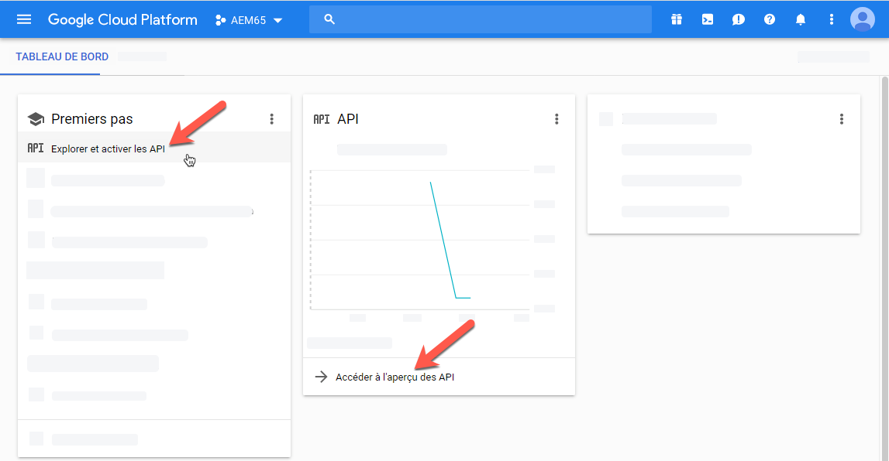
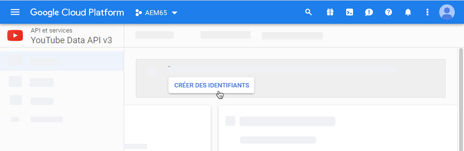

# Gestion des ressources vidéo {#manage-video-assets}

| Version | Lien de l’article |
| -------- | ---------------------------- |
| AEM as a Cloud Service | [Cliquez ici](https://experienceleague.adobe.com/docs/experience-manager-cloud-service/content/assets/manage/manage-video-assets.html?lang=fr) |
| AEM 6.5 | Cet article |

Le format vidéo est un élément essentiel des ressources numériques d’une entreprise. [!DNL Adobe Experience Manager] propose des solutions et des fonctionnalités matures pour gérer l’ensemble du cycle de vie de vos ressources vidéo après leur création.

Découvrez comment gérer et modifier les ressources vidéo dans [!DNL Adobe Experience Manager Assets]. Le codage et le transcodage des vidéos, par exemple le transcodage FFmpeg, sont possibles à l’aide de l’intégration [!DNL Dynamic Media].

## Chargement et prévisualisation des ressources vidéo {#upload-and-preview-video-assets}

[!DNL Adobe Experience Manager Assets] génère des aperçus pour les contenus vidéo dotés de l’extension MP4. Si le format du contenu n’est pas MP4, installez le pack FFmpeg pour générer l’aperçu. FFmpeg crée des rendus vidéo du type OGG et MP4. Vous pouvez prévisualiser les rendus dans l’interface utilisateur [!DNL Assets].

1. Dans le dossier Ressources numériques ou ses sous-dossiers, accédez à l’emplacement où vous souhaitez ajouter les ressources numériques.
1. Pour charger le contenu, cliquez sur **[!UICONTROL Créer]** dans la barre d’outils, puis sélectionnez **[!UICONTROL Fichiers]**. Vous pouvez également faire glisser un fichier vers l’interface utilisateur. Voir [Ressources chargées](manage-assets.md#uploading-assets) pour plus d’informations.
1. Pour prévisualiser une vidéo en mode carte, cliquez sur l’option **[!UICONTROL Lecture]**  de la ressource vidéo. Vous pouvez suspendre ou lire une vidéo en mode Carte uniquement. Les options [!UICONTROL Lecture] et [!UICONTROL Pause] ne sont pas disponibles dans la vue Liste.

1. Pour prévisualiser la vidéo dans la page des détails de la ressource, cliquez sur **[!UICONTROL Modifier]** sur la carte. La vidéo se joue dans le lecteur vidéo natif du navigateur. Vous pouvez lire, suspendre, afficher la vidéo en plein écran et en contrôler le volume.

   

## Configuration pour charger des ressources d’une taille supérieure à 2 Go {#configuration-to-upload-assets-that-are-larger-than-gb}

Par défaut, [!DNL Assets] ne vous permet pas de charger des contenus dont le volume est supérieur à 2 Go en raison de la limitation de la taille des fichiers. Néanmoins, vous pouvez contourner cette limite en accédant à CRXDE Lite et en créant un nœud dans le répertoire `/apps`. Le nœud doit comporter le même nom, la même structure de répertoire et des propriétés comparables.

Outre la configuration d’[!DNL Assets], modifiez les configurations suivantes pour charger des fichiers volumineux :

* Augmentez le délai d’expiration du jeton. Consultez la section [!UICONTROL Servlet CSRF Granite Adobe] dans la console web à l’adresse `https://[aem_server]:[port]/system/console/configMgr`. Pour plus d’informations, consultez la section [Protection CSRF](/help/sites-developing/csrf-protection.md).
* Augmentez la configuration `receiveTimeout` du répartiteur. Pour plus d’informations, voir [Configuration du répartiteur Experience Manager](https://experienceleague.adobe.com/docs/experience-manager-dispatcher/using/configuring/dispatcher-configuration.html?lang=fr#renders-options).

>[!NOTE]
>
>L’interface utilisateur classique d’[!DNL Experience Manager] ne comporte pas de limite de taille de fichier à 2 Go. Par ailleurs, le workflow de bout en bout pour des vidéos volumineuses n’est pas entièrement pris en charge.

Pour configurer une limite de taille de fichier supérieure, procédez comme suit dans le répertoire `/apps`.

1. Dans [!DNL Experience Manager], cliquez sur **[!UICONTROL Outils]** > **[!UICONTROL Général]** > **[!UICONTROL CRXDE Lite]**.
1. Dans CRXDE Lite, accédez à `/libs/dam/gui/content/assets/jcr:content/actions/secondary/create/items/fileupload`. Pour afficher la fenêtre du répertoire, appuyez sur `>>`.
1. Dans la barre d’outils, cliquez sur **[!UICONTROL Nœud de recouvrement]**. Vous pouvez également sélectionner **[!UICONTROL Nœud de recouvrement]** dans le menu contextuel.
1. Dans la boîte de dialogue **[!UICONTROL Nœud de recouvrement]**, cliquez sur **[!UICONTROL OK]**.

   

1. Actualisez le navigateur. Le nœud de recouvrement `/apps/dam/gui/content/assets/jcr:content/actions/secondary/create/items/fileupload` est sélectionné.
1. Dans l’onglet **[!UICONTROL Propriétés]**, saisissez la valeur appropriée en octets pour définir la taille maximale souhaitée. Par exemple, pour augmenter la taille limite à 30 Go, entrez la valeur `32212254720`.

1. Dans la barre d’outils, cliquez sur **[!UICONTROL Tout enregistrer]**.
1. Dans [!DNL Experience Manager], cliquez sur **[!UICONTROL Outils]** > **[!UICONTROL Opérations]** > **[!UICONTROL Console web]**.
1. Dans la page [!UICONTROL Bundles de la console web [!DNL Adobe Experience Manager]], dans la colonne Nom de la table, recherchez et cliquez sur **[!UICONTROL Gestionnaire des tâches du processus externe de workflow Adobe Granite]**.
1. Dans la page [!UICONTROL Gestionnaire des tâches du processus externe de workflow Adobe Granite], définissez les secondes pour les champs de **[!UICONTROL dépassement de délai par défaut]** et de **[!UICONTROL délai dépassé maximum]** sur `18000` (cinq heures). Cliquez sur **[!UICONTROL Enregistrer]**.
1. Dans [!DNL Experience Manager], cliquez sur **[!UICONTROL Outils]** > **[!UICONTROL Workflow]** > **[!UICONTROL Modèles]**.
1. Dans la page Modèles de workflow, sélectionnez **[!UICONTROL Vidéo de codage Dynamic Media]**, puis cliquez sur **[!UICONTROL Modifier]**.
1. Dans la page du workflow, appuyez deux fois sur le composant **[!UICONTROL Processus de service vidéo Dynamic Media]**.
1. Dans la boîte de dialogue [!UICONTROL Propriétés des étapes], sous l’onglet **[!UICONTROL Commun]**, développez les **Paramètres avancés**.
1. Dans le champ **[!UICONTROL Temporisation]**, spécifiez une valeur de `18000`, puis cliquez sur **[!UICONTROL OK]** pour revenir à la page de workflow **[!UICONTROL Vidéo de codage de Dynamic Media]**.
1. Dans la partie supérieure de la page, sous le titre de la page [!UICONTROL Vidéo de codage de Dynamic Media], appuyez sur **[!UICONTROL Enregistrer]**.

## Publication de ressources vidéo {#publish-video-assets}

Après la publication, vous pouvez inclure les ressources vidéo dans une page web sous la forme d’une URL ou les intégrer directement. Pour plus d’informations, voir [Publication de ressources Dynamic Media](/help/assets/publishing-dynamicmedia-assets.md).

## Publication de vidéos sur YouTube {#publishing-videos-to-youtube}

Vous pouvez publier des ressources vidéo Experience Manager on-premise directement sur une chaîne YouTube que vous avez précédemment créée.

Pour publier des ressources vidéo sur YouTube, configurez Experience Manager Assets avec des balises. Vous associez ces balises à une chaîne YouTube. Si la balise d’une ressource vidéo correspond à la balise d’une chaîne YouTube, la vidéo est publiée sur YouTube. La publication sur YouTube se produit avec une publication normale de la vidéo à condition qu’une balise associée soit utilisée.

YouTube procède à son propre codage. De ce fait, le fichier vidéo d’origine chargé dans Experience Manager est publié sur YouTube et non pas dans un rendu vidéo créé par le codage Dynamic Media. Même s’il n’est pas nécessaire de traiter les vidéos à l’aide de Dynamic Media, il est supposé qu’elles le sont si un paramètre prédéfini de visionneuse est nécessaire pour la lecture.

Lorsque vous ignorez le profil de traitement vidéo et que vous effectuez directement la publication sur YouTube, votre ressource vidéo ne dispose pas de miniature visible dans Experience Manager Assets. Cela signifie également que si vous utilisez le mode d’exécution `dynamicmedia` ou `dynamicmedia_scene7`, les vidéos non codées ne fonctionnent avec aucun des types de ressources Dynamic Media.

Pour garantir une authentification serveur à serveur sécurisée avec YouTube, la publication des vidéos sur les serveurs YouTube implique les tâches suivantes :

1. [Configuration des paramètres de Google Cloud](#configuring-google-cloud-settings)
1. [Création d’une chaîne YouTube](#creating-a-youtube-channel)
1. [Ajout de balises pour la publication](#adding-tags-for-publishing)
1. [Activation de l’agent de réplication de publication YouTube](#enabling-the-youtube-publish-replication-agent)
1. [Configuration de YouTube dans Experience Manager](#setting-up-youtube-in-aem)
1. [(Facultatif) Automatisation de la définition des propriétés YouTube par défaut pour vos vidéos chargées](#optional-automating-the-setting-of-default-youtube-properties-for-your-uploaded-videos)
1. [Publication de vidéos sur votre chaîne YouTube](#publishing-videos-to-your-youtube-channel)
1. [(Facultatif) Vérification de la vidéo publiée sur YouTube](/help/assets/video.md#optional-verifying-the-published-video-on-youtube)
1. [Liaison d’URL YouTube à votre application web](#linking-youtube-urls-to-your-web-application)

Vous pouvez également [dépublier des vidéos pour les supprimer de YouTube](#unpublishing-videos-to-remove-them-from-youtube).

### Configuration des paramètres de Google Cloud {#configuring-google-cloud-settings}

Pour effectuer une publication sur YouTube, vous avez besoin d’un compte Google. Si vous disposez d’un compte GMAIL, alors vous disposez déjà d’un compte Google ; si vous ne disposez pas d’un compte Google, vous pouvez facilement en créer un. Un compte est nécessaire, car vous avez besoin des informations d’identification pour publier des ressources vidéo sur YouTube. Si vous avez déjà créé un compte, ignorez cette tâche et passez directement à [Création d’une chaîne YouTube](#creating-a-youtube-channel).

Il n’est pas nécessaire que le compte utilisé avec Google Cloud et le compte Google utilisé pour YouTube soient les mêmes.

Google modifie régulièrement son interface utilisateur. De ce fait, les étapes de publication des vidéos sur YouTube peuvent varier légèrement des étapes présentées ci-dessous. Cet avertissement s’applique également à YouTube lorsque vous tentez de vérifier si des vidéos y sont téléchargées.

>[!NOTE]
>
>Les étapes suivantes étaient exactes au moment de leur rédaction. Toutefois, Google met à jour régulièrement ses sites web sans préavis. Par conséquent, ces étapes peuvent être légèrement différentes.

Pour configurer les paramètres de Google Cloud, procédez comme suit :

1. Créez un compte Google.
   [https://accounts.google.com/SignUp?service=mail](https://accounts.google.com/SignUp?service=mail)

   Si vous disposez déjà d’un compte Google, passez à l’étape suivante.

1. Accédez à [https://cloud.google.com/](https://cloud.google.com/).
1. Dans la page Google Cloud, près du coin supérieur droit, cliquez sur **[!UICONTROL Console]**.

   Vous devrez peut-être vous **[!UICONTROL connecter]** à l’aide des informations d’identification de votre compte Google pour voir l’option **[!UICONTROL Console]**.

1. Sur la page Tableau de bord, à droite de **[!UICONTROL Google Cloud Platform]**, cliquez sur la liste déroulante Projet pour ouvrir la boîte de dialogue Sélectionner un projet.
1. Dans la boîte de dialogue Sélectionner un projet, appuyez sur **[!UICONTROL Nouveau projet]**.

   

1. Dans la boîte de dialogue Nouveau projet, saisissez le nom de votre nouveau projet dans le champ Nom du projet.

   Votre ID de projet est basé sur le nom du projet. Par conséquent, choisissez soigneusement le nom du projet ; il ne peut pas être modifié une fois créé. Vous devez également le saisir lors de la configuration ultérieure de YouTube dans Experience Manager ; vous pouvez le noter pour vous en rappeler.

1. Cliquez sur **[!UICONTROL Créer]**.

1. Effectuez l’une des opérations suivantes :

   * Dans le tableau de bord de votre projet, dans la vignette Prise en main, cliquez sur **[!UICONTROL Explorer et activer les API]**.
   * Dans le tableau de bord de votre projet, dans la carte API, appuyez sur **[!UICONTROL Accéder à l’aperçu des API]**.

   

1. En haut de la page API &amp; services, sélectionnez **[!UICONTROL Activer les API et les services]**.
1. Sur la page Bibliothèque d’API, dans la partie gauche, sous **[!UICONTROL Catégorie]**, appuyez sur **[!UICONTROL YouTube]**. Sur le côté droit de la page, appuyez sur **[!UICONTROL YouTube Data API]**.
1. Sur la page YouTube Data API v3, appuyez sur **[!UICONTROL Activer]**.

   

1. Pour utiliser l’API, vous avez besoin d’identifiants. Si besoin, cliquez sur **[!UICONTROL Créer des identifiants]**.

   

1. Sur la page **[!UICONTROL Ajouter des identifiants au projet]**, à l’étape 1, procédez comme suit :

   * Dans la liste déroulante **[!UICONTROL Quelle API utilisez-vous ?]**, sélectionnez **[!UICONTROL YouTube Data API v3]**.

   * Depuis la liste déroulante **[!UICONTROL Quelle plate-forme utilisez-vous pour appeler l’API ?]**, sélectionnez **[!UICONTROL Serveur web (par exemple, node.js, Tomcat)]**.

   * Dans la liste déroulante **[!UICONTROL À quelles données accédez-vous ?]**, appuyez sur **[!UICONTROL Données utilisateur]**.

   

1. Sélectionnez **[!UICONTROL De quels identifiants ai-je besoin ?]**
1. Sur la page **[!UICONTROL Ajouter des identifiants au projet]**, à l’étape 2, sous l’en-tête **[!UICONTROL Créer un ID client OAuth 2.0]**, dans le champ Nom, saisissez un nom unique si vous le souhaitez. Vous pouvez également utiliser le nom par défaut spécifié par Google.
1. Dans le champ de texte sous l’en-tête **[!UICONTROL Origines JavaScript autorisées]**, saisissez le chemin suivant, en substituant vos propres domaine et numéro de port dans le chemin, puis appuyez sur **[!UICONTROL Entrée]** pour ajouter le chemin à la liste :

   `https://<servername.domain>:<port_number>`

   Par exemple, `https://1a2b3c.mycompany.com:4321`

   **Remarque :** l’exemple de chemin ci-dessus est fourni uniquement à titre illustratif.

   

1. Dans le champ de texte sous l’en-tête **[!UICONTROL URI de redirection autorisés]**, saisissez le chemin suivant, en substituant vos propres domaine et numéro de port dans le chemin, puis appuyez sur **[!UICONTROL Entrée]** pour ajouter le chemin à la liste :

   `https://<servername.domain>:<port_number>/etc/cloudservices/youtube.youtubecredentialcallback.json`

   Par exemple, `https://1a2b3c.mycompany.com:4321/etc/cloudservices/youtube.youtubecredentialcallback.json`

   **Remarque :** l’exemple de chemin ci-dessus est fourni uniquement à titre illustratif.

1. Cliquez sur **[!UICONTROL Créer un ID client OAuth]**.
1. Sur la page **[!UICONTROL Ajouter des identifiants au projet]**, à l’étape 3, sous l’en-tête **[!UICONTROL Configuration de l’écran d’autorisation OAuth 2.0]**, sélectionnez l’adresse e-mail Gmail que vous utilisez actuellement.

   

1. Sous l’en-tête **[!UICONTROL Nom du produit affiché à l’intention des utilisateurs]**, dans le champ de texte, entrez ce qui doit s’afficher sur l’écran d’autorisation.

   L’écran du consentement s’affiche pour l’administrateur Experience Manager lorsque celui-ci s’identifie sur YouTube ; Experience Manager contacte YouTube pour lui demander l’autorisation.

1. Cliquez sur **[!UICONTROL Continuer]**.
1. Sur la page Ajouter des identifiants au projet, à l’étape 4, sous l’en-tête **[!UICONTROL Télécharger les identifiants]**, appuyez sur **[!UICONTROL Télécharger]**.

   

1. Enregistrez le fichier `client_id.json`.

   Vous en avez besoin lors de la configuration ultérieure de YouTube dans Adobe Experience Manager.

1. Cliquez sur **[!UICONTROL Terminé]**.

   Déconnectez-vous de votre compte Google. Créez maintenant une chaîne YouTube.

### Création d’une chaîne YouTube {#creating-a-youtube-channel}

Pour publier des vidéos sur YouTube, vous devez disposer d’une ou de plusieurs chaînes. Si vous avez déjà créé une chaîne YouTube, vous pouvez ignorer cette étape et passer à la tâche [Ajout de balises pour la publication](/help/assets/video.md#adding-tags-for-publishing).

>[!WARNING]
>
>Vous devez avoir configuré une ou plusieurs chaînes dans YouTube *avant* d’ajouter des chaînes sous Paramètres YouTube dans Experience Manager (voir la section [Configuration de YouTube dans Experience Manager](#setting-up-youtube-in-aem) ci-dessous). Si vous ne parvenez pas à configurer un ou plusieurs canaux, vous n’êtes pas averti de l’absence de canaux. L’authentification Google a lieu lorsque vous ajoutez une chaîne, mais il n’existe pas d’option permettant de choisir la chaîne vers laquelle la vidéo est envoyée.

**Pour créer une chaîne YouTube :**

1. Accédez à [https://www.youtube.com](https://www.youtube.com/), puis connectez-vous à l’aide des informations d’identification de votre compte Google.
1. Dans l’angle supérieur droit de la page YouTube, cliquez sur l’image de votre profil (peut également s’afficher sous la forme d’une lettre dans un cercle coloré uni), puis cliquez sur **[!UICONTROL Paramètres YouTube]** (icône sous forme d’engrenage rond).
1. Sur la page Présentation, sous l’en-tête Fonctionnalités supplémentaires, cliquez sur **[!UICONTROL Voir toutes mes chaînes ou créer une chaîne]**.
1. Depuis la page Chaînes, cliquez sur **[!UICONTROL Créer une chaîne]**.
1. Sur la page Compte de marque, dans le champ nom du compte de marque, saisissez un nom d’entité professionnelle ou tout autre nom de chaîne de votre choix sous lequel vous souhaitez publier vos ressources vidéo, puis cliquez sur **[!UICONTROL Créer]**.

   Mémorisez le nom que vous entrez ici ; vous devrez le saisir à nouveau lorsque vous devrez configurer YouTube dans Experience Manager.

1. (Facultatif) Si nécessaire, ajoutez d’autres chaînes.

   Ajoutez à présent des balises pour la publication.

### Ajout de balises pour la publication {#adding-tags-for-publishing}

Pour publier vos vidéos sur YouTube, Experience Manager associe des balises à une ou plusieurs chaînes YouTube. Pour ajouter des balises pour publication, consultez la section [Administration des balises](/help/sites-administering/tags.md).

Ou, si vous prévoyez d’utiliser les balises par défaut dans Experience Manager, vous pouvez ignorer cette tâche et accéder à l’[Activation de l’agent de réplication de publication YouTube](#enabling-the-youtube-publish-replication-agent).

### Activation de l’agent de réplication de publication YouTube {#enabling-the-youtube-publish-replication-agent}

Après avoir activé l’agent de réplication de publication YouTube, si vous souhaitez tester la connexion au compte Google Cloud, appuyez sur **[!UICONTROL Tester la connexion]**. Un onglet de navigateur affiche les résultats de la connexion. Si vous avez ajouté des chaînes YouTube, une liste de ces chaînes s’affiche dans le cadre du test.

1. Dans le coin supérieur gauche d’Experience Manager, cliquez sur le logo d’Experience Manager, puis dans le rail de gauche, cliquez sur **[!UICONTROL Outils]** > **[!UICONTROL Déploiement]** > **[!UICONTROL Réplication]** > **[!UICONTROL Agents sur l’auteur]**.
1. Sur la page Agents sur l’auteur, cliquez sur **[!UICONTROL Publication YouTube]**.
1. Dans la barre d’outils, à droite de Paramètres, cliquez sur **[!UICONTROL Modifier]**.
1. Cochez la case **[!UICONTROL Activé]** pour activer l’agent de réplication.
1. Cliquez sur **[!UICONTROL OK]**.

   Configurez maintenant YouTube dans Experience Manager.

### Configuration de YouTube dans Experience Manager {#setting-up-youtube-in-aem}

À partir d’Experience Manager 6.4, une nouvelle méthode d’interface utilisateur tactile a été ajoutée pour configurer la publication YouTube dans Experience Manager. Selon l’instance d’Experience Manager que vous utilisez, effectuez l’une des opérations suivantes :

* Pour configurer YouTube dans une version d’Experience Manager antérieure à la version 6.4, consultez [Configuration de YouTube dans une version d’Experience Manager antérieure à la version 6.4](/help/assets/video.md#setting-up-youtube-in-aem-before).
* Pour configurer YouTube dans Experience Manager 6.4 ou dans des versions ultérieures, reportez-vous à [Configuration de YouTube dans Experience Manager 6.4 et dans ses versions ultérieures](#setting-up-youtube-in-aem-and-later).

#### Configuration de YouTube dans Experience Manager 6.4 et dans ses versions ultérieures {#setting-up-youtube-in-aem-and-later}

1. Veillez à vous connecter à votre instance Dynamic Media en tant qu’administrateur.
1. Dans le coin supérieur gauche, appuyez sur le logo Experience Manager, puis, dans le rail de gauche, appuyez sur **[!UICONTROL Outils]** (icône de marteau) > **[!UICONTROL Services cloud]** > **[!UICONTROL Configuration de la publication sur YouTube]**.
1. Appuyez sur **[!UICONTROL global]** (sans sélectionner cette option).

1. Dans le coin supérieur droit de la page Global, appuyez sur **[!UICONTROL Créer]**.
1. Sur la page Créer une configuration YouTube, sous Paramètres de plateforme Google Cloud, dans le champ **[!UICONTROL Nom de l’application]**, saisissez l’ID de projet Google.

   Vous avez spécifié l’ID de projet lorsque vous avez précédemment configuré les paramètres de Google Cloud.
Laissez ouverte la page Créer une configuration YouTube ; vous allez y revenir dans un instant.

   

1. À l’aide d’un éditeur de texte brut, ouvrez le fichier JSON que vous avez téléchargé et enregistré au cours de la tâche [Configuration des paramètres de Google Cloud](/help/assets/video.md#configuring-google-cloud-settings).
1. Sélectionnez l’intégralité du texte JSON et copiez-le.
1. Revenez à la boîte de dialogue Paramètres du compte YouTube. Dans le champ **[!UICONTROL Configuration JSON]**, collez le texte JSON.
1. Dans le coin supérieur droit de la page, appuyez sur **[!UICONTROL Enregistrer]**.

   Configurez maintenant les canaux YouTube dans Experience Manager.

1. Appuyez sur **[!UICONTROL Ajouter un canal]**.
1. Dans la boîte de dialogue Paramètres de chaîne, saisissez le nom de la chaîne que vous avez créée lors de la tâche **[!UICONTROL Ajout d’une ou plusieurs chaînes YouTube]** précédemment.

   Vous pouvez éventuellement ajouter une description.

1. Appuyez sur **[!UICONTROL Ajouter]**.
1. L’authentification YouTube/Google s’affiche. Si vous n’êtes pas déjà connecté(e) au compte Google Cloud, ignorez cette étape.

   * Saisissez le nom d’utilisateur et le mot de passe Google associés à l’ID de projet Google et au texte JSON ci-dessus.
   * Selon le nombre de canaux de votre compte, deux éléments ou plus s’affichent. Sélectionnez un canal. Ne sélectionnez pas l’adresse e-mail, car il ne s’agit pas d’un canal.
   * Dans la page suivante, appuyez sur **[!UICONTROL Accepter]** pour autoriser l’accès à cette chaîne.

1. Appuyez sur **[!UICONTROL Autoriser]**.

   Configurez maintenant des balises pour la publication.

1. **[!UICONTROL Configuration de balises pour la publication]** : dans la page Services cloud > YouTube, appuyez sur l’icône en forme de crayon pour modifier la liste des balises que vous souhaitez utiliser.
1. Appuyez sur l’icône de liste déroulante (flèche pointant vers le bas) pour afficher la liste des balises disponibles dans Experience Manager.
1. Appuyez sur une ou plusieurs balises pour les ajouter.

   Pour supprimer une balise que vous avez ajoutée, sélectionnez-la et appuyez sur **[!UICONTROL X]**.

1. Lorsque vous avez terminé d’ajouter les balises souhaitées, appuyez sur **[!UICONTROL Enregistrer]**.

   Vous allez à présent publier des vidéos sur votre chaîne YouTube.

#### Configuration de YouTube dans une version d’Experience Manager antérieure à la version 6.4 {#setting-up-youtube-in-aem-before}

1. Veillez à vous connecter à votre instance Dynamic Media en tant qu’administrateur.

1. Dans le coin supérieur gauche, appuyez sur le logo Experience Manager, puis, dans le rail de gauche, appuyez sur **[!UICONTROL Outils]** (icône de marteau) > **[!UICONTROL Déploiement]** > **[!UICONTROL Services cloud]**.
1. Sous le titre Services tiers, appuyez sur **[!UICONTROL Configurer maintenant]** sous YouTube.
1. Dans la boîte de dialogue Créer une configuration, saisissez un titre (obligatoire) et un nom (facultatif) dans les champs correspondants.
1. Appuyez sur **[!UICONTROL Créer]**.
1. Dans la boîte de dialogue Paramètres du compte YouTube, dans le champ **[!UICONTROL Nom de l’application]**, saisissez l’ID de projet Google.

   Vous avez spécifié l’ID de projet lorsque vous avez précédemment [configuré les paramètres de Google Cloud](/help/assets/video.md#configuring-google-cloud-settings).
Laissez la boîte de dialogue Paramètres de compte YouTube ouverte. Vous y retournerez dans quelques instants.

1. À l’aide d’un éditeur de texte brut, ouvrez le fichier JSON que vous avez téléchargé et enregistré plus tôt au cours de la tâche de configuration des paramètres de Google Cloud.
1. Sélectionnez l’intégralité du texte JSON et copiez-le.
1. Revenez à la boîte de dialogue Paramètres du compte YouTube. Dans le champ **[!UICONTROL Configuration JSON]**, collez le texte JSON.
1. Appuyez sur **[!UICONTROL OK]**.

   Configurez maintenant les canaux YouTube dans Experience Manager.

1. À droite des **[!UICONTROL Canaux disponibles]**, appuyez sur **+** (icône représentant un signe plus).
1. Dans la boîte de dialogue Paramètres de chaîne YouTube, dans le champ Titre, saisissez le nom de la chaîne que vous avez créée lors de la tâche **[!UICONTROL Ajout d’une ou plusieurs chaînes YouTube]** précédemment.

   Vous pouvez éventuellement ajouter une description.

1. Appuyez sur **[!UICONTROL OK]**.
1. L’authentification YouTube/Google s’affiche. Si vous n’êtes pas déjà connecté(e) au compte Google Cloud, ignorez cette étape.

   * Saisissez le nom d’utilisateur et le mot de passe Google associés à l’ID de projet Google et au texte JSON ci-dessus.
   * Selon le nombre de canaux de votre compte, deux éléments ou plus s’affichent. Sélectionnez un canal. Ne sélectionnez pas l’adresse e-mail, car il ne s’agit pas d’un canal.
   * Dans la page suivante, appuyez sur **[!UICONTROL Accepter]** pour autoriser l’accès à cette chaîne.

1. Appuyez sur **[!UICONTROL Autoriser]**.

   Configurez maintenant des balises pour la publication.

1. **[!UICONTROL Configuration de balises pour la publication]** : dans la page Services cloud > YouTube, appuyez sur l’icône en forme de crayon pour modifier la liste des balises que vous souhaitez utiliser.
1. Appuyez sur l’icône de liste déroulante (flèche pointant vers le bas) pour afficher la liste des balises disponibles dans Experience Manager.
1. Appuyez sur une ou plusieurs balises pour les ajouter.

   Pour supprimer une balise que vous avez ajoutée, sélectionnez-la et appuyez sur **X**.

1. Lorsque vous avez terminé d’ajouter les balises souhaitées, sélectionnez **[!UICONTROL OK]**.

   Vous allez à présent publier des vidéos sur votre chaîne YouTube.

### (Facultatif) Automatisation de la définition des propriétés YouTube par défaut pour vos vidéos chargées {#optional-automating-the-setting-of-default-youtube-properties-for-your-uploaded-videos}

Vous pouvez éventuellement automatiser la définition des propriétés YouTube lors du chargement de vos vidéos en créant un profil de traitement des métadonnées dans Experience Manager.

Pour créer le profil de traitement des métadonnées, vous allez d’abord copier les valeurs des champs **[!UICONTROL Étiquette de champ]**, **[!UICONTROL Associer à la propriété]** et **[!UICONTROL Choix]**, tous situés dans les schémas de métadonnées pour la vidéo. Ensuite, vous allez créer votre propre profil de traitement des métadonnées vidéo YouTube en y ajoutant ces valeurs.

Pour automatiser la définition des propriétés YouTube par défaut pour vos vidéos chargées, procédez comme suit :

1. Dans le coin supérieur gauche d’Experience Manager, appuyez sur le logo d’Experience Manager, puis, dans le rail de gauche, cliquez sur **[!UICONTROL Outils]** (icône Marteau) > **[!UICONTROL Ressources]** > **[!UICONTROL Schémas de métadonnées]**.
1. Cliquez sur l’option **[!UICONTROL Par défaut]**. (Ne cochez pas la case de sélection à gauche de l’option « Par défaut ».)
1. Sur la page **[!UICONTROL par défaut]**, cochez la case à gauche de **[!UICONTROL vidéo]**, puis appuyez sur **[!UICONTROL Modifier]**.
1. Sur la page Éditeur de schéma de métadonnées, appuyez sur l’onglet **[!UICONTROL Avancé]**.
1. Sous l’en-tête Publication YouTube, cliquez sur **[!UICONTROL Catégorie YouTube]**.
1. Dans la partie droite de la page, sous l’onglet **[!UICONTROL Paramètres]**, procédez comme suit :

   * Dans le champ de texte **[!UICONTROL Associer à la propriété]**, sélectionnez la valeur et copiez-la.
Collez la valeur copiée dans l’éditeur de texte ouvert. Vous allez avoir besoin de cette valeur plus tard, lorsque vous allez créer votre profil de traitement des métadonnées. Laissez l’éditeur de texte ouvert.

   * Sous **[!UICONTROL Choix]**, sélectionnez la valeur par défaut à utiliser (comme « Personnes et blogs » ou « Science et technologie ») et copiez-la.
Collez la valeur copiée dans l’éditeur de texte ouvert. Vous allez avoir besoin de cette valeur plus tard, lorsque vous allez créer votre profil de traitement des métadonnées. Laissez l’éditeur de texte ouvert.

1. Sous l’en-tête de Publication YouTube, appuyez sur **[!UICONTROL Confidentialité YouTube]**.
1. Dans la partie droite de la page, sous l’onglet **[!UICONTROL Paramètres]**, procédez comme suit :

   * Dans le champ de texte **[!UICONTROL Associer à la propriété]**, sélectionnez la valeur et copiez-la.
Collez la valeur copiée dans l’éditeur de texte ouvert. Vous allez avoir besoin de cette valeur plus tard, lorsque vous allez créer votre profil de traitement des métadonnées. Laissez l’éditeur de texte ouvert.

   * Sous **[!UICONTROL Choix]**, sélectionnez et copiez la valeur par défaut à utiliser. Notez que les choix sont groupés par paires. Le champ inférieur de la paire correspond à la valeur par défaut que vous souhaitez copier, comme valeur publique, non répertoriée ou privée.
Collez la valeur copiée dans l’éditeur de texte ouvert. Vous allez avoir besoin de cette valeur plus tard, lorsque vous allez créer votre profil de traitement des métadonnées. Laissez l’éditeur de texte ouvert.

1. Près du coin supérieur droit de la page Éditeur de schéma de métadonnées, cliquez sur **[!UICONTROL Annuler]**.
1. Dans le coin supérieur gauche d’Experience Manager, appuyez sur le logo Experience Manager, puis, dans le rail de gauche, cliquez sur **[!UICONTROL Outils]** (icône Marteau) > **[!UICONTROL Ressources]** > **[!UICONTROL Profils de métadonnées]**.

1. Sur la page Profils de métadonnées, près du coin supérieur droit de la page, cliquez sur **[!UICONTROL Créer]**.
1. Dans la boîte de dialogue Ajouter un profil de métadonnées, dans le champ de texte **[!UICONTROL Titre du profil]**, saisissez le nom `YouTube Video`, puis cliquez sur **[!UICONTROL Créer]**.
1. Sur la page Éditeur de profil de métadonnées, sélectionnez l’onglet **[!UICONTROL Avancé]**.
1. Ajoutez les valeurs de publication YouTube copiées au profil en procédant comme suit :

   * Dans la partie droite de la page, cliquez sur l’onglet **[!UICONTROL Créer le formulaire]**.
   * (Facultatif) Faites glisser le composant appelé **[!UICONTROL En-tête de section]** vers la gauche et déposez-le dans la zone de formulaire.
   * (Facultatif) Cliquez sur **[!UICONTROL Libellé du champ]** pour sélectionner le composant.
   * (Facultatif) Dans la partie droite de la page, sous l’onglet Paramètres, dans le champ de texte Libellé du champ, saisissez `YouTube Publishing`.
   * Cliquez sur l’onglet **[!UICONTROL Créer le formulaire]**, puis faites glisser le composant appelé **[!UICONTROL Texte à plusieurs valeurs]** et déposez-le sous l’en-tête **[!UICONTROL Publication YouTube]** que vous avez créé.

   * Cliquez sur **[!UICONTROL Libellé du champ]** afin de sélectionner le composant.
   * Dans la partie droite de la page, sous l’onglet Paramètres, collez les valeurs de publication YouTube (valeur Libellé du champ et Associer à la propriété) copiées précédemment, dans les champs respectifs du formulaire. Collez la valeur Choix dans le champ Valeur par défaut.

1. Ajoutez les valeurs copiées de confidentialité YouTube au profil en procédant comme suit :

   * Dans la partie droite de la page, cliquez sur l’onglet **[!UICONTROL Créer le formulaire]**.
   * (Facultatif) Faites glisser le composant appelé **[!UICONTROL En-tête de section]** vers la gauche et déposez-le dans la zone de formulaire.
   * (Facultatif) Cliquez sur **[!UICONTROL Libellé du champ]** pour sélectionner le composant.
   * (Facultatif) Dans la partie droite de la page, sous l’onglet Paramètres, dans le champ de texte Libellé du champ, saisissez `YouTube Privacy`.
   * Cliquez sur l’onglet **[!UICONTROL Créer le formulaire]**, puis faites glisser le composant appelé **[!UICONTROL Texte à plusieurs valeurs]** et déposez-le sous l’en-tête **[!UICONTROL Confidentialité YouTube]** que vous avez créé.

   * Cliquez sur **[!UICONTROL Libellé du champ]** afin de sélectionner le composant.
   * Dans la partie droite de la page, sous l’onglet Paramètres, collez les valeurs de publication YouTube (valeur Libellé du champ et Associer à la propriété) copiées précédemment, dans les champs respectifs du formulaire. Collez la valeur Choix dans le champ Valeur par défaut.

1. Près du coin supérieur droit de la page, cliquez sur **[!UICONTROL Enregistrer]**.
1. Appliquez le profil des métadonnées de publication YouTube aux dossiers dans lesquels vous allez charger des vidéos. Vous devez avoir configuré le profil des métadonnées et le profil vidéo.

   Voir [Profils de métadonnées](/help/assets/metadata-config.md#metadata-profiles) et [Profils vidéo](/help/assets/video-profiles.md).

### Publication de vidéos sur votre chaîne YouTube {#publishing-videos-to-your-youtube-channel}

Vous devez maintenant associer les balises que vous avez précédemment ajoutées aux ressources vidéo. Ce processus permet à Experience Manager de déterminer les ressources à publier sur votre chaîne YouTube.

>[!NOTE]
>
>Lors de l’exécution de Dynamic Media en mode Scene7, notez que le mode de publication Immédiatement ne publie pas automatiquement sur YouTube. Lorsque le mode Dynamic Media - Scene7 est configuré, il existe deux options de publication parmi lesquelles choisir : **[!UICONTROL Immédiatement]** ou **[!UICONTROL Lors de l’activation]**.
>
>Dans le mode de publication **[!UICONTROL Immédiatement]**, la ressource téléchargée (une fois synchronisée avec IPS) est automatiquement publiée sur le système de diffusion. Cela vaut pour Dynamic Media, mais pas pour YouTube. Pour publier sur YouTube, vous devez publier par le biais d’Experience Manager Author.

>[!NOTE]
>
>Pour publier du contenu depuis YouTube, Experience Manager utilise le workflow **[!UICONTROL Publier sur YouTube]**, qui vous permet de surveiller la progression et de consulter toutes les informations d’échec.
>
>Voir [Surveillance du codage vidéo et de la progression de la publication sur YouTube](#monitoring-video-encoding-and-youtube-publishing-progress).
>
>Pour obtenir des informations de progression plus détaillées, vous pouvez surveiller le journal YouTube sous la réplication. Sachez toutefois que ce type de surveillance nécessite un accès administrateur.

**Pour publier des vidéos sur votre chaîne YouTube, procédez comme suit :**

1. Dans Experience Manager, accédez à la ressource vidéo que vous souhaitez publier sur votre chaîne YouTube.
1. Sélectionnez la ressource vidéo (visionneuse de vidéos adaptative).
1. Dans la barre d’outils, cliquez sur **[!UICONTROL Propriétés]**.
1. Dans l’onglet De base, sous l’en-tête Métadonnées, cliquez sur **[!UICONTROL Boîte de dialogue Ouvrir la sélection]** à droite du champ Balises.
1. Sur la page Sélectionner des balises, accédez aux balises que vous souhaitez utiliser, puis sélectionnez une ou plusieurs balises.

   N’oubliez pas que les balises doivent être associées au canal YouTube.

1. Dans le coin supérieur droit de la page, cliquez sur **[!UICONTROL Sélectionner]**.
1. Dans le coin supérieur droit de la page des propriétés de la vidéo, cliquez sur **[!UICONTROL Enregistrer et fermer]**.
1. Dans la barre d’outils, sélectionnez **[!UICONTROL Publication rapide]**.

   Consultez également [Utilisation de la gestion de la publication avec Experience Manager Sites](https://experienceleague.adobe.com/docs/experience-manager-learn/sites/page-authoring/publication-management-feature-video-use.html?lang=fr).

   Vous avez la possibilité de vérifier la vidéo publiée sur votre chaîne YouTube.

### (Facultatif) Vérification de la vidéo publiée sur YouTube {#optional-verifying-the-published-video-on-youtube}

Vous pouvez si vous le souhaitez surveiller la progression de votre publication YouTube (ou sa dépublication).

Voir [Surveillance du codage vidéo et de la progression de la publication sur YouTube](#monitoring-video-encoding-and-youtube-publishing-progress).

Le délai de publication peut varier considérablement en fonction de nombreux facteurs, comme le format de la vidéo source originale, la taille du fichier et le trafic de chargement. La publication peut prendre de quelques minutes à plusieurs heures. En outre, les formats de haute résolution sont rendus beaucoup plus lentement. Par exemple, les vidéos en 720p et en 1 080p prennent plus de temps à s’afficher que les vidéos en 480p.

Au bout de huit heures, si un message de statut indiquant **[!UICONTROL Téléchargé (en cours de traitement, veuillez patienter)]** s’affiche toujours, essayez de supprimer la vidéo de votre site Adobe et chargez-la à nouveau.

### Liaison d’URL YouTube à votre application web {#linking-youtube-urls-to-your-web-application}

Une fois que vous avez publié la vidéo, une chaîne URL YouTube est générée par Dynamic Media. Lorsque vous copiez l’URL Youtube, cette dernière est conservée dans le presse-papiers, ce qui vous permet de la coller dans les pages de votre site web ou de votre application.

>[!NOTE]
>
>L’URL YouTube ne peut pas être copiée tant que vous n’avez pas publié la ressource vidéo sur YouTube.

**Pour lier des URL YouTube à votre application web, procédez comme suit :**

1. Accédez à la ressource vidéo *publiée sur YouTube* dont vous souhaitez copier l’URL, puis sélectionnez-la.

   N’oubliez pas que les URL YouTube peuvent être copiées uniquement *après* la *publication* des ressources vidéo sur YouTube.

1. Dans la barre d’outils, cliquez sur **[!UICONTROL Propriétés]**.
1. Cliquez sur l’onglet **[!UICONTROL Avancé]**.
1. Sous l’en-tête Publication YouTube, dans la liste des URL YouTube, sélectionnez le texte de l’URL et copiez-le dans votre navigateur web pour prévisualiser la ressource ou l’ajouter à votre page de contenu web.

### Dépublication de vidéos afin de les supprimer de YouTube {#unpublishing-videos-to-remove-them-from-youtube}

Lorsque vous dépubliez une ressource vidéo dans Experience Manager, la vidéo est supprimée de YouTube.

>[!CAUTION]
>
>Si vous supprimez une vidéo directement sur YouTube, Experience Manager l’ignore et continue de se comporter comme si la vidéo était toujours publiée sur YouTube. Veillez toujours à dépublier une ressource vidéo sur YouTube via Experience Manager.

>[!NOTE]
>
>Pour supprimer du contenu depuis YouTube, Experience Manager utilise le processus **[!UICONTROL Dépublier sur YouTube]**, qui vous permet de surveiller la progression et de consulter toutes les informations d’échec.
>
>Voir [Surveillance du codage vidéo et de la progression de la publication sur YouTube](#monitoring-video-encoding-and-youtube-publishing-progress).

**Pour dépublier des vidéos afin de les supprimer de YouTube, procédez comme suit :**

1. Accédez aux ressources vidéo que vous souhaitez dépublier de votre chaîne YouTube.
1. Dans un mode de sélection de ressources, sélectionnez une ou plusieurs ressources vidéo publiées.
1. Dans la barre d’outils, cliquez sur **[!UICONTROL Gérer la publication]**. Appuyez sur l’icône de points de suspension (. . .) dans la barre d’outils pour ouvrir **[!UICONTROL Gérer la publication]**.
1. Sur la page Gérer la publication, sélectionnez **[!UICONTROL Dépublier]**.
1. Dans l’angle supérieur droit de la page, appuyez sur **[!UICONTROL Suivant]**.
1. Dans l’angle supérieur droit de la page, sélectionnez **[!UICONTROL Dépublier]**.

## Surveillance du codage vidéo et de la progression de la publication sur YouTube {#monitoring-video-encoding-and-youtube-publishing-progress}

Lorsque vous téléchargez une nouvelle vidéo vers un dossier auquel un codage vidéo a été appliqué ou que vous publiez votre vidéo sur YouTube, vous pouvez contrôler la manière dont votre codage vidéo/publication YouTube progresse. La progression réelle de la publication YouTube n’est disponible que dans les journaux. Cependant, son échec ou son succès sont répertoriés de différentes manières décrites dans la procédure suivante. En outre, vous recevez des notifications par e-mail lorsqu’un workflow de publication YouTube ou un codage vidéo est terminé ou interrompu.

### Surveillance de la progression {#monitoring-progress}

1. Consultez la progression du codage vidéo dans votre dossier de ressources :

   * En mode Carte, la progression du codage vidéo s’affiche sur la ressource en pourcentage. En cas d’erreur, ces informations s’affichent également sur la ressource.

   

   * Dans la vue Liste, la progression du codage vidéo s’affiche dans la colonne **[!UICONTROL État du traitement]**. Si une erreur se produit, le message suivant s’affiche dans la même colonne.

   

   Cette colonne ne s’affiche pas par défaut. Pour activer la colonne, sélectionnez l’option **[!UICONTROL Paramètres d’affichage]** dans le menu contextuel des affichages et ajoutez la colonne **[!UICONTROL État du traitement]** et appuyez ou cliquez sur **[!UICONTROL Mettre à jour]**.

   

1. Consultez la progression dans les détails de la ressource. Lorsque vous appuyez ou cliquez sur une ressource, ouvrez le menu contextuel et sélectionnez **[!UICONTROL Chronologie]**. Pour le réduire à des activités de processus comme le codage ou la publication YouTube, sélectionnez **[!UICONTROL Processus]**.

   

   Toutes les informations sur le workflow, telles que le codage, s’affichent dans le journal. Pour la publication YouTube, la chronologie du workflow comprend également le nom de la chaîne YouTube et l’URL de la vidéo YouTube. En outre, vous pouvez consulter toutes les notifications d’échec dans le journal du workflow une fois la publication terminée.

   >[!NOTE]
   >
   >L’enregistrement des messages d’erreur ou d’échec peut prendre un certain temps en raison des différentes configurations de workflows pour les **[!UICONTROL nouvelles tentatives]**, l’**[!UICONTROL intervalle entre deux tentatives]** et le **[!UICONTROL délai d’attente]** de [https://localhost:4502/system/console/configMgr](https://localhost:4502/system/console/configMgr), par exemple :
   >
   >* Configuration de la file d’attente des tâches Apache Sling
   >* Gestionnaire de tâches de processus externe du workflow Adobe Granite
   >* File d’attente d’expiration du workflow Granite

   >
   >Vous pouvez ajuster les propriétés **[!UICONTROL reprises]**, **[!UICONTROL délai de reprise]** et **[!UICONTROL délai d’expiration]** dans ces configurations.

1. Pour les workflows en cours, consultez les instances de workflow disponibles sous **[!UICONTROL Outils]** > **[!UICONTROL Processus]** > **[!UICONTROL Instances]**.

   >[!NOTE]
   >
   >Vous aurez peut-être besoin de droits administratifs pour accéder au menu **[!UICONTROL Outils]**.

   

   Sélectionnez l’instance et appuyez sur **[!UICONTROL Ouvrir l’historique]**.

   

   Depuis la section instances de workflow, vous pouvez également suspendre, arrêter ou renommer les workflows. Voir [Administration des workflows](/help/sites-administering/workflows-administering.md) pour plus d’informations.

1. Pour les tâches qui ont échoué, consultez la section Échecs des processus disponible sous **[!UICONTROL Outils]** > **[!UICONTROL Processus]** > **[!UICONTROL Échecs]**. L’**[!UICONTROL échec du processus]** répertorie toutes les activités du processus ayant échoué.

   >[!NOTE]
   >
   >Vous aurez peut-être besoin de droits administratifs pour accéder au menu **[!UICONTROL Outils]**.

   

   >[!NOTE]
   >
   >L’enregistrement du message d’erreur peut prendre un certain temps en raison des différentes configurations de workflows pour les **[!UICONTROL nouvelles tentatives]**, l’**[!UICONTROL intervalle entre deux tentatives]** et le **[!UICONTROL délai d’attente]** de [https://localhost:4502/system/console/configMgr](https://localhost:4502/system/console/configMgr), par exemple :
   >
   >* Configuration de la file d’attente des tâches Apache Sling
   >* Gestionnaire de tâches de processus externe du workflow Adobe Granite
   >* File d’attente d’expiration du workflow Granite

   >
   >Vous pouvez ajuster les propriétés **[!UICONTROL reprises]**, **[!UICONTROL délai de reprise]** et **[!UICONTROL délai d’expiration]** dans ces configurations.

1. Pour les workflows terminés, consultez l’archive de workflow sous **[!UICONTROL Outils]** > **[!UICONTROL Processus]** > **[!UICONTROL Archive]**. La liste **[!UICONTROL Archive de workflow]** répertorie toutes les activités de workflow qui ont réussi.

   >[!NOTE]
   >
   >Vous aurez peut-être besoin de droits administratifs pour accéder au menu **[!UICONTROL Outils]**.

   

1. Vous recevez des notifications par courrier électronique sur les tâches de processus annulées ou qui ont échoué. Ces notifications peuvent être configurées par un administrateur. Voir [Configuration des notifications par e-mail](#configuring-e-mail-notifications).

#### Configuration des notifications par e-mail {#configuring-e-mail-notifications}

>[!NOTE]
>
>Vous aurez peut-être besoin de droits d’administration pour accéder au menu **[!UICONTROL Outils]**.

La façon dont vous configurez les notifications varie si vous souhaitez recevoir des notifications pour les tâches de codage ou pour les tâches de publication YouTube :

* Pour les tâches de codage, vous pouvez accéder à la page Configuration pour toutes les notifications par e-mail des processus Experience Manager sous **[!UICONTROL Outils]** > **[!UICONTROL Opérations]** > **[!UICONTROL Console web]**, puis en recherchant **[!UICONTROL Service de notification par e-mail des workflows Day CQ]**. Consultez la section [Configuration des notifications par e-mail dans Experience Manager](/help/sites-administering/notification.md). Vous pouvez cocher ou décocher les cases de l’option **[!UICONTROL Envoyer une notification pour les tâches arrêtées]** ou **[!UICONTROL Envoyer une notification pour les tâches terminées]**.

* Pour les tâches de publication YouTube, procédez comme suit :

1. Dans Experience Manager, appuyez sur **[!UICONTROL Outils]** > **[!UICONTROL Workflow]** > **[!UICONTROL Modèles]**.
1. Sur la page Modèles du workflow, sélectionnez **[!UICONTROL Publier sur YouTube]**, puis appuyez sur **[!UICONTROL Modifier]** dans la barre d’outils.
1. Dans le coin supérieur droit de la page du workflow Publier sur YouTube, appuyez sur **[!UICONTROL Modifier]**.
1. Pointez sur le composant Chargement YouTube, puis appuyez une fois pour afficher la barre d’outils intégrée.

   

1. Sur la barre d’outils intégrée, appuyez sur l’icône Configuration (en forme de clé). Cliquez sur l’onglet **[!UICONTROL Arguments]**.

   

1. Dans la boîte de dialogue Processus de chargement sur YouTube – Propriétés des étapes, appuyez sur l’onglet **[!UICONTROL Arguments]**.

   

1. Vous pouvez cocher ou décocher les cases suivantes :

   * Début de publication
   * Échec de la publication
   * Fin de la publication : comprend des informations sur les canaux et les URL.

   Décocher une case signifie que vous ne recevrez pas de notifications par e-mail spécifiques au workflow de publication YouTube.

   >[!NOTE]
   >
   >Ces e-mails sont spécifiques à YouTube et sont un complément aux notifications électroniques génériques des workflows. Par conséquent, vous pouvez recevoir deux ensembles de notifications électroniques : une notification générique disponible dans le **[!UICONTROL Service de notification par e-mail des workflows Day CQ]** et une notification spécifique à YouTube, en fonction de vos paramètres de configuration.

1. Une fois que vous avez terminé, en haut à droite de la boîte de dialogue, appuyez sur l’icône **[!UICONTROL Terminé]** (coche).
1. Sur la page du workflow Publier sur YouTube, en haut à droite, appuyez sur **[!UICONTROL Synchroniser]**.

## Annotation de ressources vidéo {#annotate-video-assets}

1. Dans la console [!DNL Assets], sélectionnez **[!UICONTROL Modifier]** sur la carte de ressources pour afficher la page de détails de la ressource.
1. Pour lire la vidéo, cliquez sur **[!UICONTROL Aperçu]**.
1. Pour annoter la vidéo, cliquez sur **[!UICONTROL Annoter]**. Une annotation est ajoutée à ce moment de la vidéo. Lorsque vous annotez, vous pouvez dessiner sur le canevas et inclure un commentaire avec le dessin. Les commentaires sont automatiquement enregistrés. Pour quitter l’assistant d’annotation, cliquez sur **[!UICONTROL Fermer]**.

   

1. Pour passer à un point spécifique de la vidéo, indiquez le moment en secondes dans le champ **texte** et cliquez sur **Aller**. Par exemple, pour sauter les 20 premières secondes de la vidéo, saisissez 20 dans le champ texte.

   

1. Pour l’afficher dans le journal, cliquez sur une annotation. Pour supprimer l’annotation du journal, cliquez sur **[!UICONTROL Supprimer]**.

   

>[!MORELIKETHIS]
>
>* [Gestion des ressources numériques dans Experience Manager Assets](/help/assets/manage-assets.md)
>* [Gestion des collections dans Experience Manager Assets](/help/assets/manage-collections.md)
>* [Documentation vidéo de Dynamic Media](/help/assets/video.md).

