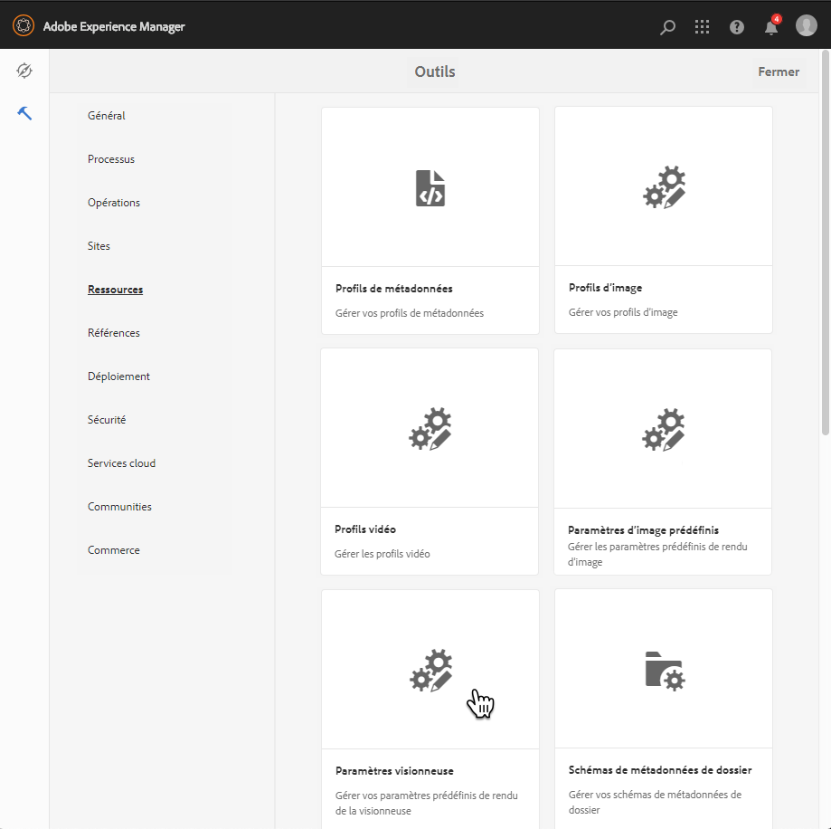
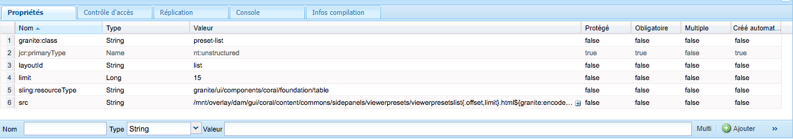
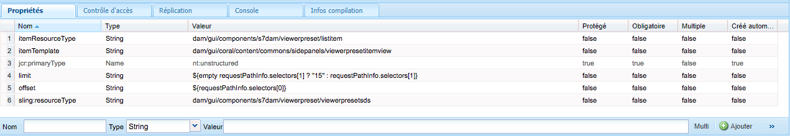
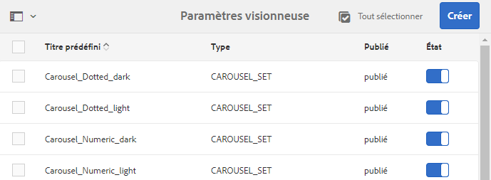

# Gestion des paramètres prédéfinis de visionneuse{#managing-viewer-presets}

Un paramètre prédéfini de visionneuse est un ensemble de paramètres qui détermine comment les utilisateurs voient les ressources multimédias enrichies sur leur écran d’ordinateur et leurs appareils mobiles. En tant qu’administrateur, vous pouvez créer des paramètres prédéfinis de visionneuse. Les paramètres sont disponibles pour un ensemble d’options de configuration de la visionneuse. Vous pouvez, par exemple, modifier la taille d’affichage et le comportement du zoom de la visionneuse.

Pour obtenir des instructions sur la création et la personnalisation de vos propres paramètres prédéfinis de visionneuse HTML5, consultez la *Documentation sur l’API du SDK de la visionneuse HTML5*. Le kit SDK est disponible sur le serveur de publication IS intégré au kit SDK lui-même. Chaque version de bibliothèque comporte sa propre documentation SDK.

Chemin : `<scene7_domain>/s7sdk/<library_version>/docs/jsdocs/index.html`.\
Par exemple, le SDK 3.10 : [https://s7d1.scene7.com/s7sdk/3.10/docs/jsdoc/index.html](https://s7d1.scene7.com/s7sdk/3.10/docs/jsdoc/index.html)

Consultez également le [Guide de référence des visionneuses Adobe Dynamic Media](https://experienceleague.adobe.com/docs/dynamic-media-developer-resources.html?lang=fr).

Cette section décrit comment créer, modifier et gérer les paramètres prédéfinis de visionneuse. Vous pouvez appliquer des paramètres prédéfinis de visionneuse à une image lorsque vous la prévisualisez. Voir [Application de paramètres prédéfinis de visionneuse](#applying-a-viewer-preset-to-an-asset).

>[!NOTE]
>
>La modification des *paramètres prédéfinis de visionneuse prêts à l’emploi* n’est pas un scénario pris en charge. Si vous tentez de modifier un paramètre de visionneuse prédéfini de base, vous serez invité à enregistrer ce paramètre de visionneuse prédéfini en utilisant un nouveau nom.

## Accessibilité clavier pour les visionneuses {#keyboard-accessibility-for-viewers}

Toutes les visionneuses prêtes à l’emploi prennent en charge l’accessibilité clavier.

Voir aussi [Accessibilité clavier et navigation](https://experienceleague.adobe.com/docs/dynamic-media-developer-resources/library/c-keyboard-accessibility.html?lang=fr).

## Gestion des paramètres prédéfinis de visionneuse {#managing-viewer-presets-1}

Vous pouvez ajouter, modifier, supprimer, publier, dépublier et prévisualiser des paramètres prédéfinis de visionneuse dans Adobe Experience Manager en appuyant sur **[!UICONTROL Outils]** (icône de marteau) > **[!UICONTROL Ressources]** > **[!UICONTROL Paramètres visionneuse]**.

>[!NOTE]
>
>Par défaut, le système affiche 15 paramètres prédéfinis de visionneuse lorsque vous sélectionnez Visionneuses dans l’affichage des détails d’une ressource. Vous pouvez augmenter cette limite. Voir [Augmentation du nombre de paramètres prédéfinis de visionneuse qui s’affichent](#increasing-the-number-of-viewer-presets-that-display).

### Prise en charge de la visionneuse pour les pages web en responsive design {#viewer-support-for-responsive-designed-web-pages}

Chaque page web a des besoins différents. Par exemple, il arrive que vous souhaitiez une page web qui fournit un lien pour ouvrir la visionneuse HTML5 dans une fenêtre de navigateur distincte. Dans d’autres cas, il peut être nécessaire d’incorporer la visionneuse HTML5 directement sur la page d’hébergement. Dans ce cas, la page web peut avoir une mise en page statique. Ou, il peut être &quot;réactif&quot; et s’afficher différemment sur différents appareils ou pour différentes tailles de fenêtre de navigateur. Pour répondre à ces besoins, toutes les visionneuses prédéfinies HTML5 fournies avec Dynamic Media sont compatibles à la fois avec les pages web statiques et réactives.

Consultez la section [Bibliothèque d’images réactive](https://experienceleague.adobe.com/docs/dynamic-media-developer-resources/image-serving-api/image-serving-api/responsive-static-image-library/c-about-responsive-static-image-library.html?lang=fr) pour plus d’informations sur l’intégration de visionneuses réactives à vos pages web.

>[!NOTE]
>
>Notez que vous devez publier toutes les visionneuses prêtes à l’emploi avant de les utiliser pour la première fois.
>Consultez la section [Publication de paramètres prédéfinis de visionneuse].(#publishing-viewer-presets)

### Compatibilité du système de paramètres prédéfinis de visionneuse  {#viewer-preset-system-compatibility}

Tous les paramètres prédéfinis de visionneuse prêts à l’emploi fournis avec Dynamic Media sont entièrement compatibles avec les systèmes suivants :

* Ordinateurs de bureau
* Apple iPhone
* Apple iPad
* Smartphone Android™
* Tablette Android™
* Pour la vidéo, la capacité de lecture MP4 supplémentaire est fournie pour [BlackBerry® ](https://developer.blackberry.com/devzone/develop/supported_media/bb_media_support_at_a_glance.html#kba1328730952678) et [Windows Phone](https://docs.microsoft.com/fr-fr/windows/uwp/audio-video-camera/supported-codecs).

### Types de médias riches pour les paramètres prédéfinis de visionneuse {#rich-media-types-for-viewer-presets}

Les administrateurs peuvent ajouter et personnaliser les types de médias riches suivants lors de la création de paramètres prédéfinis de visionneuse :

<table>
 <tbody>
  <tr>
   <td><strong>Ensemble de carrousel</strong>  </td>
   <td>
Les zones sensibles ou cliquables, ou les deux, sont ajoutées à une série de deux images ou plus. Vous pouvez faire défiler les images vers la gauche ou la droite, puis cliquer sur une zone réactive ou sur une image pour obtenir des informations supplémentaires ou réaliser un achat directement depuis une page de catégorie, d’accueil ou d’entrée d’un site web.
 </td>
  </tr>
  <tr>
   <td><strong>Dimensionnel</strong>  </td>
   <td>
Affiche des scènes 3D pour faire tourner ou recentrer votre caméra, effectuer des panoramiques ou zoomer.
 </td>
  </tr>
  <tr>
   <td><strong>Zoom sur la fenêtre déroulante</strong></td>
   <td>
Affiche une seconde image de la zone agrandie en regard de l’image d’origine. Il n’y a aucun contrôle à utiliser : les utilisateurs déplacent la sélection sur la zone qu’ils souhaitent afficher.
 
Lorsque vous déterminez l’utilisation complète de la bande passante pour cette visionneuse, considérez que l’image principale et l’image déroulante sont diffusées dans la visionneuse. La taille de l’image principale (largeur et hauteur de l’état) et le facteur de zoom déterminent la taille de l’image déroulante. Pour éviter que la taille du fichier de fenêtre déroulante ne devienne trop grande, équilibrez ces deux valeurs : si l’image principale est volumineuse, réduisez la valeur Facteur de zoom . (La largeur de la fenêtre déroulante et la hauteur de la fenêtre déroulante déterminent la taille de la fenêtre déroulante, mais pas la taille de l’image de la fenêtre déroulante diffusée dans la visionneuse.)
 
Par exemple, si la taille de l’image principale est de 350 x 350 pixels, avec un facteur de zoom de 3, l’image déroulante résultante est de 1 050 x 1 050 pixels. Si la taille de l’image principale est de 300 x 300 pixels, avec un facteur de zoom de 4, l’image déroulante fait 1 200 x 1 200 pixels. Selon le paramètre de qualité du JPEG (les paramètres recommandés sont compris entre 80 et 90), vous pouvez réduire considérablement la taille du fichier. Les facteurs de zoom recommandés sont compris entre 2,5 et 4, selon la taille de l’image principale.
 </td>
  </tr>
  <tr>
   <td><strong>Zoom intégré</strong></td>
   <td>Affiche une image de la zone agrandie dans la visionneuse d’origine. Il n’existe aucun contrôle à utiliser. En d’autres termes, les utilisateurs déplacent la sélection sur la zone qu’ils souhaitent afficher.</td>
  </tr>
  <tr>
   <td><strong>Visionneuse d’images</strong></td>
   <td>Dans la visionneuse d’images, les utilisateurs peuvent voir différentes vues ou variantes de couleur d’un élément en sélectionnant une image miniature. Cette visionneuse propose également des outils de zoom pour examiner les images de plus près.</td>
  </tr>
  <tr>
   <td><strong>Image interactive</strong></td>
   <td>Des zones réactives sont ajoutées aux parties d’une image. Vous pouvez alors les sélectionnez pour obtenir des détails supplémentaires ou pour réaliser directement un achat sur les pages d’entrée, d’accueil ou de catégorie d’un site web.</td>
  </tr>
  <tr>
   <td><strong>Vidéo interactive</strong></td>
   <td>Des miniatures sont ajoutées aux segments de montage d’une vidéo. Le client peut alors la sélectionner pour obtenir des détails supplémentaires ou pour réaliser directement un achat sur les pages d’entrée, d’accueil ou de catégorie d’un site web.</td>
  </tr>
  <tr>
   <td><strong>Supports variés</strong></td>
   <td>Affiche différents types de médias dans une seule visionneuse. Vous pouvez inclure des visionneuses à 360°, des visionneuses d’images, des images et des vidéos.</td>
  </tr>
  <tr>
   <td><strong>Image panoramique</strong></td>
   <td>
Les visionneuses Image panoramique et PanoramicVR affichent des images panoramiques sphériques pour plonger les utilisateurs dans une expérience de visionnage 360° d’une pièce, d’une propriété, d’un emplacement ou d’un paysage.
 
Pour qu’une image chargée soit un panorama sphérique, elle doit posséder l’une ou l’autre des propriétés suivantes, ou les deux :

    <ul>
     <li>Rapport d’aspect de 2:1.</li>
     <li>Avec les mots-clés <code>equirectangular</code>, ou <code>spherical</code> et <code>panorama</code>, ou <code>spherical </code>et <code>panoramic</code>. Voir <a href="/help/sites-authoring/tags.md">Utilisation des balises</a>.</li>
    </ul> 
Les critères de format et de mot-clé s’appliquent tous deux aux ressources panoramiques pour la page des détails de la ressource et le composant de gestion de contenu web "Média panoramique".
 
<strong>Important</strong>: Cette visionneuse n’est disponible que dans le mode Dynamic Media - Scene7 .
 </td>
  </tr>
  <tr>
   <td><strong>Recadrage intelligent de la vidéo</strong>  </td>
   <td>
Utilisez cette visionneuse pour détecter et recadrer automatiquement le point focal d’une vidéo.
 </td>
  </tr>
  <tr>
   <td><strong>Visionneuse à 360°</strong></td>
   <td>Propose plusieurs vues d’une image afin que les utilisateurs puissent faire pivoter l’objet pour l’examiner sous différents angles.</td>
  </tr>
  <tr>
   <td><strong>Vidéo 360</strong></td>
   <td>
Utilisez la visionneuse de vidéos 360/VR afin d’effectuer le rendu de la vidéo équirectangulaire pour une expérience de visionnage immersive d’une pièce, d’une propriété, d’un emplacement, d’un paysage ou d’une procédure médicale.
 
Lors de la lecture sur un écran plat, vous pouvez contrôle l’angle de vue ; la lecture sur les appareils mobiles applique généralement les commandes gyroscopiques intégrées.
 
La visionneuse inclut une prise en charge native de la diffusion de ressources vidéo 360. Par défaut, aucune configuration supplémentaire n’est nécessaire pour l’affichage ou la lecture. Vous diffusez une vidéo 360 avec des extensions vidéo standard telles que .mp4, .mkv et .mov. Le codec le plus courant est H.264.
 
<strong>Important</strong>: Cette visionneuse n’est disponible que dans le mode Dynamic Media - Scene7 .
 </td>
  </tr>
  <tr>
   <td><strong>Vidéo</strong></td>
   <td>
Lit la vidéo à l’aide de la diffusion en continu à débit progressif ou adaptatif. La diffusion en continu à débit adaptatif effectue automatiquement la détection de l’appareil et de la bande passante pour diffuser la vidéo de qualité appropriée dans le bon format.
 </td>
  </tr>
  <tr>
   <td><strong>Zoom vertical</strong></td>
   <td>
La visionneuse Zoom vertical vous permet d’optimiser l’expérience d’affichage des images d’un produit afin de donner à vos utilisateurs la meilleure représentation d’un produit. L’emplacement vertical des échantillons effectue les opérations suivantes :

    <ul>
     <li>Cela garantit que les nuanciers se trouvent en tête de page.  Avec les échantillons horizontaux, en fonction de la taille de l’écran de l’utilisateur, ils ne sont pas visibles tant que l’utilisateur n’a pas fait défiler la page vers le bas. En plaçant les échantillons verticalement dans la visionneuse, ils sont visibles quelle que soit la taille de l’écran de l’utilisateur.</li>
     <li>Maximise la taille de l’image principale.  Avec les échantillons horizontaux, il est nécessaire de réserver de l’espace sur la page pour s’assurer qu’ils sont visibles. Ce positionnement a réduit la taille de l’image principale. Toutefois, avec une disposition d’échantillon verticale, il n’est pas nécessaire d’allouer cet espace. Vous pouvez ainsi agrandir la taille de l’image principale.</li>
    </ul> </td>
  </tr>
  <tr>
   <td><strong>Zoom</strong></td>
   <td>Permet aux utilisateurs d’effectuer un zoom sur la zone en la sélectionnant. Les utilisateurs peuvent sélectionner les commandes pour effectuer un zoom avant ou arrière et rétablir l’image à sa taille par défaut.</td>
  </tr>
 </tbody>
</table>

### Liste des paramètres prédéfinis de visionneuse prêts à l’emploi {#list-of-out-of-the-box-viewer-presets}

Le tableau suivant identifie tous les paramètres prédéfinis de visionneuse prêts à l’emploi fournis avec Dynamic Media.

Consultez aussi les [Démonstrations en direct](https://landing.adobe.com/en/na/dynamic-media/ctir-2755/live-demos.html).

Pour en savoir plus sur les versions de navigateur web et de système d’exploitation compatibles avec les visionneuses, consultez les notes de mise à jour des visionneuses.

Voir « Notes de mise à jour sur les visionneuses » dans la table des matières du [Guide de référence des visionneuses](https://experienceleague.adobe.com/docs/dynamic-media-developer-resources.html?lang=fr).

>[!NOTE]
>
>Tous les paramètres prédéfinis de visionneuse prêts à l’emploi de Dynamic Media sont déjà activés mais vous devez les publier.
>Voir [Publication de paramètres de visionneuse prédéfinis](#publishing-viewer-presets).
>
>Tous les nouveaux paramètres prédéfinis de visionneuse que vous créez et ajoutez doivent être activés *et* publiés.
>Voir [Activation ou désactivation des paramètres prédéfinis de visionneuse](#activating-or-deactivating-viewer-presets) et [Publication de paramètres prédéfinis de visionneuse](#publishing-viewer-presets).

<table>
 <tbody>
  <tr>
   <td><strong>Titre du paramètre prédéfini de la visionneuse</strong></td>
   <td><strong>Type</strong></td>
   <td><strong>Nom de fichier CSS</strong>  </td>
  </tr>
  <tr>
   <td>Carousel_Dotted_dark</td>
   <td>Carousel_Set</td>
   <td><code>html5_carouselviewer_dotted_dark.css</code></td>
  </tr>
  <tr>
   <td>Carousel_Dotted_light</td>
   <td>Carousel_Set</td>
   <td><code>html5_carouselviewer_dotted_light.css</code></td>
  </tr>
  <tr>
   <td>Carousel_Numeric_dark</td>
   <td>Carousel_Set</td>
   <td><code>html5_carouselviewer_numeric_dark.css</code></td>
  </tr>
  <tr>
   <td>Carousel_Numeric_light</td>
   <td>Carousel_Set</td>
   <td><code>html5_carouselviewer_numeric_light.css</code></td>
  </tr>
  <tr>
   <td>Dimensionnel</td>
   <td>Dimensionnel</td>
   <td><code>html5_dimensionalviewer.css</code></td>
  </tr>
  <tr>
   <td>Fenêtre volante</td>
   <td>Flyout_Zoom</td>
   <td><code>html5_flyoutviewer.css</code></td>
  </tr>
  <tr>
   <td>ImageSet_dark</td>
   <td>Visionneuse d’images</td>
   <td><code>html5_zoomviewer_dark.css</code></td>
  </tr>
  <tr>
   <td>ImageSet_light</td>
   <td>Visionneuse d’images</td>
   <td><code>html5_zoomviewer_light.css</code></td>
  </tr>
  <tr>
   <td>InlineMixedMedia_dark</td>
   <td>Mixed_Media</td>
   <td><code>html5_inlinemixedmediaviewer_dark.css</code></td>
  </tr>
  <tr>
   <td>InlineMixedMedia_light</td>
   <td>Mixed_Media</td>
   <td><code>html5_inlinemixedmediaviewer_light.css</code></td>
  </tr>
  <tr>
   <td>InlineZoom</td>
   <td>Flyout_Zoom</td>
   <td><code>html5_inlinezoomviewer.css</code></td>
  </tr>
  <tr>
   <td>MixedMedia_dark</td>
   <td>Mixed_Media</td>
   <td><code>html5_mixedmediaviewer_dark.css</code></td>
  </tr>
  <tr>
   <td>MixedMedia_light</td>
   <td>Mixed_Media</td>
   <td><code>html5_mixedmediaviewer_light.css</code></td>
  </tr>
  <tr>
   <td>PanoramicImage</td>
   <td>Panoramic_Image</td>
   <td><code>html5_panoramicimage.css</code></td>
  </tr>
  <tr>
   <td>PanoramicImageVR</td>
   <td>Panoramic_Image</td>
   <td><code>html5_panoramicimage.css</code></td>
  </tr>
  <tr>
   <td>Shoppable_Banner</td>
   <td>Interactive_Image</td>
   <td><code>html5_interactiveimage.css</code></td>
  </tr>
  <tr>
   <td>Shoppable_Video_dark</td>
   <td>Interactive_Video</td>
   <td><code>html5_interactivevideoviewer_dark.css</code></td>
  </tr>
  <tr>
   <td>Shoppable_Video_light</td>
   <td>Interactive_Video</td>
   <td><code>html5_interactivevideovewer_light.css</code></td>
  </tr>
  <tr>
   <td>SmartCropVideo</td>
   <td>Smart_Crop_Video</td>
   <td><code>html5_smartcropvideoviewer.css</code></td>
  </tr>
  <tr>
   <td>SmartCropVideo_social</td>
   <td>Smart_Crop_Video</td>
   <td><code>html5_smartcropvideoviewersocial.css</code></td>
  </tr>
  <tr>
   <td>SpinSet_dark</td>
   <td>Spin_Set</td>
   <td><code>html5_spinviewer_dark.css</code></td>
  </tr>
  <tr>
   <td>SpinSet_light</td>
   <td>Spin_Set</td>
   <td><code>html5_spinviewer_light.css</code></td>
  </tr>
  <tr>
   <td>
Vidéo
 
(Inclut la prise en charge du sous-titrage)
 </td>
   <td>Vidéo</td>
   <td><code>html5_videoviewer.css</code></td>
  </tr>
  <tr>
   <td>
Video360_social
 
(Inclut les commandes de lecture vidéo de base, le rendu vidéo est effectué en mode stéréo, la commande de point de vue manuelle est désactivée mais la commande gyroscopique est activé, et il n’y a pas de fonctions de médias sociaux)
 </td>
   <td>Video_360</td>
   <td><code>html5_video360viewersocial.css</code></td>
  </tr>
  <tr>
   <td>
Video360VR
 
(Destiné aux utilisateurs finaux qui utilisent des lunettes de réalité virtuelle. Inclut les commandes de lecture vidéo de base et les fonctions de médias sociaux)
 </td>
   <td>Video_360</td>
   <td><code>html5_video360viewer.css</code></td>
  </tr>
  <tr>
   <td>
Video_social
 
(inclut la prise en charge du sous-titrage et des médias sociaux)
 </td>
   <td>Vidéo</td>
   <td><code>html5_videoviewersocial.css</code></td>
  </tr>
  <tr>
   <td>Zoom_dark  </td>
   <td>Zoom  </td>
   <td><code>html5_basiczoomviewer_dark.css</code></td>
  </tr>
  <tr>
   <td>Zoom_light  </td>
   <td>Zoom</td>
   <td><code>html5_basiczoomviewer_light.css</code></td>
  </tr>
  <tr>
   <td>ZoomVertical_dark  </td>
   <td>Zoom_vertical</td>
   <td><code>html5_zoomverticalviewer_dark.css</code></td>
  </tr>
  <tr>
   <td>ZoomVertical_light</td>
   <td>Zoom_vertical</td>
   <td><code>html5_zoomverticalviewer_light.css</code></td>
  </tr>
 </tbody>
</table>

### Tableau des gestes pris en charge par les visionneuses mobiles {#supported-mobile-viewers-gestures-matrix}

Le tableau suivant répertorie les gestes pris en charge dans les visionneuses mobiles sur les appareils iOS, Android™ 2.x et Android™ 3.x.

<table>
 <tbody>
  <tr>
   <td><strong>Gestes</strong></td>
   <td><strong>Zoom sur la fenêtre déroulante</strong></td>
   <td><strong>Zoom</strong></td>
   <td><strong>Rotation</strong></td>
  </tr>
  <tr>
   <td>
<strong>Glissement de doigt</strong>
 </td>
   <td>
Panoramique
 </td>
   <td>
Panoramique
 </td>
   <td>
Panoramique
 </td>
  </tr>
  <tr>
   <td>
<strong>Sélectionner</strong>
 </td>
   <td>
Affiche la fenêtre déroulante
 </td>
   <td>
Affiche ou masque l’interface utilisateur
 </td>
   <td>
Affiche ou masque l’interface utilisateur
 </td>
  </tr>
  <tr>
   <td>
<strong>Double appui</strong>
 </td>
   <td>
Ne s’applique pas
 </td>
   <td>
Zoom avant ou réinitialisation
 </td>
   <td>
Zoom avant ou réinitialisation
 </td>
  </tr>
  <tr>
   <td>
<strong>Écartement des doigts</strong>
 </td>
   <td>
Ne s’applique pas
 </td>
   <td>
Zoom avant (iOS et Android™ 3x uniquement)
 </td>
   <td>
Zoom avant (iOS et Android™ 3x uniquement)
 </td>
  </tr>
  <tr>
   <td>
<strong>Pincement des doigts</strong>
 </td>
   <td>
Ne s’applique pas
 </td>
   <td>
Zoom arrière (iOS et Android™ 3x uniquement)
 </td>
   <td>
Zoom arrière (iOS et Android™ 3x uniquement)
 </td>
  </tr>
  <tr>
   <td>
<strong>Balayage</strong>
 </td>
   <td>
Fait défiler la barre d’échantillons
 </td>
   <td>
Fait défiler les images
 </td>
   <td>
Rotation
 </td>
  </tr>
  <tr>
   <td>
<strong>Glissement rapide</strong>
 </td>
   <td>
Fait défiler la barre d’échantillons
 </td>
   <td>
Fait défiler les images
 </td>
   <td>
Rotation
 </td>
  </tr>
 </tbody>
</table>

## Augmentation du nombre de paramètres prédéfinis de visionneuse qui s’affichent {#increasing-the-number-of-viewer-presets-that-display}

Experience Manager affiche une grande variété de paramètres prédéfinis de visionneuse lors de l’affichage de ressources à partir de l’**[!UICONTROL Affichage des détails]** > **[!UICONTROL Visionneuses]**. Vous pouvez augmenter ou diminuer le nombre de visionneuses qui s’affichent.

**Pour augmenter le nombre de paramètres prédéfinis de visionneuse qui s’affichent, procédez comme suit :**

1. Accédez à CRXDE Lite ([https://localhost:4502/crx/de](https://localhost:4502/crx/de)).
1. Accédez au nœud de liste des paramètres prédéfinis de visionneuse à l’emplacement suivant :

   `/libs/dam/gui/coral/content/commons/sidepanels/viewerpresets/viewerpresetslist`

   

1. Dans la propriété **[!UICONTROL limit]**, définissez la valeur de votre choix dans la colonne **[!UICONTROL Valeur]** ; par défaut, elle est définie sur 15.
1. Accédez à la source de données de paramètres prédéfinis de visionneuse à l’adresse `/libs/dam/gui/coral/content/commons/sidepanels/viewerpresets/viewerpresetslist/datasource`

   

1. Dans la propriété limit, saisissez la valeur de votre choix ; par exemple, `{empty requestPathInfo.selectors[1] ? "20" : requestPathInfo.selectors[1]}`
1. Sélectionnez **[!UICONTROL Enregistrer tout]**.

## Création d’un paramètre prédéfini de la visionneuse {#creating-a-new-viewer-preset}

La création de paramètres prédéfinis de visionneuse vous permet d’appliquer divers paramètres afin d’afficher et d’interagir avec les ressources. Toutefois, vous n’avez pas besoin de créer de paramètres prédéfinis de visionneuse. Si vous préférez, vous pouvez utiliser les paramètres prédéfinis de visionneuse par défaut fournis avec AEM Assets.

Si vous choisissez de créer un paramètre prédéfini de visionneuse, après l’avoir enregistré, le statut de la visionneuse est automatiquement activé (défini sur **[!UICONTROL Activé]**) dans la page Paramètres prédéfinis de la visionneuse. Ce statut indique qu’elle est visible dans les composants Dynamic Media et Interactive Media, ou dès que vous prévisualisez une image ou une vidéo.

Certains paramètres prédéfinis de visionneuse bénéficient de paramètres exclusifs qui peuvent affecter l’utilisation et le comportement global de la visionneuse. Selon le paramètre prédéfini de visionneuse que vous créez, il est souhaitable d’être conscient de ces particularités.

Voir [Remarques spéciales sur la création d’un paramètre prédéfini de visionneuse interactive](#special-considerations-for-creating-an-interactive-viewer-preset).

Voir [Remarques spéciales sur la création d’un paramètre prédéfini de visionneuse pour une bannière de carrousel](#special-considerations-for-creating-a-carousel-banner-viewer-preset).

**Pour créer un paramètre prédéfini de visionneuse, procédez comme suit :**

1. Dans le coin supérieur gauche d’Experience Manager, sélectionnez le logo Experience Manager, puis, dans le rail de gauche, sélectionnez **[!UICONTROL Outils]** (icône de marteau) > **[!UICONTROL Ressources] > [!UICONTROL Paramètres prédéfinis de la visionneuse]**.

   

1. Sur la page Paramètres prédéfinis de la visionneuse, dans la barre d’outils, sélectionnez **[!UICONTROL Créer]**.
1. Dans la boîte de dialogue **[!UICONTROL Nouveau paramètre prédéfini de la visionneuse]**, dans le champ **[!UICONTROL Nom du paramètre prédéfini]**, saisissez le nom du nouveau paramètre prédéfini. Choisissez un nom avec soin ; il n’est plus modifiable une fois que vous sélectionnez **[!UICONTROL Créer]**.

   Lorsque vous enregistrerez le paramètre prédéfini lors des étapes suivantes, le nom s’affichera sur la page Paramètres visionneuse sous l’en-tête de colonne Titre prédéfini.

1. Dans le menu déroulant Type de contenu multimédia enrichi, sélectionnez le type de paramètre prédéfini de visionneuse que vous souhaitez créer puis, dans le coin supérieur droit de la page, sélectionnez **[!UICONTROL Créer]**.

   Voir [Types de médias riches pour les paramètres prédéfinis de visionneuse](#rich-media-types-for-viewer-presets).

1. Sur la page Éditeur de paramètres prédéfinis de la visionneuse, sélectionnez l’onglet **[!UICONTROL Apparence]**.
1. Utilisez l’une des méthodes suivantes :

   * Dans le menu déroulant **[!UICONTROL Type sélectionné]**, sélectionnez un composant dont vous souhaitez personnaliser la conception visuelle. Vous pouvez également sélectionner n’importe quel élément visuel de la visionneuse afin de le sélectionner pour le configurer.

      L’éditeur visuel vous permet de voir l’effet d’une propriété spécifique sur un style. Définissez ou modifiez une propriété pour immédiatement en visualiser l’effet sur la visionneuse en utilisant l’échantillon à la gauche de l’éditeur.

      Les propriétés de style CSS de chaque type de paramètre prédéfini de visionneuse sont décrites dans la rubrique d’aide Personnalisation de la visionneuse *`<viewer name>`* dans le [Guide de référence des visionneuses](https://experienceleague.adobe.com/docs/dynamic-media-developer-resources.html?lang=fr). Par exemple, si vous créez un paramètre prédéfini de visionneuse de type `Mixed_Media`, consultez [Personnalisation des visionneuses de médias mixtes](https://experienceleague.adobe.com/docs/dynamic-media-developer-resources/library/viewers-aem-assets-dmc/mixed-media/customing-mixed-media/c-html5-mixedmedia-viewer-customizingviewer.html?lang=fr) pour une liste et une description de chaque propriété.

   * Si vous avez défini des paramètres de style dans un fichier CSS distinct, vous pouvez charger le fichier CSS dans AEM Assets. Sélectionnez **[!UICONTROL Importer CSS]** en dessous du menu déroulant **[!UICONTROL Type sélectionné]** (si nécessaire, faites défiler la page vers le haut pour le voir) afin de trouver le fichier CSS chargé et de l’associer aux paramètres prédéfinis de visionneuse.

      Lorsque vous importez un fichier CSS, l’éditeur visuel vérifie que le CSS utilise des marqueurs de visionneuse adaptés. Si vous créez par exemple une visionneuse de zoom, toutes les règles CSS que vous importez doivent être définies à l’aide de son nom de classe de visionneuse `.s7mixedmediaviewer` défini sur un élément de visionneuse parent.

      Vous pouvez importer des CSS arbitraires créés manuellement, à condition qu’ils définissent correctement les marqueurs CSS d’une visionneuse donnée. (Les marqueurs CSS sont décrits dans la rubrique d’aide Personnalisation de la visionneuse *&lt;nom de visionneuse>* du [Guide de référence des visionneuses](https://experienceleague.adobe.com/docs/dynamic-media-developer-resources.html?lang=fr). Par exemple, pour en savoir plus sur les marqueurs CSS de la visionneuse de zoom, reportez-vous à [Personnalisation de la visionneuse de zoom](https://experienceleague.adobe.com/docs/dynamic-media-developer-resources/library/viewers-aem-assets-dmc/zoom/customizing-zoom/c-html5-20-zoom-viewer-customizingviewer.html?lang=fr).) Il se peut toutefois que l’éditeur visuel ne comprenne pas certaines valeurs CSS. Dans de tels cas, l’éditeur visuel tente d’ignorer les erreurs de sorte que le code CSS reste fonctionnel.
   >[!NOTE]
   >
   >Si vous préférez modifier le CSS directement dans sa forme brute, sélectionnez **[!UICONTROL Afficher/masquer CSS]** sous le menu déroulant Type sélectionné (si nécessaire, faites défiler l’éditeur visuel pour le voir).
   >Comme pour l’éditeur visuel, lorsque vous modifiez une propriété directement dans le CSS, vous pouvez voir immédiatement l’effet du changement sur l’échantillon de visionneuse. Cette même propriété est automatiquement mise à jour en même temps dans l’éditeur visuel. Ainsi, vous pouvez utiliser l’éditeur CSS brut ou l’éditeur visuel, ou les deux de manière interchangeable.

   >[!NOTE]
   >
   >Pour une illustration de bouton, sélectionnez l’image x2 puis chargez l’illustration haute résolution. Lorsque vous travaillez avec des images interactives et des bannières favorisant les achats, vous pouvez également choisir parmi divers boutons de zone réactive prêts à l’emploi.

1. (Facultatif) Près de la partie supérieure de la page Modification des paramètres de visionneuse prédéfinis, sélectionnez **[!UICONTROL Ordinateur de bureau]**, **[!UICONTROL Tablette]** ou **[!UICONTROL Téléphone]** pour définir de manière unique les styles visuels pour différents types d’appareils et d’écrans.
1. Sur la page Éditeur de paramètres prédéfinis de la visionneuse, sélectionnez l’onglet **[!UICONTROL Comportement]**. Vous pouvez également sélectionner n’importe quel élément visuel de la visionneuse afin de le sélectionner pour le configurer.
Par exemple, pour la variable *VideoPlayer* type, sous **[!UICONTROL Modificateurs]** > **[!UICONTROL Lecture]**, vous pouvez effectuer une sélection parmi trois options de diffusion en continu à débit adaptatif :

   * **[!UICONTROL dash]** - Flux vidéo en tant que tiret uniquement. Toutefois, sur les périphériques Safari/iOS, vous devez sélectionner **[!UICONTROL hls]** comme type.
   * **[!UICONTROL hls]** - Diffusion vidéo en continu sous la forme de fichiers hls uniquement.
   * **[!UICONTROL auto]** - Bonne pratique. La création des flux DASH et HLS est optimisée pour le stockage. Par conséquent, Adobe recommande de toujours sélectionner **[!UICONTROL auto]** comme type de lecture. Les vidéos sont diffusées en continu sous la forme d’un tiret, d’un cadran ou d’une vidéo progressive, comme dans l’ordre de lecture suivant :
      * Si le navigateur prend en charge DASH, la diffusion en continu DASH est utilisée, tout d’abord.
      * Si le navigateur ne prend pas en charge DASH, la diffusion HLS en continu est utilisée, ensuite.
      * Si le navigateur ne prend pas en charge DASH ou HLS, la lecture progressive est utilisée, enfin.

   >[!NOTE]
   >
   >Pour afficher et utiliser la variable **[!UICONTROL dash]** , elle doit d’abord être activée par le support technique d’Adobe sur votre compte. Voir [Activation de DASH sur votre compte](/help/assets/video.md#enable-dash).

1. Dans le menu déroulant **[!UICONTROL Type sélectionné]**, sélectionnez un composant dont vous souhaitez modifier le comportement.

   De nombreux composants de l’éditeur visuel sont associés à une description détaillée. Ces descriptions s’affichent dans des zones bleues lorsque vous développez un composant pour afficher ses paramètres associés.

   Certains types de visionneuses comportent des composants qui vous permettent de spécifier des commandes de diffusion d’images dans un champ de texte **[!UICONTROL Commande IS]**. Pour obtenir la liste des commandes que vous pouvez utiliser, voir le [Guide de référence de l’API IS](https://experienceleague.adobe.com/docs/dynamic-media-developer-resources/image-serving-api/image-serving-api/c-is-home.html?lang=fr).

   >[!NOTE]
   >
   >**Si vous utilisez un périphérique tactile, tel qu’un téléphone ou une tablette…**
   >
   >
   >Après avoir saisi une valeur dans le champ de texte, sélectionnez à un autre endroit de l’interface utilisateur pour envoyer la modification et fermer le clavier virtuel. Si vous sélectionnez Entrée, aucune action ne se produit.

1. Dans le coin supérieur droit de la page, sélectionnez **[!UICONTROL Enregistrer]**.
1. Publiez votre nouveau paramètre prédéfini de visionneuse afin de pouvoir l’utiliser sur votre site web.

   Consultez la section [Publication de paramètres prédéfinis de visionneuse](#publishing-viewer-presets).

   >[!IMPORTANT]
   >
   >Pour les anciennes vidéos qui utilisent un profil de diffusion en continu à débit adaptatif, l’URL continue de fonctionner normalement (avec diffusion HLS en continu) jusqu’à ce que vous [Retraiter les ressources vidéo](/help/assets/processing-profiles.md#reprocessing-assets). Après le retraitement, la même URL continue de fonctionner, mais désormais avec *both* Diffusion en continu DASH et HLS activée.

### Remarques spéciales sur la création d’un paramètre de visionneuse interactive prédéfini {#special-considerations-for-creating-an-interactive-viewer-preset}

**À propos des modes d’affichage des miniatures dans le panneau**

Lorsque vous créez ou modifiez un paramètre de visionneuse prédéfini pour vidéo interactive, vous pouvez choisir le paramètre de mode d’affichage à utiliser lorsque vous sélectionnez `InteractiveSwatches` dans le menu déroulant **[!UICONTROL Composant sélectionné]** sous l’onglet **[!UICONTROL Comportement]**. Le mode d’affichage que vous choisissez affecte la façon dont les miniatures s’affichent pendant la lecture de la vidéo. Vous pouvez sélectionner le mode d’affichage `segment` (par défaut) ou le mode d’affichage `continuous`.

<table>
 <tbody>
  <tr>
   <td><strong>Mode d’affichage</strong></td>
   <td><strong>Description</strong></td>
  </tr>
  <tr>
   <td>Segment</td>
   <td>
<code>Segment </code>est le mode d’affichage par défaut des paramètres prédéfinis de la visionneuse de vidéos interactives prêts à l’emploi <code>Shoppable_Video_light</code> et <code>Shoppable_Video_dark</code>, ainsi que tout paramètre prédéfini de la visionneuse de vidéos interactives que vous créez vous-même.
 
Dans ce mode, supposons qu’un segment de vidéo comporte moins de miniatures que le nombre de points visibles dans le panneau d’affichage. De plus, les miniatures des sous-segments suivants ou précédents ne sont <i>pas</i> extraites pour remplir les zones vides du panneau. En d’autres termes, cela préserve l’affichage des échantillons affectés à ce segment vidéo spécifique.
 </td>
  </tr>
  <tr>
   <td>Continu</td>
   <td>
En mode d’affichage <code>continuous </code>, si le nombre de miniatures d’un segment est inférieur au nombre visible dans le panneau, la visionneuse inclut automatiquement l’affichage de miniatures du segment suivant. Autrement, la visionneuse inclut automatiquement l’affichage des miniatures du segment précédent, dans les cas où la dernière miniature est affichée.
 
La <a href="/help/assets/interactive-videos.md">vidéo de cette rubrique</a> est un exemple du mode d’affichage <code>continuous </code>.
 </td>
  </tr>
 </tbody>
</table>

**À propos du comportement de défilement automatique dans la visionneuse de vidéo interactive**

Le comportement de défilement automatique des miniatures dans la visionneuse de vidéo interactive fonctionne indépendamment du mode d’affichage que vous avez choisi.

Lorsque vous créez ou modifiez un paramètre prédéfini de visionneuse de vidéos interactive, vous accédez au défilement automatique à partir de l’onglet Comportement. Dans l’onglet Comportement, dans le menu déroulant **[!UICONTROL Composants sélectionnés]**, sélectionnez **[!UICONTROL Nuances interactives]**. La case à cocher Défilement automatique se trouve sous le champ de texte Commande IS.

Si vous désactivez **[!UICONTROL Défilement automatique]** (en désélectionnant la case) dans le paramètre prédéfini de visionneuse, le panneau n’affiche que la première miniature lorsque l’utilisateur regarde la vidéo, et ce pour toute sa durée. Toutefois, l’utilisateur peut faire défiler manuellement les miniatures à l’aide des flèches haut et bas, le cas échéant.

Lorsque vous activez (sélectionnez) **[!UICONTROL Défilement automatique]** dans le paramètre prédéfini de visionneuse, les miniatures affectées à un segment vidéo défilent au début du segment. Il existe toutefois des cas où certaines miniatures d’un segment s’affichent deux fois plus longtemps que d’autres avant ou après. Ce comportement se produit car le nombre de miniatures dans un segment est supérieur au nombre visible dans le panneau et ne sont pas divisibles uniformément.

Prenons l’exemple d’un segment vidéo de 30 secondes. Et il y a un total de neuf miniatures à afficher sur les 30 secondes. Le navigateur est dimensionné de telle sorte qu’il existe quatre positions de miniature visibles dans le panneau d’affichage. Le segment vidéo de 30 secondes est divisé en trois sous-segments. Le tableau ci-dessous contient la répartition des miniatures affichées pour un sous-segment de durée donné :

| **Sous-segment vidéo** | **Temps du sous-segment en secondes** | **Miniatures visibles dans le panneau** |
|---|---|---|
| 1 | 0 à 10 | 1, 2, 3, 4 |
| 2 | 10 à 20 | 4, 5, 6, 7 |
| 3 | 20 à 30 | 6, 7, 8, 9 |

Le sous-segment vidéo 3 ne s’étend pas au-delà des miniatures qui lui sont affectées. Notez également que les miniatures 4, 6 et 7 sont visibles dans le panneau deux fois plus longtemps que les autres miniatures.

La logique utilisée par la visionneuse pour le nombre de miniatures affichées dans le panneau en fonction du nombre de positions disponibles est la suivante :

* Nombre de sous-segments = arrondi au sous-segment supérieur (nombre de miniatures/nombre d’emplacements visibles dans le panneau des miniatures, en fonction de la taille de la fenêtre du navigateur).
En reprenant l’exemple du tableau ci-dessus, 9 miniatures/4 emplacements = 2,25 ; la logique de la visionneuse arrondit donc à trois sous-segments.

* Nombre de miniatures = arrondi à la miniature supérieure (nombre de miniatures/nombre de sous-segments vidéo).
En reprenant l’exemple du tableau ci-dessus, 9 miniatures/3 sous-segments vidéo = 3 miniatures.

* Durée du sous-segment = durée totale de la vidéo / nombre de sous-segments vidéo.
En reprenant l’exemple du tableau ci-dessus, 30 secondes/3 sous-segments vidéo = 10 secondes d’affichage pour chaque sous-segment vidéo.

#### Remarques spéciales sur la création d’un paramètre prédéfini de visionneuse de bannière de carrousel {#special-considerations-for-creating-a-carousel-banner-viewer-preset}

Lors de la création de paramètres prédéfinis de visionneuse de bannière de carrousel, le style des zones réactives est modifiable comme suit :

|  | **Description** | **Actions** |
|---|---|---|
| **[!UICONTROL Icône Zone réactive]** | Modification de l’icône utilisée pour la zone réactive | Pour modifier l’image de l’icône de zone réactive, dans l’onglet **[!UICONTROL Apparence]**, dans **[!UICONTROL Composant sélectionné]**, sélectionnez **[!UICONTROL ImageMapEffect]**. Sous **[!UICONTROL Icône]**, sélectionnez **[!UICONTROL Arrière-plan]** et naviguez dans le champ **[!UICONTROL Image]** jusqu’à trouver l’image souhaitée. |

## Activation ou désactivation des paramètres prédéfinis de visionneuse {#activating-or-deactivating-viewer-presets}

Les paramètres de visionneuse prédéfinis qui sont disponibles dans l’interface utilisateur dépendent des paramètres activés dans le mode création. Par défaut, un paramètre prédéfini de visionneuse est &quot;Activé&quot; après sa création. Si vous désactivez le paramètre prédéfini, vous ne pourrez pas le voir en mode création. Si le paramètre prédéfini est publié, il l’est toujours, qu’il soit activé ou désactivé. Vous souhaiterez peut-être désactiver certains paramètres prédéfinis si la liste devient difficile à gérer ou si vous souhaitez empêcher l’utilisation d’un paramètre de visionneuse prédéfini.

**Pour activer ou désactiver les paramètres prédéfinis de visionneuse, procédez comme suit :**

1. Dans le coin supérieur gauche d’Experience Manager, sélectionnez le logo Experience Manager, puis, dans le rail de gauche, sélectionnez **[!UICONTROL Outils]** (icône Marteau) > **[!UICONTROL Ressources]** > **[!UICONTROL Paramètres prédéfinis de la visionneuse]**.
1. Dans la page Paramètre prédéfini de la visionneuse, sous l’en-tête de colonne **[!UICONTROL État]**, sélectionnez le curseur pour activer ou désactiver un paramètre de visionneuse prédéfini.

   Le curseur des paramètres de visionneuse prédéfinis activés se situe à droite, dans une boîte bleue ; le curseur des paramètres de visionneuse prédéfinis désactivés se situe à gauche, dans une boîte gris clair.

## Publication de paramètres prédéfinis de visionneuse {#publishing-viewer-presets}

Lorsqu’un paramètre prédéfini de visionneuse est activé, cela signifie qu’il est visible dans les composants Dynamic Media et Interactive Media, et ce, dès que vous affichez une ressource.

Cependant, pour *diffuser* une ressource avec un paramètre de visionneuse prédéfini, ce dernier doit également être publié. Tous les paramètres de visionneuse prédéfinis doivent être activés *et* publiés pour obtenir une URL ou un code intégré pour une ressource. Vous devez activer et publier tous les paramètres prédéfinis de visionneuse prêts à l’emploi fournis avec Dynamic Media. Les paramètres prédéfinis personnalisés de la visionneuse que vous créez et ajoutez sont activés automatiquement, mais ils doivent également être publiés.

Voir [Activation ou désactivation des paramètres prédéfinis de visionneuse](#activating-or-deactivating-viewer-presets).

Voir aussi [Aperçu des ressources](/help/assets/previewing-assets.md).

**Pour publier les paramètres prédéfinis de visionneuse :**

1. Dans le coin supérieur gauche d’Experience Manager, sélectionnez le logo Experience Manager, puis, dans le rail de gauche, sélectionnez **[!UICONTROL Outils]** (icône Marteau) > **[!UICONTROL Ressources]** > **[!UICONTROL Paramètres prédéfinis de la visionneuse]**.
1. Sélectionnez un ou plusieurs paramètres de visionneuse prédéfinis que vous souhaitez publier.
1. Sélectionnez l’icône **[!UICONTROL Publier]** de la barre d’outils.

## Tri des paramètres prédéfinis de visionneuse {#sorting-viewer-presets}

1. Dans le coin supérieur gauche d’Experience Manager, sélectionnez le logo Experience Manager, puis, dans le rail de gauche, sélectionnez **[!UICONTROL Outils]** (icône Marteau) > **[!UICONTROL Ressources]** > **[!UICONTROL Paramètres prédéfinis de la visionneuse]**.
1. Sélectionnez **[!UICONTROL Titre prédéfini]**, **[!UICONTROL Type]**, **[!UICONTROL Publié]** ou **[!UICONTROL État]** afin de trier en fonction de cette colonne. Sélectionnez par exemple **[!UICONTROL Type]** pour trier les types de paramètres prédéfinis de visionneuse dans l’ordre alphabétique standard ou inversé.

## Modification de paramètres prédéfinis de visionneuse {#editing-viewer-presets}

La modification des *paramètres prédéfinis de visionneuse prêts à l’emploi* n’est pas un scénario pris en charge. Si vous modifiez un paramètre de visionneuse prédéfini prêt à l’emploi, vous serez invité à l’enregistrer en utilisant un nouveau nom.

**Pour modifier les paramètres de visionneuse prédéfinis :**

1. Dans le coin supérieur gauche d’Experience Manager, sélectionnez le logo Experience Manager, puis, dans le rail de gauche, sélectionnez **[!UICONTROL Outils]** (icône Marteau) > **[!UICONTROL Ressource]** > **[!UICONTROL Paramètres prédéfinis de la visionneuse]**.
1. Sélectionnez un paramètre prédéfini en cochant la case à gauche du titre du paramètre prédéfini de la visionneuse.
1. Dans la barre d’outils, sélectionnez **[!UICONTROL Modifier]**.
1. Sur la page **[!UICONTROL Éditeur de paramètres prédéfinis de la visionneuse]**, apportez les modifications souhaitées au paramètre prédéfini de la visionneuse à l’aide des options disponibles dans les onglets **[!UICONTROL Apparence]** et **[!UICONTROL Comportement]**.

   Dans l’onglet **[!UICONTROL Apparence]**, près du coin supérieur gauche de la page Éditeur de paramètres prédéfinis de la visionneuse, sélectionnez **[!UICONTROL Bureau]**, **[!UICONTROL Tablette]** ou **[!UICONTROL Téléphone]** pour modifier le mode de présentation de la ressource.

1. Près du coin supérieur droit de la page, effectuez l’une des opérations suivantes :

   * Sélectionnez **[!UICONTROL Enregistrer]** pour enregistrer vos modifications et revenir à la page du paramètre prédéfini de visionneuse.
   * Sélectionnez **[!UICONTROL Annuler]** pour annuler les modifications effectuées et revenir à la page du paramètre prédéfini de visionneuse.

## Suppression de paramètres de visionneuse prédéfinis personnalisés {#deleting-custom-viewer-presets}

Vous pouvez supprimer les paramètres prédéfinis de visionneuse que vous avez créés et ajoutés dans Dynamic Media.

**Pour supprimer des paramètres de visionneuse prédéfinis personnalisés, procédez comme suit :**

1. Dans le coin supérieur gauche d’Experience Manager, sélectionnez le logo Experience Manager, puis, dans le rail de gauche, sélectionnez **[!UICONTROL Outils]** (icône de marteau) > **[!UICONTROL Ressources]** > **[!UICONTROL Paramètres prédéfinis de la visionneuse]**.
1. Sur la page Paramètres prédéfinis de la visionneuse, cochez un titre de paramètre prédéfini, puis sélectionnez l’icône de la **[!UICONTROL corbeille]**.
1. Sélectionnez **[!UICONTROL Supprimer]**.

## Application d’un paramètre de visionneuse prédéfini à une ressource {#applying-a-viewer-preset-to-an-asset}

Si vous avez déjà publié la ressource et la visionneuse sélectionnée, les boutons **[!UICONTROL URL]** et **[!UICONTROL Incorporer]** s’affichent une fois que vous avez sélectionné un paramètre prédéfini de visionneuse.

**Pour appliquer un paramètre prédéfini de visionneuse à une ressource, procédez comme suit :**

1. Ouvrez la ressource, puis, dans le coin supérieur gauche de la page, sélectionnez le menu déroulant et sélectionnez **[!UICONTROL Visionneuses]**.

   >[!NOTE]
   >
   >Si vous avez déjà publié la ressource et la visionneuse sélectionnée, l’**[!UICONTROL URL]** et les boutons d’**[!UICONTROL intégration]** s’affichent une fois que vous avez sélectionné un paramètre prédéfini de visionneuse.

1. Sélectionnez un paramètre prédéfini de visionneuse dans le volet de gauche pour l’appliquer à la ressource.

   Vous pouvez [copier l’URL pour la partager](/help/assets/linking-urls-to-yourwebapplication.md) avec d’autres personnes.

## Diffusion de ressources avec des paramètres prédéfinis de visionneuse {#delivering-assets-with-viewer-presets}

Pour obtenir l’URL d’un paramètre prédéfini de visionneuse, voir [Liaison d’URL à une application web](/help/assets/linking-urls-to-yourwebapplication.md). Consultez également la section [Incorporation de la visionneuse de vidéos dans une page web](/help/assets/embed-code.md).

Si vous utilisez Experience Manager pour la gestion de contenu web, vous pouvez ajouter des ressources en utilisant des paramètres de visionneuse prédéfinis directement sur la page. Reportez-vous à [Ajout de ressources Dynamic Media aux pages](/help/assets/adding-dynamic-media-assets-to-pages.md).
