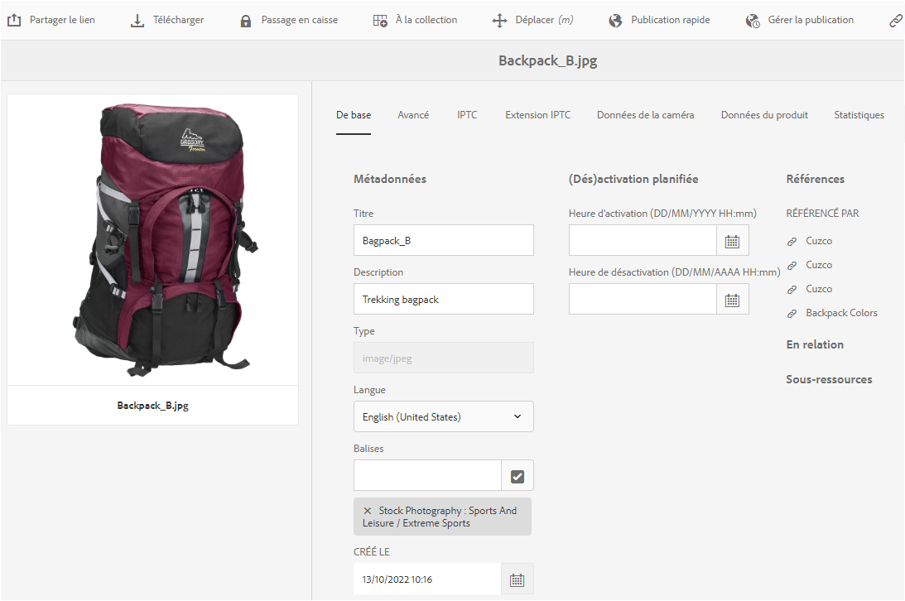

# Modification ou ajout de métadonnées {#how-to-edit-or-add-metadata}

Les métadonnées sont des informations supplémentaires sur la ressource qui peuvent faire l’objet d’une recherche. Elles sont automatiquement extraites lorsque vous chargez une image. Vous pouvez modifier les métadonnées existantes ou ajouter de nouvelles propriétés de métadonnées à des champs existants (par exemple lorsqu’un champ de métadonnées est vide).

Because organizations need controlled and reliable metadata vocabularies, [!DNL Experience Manager Assets] does not allow for ad-hoc adding of new metadata properties. Bien que les auteurs ne puissent pas ajouter de nouveaux champs de métadonnées aux ressources, les développeurs le peuvent. See [create new metadata property for assets](meta-edit.md#editing-metadata-schema).

## Edit metadata for an asset {#editing-metadata-for-an-asset}

Pour modifier des métadonnées, procédez comme suit :

1. Utilisez l’une des méthodes suivantes :

   * Dans l’ [!DNL Assets] interface, sélectionnez le fichier, puis cliquez sur Propriétés **[!UICONTROL de la  de]** dans la barre d’outils.
   * À partir de la miniature de la ressource, sélectionnez l’action rapide **[!UICONTROL Afficher les propriétés]**.
   * From the asset page, click **[!UICONTROL View Properties]**  from the toolbar.
   La page de la ressource affiche toutes les métadonnées de celle-ci. Les métadonnées sont extraites lorsque le fichier est téléchargé (assimilé) dans Experience Manager.

   

   *Figure : Modifiez ou ajoutez des métadonnées sur la page Propriétés du fichier.*

1. Make edits to the metadata under the various tabs, as required, and when completed, click **[!UICONTROL Save]** from the toolbar to save your changes. Click **[!UICONTROL Close]** to return to the Assets web interface.

   >[!NOTE]
   >
   >Si un champ de texte est vide, cela signifie qu’aucune métadonnée n’a été définie. Vous pouvez saisir une valeur dans le champ et l’enregistrer pour ajouter cette propriété de métadonnées.

Toute modification apportée aux métadonnées d’une ressource est écrite dans les données XMP du binaire d’origine. Cette opération s’effectue via le processus d’écriture différée des métadonnées d’Experience Manager. Les modifications apportées aux propriétés existantes (telles que `dc:title`) sont écrasées et les propriétés qui viennent d’être créées (notamment les propriétés personnalisées telles que `cq:tags`) sont ajoutées en même temps que le schéma.

XMP write-back is supported and enabled for the platforms and file formats described in [technical requirements.](/help/sites-deploying/technical-requirements.md)

## Modifier le schéma de métadonnées {#editing-metadata-schema}

For details on how to edit metadata schema, see [Edit metadata schema forms](metadata-schemas.md#edit-metadata-schema-forms).

## Enregistrement d’un  personnalisé  dans Experience Manager {#registering-a-custom-namespace-within-aem}

Vous pouvez ajouter votre propre   dans Experience Manager. Tout comme il existe des espaces de noms prédéfinis tels que cq, jcr et sling, vous pouvez disposer d’un espace de noms pour le traitement des données XML et des métadonnées de votre référentiel.

1. Accédez à la page d’administration du type de noeud `https:[aem_server]:[port]/crx/explorer/nodetypes/index.jsp`.
1. Click **[!UICONTROL Namespaces]** at the top of the page. La page d’administration des espaces de noms s’affiche dans une fenêtre.

1. To add a namespace, click **[!UICONTROL New]** at the bottom.
1. Specify a custom namespace in the XML namespace convention (Specify the id in the form of a URI and an associated prefix for the id), and click **[!UICONTROL Save]**.
