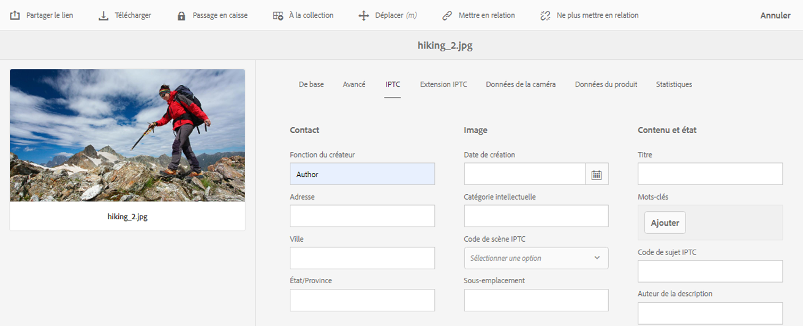

# Présentation des concepts de métadonnées {#why-we-need-metadata}

Les métadonnées sont des données de description des données. À cet égard, elles font référence à vos ressources numériques (ou actifs), par exemple une image. Les métadonnées sont essentielles pour gérer efficacement des ressources.

Elles constituent un ensemble de toutes les données disponibles pour cette image, mais sans qu’elles y soient contenues. Voici quelques exemples de métadonnées :

* Nom de la ressource.
* Heure et date de la dernière modification.
* Taille de la ressource au moment du stockage dans le référentiel.
* Nom du dossier où elle se trouve.
* Ressources connexes ou balises appliquées.

Les propriétés de métadonnées de base décrites ci-dessus sont utilisées par [!DNL Experience Manager] pour gérer les ressources et permettre aux utilisateurs de les visualiser. Par exemple, ordonner les ressources selon la date de leur dernière modification est utile pour identifier des ressources ajoutées récemment.

Vous pouvez ajouter d’autres données de niveau supérieur à des ressources numériques, par exemple :

* Type de ressource (s’agit-il d’une image, d’une vidéo, d’un clip audio ou d’un document ?).
* Propriétaire.
* Intitulé.
* Description.
* Balises affectées à cette ressource.

D’autres métadonnées permettent de classer les fichiers de manière plus détaillée à mesure que le volume d’informations numériques augmente. Il est ainsi possible de gérer quelques centaines de fichiers en ne prenant en compte que leurs noms. Pour autant, cette approche n’est pas évolutive. Elle est insuffisante si le nombre de personnes concernées et la quantité de ressources gérées augmentent.

Avec l’ajout de métadonnées, la valeur d’une ressource numérique augmente, car elle devient :

* plus accessible : les systèmes et les utilisateurs peuvent la trouver facilement ;
* plus facile à gérer : vous pouvez rechercher plus facilement des ressources avec un même ensemble de propriétés et leur apporter des modifications ;
* complète : la ressource contient davantage d’informations et de contexte grâce à un plus grand nombre de métadonnées.

Ainsi, [!DNL Assets] vous fournit les moyens adéquats pour créer, gérer et échanger des métadonnées pour vos ressources numériques.

## Types de métadonnées {#types-of-metadata}

Les deux types de métadonnées de base sont les métadonnées techniques et les métadonnées descriptives.

Les métadonnées techniques sont utiles pour les applications logicielles qui traitent des ressources numériques. Elles ne doivent pas être gérées manuellement. [!DNL Experience Manager Assets] et d’autres logiciels déterminent automatiquement les métadonnées techniques qui peuvent changer lorsque la ressource est modifiée. Les métadonnées techniques disponibles d’une ressource dépendent largement de son type de fichier. Voici quelques exemples de métadonnées techniques :

* taille d’un fichier ;
* dimensions (hauteur et largeur) d’une image ;
* débit d’un fichier audio ou vidéo ;
* résolution (niveau de détail) d’une image.

Les métadonnées descriptives concernent le domaine d’application (par exemple, l’entreprise d’où provient une ressource) et ne peuvent pas être déterminées automatiquement. Elles sont créées manuellement ou semi-automatiquement. Par exemple, une caméra GPS peut automatiquement suivre la latitude et la longitude et ajouter un balisage géographique à l’image.

La création manuelle d’informations descriptives de métadonnées coûte cher. Des normes ont donc été mises en place pour faciliter l’échange de métadonnées entre les systèmes logiciels et les organisations. [!DNL Experience Manager Assets] prend en charge l’ensemble des normes pertinentes pour la gestion des métadonnées.

## Normes de codage {#encoding-standards}

Il existe différentes manières d’incorporer des métadonnées dans des fichiers. Un certain nombre de normes de codage sont prises en charge :

* XMP : utilisé par [!DNL Assets] pour stocker les métadonnées extraites dans le référentiel.
* ID3 : pour les fichiers audio et vidéo.
* Exif : pour les fichiers image.
* Autres normes/normes héritées : [!DNL Microsoft Word], [!DNL PowerPoint], [!DNL Excel], etc.

### XMP {#xmp}

[!DNL Extensible Metadata Platform] (XMP) est une norme ouverte utilisée par [!DNL Experience Manager Assets] pour la gestion des métadonnées. La norme permet le codage universel des métadonnées en l’incorporant dans tous les formats de fichier. Adobe et d’autres entreprises prennent en charge la norme XMP, car elle offre un modèle de contenu enrichi. Les utilisateurs de XMP standard et de [!DNL Experience Manager Assets] disposent d’une plate-forme puissante sur laquelle s’appuyer. Pour plus d’informations, voir la section [XMP](https://www.adobe.com/products/xmp.html).

### ID3 {#id}

Les données stockées dans ces balises ID3 s’affichent lors de la lecture d’un fichier audio numérique sur un ordinateur ou un lecteur MP3 portable.

Les balises ID3 sont destinées au format de fichier MP3. Informations supplémentaires sur les formats :

* Les balises ID3 fonctionnent dans les fichiers MP3 et mp3PRO.
* Le format WAV ne contient pas de balises.
* Le format WMA possède des balises propriétaires qui n’autorisent pas l’implémentation Open Source.
* Le format Ogg Vorbis utilise des commentaires Xiph incorporés dans le conteneur Ogg.
* Le format AAC utilise un format de balisage propriétaire.

### Exif {#exif}

Le format de fichier d’image échangeable (Exif) est le plus utilisé dans la photographie numérique pour les métadonnées. Il permet d’incorporer un vocabulaire fixe de propriétés de métadonnées dans de nombreux formats de fichiers, tels que JPEG, TIFF, RIFF et WAV. Le format Exif stocke chaque métadonnée sous la forme d’une paire constituée du nom et de la valeur de la métadonnée. Ces paires de nom et de valeur de métadonnées sont également appelées des balises, que l’on ne doit pas confondre avec le balisage dans [!DNL Experience Manager]. Les caméras numériques modernes créent des métadonnées Exif que les logiciels graphiques modernes savent prendre en charge. Le format Exif est le plus petit dénominateur commun pour la gestion des métadonnées, en particulier concernant les images.

Le fait que ce format ne soit pas pris en charge par quelques formats de fichiers image très appréciés comme BMP, GIF ou PNG constitue une limite majeure.

Les champs de métadonnées définis par Exif sont généralement de nature technique et d’une utilité limitée pour la gestion descriptive des métadonnées. D’où l’intérêt de [!DNL Experience Manager Assets] pour mapper les propriétés Exif dans des [schémas de métadonnées courants](metadata-schemas.md)[ et dans XMP](xmp-writeback.md).

### Autres métadonnées {#other-metadata}

Les autres métadonnées qui peuvent être incorporées à partir de fichiers comprennent celles de [!DNL Microsoft Word], [!DNL PowerPoint], [!DNL Excel], etc.

## Présentation des schémas de métadonnées {#metadata-schemata}

Les schémas de métadonnées sont des ensembles prédéfinis de définitions de propriétés de métadonnées qui peuvent être utilisés dans différentes applications. Les propriétés sont toujours associées à une ressource, ce qui signifie que les propriétés « concernent » cette ressource.

Vous pouvez également concevoir vos propres schémas de métadonnées s’il n’en existe aucun qui réponde à vos besoins. Ne dupliquez pas les informations existantes. Au sein d’une organisation, la séparation des schémas facilite le partage des métadonnées. [!DNL Experience Manager] fournit une liste par défaut des schémas de métadonnées les plus utilisés. La liste vous permet de lancer rapidement votre stratégie de métadonnées et de choisir rapidement les propriétés de métadonnées dont vous avez besoin.

Les schémas de métadonnées pris en charge sont répertoriés ci-dessous.

### Métadonnées standard {#standard-metadata}

* DC – [!DNL Dublin Core] est un ensemble de métadonnées important et largement utilisé.
* DICOM – Digital Imaging and Communications in Medicine.
* `Iptc4xmpCore` et `iptc4xmpExt` – International Press Communications Standard contient de nombreuses métadonnées spécifiques à un sujet.
* RDF – Resource Description Framework : pour les métadonnées web de sémantique générique.
* XMP – [!DNL Extensible Metadata Platform].
* `xmpBJ` – Basic Job Ticketing.

### Métadonnées spécifiques à l’application {#application-specific-metadata}

Les métadonnées spécifiques à l’application englobent des métadonnées techniques et descriptives. Si vous utilisez ces types de métadonnées, il se peut que d’autres applications ne soient pas en mesure de les exploiter. Par exemple, il est possible qu’une autre application de rendu d’image ne puisse pas accéder aux métadonnées [!DNL Adobe Photoshop]. Vous pouvez créer une étape de workflow qui transforme une propriété spécifique à l’application en propriété standard.

* ACDSee – Métadonnées gérées par le programme [!DNL ACDSee]. Voir [www.acdsee.com/](https://www.acdsee.com/).
* Album – [!DNL Adobe Photoshop Album].
* CQ – Utilisées par [!DNL Experience Manager Assets].
* DAM – Utilisées par [!DNL Experience Manager Assets].
* DEX – [Optima SC Description explorer](http://www.optimasc.com/products/dex/index.html) est une collection d’outils pour la gestion des métadonnées et des fichiers pour les systèmes d’exploitation Windows.
* CRS – [Adobe Photoshop Camera Raw](https://helpx.adobe.com/fr/camera-raw/using/introduction-camera-raw.html).
* LR – [!DNL Adobe Lightroom].
* MediaPro – [iView MediaPro](https://fr.wikipedia.org/wiki/Phase_One_Media_Pro).
* MicrosoftPhoto et MP – Microsoft Photo.
* PDF et PDF/X.
* Photoshop et psAux – [!DNL Adobe Photoshop].

### Métadonnées de Digital Rights Management (DRM) {#digital-rights-management-metadata}

* CC – [!DNL Creative Commons].
* [!DNL XMPRights].
* PLUS – [Picture Licensing Universal System](https://www.useplus.com).
* PRISM – [Exigences de publication pour les métadonnées standard du secteur (Publishing Requirements for Industry Standard Metadata)](https://www.idealliance.org/prism-metadata).
* PRL – PRISM Rights Language.
* PUR – PRISM Usage Rights.
* `xmpPlus` – Intégration de PLUS avec XMP.

### Métadonnées spécifiques à la photographie {#photography-specific-metadata}

* Exif – De nombreuses informations techniques issues de l’appareil photo, notamment la position GPS.
* CRS – Schéma [!DNL Camera Raw].
* `iptc4xmpCore` et `iptc4xmpExt`.
* TIFF – Métadonnées d’image (pas seulement pour les images TIFF).

### Métadonnées spécifiques à l’impression {#print-specific-metadata}

* PDF et PDF/X – Adobe PDF et applications tierces.
* PRISM – [Exigences de publication pour les métadonnées standard du secteur (Publishing Requirements for Industry Standard Metadata)](https://www.idealliance.org/prism-metadata).
* XMP – [!DNL Extensible Metadata Platform].
* `xmpPG` – Métadonnées XMP pour le texte paginé.

### Métadonnées multimédias {#multimedia-specific-metadata}

* `xmpDM` – [!DNL Dynamic Media].
* `xmpMM` – Gestion des médias.

## Référence des schémas de métadonnées {#metadata-schemata-reference}

La référence ci-après contient des informations sur un schéma de métadonnées spécifique (dans l’ordre alphabétique) ainsi qu’une liste de propriétés et de leur définition.

### Dublin Core {#dublin-core}

La métadonnée Dublin Core fournit un ensemble de conventions normalisé pour décrire les ressources afin de faciliter leur recherche. Dans [!DNL Assets], Dublin Core décrit les ressources numériques, notamment la vidéo, le son, les images et les documents.

Le DCMES (Dublin Core Metadata Element Set) contient 15 éléments de métadonnées qui sont répertoriés dans le tableau ci-après. Chaque élément Dublin Core est facultatif et peut être utilisé plusieurs fois. Vous pouvez ajouter ou supprimer des informations de métadonnées Dublin Core comme vous le feriez pour les métadonnées spécifiques au type de média.

Outre le DCMES, il existe d’autres éléments de métadonnées créés par le Dublin Core Initiative. Pour plus d’informations, consultez la [initiative Dublin Core](https://dublincore.org/) .

| Propriété | Description |
| ----------- | ------------------------------------------------------------------------------------------------------------------------ |
| contributor | Personne ou entreprise chargée d’apporter des contributions au contenu. |
| coverage | Emplacement géographique ou période que couvre la ressource. |
| creator | Personne ou entreprise chargée de la création du contenu. |
| date | Date ou période associée à la ressource. |
| description | Informations supplémentaires sur la ressource. |
| format | Format de fichier, support physique ou dimensions de la ressource. [!DNL Experience Manager] utilise `dc:format` pour représenter le type MIME de la ressource. |
| identifier | Référence unique à la ressource. |
| language | La langue de la ressource (par exemple, `en` pour l’anglais). |
| publisher | Personne ou entreprise chargée de rendre la ressource disponible. |
| relation | Ressource connexe. |
| rights | Informations sur la personne qui dispose des droits sur cette ressource. |
| source | Ressource connexe à partir de laquelle la ressource est dérivée. |
| subject | Objet de la ressource. |
| title | Nom de la ressource. |
| type | Nature ou genre de la ressource. |

### IPTC {#iptc}

L’ITPC (International Press Telecommunications Council) est un consortium réunissant les principales agences de presse à travers le monde. L’un de ses principaux objectifs est de développer et maintenir des normes techniques. L’IPTC a défini un ensemble de normes de métadonnées photographiques qui est presque universellement accepté par les photographes. Ces normes de métadonnées faisaient partie de la norme plus générale appelée IPTC Information Interchange Model (IIM) créée dans les années 1990.

Bien que les informations d’en-tête IPTC ont été essentiellement remplacées par XMP, un schéma de base IPTC et un schéma d’extension sont disponibles pour XMP. Dans les programmes de traitement d’images, les propriétés XMP et IPTC sont synchronisées.

## Workflows pilotés par les métadonnées {#metadata-driven-workflows}

La création de workflows pilotés par les métadonnées permet d’automatiser certains processus, ce qui en améliore l’efficacité. Dans un workflow piloté par les métadonnées, le système de gestion des workflows exécute ainsi une action prédéfinie après avoir lu un workflow. Voici quelques exemples d’utilisation des workflows pilotés par les métadonnées :

* Le workflow peut vérifier si une image contient un titre. Dans le cas contraire, le système vous avertit d’ajouter un titre.
* Le workflow peut vérifier si une mention de droit d’auteur relative à un fichier permet la distribution ou non. Ainsi, le système envoie la ressource à un serveur ou à un autre.
* Un workflow peut rechercher des ressources sans métadonnées obligatoires prédéfinies ou des ressources contenant des métadonnées *non valides*.

## Métadonnées XMP {#xmp-metadata}

XMP (Extensible Metadata Platform) est la norme de métadonnées utilisée par [!DNL Adobe Experience Manager Assets] pour la gestion des métadonnées. XMP offre un format standard pour la création, le traitement et l’échange de métadonnées pour une multitude d’applications.

En plus d’un codage de métadonnées universel qui peut être incorporé dans tous les formats de fichier, XMP fournit un [modèle de contenu](#xmp-core-concepts) riche et est [pris en charge par Adobe](#advantages-of-xmp) et d’autres sociétés. Ainsi, les utilisateurs XMP, en association avec , disposent d’une plate-forme puissante sur laquelle s’appuyer.[!DNL Assets]

La [spécification XMP](https://www.adobe.com/devnet/xmp.html) est disponible auprès d’Adobe.

### Qu&#39;est-ce XMP ? {#what-is-xmp}

Adobe a introduit pour la première fois la norme XMP dans le cadre du logiciel Adobe Acrobat. Depuis, la norme XMP a été largement adoptée. [!DNL Assets] prend en charge de manière native le XMP : la plateforme de métadonnées extensible pilotée par Adobe. XMP est une norme destinée au traitement et au stockage de métadonnées normalisées et propriétaires dans les ressources numériques. La norme XMP est conçue pour être la norme commune permettant à plusieurs applications de fonctionner efficacement avec les métadonnées.

Les professionnels de la production, par exemple, utilisent la prise en charge XMP intégrée dans les applications d’Adobe pour transmettre des informations sur plusieurs formats de fichiers. [!DNL Assets] Le référentiel extrait les métadonnées XMP et les utilise pour gérer le cycle de vie du contenu et offre la possibilité de créer des workflows d’automatisation.

XMP normalise la façon dont les métadonnées sont définies, créées et traitées en fournissant un modèle de données, un modèle de stockage et des schémas. Tous ces concepts sont abordés dans cette section.

Toutes les métadonnées héritées d’EXIF, d’ID3 ou de Microsoft Office sont automatiquement converties au format XMP, qui peut être étendu pour prendre en charge le schéma de métadonnées spécifiques au client comme les catalogues de produits.

Dans la norme XMP, les métadonnées sont constituées d’un ensemble de propriétés. Ces propriétés sont toujours associées à une propriété
une entité particulière appelée ressource ; en d’autres termes, les propriétés portent sur la ressource. Dans le cas de XMP, il s’agit toujours de la ressource (ou actif).

### XMP écosystème {#xmp-ecosystem}

XMP définit un modèle de [métadonnées](https://fr.wikipedia.org/wiki/Métadonnée) exploitable avec n’importe quel ensemble défini d’éléments de métadonnées. XMP définit également des [schémas](https://en.wikipedia.org/wiki/XML_schema) spécifiques pour des propriétés de base utiles pour consigner l’historique d’une ressource lorsqu’elle passe par diverses étapes de traitement, de la photographie, en passant par la [numérisation](https://fr.wikipedia.org/wiki/Scanner_(informatique)) ou la création en tant que texte, à travers des étapes de retouche photo (comme le [recadrage](https://fr.wikipedia.org/wiki/Recadrage_(image)) ou l’ajustement de couleur), pour former une image finale. XMP permet à chaque programme ou appareil d’ajouter ses propres informations à une ressource numérique. Ces informations peuvent être ensuite conservées dans le fichier numérique final.

XMP est le plus souvent sérialisé et stocké à l’aide d’un sous-ensemble du [W3C](https://fr.wikipedia.org/wiki/World_Wide_Web_Consortium) [Resource Description Framework](https://fr.wikipedia.org/wiki/Resource_Description_Framework) (RDF), exprimé à son tour en format [XML](https://fr.wikipedia.org/wiki/Extensible_Markup_Language).

### Avantages du mode XMP {#advantages-of-xmp}

La norme XMP présente les avantages suivants par rapport aux autres normes de codage et schémas :

* Les métadonnées basées sur la norme XMP sont très puissantes et précises.
* La norme XMP permet de définir plusieurs valeurs pour une propriété.
* XMP dispose d’un encodage normalisé, ce qui vous permet d’échanger facilement des métadonnées.
* Le format XMP est extensible. Vous pouvez ajouter d’autres informations à vos ressources.

La norme XMP a été conçue pour être extensible, ce qui vous permet d’ajouter des types de métadonnées personnalisés dans les données XMP. En revanche, ce n’est pas le cas d’EXIF qui présente une liste des propriétés qui ne peut pas être étendue.

>[!NOTE]
>
>En règle générale, XMP ne permet pas l’incorporation des types de données binaires. Pour gérer des données binaires dans XMP, comme des images miniatures, celles-ci doivent être codées dans un format XML tel que `Base64`.

### XMP concepts {#xmp-core-concepts}

Les sections ci-après décrivent les notions fondamentales relatives à XMP, notamment les espaces de noms et les schémas, les propriétés et les valeurs, ainsi que les variantes linguistiques.

#### Espaces de noms et schémas {#namespaces-and-schemata}

Un schéma XMP est un ensemble de noms de propriétés défini dans un espace de noms XML commun qui comprend
le type des données et des informations descriptives. Un schéma XMP est identifié par l’URI de l’espace de noms XML. L’utilisation des espaces de noms permet d’empêcher tout conflit entre les propriétés dans différents schémas qui portent le même nom, mais ont un sens différent.

Par exemple, la propriété `Creator` de deux schémas conçus indépendamment peut signifier la personne qui a créé la ressource ou l’application qui l’a créée (par exemple, Adobe Photoshop).

#### Propriétés et valeurs {#properties-and-values}

XMP peut inclure des propriétés de l’un ou de plusieurs des schémas. Par exemple, un sous-ensemble classique utilisé par de nombreuses applications Adobe peut comprendre les éléments suivants :

* Schéma Dublin Core : `dc:title`, `dc:creator`, `dc:subject`, `dc:format`, `dc:rights`.
* Schéma de base XMP : `xmp:CreateDate`, `xmp:CreatorTool`, `xmp:ModifyDate`, `xmp:metadataDate`.
* Schéma de gestion des droits XMP : `xmpRights:WebStatement`, `xmpRights:Marked`.
* Schéma de gestion des médias XMP : `xmpMM:DocumentID`.

#### Variantes linguistiques {#language-alternatives}

XMP permet d’ajouter une propriété `xml:lang` aux propriétés de texte pour spécifier la langue du texte.

## Utilisation des métadonnées IPTC {#support-for-iptc-metadata}

Découvrez comment [!DNL Adobe Experience Manager Assets] prend en charge les métadonnées IPTC, les évaluations de création et les mots-clés ajoutés aux ressources par le biais de [!DNL Adobe Bridge] et d’autres applications [!DNL Adobe Creative Cloud].

[!DNL Adobe Experience Manager Assets] prend en charge la norme de métadonnées IPTC largement utilisée pour décrire les ressources. [!DNL Assets] améliore l’acceptation de ses images par les différentes parties, y compris les photographes, les agences de création, les bibliothèques, les musées, etc.

Le schéma de métadonnées utilisé pour les ressources intègre désormais IPTC Core et IPTC Extension, deux schémas permettant de définir des propriétés de métadonnées complètes, grâce auxquels les utilisateurs peuvent ajouter des données fiables et précises sur les personnes, les lieux et les produits illustrés dans une image. Il prend également en charge les dates, noms et identifiants relatifs à la création de l’image, ainsi qu’une méthode permettant d’exprimer les informations sur les droits avec une certaine souplesse.

La page des propriétés des ressources comprend maintenant des onglets distincts pour afficher les métadonnées IPTC Core et IPTC Extension dans des champs modifiables.

1. Dans l’interface utilisateur [!DNL Assets], sélectionnez une image.
1. Cliquez sur **[!UICONTROL Propriétés]** dans la barre d’outils.
1. Cliquez sur l’onglet **[!UICONTROL IPTC]** pour afficher les métadonnées IPTC de la ressource.
1. Modifiez les propriétés des métadonnées IPTC, selon les besoins.

   

1. Cliquez sur l’onglet **[!UICONTROL Extension IPTC]** pour afficher les métadonnées d’extension IPTC de la ressource.
1. Modifiez les propriétés de métadonnées d’extension IPTC, selon les besoins.
1. Cliquez sur **[!UICONTROL Enregistrer et fermer]** pour enregistrer les modifications.

### Prise en charge de la notation de création {#creative-rating-support}

Outre les évaluations individuelles et cumulées, la page Propriétés affiche désormais les évaluations affectées à des ressources par le biais d’Adobe Bridge et d’autres applications Creative.

Ces évaluations sont disponibles dans la section **[!UICONTROL Évaluation de la création]** de l’onglet **[!UICONTROL Avancé]**.

Cette évaluation est une propriété en lecture seule dont la valeur est comprise entre 1 et 5. Vous pouvez rechercher des ressources en fonction de leur évaluation de création dans le panneau Rechercher.

Notez toutefois que cette propriété n’est pas indexée pour l’instant et ce, afin d’éviter tout conflit avec les modifications personnalisées apportées par les utilisateurs.

### Prise en charge des mots-clés {#keyword-support}

L’onglet **[!UICONTROL IPTC]** de la page [!UICONTROL Propriétés] affiche également les mots-clés ajoutés aux ressources via Adobe Bridge et d’autres applications Adobe Creative Cloud. Vous pouvez aussi modifier ces mots-clés et en ajouter d’autres à partir de l’onglet **[!UICONTROL IPTC]**.

