# Configuration et administration de la fonctionnalité de métadonnées dans [!DNL Assets] {#config-metadata}

<!-- Scope of metadata articles:
* metadata.md: The scope of this article is basic metadata updates, changes, etc. operations that end-users can do.
* metadata-concepts.md: All conceptual information. Minor instructions are OK but it is an FYI article about support and standards.
* metadata-config.md: New article. Contains all configuration and administration how-to info related to metadata of assets.
-->

[!DNL Adobe Experience Manager Assets] conserve les métadonnées de chaque fichier. Cela permet d’obtenir une catégorisation et une organisation plus simples des ressources, ainsi que d’aider les personnes qui recherchent une ressource spécifique. La possibilité de conserver et de gérer les métadonnées de vos fichiers permet aussi d’organiser et de traiter automatiquement les fichiers en fonction de leurs métadonnées. [!DNL Adobe Experience Manager Assets] permet aux administrateurs de configurer et de personnaliser la fonctionnalité de métadonnées pour modifier l’offre d’Adobe par défaut.

## Modifier le schéma de métadonnées {#metadata-schema}

Pour plus d’informations, reportez-vous à la section [Modification de formulaires](metadata-schemas.md#edit-metadata-schema-forms)de schéma de métadonnées.

## Enregistrement d’un espace de nommage personnalisé dans [!DNL Experience Manager] {#registering-a-custom-namespace-within-aem}

Vous pouvez ajouter vos propres espaces de noms à [!DNL Experience Manager]. Just as there are predefined namespaces such as `cq`, `jcr`, and `sling`, you can have a namespace for your repository metadata and XML processing.

1. Accédez à la page d’administration du type de noeud `https://[aem_server]:[port]/crx/explorer/nodetypes/index.jsp`.
1. Pour accéder à la page Administration des espaces de nommage, cliquez sur **[!UICONTROL Espaces de nommage]** en haut de la page.
1. Pour ajouter un espace de nommage, cliquez sur **[!UICONTROL Nouveau]** en bas de la page.
1. Spécifiez un espace de nommage personnalisé dans la convention d’espace de nommage XML. Spécifiez l’identifiant sous la forme d’un URI et d’un préfixe associé pour l’identifiant. Cliquez sur **[!UICONTROL Save]**.

## Configure limits for bulk metadata update {#bulk-metadata-update-limit}

To prevent a denial of service (DOS) like situation, [!DNL Enterprise Manager] limits the number of parameters supported in a Sling request. Lors de la mise à jour simultanée de plusieurs fichiers, vous pouvez atteindre le nombre maximal de paramètres et les métadonnées ne sont pas mises à jour pour d’autres fichiers. Enterprise Manager génère l’avertissement suivant dans les journaux :

`org.apache.sling.engine.impl.parameters.Util Too many name/value pairs, stopped processing after 10000 entries`

To change the limit, access **[!UICONTROL Tools]** > **[!UICONTROL Operations]** > **[!UICONTROL Web Console]** and change the value of **[!UICONTROL Maximum POST Parameters]** in **[!UICONTROL Apache Sling Request Parameter Handling]** OSGi configuration.

## Profils de métadonnées {#metadata-profiles}

Un profil de métadonnées vous permet d’appliquer des métadonnées par défaut aux fichiers d’un dossier. Créez un profil de métadonnées et appliquez-le à un dossier. Tout fichier que vous téléchargez ensuite vers le dossier hérite des métadonnées par défaut que vous avez configurées dans le profil de métadonnées.

### Ajout d’un profil de métadonnées {#adding-a-metadata-profile}

1. Accédez à **[!UICONTROL Outils]** > **[!UICONTROL Ressources]** > Profils **** de métadonnées, puis cliquez sur **[!UICONTROL Créer.]**
1. Saisissez un titre pour le profil, par exemple `Sample Metadata`, puis cliquez sur **[!UICONTROL Créer]**. The [!UICONTROL Edit Form] for the metadata profile is displayed.

   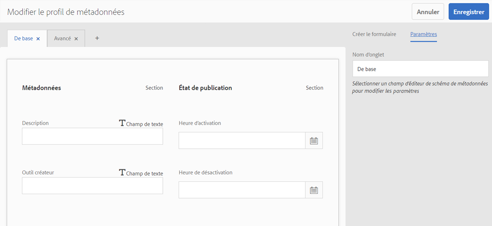

1. Cliquez sur un composant, puis configurez ses propriétés dans l’onglet **[!UICONTROL Paramètres]**. Cliquez par exemple sur le composant **[!UICONTROL Description]** et modifiez ses propriétés.

   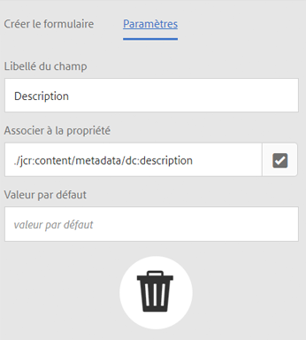

   Modifiez les propriétés suivantes pour le composant **[!UICONTROL Description]** :

   * **[!UICONTROL Libellé]** du champ : Nom d’affichage de la propriété de métadonnées. Il est uniquement disponible à titre de référence.

   * **[!UICONTROL Associer à la propriété]**: La valeur de cette propriété fournit le chemin d’accès relatif ou le nom au noeud de ressources où elle est enregistrée dans le référentiel. La valeur doit toujours être début avec `./` car elle indique que le chemin d’accès se trouve sous le noeud de la ressource.

   

   The value you specify for **[!UICONTROL Map to property]** is stored as a property under the asset&#39;s metadata node. Par exemple, si vous indiquez `./jcr:content/metadata/dc:desc` le nom de la propriété **** Map, [!DNL Assets] stocke la valeur `dc:desc` au noeud de métadonnées du fichier.

   * **[!UICONTROL Valeur par défaut]** : utilisez cette propriété pour ajouter une valeur par défaut pour le composant des métadonnées. Par exemple, si vous indiquez « Ma description », cette valeur est affectée à la propriété `dc:desc` au niveau du nœud de métadonnées de la ressource.

   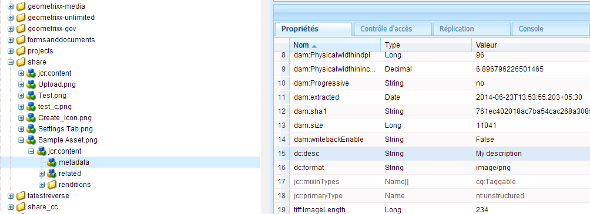

   >[!NOTE]
   >
   >Si vous ajoutez une valeur par défaut à une nouvelle propriété de métadonnées (qui n’existe pas encore au niveau du nœud `/jcr:content/metadata`), la propriété et sa valeur ne s’affichent pas, par défaut, sur la page Propriétés de la ressource. To view the new property on the assets&#39; [!UICONTROL Properties] page, modify the corresponding schema form.

1. (Facultatif) Ajoutez d’autres composants à la page Modifier le formulaire depuis l’onglet **[!UICONTROL Créer le formulaire]**, puis configurez leurs propriétés dans l’onglet **[!UICONTROL Paramètres]**. Les propriétés suivantes sont disponibles à partir de l’onglet **[!UICONTROL Créer le formulaire]** :

| Composant | Propriétés |
| ----------------------------- | ----------------------------------------------------------------------- |
| [!UICONTROL En-tête de section] | Field Label,   Description |
| [!UICONTROL Une seule ligne de texte] | Field Label,   Map to property,   Default Value |
| [!UICONTROL Texte à plusieurs valeurs] | Field Label,   Map to property,   Default Value |
| [!UICONTROL Nombre] | Field Label,   Map to property,   Default Value |
| [!UICONTROL Date] | Field Label,   Map to property,   Default Value |
| [!UICONTROL Balises standard] | Field Label,   Map to property,   Default Value,   Description |

1. Cliquez sur **[!UICONTROL Done]** (Terminé). Le profil de métadonnées est ajouté à la liste des profils de la page **[!UICONTROL Profils de métadonnées]**. 

   

### Copie d’un profil de métadonnées {#copying-a-metadata-profile}

1. From the **[!UICONTROL Metadata Profiles]** page, select a metadata profile to make a copy of it.

   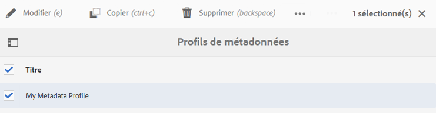

1. Click **[!UICONTROL Copy]** from the toolbar.
1. Dans la boîte de dialogue **[!UICONTROL Copier le profil de métadonnées]**, saisissez le nom de la nouvelle copie du profil de métadonnées.
1. Cliquez sur **[!UICONTROL Copier]**. La copie du profil de métadonnées apparaît dans la liste des profils de la page **[!UICONTROL Profils de métadonnées]**.

   

### Suppression d’un profil de métadonnées {#deleting-a-metadata-profile}

1. Dans la page **[!UICONTROL Profils de métadonnées]**, sélectionnez un profil à supprimer.

1. Click **[!UICONTROL Delete Metadata Profiles]** in the toolbar.
1. Dans la boîte de dialogue, cliquez sur **[!UICONTROL Supprimer]** pour confirmer l’opération de suppression. Le profil de métadonnées est supprimé de la liste.

<!-- TBD: Revisit to find out the correct config. and update these steps. When fixed, also o
These steps have been carried forward from old AEM versions. See https://helpx.adobe.com/experience-manager/6-2/assets/using/metadata-profiles.html#ApplyingaMetadataProfiletoFolders

### Configuration to apply a metadata profile globally {#apply-a-metadata-profile-globally}

In addition to applying a profile to a folder, you can also apply one globally so that any content uploaded into [!DNL Experience Manager] assets in any folder has the selected profile applied.

You can reprocess assets in a folder that already has an existing metadata profile that you later changed. See [Reprocessing assets in a folder after you have edited its processing profile](processing-profiles.md#reprocessing-assets).

To apply a metadata profile globally, follow these steps:

* Navigate to `https://[aem_server]:[port]/mnt/overlay/dam/gui/content/assets/foldersharewizard.html/content/dam` and apply the appropriate profile and click **[!UICONTROL Save]**.

  

* In CRXDE Lite, navigate to the following node: `/content/dam/jcr:content`. Add the property `metadataProfile:/etc/dam/metadata/dynamicmedia/<name of metadata profile>` and click **[!UICONTROL Save All]**.

  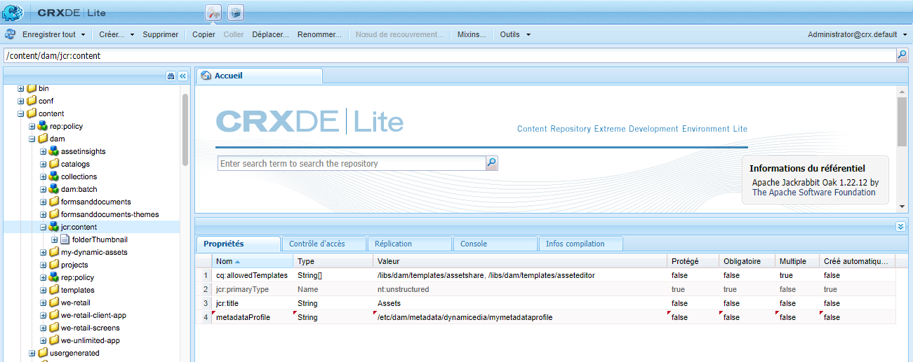
-->

## Schéma de métadonnées pour un dossier {#folder-metadata-schema}

[!DNL Adobe Experience Manager Assets] vous permet de créer des schémas de métadonnées pour des dossiers de ressources. Ces schémas définissent la disposition et les métadonnées affichées dans les pages de propriétés des dossiers.

### Ajout d’un formulaire de schéma de métadonnées de dossier  {#add-a-folder-metadata-schema-form}

Utilisez l’éditeur Formulaires de schéma de métadonnées de dossier pour créer et modifier des schémas de métadonnées pour les dossiers.

1. Dans [!DNL Experience Manager] l’interface, accédez à **[!UICONTROL Outils]** > **[!UICONTROL Ressources]** > Schémas **[!UICONTROL de métadonnées]** de dossier.
1. On the [!UICONTROL Folder Metadata Schema Forms] page, click **[!UICONTROL Create]**.
1. Specify a name for the form, and click **[!UICONTROL Create]**. The new schema form is listed in the [!UICONTROL Schema Forms] page.

### Modification des formulaires de schéma de métadonnées de dossier  {#edit-folder-metadata-schema-forms}

Vous pouvez modifier un formulaire de schéma de métadonnées nouveau ou existant comprenant les éléments suivants :

* Onglets
* Éléments de formulaire dans des onglets

Vous pouvez associer ou configurer ces éléments de formulaire dans un champ au sein d’un nœud de métadonnées dans le référentiel CRX. Vous pouvez ajouter de nouveaux onglets ou éléments de formulaire au formulaire de schéma de métadonnées.

1. In the Schema Forms page, select the form you created, and then select the **[!UICONTROL Edit]** option from the toolbar.
1. In the Folder Metadata Schema Editor page, click `+` to add a tab to the form. To rename the tab, click the default name and specify the new name under **[!UICONTROL Settings]**.

   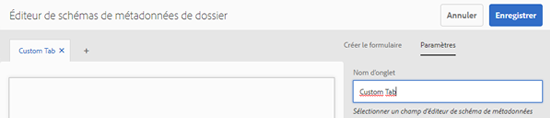

   Pour ajouter d’autres onglets, cliquez sur `+`. Cliquez `X` sur un onglet pour le supprimer.

1. Dans l’onglet actif, ajoutez un ou plusieurs composants de l’onglet **[!UICONTROL Créer le formulaire]**.

   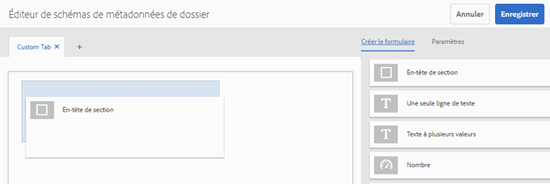

   Si vous créez plusieurs onglets, cliquez sur un onglet particulier pour ajouter des composants.

1. Pour configurer un composant, sélectionnez-le et modifiez ses propriétés dans l’onglet **[!UICONTROL Paramètres]**.

   Si nécessaire, supprimez un composant de l’onglet **[!UICONTROL Paramètres]**.

   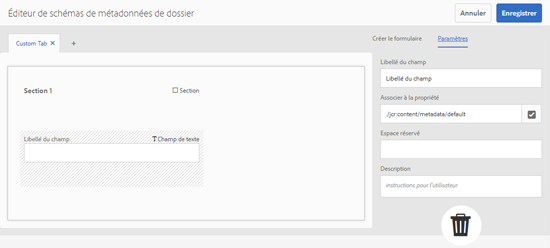

1. Click **[!UICONTROL Save]** from the toolbar to save the changes.

#### Composants de création de formulaires  {#components-to-build-forms}

L’onglet **[!UICONTROL Créer le formulaire]** répertorie les éléments de formulaire que vous utilisez dans votre formulaire de schéma de métadonnées de dossier. L’onglet **[!UICONTROL Paramètres]** contient les attributs de chaque élément sélectionné dans l’onglet **[!UICONTROL Créer le formulaire]**. Voici la liste des éléments de formulaire disponibles dans l’onglet **[!UICONTROL Créer le formulaire]** :

| Nom du composant | Description |
|---|---|
| [!UICONTROL En-tête de section] | Permet d’ajouter un en-tête de section pour une liste de composants communs. |
| [!UICONTROL Une seule ligne de texte] | Permet d’ajouter une propriété de texte d’une seule ligne. Elle est stockée sous la forme d’une chaîne. |
| [!UICONTROL Texte à plusieurs valeurs] | Permet d’ajouter une propriété de texte à plusieurs valeurs. Il est stocké sous forme de tableau de chaînes. |
| [!UICONTROL Nombre] | Permet d’ajouter un composant de nombre. |
| [!UICONTROL Date] | Permet d’ajouter un composant de date. |
| [!UICONTROL Liste déroulante] | Permet d’ajouter une liste déroulante. |
| [!UICONTROL Balises standard] | Permet d’ajouter une balise. |
| [!UICONTROL Champ masqué] | Permet d’ajouter un champ masqué. Il est envoyé en tant que paramètre POST lorsque la ressource est enregistrée. |

#### Modification d’éléments de formulaire {#editing-form-items}

To edit the properties of form items, click the component and edit all or a subset of the following properties in the **[!UICONTROL Settings]** tab.

**[!UICONTROL Libellé du champ]** : nom de la propriété de métadonnées qui s’affiche sur la page des propriétés du dossier.

**[!UICONTROL Associer à la propriété]** : cette propriété spécifie le chemin d’accès relatif au nœud de dossier dans le référentiel CRX où il est enregistré. Elle commence par « **./** », ce qui indique que le chemin est situé sous le nœud du dossier.

Les valeurs admises pour cette propriété sont les suivantes :

* `./jcr:content/metadata/dc:title` : stocke la valeur dans le nœud de métadonnées du dossier en tant que propriété `dc:title`.

* `./jcr:created` : affiche la propriété JCR au niveau du nœud du dossier. Si vous configurez ces propriétés dans CRXDE, Adobe recommande de les marquer avec l’état Désactiver la modification, car elles sont protégées. Dans le cas contraire, l’erreur « `Asset(s) failed to modify` » se produit lorsque vous enregistrez les propriétés de la ressource.

Pour vous assurer que le composant est affiché correctement dans le formulaire de schéma de métadonnées, n’insérez pas d’espace dans le chemin de propriété.

**[!UICONTROL Chemin JSON]** : utilisez cette propriété pour indiquer le chemin d’accès au fichier JSON où vous spécifiez des paires clé/valeur pour les options.

**[!UICONTROL Espace réservé]** : utilisez cette propriété pour spécifier du texte dans l’espace réservé concernant la propriété de métadonnées.

**[!UICONTROL Choix]** : utilisez cette propriété pour spécifier des choix dans une liste.

**[!UICONTROL Description]** : utilisez cette propriété pour ajouter une brève description pour le composant de métadonnées.

**[!UICONTROL Classe]** : classe d’objets à laquelle la propriété est associée.

### Suppression de formulaires de schéma de métadonnées de dossier  {#delete-folder-metadata-schema-forms}

Vous pouvez supprimer des formulaires de schéma de métadonnées de dossier sur la page Formulaires de schéma de métadonnées de dossier. Pour supprimer un formulaire, sélectionnez-le et cliquez sur l’option Supprimer de la barre d’outils.

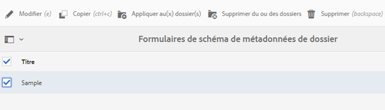

### Affectation d’un schéma de métadonnées de dossier {#assign-a-folder-metadata-schema}

Vous pouvez affecter un schéma de métadonnées de dossier à un dossier à partir de la page Formulaires de schéma de métadonnées de dossier ou lors de la création d’un dossier.

Si vous configurez un schéma de métadonnées pour un dossier, le chemin d’accès au formulaire est stocké dans la propriété `folderMetadataSchema` du nœud de dossier sous `./jcr:content`.

#### Affectation d’un schéma à partir de la page Schéma de métadonnées de dossier  {#assign-to-a-schema-from-the-folder-metadata-schema-page}

1. Dans [!DNL Experience Manager] l’interface, accédez à **[!UICONTROL Outils]** > **[!UICONTROL Ressources]** > Schémas **[!UICONTROL de métadonnées]** de dossier.
1. Sur la page Formulaires de schéma de métadonnées de dossier, sélectionnez le formulaire à appliquer à un dossier.
1. From the toolbar, click **[!UICONTROL Apply to Folder(s)]**.

1. Select the folder on which to apply the schema and then click **[!UICONTROL Apply]**. Si un schéma de métadonnées est déjà appliqué au dossier, un message d’avertissement vous informe que vous êtes sur le point de remplacer le schéma existant. Cliquez sur **[!UICONTROL Remplacer]**.
1. Ouvrez les propriétés des métadonnées pour le dossier auquel vous avez appliqué le schéma de métadonnées.

   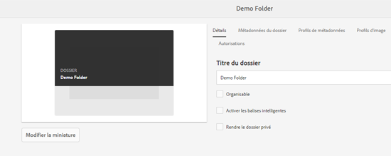

   To view the folder metadata fields, click the **[!UICONTROL Folder Metadata]** tab.

   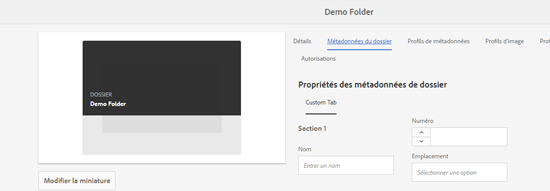

#### Affectation d’un schéma lors de la création d’un dossier {#assign-a-schema-when-creating-a-folder}

Vous pouvez affecter un schéma de métadonnées de dossier lors de la création d’un dossier. S’il existe au moins un schéma de métadonnées de dossier dans le système, une liste supplémentaire s’affiche dans la boîte de dialogue **[!UICONTROL Créer un dossier]**. Vous pouvez sélectionner le schéma de votre choix. Par défaut, aucun schéma n’est sélectionné.

1. From the [!DNL Experience Manager Assets] user interface, click **[!UICONTROL Create]** from the toolbar.
1. Attribuez un titre et un nom au dossier.
1. Dans la liste Schéma de métadonnées de dossier, sélectionnez le schéma de votre choix. Then, click **[!UICONTROL Create]**.

   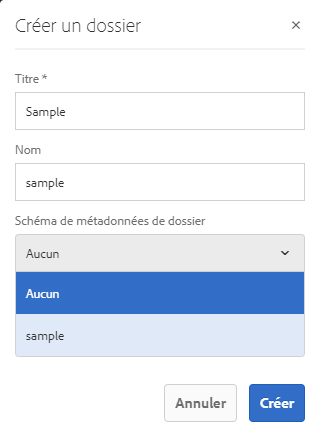

1. Ouvrez les propriétés des métadonnées pour le dossier auquel vous avez appliqué le schéma de métadonnées.
1. To view the folder metadata fields, click the **[!UICONTROL Folder Metadata]** tab.

### Utilisation du schéma de métadonnées de dossier {#use-the-folder-metadata-schema}

Ouvrez les propriétés d’un dossier configuré avec un schéma de métadonnées de dossier. A **[!UICONTROL Folder Metadata]** tab is displayed in the folder [!UICONTROL Properties] page. Pour afficher le formulaire de schéma de métadonnées de dossier, sélectionnez cet onglet.

Enter metadata values in the various fields and click **[!UICONTROL Save]** to store the values. Les valeurs renseignées sont stockées dans le nœud de dossier du référentiel CRX.

## Conseils et restrictions {#best-practices-limitations}

* Pour importer des métadonnées sur des espaces de noms personnalisés, commencez par enregistrer les espaces de noms.
* Le sélecteur de propriétés affiche les propriétés utilisées dans les éditeurs de schéma et les formulaires de recherche. Le sélecteur de propriétés ne sélectionne pas les propriétés de métadonnées d’un fichier.
* Il se peut que des profils de métadonnées préexistants existent depuis avant la mise à niveau vers [!DNL Experience Manager] 6.5. Après la mise à niveau, si vous appliquez un tel profil dans les [!UICONTROL propriétés] du dossier dans l’onglet Profils  de métadonnées, les champs de formulaire de métadonnées ne s’affichent pas. Cependant, si vous appliquez un nouveau profil de métadonnées, les champs du formulaire s’affichent mais ne sont pas disponibles comme prévu. Il n’y a aucune perte de fonctionnalité, mais si vous souhaitez voir les champs de formulaire (indisponibles), modifiez et enregistrez les profils de métadonnées existants.

>[!MORELIKETHIS]
>
>* [Concepts et compréhension](metadata-concepts.md)des métadonnées.
>* [Modification des propriétés de métadonnées de plusieurs collections](manage-collections.md#editing-collection-metadata-in-bulk).
>* [Importation et exportation des métadonnées dans les ressources](https://experienceleague.adobe.com/docs/experience-manager-learn/assets/metadata/metadata-import-feature-video-use.html)Experience Manager.
>* [Profils de traitement des métadonnées, des images et des vidéos](processing-profiles.md).
>* [Bonnes pratiques pour organiser vos ressources numériques en vue d’utiliser des profils](/help/assets/organize-assets.md)de traitement.
>* [Écriture différée XMP](/help/assets/xmp-writeback.md).

