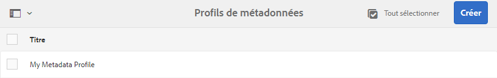
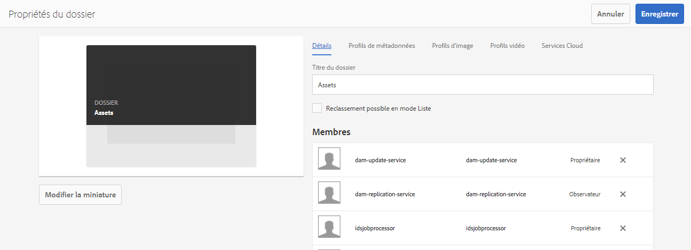

# Configuration et administration des fonctionnalités de métadonnées dans [!DNL Assets] {#config-metadata}

| Version | Lien de l’article |
| -------- | ---------------------------- |
| AEM as a Cloud Service | [Cliquez ici](https://experienceleague.adobe.com/docs/experience-manager-cloud-service/content/assets/manage/metadata-profiles.html?lang=fr) |
| AEM 6.5 | Cet article |

<!-- Scope of metadata articles:
* metadata.md: The scope of this article is basic metadata updates, changes, etc. operations that end-users can do.
* metadata-concepts.md: All conceptual information. Minor instructions are OK but it is an FYI article about support and standards.
* metadata-config.md: New article. Contains all configuration and administration how-to info related to metadata of assets.
-->

[!DNL Adobe Experience Manager Assets] conserve les métadonnées de chaque fichier. Cela permet d’obtenir une catégorisation et une organisation plus simples des ressources, ainsi que d’aider les personnes qui recherchent une ressource spécifique. La possibilité de conserver et de gérer les métadonnées de vos fichiers permet aussi d’organiser et de traiter automatiquement les fichiers en fonction de leurs métadonnées. [!DNL Adobe Experience Manager Assets] permet aux équipes d’administration de configurer et de personnaliser les fonctionnalités de métadonnées afin de modifier l’offre d’Adobe par défaut.

## Modifier le schéma de métadonnées {#metadata-schema}

Pour plus d’informations, consultez la section [Modification des formulaires de schéma de métadonnées](metadata-schemas.md#edit-metadata-schema-forms).

## Enregistrement d’un espace de noms personnalisé dans [!DNL Experience Manager] {#registering-a-custom-namespace-within-aem}

Vous pouvez ajouter vos propres espaces de noms à [!DNL Experience Manager]. Tout comme il existe des espaces de noms prédéfinis tels que `cq`, `jcr` et `sling`, vous pouvez disposer d’un espace de noms pour le traitement des données XML et des métadonnées de votre référentiel.

1. Accédez à la page d’administration du type de nœud `https://[aem_server]:[port]/crx/explorer/nodetypes/index.jsp`.
1. Pour accéder à la page d’administration des espaces de noms, cliquez sur **[!UICONTROL Espaces de noms]** en haut de la page.
1. Pour ajouter un espace de noms, cliquez sur **[!UICONTROL Nouveau]** en bas de la page.
1. Spécifiez un espace de noms personnalisé dans la convention des espaces de noms XML. Spécifiez l’identifiant sous la forme d’un URI et d’un préfixe associé à l’ID. Cliquez sur **[!UICONTROL Enregistrer]**.

## Configuration du nombre maximal de paramètres pour la mise à jour des métadonnées en bloc {#bulk-metadata-update-limit}

Pour éviter une situation similaire à un DOS (déni de service), [!DNL Enterprise Manager] limite le nombre de paramètres pris en charge dans une requête Sling. Lors de la mise à jour simultanée de plusieurs fichiers, vous pouvez atteindre le nombre maximal de paramètres et les métadonnées ne sont pas mises à jour pour d’autres fichiers. Enterprise Manager génère l’avertissement suivant dans les journaux :

`org.apache.sling.engine.impl.parameters.Util Too many name/value pairs, stopped processing after 10000 entries`

Pour modifier le nombre maximal de paramètres, accédez à la console **[!UICONTROL Outils]** > **[!UICONTROL Opérations]** > **[!UICONTROL Console web]**, puis changez la valeur de **[!UICONTROL Paramètres POST maximum]** dans la configuration OSGi de **[!UICONTROL gestion des paramètres de requête Sling Apache]**.

## Profils de métadonnées {#metadata-profiles}

Un profil de métadonnées vous permet d’appliquer des métadonnées par défaut aux ressources d’un dossier. Créez un profil de métadonnées et appliquez-le à un dossier. Toute ressource que vous chargez ultérieurement dans le dossier hérite des métadonnées par défaut que vous avez configurées dans le profil de métadonnées.

### Ajout d’un profil de métadonnées {#adding-a-metadata-profile}

1. Accédez à **[!UICONTROL Outils]** > **[!UICONTROL Ressources]** > **[!UICONTROL Profils de métadonnées]** puis cliquez sur **[!UICONTROL Créer]**.
1. Saisissez un titre pour le profil, par exemple `Sample Metadata`, puis cliquez sur **[!UICONTROL Créer]**. La page [!UICONTROL Modifier le formulaire] pour le profil de métadonnées s’affiche.

   

1. Cliquez sur un composant, puis configurez ses propriétés dans l’onglet **[!UICONTROL Paramètres]**. Cliquez par exemple sur le composant **[!UICONTROL Description]** et modifiez ses propriétés.

   

   Modifiez les propriétés suivantes pour le composant **[!UICONTROL Description]** :

   * **[!UICONTROL Libellé du champ]** : nom sous lequel s’affiche la propriété des métadonnées. Il est uniquement disponible à titre de référence.

   * **[!UICONTROL Mapper à la propriété]** : cette propriété spécifie le chemin ou nom relatif du nœud de la ressource où elle est enregistrée dans le référentiel. La valeur doit toujours commencer par `./` car cela indique que le chemin d’accès se trouve sous le nœud de la ressource.

   

   La valeur que vous spécifiez pour **[!UICONTROL Mapper à la propriété]** est conservée en tant que propriété sous le nœud de métadonnées de la ressource. Par exemple, si vous spécifiez `./jcr:content/metadata/dc:desc` en tant que nom pour **[!UICONTROL Mapper à la propriété]**, [!DNL Assets] stocke la valeur `dc:desc` comme nœud de métadonnées de la ressource. Adobe recommande de ne mapper qu’un champ à une propriété donnée dans le schéma de métadonnées. Sinon, le dernier champ ajouté et mappé à la propriété est sélectionné par le système.

   * **[!UICONTROL Valeur par défaut]** : utilisez cette propriété pour ajouter une valeur par défaut pour le composant des métadonnées. Par exemple, si vous indiquez « Ma description », cette valeur est affectée à la propriété `dc:desc` au niveau du nœud de métadonnées de la ressource.

   

   >[!NOTE]
   >
   >Si vous ajoutez une valeur par défaut à une nouvelle propriété de métadonnées (qui n’existe pas au niveau du nœud `/jcr:content/metadata`), la propriété et sa valeur ne s’affichent pas, par défaut, sur la page [!UICONTROL Propriétés de la ressource]. Pour afficher la nouvelle propriété sur la page [!UICONTROL Propriétés] de la ressource, modifiez le formulaire de schéma correspondant.

1. (Facultatif) Dans l’onglet **[!UICONTROL Créer un formulaire]**, ajoutez d’autres composants à [!UICONTROL Modifier le formulaire] et configurez leurs propriétés dans l’onglet **[!UICONTROL Paramètres]**. Les propriétés suivantes sont disponibles dans l’onglet **[!UICONTROL Créer un formulaire]** :

| Composant | Propriétés |
| ----------------------------- | ----------------------------------------------------------------------- |
| [!UICONTROL En-tête de section] | Libellé de champ, Description   |
| [!UICONTROL Texte d’une seule ligne] | Libellé de champ,   Associer à la propriété,   Valeur par défaut |
| [!UICONTROL Texte à plusieurs valeurs] | Libellé de champ,   Associer à la propriété,   Valeur par défaut |
| [!UICONTROL Nombre] | Libellé de champ,   Associer à la propriété,   Valeur par défaut |
| [!UICONTROL Date] | Libellé de champ,   Associer à la propriété,   Valeur par défaut |
| [!UICONTROL Balises standard] | Libellé de champ,   Associer à la propriété,   Valeur par défaut,   Description |

1. Cliquez sur **[!UICONTROL Terminé]**. Le profil de métadonnées est ajouté à la liste des profils de la page **[!UICONTROL Profils de métadonnées]**. 

   

### Copie d’un profil de métadonnées {#copying-a-metadata-profile}

1. Sélectionnez un profil de métadonnées sur la page **[!UICONTROL Profils de métadonnées]** pour en faire une copie.

   

1. Cliquez sur **[!UICONTROL Copier]** dans la barre d’outils.
1. Dans la boîte de dialogue **[!UICONTROL Copier le profil de métadonnées]**, saisissez le nom de la nouvelle copie du profil de métadonnées.
1. Cliquez sur **[!UICONTROL Copier]**. La copie du profil de métadonnées apparaît dans la liste des profils de la page **[!UICONTROL Profils de métadonnées]**.

   

### Suppression d’un profil de métadonnées {#deleting-a-metadata-profile}

1. Dans la page **[!UICONTROL Profils de métadonnées]**, sélectionnez un profil à supprimer.

1. Cliquez sur **[!UICONTROL Supprimer les profils de métadonnées]** dans la barre d’outils.
1. Dans la boîte de dialogue, cliquez sur **[!UICONTROL Supprimer]** pour confirmer l’opération de suppression. Le profil de métadonnées est supprimé de la liste.

<!-- TBD: Revisit to find out the correct config. and update these steps. When fixed, also o
These steps have been carried forward from old AEM versions. See https://helpx.adobe.com/experience-manager/6-2/assets/using/metadata-profiles.html#ApplyingaMetadataProfiletoFolders

### Configuration to apply a metadata profile globally {#apply-a-metadata-profile-globally}

In addition to applying a profile to a folder, you can also apply one globally so that any content uploaded into [!DNL Experience Manager] assets in any folder has the selected profile applied.

You can reprocess assets in a folder that already has an existing metadata profile that you later changed. See [Reprocessing assets in a folder after you have edited its processing profile](processing-profiles.md#reprocessing-assets).

To apply a metadata profile globally, follow these steps:

* Navigate to `https://[aem_server]:[port]/mnt/overlay/dam/gui/content/assets/foldersharewizard.html/content/dam` and apply the appropriate profile and click **[!UICONTROL Save]**.

  

* In CRXDE Lite, navigate to the following node: `/content/dam/jcr:content`. Add the property `metadataProfile:/etc/dam/metadata/dynamicmedia/<name of metadata profile>` and click **[!UICONTROL Save All]**.

  
-->

## Schéma de métadonnées d’un dossier {#folder-metadata-schema}

[!DNL Adobe Experience Manager Assets] vous permet de créer des schémas de métadonnées pour des dossiers de ressources. Ces schémas définissent la disposition et les métadonnées affichées dans les pages de propriétés des dossiers.

### Ajout d’un formulaire de schéma de métadonnées de dossier {#add-a-folder-metadata-schema-form}

Utilisez l’éditeur Formulaires de schéma de métadonnées de dossier pour créer et modifier des schémas de métadonnées pour les dossiers.

1. Dans l’interface [!DNL Experience Manager], accédez à **[!UICONTROL Outils]** > **[!UICONTROL Ressources]** > **[!UICONTROL Schémas de métadonnées de dossiers]**.
1. Sur la page [!UICONTROL Formulaires de schéma de métadonnées de dossiers], cliquez sur **[!UICONTROL Créer]**.
1. Indiquez un nom pour le formulaire, puis cliquez sur **[!UICONTROL Créer]**. Le nouveau formulaire de schéma est répertorié dans la page [!UICONTROL Formulaires de schéma].

### Modification des formulaires de schéma de métadonnées de dossier {#edit-folder-metadata-schema-forms}

Vous pouvez modifier un formulaire de schéma de métadonnées existant ou nouvellement ajouté, qui comprend les éléments suivants :

* Onglets
* Éléments de formulaire dans des onglets.

Vous pouvez associer ou configurer ces éléments de formulaire dans un champ au sein d’un nœud de métadonnées dans le référentiel CRX. Vous pouvez ajouter de nouveaux onglets ou éléments de formulaire au formulaire de schéma de métadonnées.

1. Sur la page Formulaires de schéma, sélectionnez le formulaire que vous avez créé, puis sélectionnez l’option **[!UICONTROL Modifier]** dans la barre d’outils.
1. Sur la page Éditeur de schéma de métadonnées de dossier, cliquez sur `+` pour ajouter un onglet au formulaire. Pour renommer l’onglet, cliquez sur le nom par défaut, puis indiquez le nouveau nom sous **[!UICONTROL Paramètres]**.

   

   Pour ajouter d’autres onglets, cliquez sur `+`. Pour en supprimer, cliquez sur `X` sur un onglet.

1. Dans l’onglet actif, ajoutez un ou plusieurs composants de l’onglet **[!UICONTROL Créer le formulaire]**.

   

   Si vous créez plusieurs onglets, cliquez sur un onglet spécifique pour ajouter des composants.

1. Pour configurer un composant, sélectionnez-le et modifiez ses propriétés dans l’onglet **[!UICONTROL Paramètres]**.

   Si nécessaire, supprimez un composant de l’onglet **[!UICONTROL Paramètres]**.

   

1. Pour enregistrer les modifications, sélectionnez **[!UICONTROL Enregistrer]** dans la barre d’outils.

#### Composants de création de formulaires {#components-to-build-forms}

L’onglet **[!UICONTROL Créer le formulaire]** répertorie les éléments de formulaire que vous utilisez dans votre formulaire de schéma de métadonnées de dossier. L’onglet **[!UICONTROL Paramètres]** contient les attributs de chaque élément sélectionné dans l’onglet **[!UICONTROL Créer le formulaire]**. Voici la liste des éléments de formulaire disponibles dans l’onglet **[!UICONTROL Créer le formulaire]** :

| Nom du composant | Description |
|---|---|
| [!UICONTROL En-tête de section] | Permet d’ajouter un en-tête de section pour une liste de composants communs. |
| [!UICONTROL Une seule ligne de texte] | Permet d’ajouter une propriété de texte d’une seule ligne. Elle est stockée sous la forme d’une chaîne. |
| [!UICONTROL Texte à plusieurs valeurs] | Permet d’ajouter une propriété de texte à plusieurs valeurs. Il est stocké sous forme de tableau de chaînes. |
| [!UICONTROL Nombre] | Permet d’ajouter un composant de nombre. |
| [!UICONTROL Date] | Permet d’ajouter un composant de date. |
| [!UICONTROL Liste déroulante] | Permet d’ajouter une liste déroulante. |
| [!UICONTROL Balises standard] | Permet d’ajouter une balise. |
| [!UICONTROL Champ masqué] | Permet d’ajouter un champ masqué. Il est envoyé en tant que paramètre POST lorsque la ressource est enregistrée. |

#### Modification d’éléments de formulaire {#editing-form-items}

Pour modifier les propriétés d’éléments de formulaire, cliquez sur le composant et modifiez l’ensemble ou un sous-ensemble des propriétés suivantes dans l’onglet **[!UICONTROL Paramètres.]**

**[!UICONTROL Libellé du champ]** : nom de la propriété de métadonnées qui s’affiche sur la page des propriétés du dossier.

**[!UICONTROL Associer à la propriété]**: Cette propriété spécifie le chemin d’accès relatif du noeud de dossier dans le référentiel CRX où il est enregistré. Elle commence par &quot;**./**&quot;, qui indique que le chemin d’accès se trouve sous le noeud du dossier.

Les valeurs admises pour cette propriété sont les suivantes :

* `./jcr:content/metadata/dc:title` : stocke la valeur dans le nœud de métadonnées du dossier en tant que propriété `dc:title`.

* `./jcr:created` : affiche la propriété JCR au niveau du nœud du dossier. Si vous configurez ces propriétés dans CRXDE, Adobe recommande de les marquer avec l’état Désactiver la modification, car elles sont protégées. Dans le cas contraire, l’erreur « `Asset(s) failed to modify` » se produit lorsque vous enregistrez les propriétés de la ressource.

Pour vous assurer que le composant est affiché correctement dans le formulaire de schéma de métadonnées, n’insérez pas d’espace dans le chemin de propriété.

**[!UICONTROL Chemin JSON]** : utilisez cette propriété pour indiquer le chemin d’accès au fichier JSON où vous spécifiez des paires clé/valeur pour les options.

**[!UICONTROL Espace réservé]**: Utilisez cette propriété pour spécifier le texte d’espace réservé approprié concernant la propriété de métadonnées.

**[!UICONTROL Choix]** : utilisez cette propriété pour spécifier des choix dans une liste.

**[!UICONTROL Description]** : utilisez cette propriété pour ajouter une brève description pour le composant de métadonnées.

**[!UICONTROL Classe]**: Classe d’objet à laquelle la propriété est associée.

### Suppression de formulaires de schéma de métadonnées de dossier {#delete-folder-metadata-schema-forms}

Vous pouvez supprimer des formulaires de schéma de métadonnées de dossier sur la page Formulaires de schéma de métadonnées de dossier. Pour supprimer un formulaire, sélectionnez-le et cliquez sur l’option de suppression de la barre d’outils.

### Affectation d’un schéma de métadonnées de dossier {#assign-a-folder-metadata-schema}

Vous pouvez affecter un schéma de métadonnées de dossier à un dossier à partir de la page Formulaires de schéma de métadonnées de dossier ou lors de la création d’un dossier.

Si vous configurez un schéma de métadonnées pour un dossier, le chemin d’accès au formulaire est stocké dans la propriété `folderMetadataSchema` du nœud de dossier sous `./jcr:content`.

#### Affectation d’un schéma à partir de la page Schéma de métadonnées de dossier {#assign-to-a-schema-from-the-folder-metadata-schema-page}

1. Dans l’interface [!DNL Experience Manager], accédez à **[!UICONTROL Outils]** > **[!UICONTROL Ressources]** > **[!UICONTROL Schémas de métadonnées de dossiers]**.
1. Sur la page Formulaires de schéma de métadonnées de dossier, sélectionnez le formulaire à appliquer à un dossier.
1. Dans la barre d’outils, cliquez sur **[!UICONTROL Appliquer au(x) dossier(s)]**.

1. Sélectionnez le dossier auquel appliquer le schéma, puis cliquez sur **[!UICONTROL Appliquer]**. Si un schéma de métadonnées est déjà appliqué au dossier, un message d’avertissement vous informe que vous êtes sur le point de remplacer le schéma existant. Cliquez sur **[!UICONTROL Remplacer]**.
1. Ouvrez les propriétés des métadonnées pour le dossier auquel vous avez appliqué le schéma de métadonnées.

   

   Pour afficher les champs de métadonnées du dossier, cliquez sur l’onglet **[!UICONTROL Métadonnées du dossier]**.

   

#### Affectation d’un schéma lors de la création d’un dossier {#assign-a-schema-when-creating-a-folder}

Vous pouvez attribuer un schéma de métadonnées de dossier lors de la création d’un dossier. Si au moins un schéma de métadonnées de dossier existe dans le système, une liste supplémentaire s’affiche dans la variable **[!UICONTROL Créer un dossier]** boîte de dialogue. Vous pouvez sélectionner le schéma souhaité. Par défaut, aucun schéma n’est sélectionné.

1. Dans l’interface utilisateur [!DNL Experience Manager Assets], cliquez sur **[!UICONTROL Créer]** dans la barre d’outils.
1. Indiquez un titre et un nom pour le dossier.
1. Dans la liste Schéma de métadonnées de dossier , sélectionnez le schéma souhaité. Cliquez ensuite sur **[!UICONTROL Créer]**.

   

1. Ouvrez les propriétés des métadonnées pour le dossier auquel vous avez appliqué le schéma de métadonnées.
1. Pour afficher les champs de métadonnées du dossier, cliquez sur l’onglet **[!UICONTROL Métadonnées du dossier]**.

### Utilisation du schéma de métadonnées de dossier {#use-the-folder-metadata-schema}

Ouvrez les propriétés d’un dossier configuré avec un schéma de métadonnées de dossier. Un onglet **[!UICONTROL Métadonnées de dossier]** s’affiche sur la page des [!UICONTROL propriétés] du dossier. Pour afficher le formulaire de schéma de métadonnées de dossier, sélectionnez cet onglet.

Saisissez les valeurs de métadonnées dans les différents champs, puis cliquez sur **[!UICONTROL Enregistrer]** pour les stocker. Les valeurs renseignées sont stockées dans le nœud de dossier du référentiel CRX.

## Conseils et restrictions {#best-practices-limitations}

* Pour importer des métadonnées sur des espaces de noms personnalisés, commencez par enregistrer les espaces de noms.
* Le sélecteur de propriétés affiche les propriétés utilisées dans les éditeurs de schéma et les formulaires de recherche. Le sélecteur de propriétés ne sélectionne pas les propriétés de métadonnées d’une ressource.
* Des profils de métadonnées préexistants peuvent exister et dater d’avant la mise à niveau vers [!DNL Experience Manager] 6.5. Après la mise à niveau, si vous appliquez un tel profil dans un dossier [!UICONTROL Propriétés] dans l’onglet [!UICONTROL Profils de métadonnées], les champs de formulaire de métadonnées ne s’affichent pas. Cependant, si vous appliquez un nouveau profil de métadonnées, les champs de formulaire s’affichent mais ne sont pas disponibles comme prévu. Vous ne rencontrerez pas de perte de fonctionnalités mais si vous souhaitez voir les champs de formulaire (indisponibles), modifiez et enregistrez les profils de métadonnées existants.

>[!MORELIKETHIS]
>
>* [Concepts et compréhension des métadonnées](metadata-concepts.md).
>* [Modification des propriétés de métadonnées de plusieurs collections](manage-collections.md#editing-collection-metadata-in-bulk).
>* [Importation et exportation des métadonnées dans Experience Manager Assets](https://experienceleague.adobe.com/docs/experience-manager-learn/assets/metadata/metadata-import-export.html?lang=fr).
>* [Profils de traitement des métadonnées, des images et des vidéos](processing-profiles.md).
>* [Bonnes pratiques d’organisation des ressources numériques à utiliser pour le traitement des profils](/help/assets/organize-assets.md).
>* [Écriture différée XMP](/help/assets/xmp-writeback.md).

