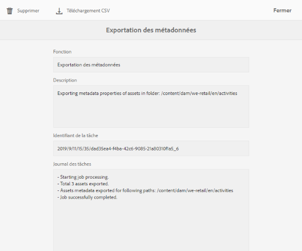

# Importation et exportation des métadonnées de fichier par lot   {#import-and-export-asset-metadata-in-bulk}

[!DNL Adobe Experience Manager Assets] permet d’importer des métadonnées de ressources par lot à l’aide d’un fichier CSV. Vous pouvez effectuer des mises à jour par lot pour les ressources récemment transférées ou les ressources existantes en important un fichier CSV. Vous pouvez également assimiler des métadonnées de ressources par lot à partir d’un système tiers au format CSV.

## Importation de métadonnées   {#import-metadata}

L’importation de métadonnées est asynchrone et ne nuit pas aux performances du système. La mise à jour simultanée des métadonnées pour plusieurs ressources peut être gourmande en ressources en raison de l’activité d’écriture différée XMP si l’indicateur de workflow est coché. Planifiez une importation de ce type quand le serveur est peu utilisé afin que les performances d’autres utilisateurs ne soient pas affectées.

>[!NOTE]
>
>Pour importer des métadonnées sur des espaces de noms personnalisés, commencez par enregistrer les espaces de noms.

1. Navigate to the [!DNL Assets] user interface, and click **[!UICONTROL Create]** from the toolbar.
1. Dans le menu, sélectionnez **[!UICONTROL Métadonnées]**.
1. In the **[!UICONTROL Metadata Import]** page, click **[!UICONTROL Select File]**. Sélectionnez le fichier CSV contenant les métadonnées.
1. Spécifiez les paramètres suivants :

   | Paramètres d’importation des métadonnées | Description |
   |:---|:---|
   | [!UICONTROL Taille du lot] | Nombre de ressources dans un lot pour lesquelles les métadonnées doivent être importées. La valeur par défaut est 50. La valeur maximale est 100. |
   | [!UICONTROL Séparateur de champs] | La valeur par défaut est `,` (une virgule). Vous pouvez spécifier n’importe quel autre caractère. |
   | [!UICONTROL Délimiteur à plusieurs valeurs] | Séparateur des valeurs de métadonnées. La valeur par défaut est `|`. |
   | [!UICONTROL Lancer les workflows] | Faux par défaut. When set to `true` and default Launcher settings are in effect for the [!UICONTROL DAM Metadata WriteBack] workflow (that writes metadata to the binary XMP data). L’activation des workflows de lancement ralentit le système. |
   | [!UICONTROL Nom de colonne du chemin d’accès à la ressource] | Définit le nom de la colonne du fichier CSV avec des ressources. |

1. Appuyez/cliquez sur **[!UICONTROL Importer]** dans la barre d’outils. After the metadata is imported, a notification is sent to your [!UICONTROL Notification] inbox. Accédez à la page de propriété des ressources et vérifiez que les valeurs des métadonnées sont correctement importées pour les ressources.

Pour ajouter une date et un horodatage lors de l’importation de métadonnées, utilisez `YYYY-MM-DDThh:mm:ss.fff-00:00` le format de date et d’heure. La date et l’heure sont séparées par `T`, `hh` correspond aux heures au format 24 heures, `fff` aux nanosecondes et `-00:00` au décalage du fuseau horaire. Par exemple, `2020-03-26T11:26:00.000-07:00` est le 26 mars 2020 à 11h26:00.000 heure du Pacifique.

>[!CAUTION]
>
>Si le format de date ne correspond pas `YYYY-MM-DDThh:mm:ss.fff-00:00`, les valeurs de date ne sont pas définies. Les formats de date du fichier CSV de métadonnées exporté sont au format `YYYY-MM-DDThh:mm:ss-00:00`. Si vous souhaitez l’importer, convertissez-la au format acceptable en ajoutant la valeur nanosecondes indiquée par `fff`.

## Exportation des métadonnées {#export-metadata}

Vous pouvez exporter des métadonnées pour plusieurs fichiers au format CSV. Les métadonnées sont exportées de manière asynchrone et n’ont aucun impact sur les performances du système. To export metadata, [!DNL Experience Manager] traverses through the properties of the asset node `jcr:content/metadata` and its child nodes and exports the metadata properties in a CSV file.

Voici quelques cas d’utilisation pour l’exportation de métadonnées par lot :

* Importation des métadonnées dans un système tiers lors de la migration des fichiers.
* Partage des métadonnées de ressources avec une équipe de projet plus large.
* Test ou contrôle des métadonnées pour la conformité.
* Externalisation des métadonnées pour une localisation distincte.

1. Sélectionnez le dossier de ressources pour lequel vous souhaitez exporter des métadonnées. Dans la barre d’outils, sélectionnez **[!UICONTROL Exporter les métadonnées]**.

1. In the [!UICONTROL Metadata Export] dialog, specify a name for the CSV file. Pour exporter des métadonnées des ressources dans les sous-dossiers, sélectionnez **[!UICONTROL Inclure les ressources dans les sous-dossiers]**.

   

1. Sélectionnez les options souhaitées. Indiquez un nom de fichier et, si nécessaire, une date.

1. Dans le champ **[!UICONTROL Propriétés à exporter]**, indiquez si vous voulez exporter toutes les propriétés ou certaines propriétés. Si vous choisissez Propriétés sélectives à exporter, ajoutez les propriétés souhaitées.

1. From the toolbar, click **[!UICONTROL Export]**. Un message confirme que les métadonnées ont été exportées. Fermez le message.

1. Ouvrez la notification de la boîte de réception pour la tâche d’exportation. Sélectionnez la tâche et cliquez sur **[!UICONTROL Ouvrir]** dans la barre d’outils. To download the CSV file with the metadata, click **[!UICONTROL CSV Download]** from the toolbar. Cliquez sur **[!UICONTROL Fermer]**.

   

   *Image : boîte de dialogue de téléchargement du fichier CSV contenant les métadonnées exportées en bloc.*

>[!MORELIKETHIS]
>
>* [Importation et exportation de métadonnées dans les ressources d’Experience Manager](https://docs.adobe.com/content/help/en/experience-manager-learn/assets/metadata/metadata-import-feature-video-use.html)

