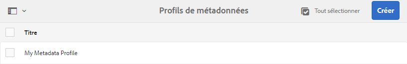
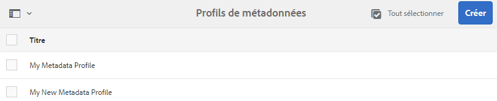

# Profils de métadonnées {#metadata-profiles}

Un profil de métadonnées vous permet d’appliquer des métadonnées par défaut aux fichiers d’un dossier. Créez un profil de métadonnées et appliquez-le à un dossier. Tout fichier que vous téléchargez ensuite vers le dossier hérite des métadonnées par défaut que vous avez configurées dans le profil de métadonnées.

## Ajout d’un profil de métadonnées {#adding-a-metadata-profile}

1. Accédez à **[!UICONTROL Outils]** > **[!UICONTROL Ressources]** > Profils **** de métadonnées, puis cliquez sur **[!UICONTROL Créer.]**
1. Enter a title for the Metadata Profile, for example Sample Metadata, and click **[!UICONTROL Create]**. The [!UICONTROL Edit Form] for the metadata profile is displayed.

   

1. Cliquez sur un composant, puis configurez ses propriétés dans l’onglet **[!UICONTROL Paramètres]**. Cliquez par exemple sur le composant **[!UICONTROL Description]** et modifiez ses propriétés.

   

   Modifiez les propriétés suivantes pour le composant **[!UICONTROL Description]** :

   * **[!UICONTROL Libellé]** du champ : Nom d’affichage de la propriété de métadonnées. Il est uniquement disponible à titre de référence.

   * **[!UICONTROL Associer à la propriété]**: La valeur de cette propriété fournit le chemin/nom relatif au noeud de ressources où elle est enregistrée dans le référentiel. La valeur doit toujours être début avec `./` car elle indique que le chemin d’accès se trouve sous le noeud de la ressource.

   

   La valeur que vous indiquez pour **[!UICONTROL Associer à la propriété]** est stockée en tant que propriété sous le nœud de métadonnées de la ressource. Par exemple, si vous spécifiez . `/jcr:content/metadata/dc:desc` comme nom de la propriété **** Associer à, [!DNL Assets] stocke la valeur `dc:desc` au noeud de métadonnées du fichier.

   * **[!UICONTROL Valeur par défaut]** : utilisez cette propriété pour ajouter une valeur par défaut pour le composant des métadonnées. Par exemple, si vous indiquez « Ma description », cette valeur est affectée à la propriété `dc:desc` au niveau du nœud de métadonnées de la ressource.

   

   >[!NOTE]
   >
   >Si vous ajoutez une valeur par défaut à une nouvelle propriété de métadonnées (qui n’existe pas encore au niveau du nœud `/jcr:content/metadata`), la propriété et sa valeur ne s’affichent pas, par défaut, sur la page Propriétés de la ressource. To view the new property on the assets&#39; [!UICONTROL Properties] page, modify the corresponding schema form.

1. (Facultatif) Ajoutez d’autres composants à la page Modifier le formulaire depuis l’onglet **[!UICONTROL Créer le formulaire]**, puis configurez leurs propriétés dans l’onglet **[!UICONTROL Paramètres]**. Les propriétés suivantes sont disponibles à partir de l’onglet **[!UICONTROL Créer le formulaire]** :

| Composant | Propriétés |
| ----------------------------- | ----------------------------------------------------------------------- |
| [!UICONTROL En-tête de section] | Field Label,   Description |
| [!UICONTROL Une seule ligne de texte] | Field Label,   Map to property,   Default Value |
| [!UICONTROL Texte à plusieurs valeurs] | Field Label,   Map to property,   Default Value |
| [!UICONTROL Nombre] | Field Label,   Map to property,   Default Value |
| [!UICONTROL Date] | Field Label,   Map to property,   Default Value |
| [!UICONTROL Balises standard] | Field Label,   Map to property,   Default Value,   Description |

1. Cliquez sur **[!UICONTROL Done]** (Terminé). Le profil de métadonnées est ajouté à la liste des profils de la page **[!UICONTROL Profils de métadonnées]**. 

   

## Copie d’un profil de métadonnées {#copying-a-metadata-profile}

1. From the **[!UICONTROL Metadata Profiles]** page, select a metadata profile to make a copy of it.

   

1. Click **[!UICONTROL Copy]** from the toolbar.
1. Dans la boîte de dialogue **[!UICONTROL Copier le profil de métadonnées]**, saisissez le nom de la nouvelle copie du profil de métadonnées.
1. Cliquez sur **[!UICONTROL Copier]**. La copie du profil de métadonnées apparaît dans la liste des profils de la page **[!UICONTROL Profils de métadonnées]**.

   

## Suppression d’un profil de métadonnées {#deleting-a-metadata-profile}

1. Dans la page **[!UICONTROL Profils de métadonnées]**, sélectionnez un profil à supprimer.

   

1. Ta[] **[!UICONTROL Delete Metadata Profiles]** in the toolbar.
1. Dans la boîte de dialogue, cliquez sur **[!UICONTROL Supprimer]** pour confirmer l’opération de suppression. Le profil de métadonnées est supprimé de la liste.

## Application d’un profil de métadonnées à des dossiers {#applying-a-metadata-profile-to-folders}

Lorsque vous affectez un profil de métadonnées à un dossier, tout sous-dossier hérite automatiquement du profil de son dossier parent. Cela signifie que vous ne pouvez affecter qu’un seul profil de métadonnées à un dossier. Nous vous conseillons donc de choisir avec la plus grande attention la structure du dossier dans lequel vous transférez, stockez, utilisez et archivez des ressources.

Si vous avez affecté un profil de métadonnées différent à un dossier, le nouveau profil remplace le précédent. Les ressources du dossier précédent restent inchangées. Le nouveau profil est appliqué aux ressources ajoutées ultérieurement au dossier.

Les dossiers auxquels un profil est affecté sont indiqués dans l’interface utilisateur par le nom du profil apparaissant dans le nom de la carte.

Vous pouvez appliquer des profils de métadonnées à des dossiers spécifiques ou à l’ensemble des ressources.

Vous pouvez traiter une nouvelle fois des ressources dans un dossier qui comporte déjà un profil de métadonnées que vous avez modifié. Voir [Retraitement des ressources dans un dossier après avoir modifié son profil de traitement](processing-profiles.md#reprocessing-assets).

### Application de profils de métadonnées à des dossiers spécifiques {#applying-metadata-profiles-to-specific-folders}

Vous pouvez appliquer un profil de métadonnées à un dossier à partir du menu **[!UICONTROL Outils]** ou, si vous êtes dans le dossier, à partir de **[!UICONTROL Propriétés]**. Cette section décrit comment appliquer des profils de métadonnées aux dossiers des deux manières.

Dans le cas des dossiers auxquels un profil est déjà affecté, le nom du profil est affiché directement sous celui du dossier.

Vous pouvez traiter une nouvelle fois des ressources dans un dossier qui comporte déjà un profil vidéo que vous avez modifié. Voir [Retraitement des ressources dans un dossier après avoir modifié son profil de traitement](processing-profiles.md#reprocessing-assets).

#### Application de profils de métadonnées à des dossiers à partir de l’interface utilisateur des profils {#applying-metadata-profiles-to-folders-from-profiles-user-interface}

Pour appliquer un profil de métadonnées, procédez comme suit :

1. Click the [!DNL Experience Manager] logo and navigate to **[!UICONTROL Tools]** > **[!UICONTROL Assets]** > **[!UICONTROL Metadata Profiles]**.
1. Sélectionnez le profil de métadonnées à appliquer à un ou à plusieurs dossiers.

   

1. Click **[!UICONTROL Apply Metadata Profile to Folder(s)]** and select the folder or multiple folders you want use to receive the newly uploaded assets and click **[!UICONTROL Done]**. Dans le cas des dossiers auxquels un profil est déjà affecté, le nom du profil est affiché directement sous celui du dossier.

#### Application de profils de métadonnées aux dossiers à partir des propriétés {#applying-metadata-profiles-to-folders-from-properties}

1. In the left rail, click **[!UICONTROL Assets]** then navigate to the folder that you want to apply a metadata profile to.
1. On the folder, click the check mark to select it and then click **[!UICONTROL Properties]**.

1. Sélectionnez l’onglet **[!UICONTROL Profils de métadonnées]**, sélectionnez le profil dans le menu déroulant, puis cliquez sur **[!UICONTROL Enregistrer]**.

   

   Dans le cas des dossiers auxquels un profil est déjà affecté, le nom du profil est affiché directement sous celui du dossier.

### Application d’un profil de métadonnées à l’ensemble des ressources {#applying-a-metadata-profile-globally}

In addition to applying a profile to a folder, you can also apply one globally so that any content uploaded into [!DNL Experience Manager] assets in any folder has the selected profile applied.

Vous pouvez traiter une nouvelle fois des ressources dans un dossier qui comporte déjà un profil de métadonnées que vous avez modifié. Voir [Retraitement des ressources dans un dossier après avoir modifié son profil de traitement](processing-profiles.md#reprocessing-assets).

Pour appliquer un profil de métadonnées globalement, procédez comme suit :

* Navigate to `https://[aem_server]:[port]/mnt/overlay/dam/gui/content/assets/foldersharewizard.html/content/dam` and apply the appropriate profile and click **[!UICONTROL Save]**.

   

* In CRXDE Lite, navigate to the following node: `/content/dam/jcr:content`. Add the property `metadataProfile:/etc/dam/metadata/dynamicmedia/<name of metadata profile>` and click **[!UICONTROL Save All]**.

   

## Remove a metadata profile from folders {#removing-a-metadata-profile-from-folders}

Lorsque vous supprimez un profil de métadonnées d’un dossier, tout sous-dossier hérite automatiquement de la suppression du profil de son dossier parent. Cependant, le traitement des fichiers qui s’est produit dans les dossiers reste intact.

Vous pouvez supprimer un profil de métadonnées d’un dossier à partir du menu **[!UICONTROL Outils]** ou, si vous êtes dans le dossier, à partir de **[!UICONTROL Propriétés]**. Cette section décrit comment supprimer des profils de métadonnées des dossiers des deux manières.

### Remove metadata profiles from folders via Profiles user interface {#removing-metadata-profiles-from-folders-via-profiles-user-interface}

1. Click the [!DNL Experience Manager] logo and navigate to **[!UICONTROL Tools]** > **[!UICONTROL Assets]** > **[!UICONTROL Metadata Profiles]**.
1. Sélectionnez le profil de métadonnées à supprimer d’un ou de plusieurs dossiers.
1. Click **[!UICONTROL Remove Metadata Profile from Folder(s)]** and select the folder or multiple folders you want use to remove a profile from and click **[!UICONTROL Done]**.

   Le fait que le nom du profil n’apparaît plus sous celui du dossier indique que le profil de métadonnées n’est plus appliqué à un dossier.

### Remove metadata profiles from folders via Properties {#removing-metadata-profiles-from-folders-via-properties}

1. Click the [!DNL Experience Manager] logo and navigate **[!UICONTROL Assets]** and then to the folder that you want to remove an metadata profile from.
1. On the folder, click the check mark to select it and then click **[!UICONTROL Properties]**.
1. Sélectionnez l’onglet **[!UICONTROL Profils de métadonnées]**, puis **[!UICONTROL Aucun]** dans le menu déroulant, et cliquez sur **[!UICONTROL Enregistrer]**. Dans le cas des dossiers auxquels un profil est déjà affecté, le nom du profil est affiché directement sous celui du dossier.

## Limitations and best practices {#limitations-best-practices-tips}

* Il se peut que des profils de métadonnées préexistants existent depuis avant la mise à niveau vers [!DNL Experience Manager] 6.5. Après la mise à niveau, si vous appliquez un tel profil dans les [!UICONTROL propriétés] du dossier dans l’onglet Profils  de métadonnées, les champs de formulaire de métadonnées ne s’affichent pas. Cependant, si vous appliquez un nouveau profil de métadonnées, les champs du formulaire s’affichent mais ne sont pas disponibles comme prévu. Il n’y a aucune perte de fonctionnalité, mais si vous souhaitez voir les champs de formulaire (indisponibles), modifiez et enregistrez les profils de métadonnées existants.

>[!MORELIKETHIS]
>
>* [Profils de traitement des métadonnées, des images et des vidéos](processing-profiles.md)
>* [Bonnes pratiques pour organiser vos ressources numériques afin d’utiliser les profils de traitement](/help/assets/organize-assets.md)

