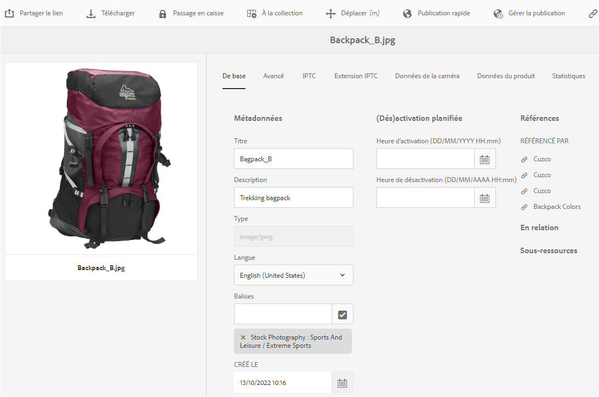
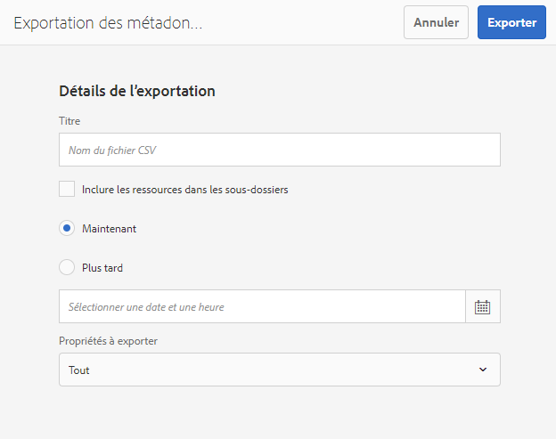
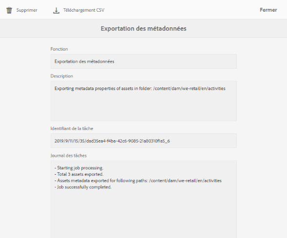

# Gestion des métadonnées des ressources numériques {#managing-metadata-for-digital-assets}

<!-- Scope of metadata articles:
* metadata.md: The scope of this article is basic metadata updates, changes, etc. operations that end-users can do.
* metadata-concepts.md: All conceptual information. Minor instructions are OK but it is an FYI article about support and standards.
* metadata-config.md: New article. Contains all configuration and administration how-to info related to metadata of assets.
-->

[!DNL Adobe Experience Manager Assets] conserve les métadonnées de chaque fichier. Cela permet d’obtenir une catégorisation et une organisation plus simples des ressources, ainsi que d’aider les personnes qui recherchent une ressource spécifique. Grâce à la possibilité d’extraire les métadonnées à partir des fichiers chargés sur [!DNL Experience Manager Assets], la gestion des métadonnées s’intègre aux workflows créatifs. La possibilité de conserver et de gérer les métadonnées de vos fichiers permet aussi d’organiser et de traiter automatiquement les fichiers en fonction de leurs métadonnées.

## Les métadonnées et leur origine {#how-to-edit-or-add-metadata}

Les métadonnées sont des informations supplémentaires sur la ressource qui peuvent faire l’objet d’une recherche. Il est ajouté aux ressources et [!DNL Experience Manager] il est traité lors du transfert d’une ressource. Vous pouvez modifier les métadonnées existantes, ajouter de nouvelles propriétés de métadonnées aux champs existants. Les entreprises ont besoin de vocabulaires de métadonnées contrôlés et fiables. Par conséquent, [!DNL Experience Manager Assets] il n’est pas possible d’ajouter à la demande de nouvelles propriétés de métadonnées. Seuls les administrateurs et les développeurs peuvent ajouter de nouvelles propriétés ou de nouveaux champs contenant des métadonnées. Les utilisateurs peuvent renseigner les champs existants avec des métadonnées.

Vous pouvez utiliser les méthodes suivantes pour ajouter des métadonnées à des ressources numériques :

* Pour commencer, les applications natives qui créent des fichiers y ajoutent des métadonnées. Par exemple, [Acrobat ajoute des métadonnées](https://helpx.adobe.com/acrobat/using/pdf-properties-metadata.html) aux fichiers PDF ou un appareil photo ajoute des métadonnées de base aux photos. Lors de la génération de fichiers, vous pouvez ajouter les métadonnées dans les applications natives elles-mêmes. Par exemple, vous pouvez [ajouter des métadonnées IPTC dans l’Adobe Lightroom](https://helpx.adobe.com/lightroom-classic/help/metadata-basics-actions.html).

* Avant de télécharger un fichier vers [!DNL Experience Manager], vous pouvez modifier et modifier des métadonnées à l’aide de l’application native utilisée pour créer un fichier ou d’une autre application de modification des métadonnées. Lorsque vous téléchargez un fichier vers un Experience Manager, les métadonnées sont traitées. Par exemple, voir comment [utiliser les métadonnées dans [!DNL Adobe Bridge]](https://helpx.adobe.com/bridge/user-guide.html/bridge/using/metadata-adobe-bridge.ug.html) et voir le panneau [balises dans [!DNL Bridge CC]](https://exchange.adobe.com/creativecloud.details.20009.aem-tags-panel-for-bridge-cc.html) [!DNL Adobe Exchange].

* Dans [!DNL Experience Manager Assets], vous pouvez ajouter ou modifier manuellement des métadonnées de fichiers dans la page [!UICONTROL Propriétés] .

* Vous pouvez utiliser les profils [de](/help/assets/metadata-config.md#metadata-profiles) métadonnées de [!DNL Experience Manager Assets] pour ajouter automatiquement des métadonnées lorsque des fichiers sont téléchargés vers DAM.

## Ajouter ou modifier des métadonnées dans [!DNL Experience Manager Assets] {#add-edit-metadata}

Pour modifier les métadonnées d’un fichier dans [!DNL Assets] l’interface utilisateur, procédez comme suit :

1. Utilisez l’une des méthodes suivantes :

   * Dans l’ [!DNL Assets] interface, sélectionnez le fichier et cliquez sur Propriétés **[!UICONTROL de la]** Vue dans la barre d’outils.
   * À partir de la miniature de la ressource, sélectionnez l’action rapide **[!UICONTROL Afficher les propriétés]**.
   * Dans la page des ressources, cliquez sur l’icône **[!UICONTROL d’informations sur les]** ressources des propriétés  Vue dans la barre d’outils.

   La page de ressources affiche toutes les métadonnées du fichier. Les métadonnées sont extraites lorsque le fichier est téléchargé (assimilé) dans [!DNL Experience Manager].

   

   *Figure : Modifiez ou ajoutez des métadonnées sur la page[!UICONTROL Propriétés]du fichier.*

1. Make edits to the metadata under the various tabs, as required, and when completed, click **[!UICONTROL Save]** from the toolbar to save your changes. Click **[!UICONTROL Close]** to return to the [!DNL Assets] web interface.

   >[!NOTE]
   >
   >Si un champ de texte est vide, cela signifie qu’aucune métadonnée n’a été définie. Vous pouvez saisir une valeur dans le champ et l’enregistrer pour ajouter cette propriété de métadonnées.

Toute modification apportée aux métadonnées d’une ressource est écrite dans les données XMP du binaire d’origine. Le processus d’écriture différée des métadonnées ajoute les métadonnées au fichier binaire d’origine. Changes made to the existing properties (such as `dc:title`) are overwritten and new properties (including custom properties like `cq:tags`) are added with the schema.

XMP write-back is supported and enabled for the platforms and file formats described in [technical requirements.](/help/sites-deploying/technical-requirements.md)

## Edit metadata properties of multiple assets {#editing-metadata-properties-of-multiple-assets}

[!DNL Adobe Enterprise Manager Assets] vous permet de modifier les métadonnées de plusieurs ressources simultanément afin de propager rapidement et en masse les modifications de métadonnées communes vers les ressources. Vous pouvez également modifier en gros les métadonnées de plusieurs collections. Utilisez la page des propriétés pour effectuer des modifications de métadonnées sur plusieurs ressources ou collections :

* Remplacer les propriétés de métadonnées par une valeur commune
* Ajouter ou modifier des balises

Pour personnaliser la page des propriétés de métadonnées, y compris l’ajout, la modification et la suppression de propriétés de métadonnées, utilisez l’éditeur de schéma.

>[!NOTE]
>
>Les méthodes de modification en masse fonctionnent pour les ressources disponibles dans un dossier ou une collection. Pour les ressources disponibles dans plusieurs dossiers ou correspondant à un critère commun, il est possible de mettre à jour [les métadonnées en masse après une recherche](search-assets.md#metadataupdates).

1. In the [!DNL Assets] user interface, navigate to the location of the assets you want to edit.
1. Sélectionnez les ressources dont vous souhaitez modifier les propriétés communes.
1. From the toolbar, click **[!UICONTROL Properties]** to open the properties page for the selected assets.

   >[!NOTE]
   >
   >Lorsque vous sélectionnez plusieurs ressources, la plus petite forme parent commune est sélectionnée. En d’autres termes, la page de propriétés affiche uniquement les champs de métadonnées communs aux pages de propriétés de tous les fichiers individuels.

1. Modifiez les propriétés de métadonnées des ressources sélectionnées dans les différents onglets.
1. Pour afficher l’éditeur de métadonnées pour une ressource spécifique, désélectionnez les autres ressources de la liste. Les champs de l’éditeur de métadonnées sont renseignés avec les métadonnées de la ressource particulière.

   >[!NOTE]
   >
   >* Dans la page des propriétés, vous pouvez supprimer des ressources de la liste des ressources en les désélectionnant. La liste des ressources contient toutes les ressources sélectionnées par défaut. Les métadonnées des ressources que vous supprimez de la liste ne sont pas mises à jour.
   >* En haut de la liste des ressources, cochez la case située en regard de l’option **[!UICONTROL Titre]** pour passer de la sélection des ressources à l’effacement de la liste, et inversement.

1. To select a different metadata schema for the assets, click **[!UICONTROL Settings]** from the toolbar, and select the desired schema.
1. Enregistrez les modifications.
1. Pour ajouter les nouvelles métadonnées aux métadonnées existantes dans les champs contenant plusieurs valeurs, sélectionnez **[!UICONTROL Mode d’ajout]**. Si vous ne sélectionnez pas cette option, les nouvelles métadonnées remplacent les métadonnées existantes dans les champs. Cliquez sur **[!UICONTROL Envoyer]**.

   >[!CAUTION]
   >
   >Pour les champs à une seule valeur, les nouvelles métadonnées ne sont pas ajoutées à la valeur existante dans le champ même si vous sélectionnez **[!UICONTROL Mode d’ajout]**.

## Importation de métadonnées  {#import-metadata}

[!DNL Assets] permet d’importer des métadonnées de ressources par lot à l’aide d’un fichier CSV. Vous pouvez effectuer des mises à jour par lot pour les ressources récemment transférées ou les ressources existantes en important un fichier CSV. Vous pouvez également assimiler des métadonnées de ressources par lot à partir d’un système tiers au format CSV.

L’importation des métadonnées est asynchrone et n’entrave pas les performances du système. La mise à jour simultanée des métadonnées pour plusieurs ressources peut être gourmande en ressources en raison de l’activité d’écriture différée XMP si l’indicateur de workflow est coché. Planifiez une importation de ce type quand le serveur est peu utilisé afin que les performances d’autres utilisateurs ne soient pas affectées.

>[!NOTE]
>
>Pour importer des métadonnées sur des espaces de noms personnalisés, commencez par enregistrer les espaces de noms.

1. Navigate to the [!DNL Assets] user interface, and click **[!UICONTROL Create]** from the toolbar.
1. Dans le menu, sélectionnez **[!UICONTROL Métadonnées]**.
1. In the **[!UICONTROL Metadata Import]** page, click **[!UICONTROL Select File]**. Sélectionnez le fichier CSV contenant les métadonnées.
1. Spécifiez les paramètres suivants. Consultez un exemple de fichier CSV à l’adresse [metadata-import-sample-file.csv](assets/metadata-import-sample-file.csv).

   | Paramètres d’importation des métadonnées | Description |
   |:---|:---|
   | [!UICONTROL Taille du lot] | Nombre de ressources dans un lot pour lesquelles les métadonnées doivent être importées. La valeur par défaut est 50. La valeur maximale est 100. |
   | [!UICONTROL Séparateur de champs] | La valeur par défaut est `,` (une virgule). Vous pouvez spécifier n’importe quel autre caractère. |
   | [!UICONTROL Délimiteur à plusieurs valeurs] | Séparateur des valeurs de métadonnées. La valeur par défaut est `|`. |
   | [!UICONTROL Lancer les workflows] | Faux par défaut. When set to `true` and default Launcher settings are in effect for the [!UICONTROL DAM Metadata WriteBack] workflow (that writes metadata to the binary XMP data). L’activation des workflows de lancement ralentit le système. |
   | [!UICONTROL Nom de colonne du chemin d’accès à la ressource] | Définit le nom de la colonne du fichier CSV avec des ressources. |

1. Click **[!UICONTROL Import]** from the toolbar. After the metadata is imported, a notification is displayed in [!UICONTROL Notification] inbox.

1. Pour vérifier l’importation correcte, accédez à la page [!UICONTROL Propriétés] d’une ressource et vérifiez les valeurs des champs.

Pour ajouter une date et un horodatage au cours de l’importation de métadonnées, utilisez le format de date et d’heure `YYYY-MM-DDThh:mm:ss.fff-00:00`. La date et l’heure sont séparées par `T`, `hh` correspond aux heures au format 24 heures, `fff` aux nanosecondes et `-00:00` au décalage du fuseau horaire. Par exemple, `2020-03-26T11:26:00.000-07:00` correspond au 26 mars 2020 à 11h26:00.000, heure du Pacifique.

>[!CAUTION]
>
>Si la date ne correspond pas au format `YYYY-MM-DDThh:mm:ss.fff-00:00`, les valeurs de date ne sont pas définies. Les formats de date du fichier CSV de métadonnées exportées sont au format `YYYY-MM-DDThh:mm:ss-00:00`. Si vous souhaitez l’importer, convertissez son contenu dans un format acceptable en ajoutant la valeur en nanosecondes indiquée par `fff`.

## Export metadata {#export-metadata}

Vous pouvez exporter des métadonnées pour plusieurs fichiers au format CSV. Les métadonnées sont exportées de manière asynchrone et n’ont aucun impact sur les performances du système. To export metadata, [!DNL Experience Manager] traverses through the properties of the asset node `jcr:content/metadata` and its child nodes and exports the metadata properties in a CSV file.

Voici quelques cas d’utilisation pour l’exportation de métadonnées par lot :

* Importation des métadonnées dans un système tiers lors de la migration des fichiers.
* Partage des métadonnées de ressources avec une équipe de projet plus large.
* Test ou contrôle des métadonnées pour la conformité.
* Externalisez les métadonnées pour les localiser séparément.

1. Sélectionnez le dossier de ressources pour lequel vous souhaitez exporter des métadonnées. Dans la barre d’outils, sélectionnez **[!UICONTROL Exporter les métadonnées]**.

1. In the [!UICONTROL Metadata Export] dialog, specify a name for the CSV file. Pour exporter des métadonnées des ressources dans les sous-dossiers, sélectionnez **[!UICONTROL Inclure les ressources dans les sous-dossiers]**.

   

1. Sélectionnez les options souhaitées. Indiquez un nom de fichier et, si nécessaire, une date.

1. Dans le champ **[!UICONTROL Propriétés à exporter]**, indiquez si vous voulez exporter toutes les propriétés ou certaines propriétés. Si vous choisissez Propriétés sélectives à exporter, ajoutez les propriétés souhaitées.

1. From the toolbar, click **[!UICONTROL Export]**. Un message confirme que les métadonnées ont été exportées. Fermez le message.

1. Ouvrez la notification de la boîte de réception pour la tâche d’exportation. Sélectionnez la tâche et cliquez sur **[!UICONTROL Ouvrir]** dans la barre d’outils. To download the CSV file with the metadata, click **[!UICONTROL CSV Download]** from the toolbar. Cliquez sur **[!UICONTROL Fermer]**.

   

   *Image : boîte de dialogue de téléchargement du fichier CSV contenant les métadonnées exportées en bloc.*

## Modification des métadonnées des collections {#collections-metadata}

Pour plus d’informations, voir [vue et modification des métadonnées](/help/assets/managing-collections-touch-ui.md#view-edit-collection-metadata) de collection et [modification des métadonnées de plusieurs collections en bloc](/help/assets/managing-collections-touch-ui.md#editing-collection-metadata-in-bulk).

## Application d’un profil de métadonnées à des dossiers {#applying-a-metadata-profile-to-folders}

<!-- TBD: Review this overview.
-->

Lorsque vous affectez un profil de métadonnées à un dossier, tout sous-dossier hérite automatiquement du profil de son dossier parent. Cela signifie que vous ne pouvez affecter qu’un seul profil de métadonnées à un dossier. Nous vous conseillons donc de choisir avec la plus grande attention la structure du dossier dans lequel vous transférez, stockez, utilisez et archivez des ressources.

Si vous avez affecté un profil de métadonnées différent à un dossier, le nouveau profil remplace le précédent. Les ressources du dossier précédent restent inchangées. Le nouveau profil est appliqué aux ressources ajoutées ultérieurement au dossier.

Les dossiers auxquels un profil est affecté sont indiqués dans l’interface utilisateur par le nom du profil apparaissant dans le nom de la carte.

Vous pouvez appliquer des profils de métadonnées à des dossiers spécifiques ou à l’ensemble des ressources.

Vous pouvez traiter une nouvelle fois des ressources dans un dossier qui comporte déjà un profil de métadonnées que vous avez modifié. Voir [Retraitement des ressources dans un dossier après avoir modifié son profil de traitement](processing-profiles.md#reprocessing-assets).

Vous pouvez appliquer un profil de métadonnées à un dossier à partir du menu **[!UICONTROL Outils]** ou, si vous êtes dans le dossier, à partir de **[!UICONTROL Propriétés]**. Cette section décrit comment appliquer des profils de métadonnées aux dossiers des deux manières.

Dans le cas des dossiers auxquels un profil est déjà affecté, le nom du profil est affiché directement sous celui du dossier.

Vous pouvez traiter une nouvelle fois des ressources dans un dossier qui comporte déjà un profil vidéo que vous avez modifié. Voir [Retraitement des ressources dans un dossier après avoir modifié son profil de traitement](processing-profiles.md#reprocessing-assets).

### Application de profils de métadonnées à des dossiers à partir de l’interface utilisateur des profils {#applying-metadata-profiles-to-folders-from-profiles-user-interface}

Pour appliquer un profil de métadonnées, procédez comme suit :

1. Click the [!DNL Experience Manager] logo and navigate to **[!UICONTROL Tools]** > **[!UICONTROL Assets]** > **[!UICONTROL Metadata Profiles]**.
1. Sélectionnez le profil de métadonnées à appliquer à un ou à plusieurs dossiers.
1. Click **[!UICONTROL Apply Metadata Profile to Folder(s)]** and select the folder or multiple folders you want use to receive the newly uploaded assets and click **[!UICONTROL Done]**. Dans le cas des dossiers auxquels un profil est déjà affecté, le nom du profil est affiché directement sous celui du dossier.

### Application de profils de métadonnées aux dossiers à partir des propriétés {#applying-metadata-profiles-to-folders-from-properties}

1. In the left rail, click **[!UICONTROL Assets]** then navigate to the folder that you want to apply a metadata profile to.
1. On the folder, click the check mark to select it and then click **[!UICONTROL Properties]**.

1. Select the **[!UICONTROL Metadata Profiles]** tab and select the profile from the popup menu and click **[!UICONTROL Save]**.

Dans le cas des dossiers auxquels un profil est déjà affecté, le nom du profil est affiché directement sous celui du dossier.

### Apply metadata profile globally {#metadata-profile-global}

Pour plus d’informations, voir [Configuration pour appliquer le profil de métadonnées globalement](/help/assets/metadata-config.md#apply-a-metadata-profile-globally).

### Remove a metadata profile from folders {#removing-a-metadata-profile-from-folders}

Lorsque vous supprimez un profil de métadonnées d’un dossier, tout sous-dossier hérite automatiquement de la suppression du profil de son dossier parent. Cependant, le traitement des fichiers qui s’est produit dans les dossiers reste intact.

Vous pouvez supprimer un profil de métadonnées d’un dossier dans le menu **[!UICONTROL Outils]** ou dans les **[!UICONTROL propriétés]** du dossier.

#### Remove metadata profiles from folders via Profiles user interface {#removing-metadata-profiles-from-folders-via-profiles-user-interface}

1. Click the [!DNL Experience Manager] logo and navigate to **[!UICONTROL Tools]** > **[!UICONTROL Assets]** > **[!UICONTROL Metadata Profiles]**.
1. Sélectionnez le profil de métadonnées à supprimer d’un ou de plusieurs dossiers.
1. Click **[!UICONTROL Remove Metadata Profile from Folder(s)]** and select the folder or multiple folders you want use to remove a profile from and click **[!UICONTROL Done]**.

   Le fait que le nom du profil n’apparaît plus sous celui du dossier indique que le profil de métadonnées n’est plus appliqué à un dossier.

#### Remove metadata profiles from folders via Properties {#removing-metadata-profiles-from-folders-via-properties}

1. Click the [!DNL Experience Manager] logo and navigate **[!UICONTROL Assets]** and then to the folder that you want to remove an metadata profile from.
1. On the folder, click the check mark to select it and then click **[!UICONTROL Properties]**.
1. Sélectionnez l’onglet **[!UICONTROL Profils de métadonnées]**, puis **[!UICONTROL Aucun]** dans le menu déroulant, et cliquez sur **[!UICONTROL Enregistrer]**. Dans le cas des dossiers auxquels un profil est déjà affecté, le nom du profil est affiché directement sous celui du dossier.

## Conseils et restrictions {#best-practices-limitations}

* Les mises à jour des métadonnées via l’interface utilisateur modifient les propriétés de métadonnées dans l’ `dc` espace de nommage. Toute mise à jour effectuée via l’API HTTP modifie les propriétés de métadonnées dans l’ `jcr` espace de nommage. Voir [comment mettre à jour les métadonnées à l’aide de l’API](/help/assets/mac-api-assets.md#update-asset-metadata)HTTP.

* Le fichier CSV pour l’importation de métadonnées de fichiers est dans un format très spécifique. Pour gagner du temps et du temps et éviter les erreurs involontaires, vous pouvez début à créer le fichier CSV en utilisant le format d’un fichier CSV exporté.

* Lors de l’importation de métadonnées à l’aide d’un fichier CSV, le format de date requis est `YYYY-MM-DDThh:mm:ss.fff-00:00`le format de date. Si un autre format est utilisé, les valeurs de date ne sont pas définies. Les formats de date du fichier CSV de métadonnées exportées sont au format `YYYY-MM-DDThh:mm:ss-00:00`. Si vous souhaitez l’importer, convertissez son contenu dans un format acceptable en ajoutant la valeur en nanosecondes indiquée par `fff`.

>[!MORELIKETHIS]
>
>* [Concepts et compréhension](metadata-concepts.md)des métadonnées.
>* [Modification des propriétés de métadonnées de plusieurs collections](managing-collections-touch-ui.md#editing-collection-metadata-in-bulk)
>* [Importation et exportation des métadonnées dans les ressources Experience Manager](https://docs.adobe.com/content/help/en/experience-manager-learn/assets/metadata/metadata-import-feature-video-use.html)

<!-- TBD: Try filling the available information in these topics to the extent possible. As and when complete, publish the sections live.

## Where to find metadata of an asset or folder {#find-metadata}

What all methods to access asset Properties. More Details option in column view. Select asset and click Properties. Keyboard shortcut `p`. What else?

## Understand metadata handling in Experience Manager {#metadata-possibilities-with-aem}

Describe the journey of an assets' metadata. What all happens to metadata when an asset is added to Experience Manager.

## Add metadata to your digital assets {#add-metadata}

* To begin with, assets come with some metadata. The applications that create digital assets add some metadata to the assets created. Before uploading an asset to Experience Manager, you can edit and modify metadata using either the native application used to create an asset or using some other metadata editing application. When you upload an asset to Experience Manager, the metadata is processed.

* Link to PS, ID, AI, PDF, etc. metadata-related help articles.

* Link to XMP writeback.

* Manually add (or edit) metadata in AEM in Properties page.

* Metadata profiles

* Any workflows related to metadata?

* Advanced topic: Add, edit, modify, process and writeback metadata of subassets.

## Metadata of assets, folders, and collections {#metadata-of-assets-folders-collections}

Similarities and differences between metadata of asset and folder. 

Link to metadata handling of collections.

## Modify metadata of an asset, folder, or collection {#modify-metadata}

* While creating assets: Native application.

* Before ingesting assets: Metadata editors

* After ingesting assets: Properties of an asset, folder, collection, etc.

* Any supported programmatic method to bulk edit metadata directly in JCR?

## Modify metadata in bulk {#modify-metadata-in-bulk}

[!DNL Adobe Enterprise Manager Assets] lets you edit the metadata of multiple assets simultaneously so you can quickly propagate common metadata changes to assets in bulk. You can also edit the metadata for multiple collections in bulk.

Use the properties page to perform metadata changes on multiple assets or collections:

* Change metadata properties to a common value

* Add or modify tags

To customize the metadata properties page, including adding, modifying, deleting metadata properties, use the schema editor.

>[!NOTE]
>
>The bulk editing methods work for assets available in a folder or a collection. For the assets that are available across folders or match a common criteria, it is possible to [bulk update the metadata after searching](search-assets.md#metadataupdates).

1. In the [!DNL Assets] user interface, navigate to the location of the assets you want to edit.
1. Select the assets for which you want to edit common properties.
1. From the toolbar, click **[!UICONTROL Properties]** to open the properties page for the selected assets.

   >[!NOTE]
   >
   >When you select multiple assets, the lowest common parent form is selected for the assets. In other words, the properties page only displays metadata fields that are common across the properties pages of all the individual assets.

1. Modify the metadata properties for selected assets under the various tabs.
1. To view the metadata editor for a specific asset, deselect the remaining assets in the list. The metadata editor fields are populated with the metadata for the particular asset.

   >[!NOTE]
   >
   >* In the Properties page, you can remove assets from the asset list by deselecting them. The asset list has all the assets selected by default. The metadata for assets that you remove from the list is not updated.
   >
   >* At the top of assets list, select the check box near **[!UICONTROL Title]** to toggle between selecting the assets and clearing the list.

1. To select a different metadata schema for the assets, click **[!UICONTROL Settings]** from the toolbar, and select the desired schema.
1. Save the changes.
1. To append the new metadata with the existing metadata in fields that contain multiple values, select **[!UICONTROL Append mode]**. If you do not select this option, the new metadata replaces the existing metadata in the fields. click **[!UICONTROL Submit]**.

   >[!CAUTION]
   >
   >For single-value fields, the new metadata is not appended to the existing value in the field even if you select **[!UICONTROL Append mode]**.

-->
