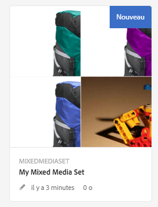
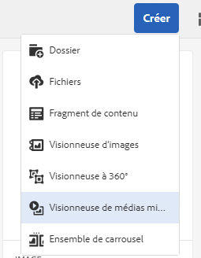
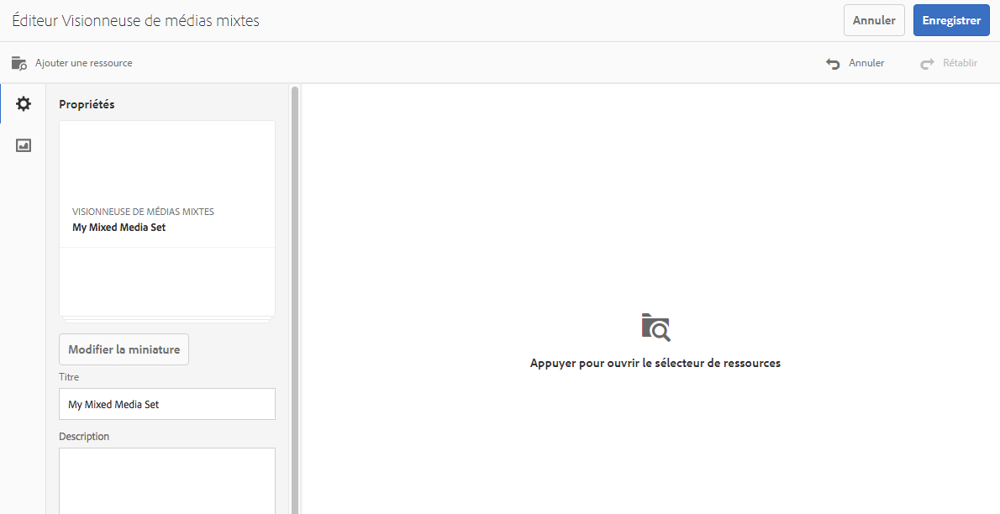
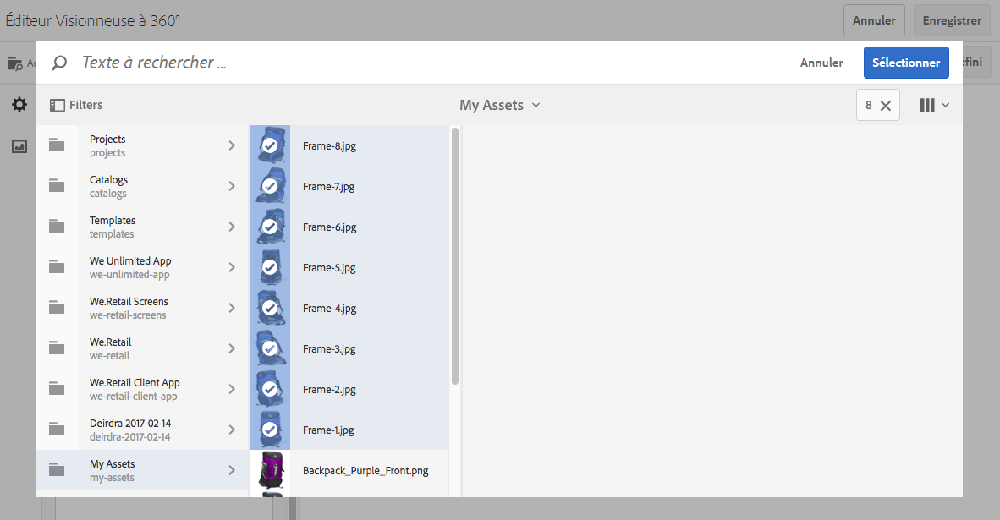
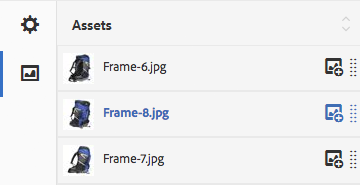

# Visionneuses de médias mixtes{#mixed-media-sets}

Une visionneuse de médias mixtes permet d’offrir un mélange d’images, de visionneuses d’images, de visionneuses à 360° et de vidéos dans une même présentation.

Les visionneuses de médias mixtes sont désignées par une bannière contenant les mots **[!UICONTROL Visionneuse de médias mixtes]**. En outre, si la visionneuse de médias mixtes est publiée, la date de publication, indiquée par l’icône représentant la **[!UICONTROL Terre]**, figure sur la bannière avec la date de dernière modification, indiquée par l’icône représentant un **[!UICONTROL crayon]**.

>[!NOTE]
>
>Pour plus d’informations sur l’interface utilisateur d’Assets, consultez la [Gestion des ressources](/help/assets/manage-assets.md).

## Démarrage rapide : Visionneuses de médias mixtes {#quick-start-mixed-media-sets}

Pour démarrer rapidement, procédez comme suit :

1. [Chargement de vos ressources](#uploading-assets).

   Commencez par charger les images et les vidéos pour les visionneuses de médias mixtes. Le cas échéant, créez les [Visionneuses d’images](/help/assets/image-sets.md) et [Visionneuses à 360°](/help/assets/spin-sets.md). Comme les utilisateurs peuvent zoomer sur les images dans la visionneuse de médias mixtes, choisissez les images avec soin. Assurez-vous que les images font au moins 2 000 pixels dans leur dimension la plus grande.

   Voir [Dynamic Media - Formats d’image raster pris en charge](/help/assets/assets-formats.md#supported-raster-image-formats-dynamic-media) pour obtenir une liste des formats pris en charge par les ensembles de supports variés.

1. [Créez des ensembles de supports variés](#creating-mixed-media-sets).

   Pour créer une visionneuse de médias mixtes, dans la page Ressources, sélectionnez **[!UICONTROL Créer]** > **[!UICONTROL Visionneuse de médias mixtes]**. Attribuez ensuite un nom à la visionneuse, sélectionnez des ressources et choisissez l’ordre dans lequel doivent apparaître les images.

   Voir [Utilisation de sélecteurs](/help/assets/working-with-selectors.md).

1. Configurez des [paramètres prédéfinis de visionneuse de médias mixtes](/help/assets/managing-viewer-presets.md), suivant les besoins.

   Les administrateurs peuvent créer ou modifier les paramètres prédéfinis de visionneuse de médias mixtes. Pour afficher votre visionneuse de médias mixtes avec un paramètre prédéfini, sélectionnez la visionneuse puis, dans le menu contextuel du rail gauche, sélectionnez **[!UICONTROL Visionneuses]**.

   Pour créer ou modifier des paramètres prédéfinis de visionneuse, accédez à **[!UICONTROL Outils]** > **[!UICONTROL Ressources]** > **[!UICONTROL Paramètre prédéfini de visionneuse]**.

   Consultez la section [Ajout et modification des paramètres prédéfinis de visionneuse](/help/assets/managing-viewer-presets.md).

1. [Prévisualisez une visionneuse de médias mixtes](#previewing-mixed-media-sets).

   Sélectionnez la visionneuse de médias mixtes pour pouvoir la prévisualiser. Cliquez sur les icônes des miniatures afin d’examiner votre visionneuse de médias mixtes dans la visionneuse sélectionnée. Vous pouvez choisir différentes visionneuses dans le menu **[!UICONTROL Visionneuses]** disponible dans le menu déroulant du rail gauche.

1. [Publiez une visionneuse de médias mixtes](#publishing-mixed-media-sets).

   La publication d’une visionneuse de médias mixtes active la chaîne URL et d’incorporation. Vous devez, en outre, [publier le paramètre prédéfini de la visionneuse](/help/assets/managing-viewer-presets.md#publishing-viewer-presets).

1. [Liez des URL à l’application web](/help/assets/linking-urls-to-yourwebapplication.md) ou [incorporez la vidéo ou la visionneuse d’images](/help/assets/embed-code.md).

   Adobe Experience Manager Assets crée des appels URL pour les visionneuses de médias mixtes et les active une fois que vous avez publié les visionneuses. Vous pouvez copier ces URL lorsque vous prévisualisez les ressources. Vous pouvez également les incorporer à votre site web.

   Sélectionnez la visionneuse de médias mixtes puis, dans le menu déroulant du rail gauche, sélectionnez **[!UICONTROL Visionneuses]**.

   Voir [Liaison d’une visionneuse de médias mixtes à une page web](/help/assets/linking-urls-to-yourwebapplication.md) et [Intégration de la vidéo ou de la visionneuse d’images](/help/assets/embed-code.md).

Si nécessaire, vous pouvez modifier les [Visionneuses de médias mixtes](#editing-mixed-media-sets). Vous pouvez, en outre, afficher et modifier les [propriétés de la visionneuse de médias mixtes](/help/assets/manage-assets.md#editing-properties).

>[!NOTE]
>
>Si vous rencontrez des problèmes lors de la création des visionneuses, consultez la section [Dépannage de Dynamic Media en mode Scene7](/help/assets/troubleshoot-dms7.md).

## Chargement des ressources {#uploading-assets}

Commencez par charger les images et les vidéos pour les visionneuses de médias mixtes. Comme les utilisateurs peuvent zoomer sur les images dans la visionneuse de médias mixtes, choisissez les images avec soin. Assurez-vous que les images font au moins 2 000 pixels dans leur dimension la plus grande.

Si vous souhaitez ajouter des visionneuses à 360° ou des visionneuses d’images à la visionneuse de médias mixtes, créez-les aussi.

Consultez la section [Dynamic Media - Formats d’image matricielle pris en charge](/help/assets/assets-formats.md#supported-raster-image-formats-dynamic-media) pour obtenir une liste des formats pris en charge par les visionneuse de médias mixtes.

## Création d’une visionneuse de médias mixtes {#creating-mixed-media-sets}

Vous pouvez ajouter des images, des visionneuses d’images, des visionneuses à 360° et des vidéos à votre visionneuse de médias mixtes. Assurez-vous que les fichiers, visionneuses d’images et visionneuses à 360° sont prêts pour la publication avant de les ajouter à la visionneuse de médias mixtes.

Lorsque vous ajoutez des ressources à votre visionneuse, elles sont automatiquement ajoutées dans l’ordre alphanumérique. Vous pouvez réorganiser ou trier manuellement les ressources après les avoir ajoutées.

**Création d’une visionneuse de médias mixtes :**

1. Dans Ressources, accédez à l’emplacement où vous souhaitez créer un jeu de médias mixtes, cliquez sur **[!UICONTROL Créer]**, puis sélectionnez **[!UICONTROL Jeu de médias mixtes]**. Vous pouvez également la créer depuis un dossier qui contient les ressources. L’éditeur de visionneuse de médias mixtes s’affiche.

   

1. Dans le **[!UICONTROL Titre]** de la visionneuse de médias mixtes, saisissez un nom pour la visionneuse. Le nom apparaît dans la bannière de la visionneuse de médias mixtes. Vous pouvez aussi saisir une description.

   

   >[!NOTE]
   >
   >Lors de la création de la visionneuse de médias mixtes, vous pouvez modifier la miniature de la visionneuse ou permettre à Experience Manager de sélectionner la miniature automatiquement en fonction des ressources de la visionneuse de médias mixtes. Pour sélectionner une miniature, sélectionnez **[!UICONTROL Modifier la miniature]** et sélectionnez une image (vous pouvez également accéder à d’autres dossiers pour trouver des images). Si vous avez sélectionné une miniature, puis décidé que vous souhaitez qu’Experience Manager en génère une depuis la visionneuse de médias mixtes, sélectionnez **[!UICONTROL Basculer vers les miniatures automatiques]**.

1. Sélectionnez le sélecteur de ressources pour pouvoir sélectionner les ressources à inclure dans votre visionneuse de médias mixtes. Sélectionnez-les, puis sélectionnez **[!UICONTROL Sélectionner]**.

   Le sélecteur de ressources vous permet de rechercher des ressources en saisissant un mot-clé, puis en appuyant sur **[!UICONTROL Retour]**. Vous pouvez également appliquer des filtres pour affiner vos résultats de recherche. Vous pouvez filtrer par chemin, collection, type de fichier et balise. Sélectionnez le filtre, puis sélectionnez l’icône **[!UICONTROL Filtre]** de la barre d’outils. Modifiez l’affichage en sélectionnant l’icône **[!UICONTROL Vue]** et en choisissant ensuite la vue **[!UICONTROL Liste]**, **[!UICONTROL Colonnes]** ou **[!UICONTROL Carte]**.

   Consultez la section [Utilisation de sélecteurs](/help/assets/working-with-selectors.md).

   

1. Réorganisez les ressources en les faisant glisser vers le haut ou le bas de la liste (sélectionnez l’icône de **[!UICONTROL réorganisation]**), le cas échéant.

   

   Si vous souhaitez ajouter une miniature, sélectionnez l’icône **+** **[!UICONTROL miniature]** située en regard de l’image et accédez à la miniature de votre choix. Lorsque vous avez terminé de sélectionner toutes les miniatures, sélectionnez **[!UICONTROL Enregistrer]**.

   >[!NOTE]
   >
   >Si vous souhaitez ajouter des ressources, sélectionnez **[!UICONTROL Ajouter une ressource]**.

1. Pour supprimer une ressource, sélectionnez la case correspondante, puis sélectionnez **[!UICONTROL Supprimer la ressource]**.
1. Pour appliquer un paramètre prédéfini aux ressources, sélectionnez **[!UICONTROL Paramètre prédéfini]** dans le coin supérieur droit, puis sélectionnez le paramètre prédéfini de votre choix.
1. Sélectionnez **[!UICONTROL Enregistrer]**. La visionneuse de médias mixtes nouvellement créée apparaît dans le dossier dans lequel vous l’avez créée.

## Modification d’une visionneuse de médias mixtes {#editing-mixed-media-sets}

Vous pouvez effectuer différentes tâches de modification sur les ressources dans les visionneuses de médias mixtes, directement dans l’interface utilisateur, [comme vous le feriez dans AEM Assets](/help/assets/manage-assets.md). Vous pouvez également effectuer les actions suivantes dans les visionneuses de médias mixtes :

* Ajouter des ressources à la visionneuse de médias mixtes.
* Réorganiser des ressources de la visionneuse de médias mixtes.
* Supprimer des ressources de la visionneuse de médias mixtes.
* Appliquez des paramètres prédéfinis de visionneuse.
* Modifiez la miniature par défaut.

**Modification d’une visionneuse de médias mixtes :**

1. Effectuez l’une des opérations suivantes :

   * Pointez sur une ressource de visionneuse de médias mixtes, puis sélectionnez **[!UICONTROL Modifier]** (icône crayon).
   * Pointez sur une ressource de visionneuse de médias mixtes, sélectionnez **[!UICONTROL Sélectionner]** (icône de coche), puis **[!UICONTROL Modifier]** dans la barre d’outils.

   * Sélectionnez une ressource de visionneuse de médias mixtes puis sélectionnez **[!UICONTROL Modifier]** (icône de crayon) sur la barre d’outils.

1. Dans l’éditeur de visionneuse de médias mixtes, effectuez l’une des actions suivantes :

   * Pour réorganiser les éléments : dans le panneau de gauche, sélectionnez **[!UICONTROL Ressources]** (icône image), puis faites glisser une ressource vers un nouvel emplacement.
   * Pour ajouter des ressources : dans la barre d’outils, sélectionnez **[!UICONTROL Ajouter une ressource]**. Accédez aux ressources. Pour chaque élément à ajouter, pointez sur l’image de la ressource (et non sur son nom), puis sélectionnez l’icône de coche. Dans le coin supérieur droit, sélectionnez **[!UICONTROL Sélectionner]**.

   * Pour supprimer une ressource : dans le panneau de gauche, sélectionnez **[!UICONTROL Ressources]** (icône image), puis sélectionnez la ressource. Dans la barre d’outils, sélectionnez **[!UICONTROL Supprimer l’élément]**.

   * Pour trier des ressources selon leur nom par ordre croissant ou décroissant, dans le panneau de gauche, sélectionnez **[!UICONTROL Ressources]** (icône image). À droite de l’en-tête **[!UICONTROL Ressources]**, sélectionnez les icônes lambda vers le haut ou vers le bas.

     >[!NOTE]
     >
     >* Pour supprimer une visionneuse de médias mixtes dans son ensemble, depuis n’importe quel mode d’affichage (**[!UICONTROL Carte]** ou **[!UICONTROL Colonnes]**, par exemple), accédez à la visionneuse de médias mixtes. Placez le pointeur de la souris sur la ressource et sélectionnez l’icône de coche pour la sélectionner. Appuyez sur la touche **[!UICONTROL Retour arrière]** du clavier ou sélectionnez **[!UICONTROL Plus]** (points de suspension) dans la barre d’outils, puis sélectionnez **[!UICONTROL Supprimer]**.
     >
     >* Vous pouvez modifier des ressources dans une visionneuse de médias mixtes en y accédant, puis en cliquant sur **[!UICONTROL Définir des membres]** dans le rail de gauche. Sélectionnez l’icône **[!UICONTROL Crayon]** sur une ressource individuelle afin de l’ouvrir dans la fenêtre d’édition.

1. Sélectionnez **[!UICONTROL Enregistrer]** lorsque vous avez terminé la modification.

   >[!NOTE]
   >
   >* Pour modifier les ressources dans une visionneuse de médias mixtes – Accédez à la visionneuse de médias mixtes. Sélectionnez la visionneuse (ne la sélectionnez pas) pour qu’elle s’ouvre dans la page Aperçu de la visionneuse de Experience Manager. Dans le rail de gauche, sélectionnez l’icône lambda vers le bas pour ouvrir la liste déroulante, puis sélectionnez **[!UICONTROL Définir les membres]**. Dans la page Définir des membres, passez la souris sur une ressource, puis sélectionnez **[!UICONTROL Modifier]** (icône représentant un crayon) pour ouvrir la page de modification.
   >
   >* Pour supprimer une visionneuse de médias mixtes dans son ensemble – À partir de n’importe quel mode d’affichage (Mode Carte ou Colonne, par exemple), accédez à la visionneuse de médias mixtes. Pointez sur la visionneuse, puis sélectionnez **Sélectionner** (icône de coche). Appuyez sur la touche **[!UICONTROL Retour arrière]** de votre clavier ou sélectionnez **[!UICONTROL Plus]** (trois points de suspension), puis **[!UICONTROL Supprimer]**.

## Aperçu de la visionneuse de médias mixtes {#previewing-mixed-media-sets}

Pour obtenir des informations sur la prévisualisation d’une visionneuse de médias mixtes, consultez la section [Aperçu des ressources](/help/assets/previewing-assets.md).

## Publication d’une visionneuse de médias mixtes {#publishing-mixed-media-sets}

Pour obtenir des informations sur la publication d’une visionneuse de médias mixtes, consultez la section [Publication de ressources](/help/assets/publishing-dynamicmedia-assets.md).

>[!NOTE]
>
>Si la visionneuse de médias mixtes n’apparaît pas complètement dans le service de diffusion la première fois que vous la publiez, publiez-la une seconde fois.
