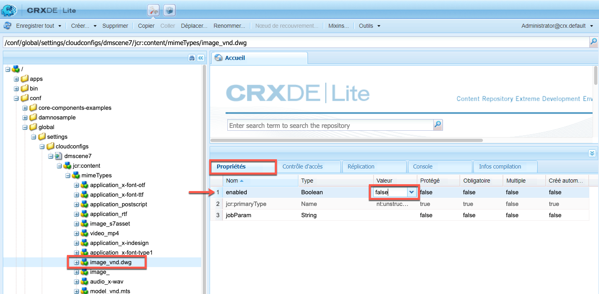
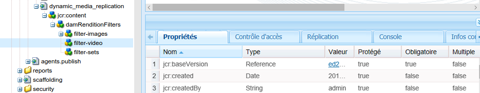

# OPTION A - Configuration de Dynamic Media - mode Scene7{#configuring-dynamic-media-scene-mode}

>[!NOTE]
>
>OPTION A - LES DEUX NOUVELLES RUBRIQUES QUE J’AI ÉCRITES SONT SUPPRIMÉES. MAIS AVANT DE SUPPRIMER LES RUBRIQUES, TOUT LEUR CONTENU A ÉTÉ DÉPLACÉ DANS CETTE RUBRIQUE, DANS LES ZONES RESPECTIVES DANS LESQUELLES JE PARLE DÉJÀ DES PARAMÈTRES GÉNÉRAUX ET DE LA CONFIGURATION DE PUBLICATION.

Si vous utilisez Adobe Experience Manager configuré pour différents environnements, tels que le développement, l’évaluation et la production, configurez les Cloud Services Dynamic Media pour chacun de ces environnements.

## Schéma d’architecture de Dynamic Media – mode Scene7 {#architecture-diagram-of-dynamic-media-scene-mode}

**RICK : CONSERVER TEL QUEL**

Le schéma d’architecture suivant décrit le fonctionnement de Dynamic Media – mode Scene7.

Avec la nouvelle architecture, Experience Manager est responsable des ressources source Principales et des synchronisations avec Dynamic Media pour le traitement et la publication des ressources :

1. Lorsque la ressource source Principale est téléchargée vers Experience Manager, elle est répliquée vers Dynamic Media. À ce stade, Dynamic Media gère l’intégralité du traitement des ressources et de la génération du rendu, comme le codage vidéo et les variantes dynamiques d’une image.
(En mode Dynamic Media - Scene7, la taille du fichier de chargement par défaut est de 2 Go ou moins. Pour activer des tailles de fichier de téléchargement allant de 2 Go à 15 Go, voir [(Facultatif) Configurez le mode Dynamic Media - Scene7 pour le chargement de ressources d’une taille supérieure à 2 Go.](#optional-config-dms7-assets-larger-than-2gb).)
1. Une fois les rendus générés, Experience Manager peut accéder en toute sécurité aux rendus Dynamic Media distants et les prévisualiser (aucune donnée binaire n’est renvoyée à l’instance de Experience Manager).
1. Une fois que le contenu est prêt à être publié et approuvé, il déclenche le service Dynamic Media pour diffuser du contenu vers les serveurs de diffusion et mettre en cache le contenu sur le réseau de diffusion de contenu (CDN).


>[!IMPORTANT]
>
>La liste suivante de fonctionnalités nécessite l’utilisation du réseau de diffusion de contenu prêt à l’emploi fourni avec Adobe Experience Manager - Dynamic Media. Les autres réseaux de diffusion de contenu personnalisés ne sont pas pris en charge avec ces fonctionnalités.
>
>* [Imagerie dynamique](/help/assets/imaging-faq.md)
>* [Invalidation du cache](/help/assets/invalidate-cdn-cache-dynamic-media.md)
>* [Protection des liens dynamiques](/help/assets/hotlink-protection.md)
>* [Diffusion de contenu HTTP/2](/help/assets/http2.md)
>* Redirection d’URL au niveau du réseau de diffusion de contenu
>* Akamai ChinaCDN (pour une diffusion optimale en Chine)


## Activation de Dynamic Media en mode Scene7 {#enabling-dynamic-media-in-scene-mode}

**RICK : CONSERVER TEL QUEL**

[Par défaut, ce module complémentaire est désactivé. ](https://business.adobe.com/products/experience-manager/assets/dynamic-media.html) Pour tirer parti des fonctionnalités de Dynamic Media, vous devez l’activer.

>[!WARNING]
>
>Dynamic Media : le mode Scene7 est pour la variable *Instance de création de Experience Manager uniquement*. Par conséquent, vous devez configurer `runmode=dynamicmedia_scene7` sur l’instance d’auteur du Experience Manager, *not* l’instance de publication du Experience Manager.

Pour activer Dynamic Media, vous devez démarrer Experience Manager à l’aide du `dynamicmedia_scene7` le mode d’exécution à partir de la ligne de commande en saisissant ce qui suit dans une fenêtre de terminal (l’exemple de port utilisé est 4502) :

```shell
java -Xms4096m -Xmx4096m -Doak.queryLimitInMemory=500000 -Doak.queryLimitReads=500000 -jar cq-quickstart-6.5.0.jar -gui -r author,dynamicmedia_scene7 -p 4502
```

## (Facultatif) Migration des paramètres prédéfinis et des configurations Dynamic Media de la version 6.3 vers la version 6.5 sans interruption {#optional-migrating-dynamic-media-presets-and-configurations-from-to-zero-downtime}

**RICK : CONSERVER TEL QUEL**

La mise à niveau de Experience Manager Dynamic Media de la version 6.3 vers la version 6.4 ou 6.5 inclut désormais la possibilité de réaliser des déploiements sans interruption. Pour migrer tous vos paramètres prédéfinis et configurations depuis `/etc` to `/conf` dans CRXDE Lite, veillez à exécuter la commande curl suivante.

>[!NOTE]
>
>Si vous exécutez votre instance de Experience Manager en mode de compatibilité (c’est-à-dire si le package de compatibilité est installé), vous n’avez pas besoin d’exécuter ces commandes.

Pour toutes les mises à niveau, avec ou sans le module de compatibilité, vous pouvez copier les paramètres prédéfinis de visionneuse par défaut fournis avec Dynamic Media en exécutant la commande curl Linux® suivante :

`curl -u admin:admin -X POST https://<server_address>:<server_port>/libs/settings/dam/dm/presets/viewer.pushviewerpresets.json`

Pour migrer les paramètres prédéfinis et configurations de visionneuse personnalisés que vous avez créés `/etc` to `/conf`, exécutez la commande curl Linux® suivante :

`curl -u admin:admin -X POST https://<server_address>:<server_port>/libs/settings/dam/dm/presets.migratedmcontent.json`

## Installer le Feature Pack 18912 pour la migration de ressources en masse {#installing-feature-pack-for-bulk-asset-migration}

**RICK : CONSERVER TEL QUEL**

L’installation du Feature Pack 18912 est *facultatif*.

Le Feature Pack 18912 vous permet soit d’ingérer des ressources par FTP en masse, soit de migrer des ressources du mode Dynamic Media - Hybride ou de Dynamic Media Classic vers le mode Dynamic Media - Scene7 sur Experience Manager. Il est disponible à partir de [Adobe Professional Services](https://business.adobe.com/customers/consulting-services/main.html).

Voir [Installer le Feature Pack 18912 pour la migration de ressources en masse](/help/assets/bulk-ingest-migrate.md) pour plus d’informations.

## Création d’une configuration Dynamic Media dans Cloud Services {#configuring-dynamic-media-cloud-services}

**RICK : CONSERVER TEL QUEL**

**Avant de configurer Dynamic Media** - Une fois que vous avez reçu l’e-mail de mise en service avec les informations d’identification Dynamic Media, vous devez ouvrir le [application de bureau Dynamic Media Classic](https://experienceleague.adobe.com/docs/dynamic-media-classic/using/getting-started/signing-out.html?lang=fr#getting-started), puis connectez-vous à votre compte pour modifier votre mot de passe. Le mot de passe fourni dans l’e-mail de mise en service est généré par le système et il est attribué uniquement de manière temporaire. Il est important que vous mettiez à jour le mot de passe afin que Dynamic Media Cloud Service soit configuré avec les informations d’identification correctes.


**Pour créer une configuration Dynamic Media en Cloud Services :**

1. En mode Création de Experience Manager, sélectionnez le logo du Experience Manager pour accéder à la console de navigation globale, sélectionnez l’icône Outils, puis accédez à **[!UICONTROL Cloud Services]** > **[!UICONTROL Configuration Dynamic Media]**.
1. Sur la page du navigateur de configuration Dynamic Media, dans le volet de gauche, sélectionnez **[!UICONTROL global]** (ne sélectionnez pas l’icône de dossier située à gauche de **[!UICONTROL global]**), puis sélectionnez **[!UICONTROL Créer]**.
1. Sur la page **[!UICONTROL Créer une configuration Dynamic Media]**, saisissez un titre, l’adresse email du compte Dynamic Media et un mot de passe, puis sélectionnez votre région. Ces informations vous sont fournies par Adobe dans l’e-mail de mise en service. Si vous n’avez pas reçu le courrier électronique, contactez le service clientèle d’Adobe.

   Sélectionnez **[!UICONTROL Connexion à Dynamic Media]**.

   >[!NOTE]
   **RICK : CONSERVEZ-LE TEMPS??** Une fois que vous avez reçu l’e-mail de mise en service avec les informations d’identification Dynamic Media, ouvrez le [application de bureau Dynamic Media Classic](https://experienceleague.adobe.com/docs/dynamic-media-classic/using/getting-started/signing-out.html#getting-started), puis connectez-vous à votre compte pour modifier votre mot de passe. Le mot de passe fourni dans l’e-mail de mise en service est généré par le système et il est attribué uniquement de manière temporaire. Il est important que vous mettiez à jour le mot de passe afin que Dynamic Media Cloud Service soit configuré avec les informations d’identification correctes.

1. Lorsque la connexion est établie, définissez les options suivantes. Les en-têtes avec un astérisque (*) sont obligatoires :

   * **[!UICONTROL Société]** : nom du compte Dynamic Media. Vous disposez de plusieurs comptes Dynamic Media. Par exemple, vous pouvez avoir différentes sous-marques, divisions, environnements d’évaluation ou environnements de production.

   * **[!UICONTROL Chemin d’accès au dossier racine de l’entreprise]**

   * **[!UICONTROL Publication de ressources]** : vous pouvez choisir parmi les trois options suivantes :
      * **[!UICONTROL Immédiatement]** signifie que lorsque les ressources sont chargées, le système intègre les ressources et fournit instantanément l’URL/le code intégré. Aucune intervention n’est nécessaire de la part de l’utilisateur pour publier des ressources.
      * **[!UICONTROL Lors de l’activation]** signifie que vous devez publier explicitement la ressource avant qu’un lien URL/code intégré ne soit fourni.<br><!-- CQDOC-17478, Added March 9, 2021-->À partir de la version 6.5.8 de Experience Manager, l’instance de publication de Experience Manager reflète des valeurs de métadonnées Dynamic Media précises, telles que `dam:scene7Domain` et `dam:scene7FileStatus` in **[!UICONTROL Lors de l’activation]** mode de publication uniquement. Pour activer cette fonctionnalité, installez le Service Pack 8, puis redémarrez Experience Manager. Accédez au Gestionnaire de configuration Sling. Recherchez la configuration pour `Scene7ActivationJobConsumer Component` ou en créer un). Cochez la case **[!UICONTROL Réplication des métadonnées après publication sur Dynamic Media]**, puis sélectionnez **[!UICONTROL Enregistrer]**.

         

      * **[!UICONTROL Publication sélective]** Cette option vous permet de contrôler les dossiers publiés dans Dynamic Media. Il vous permet d’utiliser des fonctionnalités telles que le recadrage intelligent ou les rendus dynamiques, ou de déterminer les dossiers qui sont publiés exclusivement en Experience Manager à des fins de prévisualisation. Ces mêmes ressources sont *not* publié dans Dynamic Media pour diffusion dans le domaine public.<br>Vous pouvez définir cette option ici dans le **[!UICONTROL Configuration du cloud Dynamic Media]** ou, si vous préférez, vous pouvez choisir de définir cette option au niveau du dossier, dans le **[!UICONTROL Propriétés]**.<br>Voir [Utilisation de la publication sélective dans Dynamic Media](/help/assets/selective-publishing.md).<br>Si vous modifiez cette configuration par la suite ou au niveau du dossier, ces modifications n’affectent que les nouvelles ressources que vous chargez à partir de ce moment-là. L’état de publication des ressources existantes dans le dossier reste tel quel jusqu’à ce que vous modifiiez manuellement ces ressources à partir de la boîte de dialogue **[!UICONTROL Publication rapide]** ou **[!UICONTROL Gérer la publication]**.
   * **[!UICONTROL Serveur d’aperçu sécurisé]** : permet de définir le chemin URL de votre serveur d’aperçu des rendus sécurisé. En d’autres termes, une fois les rendus générés, Experience Manager peut accéder en toute sécurité aux rendus Dynamic Media distants et les prévisualiser (aucune donnée binaire n’est renvoyée à l’instance de Experience Manager).
À moins que vous ayez pris des dispositions spéciales pour utiliser le serveur de votre entreprise ou un serveur spécial, Adobe vous conseille de conserver ce paramètre tel que spécifié.

   * **[!UICONTROL Synchroniser tout le contenu]** - <!-- NEW OPTION, CQDOC-15371, Added March 4, 2020-->Sélectionné par défaut. Désélectionnez cette option si vous souhaitez inclure ou exclure des ressources de la synchronisation avec Dynamic Media. La désélection de cette option vous permet de choisir l’un des deux modes de synchronisation Dynamic Media :

   * **[!UICONTROL Mode de synchronisation Dynamic Media]**
      * **[!UICONTROL Activé par défaut]** : la configuration s’applique par défaut à tous les dossiers, sauf si vous marquez un dossier spécifique à exclure. <!-- you can then deselect the folders that you do not want the configuration applied to.-->
      * **[!UICONTROL Désactivé par défaut]** : la configuration n’est appliquée à aucun dossier tant que vous ne marquez pas explicitement un dossier sélectionné pour synchronisation avec Dynamic Media.
Pour marquer un dossier sélectionné en vue de sa synchronisation avec Dynamic Media, sélectionnez un dossier de ressources, puis, sur la barre d’outils, sélectionnez **[!UICONTROL Propriétés]**. Sous l’onglet **[!UICONTROL Détails]**, dans la liste déroulante **[!UICONTROL Mode de synchronisation Dynamic Media]**, choisissez l’une des trois options suivantes. Une fois le choix effectué, sélectionnez **[!UICONTROL Enregistrer]**. *À retenir : ces trois options ne sont pas disponibles si vous avez sélectionné auparavant **[!UICONTROL Synchroniser tout le contenu]**.* Voir aussi [Utilisation de la publication sélective au niveau du dossier dans Dynamic Media](/help/assets/selective-publishing.md).
         * **[!UICONTROL Hérité]** - Aucune valeur de synchronisation explicite sur le dossier ; au lieu de cela, le dossier hérite de la valeur de synchronisation de l’un de ses dossiers ancêtres ou du mode par défaut dans la configuration cloud. Le statut détaillé de l’héritage s’affiche par le biais d’une info-bulle.
         * **[!UICONTROL Activé pour les sous-dossiers]** : incluez tous les éléments de cette sous-arborescence dans la synchronisation avec Dynamic Media. Les paramètres propres au dossier remplacent le mode par défaut dans la configuration du cloud.
         * **[!UICONTROL Désactivé pour les sous-dossiers]** : excluez tous les éléments de cette sous-arborescence de la synchronisation avec Dynamic Media.

   >[!NOTE]
   Le contrôle de version n’est pas pris en charge dans DMS7. En outre, l’activation différée ne s’applique que si l’option **[!UICONTROL Publier des ressources]** dans la page de configuration de Dynamic Media est définie sur **[!UICONTROL Dès l’activation]**, puis uniquement jusqu’à la première activation de la ressource.
   Une fois qu’une ressource est activée, toutes les mises à jour sont immédiatement publiées en direct sur la livraison S7.

1. Sélectionnez **[!UICONTROL Enregistrer]**.
1. Pour prévisualiser en toute sécurité le contenu Dynamic Media avant qu’il ne soit publié, vous devez &quot;placer sur la liste autorisée&quot; l’instance d’auteur du Experience Manager pour vous connecter à Dynamic Media :

   * **RICK : LIEN VERS LA NOUVELLE RUBRIQUE DE CONFIGURATION DE PUBLICATION** Ouvrez le [application de bureau Dynamic Media Classic](https://experienceleague.adobe.com/docs/dynamic-media-classic/using/getting-started/signing-out.html#getting-started), puis connectez-vous à votre compte . Vos informations d’identification et de connexion vous ont été communiquées par Adobe au moment de la configuration. Si vous ne disposez pas de ces informations, contactez le service clientèle d’Adobe.

   * Dans la barre de navigation située en haut à droite de la page, accédez à **[!UICONTROL Configuration]** > **[!UICONTROL Configuration de l’application]** > **[!UICONTROL Configuration de la publication]** > **[!UICONTROL Serveur d’images]**.

   * Sur la page Publication sur hébergeur d’images, dans la liste déroulante Contexte de publication, sélectionnez **[!UICONTROL Test de l’hébergeur d’images]**.
   * Pour l’option Filtre d’adresse client, sélectionnez **[!UICONTROL Ajouter]**.
   * Pour activer l’adresse, cochez la case. Saisissez l’adresse IP de l’instance d’auteur du Experience Manager (et non l’adresse IP du Dispatcher).
   * Sélectionnez **[!UICONTROL Enregistrer]**.

Vous avez à présent terminé la configuration de base ; vous êtes prêt à utiliser le mode Scene7 de Dynamic Media.

Si vous souhaitez personnaliser davantage votre configuration, vous pouvez éventuellement effectuer l’une des tâches de la section [(Facultatif) Configuration des paramètres avancés en mode Dynamic Media - Scene7](#optional-configuring-advanced-settings-in-dynamic-media-scene-mode).

## (Facultatif) Configuration des paramètres avancés en mode Dynamic Media - Scene7 {#optional-configuring-advanced-settings-in-dynamic-media-scene-mode}

**RICK : CONSERVER TEL QUEL**

Si vous souhaitez personnaliser davantage l’installation et la configuration du mode Scene7 de Dynamic Media, ou en optimiser les performances, vous pouvez effectuer une ou plusieurs des tâches *facultatives* suivantes :

* [(Facultatif) Configurez le mode Dynamic Media - Scene7 pour le chargement de ressources d’une taille supérieure à 2 Go.](#optional-config-dms7-assets-larger-than-2gb)

* [(Facultatif) Installation et configuration des paramètres du mode Scene7 de Dynamic Media](#optional-setup-and-configuration-of-dynamic-media-scene7-mode-settings)

* [(Facultatif) Réglage des performances du mode Dynamic Media - Scene7](#optional-tuning-the-performance-of-dynamic-media-scene-mode)

* [(Facultatif) Filtrage des ressources pour la réplication](#optional-filtering-assets-for-replication)

### (Facultatif) Configurez le mode Dynamic Media - Scene7 pour le chargement de ressources d’une taille supérieure à 2 Go. {#optional-config-dms7-assets-larger-than-2gb}

**RICK : CONSERVER TEL QUEL**

En mode Dynamic Media - Scene7, la taille de fichier de chargement de ressource par défaut est de 2 Go ou moins. Cependant, vous pouvez éventuellement configurer le chargement de ressources de plus de 2 Go et de 15 Go.

Si vous avez l’intention d’utiliser cette fonction, tenez compte des conditions préalables et des points suivants :

* Vous devez exécuter Experience Manager 6.5 avec Service Pack 6.5.4.0 ou version ultérieure en mode Dynamic Media - Scene7 .
* Cette fonctionnalité de chargement volumineuse n’est prise en charge que pour [*Managed Services*](https://business.adobe.com/products/experience-manager/managed-services.html) clients.
* Assurez-vous que votre instance de Experience Manager est configurée avec le stockage Azure Blob Amazon S3 ou Microsoft®.

   >[!NOTE]
   Configurez le stockage Blob de Microsoft Azure avec une clé d’accès et une clé secrète, car cette fonctionnalité de chargement volumineuse n’est pas prise en charge avec AzureSas dans la configuration de stockage Blob.

* Oak&#39;s [Téléchargement Direct Binary Access](https://jackrabbit.apache.org/oak/docs/features/direct-binary-access.html) est activé (Oak’s *Chargement Direct Binary Access* n’est pas obligatoire).

   Pour activer le téléchargement Direct Binary Access, définissez la propriété `presignedHttpDownloadURIExpirySeconds > 0` dans la configuration de la banque de données. La valeur doit être suffisamment longue pour télécharger des fichiers binaires plus volumineux et éventuellement effectuer une nouvelle tentative.

* Les ressources de plus de 15 Go ne sont pas chargées. (La limite de taille est définie à l’étape 8 ci-dessous.)
* Lorsque la variable **[!UICONTROL Retraitement Dynamic Media]** Le workflow ressources est déclenché sur un dossier, il retraite toutes les ressources volumineuses qui sont déjà synchronisées avec la société Dynamic Media. Toutefois, si des ressources volumineuses ne sont pas encore synchronisées dans le dossier, elles ne sont pas chargées. Par conséquent, pour synchroniser les ressources volumineuses existantes dans Dynamic Media, vous pouvez exécuter **[!UICONTROL Retraitement Dynamic Media]** workflow des ressources sur des ressources individuelles.

**Pour configurer le mode Dynamic Media - Scene7 pour le chargement de ressources de plus de 2 Go :**

1. Dans Experience Manager, sélectionnez le logo du Experience Manager pour accéder à la console de navigation globale, puis accédez à **[!UICONTROL Outils]** > **[!UICONTROL Général]** > **[!UICONTROL CRXDE Lite]**.

1. Dans la fenêtre du CRXDE Lite, effectuez l’une des opérations suivantes :

   * Dans le rail de gauche, accédez au chemin suivant :

      `/libs/dam/gui/content/assets/jcr:content/actions/secondary/create/items/fileupload`

   * Copiez et collez le chemin d’accès au-dessus dans le champ Chemin d’accès du CRXDE Lite sous la barre d’outils, puis appuyez sur `Enter`.

1. Dans le rail de gauche, cliquez avec le bouton droit de la souris sur `fileupload`, puis, dans le menu contextuel, sélectionnez **[!UICONTROL Noeud de recouvrement]**.

   

1. Dans la boîte de dialogue Noeud de recouvrement , sélectionnez l’option **[!UICONTROL Faire correspondre les types de noeud]** pour activer l’option, puis sélectionnez **[!UICONTROL OK]**.

   

1. Dans la fenêtre du CRXDE Lite, effectuez l’une des opérations suivantes :

   * Dans le rail de gauche, accédez au chemin d’accès au noeud de recouvrement suivant :

      `/apps/dam/gui/content/assets/jcr:content/actions/secondary/create/items/fileupload`

   * Copiez et collez le chemin d’accès au-dessus dans le champ Chemin d’accès du CRXDE Lite sous la barre d’outils, puis appuyez sur `Enter`.

1. Dans le **[!UICONTROL Propriétés]** sous l’onglet **[!UICONTROL Nom]** colonne, localisez `sizeLimit`.
1. À droite du `sizeLimit` name, sous **[!UICONTROL Valeur]** , double-cliquez sur le champ de valeur.
1. Saisissez la valeur appropriée en octets afin d’augmenter la taille limite à la taille maximale souhaitée pour le transfert. Par exemple, pour augmenter la taille de la ressource de chargement à 10 Go, saisissez `10737418240` dans le champ valeur .
Vous pouvez saisir une valeur allant jusqu’à 15 Go (`2013265920` octets). Dans ce cas, les ressources chargées de plus de 15 Go ne sont pas chargées.


   

1. Dans le coin supérieur gauche de la fenêtre du CRXDE Lite, sélectionnez **[!UICONTROL Enregistrer tout]**.

   *Définissez maintenant le délai d’attente pour le gestionnaire de tâches de processus externe de processus Granite Adobe en procédant comme suit :*

1. Dans Experience Manager, sélectionnez le logo d’Experience Manager pour accéder à la console de navigation globale.
1. Effectuez l’une des opérations suivantes :

   * Accédez au chemin d’accès à l’URL suivant :

      `localhost:4502/system/console/configMgr/com.adobe.granite.workflow.core.job.ExternalProcessJobHandler`

   * Copiez et collez le chemin d’accès ci-dessus dans le champ URL de votre navigateur. Veillez à remplacer `localhost:4502` avec votre propre instance de Experience Manager.

1. Dans le **[!UICONTROL Adobe Granite Workflow External Process Job Handler]** , dans la boîte de dialogue **[!UICONTROL Délai d’expiration maximal]** , définissez la valeur sur `18000` minutes (cinq heures). La valeur par défaut est de 10 800 minutes (trois heures).

   

1. Dans le coin inférieur droit de la boîte de dialogue, sélectionnez **[!UICONTROL Enregistrer]**.

   *Définissez maintenant le délai d’attente de l’étape de processus Transfert de binaire direct de Scene7 en procédant comme suit :*

1. Dans Experience Manager, sélectionnez le logo d’Experience Manager pour accéder à la console de navigation globale.
1. Accédez à **[!UICONTROL Outils]** > **[!UICONTROL Workflows]** > **[!UICONTROL Modèles]**.
1. Sur la page Modèles de processus , sélectionnez **[!UICONTROL Vidéo de codage Dynamic Media]**.
1. Dans la barre d’outils, sélectionnez **[!UICONTROL Modifier]**.
1. Dans la page du workflow, double-cliquez sur l’événement **[!UICONTROL Transfert de binaires directs Scene7]** étape du processus.
1. Dans le **[!UICONTROL Propriétés de l’étape]** , sous **[!UICONTROL Courant]** sous l’onglet **[!UICONTROL Paramètres avancés]** , dans la **[!UICONTROL Timeout]** , saisissez la valeur `18000` minutes (cinq heures). La valeur par défaut est `3600` minutes (une heure).
1. **[!UICONTROL Cliquez sur OK]**.
1. Sélectionner **[!UICONTROL Synchronisation]**.
1. Répétez les étapes 14 à 21 pour le **[!UICONTROL Ressources de mise à jour de gestion des actifs numériques]** le modèle de workflow et la variable **[!UICONTROL Retraitement Dynamic Media]** modèle de workflow.

### (Facultatif) Configuration de la publication Dynamic Media {#optional-setup-and-configuration-of-dynamic-media-scene7-mode-settings}

**RICK : TOUT LE CONTENU DE LA RUBRIQUE NOUVELLE CONFIGURATION DE PUBLICATION AJOUTÉE ICI**

>[!IMPORTANT]
La configuration de la publication Dynamic Media n’est disponible que si :
* Vous exécutez Dynamic Media en mode Scene7.
* Vous avez une *existant* **[!UICONTROL Configuration Dynamic Media]** (dans **[!UICONTROL Cloud Services]**) dans Adobe Experience Manager 6.5 ou dans Experience Manager as a Cloud Service.
* Vous êtes un administrateur système Experience Manager disposant de droits d’administrateur.


Les paramètres de la page Configuration de la publication de Dynamic Media déterminent la manière dont les ressources sont diffusées par défaut des serveurs Dynamic Media d’Adobe vers les sites web ou les applications. Si aucun paramètre n’est spécifié, le serveur Dynamic Media Adobe diffuse une ressource selon un paramètre par défaut sur une page Configuration de la publication . Par exemple, une demande de diffusion d’une image qui n’inclut pas d’attribut de résolution génère une image avec le paramètre de résolution d’objet par défaut sur la page Serveur d’images.

Les administrateurs peuvent modifier les paramètres par défaut sur les pages Image Server, Image Renderer et Vignette afin de définir les paramètres par défaut de diffusion des ressources à partir des serveurs.

>[!NOTE]
La configuration de la publication Dynamic Media est destinée aux développeurs et programmeurs chevronnés de sites web. Adobe recommande que les utilisateurs qui modifient l’un de ces paramètres de publication par défaut soient familiarisés avec Adobe Dynamic Media, les normes et conventions de protocole HTTP, ainsi qu’avec la technologie d’imagerie de base.

**Pour configurer la configuration de la publication Dynamic Media :**

1. En mode Création Experience Manager , sélectionnez le logo du Experience Manager pour accéder à la console de navigation globale.
1. Dans le rail de gauche, sélectionnez l’icône Outils, puis accédez à **[!UICONTROL Ressources]** > **[!UICONTROL Configuration de la publication Dynamic Media]**.
1. Sur la page Serveur d’images, définissez le contexte de publication Image Server, puis utilisez les cinq onglets pour configurer les paramètres de publication par défaut.

   * [Serveur d’images](#image-server)
   * [Sécurité](#security-tab) tab
   * [Gestion de catalogue](#catalog-management-tab) tab
   * [Attributs de requête](#request-attributes-tab) tab
   * [Attributs de miniature courants](#common-thumbnail-attributes-tab) tab
   * [Attributs de gestion des couleurs](#color-management-attributes-tab) tab

   
   *Configuration de la publication Dynamic Media, avec la page **[!UICONTROL Attributs de requête]**onglet sélectionné.*<br><br>

1. Lorsque vous avez terminé, près du coin supérieur droit de la page, sélectionnez **[!UICONTROL Enregistrer]**.

#### Serveur d’images {#image-server}

La page Serveur d’images définit les paramètres par défaut de la diffusion des images à partir des serveurs d’images. Les paramètres sont disponibles dans cinq catégories.

| Contexte de publication | Description |
| --- | --- |
| Diffusion d’images | Indique le contexte des paramètres de publication. |
| Tester la diffusion d’images | Spécifie le contexte pour le test des paramètres de publication.<br>Voir [Test des ressources avant de les rendre publiques](#test-assets-before-making-public). |

#### Onglet Sécurité {#security-tab}

**[!UICONTROL Adresse du client]** - Permet de spécifier une ou plusieurs adresses IP ou plages d’adresses. Lorsqu’elles sont spécifiées, les demandes adressées à ce catalogue d’images provenant d’un client à une adresse IP non répertoriée sont rejetées. Cette règle s’applique à la fois à la diffusion des images et aux images rendues.

#### Onglet Gestion de catalogue {#catalog-management-tab}

**[!UICONTROL Chemin du fichier de définition de l’ensemble de règles]** : spécifie le fichier contenant les définitions de jeu de règles pour le catalogue d’images.

Voir aussi [RuleSetFile](https://experienceleague.adobe.com/docs/dynamic-media-developer-resources/image-serving-api/image-serving-api/attributes/r-rulesetfile.html) dans le guide de référence des visionneuses Dynamic Media.

#### Onglet Attributs de requête {#request-attributes-tab}

Ces paramètres concernent l’aspect par défaut des images.

| Configuration | Description |
| --- | --- |
| **[!UICONTROL Limite de taille de l’image de réponse]** | Requis.<br>Spécifie la largeur et la hauteur maximales de l’image de réponse renvoyée au client. Le serveur renvoie une erreur si une requête provoque une image de réponse dont la largeur, ou la hauteur, ou les deux, est supérieure à ce paramètre.<br>Voir aussi [MaxPix](https://experienceleague.adobe.com/docs/dynamic-media-developer-resources/image-serving-api/image-serving-api/attributes/r-maxpix.html) dans le guide de référence des visionneuses Dynamic Media. |
| **[!UICONTROL Mode d’obfuscation de demande]** | Activez cette option si vous souhaitez qu’un codage base64 soit appliqué aux requêtes valides.<br>Voir aussi [RequestObfuscation](https://experienceleague.adobe.com/docs/dynamic-media-developer-resources/image-serving-api/image-serving-api/attributes/r-requestobfuscation.html) dans le guide de référence des visionneuses Dynamic Media. |
| **[!UICONTROL Mode de verrouillage de demande]** | Activez cette option si vous souhaitez qu’un simple verrou de hachage soit inclus dans les requêtes.<br>Voir aussi [RequestLock](https://experienceleague.adobe.com/docs/dynamic-media-developer-resources/image-serving-api/image-serving-api/attributes/r-requestlock.html) dans le guide de référence des visionneuses Dynamic Media. |
| **[!UICONTROL Attributs de demande par défaut]** |  |
| **[!UICONTROL Suffixe de fichier image par défaut]** | Requis.<br>Extension de fichier de données par défaut ajoutée aux valeurs des champs Chemin du catalogue et MaskPath si le chemin n’inclut pas de suffixe de fichier.<br>Voir aussi [DefaultExt](https://experienceleague.adobe.com/docs/dynamic-media-developer-resources/image-serving-api/image-serving-api/attributes/r-defaultext.html) dans le guide de référence des visionneuses Dynamic Media. |
| **[!UICONTROL Nom de police par défaut]** | Indique la police utilisée si aucune police n’est fournie par une requête de calque de texte. S’il est spécifié, il doit s’agir d’une valeur de nom de police valide dans la carte de police de ce catalogue d’images ou dans la carte de police du catalogue par défaut.<br>Voir aussi [DefaultFont](https://experienceleague.adobe.com/docs/dynamic-media-developer-resources/image-serving-api/image-serving-api/attributes/r-defaultfont.html) dans le guide de référence des visionneuses Dynamic Media. |
| **[!UICONTROL Image par défaut]** | Fournit une image par défaut à renvoyer en réponse à une demande pour laquelle l’image demandée est introuvable.<br>Voir aussi [DefaultImage](https://experienceleague.adobe.com/docs/dynamic-media-developer-resources/image-serving-api/image-serving-api/attributes/r-is-cat-defaultimage.html) dans le guide de référence des visionneuses Dynamic Media. |
| **[!UICONTROL Mode d’image par défaut]** | Lorsque la zone de réglette est activée (réglette sur la droite), la variable **[!UICONTROL Image par défaut]** remplace chaque calque manquant dans l’image source par l’image par défaut et renvoie le composite comme d’habitude. Lorsque le curseur est désactivé (curseur à gauche), l’image par défaut remplace l’ensemble de l’image composite, même si l’image manquante n’est que l’un des calques.<br>Voir aussi [DefaultImageMode](https://experienceleague.adobe.com/docs/dynamic-media-developer-resources/image-serving-api/image-serving-api/attributes/r-defaultimagemode.html) dans le guide de référence des visionneuses Dynamic Media. |
| **[!UICONTROL Taille d’affichage par défaut]** | Requis.<br>Le serveur oblige les images de réponse à ne pas dépasser cette largeur et cette hauteur si la requête ne spécifie pas explicitement la taille d’affichage à l’aide de `wid=`, `hei=`ou `scl=`.<br>Voir aussi [DefaultPix](https://experienceleague.adobe.com/docs/dynamic-media-developer-resources/image-serving-api/image-serving-api/attributes/r-defaultpix.html) dans le guide de référence des visionneuses Dynamic Media. |
| **[!UICONTROL Taille de miniature par défaut]** | Requis.<br>Utilisé à la place de l’attribut **[!UICONTROL Taille d’affichage par défaut]** pour les requêtes de miniature (`req=tmb`). Le serveur oblige les images de réponse à ne pas dépasser cette largeur et cette hauteur si une demande de miniature (`req=tmb`) ne spécifie pas la taille explicitement à l’aide de `wid=`, `hei=`ou `scl=`.<br>Voir aussi [DefaultThumbPix](https://experienceleague.adobe.com/docs/dynamic-media-developer-resources/image-serving-api/image-serving-api/attributes/r-defaultthumbpix.html) dans le guide de référence des visionneuses Dynamic Media. |
| **[!UICONTROL Couleur d’arrière-plan par défaut]** | Indique la valeur de RGB utilisée pour remplir une zone d’une image de réponse qui ne contient pas de données d’image réelles.<br>Voir aussi [BkgColor](https://experienceleague.adobe.com/docs/dynamic-media-developer-resources/image-serving-api/image-serving-api/attributes/r-bkgcolor.html) dans le guide de référence des visionneuses Dynamic Media. |
| **[!UICONTROL Attributs d’encodage JPEG]** |  |
| **[!UICONTROL Qualité]** | Indique l’attribut par défaut des images de réponse au format JPEG. Le **[!UICONTROL Qualité]** est défini dans la plage de 1 à 100.<br>Voir aussi [JpegQuality](https://experienceleague.adobe.com/docs/dynamic-media-developer-resources/image-serving-api/image-serving-api/attributes/r-jpegquality.html) dans le guide de référence des visionneuses Dynamic Media. |
| **[!UICONTROL Sous-échantillonnage chromatique]** | Activez ou désactivez le sous-échantillonnage chromatique utilisé par les encodeurs JPEG. |
| **[!UICONTROL Mode de rééchantillonnage par défaut]** | Indique les attributs de rééchantillonnage et d’interpolation par défaut à utiliser pour le redimensionnement des données d’image. Utilisez lorsque `resMode` n’est pas spécifié dans une requête.<br>Voir aussi [ResMode](https://experienceleague.adobe.com/docs/dynamic-media-developer-resources/image-serving-api/image-serving-api/attributes/r-is-cat-resmode.html) dans le guide de référence des visionneuses Dynamic Media. |

#### Onglet Attributs de miniature courants {#common-thumbnail-attributes-tab}

Ces paramètres concernent l’aspect par défaut et l’alignement des images miniatures.

| Configuration | Description |
| --- | --- |
| **[!UICONTROL Couleur d’arrière-plan par défaut de la miniature]** | Indique la valeur de RGB utilisée pour remplir la zone d’une miniature de sortie qui ne contient pas de données d’image réelles. Utilisé uniquement pour les demandes de miniature (`req=tmb`) et à quel moment **[!UICONTROL Type de miniature par défaut]** est défini sur **[!UICONTROL Ajuster]** ou **[!UICONTROL Texture]**.<br>Voir aussi [ThumbBkgColor](https://experienceleague.adobe.com/docs/dynamic-media-developer-resources/image-serving-api/image-serving-api/attributes/r-thumbbkgcolor.html) dans le guide de référence des visionneuses Dynamic Media. |
| **[!UICONTROL Alignement horizontal]** | Spécifie l’alignement horizontal de l’image miniature dans le rectangle de l’image de réponse spécifié par `wid=` et `hei=` valeurs.<br>Utilisé uniquement pour les demandes de miniature (`req=tmb`) et à quel moment **[!UICONTROL Type de miniature par défaut]** est défini sur **[!UICONTROL Ajuster]**.<br>Vous avez le choix entre trois alignements horizontaux : **[!UICONTROL Alignement centré]**, **[!UICONTROL Alignement à gauche]**, et **[!UICONTROL Alignement droit]**.<br>Voir aussi [ThumbHorizAlign](https://experienceleague.adobe.com/docs/dynamic-media-developer-resources/image-serving-api/image-serving-api/attributes/r-thumbhorizalign.html) dans le guide de référence des visionneuses Dynamic Media. |
| **[!UICONTROL Alignement vertical]** | Spécifie l’alignement vertical de l’image miniature dans le rectangle de l’image de réponse spécifié par `wid=` et `hei=` valeurs. Utilisé uniquement pour les demandes de miniature (`req=tmb`) et à quel moment **[!UICONTROL Type de miniature par défaut]** est défini sur **[!UICONTROL Ajuster]**.<br>Vous avez le choix entre trois alignements verticaux : **[!UICONTROL Alignement supérieur]**, **[!UICONTROL Alignement centré]**, et **[!UICONTROL Alignement en bas]**.<br>Voir aussi [ThumbVertAlign](https://experienceleague.adobe.com/docs/dynamic-media-developer-resources/image-serving-api/image-serving-api/attributes/r-thumbvertalign.html) dans le guide de référence des visionneuses Dynamic Media. |
| **[!UICONTROL Délai d’expiration par défaut du cache]** | Fournit un intervalle d’expiration par défaut en heures au cas où un enregistrement de catalogue spécifique ne contiendrait pas de valeur d’expiration de catalogue valide. Définissez sur . `-1` pour marquer comme n’ayant jamais expiré. <br>Voir aussi [Expiration](https://experienceleague.adobe.com/docs/dynamic-media-developer-resources/image-serving-api/image-serving-api/attributes/r-expiration.html) dans le guide de référence des visionneuses Dynamic Media. |
| **[!UICONTROL Type de miniature par défaut]** | Fournit une valeur par défaut pour le type de miniature lorsqu’un enregistrement de catalogue particulier ne contient pas de valeur ThumbType de catalogue valide. Utilisé uniquement pour les demandes de miniature (`req=tmb`).<br>Vous avez le choix entre trois types de miniatures : **[!UICONTROL Recadrer]**, **[!UICONTROL Ajuster]**, et **[!UICONTROL Texture]**.<br>Voir aussi [ThumbType](https://experienceleague.adobe.com/docs/dynamic-media-developer-resources/image-serving-api/image-serving-api/attributes/r-thumbtype.html) dans le guide de référence des visionneuses Dynamic Media. |
| **[!UICONTROL Résolution de miniature par défaut]** | Fournit une valeur par défaut pour la résolution de l’objet de miniature lorsqu’un enregistrement de catalogue particulier ne contient pas de valeur ThumbRes de catalogue valide. Utilisé uniquement pour les demandes de miniature (`req=tmb`) et lorsque la variable **[!UICONTROL Type de miniature par défaut]** est défini sur **[!UICONTROL Texture]**.<br>Voir aussi [ThumbRes](https://experienceleague.adobe.com/docs/dynamic-media-developer-resources/image-serving-api/image-serving-api/attributes/r-thumbres.html) dans le guide de référence des visionneuses Dynamic Media. |

#### Onglet Attributs de gestion des couleurs {#color-management-attributes-tab}

Ces paramètres déterminent les profils de couleurs ICC utilisés pour les images.

**Mode de rendu de conversion des couleurs**
Un mode de rendu de conversion des couleurs permet de remplacer l’intention de rendu par défaut des profils de travail afin de déterminer comment les couleurs sources sont ajustées. Utilisé lorsque :

1. L’un des profils ICC par défaut est l’espace colorimétrique cible d’une conversion de couleurs.
1. Un périphérique de sortie (imprimante ou moniteur) est caractérisé par ce profil.
1. Et l’intention de rendu spécifiée est valide pour ce profil.

Les différents modes de rendu utilisent des règles différentes pour déterminer comment les couleurs source sont ajustées.

Par exemple, vous pouvez définir la variable **[!UICONTROL Espace colorimétrique par défaut du RGB]** to **[!UICONTROL sRVB]**, et **[!UICONTROL Espace colorimétrique CMJN par défaut]** to **[!UICONTROL WebCoated]**.

Cela aura les effets suivants :

* Active la correction des couleurs pour les images RVB et CMJN.
* Les images RVB qui n’ont pas de profil colorimétrique sont considérées comme se trouvant dans l’espace colorimétrique *sRVB*.
* Les images CMJN qui n’ont pas de profil colorimétrique sont considérées comme se trouvant dans l’espace colorimétrique *WebCoated*.
* Les rendus dynamiques qui renvoient une sortie RVB le font dans l’espace colorimétrique *sRVB*.
* Les rendus dynamiques qui renvoient une sortie CMJN, la renvoient dans l’espace colorimétrique *WebCoated*.

Voir aussi [IccRenderIntent](https://experienceleague.adobe.com/docs/dynamic-media-developer-resources/image-serving-api/image-serving-api/attributes/r-iccrenderintent.html) dans le guide de référence des visionneuses Dynamic Media.

>[!NOTE]
En règle générale, il est préférable d’utiliser l’intention de rendu par défaut pour le paramètre de couleur sélectionné, qui a été testé par Adobe pour répondre aux normes du secteur. Par exemple, si vous choisissez un paramètre de couleur pour l’Amérique du Nord ou l’Europe, l’intention de rendu de conversion de couleur par défaut est : **[!UICONTROL Couleur relative]**. Si vous choisissez un paramètre de couleur pour le Japon, l’intention de rendu de conversion de couleur par défaut est : **[!UICONTROL Perception]**.

| Configuration | Caractéristiques |
| --- | --- |
| **[!UICONTROL Espace colorimétrique CMJN par défaut]** | Indique le nom du profil de couleurs ICC à utiliser comme profil de travail pour les données CMJN. If **[!UICONTROL Aucun spécifié]** est sélectionné, la gestion des couleurs est désactivée pour ce catalogue d’images lorsque des images source CMJN sont impliquées. Tous les espaces de travail CMJN dépendent des appareils, ce qui signifie qu’ils sont basés sur des combinaisons d’encre et de papier réelles. Les Adobes des espaces de travail CMJN sont basés sur des conditions d’impression commerciales standard.<br> Voir aussi [IccProfileCMJN](https://experienceleague.adobe.com/docs/dynamic-media-developer-resources/image-serving-api/image-serving-api/attributes/r-iccprofilecmyk.html) dans le guide de référence des visionneuses Dynamic Media. |
| **[!UICONTROL Espace colorimétrique de niveaux de gris par défaut]** | Indique le nom du profil de couleurs ICC à utiliser comme profil de travail pour les données en niveaux de gris. If **[!UICONTROL Aucun spécifié]** est sélectionnée, la gestion des couleurs est désactivée pour ce catalogue d’images lorsque des images source en niveaux de gris sont impliquées.<br>Voir aussi [IccProfileGray](https://experienceleague.adobe.com/docs/dynamic-media-developer-resources/image-serving-api/image-serving-api/attributes/r-iccprofilegray.html) dans le guide de référence des visionneuses Dynamic Media. |
| **[!UICONTROL Espace colorimétrique par défaut du RGB]** | Indique le nom du profil de couleurs ICC à utiliser comme profil de travail pour les données de RGB. If **[!UICONTROL Aucun spécifié]** est sélectionnée, la gestion des couleurs est désactivée pour ce catalogue d’images lorsque des images sources RGB sont impliquées. En général, il est préférable de choisir **[!UICONTROL Adobe RGB]** ou **[!UICONTROL sRVB]**, plutôt que le profil d’un appareil spécifique (tel qu’un profil de moniteur). **[!UICONTROL sRVB]** est recommandé lorsque vous préparez des images pour le web ou les appareils mobiles, car il définit l’espace colorimétrique du moniteur standard utilisé pour afficher les images sur le web. **[!UICONTROL sRVB]** est également un bon choix lorsque vous utilisez des images issues d’appareils photo numériques de niveau consommateur, car la plupart de ces appareils utilisent sRVB comme espace colorimétrique par défaut.<br>Voir aussi [IccProfileRBG](https://experienceleague.adobe.com/docs/dynamic-media-developer-resources/image-serving-api/image-serving-api/attributes/r-iccprofilergb.html) dans le guide de référence des visionneuses Dynamic Media. |
| **[!UICONTROL Mode de rendu de conversion des couleurs]** | **[!UICONTROL Perception]** - vise à préserver la relation visuelle entre les couleurs afin qu’elles soient perçues comme naturelles pour l’oeil humain, même si les valeurs de couleur elles-mêmes peuvent changer. Cette intention est adaptée aux images photographiques avec de nombreuses couleurs prêtes à l’emploi. Ce paramètre est l’intention de rendu standard pour l’industrie de l’impression japonaise. |
|  | **[!UICONTROL Colorimétrie relative]** - Compare la mise en surbrillance extrême de l’espace colorimétrique source à celle de l’espace colorimétrique de destination et modifie toutes les couleurs en conséquence. Les couleurs hors gamme sont décalées vers la couleur reproductible la plus proche dans l’espace colorimétrique de destination. Le paramètre Colorimétrie relative conserve plus de couleurs d’origine dans une image que le paramètre Perception. Ce paramètre est l’intention de rendu standard pour l’impression en Amérique du Nord et en Europe. |
|  | **[!UICONTROL Saturation]** - Tente de produire des couleurs vives dans une image au détriment de la précision des couleurs. Cette intention de rendu convient aux graphiques professionnels tels que les graphiques ou les graphiques, où les couleurs saturées sont plus importantes que la relation exacte entre les couleurs. |
|  | **[!UICONTROL Colorimétrie absolue]** : laisse inchangées les couleurs qui se trouvent dans la gamme de couleurs de destination. Les couleurs standard sont tronquées. Aucune mise à l’échelle des couleurs n’est effectuée sur le point blanc de destination. Cette intention vise à maintenir la précision des couleurs au détriment de la préservation des relations entre les couleurs et est adaptée à la vérification pour simuler la sortie d’un appareil particulier. Cette intention est utile pour prévisualiser l’impact de la couleur du papier sur les couleurs imprimées. |

### Test des ressources avant de les rendre publiques {#test-assets-before-making-public}

Les tests sécurisés vous aident à définir un environnement de test sécurisé et à créer une solution business-to-business robuste, basée sur un ensemble configurable d’adresses IP et de plages. Cette fonctionnalité vous permet de faire correspondre vos déploiements Dynamic Media Adobe avec l’architecture de votre système de gestion de contenu et de votre système d’entreprise.

Avec Secure Testing, vous pouvez prévisualiser la version intermédiaire du site web avec du contenu non publié.

Si vous le souhaitez, créez un environnement d’évaluation plutôt que de rendre les ressources publiques disponibles pour les raisons suivantes :

* Aperçu des sites web avant le lancement public (site web intermédiaire).
* Servez les ressources qui nécessitent un accès restreint, telles que les catalogues électroniques qui affichent les prix dans une application web B2B.
* Utilisez des ressources derrière un pare-feu dans le cadre du système de gestion des informations sur les produits, de l’application du service client, du site de formation, etc.

>[!NOTE]
Le test sécurisé n’affecte pas l’accès à Adobe Dynamic Media Classic. La sécurité d’Adobe Dynamic Media Classic reste cohérente et requiert les informations d’identification habituelles pour l’accès à Adobe Dynamic Media Classic et aux services Web associés.

#### Fonctionnement du test sécurisé {#how-test-assets-works}

La plupart des entreprises tiennent Internet derrière un pare-feu. L’accès à Internet est possible par certaines routes et généralement par une plage limitée d’adresses IP publiques.

À partir du réseau de votre entreprise, vous pouvez déterminer votre adresse IP publique à l’aide de sites web tels que [https://www.whatismyip.com](https://www.whatismyip.com/) ou demandez ces informations à votre entreprise informatique.

Avec les tests sécurisés, Adobe Dynamic Media établit un serveur d’images dédié pour les environnements d’évaluation ou les applications internes. Toute requête à ce serveur vérifie l’adresse IP d’origine. Si la requête entrante ne figure pas dans la liste approuvée des adresses IP, une réponse d’échec est renvoyée. L’administrateur d’entreprise Adobe Dynamic Media configure la liste approuvée des adresses IP pour l’environnement de test sécurisé de l’entreprise.

L’emplacement de la requête d’origine devant être confirmé, le trafic du service Secure Testing n’est pas acheminé via un réseau de distribution de contenu tel que le trafic du serveur d’images Dynamic Media public. Les demandes au service Secure Testing présentent une latence légèrement plus élevée que les serveurs d’images Dynamic Media publics.

Les ressources non publiées sont immédiatement disponibles à partir des services Secure Testing, sans avoir à les publier. Ainsi, vous pouvez exécuter un aperçu avant que les ressources ne soient publiées sur leur serveur d’images public.

>[!NOTE]
Les services de test sécurisé utilisent le serveur de catalogue configuré avec un contexte de publication interne. Par conséquent, si votre entreprise est configurée pour publier sur Secure Testing, toutes les ressources chargées dans Adobe Dynamic Media sont immédiatement disponibles sur les services de test sécurisé. Cette fonctionnalité est vraie que les ressources soient marquées pour publication au moment du téléchargement ou non.

Les services Secure Testing prennent actuellement en charge les types et fonctionnalités de ressources suivants :

* Images.
* Vignettes (demandes de serveur de rendu).
* Requêtes de serveur de rendu (prises en charge, mais doivent être demandées explicitement par le client).
* Visionneuses, notamment visionneuses d’images, catalogue électronique, visionneuses de rendus et de supports.
* Visionneuses de médias riches Dynamic Media standard Adobe.
* Adobe des pages JSP Dynamic Media On Demand.
* Contenu statique, comme des fichiers de PDF et des vidéos diffusées progressivement.
* Diffusion vidéo en continu HTTP.
* Diffusion vidéo progressive en continu.

Les types et fonctionnalités de ressources suivants ne sont actuellement pas pris en charge :

* Adobe Dynamic Media Classic Info ou recherche eCatalog
* Diffusion vidéo en continu RTMP
* Impression en ligne
* Services de contenu généré par l’utilisateur

>[!IMPORTANT]
La prise en charge des ressources d’image vectorielle UGC nouvelles ou existantes dans Adobe Dynamic Media s’est terminée le 30 septembre 2021.

#### Test du service Secure Testing {#test-secure-testing-service}

Pour vous assurer que le service Secure Testing fonctionne comme prévu, procédez comme suit :

##### Préparation de votre compte

1. Contactez l’assistance clientèle d’Adobe et demandez-lui d’activer le test sécurisé sur votre compte.
1. Dans Adobe Experience Manager, sélectionnez **[!UICONTROL Outils]** > **[!UICONTROL Ressources]** > **[!UICONTROL Configuration de la publication Dynamic Media]**.
1. Sur la page du serveur d’images, dans la variable **[!UICONTROL Contexte de publication]** liste déroulante, sélectionnez **[!UICONTROL Test de la diffusion d’images]**.
1. Sélectionnez la **[!UICONTROL Sécurité]** .
1. Pour le **[!UICONTROL Adresse du client]** filtrer, sélectionner **[!UICONTROL Ajouter]**.
1. Dans le **[!UICONTROL Adresse IP]** , saisissez une adresse IP.
1. Dans le **[!UICONTROL Masque]** , saisissez un masque de filet.

   >[!NOTE]
   Si vous ajoutez plusieurs adresses IP et masques de réseau, cela vous permet effectivement de *all* Adresses IP pour effectuer des appels de ressources, et elles s’affichent toutes.

1. Utilisez l’une des méthodes suivantes :

   * Pour ajouter d’autres adresses IP, répétez les trois étapes précédentes.
   * Passez à l’étape suivante.

1. Dans le coin supérieur droit de la page Image Server, sélectionnez **[!UICONTROL Enregistrer]**.
1. Chargez les images souhaitées dans votre compte Dynamic Media Adobe.

<!--    See [Upload files](uploading-files.md#uploading_files). -->

1. Assurez-vous que certaines images sont marquées pour publication et d’autres non marquées, puis envoyez la tâche de publication.

<!--    See [Publish files](publishing-files.md#publishing_files). -->

1. Déterminez le nom de votre service de test sécurisé en accédant à **[!UICONTROL Outils]** > **[!UICONTROL Ressources]** > **[!UICONTROL Paramètre général Dynamic Media]**.
1. Sur le **[!UICONTROL Serveur]** , recherchez le nom du serveur à droite de **[!UICONTROL Nom du serveur publié]**.

Contactez le service à l’Adobe si le nom du serveur est manquant ou si l’URL du serveur ne fonctionne pas.

##### Préparation des variations de site web

Vous avez besoin de deux variantes d’un site web qui lie les ressources publiées et non publiées :

* Version publique : liez les ressources à l’aide de votre syntaxe d’URL Dynamic Media Adobe traditionnelle.
* Version intermédiaire : liez les ressources en utilisant la même syntaxe mais avec le nom du site de test sécurisé.

##### Exécution des tests

Effectuez les tests suivants :

1. Vérifiez si les ressources sont visibles depuis votre réseau d’entreprise.

   Depuis le réseau d’entreprise identifié par la plage d’adresses IP définie précédemment, la version intermédiaire du site web affiche toutes les images, qu’elles soient marquées pour publication ou non. Ainsi, vous pouvez tester sans rendre les images disponibles accidentellement avant l’approbation de l’aperçu ou le lancement du produit.

   Vérifiez que la version publique de votre site affiche les ressources publiées comme vous l’avez déjà fait avec Adobe Dynamic Media.

1. En dehors de votre réseau d’entreprise, vérifiez que les ressources non publiées (c’est-à-dire sans marque pour publication) sont protégées contre l’accès tiers.

   Accédez à votre réseau depuis l’extérieur (depuis votre ordinateur personnel, par exemple, ou via une connexion 4G/5G), puis vérifiez que la version publique du site affiche toutes les ressources publiées, mais pas le contenu non publié.

   Vérifiez que la version intermédiaire n’affiche aucune ressource, car vous accédez au service Secure Testing à partir d’une adresse IP non approuvée.

### Configuration des paramètres généraux de Dynamic Media {#configuring-application-general-settings}

>[!IMPORTANT]
Le paramètre général de Dynamic Media n’est disponible que si :
* Vous exécutez Dynamic Media en mode Scene7.
* Vous avez une *existant* **[!UICONTROL Configuration Dynamic Media]** (dans **[!UICONTROL Cloud Services]**) dans Adobe Experience Manager 6.5 ou dans Experience Manager as a Cloud Service.
* Vous êtes un administrateur système Experience Manager disposant de droits d’administrateur.


Lors de la création du compte, Adobe Dynamic Media fournit automatiquement les serveurs attribués à votre entreprise. Ces serveurs sont utilisés pour créer des chaînes URL pour votre site web et vos applications. Ces appels d’URL sont spécifiques à votre compte.

Voir aussi [Test du service Secure Testing](/help/assets/dm-publish-settings.md#test-assets-before-making-public).

**Pour configurer les paramètres généraux de Dynamic Media :**

1. En mode Création Experience Manager , sélectionnez le logo du Experience Manager pour accéder à la console de navigation globale.
1. Dans le rail de gauche, sélectionnez l’icône Outils, puis accédez à **[!UICONTROL Ressources]** > **[!UICONTROL Paramètre général Dynamic Media]**.
1. Dans la page Serveur , définissez **[!UICONTROL Nom du serveur publié]** et **[!UICONTROL Nom du serveur d’origine]**, puis utilisez les cinq onglets pour configurer les paramètres de publication par défaut.

   * [Serveur](#server-general-setting)
   * [Charger dans l’application](#upload-to-application)
   * [Modification d’images](#image-editing-tab) tab
   * [PostScript](#postscript-tab) tab
   * [Photoshop](#photoshop-tab) tab
   * [PDF](#pdf-tab) tab
   * [Illustrator](#illustrator-tab) tab

   
   *de la page Paramètres généraux de Dynamic Media, avec la fonction **[!UICONTROL Modification d’images]**onglet sélectionné.*<br><br>

1. Lorsque vous avez terminé, près du coin supérieur droit de la page, sélectionnez **[!UICONTROL Enregistrer]**.

#### Serveur {#server-general-setting}

Lors de la création du compte, Adobe Dynamic Media fournit automatiquement les serveurs attribués à votre entreprise. Ces serveurs sont utilisés pour créer des chaînes URL pour votre site web et vos applications. Ces appels d’URL sont spécifiques à votre compte.

| Option | Description |
| --- | --- |
| **[!UICONTROL Nom du serveur publié]** | Requis.<br>Ce serveur est le serveur CDN actif (Content Delivery Network) utilisé dans tous les appels d’URL générés par le système et spécifiques à votre compte. Ne modifiez pas le nom de ce serveur à moins que le support technique d’Adobe vous le demande. Le nom doit utiliser `https://` dans le chemin. |
| **[!UICONTROL Nom du serveur d’origine]** | Requis.<br>Ce serveur n’est utilisé que pour les tests d’assurance qualité. Ne modifiez pas le nom de ce serveur à moins que le support technique par Adobe ne vous le demande. |

#### Charger dans l’application {#upload-to-application}

* **[!UICONTROL Remplacer les images]**

   Adobe Dynamic Media ne permet pas que deux fichiers portent le même nom. L’identifiant Dynamic Media d’Adobe de chaque élément (le nom de l’image sans l’extension de nom de fichier) doit être unique. En raison de cette règle, **[!UICONTROL Téléchargement vers l’application]** a un remplacement. L’effet exact de cette option dépend de l’option Écraser les images que vous avez sélectionnée. Ces options indiquent comment les images de remplacement sont téléchargées : s’ils remplacent les images d’origine ou deviennent des doublons. Les images en double sont renommées avec une `-1`. Par exemple : `chair.tif` est renommé `chair-1.tif`. Ces options affectent les images téléchargées dans un dossier différent de celui de l’image d’origine ou les images dont l’extension est différente de celle du fichier d’origine, comme JPG, TIF ou PNG.

   | Option Remplacer les images | Description |
   | --- | --- |
   | **[!UICONTROL Remplacer dans le dossier actuel ; même nom/extension de base]** | Valeur par défaut.<br>Cette option est la règle la plus stricte pour le remplacement. Elle implique que vous chargiez l’image de remplacement dans le même dossier que l’original, et qu’elle ait la même extension que le fichier d’origine. Si ces conditions ne sont pas remplies, un doublon est créé. |
   | **[!UICONTROL Remplacer dans le dossier actuel, même nom de base, indépendamment de l’extension]** | Nécessite de charger l’image de remplacement dans le même dossier que l’image d’origine, mais l’extension du nom de fichier peut être différente de celle de l’image d’origine. Par exemple, chaise.tif remplace chaise.jpg. |
   | **[!UICONTROL Remplacer dans un dossier, même nom/extension de ressource de base]** | Nécessite que l’image de remplacement ait la même extension que l’image d’origine (par exemple, chaise.jpg doit remplacer chaise.jpg, et non chaise.tif). Vous pouvez néanmoins télécharger l’image de remplacement dans un dossier différent de celui de l’image d’origine. L’image mise à jour se trouve dans le nouveau dossier ; le fichier d’origine n’est plus disponible à l’emplacement d’origine.. |
   | **[!UICONTROL Écraser dans n’importe quel dossier, même nom de ressource de base, quelle que soit l’extension]** | Cette option est la règle de remplacement la plus inclusive. Elle vous permet de charger une image de remplacement dans un dossier autre que celui de l’image d’origine, de charger un fichier dont l’extension est différente de celle du fichier d’origine et de remplacer le fichier d’origine. Si le fichier d’origine se trouve dans un dossier différent, l’image de remplacement est enregistrée dans le nouveau dossier où elle a été chargée. |

* **[!UICONTROL Conserver le recadrage]**

   Contrôle la conservation de toute définition de recadrage manuel existante.

   Voir aussi `preserveCrop` in [UploadPostJob](https://experienceleague.adobe.com/docs/dynamic-media-developer-resources/image-production-api/data-types/r-upload-post-job.html) et [ReprocessAssetsJob](https://experienceleague.adobe.com/docs/dynamic-media-developer-resources/image-production-api/data-types/r-reprocess-assets-job.html), dans le Guide de référence des visionneuses Dynamic Media.

#### Options de téléchargement par défaut {#default-upload-options}

##### Onglet Edition d’images {#image-editing-tab}

Ce filtre permet d’affiner l’effet d’un filtre d’accentuation sur l’image finale à résolution réduite. Il permet de contrôler l’intensité de l’effet, le rayon de l’effet (mesuré en pixels) et un seuil de contraste qui est ignoré.

L’effet Masquage flou utilise les mêmes options que le filtre Masquage flou de Photoshop. Contrairement à ce que suggère le nom, le masquage flou est un filtre d’accentuation.

| Options d’accentuation | Description |
| --- | --- |
| **[!UICONTROL Quantité]** | Requis.<br>Contrôle le degré de contraste appliqué aux pixels de contour.<br>Considérez cela comme l’intensité de l’effet. La principale différence entre les valeurs de quantité du masquage flou dans Adobe Dynamic Media et les valeurs de quantité dans Adobe Photoshop est que Photoshop a une plage de valeurs comprise entre 1 % et 500 %. En revanche, dans Adobe Dynamic Media, la plage de valeurs est `0.0` to `5.0`. Une valeur de 5,0 dans Adobe Dynamic Media équivaut environ à 500 % dans Photoshop ; une valeur de 0,9 équivaut à 90 %, etc. |
| **[!UICONTROL Rayon]** | Requis.<br>Contrôle le rayon de l’effet.<br>La plage de valeurs est `0` to `250`. L’effet est exécuté sur tous les pixels d’une image et s’étend depuis tous les pixels dans toutes les directions. Le rayon est mesuré en pixels. Par exemple, pour obtenir un effet d’accentuation similaire pour une image de 2 000 x 2 000 pixels et une image de 500 x 500 pixels, définissez un rayon de deux pixels sur l’image de 2 000 x 2 000 pixels. Définissez ensuite une valeur de rayon d’un pixel sur l’image de 500 x 500 pixels. Utilisez une valeur plus élevée pour une image avec plus de pixels. |
| **[!UICONTROL Seuil]** | Requis.<br>Le seuil est une plage de contraste qui est ignorée lorsque le filtre de masquage flou est appliqué. Cet effet est important, de sorte qu’aucun &quot;bruit&quot; n’est introduit dans une image lorsque ce filtre est utilisé. La plage de valeurs est `0` - `255`: nombre d’étapes de luminosité d’une image en niveaux de gris. `0` = noir,  = 50 % gris et  = blanc.`128``255`<br>Une valeur seuil de `12` ignore les légères variations de la luminosité de la peau pour éviter d’ajouter du bruit, tout en ajoutant un contraste sur les bords dans les zones contrastées telles que l’endroit où les cils rencontrent la peau.<br>Si vous disposez d’une photo du visage d’une personne, le masquage flou affecte les parties contrastées de l’image. Par exemple, où les cils et la peau se rencontrent pour créer une zone de contraste évidente, et la peau lisse elle-même. Même la peau la plus lisse affiche des variations subtiles de ses valeurs de luminosité. Si vous n’utilisez aucune valeur de seuil, le filtre accentue ces changements subtils dans les pixels de la peau. Un effet de bruit indésirable est alors créé lorsque le contraste sur les cils est augmenté, ce qui améliore la netteté.<br>Pour éviter ce problème, utilisez une valeur de seuil qui indique au filtre d’ignorer les pixels qui ne modifient pas considérablement le contraste, comme la peau lisse.<br>Dans l’image de fermeture éclair présentée plus haut, remarquez la texture en regard des fermetures. Le bruit d’une image est exposé, car les valeurs de seuil étaient trop faibles pour supprimer le bruit. |
| **[!UICONTROL Monochrome]** | Sélectionnez cette option pour appliquer le masquage flou sur la luminosité de l’image (intensité).<br>Désélectionnez-la pour appliquer le masquage flou séparément sur chaque composante de couleur. |

Voir aussi [Accentuer les images dans Adobe Dynamic Media et sur le serveur d’images](/help/assets/assets/sharpening_images.pdf).

##### Onglet PostScript {#postscript-tab}

Vous pouvez pixelliser des fichiers Adobe PostScript®, conserver des arrière-plans transparents, choisir une résolution et choisir un espace colorimétrique.

Vous pouvez utiliser des fichiers Adobe PostScript® (EPS) dans Adobe Dynamic Media. Adobe Dynamic Media propose des commandes pour configurer ces fichiers au fur et à mesure de leur chargement.

Lorsque vous chargez des fichiers image PostScript (EPS), vous pouvez les mettre en forme de différentes manières. Vous pouvez pixelliser les fichiers, conserver l’arrière-plan transparent, choisir une résolution et sélectionner un espace colorimétrique.

| Option PostScript | Description |
| --- | --- |
| **[!UICONTROL Traitement]** | Sélectionnez Pixelliser pour convertir les graphiques vectoriels du fichier au format bitmap. |
| **[!UICONTROL Conserver l’arrière-plan transparent dans le rendu des images]** | Permet de conserver la transparence en arrière-plan du fichier. |
| **[!UICONTROL Résolution (pixel/pouce)]** | Détermine le paramètre de résolution. Ce paramètre détermine le nombre de pixels affichés par pouce dans le fichier. |
| **[!UICONTROL Espace colorimétrique]** | ・ **[!UICONTROL Détecter automatiquement]** - Conserve l’espace colorimétrique du fichier.<br>・ **[!UICONTROL Forcer comme RGB]** : convertit l’espace colorimétrique du RGB.<br>・ **[!UICONTROL Forcer comme CMJN]** : convertit l’espace colorimétrique CMJN.<br>・ **[!UICONTROL Forcer comme Niveaux de gris]** - Applique l’espace colorimétrique Niveaux de gris. |

##### Onglet Photoshop {#photoshop-tab}

Vous pouvez créer des modèles à partir de fichiers Adobe® Photoshop®, conserver les calques, définir la méthode d’attribution des noms de calque, extraire du texte et indiquer le mode d’ancrage des images dans les modèles.

| Option Photoshop | Description |
| --- | --- |
| **[!UICONTROL Conserver les calques]** | Pixellise les calques du fichier PSD, le cas échéant, dans des fichiers individuels. Les calques de ces fichiers restent associés au fichier PSD. Vous pouvez les afficher en ouvrant le fichier de PSD dans la vue Détails et en sélectionnant le panneau Calque. Voir Affichage et modification de calques dans un fichier de PSD. |
| **[!UICONTROL Créer un modèle]** | Crée un modèle à partir des calques du fichier PSD. |
| **[!UICONTROL Extraire le texte]** | Extrait le texte pour permettre aux utilisateurs de rechercher une chaîne de caractères dans une visionneuse. |
| **[!UICONTROL Étendre les calques à la taille du fond]** | Étend la taille des calques d’image pixellisés à celle du calque en arrière-plan. |
| **[!UICONTROL Affectation d’un nom au calque]** | Étend la taille des calques d’image pixellisés à celle du calque en arrière-plan.<br>・ **[!UICONTROL Nom du calque]** - Nomme les images selon leurs noms de calque dans le fichier de PSD. Par exemple, un calque nommé Étiquette de prix dans le fichier PSD d’origine devient une image nommée Étiquette de prix. Cependant, si les noms de calque dans le fichier de PSD sont des noms de calque Photoshop par défaut (Arrière-plan, Calque 1, Calque 2, etc.), les images sont nommées d’après leur numéro de calque dans le fichier de PSD. <br>・ **[!UICONTROL Photoshop et numéro de calque]** - Nomme les images en fonction de leur numéro de calque dans le fichier de PSD, en ignorant les noms de calque d’origine. Le nom des images est composé du nom de fichier Photoshop et d’un numéro de calque. Par exemple, le deuxième calque d’un fichier appelé `Spring Ad.psd` est nommé `Spring Ad_2` même s’il ne portait pas de nom par défaut dans Photoshop.<br>・ **[!UICONTROL Photoshop et nom du calque]** - Nomme les images après le fichier de PSD suivi du nom ou du numéro de calque. Le numéro de calque est utilisé si le nom du calque dans le fichier PSD est un nom de calque Photoshop par défaut. Par exemple, un calque nommé `Price Tag` dans un fichier de PSD nommé `SpringAd` est nommé `Spring Ad_Price Tag`. Un calque portant le nom par défaut Calque 2 est appelé `Spring Ad_2`. |
| **[!UICONTROL Ancre]** | Indiquez le mode d’ancrage des images dans les modèles qui sont générés à partir de la composition superposée produite à partir du fichier PSD. Par défaut, l’ancrage est au centre. Un ancrage au centre permet aux images de remplacement de remplir de manière optimale le même espace, quelles que soient les proportions de l’image de remplacement. Les images qui remplacent cette image et qui présentent un aspect différent occupent le même espace lorsque le modèle est référencé et le paramètre de substitution utilisé. Changez de paramètre si votre application exige que les images de remplacement occupent l’espace alloué dans le modèle. |

##### Onglet PDF {#pdf-tab}

Vous pouvez choisir de pixelliser les fichiers, d’extraire des mots de recherche et des liens, de définir la résolution et de choisir un espace colorimétrique.

| Option PDF | Description |
| --- | --- |
| **[!UICONTROL Traitement]** | ・ **[!UICONTROL Aucun]** - Aucun traitement du PDF n’est effectué.<br>・ **[!UICONTROL Miniature]** - Pixellise chaque page du fichier du PDF et la convertit en image miniature.<br> ・ **[!UICONTROL Pixelliser]** - Pixellise les pages du fichier du PDF et convertit les graphiques vectoriels en images bitmap. Pour créer un catalogue électronique, sélectionnez cette option. |
| **[!UICONTROL Extraire]** | ・ **[!UICONTROL Aucun]** - Aucun mot de recherche ou lien n’est extrait du PDF.<br>・ **[!UICONTROL Mots de recherche]** - Extrait les mots-clés de recherche du fichier du PDF afin que le fichier puisse être recherché par mot-clé dans une visionneuse de catalogue électronique.<br>・ **[!UICONTROL Liens]** - Extrait les liens des fichiers du PDF et les convertit en zones cliquables utilisées dans une visionneuse de catalogue électronique.<br>・ **[!UICONTROL Mots et liens de recherche]** - Extrait les mots de recherche et les liens à utiliser dans une visionneuse de catalogue électronique. |
| **[!UICONTROL Résolution (pixel/pouce)]** | Détermine le paramètre de résolution. Ce paramètre définit le nombre de pixels affichés par pouce dans le fichier PDF. La valeur par défaut est de 150. |
| **[!UICONTROL Espace colorimétrique]** | ・ **[!UICONTROL Détecter automatiquement]** - Conserve l’espace colorimétrique du fichier de PDF.<br>・ **[!UICONTROL Forcer comme RGB]** : convertit l’espace colorimétrique du RGB.<br>・ **[!UICONTROL Forcer comme CMJN]** : convertit l’espace colorimétrique CMJN.<br>・ **[!UICONTROL Forcer comme Niveaux de gris]** - Applique l’espace colorimétrique Niveaux de gris. |

##### Onglet Illustrator {#illustrator-tab}

Vous pouvez pixelliser les fichiers Adobe Illustrator®, conserver l’arrière-plan transparent, choisir une résolution et sélectionner un espace de couleurs.

Vous pouvez utiliser des fichiers Adobe® Illustrator® (AI) dans Adobe Dynamic Media. Adobe Dynamic Media propose des commandes pour configurer ces fichiers au fur et à mesure de leur chargement.

Lorsque vous chargez des fichiers image Illustrator (AI), vous pouvez les mettre en forme de différentes manières. Vous pouvez pixelliser les fichiers, conserver l’arrière-plan transparent, choisir une résolution et sélectionner un espace colorimétrique. Les options de formatage des fichiers PostScript et Illustrator sont disponibles dans l’écran de téléchargement sous Options PostScript et Options Illustrator dans la zone Télécharger les options de la tâche.


| Option Illustrator | Description |
| --- | --- |
| **[!UICONTROL Traitement]** | Sélectionnez Pixelliser pour convertir les graphiques vectoriels du fichier au format bitmap. |
| **[!UICONTROL Conserver l’arrière-plan transparent dans le rendu des images]** | Permet de conserver la transparence en arrière-plan du fichier. |
| **[!UICONTROL Résolution (pixel/pouce)]** | Détermine le paramètre de résolution. Ce paramètre détermine le nombre de pixels affichés par pouce dans le fichier. |
| **[!UICONTROL Espace colorimétrique]** | ・ **[!UICONTROL Détecter automatiquement]** - Conserve l’espace colorimétrique du fichier.<br>・ **[!UICONTROL Forcer comme RGB]** : convertit l’espace colorimétrique du RGB.<br>・ **[!UICONTROL Forcer comme CMJN]** : convertit l’espace colorimétrique CMJN.<br>・ **[!UICONTROL Forcer comme Niveaux de gris]** - Applique l’espace colorimétrique Niveaux de gris. |


**[!UICONTROL Profils de couleurs par défaut]** : voir [Configuration de la gestion des couleurs](#configuring-color-management) pour plus d’informations.

>[!NOTE]
Par défaut, le système affiche 15 rendus lorsque vous sélectionnez **[!UICONTROL Rendus]** et 15 paramètres prédéfinis de la visionneuse lorsque vous sélectionnez **[!UICONTROL Visionneuses]** dans la vue détaillée de la ressource. Vous pouvez augmenter cette limite. Voir [Augmentation du nombre de paramètres d’image prédéfinis affichés](/help/assets/managing-image-presets.md#increasing-or-decreasing-the-number-of-image-presets-that-display) ou [Augmentation du nombre de paramètres prédéfinis de visionneuse qui s’affichent](/help/assets/managing-viewer-presets.md#increasing-the-number-of-viewer-presets-that-display).

### (Facultatif) Autres tâches de configuration

Les tâches de configuration et de configuration facultatives sont les suivantes :

* [Modification des types MIME pour les formats pris en charge](#editing-mime-types-for-supported-formats) **RICK : CONTINUEZ ?**
* [Ajout de types MIME pour les formats non pris en charge](#adding-mime-types-for-unsupported-formats) **RICK : CONTINUEZ ?**
* [Création de paramètres prédéfinis d’ensemble par lot pour générer automatiquement des visionneuses d’images et des visionneuses à 360°](#creating-batch-set-presets-to-auto-generate-image-sets-and-spin-sets) **RICK : CONTINUEZ ?**

* **[!UICONTROL Attributs de compatibilité]** - **RICK : NÉCESSAIRE TOUJOURS ? ÉTAIT DANS LE CLASSIQUE** Ce paramètre permet aux paragraphes de début et de fin des calques de texte d’être traités tels qu’ils l’étaient dans la version 3.6 à des fins de compatibilité descendante.
* **[!UICONTROL Prise en charge de la localisation]** - **RICK : NÉCESSAIRE TOUJOURS ? ÉTAIT DANS LE CLASSIQUE** Ces paramètres vous permettent de gérer plusieurs attributs de paramètres régionaux. Ils vous permettent également de définir une chaîne de mappage de paramètres régionaux afin de définir les langues à prendre en charge pour les différentes info-bulles dans les visionneuses. Pour plus d’informations sur la configuration de la **[prise en charge de la localisation]**, voir [Considérations à prendre en compte lors de la configuration de la localisation des ressources](https://experienceleague.adobe.com/docs/dynamic-media-classic/using/setup/publish-setup.html?lang=fr#considerations-when-setting-up-localization-of-assets).

#### Modification des types MIME pour les formats pris en charge {#editing-mime-types-for-supported-formats}

**RICK : CONSERVEZ-LE TEMPS??**

Vous pouvez définir les types de ressources traités par Dynamic Media et personnaliser les paramètres de traitement des ressources avancé. Vous pouvez, par exemple, spécifier les paramètres de traitement des ressources de façon à ce qu’ils effectuent les opérations suivantes :

* Conversion d’un PDF Adobe en ressource de catalogue électronique.
* Conversion d’un document Adobe Photoshop (.psd) en ressource de modèle de bannière afin de permettre la personnalisation.
* Pixellisation d’un fichier Adobe Illustrator (.ai) ou d’un fichier PostScript® encapsulé Adobe Photoshop (.eps).
* [Profils vidéo](/help/assets/video-profiles.md) et [Profils d&#39;imagerie](/help/assets/image-profiles.md) peut être utilisé pour définir le traitement des vidéos et des images, respectivement.

Voir la section [Chargement des ressources](/help/assets/manage-assets.md#uploading-assets).

**Pour modifier des types MIME pour les formats pris en charge :**

1. Dans Experience Manager, sélectionnez le logo du Experience Manager pour accéder à la console de navigation globale, puis accédez à **[!UICONTROL Outils]** > **[!UICONTROL Général]** > **[!UICONTROL CRXDE Lite]**.
1. Dans le rail de gauche, accédez à ce qui suit :

   `/conf/global/settings/cloudconfigs/dmscene7/jcr:content/mimeTypes`

   

1. Sous le dossier mimeTypes, sélectionnez un type MIME.
1. Sur le côté droit de la page CRXDE Lite, dans la partie inférieure :

   * Double-cliquez sur le champ **[!UICONTROL activé]**. Par défaut, tous les types MIME des ressources sont activés (définis sur **[!UICONTROL true]**), ce qui signifie que les ressources sont synchronisées avec Dynamic Media pour traitement. Si vous souhaitez exclure ce type MIME de ressource du traitement, définissez ce paramètre sur **[!UICONTROL false]**.

   * Appuyez deux fois sur **[!UICONTROL jobParam]** pour ouvrir le champ de texte associé. Voir [Types MIME pris en charge](/help/assets/assets-formats.md#supported-mime-types) pour connaître la liste des valeurs de paramètres de traitement que vous pouvez utiliser pour un type MIME donné.

1. Utilisez l’une des méthodes suivantes :

   * Répétez les étapes 3 et 4 pour modifier d’autres types de MIME.
   * Dans la barre de menus de la page CRXDE Lite, sélectionnez **[!UICONTROL Enregistrer tout]**.

1. Dans le coin supérieur gauche de la page, sélectionnez **[!UICONTROL CRXDE Lite]** pour revenir à Experience Manager.

#### Ajout de types MIME pour les formats non pris en charge {#adding-mime-types-for-unsupported-formats}

**RICK : CONSERVEZ-LE TEMPS??**

Vous pouvez ajouter des types de MIME personnalisés pour les formats non pris en charge dans Experience Manager Assets. Assurez-vous que tout nouveau noeud ajouté en CRXDE Lite n’est pas supprimé par Experience Manager en déplaçant le type MIME avant `image_`. Assurez-vous également que sa valeur activée est définie sur **[!UICONTROL false]**.

**Pour ajouter des types MIME pour des formats non pris en charge:**

1. À partir du Experience Manager, accédez à **[!UICONTROL Outils]** > **[!UICONTROL Opérations]** > **[!UICONTROL Console web]**.

   

1. Un nouvel onglet du navigateur s’ouvre sur la page **[!UICONTROL Adobe Experience Manager Web Console Configuration]** (Configuration de la console web Adobe Experience Manager).

   

1. Sur la page, faites défiler l’écran jusqu’à atteindre *Adobe CQ Scene7 Asset MIME type Service*, comme illustré ci-dessous. À droite du nom, sélectionnez la variable **[!UICONTROL Modifier les valeurs de configuration]** (icône en forme de crayon).

   

1. Sur la page **Adobe CQ Scene7 Asset MIME type Service**, sélectionnez n’importe quelle icône &lt;+>. L’emplacement dans le tableau où vous sélectionnez le signe plus pour ajouter le nouveau type MIME est trivial.

   

1. Entrez `DWG=image/vnd.dwg` dans le champ de texte vide que vous venez d’ajouter.

   L&#39;exemple `DWG=image/vnd.dwg` est destiné à des fins de démonstration uniquement. Le type MIME que vous ajoutez ici peut être tout autre format non pris en charge.

   

1. Dans l’angle inférieur droit de la page, sélectionnez **[!UICONTROL Enregistrer]**.

   À ce stade, vous pouvez fermer l’onglet du navigateur dans lequel la page de configuration de la console web d’Adobe Experience Manager est ouverte.

1. Revenez à l’onglet du navigateur qui contient votre console de Experience Manager ouverte.
1. À partir du Experience Manager, accédez à **[!UICONTROL Outils]** > **[!UICONTROL Général]** > **[!UICONTROL CRXDE Lite]**.

   

1. Dans le rail de gauche, accédez à ce qui suit :

   `conf/global/settings/cloudconfigs/dmscene7/jcr:content/mimeTypes`

1. Faites glisser le type MIME `image_vnd.dwg` et déposez-le directement au-dessus de `image_` de l’arborescence, comme dans la capture d’écran suivante.

   

1. Avec le type MIME `image_vnd.dwg` sélectionné toujours, dans la **[!UICONTROL Propriétés]** , dans le **[!UICONTROL enabled]** , sous **[!UICONTROL Valeur]** en-tête de colonne, appuyez deux fois sur la valeur pour ouvrir la variable **[!UICONTROL Valeur]** liste déroulante.
1. Tapez `false` dans le champ (ou sélectionnez **[!UICONTROL false]** dans la liste déroulante).

   

1. Dans le coin supérieur gauche de la page CRXDE Lite, sélectionnez **[!UICONTROL Tout enregistrer]**.

#### Création de paramètres prédéfinis d’ensemble par lot pour générer automatiquement des visionneuses d’images et des visionneuses à 360° {#creating-batch-set-presets-to-auto-generate-image-sets-and-spin-sets}

**RICK : CONSERVEZ-LE TEMPS??**

Utilisez les paramètres prédéfinis d’ensemble par lot pour automatiser la création de visionneuses d’images ou de jeux de rotation lorsque des ressources sont téléchargées sur Dynamic Media.

Tout d’abord, définissez la convention d’affectation des noms pour la manière dont les ressources sont regroupées dans un ensemble. Créez ensuite un paramètre prédéfini d’ensemble par lot qui est un ensemble d’instructions autonome nommé de manière unique. Il doit définir comment construire la visionneuse à l’aide d’images qui correspondent aux conventions d’affectation de nom définies dans la recette de paramètres prédéfinis.

Lorsque vous téléchargez des fichiers, Dynamic Media crée automatiquement une visionneuse avec tous les fichiers qui correspondent à la convention de nommage définie dans les paramètres prédéfinis actifs.

##### Configuration de l’affectation de nom par défaut

Créez une convention de nommage par défaut qui est utilisée dans n’importe quelle recette de paramètre prédéfini d’ensemble par lot. La convention d’affectation de nom par défaut sélectionnée dans la définition de paramètre prédéfini d’ensemble par lot est probablement tout ce dont votre entreprise a besoin pour générer des ensembles par lot. Un paramètre prédéfini d’ensemble par lot est créé pour utiliser la convention de nommage par défaut que vous définissez. Vous pouvez créer autant de paramètres prédéfinis d’ensemble par lot que nécessaire avec des conventions de nommage différentes et personnalisées pour une visionneuse de contenu spécifique au cas où il existe une exception dans le nommage par défaut défini par l’entreprise.

Bien que la configuration d’une convention d’affectation de nom par défaut ne soit pas nécessaire pour utiliser la fonctionnalité de paramètres prédéfinis d’ensemble par lot, il est recommandé d’utiliser la convention d’affectation de nom par défaut. Il vous permet de définir autant d’éléments de votre convention d’affectation de nom que vous souhaitez regrouper dans un ensemble afin de pouvoir rationaliser la création d’un ensemble de lots.

Vous pouvez également utiliser **[!UICONTROL Afficher le code]** sans champ de formulaire disponible. Dans cet affichage, vous créez vos définitions de convention d’affectation de nom entièrement à l’aide d’expressions régulières.

Deux éléments sont disponibles pour la définition : correspondance et nom de base. Ces champs vous permettent de définir tous les éléments de la convention de nommage et d’identifier la partie de la convention utilisée pour nommer la visionneuse dans laquelle ils se trouvent. La convention de dénomination individuelle d’une entreprise utilise souvent une ou plusieurs lignes de définition pour chacun de ces éléments. Vous pouvez utiliser autant de lignes que vous le souhaitez pour votre définition unique et les regrouper dans des éléments distincts, par exemple, pour l’image principale, les éléments Couleur, Affichage secondaire et Échantillon.

**Pour configurer l’affectation de nom par défaut:**

**RICK : CONSERVEZ-LE TEMPS??**

1. Ouvrez [l’application de bureau Dynamic Media Classic](https://experienceleague.adobe.com/docs/dynamic-media-classic/using/getting-started/signing-out.html#getting-started) puis connectez-vous à votre compte.

   Vos informations d’identification et de connexion vous ont été communiquées par Adobe au moment de la configuration. Si vous ne disposez pas de ces informations, contactez le service clientèle d’Adobe.

1. Dans la barre de navigation située en haut de la page, accédez à **[!UICONTROL Configuration]** > **[!UICONTROL Configuration de l’application]** > **[!UICONTROL Paramètres prédéfinis d’ensemble par lot]** > **[!UICONTROL Dénomination par défaut]**.
1. Sélectionnez **[!UICONTROL Afficher le formulaire]** ou **[!UICONTROL Afficher le code]** pour indiquer le mode de visualisation et de saisie des informations sur chaque élément.

   Vous pouvez cocher la case **[!UICONTROL Afficher le code]** pour afficher la valeur d’expression régulière qui se crée à côté de vos sélections dans le formulaire. Vous pouvez saisir ou modifier ces valeurs pour définir les éléments de la convention de nommage si l’affichage sous forme de formulaire vous limite pour quelque raison que ce soit. Si vos valeurs ne peuvent pas être analysées dans l’affichage de formulaire, les champs de formulaire seront inactifs.

   >[!NOTE]
   Les champs de formulaire désactivés ne permettent pas de confirmer que vos expressions régulières sont correctes. Vous verrez les résultats de l’expression régulière que vous créez pour chaque élément après la ligne de résultat. L’expression régulière est visible en entier en bas de la page.

1. Développez chaque élément selon vos besoins et indiquez les conventions de nommage que vous souhaitez utiliser.
1. Si nécessaire, effectuez l’une des opérations suivantes :

   * Sélectionner **[!UICONTROL Ajouter]** pour ajouter une autre convention d’affectation des noms pour un élément.
   * Sélectionner **[!UICONTROL Supprimer]** pour supprimer une convention d’affectation de nom pour un élément.

1. Utilisez l’une des méthodes suivantes :

   * Sélectionner **[!UICONTROL Enregistrer sous]** et saisissez le nom du paramètre prédéfini.
   * Sélectionner **[!UICONTROL Enregistrer]** si vous modifiez un paramètre prédéfini existant.

##### Création d’un paramètre prédéfini d’ensemble par lot

Dynamic Media utilise les paramètres prédéfinis d’ensemble par lot pour organiser les ressources en visionneuses d’images (images de remplacement, options de couleur, rotation à 360°) pour l’affichage dans des visionneuses. Les paramètres prédéfinis d’ensemble par lot s’exécutent automatiquement avec les processus de transfert des ressources dans Dynamic Media.

Vous pouvez créer, modifier et gérer vos paramètres prédéfinis d’ensemble par lot. Il existe deux formes de définitions de paramètres prédéfinis d’ensemble par lot : l’une pour une convention d’affectation de nom par défaut que vous pouvez configurer, l’autre pour les conventions d’affectation de nom personnalisées que vous créez à la volée.

Vous pouvez utiliser la méthode de champ de formulaire pour définir un paramètre prédéfini d’ensemble par lot ou la méthode de code, qui vous permet d’utiliser des expressions régulières. Comme dans le nommage par défaut, vous pouvez sélectionner Afficher le code en même temps que vous définissez la vue Formulaire et utilisez des expressions régulières pour créer vos définitions. Vous pouvez également désélectionner l’une des deux vues pour utiliser uniquement l’une ou l’autre.

**Pour créer un paramètre prédéfini d’ensemble par lot:**

**RICK : CONSERVEZ-LE TEMPS??**

1. Ouvrez [l’application de bureau Dynamic Media Classic](https://experienceleague.adobe.com/docs/dynamic-media-classic/using/getting-started/signing-out.html#getting-started) puis connectez-vous à votre compte.

   Vos informations d’identification et de connexion vous ont été communiquées par Adobe au moment de la configuration. Si vous ne disposez pas de ces informations, contactez le service clientèle d’Adobe.

1. Dans la barre de navigation située en haut de la page, accédez à **[!UICONTROL Configuration]** > **[!UICONTROL Configuration de l’application]** > **[!UICONTROL Paramètres prédéfinis d’ensemble par lot]** > **[!UICONTROL Paramètre prédéfini d’ensemble par lot]**.

   **[!UICONTROL Afficher le formulaire]**, comme défini dans le coin supérieur droit de la page Détails, correspond à la vue par défaut.

1. Dans le panneau Liste des paramètres prédéfinis, sélectionnez **[!UICONTROL Ajouter]** pour activer les champs de définition dans le panneau Détails situé dans la partie droite de l’écran.
1. Dans le panneau Détails, nommez le paramètre prédéfini dans le champ Nom du paramètre prédéfini.
1. Dans le menu déroulant Type d’ensemble par lot, sélectionnez un type de paramètre prédéfini.
1. Utilisez l’une des méthodes suivantes :

   * Si vous utilisez une convention d’affectation de nom par défaut que vous avez précédemment configurée sous **[!UICONTROL Configuration de l’application]** > **[!UICONTROL Paramètres prédéfinis d’ensemble par lot]** > **[!UICONTROL Dénomination par défaut]**, développer **[!UICONTROL Conventions de dénomination des ressources]**, puis, dans la liste déroulante Affectation de nom de fichier, sélectionnez **[!UICONTROL Par défaut]**.

   * Pour définir une nouvelle convention d’affectation de nom lors de la configuration du paramètre prédéfini, développez **[!UICONTROL Conventions de dénomination des ressources]**, puis, dans la liste déroulante Affectation de nom de fichier, sélectionnez **[!UICONTROL Personnalisé]**.

1. Pour l’ordre des séquences, définissez l’ordre d’affichage des images une fois la visionneuse regroupée dans Dynamic Media.

   Par défaut, les ressources sont classées par ordre alphanumérique. Cependant, vous pouvez utiliser une liste d’expressions régulières séparées par des virgules pour définir l’ordre.

1. Dans Options de création et d’affectation de nom de l’ensemble, indiquez le suffixe ou le préfixe du nom de base que vous avez défini dans la convention d’affectation de nom. Définissez également l’emplacement de création de la visionneuse dans la structure de dossiers de Dynamic Media.

   Si vous définissez un grand nombre d’ensembles, séparez-les des dossiers contenant les ressources elles-mêmes. Par exemple, créez un dossier Visionneuses d’images et insérez-y les visionneuses générées.

1. Dans le panneau Détails, sélectionnez **[!UICONTROL Enregistrer]**.
1. Sélectionner **[!UICONTROL Principal]** en regard du nouveau nom du paramètre prédéfini.

   L’activation du paramètre prédéfini garantit que, lorsque vous chargez des ressources vers Dynamic Media, le paramètre prédéfini d’ensemble par lot est appliqué pour générer la visionneuse.

##### Création d’un paramètre prédéfini d’ensemble par lot pour la génération automatique d’une visionneuse à 360° en 2D

Vous pouvez utiliser le type d’ensemble par lot **[!UICONTROL Visionneuse à 360° multi-axe]** pour créer une recette qui automatise la génération des visionneuses à 360° en 2D. Le regroupement des images utilise des expressions régulières de ligne et de colonne afin que les ressources d’image soient correctement alignées à l’emplacement correspondant dans le tableau multidimensionnel. Il n’existe aucune limite minimale ou maximale quant au nombre de lignes ou de colonnes nécessaires dans la visionneuse à 360° multi-axe.

Par exemple, supposons que vous souhaitiez créer une visionneuse à 360° multi-axe nommée `spin-2dspin`. Vous disposez d’un ensemble d’images de visionneuse à 360° qui contient trois lignes, avec 12 images par ligne. Les images sont nommées comme suit :

```
spin-01-01
 spin-01-02
 …
 spin-01-12
 spin-02-01
 …
 spin-03-12
```

Avec ces informations, votre recette de type d’ensemble par lot peut être créée comme suit :


Le regroupement de la partie du nom de ressource partagée de la visionneuse à 360° est ajouté à la variable **[!UICONTROL Correspondance]** (en surbrillance). La partie variable du nom de ressource contenant la ligne et la colonne est ajoutée respectivement aux champs **[!UICONTROL Ligne]** et **[!UICONTROL Colonne]**.

Lorsque la visionneuse à 360° est téléchargée et publiée, vous activez le nom de la recette de visionneuse à 360° en 2D répertoriée sous **[!UICONTROL Paramètres prédéfinis d’ensemble par lot]** dans la boîte de dialogue **[!UICONTROL Télécharger les options de la tâche]**.

**Pour créer un paramètre prédéfini d’ensemble par lot pour la génération automatique d’une visionneuse à 360° en 2D:**

**RICK : CONSERVEZ-LE TEMPS??**

1. Ouvrez [l’application de bureau Dynamic Media Classic](https://experienceleague.adobe.com/docs/dynamic-media-classic/using/getting-started/signing-out.html#getting-started) puis connectez-vous à votre compte.

   Vos informations d’identification et de connexion vous ont été communiquées par Adobe au moment de la configuration. Si vous ne disposez pas de ces informations, contactez le service clientèle d’Adobe.

1. Dans la barre de navigation située en haut de la page, accédez à **[!UICONTROL Configuration]** > **[!UICONTROL Configuration de l’application]** > **[!UICONTROL Paramètres prédéfinis d’ensemble par lot]** > **[!UICONTROL Paramètre prédéfini d’ensemble par lot]**.

   **[!UICONTROL Afficher le formulaire]**, comme défini dans le coin supérieur droit de la page Détails, correspond à la vue par défaut.

1. Dans le panneau Liste des paramètres prédéfinis, sélectionnez **[!UICONTROL Ajouter]** pour activer les champs de définition dans le panneau Détails situé dans la partie droite de l’écran.
1. Dans le panneau Détails, nommez le paramètre prédéfini dans le champ Nom du paramètre prédéfini.
1. Dans le menu déroulant Type d’ensemble par lot, sélectionnez **[!UICONTROL Visionneuse de ressources]**.
1. Dans la liste déroulante Sous-type, sélectionnez **[!UICONTROL Visionneuse à 360° multi-axe]**.
1. Développer **[!UICONTROL Conventions de dénomination des ressources]**, puis, dans la liste déroulante Affectation de nom de fichier, sélectionnez **[!UICONTROL Personnalisé]**.
1. Utilisez les attributs **[!UICONTROL Correspondance]** et, éventuellement, **[!UICONTROL Nom de base]** pour définir une expression régulière pour nommer les fichiers d’image qui constituent le regroupement.

   Par exemple, votre expression régulière Correspondance littérale peut se présenter comme suit :

   `(w+)-w+-w+`

1. Développez **[!UICONTROL Position des colonnes/lignes]**, puis définissez le format de nom de la position de la ressource image dans le tableau de la visionneuse à 360° en 2D.

   Placez la position de ligne ou de colonne entre parenthèses dans le nom de fichier.

   Par exemple, pour votre expression régulière de ligne, elle peut se présenter comme suit :

   `\w+-R([0-9]+)-\w+`

   ou

   `\w+-(\d+)-\w+`

   Pour l’expression régulière de colonne, elle peut se présenter comme suit :

   `\w+-\w+-C([0-9]+)`

   ou

   `\w+-\w+-C(\d+)`

   Les exemples ci-dessus sont fournis à des fins de démonstration uniquement. Vous pouvez créer votre expression régulière comme bon vous semble, en fonction de vos besoins.

   >[!NOTE]
   Si la combinaison d’expressions régulières de ligne et de colonne ne parvient pas à déterminer la position de la ressource dans le tableau de la visionneuse à 360° multidimensionnelle, la ressource n’est pas ajoutée à la visionneuse. Une erreur est également consignée.

1. Dans Options de création et d’affectation de nom de l’ensemble, indiquez le suffixe ou le préfixe du nom de base que vous avez défini dans la convention d’affectation de nom.

   Définissez également l’emplacement de création de la visionneuse à 360° dans la structure de dossiers de Dynamic Media Classic.

   Si vous définissez un grand nombre d’ensembles, séparez-les des dossiers contenant les ressources elles-mêmes. Par exemple, créez un dossier Visionneuses à 360° pour y placer les visionneuses générées.

1. Dans le panneau Détails, sélectionnez **[!UICONTROL Enregistrer]**.
1. Sélectionner **[!UICONTROL Principal]** en regard du nouveau nom du paramètre prédéfini.

   L’activation du paramètre prédéfini garantit que, lorsque vous chargez des ressources vers Dynamic Media, le paramètre prédéfini d’ensemble par lot est appliqué pour générer la visionneuse.

### (Facultatif) Réglage des performances du mode Dynamic Media - Scene7 {#optional-tuning-the-performance-of-dynamic-media-scene-mode}

**RICK : CONSERVEZ-LE TEMPS??**

Pour que le mode Dynamic Media - Scene7 fonctionne correctement, Adobe recommande les conseils d’optimisation des performances/évolutivité de la synchronisation suivants :

* Mise à jour des paramètres de tâche prédéfinis pour le traitement de différents formats de fichier.
* Mise à jour des threads de traitement de file d’attente de workflows Granite prédéfinis (ressources vidéo).
* Mise à jour des threads de traitement de file d’attente de workflows Granite prédéfinis (images et ressources non vidéo).
* Mise à jour du nombre maximal de connexions de chargement au serveur Dynamic Media Classic.

#### Mettre à jour les paramètres de tâche prédéfinis pour le traitement de différents formats de fichier

**RICK : CONSERVEZ-LE TEMPS??**

Vous pouvez régler les paramètres de tâche pour accélérer le traitement des fichiers lors du chargement. Par exemple, si vous téléchargez des fichiers PSD, mais que vous ne souhaitez pas les traiter en tant que modèles, vous pouvez définir l’extraction du calque sur false (désactivé). Dans ce cas, le paramètre de tâche affiné se présente comme suit : `process=None&createTemplate=false`.

Si vous souhaitez activer la création de modèles, utilisez les paramètres suivants : `process=MaintainLayers&layerNaming=AppendName&createTemplate=true`.

<!-- THIS PARAGRAPH WAS REPLACED WITH THE TWO PARAGRAPHS DIRECTLY ABOVE BASED ON CQDOC-17657 You can tune job parameters for faster processing when you upload files. For example, if you are uploading PSD files, but do not want to process them as templates, you can set layer extraction to false (off). In such case, the tuned job parameter would appear as `process=None&createTemplate=false`. -->

Adobe recommande d’utiliser les paramètres de tâche « affiné » suivants pour les fichiers PDF, PostScript® et PSD :

<!-- OLD PDF JOB PARAMETERS `pdfprocess=Rasterize&resolution=150&colorspace=Auto&pdfbrochure=false&keywords=false&links=false` -->

<!-- OLD POSTSCRIPT JOB PARAMETERS `psprocess=Rasterize&psresolution=150&pscolorspace=Auto&psalpha=false&psextractsearchwords=false&aiprocess=Rasterize&airesolution=150&aicolorspace=Auto&aialpha=false` -->

| Type de fichier | Paramètres de tâche recommandés |
| ---| ---|
| PDF | `pdfprocess=Thumbnail&resolution=150&colorspace=Auto&pdfbrochure=false&keywords=false&links=false` |
| PostScript® | `psprocess=Rasterize&psresolution=150&pscolorspace=Auto&psalpha=false&psextractsearchwords=false&aiprocess=Thumbnail&airesolution=150&aicolorspace=Auto&aialpha=false` |
| PSD | `process=None&layerNaming=AppendName&anchor=Center&createTemplate=false&extractText=false&extendLayers=false` |

<!-- CQDOC-17657 for PSD entry in table above -->

Pour mettre à jour l’un de ces paramètres, procédez comme indiqué dans la [Activation de la prise en charge du paramètre de tâche de chargement Assets/Dynamic Media Classic basé sur le type MIME](/help/sites-administering/scene7.md#enabling-mime-type-based-assets-scene-upload-job-parameter-support).

#### Mise à jour de la file d’attente de workflows transitoires Granite {#updating-the-granite-transient-workflow-queue}

**RICK : CONSERVEZ-LE TEMPS??**

La file d’attente de workflows Granite est utilisée pour le workflow **[!UICONTROL Ressources de mise à jour de gestion des actifs numériques (DAM)]**. Dans Dynamic Media, elle est utilisée pour l’intégration et le traitement des images.

**Pour mettre à jour la file d’attente de workflow transitoire Granite :**

1. Accédez à [https://localhost:4502/system/console/configMgr](https://localhost:4502/system/console/configMgr) et recherchez **File d’attente : File d’attente des workflows transitoires Granite**.

   >[!NOTE]
   Il est nécessaire d’effectuer une recherche par texte au lieu d’utiliser une URL directe, car le PID OSGi est généré dynamiquement.

1. Dans le champ **[!UICONTROL Maximum Parallel Jobs]** (Nombre maximal de tâches en parallèle), modifiez le nombre en fonction de la valeur souhaitée.

   Vous pouvez augmenter le **[!UICONTROL nombre maximal de tâches en parallèle]** afin de prendre en charge le chargement intensif de fichiers vers Dynamic Media. La valeur exacte dépend de la capacité matérielle. Dans certains cas, c’est-à-dire lors d’une migration initiale ou d’un chargement en masse ponctuel, vous pouvez utiliser une valeur importante. Sachez toutefois que l’utilisation d’une valeur élevée (par exemple deux fois le nombre de cœurs) peut avoir des effets négatifs sur les activités simultanées. Testez et ajustez la valeur en fonction de votre cas d’utilisation particulier.

<!--    By default, the maximum number of parallel jobs depends on the number of available CPU cores. For example, on a 4-core server, it assigns 2 worker threads. (A value between 0.0 and 1.0 is ratio based, or any numbers greater than 1 will assign the number of worker threads.)

   Adobe recommends that 32 **[!UICONTROL Maximum Parallel Jobs]** be configured to adequately support heavy upload of files to Dynamic Media Classic (Scene7). -->


1. Sélectionnez **[!UICONTROL Enregistrer]**.

#### Mise à jour de la file d’attente de workflows Granite {#updating-the-granite-workflow-queue}

**RICK : CONSERVEZ-LE TEMPS??**

La file d’attente de workflows Granite est utilisée pour les workflows non transitoires. Dans Dynamic Media, elle est utilisée pour le traitement de la vidéo avec le workflow **[!UICONTROL Vidéo de codage Dynamic Media]**.

**Pour mettre à jour la file d’attente de workflows Granite :**

1. Accédez à `https://<server>/system/console/configMgr` et recherchez **Queue: Granite Workflow Queue** (File d’attente : file d’attente de workflows Granite).

   >[!NOTE]
   Il est nécessaire d’effectuer une recherche par texte au lieu d’utiliser une URL directe, car le PID OSGi est généré dynamiquement.

1. Dans le champ **[!UICONTROL Maximum Parallel Jobs]** (Nombre maximal de tâches en parallèle), modifiez le nombre en fonction de la valeur souhaitée.

   Vous pouvez augmenter le nombre maximal de tâches en parallèle afin de prendre en charge le chargement intensif de fichiers vers Dynamic Media. La valeur exacte dépend de la capacité matérielle. Dans certains cas, c’est-à-dire lors d’une migration initiale ou d’un chargement en masse ponctuel, vous pouvez utiliser une valeur importante. Sachez toutefois que l’utilisation d’une valeur élevée (par exemple deux fois le nombre de cœurs) peut avoir des effets négatifs sur les activités simultanées. Testez et ajustez la valeur en fonction de votre cas d’utilisation particulier.

   

1. Sélectionnez **[!UICONTROL Enregistrer]**.

#### Mise à jour de la connexion de chargement Dynamic Media Classic {#updating-the-scene-upload-connection}

**RICK : CONSERVEZ-LE TEMPS??**

Le paramètre de connexion de chargement vers Scene7 synchronise les ressources Experience Manager avec les serveurs Dynamic Media Classic.

**Pour mettre à jour la connexion de chargement Dynamic Media Classic :**

1. Accédez à `https://<server>/system/console/configMgr/com.day.cq.dam.scene7.impl.Scene7UploadServiceImpl`.
1. Dans le champ **[!UICONTROL Number of connections]** (Nombre de connexions) et/ou **[!UICONTROL Active job timeout]** (Délai d’expiration des tâches actives), modifiez le nombre en fonction de vos besoins.

   Le **[!UICONTROL Nombre de connexions]** La définition de contrôle le nombre maximal de connexions HTTP autorisées pour le téléchargement de Experience Manager vers Dynamic Media ; généralement, la valeur prédéfinie de dix connexions est suffisante.

   Le paramètre **[!UICONTROL Active job timeout]** détermine le temps d’attente avant que les ressources Dynamic Media chargées ne soient publiées sur le serveur de diffusion. Cette valeur est de 2 100 secondes ou 35 minutes, par défaut.

   Dans la plupart des cas d’utilisation, le paramètre de 2 100 est suffisant.

   

1. Sélectionnez **[!UICONTROL Enregistrer]**.

### (Facultatif) Filtrage des ressources pour la réplication {#optional-filtering-assets-for-replication}

**RICK : CONSERVER TEL QUEL**

Dans les déploiements autres que Dynamic Media, vous effectuez une réplication. *all* ressources (images et vidéo) de votre environnement de création de Experience Manager au noeud de publication de Experience Manager. Ce workflow est nécessaire, car les serveurs de publication du Experience Manager diffusent également les ressources.

Toutefois, dans les déploiements Dynamic Media, dans la mesure où les ressources sont diffusées par le biais du Cloud Service, il n’est pas nécessaire de répliquer ces mêmes ressources sur les noeuds de publication du Experience Manager. Un tel workflow de &quot;publication hybride&quot; évite des coûts de stockage supplémentaires et des temps de traitement plus longs pour répliquer les ressources. D’autres contenus, tels que les pages du site, continuent à être diffusés à partir des noeuds de publication du Experience Manager.

Les filtres vous permettent de *exclude* ressources de réplication vers le noeud de publication du Experience Manager.

#### Utilisez les filtres de ressource par défaut pour la réplication {#using-default-asset-filters-for-replication}

**RICK : CONSERVER TEL QUEL**

Si vous utilisez Dynamic Media pour les images ou les vidéos, ou les deux, vous pouvez utiliser les filtres par défaut fournis en l’état par Adobe. Les filtres suivants sont activés par défaut :

|  | Filtrer | Type MIME | Rendus |
| --- | --- | --- | --- |
| Diffusion d’images Dynamic Media | filter-image<br>filter-sets | Commence par **image/**<br> Contient **applications/** et se terminent par **set**. | Les &quot;filter-images&quot; d’usine (s’applique aux ressources d’images uniques, y compris aux images interactives) et les &quot;filter-sets&quot; (s’applique aux visionneuses à 360°, aux visionneuses de supports variés et aux visionneuses de carrousel) :<br>・ Exclure de la réplication l’image d’origine et les rendus d’image statiques. |
| Diffusion vidéo Dynamic Media | filter-video | Commence par **video/** | La &quot;vidéo de filtrage&quot; d’usine :<br>・ Exclure de la réplication la vidéo d’origine et les rendus de miniatures statiques. |

>[!NOTE]
Les filtres s’appliquent aux types MIME et ne peuvent pas être spécifiques au chemin d’accès.

#### Personnalisation des filtres de ressources pour la réplication {#customizing-asset-filters-for-replication}

**RICK : CONSERVER TEL QUEL**

1. Dans Experience Manager, sélectionnez le logo du Experience Manager pour accéder à la console de navigation globale et accédez à **[!UICONTROL Outils]** > **[!UICONTROL Général]** > **[!UICONTROL CRXDE Lite]**.
1. Dans l’arborescence de gauche, accédez à `/etc/replication/agents.author/publish/jcr:content/damRenditionFilters` pour consulter les filtres.

   

1. Pour définir le type MIME du filtre, vous pouvez localiser le type MIME comme suit : 

   Dans le rail de gauche, développez `content > dam > <locate_your_asset> > jcr:content > metadata`, puis dans le tableau, recherchez `dc:format`.

   L’illustration ci-dessous est un exemple de chemin d’une ressource vers `dc:format`.

   

   Notez que la variable `dc:format` pour la ressource `Fiji Red.jpg` is `image/jpeg`.

   Pour que ce filtre s’applique à toutes les images, quel que soit leur format, définissez la valeur sur `image/*` where `*` est une expression régulière appliquée à toutes les images de n’importe quel format.

   Pour que le filtre s’applique uniquement aux images de type JPEG, saisissez la valeur `image/jpeg`.

1. Définissez les rendus que vous souhaitez inclure ou exclure de la réplication.

   Voici des exemples de caractères que vous pouvez utiliser afin de filtrer la réplication :

   | Caractère à utiliser | Filtrage des ressources pour la réplication |
   | --- | --- |
   | * | Caractère générique |
   | + | Inclut des ressources pour la réplication |
   | - | Exclut les ressources de la réplication |

   Accéder à `content/dam/<locate your asset>/jcr:content/renditions`.

   L’illustration ci-dessous est un exemple de rendu d’une ressource.

   

   Si vous ne souhaitez répliquer que l’original, vous devez saisir `+original`.
