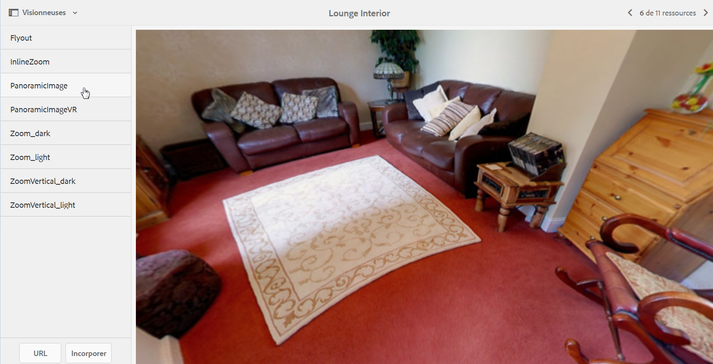

# Images panoramiques {#panoramic-images}

Cette section décrit comment utiliser la visionneuse d’images panoramiques pour le rendu d’images panoramiques sphériques afin de profiter d’une expérience de visionnage immersive à 360° d’une pièce, d’une propriété, d’un lieu ou d’un paysage.

Voir également [Gestion des paramètres prédéfinis de visionneuse](/help/assets/managing-viewer-presets.md).

## Téléchargement de ressources pour une utilisation avec la visionneuse d’images panoramiques {#uploading-assets-for-use-with-the-panoramic-image-viewer}

Pour qu’une ressource téléchargée soit une image panoramique sphérique utilisable avec la visionneuse d’images panoramiques, la ressource doit présenter l’une ou l’autre des caractéristiques suivantes, ou les deux :

* Un rapport d’aspect de 2.
Vous pouvez remplacer le paramètre de format par défaut de 2 en CRXDE Lite par le paramètre suivant :
   `/conf/global/settings/cloudconfigs/dmscene7/jcr:content`

* Avec les mots-clés `equirectangular`, ou `spherical` et `panorama`, ou `spherical` et `panoramic`. Voir [Utilisation des balises](/help/sites-authoring/tags.md).

Les critères de format et de mots-clés s’appliquent tous deux aux ressources panoramiques pour la page des détails des ressources et le composant WCM `Panoramic Media`.

Pour télécharger des ressources à utiliser avec la visionneuse d’images panoramiques, consultez [Téléchargement de ressources](/help/assets/manage-assets.md#uploading-assets).

## Configuration de Dynamic Media Classic {#configuring-dynamic-media-classic-scene}

Pour que la visionneuse d’images panoramiques fonctionne correctement dans AEM, vous devez synchroniser les paramètres prédéfinis de la visionneuse d’images panoramiques avec les métadonnées spécifiques à Dynamic Media Classic et Dynamic Media Classic afin que les paramètres prédéfinis de la visionneuse soient mis à jour dans le JCR. Pour ce faire, configurez Dynamic Media Classic de la manière suivante :

1. Ouvrez [l’application de bureau Dynamic Media Classic](https://experienceleague.adobe.com/docs/dynamic-media-classic/using/getting-started/signing-out.html?lang=fr#getting-started) puis connectez-vous à votre compte.

1. Près du coin supérieur droit de la page, cliquez sur **[!UICONTROL Configuration > Configuration de l’application > Configuration de la publication > Serveur d’images.]**
1. Sur la page Publication sur hébergeur d’images, dans le menu déroulant **[!UICONTROL Contexte de publication]** près de la partie supérieure, sélectionnez **[!UICONTROL Image Serving.]**

1. Sur la même page Publication sur hébergeur d’images, localisez l’en-tête **[!UICONTROL Attributs de requête.]**
1. Sous l’en-tête Attributs de requête, localisez **[!UICONTROL Limite de taille de l’image de réponse.]** Ensuite, dans les champs Largeur et Hauteur associés, augmentez la taille maximale autorisée pour les images panoramiques.

   Dynamic Media Classic est limité à 25 000 000 pixels. La taille maximale autorisée pour les images de rapport 2:1 est de 7 000 x 3 500. Toutefois, pour des écrans d’ordinateurs de bureau habituels, une taille de 4 096 x 2 048 pixels suffit.

   >[!NOTE]
   >
   >Seules les images qui respectent la taille d’image maximale autorisée sont prises en charge. Les demandes d’images qui dépassent la taille maximale entraînent une réponse 403.

1. Sous l’en-tête Attributs de requête, procédez comme suit :

   * Définissez Mode d’obscurcissement de requête sur **[!UICONTROL Désactivé.]**
   * Définissez Mode de verrouillage de requête sur **[!UICONTROL Désactivé.]**

   Ces paramètres sont nécessaires pour utiliser le composant WCM `Panoramic Media` dans AEM.

1. Au bas de la page Publication sur hébergeur d’images, sur la gauche, cliquez sur **[!UICONTROL Enregistrer.]**

1. Dans le coin inférieur droit, cliquez sur **[!UICONTROL Fermer.]**

### Dépannage du composant WCM Média panoramique {#troubleshooting-the-panoramic-media-wcm-component}

Si vous avez fait glisser une image dans le composant Média panoramique au sein de votre WCM et que l’espace réservé au composant s’est réduit, vous pouvez procéder de la manière suivante :

* Si vous rencontrez une erreur 403 Interdit, elle peut être due à la taille excessive de l’image demandée. Vérifiez les paramètres **[!UICONTROL Limite de taille de l’image de réponse]** dans [Configuration de Dynamic Media Classic](/help/assets/panoramic-images.md#configuring-dynamic-media-classic-scene).

* En cas d’erreur « Verrou incorrect » ou « Erreur d’analyse » sur la page, vérifiez que Mode d’obscurcissement de requête de vérification et Mode de verrouillage de requête sont désactivés.
* Pour une erreur de canevas corrompu, configurez un chemin de fichier de définitions de règles et l’option Invalider sur le réseau de diffusion de contenu pour les demandes précédentes de la ressource d’image.
* Si la qualité d’image devient très faible après une demande d’image dont la taille dépasse la limite prise en charge, vérifiez que le paramètre **[!UICONTROL Attributs d’encodage JPEG > Qualité]** n’est pas vide. Un paramètre type du champ **[!UICONTROL Qualité]** est `95`. Vous trouverez le paramètre sur la page Publication sur hébergeur d’images. Pour accéder à la page, voir [Configuration de Dynamic Media Classic](/help/assets/panoramic-images.md#configuring-dynamic-media-classic-scene).

## Aperçu des images panoramiques {#previewing-panoramic-images}

Voir [Aperçu des ressources](/help/assets/previewing-assets.md).

## Publication des images panoramiques {#publishing-panoramic-images}

Voir [Publication de ressources](/help/assets/publishing-dynamicmedia-assets.md).
