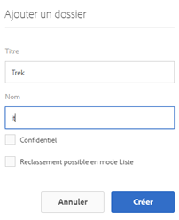
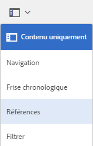
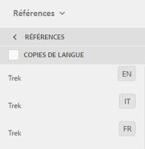

# Préparation des ressources pour la traduction {#preparing-assets-for-translation}

Les ressources multilingues sont des ressources comportant des fichiers binaires, des métadonnées et des balises dans plusieurs langues. En règle générale, les fichiers binaires, les métadonnées et les balises d’une ressource existent dans une langue, et sont ensuite traduits dans d’autres langues pour être utilisés dans des projets multilingues.

Dans [!DNL Adobe Experience Manager Assets], les ressources multilingues sont incluses dans des dossiers, où chaque dossier contient les ressources dans une langue différente.

Chaque dossier de langue est appelé une copie de langue. Le dossier racine d’une copie de langue, nommé racine de langue, identifie la langue du contenu de la copie de langue. Par exemple, */content/dam/it* est la racine de langue italienne de la copie en italien. Les copies de langue doivent utiliser une [racine de langue correctement configurée](preparing-assets-for-translation.md#creating-a-language-root) pour que la langue correcte soit ciblée lors de la traduction des ressources source.

La copie de langue pour laquelle vous ajoutez initialement des ressources est le gabarit de langue. Le gabarit de langue est la source qui est traduite dans d’autres langues. L’exemple de hiérarchie de dossiers comporte plusieurs racines de langue :

```shell
/content
    /- dam
        |- en
        |- fr
        |- de
        |- es
        |- it
        |- ja
        |- zh
```

Procédez comme suit pour préparer la traduction de vos ressources :

1. Créez la racine de langue de votre gabarit de langue. Par exemple, la racine de langue de la copie en anglais dans l’exemple de hiérarchie de dossiers est `/content/dam/en`. Assurez-vous que la racine de langue est correctement configurée conformément aux informations de la section [Création d’une racine de langue](preparing-assets-for-translation.md#creating-a-language-root).

1. Ajoutez des ressources à votre gabarit de langue.
1. Créez la racine de langue de chaque langue cible pour laquelle vous avez besoin d’une copie de langue.

## Créer une racine de langue {#creating-a-language-root}

Pour créer la racine de langue, créez un dossier, puis utilisez le code de langue ISO comme valeur de la propriété Nom. Après avoir créé la racine de langue, vous pouvez créer une copie de langue à n’importe quel niveau dans la racine de langue.

Par exemple, la page racine de la copie en italien de l’exemple de hiérarchie présente la propriété Nom `it`. La propriété Nom est utilisée comme nom du nœud de ressource dans le référentiel et détermine donc le chemin d’accès des ressources. (`https://[aem_server]:[port]/assets.html/content/dam/it/`).

1. Dans la console [!DNL Assets], cliquez sur **[!UICONTROL Créer]** et sélectionnez **[!UICONTROL Dossier]** dans le menu.

   

1. Dans le champ **[!UICONTROL Nom]**, saisissez le code de pays au format `<language-code>`.

   

1. Cliquez sur **[!UICONTROL Créer]**. La racine de langue est créée dans la console [!DNL Assets].

## Affichage des racines de langue {#viewing-language-roots}

[!DNL Experience Manager] L’interface fournit un  **** panneau de référence qui affiche la liste des racines de langue créées dans  [!DNL Assets].

1. Dans la console [!DNL Assets], sélectionnez la Principale de langue pour laquelle vous souhaitez créer des copies de langue.
1. Dans le rail de gauche, sélectionnez l’option **[!UICONTROL Références]** pour ouvrir le volet [!UICONTROL Référence].

   

1. Dans le volet Références , cliquez sur **[!UICONTROL Copies de langue]**. Le panneau [!UICONTROL Copies de langue] affiche les copies de langue des ressources.

   
