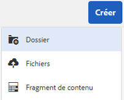
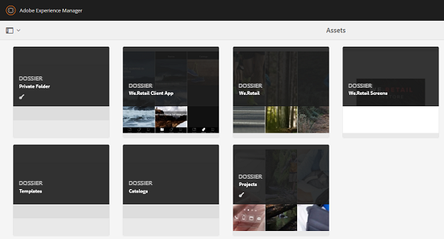
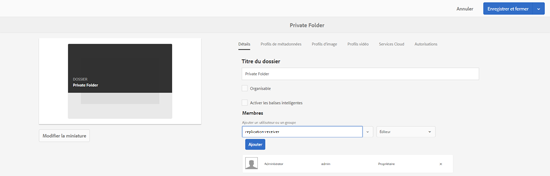
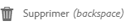

# Dossier privé dans [!DNL Adobe Experience Manager Assets] {#private-folder}

You can create a private folder in the [!DNL Adobe Experience Manager Assets] user interface that is available exclusively to you. Vous pouvez partager ce dossier privé avec d’autres utilisateurs et leur attribuer divers privilèges. Selon le niveau de privilège que vous affectez, les utilisateurs peuvent effectuer différentes tâches dans le dossier, par exemple consulter des ressources du dossier ou les modifier.

>[!NOTE]
>
>Le dossier privé comporte au moins un membre doté du rôle Propriétaire.

## Création et partage de dossiers privés {#create-share-private-folder}

Pour créer et partager un dossier privé :

1. In the [!DNL Assets] console, click **[!UICONTROL Create]** from the toolbar and then choose **[!UICONTROL Folder]** from the menu.

   

1. In the **[!UICONTROL Create Folder]** dialog, enter a title and name (optional) for the folder, and select **[!UICONTROL Private]** option.

1. Cliquez sur **[!UICONTROL Créer]**. Un dossier privé est créé.

   

1. To share the folder with other users and the assign privileges to them, select the folder, and click **[!UICONTROL Properties]** from the toolbar.

   

   >[!NOTE]
   >
   >Le dossier n’est pas visible par les autres utilisateurs tant qu’il n’est pas partagé.

1. In the **[!UICONTROL Folder Properties]** page, select a user from the **[!UICONTROL Add User]** list, assign a role to the user on your private folder, and click **[!UICONTROL Add]**.

   

   >[!NOTE]
   >
   >You can assign various roles, such as `Editor`, `Owner`, or `Viewer` to the user with whom you share the folder. If you assign an `Owner` role to the user, the user has `Editor` privileges on the folder. En outre, il peut partager le dossier avec d’autres utilisateurs. If you assign an `Editor` role, the user can edit the assets in your private folder. Si vous attribuez un rôle de lecteur de contenu, l’utilisateur peut uniquement vue les fichiers de votre dossier privé.

   >[!NOTE]
   >
   >Le dossier privé comporte au moins un membre avec `Owner` un rôle. Par conséquent, l’administrateur ne peut pas supprimer tous les membres propriétaires d’un dossier privé. Toutefois, pour supprimer les propriétaires existants (et l’administrateur lui-même) du dossier privé, l’administrateur doit ajouter un autre utilisateur en tant que propriétaire.

1. Cliquez sur **[!UICONTROL Enregistrer]**. Depending on the role you assign, the user is assigned a set of privileges on your private folder when the user logs in to [!DNL Assets].
1. Cliquez sur **[!UICONTROL OK]** pour fermer le message de confirmation.
1. L’utilisateur avec lequel vous partagez le dossier reçoit une notification de partage. Log in to [!DNL Assets] with the credentials of the user to view the notification.

   

1. Cliquez sur [!UICONTROL Notifications] pour ouvrir une liste de notifications.

   

1. Cliquez sur l’entrée correspondant au dossier privé partagé par l’administrateur pour ouvrir le dossier.

>[!NOTE]
>
>To create a private folder, you require Read and Modify [access control permissions](/help/sites-administering/security.md#permissions-in-aem) on the parent folder under which you want to create a private folder. Si vous n’êtes pas administrateur, ces autorisations ne sont pas activées pour vous par défaut au niveau de `/content/dam`. Dans ce cas, obtenez d’abord ces autorisations pour votre ID utilisateur/groupe avant de tenter de créer des dossiers privés.

## Suppression de dossiers privés {#delete-private-folder}

Vous pouvez supprimer un dossier en le sélectionnant et en sélectionnant l’option [!UICONTROL Supprimer] dans le menu supérieur ou en utilisant la touche Retour arrière de votre clavier.

>[!CAUTION]
>
>Si vous supprimez un dossier privé du CRXDE Lite, les groupes d’utilisateurs redondants restent dans le référentiel.

>[!NOTE]
>
>Si vous supprimez un dossier à l’aide de la méthode ci-dessus de l’interface utilisateur, les groupes d’utilisateurs associés sont également supprimés.
>
>Cependant, les groupes d’utilisateurs redondants, inutilisés et générés automatiquement existants peuvent être supprimés du référentiel à l’aide de la `clean` méthode JMX dans l’instance d’auteur (`http://[server]:[port]/system/console/jmx/com.day.cq.dam.core.impl.team%3Atype%3DClean+redundant+groups+for+Assets`).
