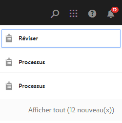

# Dossier privé dans [!DNL Adobe Experience Manager Assets] {#private-folder}

| Version | Lien de l’article |
| -------- | ---------------------------- |
| AEM as a Cloud Service | [Cliquez ici](https://experienceleague.adobe.com/docs/experience-manager-cloud-service/content/assets/manage/private-folder.html?lang=fr) |
| AEM 6.5 | Cet article |

Vous pouvez créer un dossier privé dans l’interface utilisateur d’[!DNL Adobe Experience Manager Assets] qui n’est disponible que pour vous. Vous pouvez partager ce dossier privé avec d’autres utilisateurs auxquels vous attribuez différents privilèges. Selon le niveau de privilège que vous attribuez, les utilisateurs peuvent effectuer différentes tâches dans le dossier, par exemple consulter des ressources du dossier ou les modifier.

>[!NOTE]
>
>Le dossier privé comporte au moins un membre ayant un rôle Propriétaire.

## Création et partage de dossiers privés {#create-share-private-folder}

Pour créer et partager un dossier privé, procédez comme suit :

1. Dans la console [!DNL Assets], cliquez sur **[!UICONTROL Créer]** dans la barre d’outils, puis choisissez **[!UICONTROL Dossier]** dans le menu.

   

1. Dans la boîte de dialogue **[!UICONTROL Créer un dossier]**, entrez un titre et un nom pour le dossier (facultatif), puis sélectionnez l’option **[!UICONTROL Privé]**.

1. Cliquez sur **[!UICONTROL Créer]**. Un dossier privé est créé.

   

1. Pour partager le dossier avec d’autres utilisateurs et leur attribuer des privilèges, sélectionnez le dossier, puis cliquez sur **[!UICONTROL Propriétés]** dans la barre d’outils.

   

   >[!NOTE]
   >
   >Le dossier n’est pas visible par les autres utilisateurs tant qu’il n’est pas partagé.

1. Dans la page **[!UICONTROL Propriétés du dossier]**, sélectionnez un utilisateur dans la liste **[!UICONTROL Ajouter un utilisateur]**, attribuez-lui un rôle dans le dossier privé, puis cliquez sur **[!UICONTROL Ajouter]**.

   

   >[!NOTE]
   >
   >Vous pouvez affecter différents rôles, tels que `Editor`, `Owner`, ou `Viewer`, à l’utilisateur avec lequel vous partagez le dossier. Si vous attribuez un rôle `Owner` à l’utilisateur, ce dernier possède des privilèges `Editor` sur le dossier. En outre, il peut partager le dossier avec d’autres utilisateurs. Si vous attribuez le rôle `Editor`, l’utilisateur peut modifier les ressources de votre dossier privé. Si vous affectez le rôle Observateur, l’utilisateur peut uniquement consulter les ressources du dossier privé.

   >[!NOTE]
   >
   >Le dossier privé comporte au moins un membre ayant le rôle `Owner`. Par conséquent, l’administrateur ne peut pas supprimer tous les membres propriétaires d’un dossier privé. Toutefois, pour supprimer les propriétaires existants (et l’administrateur lui-même) du dossier privé, l’administrateur doit ajouter un autre utilisateur en tant que propriétaire.

1. Cliquez sur **[!UICONTROL Enregistrer]**. En fonction du rôle attribué, l’utilisateur se voit attribuer un ensemble de privilèges sur votre dossier privé lorsqu’il se connecte à [!DNL Assets].
1. Cliquez sur **[!UICONTROL OK]** pour fermer le message de confirmation.
1. L’utilisateur ou l’utilisatrice avec lequel ou laquelle vous partagez le dossier reçoit une notification de partage. Connectez-vous à [!DNL Assets] à l’aide des informations d’identification de l’utilisateur pour afficher la notification.

   

1. Cliquez sur [!UICONTROL Notifications] pour ouvrir une liste de notifications.

   

1. Cliquez sur l’entrée du dossier privé partagé par l’administrateur pour ouvrir le dossier.

>[!NOTE]
>
>Pour pouvoir créer un dossier privé, vous devez disposer d’[autorisations d’accès](/help/sites-administering/security.md#permissions-in-aem) en lecture et en modification au niveau du dossier parent dans lequel vous souhaitez créer un dossier privé. Si vous n’êtes pas administrateur, ces autorisations ne sont pas activées pour vous par défaut au niveau de `/content/dam`. Dans ce cas, commencez par obtenir ces autorisations pour votre ID utilisateur/groupe avant d’essayer de créer des dossiers privés ou d’afficher les paramètres de dossier.

## Suppression de dossiers privés {#delete-private-folder}

Vous pouvez supprimer un dossier en le sélectionnant et en sélectionnant [!UICONTROL Supprimer] à partir du menu supérieur ou à l’aide de la touche Retour arrière de votre clavier.

>[!CAUTION]
>
>Si vous supprimez un dossier privé de CRXDE Lite, les groupes d’utilisateurs redondants restent dans le référentiel.

>[!NOTE]
>
>Si vous supprimez un dossier de l’interface utilisateur à l’aide de la méthode ci-dessus, les groupes d’utilisateurs associés sont également supprimés.
>
>Cependant, les groupes d’utilisateurs existants redondants, inutilisés et générés automatiquement peuvent être supprimés du référentiel à l’aide de la méthode `clean` dans JMX dans l’instance de création (`http://[server]:[port]/system/console/jmx/com.day.cq.dam.core.impl.team%3Atype%3DClean+redundant+groups+for+Assets`).
