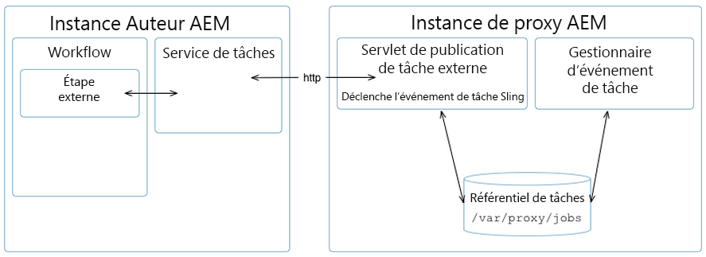

# [!DNL Assets] développement par proxy {#assets-proxy-development}

[!DNL Adobe Experience Manager Assets] utilise un proxy pour distribuer le traitement pour certaines tâches.

Un proxy est une instance de Experience Manager spécifique (et parfois distincte) qui utilise des agents proxy comme processeurs chargés de gérer une tâche et de créer un résultat. Un worker de proxy peut être utilisé pour de nombreuses tâches. In the case of an [!DNL Assets] proxy this can be used for loading assets for rendering within Assets. Par exemple, le [worker de proxy IDS](indesign.md) utilise un serveur pour traiter les fichiers à utiliser dans  Assets.[!DNL Adobe InDesign]

When the proxy is a separate [!DNL Experience Manager] instance this helps reduce the load on the Experience Manager authoring instance(s). By default, [!DNL Assets] executes the asset processing tasks in the same JVM (externalized via Proxy) to reduce the load on the Experience Manager authoring instance.

## Proxy (Accès HTTP) {#proxy-http-access}

A proxy is available via the HTTP Servlet when it is configured to accept processing jobs at: `/libs/dam/cloud/proxy`. Ce servlet crée une tâche sling à partir des paramètres publiés. Elle est ensuite ajoutée à la file d’attente des tâches du proxy et connectée au worker de proxy approprié.

### Opérations prises en charge {#supported-operations}

* `job`

   **Exigences** : le paramètre `jobevent` doit être défini en tant que correspondance de valeur en série. This is used to create an `Event` for a job processor.

   **Résultat** : ajoute une nouvelle tâche. Si l’opération réussit, un identifiant de tâche unique est renvoyé.

```shell
curl -u admin:admin -F":operation=job" -F"someproperty=xxxxxxxxxxxx"
    -F"jobevent=serialized value map" http://localhost:4502/libs/dam/cloud/proxy
```

* `result`

   **Exigences**: le paramètre `jobid` doit être défini.

   **Résultat** : renvoie une représentation JSON du nœud de résultats tel que créé par le processeur de tâches.

```shell
curl -u admin:admin -F":operation=result" -F"jobid=xxxxxxxxxxxx"
    http://localhost:4502   /libs/dam/cloud/proxy
```

* `resource`

   **Exigences** : le paramètre jobid doit être défini.

   **Résultat** : renvoie une ressource associée à la tâche concernée.

```shell
curl -u admin:admin -F":operation=resource" -F"jobid=xxxxxxxxxxxx"
    -F"resourcePath=something.pdf" http://localhost:4502/libs/dam/cloud/proxy
```

* `remove`

   **Exigences** : le paramètre jobid doit être défini.

   **Résultats** : supprime une tâche si elle est trouvée.

```shell
curl -u admin:admin -F":operation=remove" -F"jobid=xxxxxxxxxxxx"
    http://localhost:4502/libs/dam/cloud/proxy
```

### Worker de proxy {#proxy-worker}

Un worker de proxy est un processeur chargé de gérer une tâche et de produire un résultat. Les workers résident sur l’instance de proxy et doivent mettre en œuvre [sling JobProcessor](https://sling.apache.org/site/eventing-and-jobs.html) pour être reconnus en tant que workers de proxy.

>[!NOTE]
>
>Le worker doit mettre en œuvre [sling JobProcessor](https://sling.apache.org/site/eventing-and-jobs.html) pour être reconnu en tant que worker de proxy.

### API client {#client-api}

[`JobService`](https://helpx.adobe.com/experience-manager/6-5/sites/developing/using/reference-materials/javadoc/index.html) est disponible en tant que service OSGi qui prévoit des méthodes pour créer des tâches, supprimer des tâches et obtenir des résultats de ces tâches. La mise en œuvre par défaut de ce service (`JobServiceImpl`) utilise le client HTTP pour communiquer avec le servlet de proxy à distance.

Voici un exemple d’utilisation d’API :

```java
@Reference
 JobService proxyJobService;

 // to create a new job
 final Hashtable props = new Hashtable();
 props.put("someproperty", "some value");
 props.put(JobUtil.PROPERTY_JOB_TOPIC, "myworker/job"); // this is an identifier of the worker
 final String jobId = proxyJobService.addJob(props, new Asset[]{asset});

 // to check status (returns JobService.STATUS_FINISHED or JobService.STATUS_INPROGRESS)
 int status = proxyJobService.getStatus(jobId)

 // to get the result
 final String jsonString = proxyJobService.getResult(jobId);

 // to remove job and cleanup
 proxyJobService.removeJob(jobId);
```

### Configurations du service cloud {#cloud-service-configurations}

>[!NOTE]
>
>La documentation de référence pour l’API de proxy est disponible sous [`com.day.cq.dam.api.proxy`](https://helpx.adobe.com/experience-manager/6-5/sites/developing/using/reference-materials/javadoc/com/day/cq/dam/api/proxy/package-summary.html).

Both proxy and proxy worker configurations are available via cloud services configurations as accessible from the [!DNL Assets] **Tools** console or under `/etc/cloudservices/proxy`. Chaque agent proxy est censé ajouter un noeud sous `/etc/cloudservices/proxy` pour les détails de configuration spécifiques au programme de travail (par exemple, `/etc/cloudservices/proxy/workername`).

>[!NOTE]
>
>See [InDesign Server Proxy Worker configuration](indesign.md#configuring-the-proxy-worker-for-indesign-server) and [Cloud Services configuration](../sites-developing/extending-cloud-config.md) for more information.

Voici un exemple d’utilisation d’API :

```java
@Reference(policy = ReferencePolicy.STATIC)
 ProxyConfig proxyConfig;

 // to get proxy config
 Configuration cloudConfig = proxyConfig.getConfiguration();
 final String value = cloudConfig.get("someProperty", "defaultValue");

 // to get worker config
 Configuration cloudConfig = proxyConfig.getConfiguration("workername");
 final String value = cloudConfig.get("someProperty", "defaultValue");
```

### Développement d’un worker de proxy personnalisé {#developing-a-customized-proxy-worker}

The [IDS proxy worker](indesign.md) is an example of a [!DNL Assets] proxy worker that is already provided out-of-the-box to outsource the processing of InDesign assets.

You can also develop and configure your own [!DNL Assets] proxy worker to create a specialized worker to dispatch and outsource your [!DNL Assets] processing tasks.

Pour configurer votre propre worker de proxy personnalisé, vous devez effectuer les opérations suivantes :

* Configurer et mettre en œuvre (à l’aide des événements Sling) :

   * une rubrique de tâche personnalisée ;
   * un gestionnaire d’événements de tâche personnalisé.

* Puis utiliser l’API JobService pour :

   * distribuer votre tâche personnalisée au proxy ;
   * gérer votre tâche.

* Si vous souhaitez utiliser le proxy à partir d’un processus, vous devez mettre en œuvre une étape externe personnalisée à l’aide de l’API WorkflowExternalProcess et de l’API JobService.

Le schéma et les étapes ci-dessous détaillent la procédure à suivre :



>[!NOTE]
>
>Dans les étapes suivantes, les équivalents d&#39;InDesign sont indiqués comme exemples de référence.

1. Une [tâche Sling](https://sling.apache.org/site/eventing-and-jobs.html) est utilisée, ce qui signifie que vous devez définir une rubrique de tâche pour votre cas d’emploi.

   Par exemple, consultez `IDSJob.IDS_EXTENDSCRIPT_JOB` pour le worker de proxy IDS.

1. L’étape externe est utilisée pour déclencher l’événement et attendre qu’il soit terminé en interrogeant l’identifiant. Vous devez développer votre propre étape pour mettre en œuvre de nouvelles fonctionnalités.

   Mettez en œuvre une API `WorkflowExternalProcess`, puis utilisez l’API JobService et votre rubrique de tâche pour préparer un événement de tâche et le distribuer à l’API JobService (un service OSGi).

   Par exemple, consultez `INDDMediaExtractProcess`.java pour le worker de proxy IDS.

1. Mettez en œuvre un gestionnaire de tâches pour votre rubrique. Ce gestionnaire nécessite un développement afin d’effectuer votre action spécifique et est considéré comme la mise en œuvre du worker.

   Par exemple, consultez `IDSJobProcessor.java` pour le worker de proxy IDS.

1. Utilisez `ProxyUtil.java` dans dam-commons. Cela vous permet de distribuer des tâches à des workers à l’aide du proxy de gestion des actifs numériques.

>[!NOTE]
>
>What the [!DNL Assets] proxy framework does not provide out-of-the-box is the pool mechanism.
>
>The [!DNL InDesign] integration allows the access of a pool of [!DNL InDesign] servers (IDSPool). This pooling is specific to [!DNL InDesign] integration and not part of the [!DNL Assets] proxy framework.

>[!NOTE]
>
>Synchronisation des résultats :
>
>Avec n instances utilisant le même proxy, le résultat de traitement reste avec le proxy. Il appartient au client (auteur Experience Manager) de demander le résultat en utilisant le même ID de travail unique que celui attribué au client lors de la création de travaux. Le proxy fait son travail et conserve le résultat disponible sur demande.
