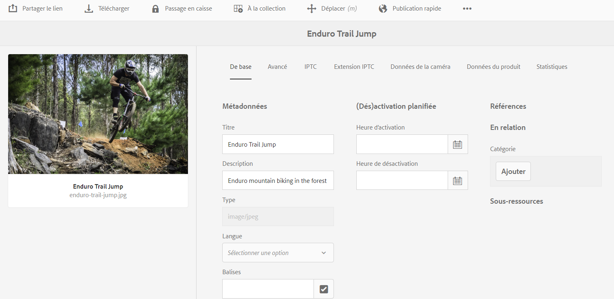
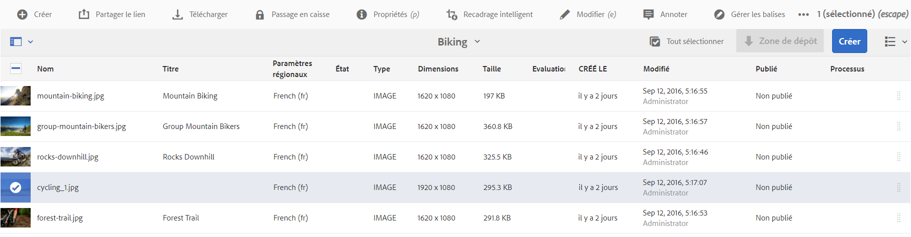
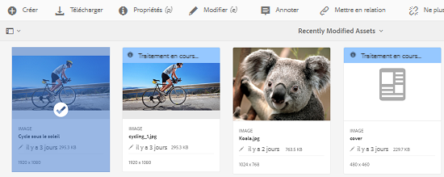
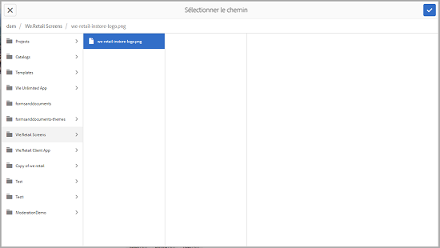
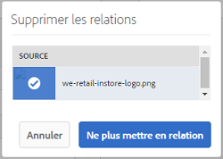
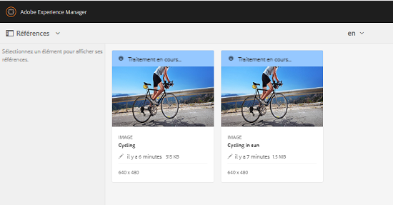
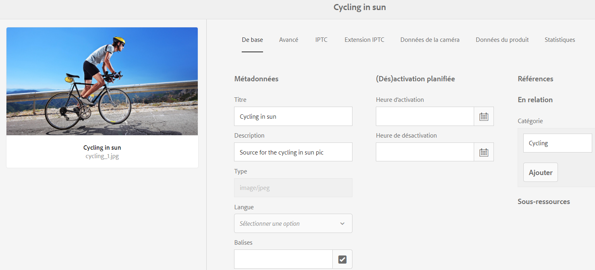
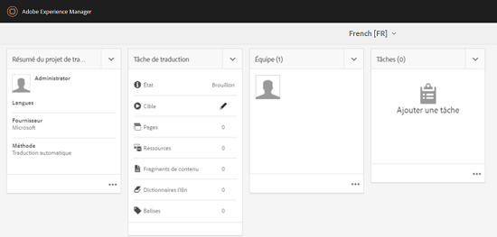
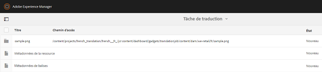
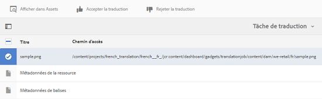

# Ressources liées{#related-assets}

[!DNL Adobe Experience Manager Assets] vous permet de lier manuellement des ressources en fonction des besoins de votre entreprise à l’aide de la fonction d’éléments connexes. Par exemple, vous pouvez mettre en relation un fichier de licence avec une ressource ou une image/vidéo portant sur un sujet similaire. Vous pouvez mettre en relation des ressources qui partagent certains attributs communs. Vous pouvez également utiliser cette fonctionnalité pour créer des relations source/dérivés entre des ressources. Par exemple, si un fichier PDF est généré à partir d’un fichier INDD, vous pouvez mettre en relation le fichier PDF avec son fichier INDD source.

Grâce à cette fonctionnalité, vous pouvez partager un fichier PDF ou JPG basse résolution avec des fournisseurs ou des agences et rendre le fichier INDD haute résolution disponible uniquement sur demande.

>[!NOTE] Seuls les utilisateurs disposant d’autorisations de modification sur les ressources peuvent établir une relation et annuler la relation entre les ressources.
>

## Lier les ressources {#relating-assets}

1. From the Experience Manager interface, open the **[!UICONTROL Properties]** page for an asset that you want to relate.

   

   *Figure :[!DNL Assets]Page[!UICONTROL Propriétés]pour associer des ressources.*

   Vous pouvez également sélectionner la ressource en mode Liste.

   

   Sinon, sélectionnez la ressource à partir d’une collection.

   

1. Pour mettre en relation une autre ressource avec celle que vous avez sélectionnée, cliquez/appuyez sur l’icône **[!UICONTROL Mettre en relation]** dans la barre d’outils.

   

1. Utilisez l’une des méthodes suivantes :

   * Pour mettre en relation le fichier source avec la ressource, sélectionnez **[!UICONTROL Source]** dans la liste.
   * Pour mettre en relation un fichier dérivé avec la ressource, sélectionnez **[!UICONTROL Dérivés]** dans la liste.
   * Pour créer une relation réciproque entre les ressources, sélectionnez **[!UICONTROL Autres]** dans la liste.
   

1. Sur l’écran **[!UICONTROL Sélectionner une ressource]**, accédez à l’emplacement de la ressource que vous souhaitez mettre en relation et sélectionnez-la.

   

1. Cliquez/appuyez sur l’icône **[!UICONTROL Confirmer]**.
1. Cliquez/appuyez sur **[!UICONTROL OK]** pour fermer la boîte de dialogue. En fonction de la relation que vous avez choisie à l’étape 3, la ressource associée apparaît sous une catégorie appropriée dans la section **[!UICONTROL En relation]**. Par exemple, si la ressource que vous avez mise en relation est le fichier source de la ressource actuelle, elle apparaît sous **[!UICONTROL Source]**.

   

1. To un-relate an asset, click/tap **[!UICONTROL Unrelate]** from the toolbar.

   

1. Select the asset(s) you want to un-relate from the **[!UICONTROL Remove Relations]** dialog, and the click/tap **[!UICONTROL Unrelate]**.

   

1. Cliquez/appuyez sur **[!UICONTROL OK]** pour fermer la boîte de dialogue. Les ressources pour lesquelles vous avez supprimé des relations sont supprimées de la liste des ressources mises en relation dans la section **[!UICONTROL En relation]**.

## Traduction de ressources associées {#translating-related-assets}

La création de relations source/dérivés entre des ressources à l’aide de la fonctionnalité Ressources mises en relation est également utile dans les processus de traduction. When you run a translation workflow on a derived asset, [!DNL Experience Manager Assets] automatically fetches any asset that the source file references and includes it for translation. De cette manière, la ressource référencée par la ressource source est traduite avec les ressources source et dérivées. Par exemple, supposons que votre copie de langue anglaise inclut une ressource dérivée et son fichier source, comme indiqué sur l’image ci-dessous.

If the source file is related to another asset, [!DNL Experience Manager Assets] fetches the referenced asset and includes it for translation.

*Figure : Fichier source des ressources connexes à inclure pour la traduction.*

1. Traduisez les ressources du dossier source dans une langue cible en suivant les étapes de la section [Créer un projet de traduction](translation-projects.md#create-a-new-translation-project). Par exemple, dans ce cas, traduisez vos ressources en français.

1. From the [!UICONTROL Projects] page, open the translation folder.

   

1. Cliquez/appuyez sur la mosaïque du projet pour ouvrir la page de détails.

   

1. Cliquez/appuyez sur les points de suspension en dessous de la carte Tâche de traduction pour afficher l’état de la traduction.

   

1. Sélectionnez la ressource, puis cliquez/appuyez sur **[!UICONTROL Afficher dans Assets]** dans la barre d’outils pour afficher l’état de la traduction de la ressource.

   

1. Pour vérifier si les ressources mises en relation avec la source ont été traduites, cliquez/appuyez sur la ressource source.

   

1. Sélectionnez la ressource mise en relation avec la source, puis cliquez/appuyez sur **[!UICONTROL Afficher dans Assets]**. La ressource associée traduite s’affiche.

   
