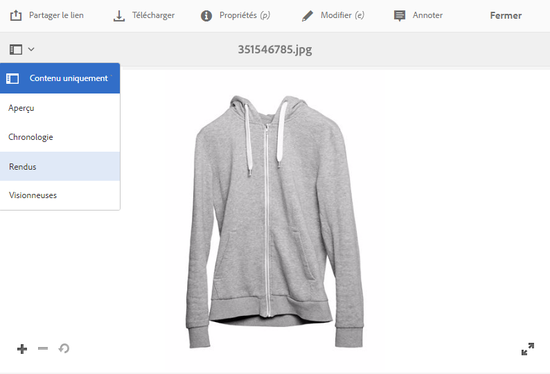
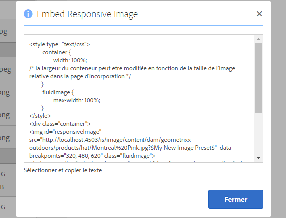

# Diffusion d’images optimisées pour un site réactif {#delivering-optimized-images-for-a-responsive-site}

Utilisez la fonctionnalité de code réactif lorsque vous souhaitez partager le code de diffusion réactive avec votre développeur web. Utilisez la fonctionnalité de code réactif (**[!UICONTROL RESS]**) lorsque vous souhaitez partager le code de diffusion réactive avec votre développeur web.

Cette fonction a un sens si votre site web se trouve sur un composant WCM tiers. Cependant, si votre site web se trouve plutôt sur Adobe Experience Manager, un serveur d’images hors site effectue le rendu de l’image et le communique à la page web.

Consultez également la section [Intégration de la visionneuse de vidéos à une page web](embed-code.md).

Consultez également la section [Liaison d’URL à une application web](linking-urls-to-yourwebapplication.md).

**Pour diffuser des images optimisées pour un site réactif, procédez comme suit :**

1. Accédez à l’image pour laquelle vous voulez fournir du code réactif et, dans le menu déroulant, sélectionnez **[!UICONTROL Rendus]**.

   

1. Sélectionnez un paramètre d’image prédéfini réactif. Les boutons **[!UICONTROL URL]** et **[!UICONTROL RESS]** apparaissent.

   

   >[!NOTE]
   >
   >La ressource sélectionnée *et* le paramètre d’image prédéfini ou le paramètre de visionneuse prédéfini sélectionné doivent être publiés pour que le bouton **[!UICONTROL URL]** ou **[!UICONTROL RESS]** soit disponible.
   >
   >Le mode hybride de Dynamic Media nécessite de publier des paramètres prédéfinis d’image ; le mode Scene7 de Dynamic Media publie automatiquement les paramètres prédéfinis d’image.

1. Sélectionnez **[!UICONTROL RESS]**.

   

1. Dans la boîte de dialogue **[!UICONTROL Intégrer une image réactive]**, sélectionnez et copiez le texte du code réactif et collez-le dans votre site web pour accéder au fichier réactif.
1. Modifiez les points d’arrêt par défaut dans le code incorporé pour qu’ils correspondent aux points d’arrêt du site web réactif directement dans le code. Testez en outre les différentes résolutions d’image diffusées à différents points d’arrêt d’une page.

## Utilisation du protocole HTTP/2 pour diffuser vos ressources Dynamic Media {#using-http-to-delivery-your-dynamic-media-assets}

HTTP/2 est le nouveau protocole Web mis à jour qui améliore la communication entre les navigateurs et les serveurs. Il permet un transfert plus rapide des informations et réduit la puissance de traitement nécessaire. Les ressources Dynamic Media sont désormais prises en charge sur HTTP/2, un protocole qui garantit de meilleurs temps de réponse et de chargement.

Voir [Diffusion du contenu sur HTTP2](http2.md) pour tout savoir sur l’utilisation du protocole HTTP/2 avec votre compte Dynamic Media.
