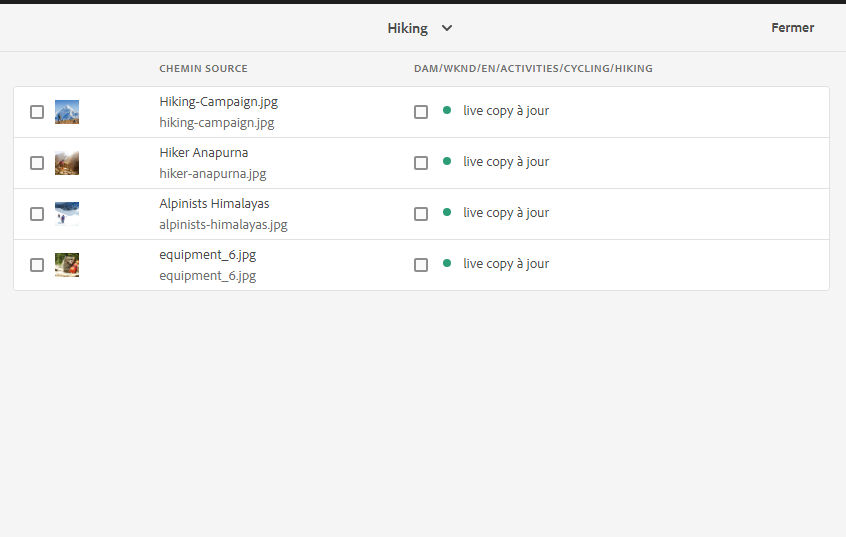
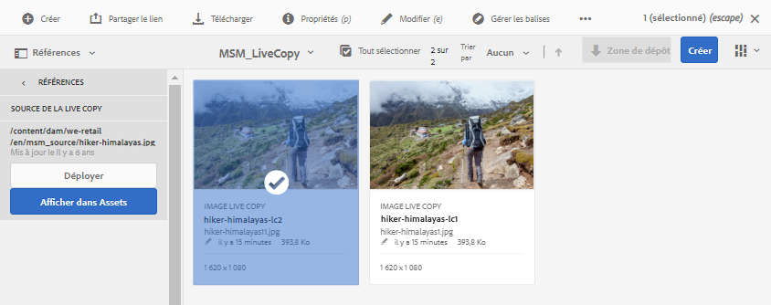
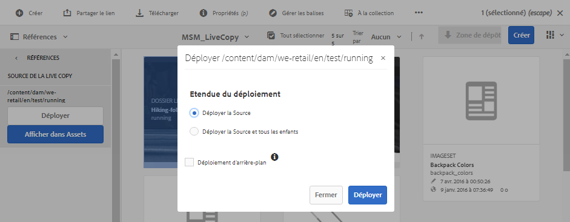
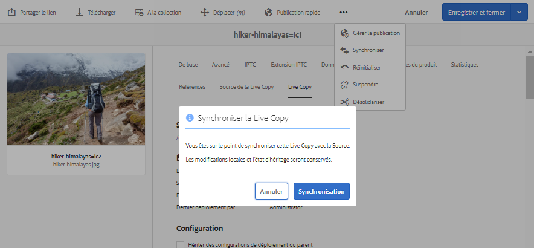
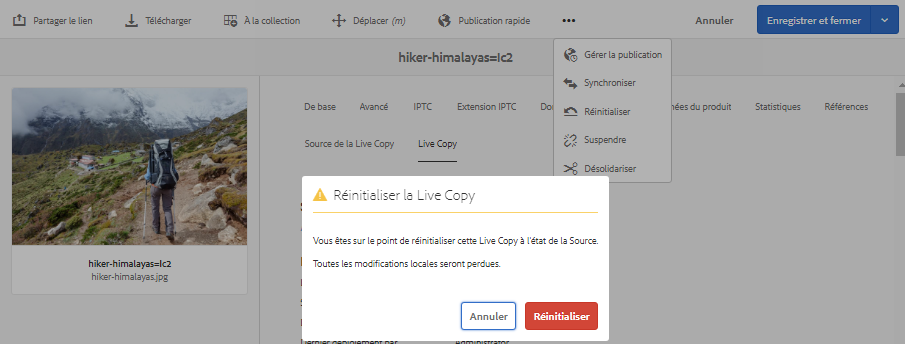
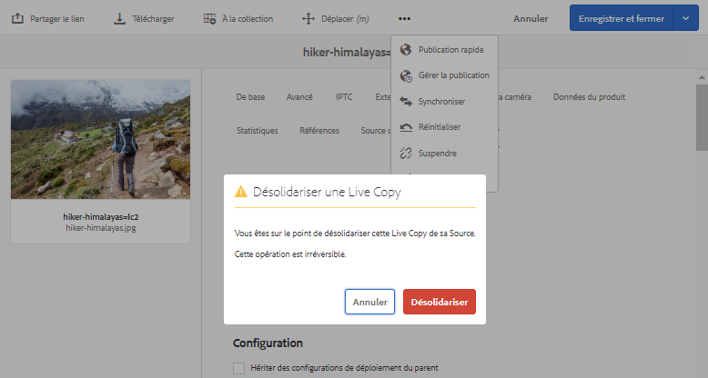

# Réutilisation de ressources à l’aide de MSM pour [!DNL Assets] {#reuse-assets-using-msm-for-assets}

| Version | Lien de l’article |
| -------- | ---------------------------- |
| AEM as a Cloud Service | [Cliquez ici](https://experienceleague.adobe.com/docs/experience-manager-cloud-service/content/assets/manage/reuse-assets-using-msm.html?lang=fr) |
| AEM 6.5 | Cet article |

La fonctionnalité Multi Site Manager (MSM) dans [!DNL Adobe Experience Manager] permet aux utilisateurs de réutiliser du contenu créé une fois et de le réutiliser à plusieurs emplacements sur le web. Il en est de même pour les ressources numériques que pour la fonctionnalité MSM pour [!DNL Assets]. À l’aide de MSM pour [!DNL Assets], vous pouvez :

* créer des ressources une fois, puis en effectuer des copies pour les réutiliser dans d’autres zones du site ;
* conserver plusieurs copies en synchronisation et mettre à jour la copie originale primaire une fois pour transmettre les modifications aux copies enfants ;
* effectuer des modifications locales en suspendant temporairement ou définitivement la liaison entre les ressources parents et enfants.

## Prérequis {#prereq}

Pour utiliser MSM pour [!DNL Assets], installez au moins le pack de services 1 d’[!DNL Experience Manager] 6.5. Pour plus d’informations, consultez [les notes de mise à jour du dernier pack de service](/help/release-notes/release-notes.md).

## Présentation des avantages et des concepts {#concepts}

### Fonctionnement et avantages {#how-it-works-and-the-benefits}

Pour comprendre les scénarios d’utilisation de la réutilisation d’un même contenu (texte et ressources) sur plusieurs emplacements web, voir [scénarios MSM possibles](/help/sites-administering/msm.md). [!DNL Experience Manager] conserve un lien entre la ressource d’origine et ses copies liées, appelées Live Copies. La liaison conservée permet de transmettre des modifications centralisées à de nombreuses Live Copies. Cela permet des mises à jour plus rapides tout en éliminant les limites de la gestion des doublons. La propagation des modifications est libre d’erreurs et centralisée. Cette fonctionnalité permet d’autoriser des mises à jour limitées à des Live Copies sélectionnées. Les utilisateurs peuvent annuler la liaison, ce qui rompt l’héritage, et apporter des modifications locales qui ne sont pas remplacées lorsque la copie primaire est mise à jour et que les modifications sont déployées. La désolidarisation peut être effectuée pour certains champs de métadonnées sélectionnés ou pour une ressource entière. Elle permet de mettre à jour localement les ressources héritées d’une copie primaire.

MSM entretient une relation dynamique entre la ressource source et ses Live Copies de sorte que :

* les modifications apportées aux ressources source soient appliquées (déployées) aux Live Copies (les Live Copies sont synchronisées avec la source) ;
* vous puissiez mettre à jour les Live Copies en suspendant la relation dynamique ou en supprimant l’héritage pour certains champs. Les modifications apportées à la source ne sont plus appliquées à la Live Copy.

### Glossaire des termes MSM pour [!DNL Assets] {#glossary}

**Source :** les ressources ou les dossiers d’origine. Copie primaire d’où sont dérivées les Live Copies.

**Live Copy :** copie des ressources/dossiers sources synchronisés avec sa source. Les Live Copies peuvent être une source d’autres Live Copies. Découvrez comment créer des Live Copies.

**Hériter :** lien/référence entre une ressource/un dossier de Live Copy et sa source que le système utilise pour mémoriser où envoyer les mises à jour. L’héritage existe à un niveau granulaire pour les champs de métadonnées. L’héritage peut être supprimé pour les champs de métadonnées sélectionnés tout en conservant les relations dynamiques entre la source et sa Live Copy.

**Déployer :** action qui envoie les modifications apportées à la source en aval à ses Live Copies. Il est possible de mettre à jour une ou plusieurs Live Copies en une seule fois à l’aide de l’action de déploiement. Voir Déploiement.

**Déployer la configuration :** règles qui déterminent quelles propriétés sont synchronisées, de quelle manière et à quel moment. Ces configurations sont appliquées lors de la création de Live Copies ; elles peuvent être modifiées ultérieurement. De plus, un enfant peut hériter de la configuration de déploiement de sa ressource parent. Pour MSM pour [!DNL Assets], utilisez uniquement la configuration de déploiement standard. Les autres configurations de déploiement ne sont pas disponibles pour MSM pour [!DNL Assets].

**Synchroniser :** autre action, en plus du déploiement, qui apporte une parité entre la source et sa Live Copy en envoyant les mises à jour depuis la source aux Live Copies. Une synchronisation est lancée pour une Live Copy spécifique et l’action extrait les modifications de la source. Cette action permet de ne mettre à jour qu’une seule Live Copies. Voir Action de synchronisation.

**Suspendre :** supprimer temporairement la relation dynamique entre une Live Copy et sa ressource/son dossier source. Vous pouvez reprendre la relation. Voir Action de suspension.

**Reprendre :** reprendre la relation dynamique de sorte qu’une Live Copy recommence à recevoir les mises à jour depuis la source. Voir Action de reprise.

**Réinitialiser :** l’action de réinitialisation rétablit l’état de réplica de la source de la Live Copy en remplaçant les modifications locales. Il supprime également les annulations d’héritage et réinitialise l’héritage sur tous les champs de métadonnées. Pour apporter des modifications locales ultérieurement, vous devez à nouveau annuler l’héritage de champs spécifiques. Voir Modifications locales apportées à une Live Copy.

**Désolidariser :** supprimer irrévocablement la relation dynamique d’une ressource/d’un dossier de Live Copy. Après une action de désolidarisation, les Live Copies ne peuvent jamais recevoir les mises à jour de la source et elles cessent d’être des Live Copies. Voir Suppression des relations.

## Création d’une Live Copy d’une ressource {#createlc}

Pour créer une Live Copy à partir d’une ou plusieurs ressources ou d’un ou plusieurs dossiers source, procédez de l’une des manières suivantes :

* Méthode 1 : sélectionnez la ou les ressources sources, puis cliquez sur **[!UICONTROL Créer]** > **[!UICONTROL Live Copy]** dans la barre d’outils supérieure.
* Méthode 2 : dans l’interface utilisateur d’[!DNL Experience Manager], cliquez sur **[!UICONTROL Créer]** > **[!UICONTROL Live Copy]** dans le coin supérieur droit de l’interface.

Vous pouvez créer des Live Copies d’une ressource ou d’un dossier à la fois. Vous pouvez créer des Live Copies dérivées d’une ressource ou d’un dossier étant une Live Copy. Les fragments de contenu (CF) ne sont pas pris en charge dans ce cas d’utilisation. Lorsque vous essayez de créer leurs Live Copies, les CF sont copiés tels quels sans aucune relation. Les CF copiés sont un instantané dans le temps et ne sont pas mis à jour lorsque les CF d’origine sont mis à jour.

Pour créer des Live Copies à l’aide de la première méthode, procédez comme suit :

1. Sélectionnez des ressources ou des dossiers sources. **[!UICONTROL Créer]** > **[!UICONTROL Live Copy]**.

   ![Création d’une Live Copy depuis l’interface d’[!DNL Experience Manager]](assets/create_lc1.png)

   *Image : création d’une Live Copy à partir de l’interface d’[!DNL Experience Manager].*

1. Sélectionnez un dossier de destination. Cliquez sur **[!UICONTROL Suivant]**.
1. Indiquez le titre et le nom. Les ressources n’ont pas d’enfants. Lors de la création d’une Live Copy de dossiers, vous pouvez choisir d’inclure ou d’exclure les enfants.
1. Sélectionnez une configuration de déploiement. Cliquez sur **[!UICONTROL Créer]**.

Pour créer des Live Copies à l’aide de la deuxième méthode, procédez comme suit :

1. Dans l’interface d’[!DNL Experience Manager], dans le coin supérieur droit, cliquez sur **[!UICONTROL Créer]** > **[!UICONTROL Live Copy]**.

   ![Création d’une Live Copy depuis l’interface d’[!DNL Experience Manager]](assets/create_lc2.png)

   *Image : création d’une Live Copy à partir de l’interface d’[!DNL Experience Manager].*

1. Sélectionnez la ressource ou le dossier source. Cliquez sur **[!UICONTROL Suivant]**.
1. Sélectionnez le dossier de destination. Cliquez sur **[!UICONTROL Suivant]**.
1. Indiquez le titre et le nom. Les ressources n’ont pas d’enfants. Lors de la création d’une Live Copy de dossiers, vous pouvez choisir d’inclure ou d’exclure les enfants.
1. Sélectionnez une configuration de déploiement. Cliquez sur **[!UICONTROL Créer]**.

>[!NOTE]
>
>Lorsqu’une source ou une Live Copy est déplacée, les relations sont conservées. Lorsqu’une Live Copy est supprimée, les relations sont retirées.

## Affichage de différentes propriétés et des états de la source et de la Live Copy {#properties}

Vous pouvez afficher les informations et les états associés à MSM d’une Live Copy, comme la relation, la synchronisation, les déploiements, et des informations supplémentaires dans les différentes zones de l’interface utilisateur d’[!DNL Experience Manager].

Les deux méthodes suivantes fonctionnent pour les ressources et les dossiers :

* Sélectionnez une ressource Live Copy et recherchez les informations dans sa page Propriétés.
* Sélectionnez le dossier source et recherchez les informations détaillées de chaque Live Copy dans la [!UICONTROL console Live Copy].

>[!TIP]
>
>Conseil : Pour vérifier l’état de quelques copies en direct distinctes, utilisez la première méthode de la page **[!UICONTROL Propriétés]**. Pour vérifier les états de plusieurs copies dynamiques, utilisez la deuxième méthode pour vérifier l’**[!UICONTROL État de la relation]** de la page.

### Informations et état d’une Live Copy   {#statuslcasset}

Pour vérifier les informations et les états d’une ressource ou d’un dossier de Live Copy, procédez comme suit.

1. Sélectionnez une ressource ou un dossier de Live Copy. Cliquez sur **[!UICONTROL Propriétés]** dans la barre d’outils. Vous pouvez également utiliser le raccourci clavier `p`.
1. Cliquez sur **[!UICONTROL Live Copy]**. Vous pouvez vérifier le chemin de la source, l’état de suspension, l’état de synchronisation, la date du dernier déploiement et l’utilisateur ayant effectué le dernier déploiement.

   

   *Image : informations sur, et états d’une Live Copy.*

1. Vous pouvez procéder à l’activation ou la désactivation si les ressources enfants empruntent la configuration de la Live Copy.

1. Vous pouvez choisir que la Live Copy hérite de la configuration du déploiement du parent ou modifier la configuration.

### Informations et états de toutes les Live Copies d’un dossier {#status-lc-folder}

[!DNL Experience Manager] fournit une console permettant de vérifier les états de toutes les Live Copies d’un dossier source. Cette console affiche l’état de toutes les ressources enfants.

1. Sélectionnez un dossier source. Cliquez sur **[!UICONTROL Propriétés]** dans la barre d’outils. Vous pouvez également utiliser le raccourci clavier `p`.
1. Cliquez sur **[!UICONTROL Source Live Copy]**. Pour ouvrir la console, cliquez sur **[!UICONTROL Aperçu de la Live Copy]**. Ce tableau de bord fournit un état de niveau supérieur de toutes les ressources enfants.

   

   *Image : affichage des états des Live Copies dans la [!UICONTROL console Live Copy] de la source.*

1. Pour afficher les informations détaillées sur chaque fichier dans le dossier de la copie dynamique, sélectionnez un fichier et cliquez sur **[!UICONTROL État de la relation]** dans la barre d’outils.

   

   Informations détaillées et état d’une ressource enfant de Live Copy dans un dossier

>[!TIP]
>
>Vous pouvez afficher rapidement les états des Live Copies d’autres dossiers sans avoir à effectuer trop d’opérations. Modifiez le dossier à partir de la partie centrale supérieure de l’interface **[!UICONTROL Aperçu de la Live Copy]**.

### Actions rapides pour la source depuis le rail Références {#refrailsource}

Pour une ressource ou un dossier source, vous pouvez afficher les informations suivantes et effectuer les actions suivantes directement à partir du rail Références :

* Voir les chemins des Live Copies.
* Ouvrir ou afficher une Live Copy spécifique dans l’interface utilisateur d’[!DNL Experience Manager].
* Synchronisez les mises à jour avec une Live Copy spécifique.
* Suspendre la relation ou modifier la configuration du déploiement pour une Live Copy spécifique.
* Accédez à la console de présentation de la Live Copy.

Sélectionnez la ressource ou le dossier source, ouvrez le rail gauche, puis cliquez sur **[!UICONTROL Références]**. Vous pouvez également sélectionner une ressource ou un dossier et utiliser le raccourci clavier `Alt + 4`. 

*Image : actions et informations disponibles dans le rail des Références pour la source sélectionnée.*

Pour une Live Copy spécifique, cliquez sur **[!UICONTROL Modifier la Live Copy]** pour suspendre la relation ou modifier la configuration du déploiement.

.

*Image : suspension de la relation ou modification de la configuration du déploiement d’une Live Copy spécifique.*

### Actions rapides pour une Live Copy depuis le rail Références   {#ref-rail-lc}

Pour une ressource ou un dossier de Live Copy, vous pouvez afficher les informations et effectuer les actions suivantes directement depuis le rail Références :

* Afficher le chemin d’accès à sa source.
* Ouvrir ou afficher une Live Copy spécifique dans l’interface utilisateur d’[!DNL Experience Manager].
* Déployez les mises à jour.

Sélectionnez une ressource ou un dossier de Live Copy, ouvrez le rail gauche, puis cliquez sur **[!UICONTROL Références]**. Vous pouvez également sélectionner une ressource ou un dossier et utiliser le raccourci clavier `Alt + 4`. 

*Image : actions disponibles dans le rail des Références pour la Live Copy sélectionnée.*

## Propagation des modifications de la source vers les Live Copies   {#rolloutsync}

Une fois une source modifiée, les modifications peuvent être propagées aux Live Copies à l’aide d’une action de synchronisation ou de déploiement. Pour comprendre la différence entre les deux actions, voir le [glossaire](#glossary).

### Action de déploiement {#rollout}

Vous pouvez lancer une action de déploiement à partir de la ressource source et mettre à jour l’ensemble ou quelques Live Copies sélectionnées.

1. Sélectionnez une ressource ou un dossier de Live Copy. Cliquez sur **[!UICONTROL Propriétés]** dans la barre d’outils. Vous pouvez également utiliser le raccourci clavier `p`.
1. Cliquez sur **[!UICONTROL Source Live Copy]**. Cliquez sur **[!UICONTROL Déployer]** dans la barre d’outils.
1. Sélectionnez les Live Copies à mettre à jour. Cliquez sur **[!UICONTROL Déploiement]**.
1. Pour déployer les mises à jour apportées aux ressources enfants, sélectionnez **[!UICONTROL Déployer la source et tous les enfants]**.

   

   *Image : déploiement des modifications de la source vers certaines ou toutes les Live Copies.*

>[!NOTE]
>
>Les modifications apportées dans une ressource source sont déployées uniquement vers les Live Copies directement associées. Si une Live Copy est dérivée d’une autre, les modifications ne sont pas déployées vers la Live Copy dérivée.

Vous pouvez également lancer une action de déploiement à partir du rail Références après avoir sélectionné une Live Copy spécifique. Pour plus d’informations, voir [Actions rapides pour la Live Copy depuis le rail Références](#ref-rail-lc). Dans cette méthode de déploiement, seule la Live Copy sélectionnée et éventuellement ses enfants sont mis à jour.

*Image : déploiement des modifications de la source vers la Live Copy sélectionnée.*

### À propos de l’action de synchronisation {#about-sync}

Une action de synchronisation extrait les modifications d’une source uniquement vers la Live Copy sélectionnée. L’action de synchronisation respecte et conserve les modifications locales effectuées après l’annulation de l’héritage. Les modifications locales ne sont pas écrasées et l’héritage annulé n’est pas rétabli. Vous pouvez lancer une action de synchronisation de trois manières différentes.

| Où dans l’interface [!DNL Experience Manager] | Utilisation : à quel moment et pourquoi | Utilisation |
|---|---|---|
| [!UICONTROL Rail Références] | Effectuez rapidement une synchronisation lorsque la source est déjà sélectionnée. | Voir [Actions rapides pour la source depuis le rail Références](#refrailsource) |
| Barre d’outils dans la page [!UICONTROL Propriétés] | Lancez une synchronisation lorsque les propriétés de la Live Copy sont déjà ouvertes. | Voir [Synchronisation d’une Live Copy](#sync-lc) |
| [!UICONTROL Console Aperçu de la Live Copy] | Synchronisez rapidement plusieurs ressources (pas nécessairement toutes) lorsque le dossier source est sélectionné ou que la console [!UICONTROL Aperçu de la Live Copy] est déjà ouverte. L’action de synchronisation est lancée pour une ressource à la fois. Il s’agit toutefois d’une méthode plus rapide pour synchroniser plusieurs ressources simultanément. | Voir [Actions sur de nombreuses ressources dans un dossier de Live Copy](#bulk-actions) |

### Synchronisation d’une Live Copy   {#sync-lc}

Pour démarrer une action de synchronisation, ouvrez la page **[!UICONTROL Propriétés]** d’une Live Copy, cliquez sur **[!UICONTROL Live Copy]**, puis sur l’action souhaitée dans la barre d’outils.

Pour afficher les états et les informations liés à une action de synchronisation, voir [Informations et état d’une Live Copy](#statuslcasset) et [Informations et états de toutes les Live Copies d’un dossier](#status-lc-folder).

*Image : l’action de synchronisation récupère les modifications apportées à la source.*

>[!NOTE]
>
>Si la relation est suspendue, l’action de synchronisation n’est pas disponible dans la barre d’outils. Alors que l’action de synchronisation est disponible dans le rail Références, les modifications ne sont pas propagées même lors d’un déploiement réussi.

## Suspension et reprise d’une relation {#suspend-resume}

Vous pouvez suspendre temporairement la relation pour empêcher une Live Copy de recevoir les modifications apportées à la ressource ou au dossier source. La relation peut également être reprise pour que la Live Copy commence à recevoir les modifications de la source.

Pour effectuer une suspension ou une reprise, ouvrez la page **[!UICONTROL Propriétés]** d’une Live Copy, cliquez sur **[!UICONTROL Live Copy]**, puis sur l’action souhaitée dans la barre d’outils.

Vous pouvez également suspendre ou reprendre rapidement les relations de plusieurs ressources dans un dossier de Live Copy depuis la console **[!UICONTROL Aperçu de la Live Copy]**. Voir [Actions sur plusieurs ressources dans des dossiers de Live Copy](#bulk-actions).

## Apport de modifications locales à Live Copy {#local-mods}

Une Live Copy est une réplique de la source d’origine lors de sa création. Les valeurs des métadonnées d’une Live Copy sont héritées de la source. Les champs de métadonnées conservent individuellement l’héritage avec les champs respectifs de la ressource source.

Vous avez toutefois la possibilité d’apporter des modifications locales à une Live Copy afin de modifier quelques propriétés sélectionnées. Pour effectuer des modifications locales, annulez l’héritage de la propriété souhaitée. Lorsque l’héritage d’un ou de plusieurs champs de métadonnées est annulé, la relation de production du fichier et l’héritage des autres champs de métadonnées sont conservés. Aucune synchronisation ni aucun déploiement ne remplacent les modifications locales. Pour cela, ouvrez la page **[!UICONTROL Propriétés]** d’une ressource de Live Copy, cliquez sur l’option **[!UICONTROL Annuler l’héritage]** en face d’un champ de métadonnées.

Vous pouvez annuler toutes les modifications locales et rétablir l’état de la ressource dans sa source. L’action de réinitialisation remplace immédiatement toutes les modifications locales et rétablit l’héritage sur tous les champs de métadonnées. Pour effectuer un rétablissement, depuis la page **[!UICONTROL Propriétés]** d’une ressource de Live Copy, cliquez sur **[!UICONTROL Réinitialiser]** dans la barre d’outils.

*Image : l’action de réinitialisation remplace les modifications locales et apporte une partie de la Live Copy avec sa source.*

## Suppression d’une relation dynamique   {#detach}

Vous pouvez supprimer complètement la relation entre une source et une Live Copy à l’aide de l’action Désolidariser . La Live Copy devient une ressource ou un dossier autonome après sa désolidarisation. Elle s’affiche en tant que nouvelle ressource dans l’interface [!DNL Experience Manager], immédiatement après la désolidarisation. Pour désolidariser une Live Copy de sa source, procédez comme suit.

1. Sélectionnez une ressource ou un dossier de Live Copy. Cliquez sur **[!UICONTROL Propriétés]** dans la barre d’outils. Vous pouvez également utiliser le raccourci clavier `p`.

1. Cliquez sur **[!UICONTROL Live Copy]**. Cliquez sur **[!UICONTROL Désolidariser]** dans la barre d’outils. Cliquez sur **[!UICONTROL Désolidariser]** dans la boîte de dialogue qui s’affiche.

   

   *Image : l’action de désolidarisation supprime complètement la relation entre la source et la Live Copy.*

   >[!CAUTION]
   >
   >La relation est supprimée dès que vous cliquez sur **[!UICONTROL Désolidariser]** dans la boîte de dialogue. Vous ne pouvez pas l’annuler en cliquant sur **[!UICONTROL Annuler]** sur la page Propriétés.

Vous pouvez également désolidariser rapidement plusieurs ressources d’un dossier de Live Copy du **[!UICONTROL Présentation de la Live Copy]** console. Voir [Actions sur plusieurs ressources dans des dossiers de Live Copy](#bulk-actions).

## Actions en masse dans un dossier de Live Copy {#bulk-actions}

Si un dossier de Live Copy comporte plusieurs ressources, il peut être fastidieux de lancer des actions sur chaque ressource. Vous pouvez rapidement lancer les actions de base sur de nombreuses ressources dans la [!UICONTROL console Live Copy]. Les méthodes ci-dessus continuent de fonctionner pour chaque ressource.

1. Sélectionnez un dossier source. Cliquez sur **[!UICONTROL Propriétés]** dans la barre d’outils. Vous pouvez également utiliser le raccourci clavier `p`.
1. Cliquez sur **[!UICONTROL Source Live Copy]**. Pour ouvrir la console, cliquez sur **[!UICONTROL Aperçu de la Live Copy]**.
1. Dans ce tableau de bord, sélectionnez une ressource Live Copy dans un dossier Live Copy. Cliquez sur les actions souhaitées dans la barre d’outils. Les actions disponibles sont **[!UICONTROL Synchroniser]**, **[!UICONTROL Réinitialiser]**, **[!UICONTROL Suspendre]** et **[!UICONTROL Détacher]**. Vous pouvez rapidement lancer ces actions sur une ressource dans n’importe quel dossier de Live Copy ayant une relation dynamique avec le dossier source sélectionné.

   

   *Figure : Mettez facilement à jour de nombreuses ressources dans les dossiers de Live Copy depuis la console [!UICONTROL Aperçu de la Live Copy].*

## Extension de MSM pour [!DNL Assets] {#extend-api}

[!DNL Experience Manager] permet d’étendre la fonctionnalité à l’aide des API Java MSM. Pour [!DNL Assets], l’extension fonctionne exactement de la même manière qu’avec MSM pour [!DNL Sites]. Pour plus d’informations, consultez [Extension de MSM](/help/sites-developing/extending-msm.md) et les sections suivantes pour en savoir plus sur des tâches spécifiques :

* [Présentation des API](/help/sites-developing/extending-msm.md#overview-of-the-java-api)
* [Création d’une action de synchronisation](/help/sites-developing/extending-msm.md#creating-a-new-synchronization-action)
* [Création d’une configuration de déploiement personnalisée](/help/sites-developing/extending-msm.md#creating-a-new-rollout-configuration)
* [Création et utilisation d’une classe LiveActionFactory simple](/help/sites-developing/extending-msm.md#creating-and-using-a-simple-liveactionfactory-class)

>[!NOTE]
>
>* Le plan directeur dans MSM pour [!DNL Sites] est appelé Source Live Copy dans MSM pour [!DNL Assets].
>* La suppression de l’étape des chapitres dans l’assistant de création de site n’est pas prise en charge dans MSM pour [!DNL Assets].
>* La configuration des verrous MSM sur les propriétés de la page (IU tactile) n’est pas prise en charge dans MSM pour [!DNL Assets].

## Impact des tâches de gestion des ressources sur les Live Copies {#manage-assets}

Les Live Copies et les sources sont des ressources ou des dossiers qui peuvent être gérés, dans une certaine mesure, en tant que ressources numériques. Certaines tâches de gestion des ressources dans [!DNL Experience Manager] ont un impact spécifique sur les Live Copies.

* La copie d’une Live Copy crée une ressource de Live Copy avec la même source que la première Live Copy.
* Lorsque vous déplacez une source ou sa Live Copy, la relation dynamique est conservée.
* L’action Modifier ne fonctionne pas pour les ressources de Live Copy. Si la source d’une Live Copy est une Live Copy, l’action de modification ne fonctionne pas pour elle.
* L’action d’extraction n’est pas disponible pour les ressources Live Copy.
* Pour le dossier source, l’option permettant de créer des tâches de révision est disponible.
* Lors de l’affichage de la liste de ressources en mode Liste et Colonne, une ressource ou un dossier de Live Copy y affiche une &quot;Live Copy&quot;. Vous pouvez ainsi identifier facilement des Live Copies dans un dossier.

## Comparaison de MSM pour [!DNL Assets] et [!DNL Sites] {#comparison}

Dans d’autres scénarios, MSM pour [!DNL Assets] correspond au comportement de la fonctionnalité MSM pour Sites. Voici quelques différences importantes à noter :

* Le plan directeur dans MSM pour [!DNL Sites] est appelé Source Live Copy dans MSM pour [!DNL Assets].
* Dans Sites, vous pouvez comparer un plan directeur et sa Live Copy, mais il n’est pas possible dans [!DNL Assets] de comparer une source à sa Live Copy.
* Vous ne pouvez pas modifier une Live Copy dans [!DNL Assets].
* Sites compte généralement des enfants mais pas [!DNL Assets] L’option permettant d’inclure ou d’exclure des enfants n’est pas présente lors de la création de Live Copies de ressources distinctes.
* La suppression de l’étape des chapitres dans l’assistant de création de site n’est pas prise en charge dans MSM pour [!DNL Assets].
* La configuration des verrous MSM sur les propriétés de la page (IU tactile) n’est pas prise en charge dans MSM pour [!DNL Assets].
* Pour MSM pour [!DNL Assets], utilisez uniquement la **[!UICONTROL configuration de déploiement standard]**. Les autres configurations de déploiement ne sont pas disponibles pour MSM pour [!DNL Assets].

## Bonnes pratiques {#best-practices}

Voici quelques bonnes pratiques relatives à MSM :

* Planifiez les relations parents-enfants des ressources et des flux de contenu avant de commencer l’implémentation.

## Limites et problèmes connus de MSM pour [!DNL Assets] {#limitations}

Voici une limite de MSM pour [!DNL Assets].

* Les fragments de contenu (CF) ne sont pas pris en charge dans ce cas d’utilisation. Lorsque vous essayez de créer leurs Live Copies, les CF sont copiés tels quels sans aucune relation. Les fragments de contenu copiés sont un instantané temporel et ne sont pas mis à jour lorsque les fragments de contenu d’origine sont mis à jour.

* MSM ne fonctionne pas lorsque l’écriture différée des métadonnées est activée. Lors de l’écriture différée, l’héritage est interrompu.
