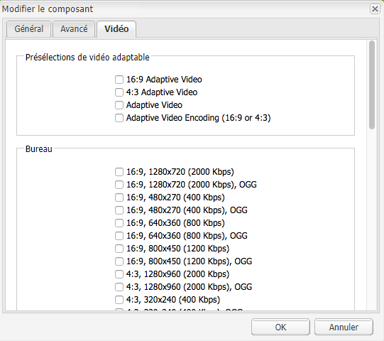
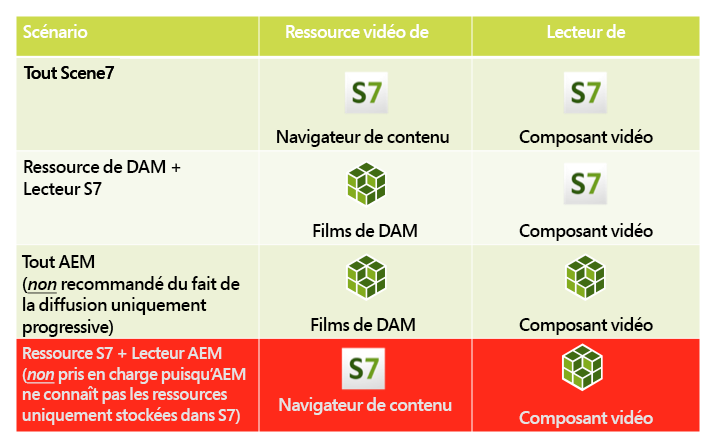

# Vidéo {#video}

Les ressources permettent une gestion centralisée des ressources vidéo, dans laquelle vous pouvez télécharger directement des vidéos vers les ressources pour un codage automatique vers Dynamic Media Classic (Scene7) et accéder aux vidéos de Dynamic Media Classic directement à partir des ressources pour la création de pages.

L’intégration vidéo de Dynamic Media Classic étend la portée de la vidéo optimisée à tous les écrans (détection automatique de périphériques et de bande passante).

* The **[!UICONTROL Scene7 Video]** component automatically performs device and bandwidth detection to play the right format and right quality video across desktop, tablets and mobile.
* Ressources - Vous pouvez inclure des ensembles de vidéos adaptables au lieu de contenus vidéo uniques. Un ensemble de vidéos adaptables est un conteneur de tous les rendus vidéo requis permettant de lire la vidéo sans heurt sur plusieurs écrans. Une visionneuse de vidéos adaptative regroupe les versions d’une même vidéo codées dans des débits et des formats différents, par exemple 400 kbit/s, 800 kbit/s et 1 000 kbit/s. Vous utilisez un ensemble de vidéos adaptables, accompagné d’un composant vidéo S7, pour la diffusion vidéo en continu adaptative sur plusieurs écrans, notamment des ordinateurs de bureau, des téléphones iOS, Android et Blackberry et des appareils mobiles Windows. Pour plus d’informations, voir [Documentation Scene7 sur les ensembles de vidéos adaptables](https://help.adobe.com/en_US/scene7/using/WS53492AE1-6029-45d8-BF80-F4B5CF33EB08.html).

## A propos de FFMPEG et de Dynamic Media Classic {#about-ffmpeg-and-scene}

Le processus de codage vidéo par défaut est basé sur l’utilisation d’une intégration basée sur FFMPEG aux profils vidéo. De ce fait, le processus d’assimilation de la gestion des actifs numériques prêt à l’emploi contient les deux étapes suivantes du processus basé sur FFMPEG :

* Miniatures FFMPEG
* Codage FFMPEG

Gardez à l’esprit que l’activation et la configuration de l’intégration de Dynamic Media Classic ne suppriment pas ou ne désactivent pas automatiquement ces deux étapes de flux de travaux du processus d’assimilation de DAM prêt à l’emploi. Si vous utilisez déjà le codage vidéo FFMPEG dans AEM, il est probable que FFMPEG soit installé dans vos environnements de création. Dans ce cas, une nouvelle vidéo ingérée à l’aide de DAM serait codée deux fois : une fois à partir de l’encodeur FFMPEG et une fois à partir de l’intégration de Dynamic Media Classic.

Si le codage vidéo basé sur FFMPEG est configuré dans AEM et que FFMPEG est installé, Adobe recommande de supprimer les deux processus FFMPEG des processus d’assimilation de la gestion des actifs numériques.

## Formats pris en charge {#supported-formats}

Les formats suivants sont pris en charge pour le composant vidéo Scene7 :

* F4V H.264
* MP4 H.264

## Choix de l’emplacement du téléchargement de la vidéo {#deciding-where-to-upload-your-video}

Le choix de l’emplacement du téléchargement du contenu vidéo dépend des éléments suivants :

* Avez-vous besoin d’un worfklow pour le contenu vidéo ?
* Avez-vous besoin d’un contrôle des versions pour le contenu vidéo ?

Si la réponse est « oui » à l’une des questions ou aux deux, téléchargez la vidéo directement dans la gestion des actifs numériques d’Adobe. Si la réponse est &quot;non&quot; aux deux questions, téléchargez votre vidéo directement dans Dynamic Media Classic. Le processus de chaque scénario est décrit dans la section suivante.

### Si vous téléchargez la vidéo directement dans la gestion des actifs numériques d’Adobe {#if-you-are-uploading-your-video-directly-to-adobe-dam}

Si vous avez besoin d’un processus ou d’une création de versions pour les ressources, vous devez tout d’abord les télécharger dans la gestion des actifs numériques d’Adobe. Vous trouverez ci-dessous le processus recommandé :

1. Téléchargez la ressource vidéo dans la gestion des actifs numériques d’Adobe et codez et publiez automatiquement la ressource vidéo dans Dynamic Media Classic.
1. Dans AEM, accédez aux contenus vidéo dans la gestion de contenu web, dans l’onglet **[!UICONTROL Films]** de l’outil de recherche de contenu.
1. Author with **[!UICONTROL Scene7 Video]** or **[!UICONTROL Foundation Video]** component.

### Si vous téléchargez la vidéo dans Scene7 {#if-you-are-uploading-your-video-to-scene}

Si vous n’avez pas besoin d’un worfklow ou d’une création de versions pour les contenus, vous devez télécharger les contenus dans Scene7. Vous trouverez ci-dessous le worfklow recommandé :

1. In Dynamic Media Classic, [set up a scheduled FTP uploading and encoding to Scene7 (system automated)](https://help.adobe.com/en_US/scene7/using/WS70B173EC-4CAD-4b4c-BF9C-43A11F3A5950.html).
1. Dans AEM, accédez aux contenus vidéo dans la gestion de contenu web, dans l’onglet **[!UICONTROL Scene7]** de l’outil de recherche de contenu.
1. Author with the **[!UICONTROL Scene7 Video]** component.

## Configuration de l’intégration avec la vidéo Scene7 {#configuring-integration-with-scene-video}

Pour configurer les paramètres prédéfinis universaux :

1. Dans **[!UICONTROL Services Cloud]**, accédez à la configuration **[!UICONTROL Scene7]** et cliquez sur **[!UICONTROL Modifier.]**
1. Sélectionnez l’onglet **[!UICONTROL Vidéo]**.

   

   >[!NOTE]
   >
   >L’onglet **[!UICONTROL Vidéo]** n’apparaît pas si la page ne comporte pas de configuration de cloud.

1. Sélectionnez le profil de codage vidéo adaptative, un profil de codage vidéo unique prêt à l’emploi ou un profil de codage vidéo personnalisé.

   >[!NOTE]
   >
   >For more information about what the video presets mean, see the [Dynamic Media Classic documentation](https://help.adobe.com/en_US/scene7/using/WSE86ACF2B-BD50-4c48-A1D7-9CD4405B62D0.html).
   >
   >Adobe recommande de sélectionner les deux ensembles de vidéos adaptables lors de la configuration des paramètres prédéfinis ou de sélectionner l’option **[!UICONTROL Codage vidéo adaptative]**.

1. Les profils de codage sélectionnés sont automatiquement appliqués à toutes les vidéos téléchargées dans le dossier cible de la gestion des actifs numériques CQ que vous avez défini pour cette configuration de cloud Scene7. Vous pouvez définir plusieurs configurations de cloud Scene7 avec différents dossiers cibles afin d’appliquer différents profils de codage, selon vos besoins.

## Mise à jour de la visionneuse et des paramètres prédéfinis de codage {#updating-viewer-and-encoding-presets}

Si vous devez mettre à jour la visionneuse et les paramètres prédéfinis de codage pour une vidéo dans AEM car les paramètres ont été mis à jour dans Scene7, accédez à la configuration Scene7 dans la configuration de cloud et cliquez sur **[!UICONTROL Mettre à jour la visionneuse et les paramètres prédéfinis de codage.]**

## Téléchargement de votre vidéo source Principale vers Scene7 à partir de la gestion des actifs numériques d’Adobe {#uploading-your-master-video}

1. Accédez au dossier cible de la gestion des actifs numériques CQ dans lequel vous avez défini la configuration de cloud avec les profils de codage Scene7.
1. Cliquez sur **[!UICONTROL Télécharger]** pour télécharger la vidéo source Principale. Video uploading and encoding is complete after the [!UICONTROL DAM Update Asset] workflow is complete and **[!UICONTROL Publish to Scene7]** has a checkmark.

   >[!NOTE]
   >
   >La génération des miniatures de vidéo peut prendre du temps.

   Dragging the DAM primary source video on to the video component accesses *all* of the Scene7 encoded proxy renditions for delivery.

## Comparaison du composant vidéo de base et du composant vidéo Scene7 {#foundation-video-component-versus-scene-video-component}

Lorsque vous utilisez AEM, vous avez accès à la fois au composant vidéo disponible dans Sites et au composant vidéo Scene7. Ces composants ne sont pas interchangeables.

Le composant vidéo Scene7 ne fonctionne que pour les vidéos Scene7. Le composant de base fonctionne avec les vidéos stockées depuis AEM (à l’aide de FFMPEG) et les vidéos Scene7.

Le tableau suivant explique les cas d’utilisation de chaque composant :

>[!NOTE]
>
>Prêt à l’emploi, le composant vidéo S7 utilise le profil vidéo universel. Vous pouvez toutefois obtenir le lecteur vidéo basé sur HTML5 pour l’utiliser par AEM en procédant de l’une des manières suivantes dans Scene7 : copiez le code incorporé du lecteur vidéo HTML5 prêt à l’emploi et placez-le dans votre page AEM.

## Composant vidéo AEM {#aem-video-component}

Même si l’utilisation du composant vidéo Scene7 est recommandée pour la visualisation des vidéos Scene7, cette section décrit l’utilisation de vidéos Scene7 avec le composant vidéo de base dans AEM et ce, afin d’être le plus complet possible.

### Comparaison de la vidéo AEM et de la vidéo Scene7 {#aem-video-and-scene-video-comparison}

Le tableau suivant fournit une comparaison de niveau élevé des fonctions prises en charge par le composant vidéo de base AEM et le composant vidéo Scene7 :

|  | Vidéo de base AEM | Vidéo Scene7 |
|---|---|---|
| Approche | Approche HTML5 en premier lieu. Flash n’est utilisé que pour le secours non HTML5. | Flash sur la plupart des ordinateurs de bureau. HTML5 est utilisé pour les mobiles et les tablettes. |
| Diffusion | Progressive | Adaptative |
| Suivi | Oui | Oui |
| Evolutivité | Oui | Oui (avec kit de développement de visionneuses de Scene7) |
| Vidéo mobile | Oui | Oui |

### Configuration {#setting-up}

#### Création de profils vidéo {#creating-video-profiles}

Les différents codages vidéo sont créés selon les paramètres prédéfinis de codage S7 sélectionnés dans la configuration de cloud S7. Afin que le composant vidéo de base les utilise, un profil vidéo doit être créé pour chaque paramètre prédéfini de codage S7 sélectionné. Cela permet au composant vidéo de sélectionner les rendus de la gestion des actifs numériques en conséquence.

>[!NOTE]
>
>Les nouveaux profils vidéo et leurs modifications doivent être activés pour la publication.

1. Dans AEM, appuyez sur **[!UICONTROL Outils] > Console ** de configuration.
1. In the **[!UICONTROL Configuration Console]** navigate to **[!UICONTROL Tools > DAM > Video Profiles]** in the navigation tree.
1. Créez un nouveau profil vidéo S7. In the **[!UICONTROL New...]** menu, select **[!UICONTROL Create Page]** and then select the Scene7 Video Profile template. Attribuez un nom à la nouvelle page de profil vidéo et cliquez sur **[!UICONTROL Créer.]**

   

1. Modifiez le nouveau profil vidéo. Sélectionnez tout d’abord la configuration de cloud. Puis, sélectionnez le même paramètre prédéfini de codage que celui sélectionné dans la configuration de cloud.

   

   | Propriété | Description |
   |---|---|
   | Configuration de cloud Scene7 | Configuration de cloud à utiliser pour les paramètres prédéfinis de codage. |
   | Paramètre prédéfini de codage Scene7 | Paramètre prédéfini de codage à associer à ce profil vidéo. |
   | Type de vidéo HTML5 | Cette propriété permet de définir la valeur de la propriété du type de l’élément source vidéo HTML5. Ces informations ne sont pas fournies par les paramètres prédéfinis de codage S7 mais requises pour effectuer correctement le rendu des vidéos en utilisant l’élément vidéo HTML5. Une liste des formats courants est fournie mais ils peuvent être remplacés par d’autres formats. |

   Répétez cette étape pour tous les paramètres prédéfinis de codage sélectionnés dans la configuration de cloud que vous voulez utiliser dans le composant vidéo.

#### Configuring design {#configuring-design}

The **[!UICONTROL Foundation Video]** component must know about what video profiles to use in order to build the video sources list. Vous devez ouvrir la boîte de dialogue de conception des composants vidéo et configurer la conception des composants pour l’utilisation des nouveaux profils vidéo.

>[!NOTE]
>
>If you use the **[!UICONTROL Foundation Video]** component on a mobile page, you might need to repeat these steps on the design of the mobile page.

>[!NOTE]
>
>Les modifications apportées à la conception requièrent l’activation de la conception afin qu’elles prennent effet lors de la publication.

1. Open the **[!UICONTROL Foundation Video]** component&#39;s design dialog box and change to the **[!UICONTROL Profiles]** tab. Supprimez ensuite les profils prêts à l’emploi et ajoutez les nouveaux profils vidéo S7. L’ordre de la liste de profil dans la boîte de dialogue de conception définit l’ordre de l’élément sources vidéo lors du rendu.
1. Pour les navigateurs qui ne prennent pas en charge HTML5, le composant vidéo permet de configurer un Flash de secours. Open the video components design dialog box and change to the **[!UICONTROL Flash]** tab. Configurez les paramètres du lecteur de Flash et attribuez un profil de secours au lecteur Flash.

#### Liste de contrôle {#checklist}

1. Créer une configuration de cloud S7. S’assurer que les paramètres prédéfinis de codage vidéo sont définis et que l’importateur fonctionne.
1. Créer un profil vidéo S7 pour chaque paramètre prédéfini de codage vidéo sélectionné dans la configuration de cloud.
1. Les profils vidéo doivent être activés.
1. Configure the design of the **[!UICONTROL oundation Video]** component on your page.
1. Activer la conception une fois que vous avez terminé les modifications de cette dernière.

