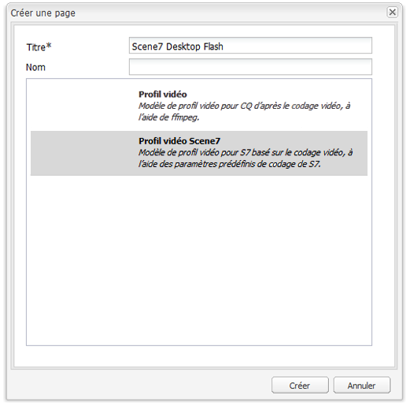

# Vidéo {#video}

Adobe Experience Manager Assets fournit une gestion du contenu vidéo centralisée où vous pouvez charger des vidéos directement dans Assets pour un codage automatique sur Dynamic Media Classic et accéder aux vidéos Dynamic Media Classic directement depuis Assets à des fins de création de page.

L’intégration vidéo de Dynamic Media Classic étend la portée de la vidéo optimisée à tous les écrans (détection automatique de l’appareil et de la bande passante).

* Le composant **[!UICONTROL vidéo Scene7]** procède automatiquement à la détection de l’appareil et de la bande passante afin de lire la vidéo au format adéquat avec la qualité optimale sur des ordinateurs de bureau, des tablettes et des téléphones mobiles.
* Assets - Vous pouvez inclure des visionneuses de vidéos adaptatives au lieu de ressources vidéo uniques. Une visionneuse de vidéos adaptatives contient tous les rendus vidéo nécessaires pour lire la vidéo en toute transparence sur plusieurs écrans. Une visionneuse de vidéos adaptative regroupe les versions d’une même vidéo codées dans des débits et des formats différents, par exemple 400 kbit/s, 800 kbit/s et 1 000 kbit/s. Vous utilisez une visionneuse de vidéos adaptatives, accompagné d’un composant vidéo S7, pour la diffusion vidéo en continu adaptative sur plusieurs écrans, notamment des ordinateurs de bureau, des téléphones iOS, Android™ et BlackBerry® et des appareils mobiles Windows.
<!-- See [Scene7 documentation about adaptive video sets for more information](https://help.adobe.com/en_US/scene7/using/WS53492AE1-6029-45d8-BF80-F4B5CF33EB08.html). -->

## A propos de FFMPEG et de Dynamic Media Classic {#about-ffmpeg-and-scene}

Le workflow de codage vidéo par défaut est basé sur l’utilisation d’une intégration basée sur FFMPEG aux profils vidéo. Par conséquent, le workflow d’ingestion DAM prêt à l’emploi contient les deux étapes suivantes du workflow basé sur ffmpeg :

* Miniatures FFMPEG
* Encodage FFMPEG

Gardez à l’esprit que l’activation et la configuration de l’intégration ne suppriment ou ne désactivent pas automatiquement ces deux étapes du workflow prêt à l’emploi d’assimilation de la gestion des ressources numériques. Si vous utilisez déjà le codage vidéo FFMPEG dans Adobe Experience Manager, il est probable que FFMPEG soit installé dans vos environnements de création. Dans ce cas, une nouvelle vidéo assimilée à l’aide de la gestion des ressources numériques est codée deux fois : une fois par le codeur FFMPEG et une fois par l’intégration de Dynamic Media Classic.

Si le codage vidéo basé sur FFMPEG est configuré dans Experience Manager et que FFMPEG est installé, Adobe recommande de supprimer les deux processus FFMPEG des workflows d’assimilation de la gestion des ressources numériques.

## Formats pris en charge {#supported-formats}

Les formats suivants sont pris en charge pour le composant vidéo Scene7 :

* F4V H.264
* MP4 H.264

## Choix de l’emplacement du chargement de la vidéo {#deciding-where-to-upload-your-video}

Le choix de l’emplacement de chargement de vos ressources vidéo dépend des éléments suivants :

* Avez-vous besoin d’un workflow pour la ressource vidéo ?
* Avez-vous besoin d’un contrôle de version pour la ressource vidéo ?

Si la réponse à une ou deux de ces questions est « oui », téléchargez votre vidéo directement dans la gestion des DAM d’Adobe. Si la réponse est « non » aux deux questions, chargez la vidéo directement dans Dynamic Media Classic. Le workflow de chaque scénario est décrit dans la section suivante.

### Si vous téléchargez la vidéo directement vers la gestion des ressources numériques Adobe {#if-you-are-uploading-your-video-directly-to-adobe-dam}

Si vous avez besoin d’un workflow ou d’une création de versions pour les ressources, vous devez tout d’abord les télécharger dans la gestion des ressources numériques d’Adobe. Vous trouverez ci-dessous le workflow recommandé :

1. Chargez la ressource vidéo dans la gestion des ressources numériques d’Adobe et codez et publiez automatiquement dans Dynamic Media Classic.
1. Dans Experience Manager, accédez aux contenus vidéo dans la gestion de contenu web, dans l’onglet **[!UICONTROL Films]** de l’outil de recherche de contenu.
1. Créez avec le composant **[!UICONTROL vidéo Scene7]** ou **[!UICONTROL vidéo de base]**.

### Si vous chargez la vidéo vers Dynamic Media Classic {#if-you-are-uploading-your-video-to-scene}

Si vous n’avez pas besoin d’un workflow ou d’une création de versions pour vos ressources, chargez-les vers Scene7. Vous trouverez ci-dessous le workflow recommandé :

1. Dans Dynamic Media Classic, [configurez un chargement FTP et un codage programmés dans Scene7 (système automatisé)](https://experienceleague.adobe.com/docs/dynamic-media-classic/using/upload-publish/uploading-files.html?lang=fr#upload-files-using-via-ftp).
1. Dans Experience Manager, accédez aux contenus vidéo dans la gestion de contenu web, dans l’onglet **[!UICONTROL Scene7]** de l’outil de recherche de contenu.
1. Créez avec le composant **[!UICONTROL vidéo Scene7]**.

## Configuration de l’intégration avec la vidéo Scene7 {#configuring-integration-with-scene-video}

1. Dans **[!UICONTROL Services cloud]**, accédez à la configuration **[!UICONTROL Scene7]** et sélectionnez **[!UICONTROL Modifier]**.
1. Sélectionnez l’onglet **[!UICONTROL Vidéo]**.

   

   >[!NOTE]
   >
   >L’onglet **[!UICONTROL Vidéo]** n’apparaît pas si la page ne comporte pas de configuration cloud.

1. Sélectionnez le profil de codage vidéo adaptative, un profil de codage vidéo unique prêt à l’emploi ou un profil de codage vidéo personnalisé.

   >[!NOTE]
   >
   >Pour plus d’informations sur la signification des paramètres prédéfinis de vidéo, consultez la [documentation de Dynamic Media Classic](https://experienceleague.adobe.com/docs/dynamic-media-classic/using/setup/application-setup.html?lang=fr#video-presets-for-encoding-video-files).
   >
   >Adobe recommande de sélectionner les deux visionneuses de vidéos adaptatives lors de la configuration des paramètres prédéfinis ou de sélectionner l’option **[!UICONTROL Codage vidéo adaptatif]**.

1. Les profils de codage sélectionnés sont automatiquement appliqués à toutes les vidéos chargées dans le dossier cible de la gestion des actifs numériques CQ que vous configurez pour cette configuration de cloud Scene7. Vous pouvez configurer plusieurs configurations de cloud Scene7 avec différents dossiers cibles afin d’appliquer différents profils de codage selon vos besoins.

## Mise à jour de la visionneuse et des paramètres prédéfinis de codage {#updating-viewer-and-encoding-presets}

Pour mettre à jour la visionneuse et les paramètres prédéfinis de codage pour une vidéo car les paramètres ont été mis à jour dans Scene7, accédez à la configuration Scene7 dans la configuration cloud et cliquez sur **[!UICONTROL Mettre à jour la visionneuse et les paramètres prédéfinis de codage]**.

## Chargement de la vidéo source principale vers Scene7 à partir de la gestion des ressources numériques d’Adobe {#uploading-your-master-video}

1. Accédez au dossier cible de la gestion des ressources numériques CQ dans lequel vous avez défini la configuration de cloud avec les profils de codage Scene7.
1. Sélectionnez **[!UICONTROL Charger]** pour charger une vidéo source principale. Le chargement et le codage de la vidéo sont terminés une fois que le workflow de mise à jour de la [!UICONTROL ressource de gestion des ressources numériques] est achevé et que l’option **[!UICONTROL Publier sur Scene7]** comporte une coche.

   >[!NOTE]
   >
   >La génération des miniatures de vidéo prend du temps.

   Faites glisser la vidéo de source principale de la gestion des ressources numériques sur le composant vidéo permet d’accéder à *tous* les rendus proxy codés Scene7 pour les diffuser.

## Comparaison du composant vidéo de base et du composant vidéo Scene7 {#foundation-video-component-versus-scene-video-component}

Lorsque vous utilisez Experience Manager, vous avez accès à la fois au composant vidéo disponible dans Sites et au composant vidéo Scene7. Ces composants ne sont pas interchangeables.

Le composant vidéo Scene7 fonctionne uniquement pour les vidéos Scene7. Le composant de base fonctionne avec les vidéos stockées depuis Experience Manager (à l’aide de FFMPEG) et les vidéos Scene7.

Le tableau suivant explique les cas d’utilisation de chaque composant :

>[!NOTE]
>
>Prêt à l’emploi, le composant vidéo S7 utilise le profil vidéo universel. Vous pouvez toutefois obtenir le lecteur vidéo basé sur HTML5 pour l’utiliser avec Experience Manager. Dans Scene7, copiez le code incorporé du lecteur vidéo HTML5 prêt à l’emploi et placez-le dans votre page Experience Manager.

## Composant vidéo Experience Manager {#aem-video-component}

Même si l’utilisation du composant vidéo Scene7 est recommandée pour la visualisation des vidéos Scene7, cette section décrit l’utilisation de vidéos Scene7 avec le composant vidéo de base dans Experience Manager et ce, afin d’être le plus complet possible.

### Comparaison des vidéos Experience Manager et des vidéos Scene7 {#aem-video-and-scene-video-comparison}

Le tableau suivant fournit une comparaison de niveau élevé des fonctions prises en charge par le composant vidéo de base d’Experience Manager et le composant vidéo Scene7 :

|   | Vidéo de base Experience Manager | Vidéo Scene7 |
|---|---|---|
| Approche | Première approche HTML5. Flash n’est utilisé que pour la version de secours autre que HTML5. | Flash sur la plupart des ordinateurs de bureau. HTML5 est utilisé pour les appareils mobiles et les tablettes. |
| Diffusion | Progressif | Diffusion en continu à débit adaptatif |
| Tracking | Oui | Oui |
| Extensibilité | Oui | Non |
| Vidéo pour mobiles | Oui | Oui |

### Configuration {#setting-up}

#### Création de profils vidéo {#creating-video-profiles}

Les différents codages vidéo sont créés selon les paramètres prédéfinis de codage S7 sélectionnés dans la configuration cloud de S7. Pour que le composant vidéo de base puisse les utiliser, un profil vidéo doit être créé pour chaque paramètre prédéfini de codage S7 sélectionné. Cela permet au composant vidéo de sélectionner les rendus de la gestion des ressources numériques en conséquence.

>[!NOTE]
>
>Les nouveaux profils vidéo et leurs modifications doivent être activés pour la publication.

1. Dans Experience Manager, sélectionnez **[!UICONTROL Outils]** > **[!UICONTROL Console de configuration]**.
1. Dans la **[!UICONTROL console de configuration]**, accédez à **[!UICONTROL Outils]** -> **[!UICONTROL Gestion des ressources numériques]** -> **[!UICONTROL Profils vidéo]** dans l’arborescence de navigation.
1. Créez un profil vidéo S7. Dans le menu **[!UICONTROL Nouveau]**, sélectionnez **[!UICONTROL Créer une page]**, puis sélectionnez le modèle de profil vidéo Scene7. Attribuez un nom à la nouvelle page de profil vidéo et sélectionnez **[!UICONTROL Créer]**.

   

1. Modifiez le nouveau profil vidéo. Sélectionnez d’abord la configuration cloud. Sélectionnez ensuite le même paramètre prédéfini de codage que celui sélectionné dans la configuration cloud.

   

   | Propriété | Description |
   |---|---|
   | Configuration du cloud Scene7 | Configuration cloud à utiliser pour les paramètres prédéfinis de codage. |
   | Paramètre prédéfini de codage de Scene7 | Paramètre prédéfini de codage avec lequel mapper ce profil vidéo. |
   | Type vidéo HTML5 | Cette propriété vous permet de définir la valeur de la propriété du type de l’élément source vidéo HTML5. Ces informations ne sont pas fournies par les paramètres prédéfinis de codage S7, mais sont requises pour effectuer correctement le rendu des vidéos à l’aide de l’élément vidéo HTML5. Une liste des formats courants est fournie mais ils peuvent être remplacés par d’autres formats. |

   Répétez cette étape pour tous les paramètres prédéfinis de codage sélectionnés dans la configuration cloud que vous voulez utiliser dans le composant vidéo.

#### Configuration de la conception {#configuring-design}

La variable **[!UICONTROL Vidéo de base]** doit connaître les profils vidéo à utiliser pour créer la liste des sources vidéo. Vous devez ouvrir la boîte de dialogue de conception des composants vidéo et configurer la conception des composants pour l’utilisation des nouveaux profils vidéo.

>[!NOTE]
>
>Si vous utilisez le composant **[!UICONTROL vidéo de base]** sur une page mobile, vous devrez peut-être répéter ces étapes pour la conception de la page mobile.

>[!NOTE]
>
>Les modifications apportées à la conception nécessitent l’activation de la conception pour qu’elle prenne effet lors de la publication.

1. Ouvrez la boîte de dialogue de conception des composants **[!UICONTROL vidéo de base]** et sélectionnez l’onglet **[!UICONTROL Profils]**. Supprimez ensuite les profils prêts à l’emploi et ajoutez les nouveaux profils vidéo S7. L’ordre de la liste des profils de la boîte de dialogue de conception définit également l’ordre des sources vidéo lors du rendu.
1. Pour les navigateurs ne prenant pas en charge le HTML5, le composant vidéo permet de configurer Flash comme solution de secours. Ouvrez la boîte de dialogue de conception des composants vidéo et sélectionnez l’onglet **[!UICONTROL Flash]**. Configurez les paramètres du lecteur Flash et affectez un profil de secours au lecteur.

#### Liste de contrôle {#checklist}

1. Créez une configuration de cloud S7. Assurez-vous que les paramètres prédéfinis de codage vidéo sont définis et que l’importateur fonctionne.
1. Créez un profil vidéo S7 pour chaque paramètre prédéfini de codage vidéo sélectionné dans la configuration cloud.
1. Les profils vidéo doivent être activés.
1. Configurez la conception du composant **[!UICONTROL vidéo de base]** sur votre page.
1. Activez la conception une fois que vous avez terminé les modifications sur cette dernière.
