# Ajout de fonctionnalités Dynamic Media Classic à votre page {#adding-scene-features-to-your-page}

[Adobe Dynamic Media ](https://help.adobe.com/en_US/scene7/using/WS26AB0D9A-F51C-464e-88C8-580A5A82F810.html) Classic est une solution hébergée qui permet de gérer, d’améliorer, de publier et de diffuser des ressources multimédias enrichies sur le Web, les appareils mobiles, les e-mails et les appareils d’impression connectés à Internet.

Vous pouvez afficher AEM ressources publiées dans Dynamic Media Classic dans différentes visionneuses :

* Zoom
* Fenêtre déroulante
* Vidéo
* Modèle d’image
* Image

Vous pouvez publier des ressources numériques directement d’AEM vers Dynamic Media Classic et vous pouvez publier des ressources numériques de Dynamic Media Classic vers AEM.

Ce document décrit comment publier des ressources numériques d’AEM vers Dynamic Media Classic et vice versa. Les visionneuses sont également décrites en détail. Pour plus d’informations sur la configuration d’AEM pour Dynamic Media Classic, voir [Intégration de Dynamic Media Classic à AEM](/help/sites-administering/scene7.md).

Voir aussi [Ajout de zones cliquables](image-maps.md).

Pour plus d’informations sur l’utilisation de composants vidéo avec AEM, consultez la section [Vidéo](video.md).

>[!NOTE]
>
>Si les ressources Dynamic Media Classic ne s’affichent pas correctement, assurez-vous que Dynamic Media est [désactivé](config-dynamic.md#disabling-dynamic-media), puis actualisez la page.

## Publication manuelle dans Dynamic Media Classic à partir de ressources {#manually-publishing-to-scene-from-assets}

Vous pouvez publier des ressources numériques dans Dynamic Media Classic comme suit :

* [Dans l’interface utilisateur classique de la console Ressources](/help/sites-classic-ui-authoring/manage-assets-classic-s7.md#publishing-from-the-assets-console)
* [Dans l’interface utilisateur classique d’une ressource](/help/sites-classic-ui-authoring/manage-assets-classic-s7.md#publishing-from-an-asset)
* [Dans l’interface utilisateur classique en dehors du dossier cible CQ](/help/sites-classic-ui-authoring/manage-assets-classic-s7.md#publishing-assets-from-outside-the-cq-target-folder)

>[!NOTE]
>
>AEM publie dans Dynamic Media Classic de manière asynchrone. Après avoir cliqué sur **[!UICONTROL Publier]**, la publication de votre ressource vers Dynamic Media Classic peut prendre plusieurs secondes.

## Composants Dynamic Media Classic {#scene-components}

Les composants Dynamic Media Classic suivants sont disponibles dans AEM :

* Zoom
* Fenêtre déroulante (Zoom)
* Modèle d’image
* Image
* Vidéo

>[!NOTE]
>
>Ces composants ne sont pas disponibles par défaut et doivent être sélectionnés en mode **[!UICONTROL Conception]** avant utilisation.

Une fois qu’elles sont disponibles en mode **[!UICONTROL Conception]** , vous pouvez ajouter les composants à votre page comme tout autre composant AEM. Les ressources qui n’ont pas encore été publiées dans Dynamic Media Classic le sont dans Dynamic Media Classic si elles se trouvent dans un dossier synchronisé, sur une page ou avec une configuration de cloud Dynamic Media Classic.

>[!NOTE]
>
>Si vous créez et développez des visionneuses personnalisées et que vous utilisez l’outil de recherche de contenu, vous devez explicitement ajouter le paramètre **[!UICONTROL allowfullscreen]** .

### Notification de fin de prise en charge de la visionneuse Flash {#flash-viewers-end-of-life-notice}

À compter du 31 janvier 2017, Adobe Dynamic Media Classic a mis fin à la prise en charge de la plate-forme de la visionneuse de Flashs.

Pour plus d’informations sur cette importante modification, reportez-vous aux [questions fréquentes sur la fin de prise en charge de la visionneuse Flash](https://docs.adobe.com/content/docs/en/aem/6-1/administer/integration/marketing-cloud/scene7/flash-eol.html).

### Ajout d’un composant Dynamic Media Classic (Scene7) à une page {#adding-a-scene-component-to-a-page}

L’ajout d’un composant Dynamic Media Classic (Scene7) à une page est identique à l’ajout d’un composant à n’importe quelle page. Les composants de Dynamic Media Classic sont décrits en détail dans les sections suivantes.

**Pour ajouter un composant Dynamic Media Classic (Scene7) à une page**

1. Dans AEM, ouvrez la page dans laquelle vous souhaitez ajouter le composant Dynamic Media Classic (Scene7).

1. Si aucun composant Dynamic Media Classic n’est disponible, cliquez sur le mode **[!UICONTROL Conception]**, appuyez sur n’importe quel composant avec une bordure bleue, appuyez sur l’icône **[!UICONTROL Parent]**, puis sur l’icône **[!UICONTROL Configuration]** . Dans **[!UICONTROL Parsys (Design)]**, sélectionnez tous les composants Dynamic Media Classic pour les rendre disponibles, puis cliquez sur **[!UICONTROL OK.]**

   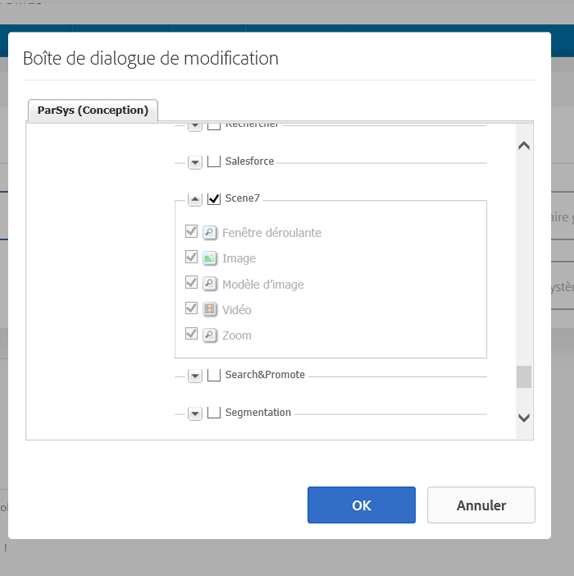

1. Cliquez sur **[!UICONTROL Modifier]** pour revenir au mode **[!UICONTROL Édition]**.

1. Faites glisser un composant du groupe Dynamic Media Classic du sidekick vers la page à l’emplacement souhaité.

1. Cliquez sur l’icône **[!UICONTROL Configuration]** pour ouvrir le composant.

1. Modifiez le composant comme requis et cliquez sur **[!UICONTROL OK]** pour enregistrer les modifications.
1. Faites glisser l’image ou la vidéo de l’explorateur de contenu vers le composant Dynamic Media Classic que vous avez ajouté à la page.

   >[!NOTE]
   >
   >Dans l’interface utilisateur tactile uniquement, vous devez faire glisser l’image ou la vidéo sur le composant Dynamic Media Classic que vous avez placé sur la page. La sélection et la modification du composant Dynamic Media Classic, puis le choix de la ressource ne sont pas prises en charge.

### Ajout d’expériences d’affichage interactif à un site réactif {#adding-interactive-viewing-experiences-to-a-responsive-website}

Une conception réactive signifie que les éléments s’adaptent selon l’emplacement où ils sont affichés. Avec la conception réactive, les mêmes éléments peuvent être affichés sur plusieurs appareils.

Voir aussi [Conception réactive pour les pages Web](/help/sites-developing/responsive.md).

**Ajout d’une expérience de visionnage interactif à un site réactif**

1. Connectez-vous à AEM et vérifiez que vous disposez des [Cloud Services Dynamic Media Classic d’Adobe configurés](/help/sites-administering/scene7.md#configuring-scene-integration) et que les composants Dynamic Media Classic sont disponibles.

   >[!NOTE]
   >
   >Si les composants Dynamic Media Classic ne sont pas disponibles, veillez à les [activer au moyen du mode Conception](/help/sites-authoring/default-components-designmode.md).

1. Sur un site web dont les composants **[!UICONTROL Dynamic Media Classic]** sont activés, faites glisser un composant **[!UICONTROL Image]** vers la page.
1. Sélectionnez le composant et appuyez sur l’icône de configuration.
1. Dans l’onglet **[!UICONTROL Paramètres Dynamic Media Classic]** , ajustez les points d’arrêt.

   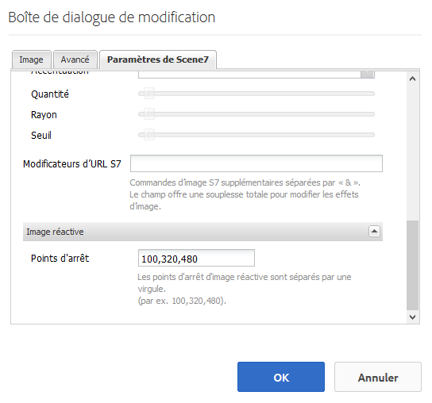

1. Confirmez que les visionneuses se redimensionnent de manière réactive et que toutes les interactions sont optimisées pour les ordinateurs de bureau, les tablettes et les appareils mobiles.

### Paramètres communs à tous les composants Dynamic Media Classic {#settings-common-to-all-scene-components}

Bien que les options de configuration varient, les éléments suivants sont communs à tous les composants [!UICONTROL Dynamic Media Classic] :

* **[!UICONTROL Référence du fichier]**  : accédez à un fichier que vous souhaitez référencer. La référence au fichier affiche l’URL de la ressource et pas nécessairement l’URL complète de Dynamic Media Classic, y compris les commandes et paramètres d’URL. Vous ne pouvez pas ajouter de commandes d’URL et de paramètres Dynamic Media Classic dans ce champ. Ils doivent être ajoutés par l’intermédiaire de la fonctionnalité correspondante du composant.
* **[!UICONTROL Largeur]**  : permet de définir la largeur.
* **[!UICONTROL Hauteur]**  : permet de définir la hauteur.

Vous définissez ces options de configuration en ouvrant (en double-cliquant) un composant Dynamic Media Classic, par exemple, lorsque vous ouvrez un composant **[!UICONTROL Zoom]** :

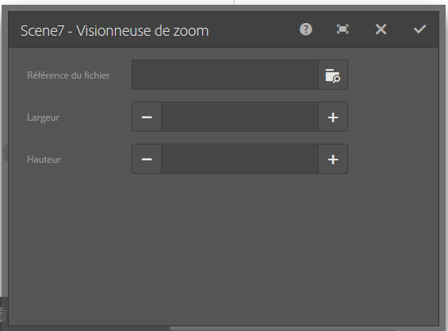

### Zoom {#zoom}

Le composant Zoom HTML5 affiche une image plus grande lorsque vous appuyez sur le bouton **[!UICONTROL +]**.

L’élément comporte des outils de zoom dans sa partie inférieure. Appuyez sur **[!UICONTROL +]** pour agrandir. Appuyez sur **[!UICONTROL -]** pour réduire. Appuyez sur la **[!UICONTROL x]** ou la flèche de réinitialisation du zoom pour ramener l’image à la taille d’origine dans laquelle elle a été importée. Appuyez sur les flèches diagonales pour afficher le mode Plein écran. Appuyez sur **[!UICONTROL Modifier]** pour configurer le composant. Avec ce composant, vous pouvez configurer les [paramètres communs à tous les [!UICONTROL composants Dynamic Media Classic]](#settings-common-to-all-scene-components).

### Fenêtre déroulante {#flyout}

Dans le composant HTML5 **[!UICONTROL Fenêtre déroulante]** , la ressource s’affiche sous la forme d’écran partagé ; laissait la ressource à la taille spécifiée ; la partie zoom s’affiche à droite. Appuyez sur **[!UICONTROL Modifier]** pour configurer le composant. Avec ce composant, vous pouvez configurer les [paramètres communs à tous les composants Dynamic Media Classic](#settings-common-to-all-scene-components).

>[!NOTE]
>
>Si votre composant **[!UICONTROL Fenêtre déroulante]** utilise une taille personnalisée, cette taille personnalisée est utilisée et la configuration réactive du composant est désactivée.
>
>Si votre composant **[!UICONTROL Fenêtre déroulante]** utilise la taille par défaut, comme défini dans la **[!UICONTROL Vue de conception]**, la taille par défaut est utilisée et le composant s’étire pour s’adapter à la taille de la mise en page avec la configuration réactive du composant activée. Sachez toutefois qu’il existe une limitation de la configuration réactive du composant. Lorsque vous utilisez le composant **[!UICONTROL Fenêtre déroulante]** avec une configuration réactive, vous ne devez pas l’utiliser avec l’extension de page entière. Sinon, la **[!UICONTROL fenêtre déroulante]** peut s’étendre au-delà de la bordure droite de la page.

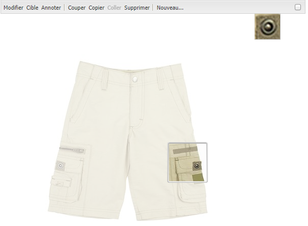

### Image {#image}

Le composant Dynamic Media Classic **[!UICONTROL Image]** vous permet d’ajouter la fonctionnalité Dynamic Media Classic à vos images, comme les modificateurs Dynamic Media Classic, les paramètres d’image ou de visionneuse prédéfinis et l’accentuation. Le composant Dynamic Media Classic **[!UICONTROL Image]** est similaire aux autres composants d’image d’AEM avec des fonctionnalités spéciales de Dynamic Media Classic. Dans cet exemple, le modificateur d’URL Dynamic Media Classic `&op_invert=1` est appliqué à l’image.

**[!UICONTROL Titre, texte de remplacement]**  : dans l’onglet  **** Avancé, ajoutez un titre à l’image et un texte de remplacement pour les utilisateurs pour lesquels les graphiques sont désactivés.

**[!UICONTROL URL, Ouvrir dans]**  : vous pouvez définir une ressource à partir de pour ouvrir un lien. Définissez l’**[!UICONTROL URL]**, puis dans le champ **[!UICONTROL Ouvrir dans]**, indiquez si vous souhaitez l’ouvrir dans la même fenêtre ou une nouvelle fenêtre.

**[!UICONTROL Paramètre prédéfini de la visionneuse]**  : sélectionnez un paramètre prédéfini de visionneuse existant. Si le paramètre prédéfini de visionneuse que vous recherchez n’est pas visible, vous devrez le rendre visible. Voir [Gestion des paramètres prédéfinis de visionneuse](/help/assets/managing-viewer-presets.md). Si vous utilisez un paramètre prédéfini d’image, vous ne pouvez pas sélectionner de paramètre prédéfini de visionneuse, et inversement.

**[!UICONTROL Configuration de Dynamic Media Classic]**  : sélectionnez la configuration de Dynamic Media Classic que vous souhaitez utiliser pour récupérer les paramètres d’image prédéfinis principaux à partir de SPS.

**[!UICONTROL Paramètre d’image prédéfini]**  : sélectionnez un paramètre d’image prédéfini existant. Si le paramètre d’image prédéfini que vous recherchez n’est pas visible, vous devrez le rendre visible. Voir [Gestion des paramètres d’image prédéfinis](/help/assets/managing-image-presets.md). Si vous utilisez un paramètre prédéfini d’image, vous ne pouvez pas sélectionner de paramètre prédéfini de visionneuse, et inversement.

**[!UICONTROL Format de sortie]**  : sélectionnez le format de sortie de l’image, par exemple jpeg. Selon le format de sortie que vous sélectionnez, vous pouvez ajouter des options de configuration supplémentaires. Voir [Bonnes pratiques relatives aux paramètres d’image prédéfinis](/help/assets/managing-image-presets.md#image-preset-options).

**[!UICONTROL Accentuation]**  : sélectionnez le mode d’accentuation de l’image. L’accentuation est expliquée en détails dans les rubriques [Bonnes pratiques relatives aux paramètres d’image prédéfinis](/help/assets/managing-image-presets.md#image-preset-options) et [Bonnes pratiques relatives à l’accentuation](/help/assets/assets/sharpening_images.pdf).

**[!UICONTROL Modificateurs d’URL]**  : vous pouvez modifier les effets d’image en fournissant des commandes d’image Dynamic Media Classic supplémentaires. Ces commandes sont décrites dans la section [Paramètres prédéfinis d’image](/help/assets/managing-image-presets.md) et le [guide de référence des commandes](https://experienceleague.adobe.com/docs/dynamic-media-developer-resources/image-serving-api/image-serving-api/http-protocol-reference/command-reference/c-command-reference.html).

**[!UICONTROL Points d’arrêt]**  : si votre site web est réactif, vous souhaitez ajuster les points d’arrêt. Les points d’arrêt doivent être séparés par des virgules ( , ).

### Modèle d’image {#image-template}

[Les ](https://docs.adobe.com/help/en/dynamic-media-classic/using/template-basics/quick-start-template-basics.html) modèles d’image Dynamic Media Classic sont du contenu Photoshop superposé qui a été importé dans Dynamic Media Classic, où le contenu et les propriétés ont été paramétrés pour la variabilité. Le composant **[!UICONTROL Modèle d’image]** permet d’importer des images et de modifier le texte dynamiquement dans AEM. En outre, vous pouvez configurer le composant **[!UICONTROL Modèle d’image]** afin d’utiliser des valeurs provenant de ClientContext de sorte que chaque utilisateur voit l’image d’une manière personnalisée.

Appuyez sur **[!UICONTROL Modifier]** pour configurer le composant. Vous pouvez configurer les [paramètres communs à tous les composants Dynamic Media Classic](#settings-common-to-all-scene-components) ainsi que d’autres paramètres décrits dans cette section.

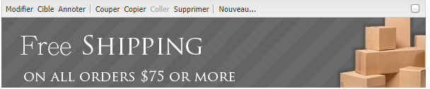

**[!UICONTROL Référence de fichier, largeur, hauteur]**  : voir les paramètres communs à tous les composants ScDynamic Media Classic7.

>[!NOTE]
>
>Les commandes et paramètres d’URL de Dynamic Media Classic ne peuvent pas être ajoutés directement à l’URL de référence du fichier. Ils ne peuvent être définis que dans l’interface utilisateur du composant, dans le panneau **[!UICONTROL Paramètre]**.

**[!UICONTROL Titre, texte de remplacement]**  : dans l’onglet Modèle d’image Dynamic Media Classic, ajoutez un titre à l’image et un texte de remplacement pour les utilisateurs pour lesquels les graphiques sont désactivés.

**[!UICONTROL URL, Ouvrir dans]**  : vous pouvez définir une ressource à partir de pour ouvrir un lien. Définissez l’URL, puis dans le champ Ouvrir dans, indiquez si vous souhaitez l’ouvrir dans la même fenêtre ou une nouvelle fenêtre.

**[!UICONTROL Panneau de paramètres]**  : lors de l’importation d’une image, les paramètres sont prérenseignés avec les informations de l’image. En l’absence de contenu pouvant être modifié dynamiquement, cette fenêtre est vide.

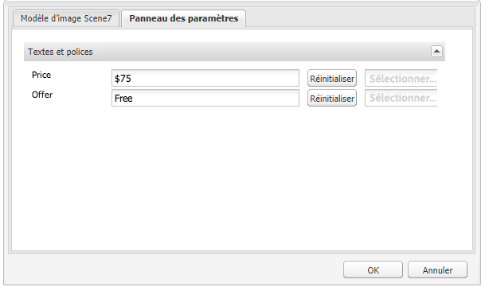

#### Modification dynamique du texte {#changing-text-dynamically}

Pour une modification dynamique du texte, saisissez le nouveau texte dans les champs, puis cliquez sur **[!UICONTROL OK.]** Dans cet exemple, le **[!UICONTROL Prix]** est désormais de 50 $ et l’expédition de 99 cents.

Le texte de l’image change. Vous pouvez rétablir la valeur d’origine du texte en appuyant sur **[!UICONTROL Réinitialiser]** en regard du champ.

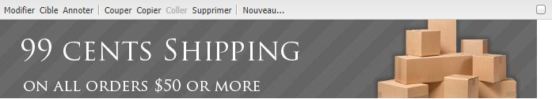

#### Modification du texte afin de refléter une valeur ClientContext {#changing-text-to-reflect-the-value-of-a-client-context-value}

Pour lier un champ à une valeur de contexte client, appuyez sur **[!UICONTROL Sélectionner]** pour ouvrir le menu contextuel client, sélectionnez le contexte client, puis appuyez sur **[!UICONTROL OK.]** Dans cet exemple, le nom change selon la liaison entre le Nom et le nom formaté du profil.

Le texte reflète le nom de l’utilisateur actuellement connecté. Vous pouvez réinitialiser le texte sur la valeur d’origine en cliquant sur **[!UICONTROL Réinitialiser]** en regard du champ.

#### Définition du modèle d’image Dynamic Media Classic comme lien {#making-the-scene-image-template-a-link}

1. Sur la page avec le composant Dynamic Media Classic **[!UICONTROL Modèle d’image]**, appuyez sur **[!UICONTROL Modifier.]**
1. Dans le champ **[!UICONTROL URL]** , saisissez l’URL à laquelle les utilisateurs accèdent lorsqu’ils cliquent sur l’image. Dans le champ **[!UICONTROL Ouvrir dans]**, choisissez où vous souhaitez que la cible s’ouvre (une nouvelle fenêtre ou la même fenêtre).

   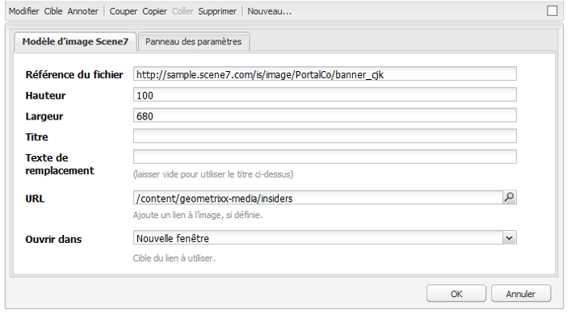

1. Appuyez sur **[!UICONTROL OK.]**

### Composant vidéo {#video-component}

Le composant Dynamic Media Classic **[!UICONTROL Vidéo]** (disponible à partir de la section Dynamic Media Classic du sidekick) utilise la détection de l’appareil et de la bande passante pour diffuser la vidéo appropriée à chaque écran. Ce composant est un lecteur vidéo HTML5. Il s’agit d’une visionneuse unique pouvant être utilisée sur plusieurs canaux.

Il peut être utilisé pour des ensembles de vidéos adaptables, une vidéo MP4 unique ou une vidéo F4V unique.

Voir [Vidéo](s7-video.md) pour plus d’informations sur le fonctionnement des vidéos avec l’intégration de Dynamic Media Classic. En outre, voir [le composant vidéo Dynamic Media Classic par rapport au composant vidéo Foundation](s7-video.md).

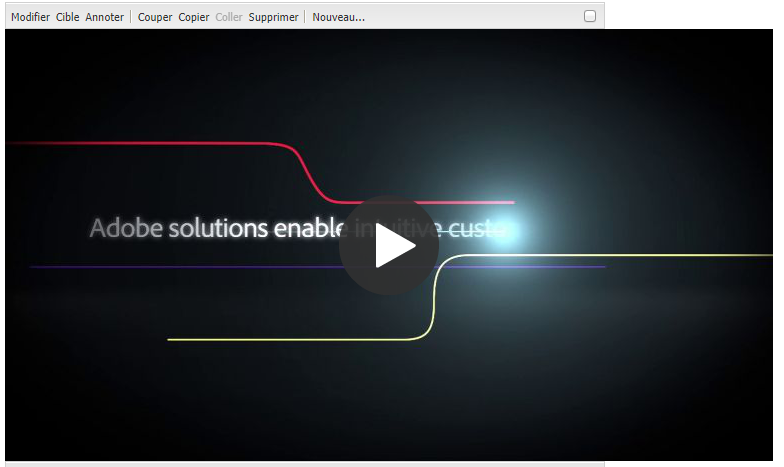

### Limitations connues du composant vidéo {#known-limitations-for-the-video-component}

Adobe DAM et WCM indiquent si une vidéo source Principale est téléchargée. Elles n’affichent pas les éléments proxy suivants :

* Rendus codés Dynamic Media Classic
* Visionneuses de vidéos adaptatives Dynamic Media Classic

Lors de l’utilisation d’une visionneuse de vidéos adaptative avec le composant vidéo Dynamic Media Classic, vous devez redimensionner le composant pour l’adapter aux dimensions de la vidéo.

## Explorateur de contenu Dynamic Media Classic {#scene-content-browser}

L’explorateur de contenu Dynamic Media Classic vous permet d’afficher le contenu de Dynamic Media Classic directement dans AEM. Pour accéder au navigateur de contenu, dans l’**[!UICONTROL Outil de recherche de contenu]**, sélectionnez **[!UICONTROL Dynamic Media Classic]** dans l’interface utilisateur optimisée pour les écrans tactiles ou l’icône **[!UICONTROL S7]** dans l’interface utilisateur classique. La fonctionnalité est identique pour les deux interfaces utilisateur.

Si vous disposez de plusieurs configurations, AEM affiche la [configuration par défaut](/help/sites-administering/scene7.md#configuring-a-default-configuration). Vous pouvez sélectionner différentes configurations directement dans l’explorateur de contenu Dynamic Media Classic du menu déroulant.

>[!NOTE]
>
>* Les ressources situées dans le dossier ad hoc n’apparaîtront pas dans l’explorateur de contenu Dynamic Media Classic.
>* Lorsque l’option [Aperçu sécurisé est activée](/help/sites-administering/scene7.md#configuring-the-state-published-unpublished-of-assets-pushed-to-scene), les ressources publiées et non publiées sur Dynamic Media Classic n’apparaissent pas dans le navigateur de contenu de Dynamic Media Classic.
>* Si vous ne voyez pas **[!UICONTROL Dynamic Media Classic]** ou l’icône **[!UICONTROL S7]** comme option dans le navigateur de contenu, vous devez [configurer Dynamic Media Classic pour qu’il fonctionne avec AEM](/help/sites-administering/scene7.md).
>* Pour la vidéo, le navigateur de contenu Dynamic Media Classic prend en charge :

   >
   >   
   * Les ensembles de vidéos adaptables. Il s’agit de conteneurs de tous les rendus vidéo requis pour lire la vidéo sans difficultés sur plusieurs écrans.
   >   * La vidéo MP4 unique
   >   * Vidéo F4V simple

### Navigation dans le contenu de l’IU optimisée pour les écrans tactiles {#browsing-content-in-the-touch-optimized-ui}

Vous pouvez accéder au navigateur de contenu depuis l’interface utilisateur optimisée pour les écrans tactiles ou l’interface utilisateur classique. A l’heure actuelle, l’interface utilisateur optimisée pour les écrans comporte la limitation suivante :

* Les fichiers FXG et Flash de Dynamic Media Classic ne sont pas pris en charge.

Parcourez les ressources Dynamic Media Classic en sélectionnant **[!UICONTROL Dynamic Media Classic]** dans le troisième menu déroulant. Dynamic Media Classic n’apparaît pas dans la liste si vous n’avez pas configuré l’intégration Dynamic Media Classic/AEM.

>[!NOTE]
>
>* L’explorateur de contenu Dynamic Media Classic charge environ 100 ressources et les trie par nom.
>* Si vous disposez d’un serveur d’aperçu sécurisé, le navigateur l’utilise pour effectuer le rendu des miniatures et des éléments.

>

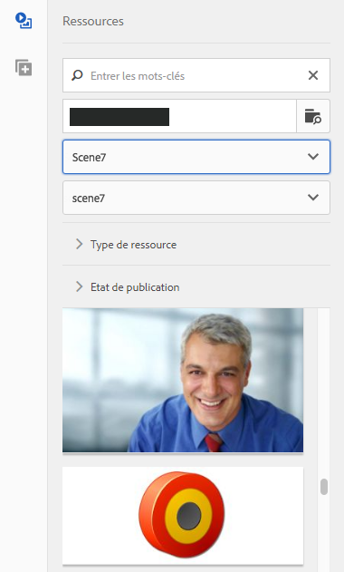

En outre, vous pouvez parcourir les informations de résolution, de taille, de nombre de jours depuis la modification et de nom de fichier en pointant la souris sur un élément du navigateur.

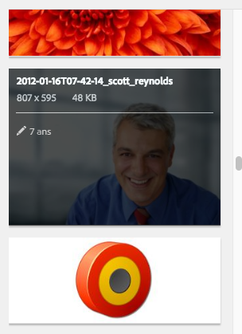

* Pour les ensembles de vidéos adaptables et les modèles, aucune information sur la taille n’est générée pour les miniatures.
* Pour les ensembles de vidéos adaptables, aucune résolution n’est générée pour les miniatures.

### Recherche de ressources Dynamic Media Classic avec l’explorateur de contenu {#searching-for-scene-assets-with-the-content-browser}

La recherche de ressources Dynamic Media Classic est similaire à la recherche de ressources AEM, sauf que lorsque vous effectuez une recherche, une vue distante des ressources s’affiche dans le système Dynamic Media Classic, plutôt que de les importer directement dans AEM.

Vous pouvez utiliser l’interface utilisateur classique ou l’interface utilisateur optimisée pour les écrans tactiles pour visualiser et rechercher des éléments. Selon l’interface, le mode de recherche est légèrement différent.

Lors d’une recherche dans l’une ou l’autre des interfaces, vous pouvez filtrer selon les critères suivants (présentés ici dans l’interface utilisateur optimisée pour les écrans tactiles) :

**[!UICONTROL Entrer des mots-clés]**  : vous pouvez rechercher des ressources par nom. Lors de la recherche par mots-clés, vous saisissez le début du nom du fichier. Par exemple, la saisie du mot « swimming » recherche tous les noms de fichier qui commencent par ces lettres, dans cet ordre. Veillez à appuyer sur Entrée une fois que vous avez tapé le terme pour rechercher la ressource.

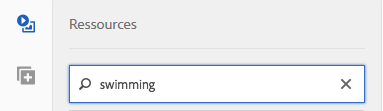

**[!UICONTROL Dossier/chemin]**  : le nom du dossier qui s’affiche dépend de la configuration que vous avez sélectionnée. Vous pouvez descendre jusqu’à des niveaux inférieurs en appuyant sur l’icône de dossier et en sélectionnant un sous-dossier, puis en appuyant sur la coche pour le sélectionner.

Si vous saisissez un mot-clé et sélectionnez un dossier, AEM recherche ce dossier et tous les sous-dossiers. Néanmoins, si vous ne saisissez pas de mots-clés lors de la recherche, la sélection du dossier n’affiche que les éléments de ce dossier et n’inclut pas les sous-dossiers.

Par défaut, AEM recherche le dossier sélectionné et tous les sous-dossiers.

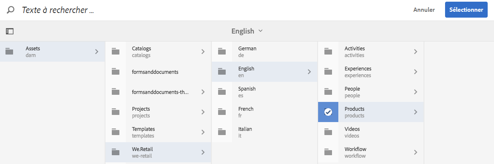

**[!UICONTROL Type de ressource]**  : sélectionnez  **[!UICONTROL Dynamic Media]** Classic pour parcourir le contenu Dynamic Media Classic. Cette option n’est disponible que si Dynamic Media Classic a été configuré.

**[!UICONTROL Configuration]**  : si plusieurs configurations Dynamic Media Classic sont définies dans  [!UICONTROL Cloud Services], vous pouvez les sélectionner ici. De ce fait, le dossier change selon la configuration que vous avez choisie.

**[!UICONTROL Type de ressource]**  : dans le navigateur Dynamic Media Classic, vous pouvez filtrer les résultats de manière à inclure l’un des éléments suivants : images, modèles, vidéos et ensembles de vidéos adaptatifs. Si vous ne sélectionnez aucun type d’élément, AEM recherche par défaut tous les types d’élément.

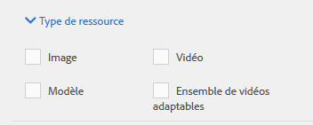

>[!NOTE]
>
>* Dans l’interface utilisateur classique, vous pouvez rechercher des éléments **Flash** et **FXG**. Le filtrage de ces deux éléments n’est actuellement pas pris en charge par l’interface utilisateur optimisée pour les écrans tactiles.
   >
   >
* Lors de la recherche de vidéos, vous recherchez un seul rendu. Les résultats renvoient le rendu d’origine (uniquement &amp;ast;.mp4) et le rendu codé.
>* Lors de la recherche d’une visionneuse de vidéos adaptative, vous recherchez le dossier et tous les sous-dossiers, mais uniquement si vous avez ajouté un mot-clé à la recherche. Si vous n’avez pas ajouté de mot-clé, AEM ne recherche pas les sous-dossiers.

>

**[!UICONTROL État de publication]**  : vous pouvez filtrer les ressources en fonction de l’état de publication :  **** Annulation de la publication ou de la  **[!UICONTROL publication.]** Si vous ne sélectionnez aucun état de  **[!UICONTROL publication]**, AEM recherche par défaut tous les états de publication.

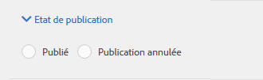
