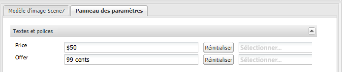

# Ajout de fonctionnalités Dynamic Media Classic à des pages {#adding-scene-features-to-your-page}

[Adobe Dynamic Media Classic](https://experienceleague.adobe.com/docs/dynamic-media-classic/using/home.html?lang=fr) est une solution hébergée visant la gestion, l’amélioration, la publication et la diffusion de contenus multimédias enrichis sur le web, sur les appareils mobiles, par e-mail, sur les appareils connectés à Internet et par impression.

Vous pouvez afficher les ressources d’Experience Manager publiées dans Dynamic Media Classic dans différentes visionneuses :

* Zoom
* Fenêtre déroulante
* Vidéo
* Modèle d’image
* Image

Vous pouvez publier des ressources numériques directement depuis Experience Manager vers Dynamic Media Classic et vous pouvez les publier depuis Dynamic Media Classic vers Experience Manager.

Ce document décrit comment publier des ressources numériques d’Experience Manager vers Dynamic Media Classic et inversement. Les visionneuses sont également décrites en détail. Pour plus d’informations sur la configuration d’Experience Manager pour Dynamic Media Classic, consultez la section [Intégration de Dynamic Media Classic à Experience Manager](/help/sites-administering/scene7.md).

Consultez également la section [Ajout de zones cliquables](image-maps.md).

Pour plus d’informations sur l’utilisation de composants vidéo avec Experience Manager, consultez la section [Vidéo](video.md).

>[!NOTE]
>
>Si les ressources Dynamic Media Classic ne s’affichent pas correctement, assurez-vous que Dynamic Media est [désactivé](config-dynamic.md#disabling-dynamic-media), puis actualisez la page.

## Publication manuelle dans Dynamic Media Classic à partir d’Assets {#manually-publishing-to-scene-from-assets}

Vous pouvez publier des ressources numériques dans Dynamic Media Classic comme suit :

* [Dans l’interface utilisateur classique de la console Ressources](/help/sites-classic-ui-authoring/manage-assets-classic-s7.md#publishing-from-the-assets-console)
* [Dans l’interface utilisateur classique d’une ressource](/help/sites-classic-ui-authoring/manage-assets-classic-s7.md#publishing-from-an-asset)
* [Dans l’interface utilisateur classique en dehors du dossier cible CQ](/help/sites-classic-ui-authoring/manage-assets-classic-s7.md#publishing-assets-from-outside-the-cq-target-folder)

>[!NOTE]
>
>Experience Manager publie sur Dynamic Media Classic de manière asynchrone. Après avoir sélectionné **[!UICONTROL Publier]**, la publication de la ressource sur Dynamic Media Classic prend plusieurs secondes.
>

## Composants Dynamic Media Classic {#scene-components}

Les composants Dynamic Media Classic suivants sont disponibles dans Experience Manager :

* Zoom
* Zoom sur la fenêtre déroulante
* Modèle d’image
* Image
* Vidéo

>[!NOTE]
>
>Ces composants ne sont pas disponibles par défaut et doivent être sélectionnés en mode **[!UICONTROL Conception]** avant leur utilisation.

Une fois qu’ils sont disponibles en mode **[!UICONTROL Conception]**, vous pouvez les ajouter à votre page comme n’importe quel composant Experience Manager. Les ressources qui n’ont pas encore été publiées sur Dynamic Media Classic le seront si elles se trouvent dans un dossier synchronisé, sur une page ou avec une configuration cloud Dynamic Media Classic.

>[!NOTE]
>
>Si vous créez et développez des visionneuses personnalisées et que vous utilisez l’outil de recherche de contenu, vous devez explicitement ajouter le paramètre `allowfullscreen`.

### Notification de fin de prise en charge de la visionneuse Flash {#flash-viewers-end-of-life-notice}

À compter du 31 janvier 2017, Adobe Dynamic Media Classic a officiellement arrêté la prise en charge de la plateforme de la visionneuse Flash.

### Ajout d’un composant Dynamic Media Classic (Scene7) à une page {#adding-a-scene-component-to-a-page}

L’ajout d’un composant Dynamic Media Classic (Scene7) à une page est identique à l’ajout d’un composant sur n’importe quelle page. Les composants Dynamic Media Classic sont décrits en détail dans les sections suivantes.

**Pour ajouter un composant Dynamic Media (Scene7) à une page, procédez comme suit :**

1. Dans Experience Manager, ouvrez la page où vous souhaitez ajouter le composant **[!UICONTROL Dynamic Media Classic (Scene7)]**.

1. Si aucun composant Dynamic Media Classic n’est disponible, sélectionnez le mode **[!UICONTROL Conception]**, sélectionnez un composant avec une bordure bleue, puis sélectionnez l’icône **[!UICONTROL Parent]**, puis l’icône **[!UICONTROL Configuration]**. Dans **[!UICONTROL ParSys (Conception)]**, sélectionnez tous les composants Dynamic Media Classic pour les rendre disponibles, puis sélectionnez **[!UICONTROL OK]**.

   

1. Sélectionnez **[!UICONTROL Modifier]** pour pouvoir revenir en mode **[!UICONTROL Modifier]**.

1. Faites glisser un composant du groupe Dynamic Media Classic dans le sidekick vers la page à l’emplacement souhaité.

1. Sélectionnez l’icône **[!UICONTROL Configuration]** pour ouvrir le composant.

1. Modifiez le composant comme requis et sélectionnez **[!UICONTROL OK]** pour enregistrer les modifications.
1. Faites glisser l’image ou la vidéo du navigateur de contenu vers le composant Dynamic Media Classic que vous avez ajouté à la page.

   >[!NOTE]
   >
   >Dans l’interface utilisateur pour écrans tactiles uniquement, vous devez faire glisser l’image ou la vidéo dans le composant Dynamic Media Classic que vous avez positionné dans la page et l’y déposer. La sélection de la ressource après la sélection et la modification du composant Dynamic Media Classic n’est alors plus prise en charge.

### Ajout d’une expérience de visionnage interactif à un site réactif {#adding-interactive-viewing-experiences-to-a-responsive-website}

Une conception réactive signifie que les ressources s’adaptent selon l’emplacement où elles sont affichées. Avec la conception réactive, les mêmes éléments peuvent être affichés sur plusieurs appareils.

Consultez également la section [Responsive design pour les pages web](/help/sites-developing/responsive.md).

**Pour ajouter une expérience de visionnage interactif à un site réactif, procédez comme suit :**

1. Connectez-vous à Experience Manager et assurez-vous d’avoir configuré les [services cloud Adobe Dynamic Media Classic](/help/sites-administering/scene7.md#configuring-scene-integration) et que les composants Dynamic Media Classic sont disponibles.

   >[!NOTE]
   >
   >Si les composants Dynamic Media Classic ne sont pas disponibles, veillez à [les activer au moyen du mode Conception](/help/sites-authoring/default-components-designmode.md).

1. Dans un site web dont les composants **[!UICONTROL Dynamic Media Classic]** sont activés, faites glisser un composant Dynamic Media Classic **[!UICONTROL Image]** vers la page.
1. Sélectionnez le composant puis l’icône de configuration.
1. Dans l’onglet **[!UICONTROL Paramètres Dynamic Media Classic]**, ajustez les points d’arrêt.

   

1. Confirmez que les visionneuses se redimensionnent de manière réactive et que toutes les interactions sont optimisées pour les ordinateurs de bureau, les tablettes et les appareils mobiles.

### Paramètres communs à tous les composants Dynamic Media Classic {#settings-common-to-all-scene-components}

Bien que les options de configuration varient, les paramètres suivants sont communs à tous les composants [!UICONTROL Dynamic Media Classic] :

* **[!UICONTROL Référence du fichier]** : accédez à un fichier que vous souhaitez référencer. La référence du fichier affiche l’URL de la ressource, et pas nécessairement l’ensemble de l’URL Dynamic Media Classic, avec les commandes et paramètres d’URL. Vous ne pouvez pas ajouter de commandes et de paramètres d’URL Dynamic Media Classic dans ce champ. Au lieu de cela, vous pouvez les ajouter à l’aide de la fonctionnalité correspondante dans le composant.
* **[!UICONTROL Largeur]** - Permet de définir la largeur.
* **[!UICONTROL Hauteur]** - Permet de définir la hauteur.

Vous définissez ces options de configuration en ouvrant (double-clic) un composant Dynamic Media Classic, par exemple, lorsque vous ouvrez un composant **[!UICONTROL Zoom]** :

### Zoom {#zoom}

Le composant Zoom HTML5 affiche une image plus grande lorsque vous appuyez sur le bouton **[!UICONTROL +]**.

L’élément comporte des outils de zoom dans sa partie inférieure. Sélectionnez **[!UICONTROL +]** si vous souhaitez agrandir l’image ; sélectionnez **[!UICONTROL -]** si vous voulez la réduire. Pour rétablir l’image à la taille d’origine dans laquelle elle a été importée, cliquez sur **[!UICONTROL x]** ou sur la flèche de réinitialisation du zoom. Sélectionnez les flèches diagonales pour qu’elle s’affiche en plein écran. Sélectionnez **[!UICONTROL Modifier]** pour pouvoir configurer le composant. Dans ce composant, vous pouvez configurer les [paramètres communs à tous les composants [!UICONTROL Dynamic Media Classic]](#settings-common-to-all-scene-components).

### Fenêtre déroulante {#flyout}

Dans le composant **[!UICONTROL Fenêtre déroulante]** HTML5, l’élément s’affiche sous la forme d’un écran partagé : à gauche se trouve l’élément à la taille spécifiée, à droite la partie sur laquelle le zoom a été effectué. Sélectionnez **[!UICONTROL Modifier]** pour pouvoir configurer le composant. Avec ce composant, vous pouvez configurer les [paramètres communs à tous les composants Dynamic Media Classic](#settings-common-to-all-scene-components).

>[!NOTE]
>
>Si le composant **[!UICONTROL Fenêtre déroulante]** utilise une taille personnalisée, cette taille personnalisée est utilisée et la configuration réactive du composant est désactivée.
>
>Si le composant **[!UICONTROL Fenêtre déroulante]** utilise la taille par défaut, comme définie dans le **[!UICONTROL Mode Conception]**, cette taille est utilisée et le composant s’étire pour s’adapter à la taille de la disposition de la page lorsque la configuration réactive du composant est activée. Il existe des limitations à la configuration réactive du composant. Lorsque vous utilisez le composant **[!UICONTROL Fenêtre déroulante]** avec la configuration réactive, vous ne devez pas l’utiliser avec l’étirement de pleine page. Sinon, la **[!UICONTROL fenêtre déroulante]** peut s’étendre au-delà de la bordure droite de la page.

### Image {#image}

Le composant **[!UICONTROL Image]** Dynamic Media Classic vous permet d’ajouter des fonctionnalités Dynamic Media Classic à vos images, telles que les modificateurs Dynamic Media Classic, les paramètres d’image ou de visionneuse prédéfinis et l’accentuation. Le composant **[!UICONTROL Image]** Dynamic Media Classic est similaire aux autres composants d’image dans Experience Manager avec des fonctionnalités spécifiques à Dynamic Media Classic. Dans cet exemple, le modificateur URL Dynamic Media Classic, `&op_invert=1` est appliqué à l’image.

**[!UICONTROL Titre, Texte secondaire]** : dans l’onglet **[!UICONTROL Avancé]**, ajoutez un titre à l’image et un texte de remplacement destiné aux utilisateurs dont les graphiques sont désactivés.

**[!UICONTROL URL, Ouvrir dans]** : vous pouvez définir une ressource pour ouvrir un lien. Définissez l’**[!UICONTROL URL]**, puis dans le champ **[!UICONTROL Ouvrir dans]**, indiquez si vous souhaitez l’ouvrir dans la même fenêtre ou une nouvelle fenêtre.

**[!UICONTROL Paramètre prédéfini de la visionneuse]** : sélectionnez un paramètre prédéfini de visionneuse existant. Si le paramètre prédéfini de visionneuse que vous recherchez n’est pas visible, vous devez le rendre visible. Consultez la section [Gestion des paramètres prédéfinis de visionneuse](/help/assets/managing-viewer-presets.md). Si vous utilisez un paramètre prédéfini d’image, vous ne pouvez pas sélectionner de paramètre prédéfini de visionneuse, et inversement.

**[!UICONTROL Configuration de Dynamic Media Classic]** : sélectionnez la configuration Dynamic Media Classic que vous souhaitez utiliser pour récupérer les paramètres prédéfinis d’image principaux à partir de SPS.

**[!UICONTROL Paramètre prédéfini d’image]** : sélectionnez un paramètre prédéfini d’image existant. Si le paramètre prédéfini d’image que vous recherchez n’est pas visible, vous devez le rendre visible. Consultez la section [Gestion des paramètres prédéfinis d’image](/help/assets/managing-image-presets.md). Si vous utilisez un paramètre prédéfini d’image, vous ne pouvez pas sélectionner de paramètre prédéfini de visionneuse, et inversement.

**[!UICONTROL Format de sortie]** – Sélectionnez le format de sortie de l’image, par exemple jpeg. Selon le format de sortie que vous sélectionnez, vous pouvez ajouter des options de configuration supplémentaires. Consultez la section [Bonnes pratiques relatives aux paramètres prédéfinis d’image](/help/assets/managing-image-presets.md#image-preset-options).

**[!UICONTROL Accentuation]** - Sélectionnez le mode d’accentuation de l’image. L’accentuation est expliquée en détails dans les rubriques [Bonnes pratiques relatives aux paramètres prédéfinis d’image](/help/assets/managing-image-presets.md#image-preset-options) et [Bonnes pratiques relatives à l’accentuation](/help/assets/assets/sharpening_images.pdf).

**[!UICONTROL Modificateurs d’URL]** : vous pouvez modifier les effets d’image en fournissant des commandes d’image Dynamic Media Classic supplémentaires. Ces commandes sont décrites dans la section [Paramètres prédéfinis d’image](/help/assets/managing-image-presets.md) et le [guide de référence des commandes](https://experienceleague.adobe.com/docs/dynamic-media-developer-resources/image-serving-api/image-serving-api/http-protocol-reference/command-reference/c-command-reference.html?lang=fr).

**[!UICONTROL Points d’arrêt]** : si votre site web est réactif, vous pouvez modifier les points d’arrêt. Les points d’arrêt doivent être séparés par des virgules ( , ).

### Modèle d’image {#image-template}

Les [Modèles d’image Dynamic Media Classic](https://experienceleague.adobe.com/docs/dynamic-media-classic/using/template-basics/quick-start-template-basics.html?lang=fr) sont du contenu Photoshop superposé importé dans Dynamic Media Classic, où le contenu et les propriétés ont été paramétrés pour leur permettre d’être variables. Le composant **[!UICONTROL Modèle d’image]** permet d’importer des images et de modifier le texte dynamiquement dans Experience Manager. En outre, vous pouvez configurer le composant **[!UICONTROL Modèle d’image]** afin d’utiliser des valeurs provenant de ClientContext de sorte que chaque utilisateur voit l’image d’une manière personnalisée.

Sélectionnez **[!UICONTROL Modifier]** si vous souhaitez configurer le composant. Vous pouvez configurer des [paramètres communs à tous les composants Dynamic Media Classic](#settings-common-to-all-scene-components) et d’autres paramètres décrits dans cette section.

**[!UICONTROL Référence du fichier, Largeur, Hauteur]** - Consultez les paramètres communs à tous les composants Dynamic Media Classic en mode Scene7.

>[!NOTE]
>
>Les commandes et paramètres d’URL Dynamic Media Classic ne peuvent pas être ajoutés directement à l’URL de référence du fichier. Ils ne peuvent être définis que dans l’interface utilisateur du composant, dans le panneau **[!UICONTROL Paramètre]**.

**[!UICONTROL Titre, Texte de remplacement]** - Dans l’onglet Modèle d’image de Dynamic Media Classic, ajoutez un titre à l’image et un texte de remplacement destiné aux utilisateurs pour lesquels les graphiques sont désactivés.

**[!UICONTROL URL, Ouvrir dans]** : vous pouvez définir une ressource pour ouvrir un lien. Définissez l’URL, puis dans le champ Ouvrir dans, indiquez si vous souhaitez l’ouvrir dans la même fenêtre ou une nouvelle fenêtre.

**[!UICONTROL Panneau Paramètre]** - Lors de l’importation d’une image, les paramètres sont préremplis avec les informations provenant de l’image. En l’absence de contenu pouvant être modifié dynamiquement, cette fenêtre est vide.

#### Modification dynamique du texte {#changing-text-dynamically}

Pour une modification dynamique du texte, saisissez le nouveau texte dans les champs, puis sélectionnez **[!UICONTROL OK]**. Dans cet exemple, le **[!UICONTROL Prix]** est désormais de 50 $ et l’expédition de 99 cents.

Le texte de l’image change. Vous pouvez réinitialiser le texte à sa valeur d’origine en cliquant sur **[!UICONTROL Réinitialiser]** en regard du champ.

#### Modification du texte afin de refléter une valeur de contexte client {#changing-text-to-reflect-the-value-of-a-client-context-value}

Pour lier un champ à une valeur de contexte client, sélectionnez **[!UICONTROL Sélectionner]** pour ouvrir le menu de contexte client, sélectionnez le contexte client, puis sélectionnez **[!UICONTROL OK]**. Dans cet exemple, le nom change selon la liaison entre le Nom et le nom formaté du profil.

Le texte reflète le nom de l’utilisateur actuellement connecté. Vous pouvez réinitialiser le texte à sa valeur d’origine en cliquant sur **[!UICONTROL Réinitialiser]** en regard du champ.

#### Transformer le modèle d’image Dynamic Media Classic en lien {#making-the-scene-image-template-a-link}

1. Sur la page du composant **[!UICONTROL Modèle d’image]** de Dynamic Media Classic, sélectionnez **[!UICONTROL Modifier]**.
1. Dans le champ **[!UICONTROL URL]**, saisissez l’URL à laquelle l’utilisateur accède lorsqu’il appuie sur l’image. Dans le champ **[!UICONTROL Ouvrir dans]**, choisissez où vous souhaitez que la cible s’ouvre (une nouvelle fenêtre ou la même fenêtre).

   

1. Sélectionnez **[!UICONTROL OK]**.

### Composant vidéo {#video-component}

Le composant **[!UICONTROL Vidéo]** de Dynamic Media Classic (disponible depuis la section Dynamic Media Classic du sidekick) utilise la détection d’appareil et de bande passante pour diffuser la vidéo adéquate à chaque écran. Ce composant est un lecteur vidéo HTML5. Il s’agit d’une visionneuse unique pouvant être utilisée sur plusieurs canaux.

Il peut être utilisé pour des visionneuses de vidéos adaptatives, une vidéo MP4 unique ou une vidéo F4V unique.

Pour plus d’informations sur le fonctionnement des vidéos avec l’intégration de Dynamic Media Classic, regardez [Vidéo](s7-video.md). En outre, consultez la section [Comparaison du composant vidéo Dynamic Media Classic et du composant vidéo de base](s7-video.md).

### Limitations connues du composant vidéo {#known-limitations-for-the-video-component}

La gestion des ressources numériques et la gestion du contenu web d’Adobe indiquent si une vidéo principale est téléchargée. Elles n’affichent pas les éléments proxy suivants :

* Rendus codés Dynamic Media Classic
* Visionneuses de vidéos adaptatives Dynamic Media Classic

Lors de l’utilisation d’une visionneuse de vidéos adaptatives avec le composant vidéo Dynamic Media Classic, vous devez redimensionner le composant pour l’adapter aux dimensions de la vidéo.

## Navigateur de contenu Dynamic Media Classic {#scene-content-browser}

Le navigateur de contenu Dynamic Media Classic vous permet d’afficher le contenu de Dynamic Media Classic directement dans Experience Manager. Pour accéder au navigateur de contenu, dans l’**[!UICONTROL outil de recherche de contenu]**, sélectionnez **[!UICONTROL Dynamic Media Classic]** dans l’interface utilisateur optimisée pour les écrans tactiles, ou l’icône **[!UICONTROL S7]** dans l’interface utilisateur classique. Cette fonctionnalité est identique pour les deux interfaces utilisateur.

Si vous disposez de plusieurs configurations, Experience Manager affiche la [configuration par défaut](/help/sites-administering/scene7.md#configuring-a-default-configuration). Vous pouvez sélectionner différentes configurations directement dans le navigateur de contenu Dynamic Media Classic depuis le menu déroulant.

>[!NOTE]
>
>* Les ressources figurant dans le dossier à la demande n’apparaissent pas dans le navigateur de contenu Dynamic Media Classic.
>* Lorsque l’[aperçu sécurisé est activé](/help/sites-administering/scene7.md#configuring-the-state-published-unpublished-of-assets-pushed-to-scene), les ressources publiées et dépubliées sur Dynamic Media Classic apparaissent dans le navigateur de contenu de Dynamic Media Classic.
>* Si vous ne voyez pas **[!UICONTROL Dynamic Media Classic]** ou l’icône **[!UICONTROL S7]** dans les options du navigateur de contenu, vous devez [configurer Dynamic Media Classic pour qu’il fonctionne avec Experience Manager](/help/sites-administering/scene7.md).
>* Pour la vidéo, le navigateur de contenu Dynamic Media Classic prend en charge les éléments suivants :
>
>   * Les visionneuses de vidéos adaptatives : il s’agit de conteneurs de tous les rendus vidéo requis pour lire la vidéo sans difficultés sur plusieurs écrans.
>   * Vidéo MP4 unique
>   * Vidéo F4V unique

### Parcours du contenu dans l’interface utilisateur optimisée pour les écrans tactiles {#browsing-content-in-the-touch-optimized-ui}

Vous pouvez accéder à l’explorateur de contenu dans l’IU optimisée pour les écrans tactiles ou l’IU classique. Actuellement, l’IU optimisée pour les écrans tactiles présente la limite suivante :

* Les ressources FXG et Flash à partir de Dynamic Media Classic ne sont pas prises en charge.

Recherchez des ressources Dynamic Media Classic en sélectionnant **[!UICONTROL Dynamic Media Classic]** dans le troisième menu déroulant. Dynamic Media Classic n’apparaît pas dans la liste si vous n’avez pas configuré l’intégration de Dynamic Media Classic à Experience Manager.

>[!NOTE]
>
>* Le navigateur de contenu Dynamic Media Classic charge environ 100 éléments et les trie par nom.
>* Si vous disposez d’un serveur d’aperçu sécurisé, le navigateur l’utilise pour effectuer le rendu des miniatures et des éléments.
>

En outre, vous pouvez parcourir les informations de résolution, de taille, de nombre de jours depuis la modification et de nom de fichier en pointant la souris sur un élément du navigateur.

* Pour les visionneuses de vidéos adaptatives et les modèles, aucune information sur la taille n’est générée pour les miniatures.
* Pour les visionneuses de vidéos adaptatives, aucune résolution n’est générée pour les miniatures.

### Recherche de ressources Dynamic Media Classic avec le navigateur de contenu {#searching-for-scene-assets-with-the-content-browser}

La recherche de ressources dans Dynamic Media Classic est similaire à la recherche de ressources dans Experience Manager Assets. Cependant, lorsque vous effectuez une recherche, vous accédez à une vue à distance des ressources dans le système Dynamic Media Classic, sans les importer directement dans Experience Manager.

Vous pouvez utiliser l’interface utilisateur classique ou l’interface utilisateur optimisée pour les écrans tactiles pour afficher et rechercher des ressources. Selon l’interface, la manière dont vous effectuez des recherches diffère légèrement.

Lors d’une recherche dans l’une ou l’autre des interfaces, vous pouvez filtrer selon les critères suivants (présentés ici dans l’interface utilisateur optimisée pour les écrans tactiles) :

**[!UICONTROL Entrez des mots-clés]** - Vous pouvez rechercher des ressources par nom. Lors de la recherche par mots-clés, vous saisissez le début du nom du fichier. Par exemple, la saisie du mot « swimming » recherche tous les noms de fichier qui commencent par ces lettres, dans cet ordre. Veillez à appuyer sur Entrée après avoir tapé le mot-clé de recherche de l’élément.

**[!UICONTROL Dossier/chemin]** - Le nom du dossier qui apparaît est basé sur la configuration que vous avez sélectionnée. Vous pouvez descendre vers des niveaux inférieurs en appuyant sur l’icône du dossier et en sélectionnant un sous-dossier, puis en appuyant sur la coche pour le sélectionner.

Si vous saisissez un mot-clé et sélectionnez un dossier, Experience Manager recherche dans ce dossier et tous les sous-dossiers. Néanmoins, si vous ne saisissez pas de mots-clés lors de la recherche, la sélection du dossier n’affiche que les éléments de ce dossier et n’inclut pas les sous-dossiers.

Par défaut, Experience Manager recherche le dossier sélectionné et tous les sous-dossiers.

**[!UICONTROL Type de ressource]** - Sélectionnez **[!UICONTROL Dynamic Media Classic]** pour parcourir le contenu de Dynamic Media Classic. Cette option n’est disponible que si Dynamic Media Classic a été configuré.

**[!UICONTROL Configuration]** - Si plusieurs configurations de Dynamic Media Classic sont définies dans les [!UICONTROL services cloud], vous pouvez en sélectionner une ici. De ce fait, le dossier change selon la configuration que vous avez choisie.

**[!UICONTROL Type de ressource]** - Dans le navigateur Dynamic Media Classic, vous pouvez filtrer les résultats afin d’inclure les types de ressources suivants : images, modèles, vidéos et visionneuses de vidéos adaptatives. Si vous ne sélectionnez aucun type de ressource, Experience Manager recherche par défaut tous les types de ressources.

>[!NOTE]
>
>* Dans l’interface utilisateur classique, vous pouvez rechercher des éléments **Flash** et **FXG**. Le filtrage de ces types n’est actuellement pas pris en charge par l’interface utilisateur optimisée pour les écrans tactiles.
>
>* Lors de la recherche de vidéos, vous recherchez un seul rendu. Les résultats retournent le rendu d’origine (uniquement en &amp;ast;.mp4) et le rendu codé.
* La recherche d’une visionneuse de vidéos adaptatives s’étend au dossier et à tous les sous-dossiers mais uniquement si vous avez ajouté un mot-clé à la recherche. Si vous n’avez pas ajouté de mot-clé, Experience Manager ne recherche pas les sous-dossiers.
>

**[!UICONTROL Statut de publication]** - Vous pouvez filtrer les ressources selon le statut de publication : **[!UICONTROL Dépublié]** ou **[!UICONTROL Publié]**. Si vous ne sélectionnez aucun **[!UICONTROL statut de publication]**, Experience Manager recherche par défaut tous les statuts de publication.

