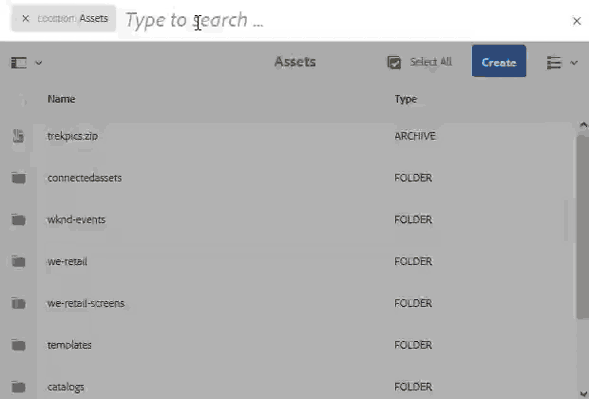

# Rechercher des ressources dans [!DNL Adobe Experience Manager] {#search-assets-in-aem}

[!DNL Adobe Experience Manager Assets] fournit des méthodes robustes de découverte de ressources qui vous aident à atteindre une vitesse de contenu plus élevée. Vos équipes peuvent réduire les délais de mise sur le marché grâce à une expérience de recherche intelligente et transparente, aux fonctionnalités prêtes à l’emploi et aux méthodes personnalisées. La recherche de ressources est essentielle pour l’utilisation d’un système de gestion des ressources numériques, que ce soit pour une utilisation plus poussée par les créatifs, pour une gestion robuste des ressources par les utilisateurs et spécialistes marketing ou pour l’administration par les administrateurs DAM. Les recherches simples, avancées et personnalisées que vous pouvez effectuer via [!DNL Assets] l&#39;interface utilisateur ou d&#39;autres applications et surfaces permettent de résoudre ces problèmes d&#39;utilisation.

[!DNL Experience Manager Assets] prend en charge les cas d’utilisation suivants dont cet article décrit l’utilisation, les concepts, les configurations, les limitations et le dépannage.

| Recherche de ressources | Configuration et administration | Utilisation des résultats de recherche |
|---|---|---|
| [Recherches de base](#searchbasics) | [Index de recherche](#searchindex) | [Tri des résultats](#sort) |
| [Présentation de l’interface utilisateur de recherche](#searchui) | [Recherche visuelle ou par analogie](#configvisualsearch) | [Vérification des propriétés et des métadonnées d’une ressource](#checkinfo) |
| [Suggestions de recherche](#searchsuggestions) | [Métadonnées obligatoires](#mandatorymetadata) | [Téléchargement](#download) |
| [Présentation des résultats de recherche et du comportement](#searchbehavior) | [Modification des facettes de recherche](#searchfacets) | [Mises à jour des métadonnées en masse](#metadataupdates) |
| [Classement et amplification des recherches](#searchrank) | [Extraction de texte](#extracttextupload) | [Collections dynamiques](#collections) |
| [Recherche avancée : filtrage et portée de la recherche](#scope) | [Prédicats personnalisés](#custompredicates) | [Comprendre et résoudre les problèmes liés aux résultats inattendus](#unexpectedresults) |
| [Recherche à partir d’autres solutions et applications](#beyondomnisearch) :<ul><li>[Adobe Asset Link](#aal)</li><li>[Brand Portal](#brandportal)</li><li>[Application de bureau Experience Manager](#desktopapp)</li><li>[Images Adobe Stock](#adobestock)</li><li>[Ressources Dynamic Media](#dynamicmedia)</li></ul> |  |  |
| [Sélecteur de ressources](#assetpicker) |  |  |
| [Limites](#limitations) et [conseils](#tips) |  |  |
| [Exemples illustrés](#samples) |  |  |

Recherchez des ressources à l&#39;aide du champ Omnisearch situé en haut de l&#39;interface Web [!DNL Experience Manager]. Accédez à **[!UICONTROL Ressources]** > **[!UICONTROL Fichiers]** dans [!DNL Experience Manager], cliquez sur  dans la barre supérieure, entrez le mot-clé de recherche, puis sélectionnez `Return`. Vous pouvez également utiliser le raccourci `/` (barre oblique) pour ouvrir le champ Omni-recherche. `Location:Assets` est présélectionné afin de limiter les recherches aux ressources de la gestion des ressources numériques. [!DNL Experience Manager] fournit des suggestions en tant que début en saisissant un mot-clé de recherche.

Utilisez le panneau **[!UICONTROL Filtres]** pour rechercher des ressources, des dossiers, des balises et des métadonnées. Vous pouvez filtrer les résultats de recherche en fonction des différentes options (prédicats), telles que le type et la taille de fichier, la date de dernière modification, l’état de la ressource, les données de renseignement et les licences Adobe Stock. Vous pouvez personnaliser le panneau Filtres et ajouter ou supprimer des prédicats de recherche à l’aide de [facettes de recherche](/help/assets/search-facets.md). Le filtre [!UICONTROL Type de fichier] du panneau [!UICONTROL Filtres] comporte des cases à cocher à états mixtes. Par conséquent, à moins que vous ne sélectionniez tous les prédicats imbriqués (ou formats), les cases à cocher de premier niveau sont partiellement cochées.

[!DNL Experience Manager]La fonctionnalité de recherche prend en charge la recherche de collections et la recherche de ressources dans une collection. Voir [Recherche de collections](/help/assets/manage-collections.md).

## Présentation de l’interface de recherche {#searchui}

Familiarisez-vous avec l’interface de recherche et les actions disponibles.

*Figure : Comprendre l&#39;interface des résultats de  [!DNL Experience Manager Assets] la recherche.*

**A.** Enregistrez la recherche en tant que collection dynamique. **B.** Filtres ou prédicats pour limiter les résultats de la recherche. **C.** Afficher les fichiers, les dossiers ou les deux. **D.** Cliquer sur Filtres pour ouvrir ou fermer le rail de gauche. **E.** L’emplacement de recherche est la gestion des ressources numériques. **Champ F.** Omnisearch avec mot-clé de recherche fourni par l&#39;utilisateur. **G.** Sélectionnez les résultats de recherche chargés. **H.** Nombre de résultats de recherche affichés par rapport au nombre total de résultats de recherche. **I.** Fermer la recherche. **J.** Bascule entre la vue de carte et la vue de liste.

### Facettes de recherche dynamique {#dynamicfacets}

Vous pouvez découvrir plus rapidement les ressources de votre choix à partir de la page des résultats de recherche en utilisant le nombre de résultats de recherche attendus mis à jour dynamiquement dans les facettes de recherche. Le nombre prévu de ressources est mis à jour avant même d’appliquer le filtre de recherche. L’affichage du nombre prévu par rapport au filtre vous aide à parcourir rapidement et efficacement les résultats de la recherche.

*Figure : Affichez le nombre approximatif de fichiers sans filtrer les résultats de la recherche dans les facettes de recherche.*

## Présentation des résultats de recherche et du comportement {#searchbehavior}

### Termes et résultats de recherche de base {#searchbasics}

Vous pouvez exécuter des recherches de mots-clés à partir du champ Omni-recherche. La recherche de mots-clés n’est pas sensible à la casse et est une recherche de texte intégral (dans les champs de métadonnées les plus utilisés). Si plusieurs mots-clés sont utilisés, `AND` est l’opérateur par défaut entre les mots-clés.

Les résultats sont triés par pertinence, en commençant par les correspondances les plus proches. Pour plusieurs mots-clés, les ressources qui contiennent les deux termes dans leurs métadonnées génèrent des résultats plus pertinents. Dans les métadonnées, les mots-clés qui apparaissent sous forme de balises intelligentes sont classés plus haut que les mots-clés qui apparaissent dans d’autres champs de métadonnées. [!DNL Experience Manager] permet de donner plus de poids à un terme de recherche particulier. Il est également possible de [augmenter le classement](#searchrank) de quelques ressources ciblées pour des termes de recherche spécifiques.

Pour rechercher rapidement les ressources appropriées, l’interface riche fournit des mécanismes de filtrage, de tri et de sélection. Vous pouvez filtrer les résultats selon plusieurs critères et afficher le nombre de ressources recherchées pour différents filtres. Vous pouvez également réexécuter la recherche en modifiant la requête dans le champ Omni-recherche. Lorsque vous modifiez les termes ou filtres de recherche, les autres filtres restent appliqués pour préserver le contexte de la recherche.

Lorsque les résultats sont de nombreux actifs, [!DNL Experience Manager] affiche les 100 premiers de la vue de cartes et les 200 premiers de la vue de listes. Au fur et à mesure que les utilisateurs font défiler le contenu, d’autres ressources sont chargées. Il s&#39;agit d&#39;améliorer les performances. Regardez une démonstration vidéo du [nombre de ressources affichées](https://www.youtube.com/watch?v=LcrGPDLDf4o).

Il arrive que des ressources inattendues apparaissent dans les résultats de la recherche. Pour plus d’informations, voir [Résultats inattendus](#troubleshoot-unexpected-search-results-and-issues).

[!DNL Experience Manager] peut effectuer des recherches dans de nombreux formats de fichiers et les filtres de recherche peuvent être personnalisés en fonction des besoins de votre entreprise. Contactez votre administrateur pour connaître les options de recherche disponibles pour votre référentiel DAM et les restrictions de votre compte.

### Résultats avec et sans balises actives améliorées {#withsmarttags}

Par défaut, la recherche [!DNL Experience Manager] combine les termes recherchés avec une clause ET. Par exemple, pensez à rechercher les mots-clés femme en cours d’exécution. Par défaut, seuls les fichiers contenant à la fois des mots-clés féminins et en cours d’exécution dans les métadonnées apparaissent dans les résultats de recherche. Le même comportement est conservé lorsque des caractères spéciaux (points, traits de soulignement ou tirets) sont utilisés avec les mots-clés. Les requêtes de recherche suivantes renvoient les mêmes résultats :

* `woman running`
* `woman.running`
* `woman-running`

Cependant, la requête `woman -running` renvoie des fichiers sans `running` dans leurs métadonnées.
L’utilisation de balises actives ajoute une clause `OR` supplémentaire pour rechercher les termes de recherche comme balises actives appliquées. Une ressource balisée avec `woman` ou `running` à l’aide de balises actives apparaît également dans cette requête de recherche. Les résultats de la recherche sont donc une combinaison de :

* Actifs contenant des mots-clés `woman` et `running` dans les métadonnées (comportement par défaut).

* Actifs balisés avec l’un des mots-clés (comportement des balises actives).

### Suggestions de recherche en cours de frappe {#searchsuggestions}

Lorsque vous début de saisir des mots-clés, [!DNL Experience Manager] suggère les mots-clés ou expressions de recherche possibles. Les suggestions sont basées sur les métadonnées des ressources existantes. [!DNL Experience Manager] indexe tous les champs de métadonnées pour faciliter la recherche. Pour fournir des suggestions de recherche, le système utilise les valeurs des quelques champs de métadonnées suivants. Pour fournir des suggestions de recherche, pensez à renseigner les champs suivants avec les mots-clés appropriés :

* Balises de ressources. (mappage avec `jcr:content/metadata/cq:tags`)
* Titre de la ressource. (mappage avec `jcr:content/metadata/dc:title`)
* Description de la ressource. (mappage avec `jcr:content/metadata/dc:description`)
* Titre dans le référentiel JCR. La valeur peut être mappée au titre de la ressource. (mappage avec `jcr:content/jcr:title`)
* Description dans le référentiel JCR. La valeur peut être mappée à la description de la ressource. (mappage avec `jcr:content/jcr:description`)

Pour recevoir des suggestions pour plusieurs mots-clés de recherche, continuez à taper tous les mots-clés sans sélectionner aucune suggestion pour un seul mot-clé.

*Figure : Tapez plusieurs mots-clés pour les suggestions de vue qui conviennent à tous.*

### Classement et amplification des recherches {#searchrank}

Les résultats de recherche qui correspondent à tous les termes de recherche dans les champs de métadonnées s’affichent en premier, suivis des résultats de recherche correspondant à l’un des termes de recherche des balises dynamiques. Dans l’exemple ci-dessus, l’ordre approximatif de l’affichage des résultats de recherche est le suivant :

1. Correspondances de `woman running` dans les différents champs de métadonnées.
1. Correspondances de `woman running` dans les balises intelligentes.
1. Correspondances de `woman` ou de `running` dans les balises intelligentes.

Vous pouvez améliorer la pertinence des mots-clés pour des ressources données afin d’améliorer les résultats de recherches basées sur ces mots-clés. En d’autres termes, les images pour lesquelles vous faites la promotion de mots-clés spécifiques apparaissent en haut des résultats lorsque vous lancez une recherche basée sur ces mots-clés.

1. Dans l&#39;interface utilisateur [!DNL Assets], ouvrez la page de propriétés de la ressource. Cliquez sur **[!UICONTROL Avancé]** et sur **[!UICONTROL Ajouter]** sous **[!UICONTROL Effacer pour les mots-clés de recherche]**.
1. Dans la zone **[!UICONTROL Rechercher dans la promotion]**, indiquez un mot-clé pour lequel vous souhaitez stimuler la recherche de l’image, puis cliquez sur **[!UICONTROL Ajouter]**. Vous pouvez indiquer plusieurs mots-clés de la même manière.
1. Cliquez sur **[!UICONTROL Enregistrer et fermer]**. La ressource pour laquelle vous avez promu ce mot-clé apparaît en tête des résultats de recherche.

Vous pouvez l’utiliser à votre avantage en améliorant le classement de certaines ressources dans les résultats de recherche du mot-clé ciblé. Voir la vidéo d’exemple ci-dessous. Pour plus d’informations, voir [Recherche dans [!DNL Experience Manager]](https://experienceleague.adobe.com/docs/experience-manager-learn/assets/search-and-discovery/search-boost.html).

>[!VIDEO](https://video.tv.adobe.com/v/16766/?quality=6)

*Vidéo : Découvrez comment les résultats de recherche sont classés et comment le classement peut être influencé.*

## Recherche avancée {#scope}

[!DNL Experience Manager] fournit diverses méthodes, telles que des filtres qui s’appliquent aux ressources recherchées, pour vous aider à localiser plus rapidement les ressources qu’il vous faut. Quelques méthodes fréquemment utilisées sont décrites ci-dessous. Vous trouverez ci-dessous plusieurs [exemples illustrés](#samples).

**Recherche de fichiers ou de dossiers** : dans les résultats de recherche, reportez-vous aux fichiers, aux dossiers ou aux deux. Dans le panneau **[!UICONTROL Filtres]**, vous pouvez sélectionner l’option appropriée. Voir [Interface de recherche](#searchui).

**Recherche de ressources dans un dossier** : vous pouvez limiter la recherche à un dossier spécifique. Dans le panneau **[!UICONTROL Filtres]**, ajoutez le chemin d’un dossier. Vous ne pouvez sélectionner qu’un dossier à la fois.

*Figure : Limitez les résultats de la recherche à un dossier en ajoutant un chemin de dossier dans le panneau Filtres.*

### Rechercher des images similaires {#visualsearch}

Pour rechercher des images visuellement similaires à une image sélectionnée par l’utilisateur, cliquez sur l’option **[!UICONTROL Rechercher des images similaires]** dans le mode Carte d’une image ou dans la barre d’outils. [!DNL Experience Manager] affiche les images balisées intelligentes du référentiel DAM qui sont similaires à une image sélectionnée par l’utilisateur. Voir [Configuration de la recherche par analogie](#configvisualsearch).

*Figure : Recherchez des images similaires à l’aide de l’option de la vue de carte.*

### Images Adobe Stock {#adobestock}

Dans l&#39;interface utilisateur [!DNL Experience Manager], les utilisateurs peuvent rechercher [des ressources Adobe Stock](/help/assets/aem-assets-adobe-stock.md) et activer la licence des ressources requises. Ajoutez `Location: Adobe Stock` dans la barre Omni-recherche. Vous pouvez également utiliser le panneau Filtres pour trouver toutes les ressources qui sont ou non sous licence, ou effectuer des recherches dans une ressource spécifique à l’aide du numéro de fichier Adobe Stock.

### Ressources Dynamic Media {#dmassets}

Vous pouvez filtrer les images Dynamic Media en sélectionnant **[!UICONTROL Dynamic Media]** > **[!UICONTROL Visionneuses]** dans le panneau **[!UICONTROL Filtres]**. Il filtre et affiche des ressources telles que des visionneuses d’images, des carrousels, des visionneuses de supports variés et des visionneuses à 360°.

### Recherche de valeurs spécifiques dans les champs de métadonnées {#gqlsearch}

Vous pouvez rechercher des fichiers en fonction des valeurs exactes de champs de métadonnées spécifiques, tels que le titre, la description et l’auteur. La fonction de recherche en texte intégral GQL récupère uniquement les ressources dont la valeur de métadonnées correspond exactement à votre requête. Les noms des propriétés (auteur, titre, etc.) et les valeurs sont sensibles à la casse.

| Champ de métadonnées | Valeur et utilisation des facettes |
| ----------------------------------------- | --------------------------------------- |
| Titre | `title:John` |
| Créateur | `creator:John` |
| Emplacement | `location:NA` |
| Description | `description:"Sample Image"` |
| Outil créateur | `creatortool:"Adobe Photoshop CC 2020"` |
| Détenteur de copyright | `copyrightowner:"Adobe Systems"` |
| Contributeur | `contributor:John` |
| Conditions d’utilisation | `usageterms:"CopyRights Reserved"` |
| Créé | `created`:AAAA-MM-JJTHH |
| Date d’expiration | `expires`:AAAA-MM-JJTHH |
| Heure d’activation | `ontime`:AAAA-MM-JJTHH |
| Heure de désactivation | `offtime`:AAAA-MM-JJTHH |
| Intervalle de temps (expires dateontime, offtime) | `facet field`: vers le bas..upperbound |
| Chemin | /content/dam/&lt;nom_dossier> |
| Titre du PDF | `pdftitle`:&quot;Document Adobe&quot; |
| Objet | `subject:"Training"` |
| Balises | `tags:"Location And Travel"` |
| Type | `type:"image\png"` |
| Largeur de l’image | `width`:lowerbound..supérieur |
| Hauteur de l’image | `height`:lowerbound..supérieur |
| Personne | `person:John` |

Les propriétés `path`, `limit`, `size` et `orderby` ne peuvent pas être combinées à l&#39;aide de l&#39;opérateur `OR` avec une autre propriété.

Le mot-clé d’une propriété générée par un utilisateur correspond au libellé de son champ dans l’éditeur de propriétés en minuscules et sans espace.

Voici quelques exemples de formats de recherche pour des requêtes complexes :

* Pour afficher toutes les ressources avec plusieurs champs de facettes (par exemple : title=John Doe et creator tool=Adobe Photoshop) :  `title:"John Doe" creatortool:Adobe*`
* Pour afficher toutes les ressources lorsque la valeur de la facette est une expression et non un seul mot (par exemple : le titre est Scott Reynolds) : `title:"Scott Reynolds"`
* Pour afficher les ressources avec plusieurs valeurs d’une seule propriété (le titre est Scott Reynolds ou John Doe, par exemple) : `title:"Scott Reynolds" OR "John Doe"`
* Pour afficher les ressources avec des valeurs de propriété commençant par une chaîne spécifique (par exemple : le titre est Scott Reynolds) : `title:Scott*`
* Pour afficher les ressources avec des valeurs de propriété se terminant par une chaîne spécifique (par exemple : le titre est Scott Reynolds) : `title:*Reynolds`
* Pour afficher les ressources avec une valeur de propriété contenant une chaîne spécifique (par exemple : le titre est Basel Meeting Room) : `title:*Meeting*`
* Pour afficher les ressources qui contiennent une chaîne spécifique et qui possèdent une valeur de propriété en particulier (par exemple : rechercher une chaîne Adobe parmi les ressources dont le titre est John Doe) : `*Adobe* title:"John Doe"`

## Rechercher des ressources provenant d&#39;autres offres ou interfaces [!DNL Experience Manager] {#beyondomnisearch}

[!DNL Adobe Experience Manager] connecte le référentiel DAM à diverses autres  [!DNL Experience Manager] solutions afin de fournir un accès plus rapide aux ressources numériques et de rationaliser les workflows de création. Toute découverte de ressources commence par la navigation ou la recherche. Le comportement de recherche reste largement le même sur les différentes surfaces et solutions. Certaines méthodes de recherche changent à mesure que l&#39;audience des cibles, les cas d&#39;utilisation et l&#39;interface utilisateur varient selon les solutions [!DNL Experience Manager]. Les méthodes spécifiques sont documentées pour les solutions individuelles dans les liens ci-dessous. Les conseils et comportements universellement applicables sont décrits dans cet article.

### Recherche de ressources à partir du panneau Adobe Asset Link {#aal}

Grâce à Adobe Asset Link, les professionnels de la création peuvent désormais accéder au contenu stocké dans [!DNL Experience Manager Assets], sans quitter les applications Adobe Creative Cloud prises en charge. Les créatifs peuvent parcourir, rechercher, extraire et archiver facilement des ressources à l’aide du panneau intégré dans le [!DNL Adobe Creative Cloud apps] : [!DNL Adobe Photoshop], [!DNL Adobe Illustrator] et [!DNL Adobe InDesign]. Asset Link permet également aux utilisateurs de rechercher des résultats visuellement similaires. Les résultats d’affichage de la recherche visuelle sont optimisés par les algorithmes d’apprentissage automatique d’Adobe Sensei et aident les utilisateurs à trouver des images à l’esthétique similaire. Voir [Rechercher et parcourir des ressources](https://helpx.adobe.com/fr/enterprise/using/manage-assets-using-adobe-asset-link.html#UseAdobeAssetLink) à l’aide d’Adobe Asset Link.

### Rechercher des ressources dans l&#39;application de bureau [!DNL Experience Manager] {#desktopapp}

Les professionnels de la création utilisent l&#39;application de bureau pour rendre les [!DNL Experience Manager Assets] facilement consultables et disponibles sur leur bureau local (Windows ou Mac). Les créatifs peuvent facilement révéler les ressources souhaitées dans Mac Finder ou Windows Explorer, ouverts dans les applications de bureau et modifiés localement - les modifications sont enregistrées à [!DNL Experience Manager] avec une nouvelle version créée dans le référentiel. L&#39;application prend en charge les recherches de base en utilisant un ou plusieurs mots-clés, des caractères génériques `*` et `?` et l&#39;opérateur `AND`. Voir [Navigation, recherche et prévisualisation des ressources](https://experienceleague.adobe.com/docs/experience-manager-desktop-app/using/using.html#browse-search-preview-assets) dans l’application de bureau.

### Rechercher des ressources dans [!DNL Brand Portal] {#brandportal}

Les utilisateurs métiers et les spécialistes marketing utilisent Brand Portal pour partager efficacement et en toute sécurité les ressources numériques approuvées avec leurs équipes internes étendues, partenaires et revendeurs. Voir [Recherche de ressources sur Brand Portal](https://experienceleague.adobe.com/docs/experience-manager-brand-portal/using/search-capabilities/brand-portal-searching.html).

### Rechercher [!DNL Adobe Stock] images {#adobestock-1}

Dans l’interface utilisateur [!DNL Experience Manager], les utilisateurs peuvent rechercher des ressources Adobe Stock et activer la licence des ressources requises. Ajoutez `Location: Adobe Stock` dans le champ Omni-recherche. Vous pouvez également utiliser le panneau **[!UICONTROL Filtres]** pour trouver toutes les ressources qui sont ou non sous licence, ou effectuer des recherches dans une ressource spécifique à l’aide du numéro de fichier Adobe Stock. Voir [gestion des images Adobe Stock en Experience Manager](/help/assets/aem-assets-adobe-stock.md#usemanage).

### Recherche de ressources Dynamic Media {#dynamicmedia}

Vous pouvez filtrer les images Dynamic Media en sélectionnant **[!UICONTROL Dynamic Media]** > **[!UICONTROL Visionneuses]** dans le panneau **[!UICONTROL Filtres]**. Il filtre et affiche des ressources telles que des visionneuses d’images, des carrousels, des visionneuses de supports variés et des visionneuses à 360°. Lors de la création de pages web, les auteurs peuvent rechercher des visionneuses dans l’outil de recherche de contenu. Un filtre est disponible pour les visionneuses dans un menu contextuel.

### Recherche de ressources dans l’outil de recherche de contenu lors de la création de pages web {#contentfinder}

Les auteurs peuvent utiliser l’outil de recherche de contenu pour rechercher les ressources appropriées dans le référentiel de gestion des ressources numériques et les utiliser dans les pages web qu’ils créent. Les auteurs peuvent également utiliser la fonctionnalité Ressources connectées pour rechercher des ressources disponibles dans un déploiement distant [!DNL Experience Manager]. Les auteurs peuvent ensuite utiliser ces ressources dans des pages Web lors d’un déploiement local [!DNL Experience Manager]. Voir [utiliser des ressources distantes](/help/assets/use-assets-across-connected-assets-instances.md#use-remote-assets).

### Recherche de collections {#collections}

[!DNL Experience Manager]La fonctionnalité de recherche prend en charge la recherche de collections et la recherche de ressources dans une collection. Voir [Recherche de collections](/help/assets/manage-collections.md).

## Sélecteur de ressources {#assetpicker}

>[!NOTE]
>
>Le sélecteur de ressources a été appelé [sélecteur de ressources](https://helpx.adobe.com/experience-manager/6-2/assets/using/asset-picker.html) dans les versions antérieures de [!DNL Adobe Experience Manager].

Le sélecteur de ressources vous permet de parcourir, de rechercher et de filtrer les ressources DAM d’une manière spéciale. Vous pouvez lancer le sélecteur de ressources dans votre instance [!DNL Experience Manager] à l’aide de `https://[aem-server]:[port]/aem/assetpicker.html`. Cette URL ouvre le sélecteur de ressources en mode de navigation. Utilisez les paramètres de requête pris en charge comme suffixe, tels que `mode` (sélections simples ou multiples) ou `viewmode` avec `assettype` (image, vidéo, texte) et `mimetype`. Ces paramètres définissent le contexte du sélecteur de ressources pour une instance de recherche particulière et restent inchangés tout au long de la sélection. Vous pouvez également récupérer les métadonnées des fichiers que vous sélectionnez à l’aide de cette fonctionnalité.

Le sélecteur de ressources utilise le message HTML5 `Window.postMessage` pour envoyer au destinataire les données correspondant à la ressource sélectionnée. Il fonctionne uniquement en mode Parcourir et uniquement avec la page de résultats d&#39;Omnisearch.

Transférez les paramètres de requête suivants dans une URL pour lancer le sélecteur de ressources dans un contexte particulier :

| Nom | Valeurs | Exemple | Objectif |
|---|---|---|---|
| suffixe de la ressource (B) | Chemin d’accès au dossier indiqué comme suffixe de la ressource dans l’URL :[https://localhost:4502/aem/assetpicker.html/&lt;chemin_dossier>](https://localhost:4502/aem/assetpicker.html) | Pour lancer le sélecteur de ressources avec un dossier particulier sélectionné, par exemple avec le dossier `/content/dam/we-retail/en/activities` sélectionné, l’URL doit se présenter comme suit : [https://localhost:4502/aem/assetpicker.html/content/dam/we-retail/en/activities?assettype=images](https://localhost:4502/aem/assetpicker.html/content/dam/we-retail/en/activities?assettype=images) | Si vous avez besoin de sélectionner un dossier en particulier au démarrage du sélecteur de ressources, vous pouvez l’indiquer comme suffixe de ressource. |
| `mode` | single, multiple | <ul><li>[https://localhost:4502/aem/assetpicker.html?mode=single](https://localhost:4502/aem/assetpicker.html?mode=single)</li><li>[https://localhost:4502/aem/assetpicker.html?mode=multiple](https://localhost:4502/aem/assetpicker.html?mode=multiple)</li></ul> | En mode multiple, vous pouvez sélectionner plusieurs ressources simultanément à l’aide du sélecteur de ressources. |
| `dialog` | true, false | [https://localhost:4502/aem/assetpicker.html?dialog=true](https://localhost:4502/aem/assetpicker.html?dialog=true) | Utilisez ces paramètres pour ouvrir le sélecteur de ressources en tant que boîte de dialogue Granite. Cette option ne peut être appliquée qu’au démarrage du sélecteur de ressources via le champ Chemin de Granite, en la configurant comme URL pickerSrc. |
| `root` | &lt;chemin_dossier> | [https://localhost:4502/aem/assetpicker.html?assettype=images&amp;root=/content/dam/we-retail/en/activities](https://localhost:4502/aem/assetpicker.html?assettype=images&amp;root=/content/dam/we-commerce/fr/activités) | Utilisez cette option pour spécifier le dossier racine du sélecteur de ressources. Ici, le sélecteur de ressources ne vous permet de sélectionner qu’une seule ressource enfant (directe/indirecte) sous le dossier racine. |
| `viewmode` | de recherches |  | Pour lancer le sélecteur de ressources en mode de recherche, avec les paramètres de type et de type de ressource. |
| `assettype` | images, documents, multimedia, archives. | <ul><li>[https://localhost:4502/aem/assetpicker.html?viewmode=search&amp;assettype=images](https://localhost:4502/aem/assetpicker.html?viewmode=search&amp;assettype=images)</li><li>[https://localhost:4502/aem/assetpicker.html?viewmode=search&amp;assettype=documents](https://localhost:4502/aem/assetpicker.html?assettype=documents)</li><li>[https://localhost:4502/aem/assetpicker.html?viewmode=search&amp;assettype=multimedia](https://localhost:4502/aem/assetpicker.html?viewmode=search&amp;assettype=multimedia)</li><li>[https://localhost:4502/aem/assetpicker.html?viewmode=search&amp;assettype=archives](https://localhost:4502/aem/assetpicker.html?viewmode=search&amp;assettype=archives)</li></ul> | Utilisez l’option pour filtrer les types de fichier en fonction de la valeur fournie. |
| `mimetype` | Type MIME (`/jcr:content/metadata/dc:format`) d’une ressource (caractère générique également pris en charge). | <ul><li>[https://localhost:4502/aem/assetpicker.html?viewmode=search&amp;mimetype=image/png](https://localhost:4502/aem/assetpicker.html?viewmode=search&amp;mimetype=image/png)</li><li>[https://localhost:4502/aem/assetpicker.html?viewmode=search&amp;mimetype=*png](https://localhost:4502/aem/assetpicker.html?viewmode=search&amp;mimetype=*png)</li><li>[https://localhost:4502/aem/assetpicker.html?viewmode=search&amp;mimetype=*presentation](https://localhost:4502/aem/assetpicker.html?viewmode=search&amp;mimetype=*presentation)</li><li>[https://localhost:4502/aem/assetpicker.html?viewmode=search&amp;mimetype=*presentation&amp;mimetype=*png](https://localhost:4502/aem/assetpicker.html?viewmode=search&amp;mimetype=*presentation&amp;mimetype=*png)</li></ul> | Utilisez-la pour filtrer les fichiers en fonction du type MIME. |

Pour accéder à l’interface du sélecteur de ressources, accédez à `https://[aem_server]:[port]/aem/assetpicker`. Recherchez le dossier souhaité, puis sélectionnez une ou plusieurs ressources. Vous pouvez également rechercher la ressource souhaitée dans la zone Omni-recherche, appliquer un filtre selon vos besoins, puis la sélectionner.

*Figure : Recherchez et sélectionnez un fichier dans le sélecteur de ressources.*

## Restrictions {#limitations}

La fonctionnalité de recherche de [!DNL Experience Manager Assets] présente les limites suivantes :

* N’entrez pas d’espace de début dans la requête, sinon la recherche ne fonctionne pas.
* [!DNL Experience Manager] peut continuer à afficher le terme de recherche une fois que vous avez sélectionné les propriétés d’une ressource à partir des résultats de recherche, puis annuler la recherche. <!-- (CQ-4273540) -->
* Lors de la recherche de dossiers ou de fichiers et de dossiers, les résultats de recherche ne peuvent être triés selon aucun paramètre.
* Si vous sélectionnez `Return` sans saisir de texte dans la barre Omnisearch, [!DNL Experience Manager] renvoie une liste de fichiers uniquement et non de dossiers. Si vous recherchez spécifiquement des dossiers sans utiliser de mot-clé, [!DNL Experience Manager] ne renvoie aucun résultat.

La recherche visuelle ou par analogie présente les restrictions suivantes :

* La recherche visuelle fonctionne mieux avec un grand référentiel. Bien qu’il n’y ait pas de nombre minimal d’images requis pour obtenir de bons résultats, la qualité des correspondances avec quelques images n’est pas aussi bonne que les correspondances d’un grand référentiel.
* Vous ne pouvez pas modifier le modèle ou le train [!DNL Experience Manager] pour trouver des images similaires. Par exemple, l’ajout ou la suppression de balises intelligentes dans quelques ressources ne modifie pas le modèle. Les ressources sont exclues des résultats de recherche visuellement similaires.

La fonctionnalité de recherche peut présenter des limitations de performances dans les cas suivants :

* La vue de cartes a un temps de chargement plus rapide que la vue de listes pour afficher les résultats de la recherche.

## Conseils de recherche {#tips}

* Si vous surveillez l’état de révision des ressources, utilisez l’option appropriée pour trouver les ressources qui sont approuvées ou en attente d’approbation.
* Utilisez le prédicat Statistiques pour rechercher les ressources prises en charge en fonction de leurs statistiques d’utilisation obtenues auprès de diverses applications Creative. Les données d’utilisation sont regroupées sous Note d’utilisation, Impressions, Clics et Canaux de médias où les ressources apparaissent dans des catégories.
* Cochez la case **[!UICONTROL Sélectionner tout]** pour sélectionner les ressources recherchées. [!DNL Experience Manager] affiche initialement 100 actifs dans la vue de cartes et 200 actifs dans la vue de listes. D’autres ressources sont chargées lorsque vous faites défiler les résultats de la recherche. Vous pouvez sélectionner plus de ressources que les ressources chargées. Le décompte des ressources sélectionnées s’affiche dans le coin supérieur droit de la page des résultats de la recherche. Vous pouvez effectuer des opérations sur la sélection, par exemple télécharger les fichiers sélectionnés, mettre à jour les propriétés de métadonnées en bloc pour les fichiers sélectionnés ou ajouter les fichiers sélectionnés à une collection. Lorsque plus de ressources sont sélectionnées que affichées, une action est appliquée à toutes les ressources sélectionnées ou une boîte de dialogue affiche le nombre de ressources sur lesquelles elle est appliquée. Pour appliquer une action aux ressources qui n’ont pas été chargées, assurez-vous que toutes les ressources sont explicitement sélectionnées.
* Pour rechercher les ressources qui ne contiennent pas les métadonnées obligatoires, voir [Métadonnées obligatoires](#mandatorymetadata).
* La recherche utilise tous les champs de métadonnées. Une recherche générique, telle que la recherche du nombre 12, renvoie généralement de nombreux résultats. Pour de meilleurs résultats, utilisez des guillemets doubles (et non des guillemets simples) ou assurez-vous que le nombre est attaché à un mot sans caractère spécial (par exemple, `shoe12`).
* La recherche en texte intégral prend en charge les opérateurs tels que `-` et `^`. Pour rechercher des informations sous forme de chaînes littérales, indiquez la phrase de recherche entre guillemets. Par exemple, utilisez `"Notebook - Beauty"` au lieu de `Notebook - Beauty`.
* Si les résultats de recherche sont trop nombreux, limitez la [portée de la recherche](#scope) pour trouver les ressources souhaitées. Cela fonctionne mieux lorsque vous avez une idée de la meilleure manière de rechercher les ressources que vous recherchez, par exemple un type de fichier, un emplacement ou des métadonnées spécifiques.

* **Balisage** : Les balises vous aident à classer les fichiers qui peuvent être parcourus et recherchés plus efficacement. Le balisage permet de propager la taxonomie appropriée à d’autres utilisateurs et workflows. [!DNL Experience Manager] propose des méthodes pour baliser automatiquement les ressources à l’aide des services d’intelligence artificielle d’Adobe Sensei, qui améliorent constamment le balisage de vos ressources au fil de l’utilisation et de l’entraînement. Lorsque vous recherchez des ressources, les balises intelligentes sont prises en compte si la fonction est activée sur votre compte. Cela fonctionne avec la fonctionnalité de recherche intégrée. Voir [Comportement de la recherche](#searchbehavior). Pour optimiser l’ordre d’affichage des résultats de recherche, vous pouvez [améliorer le classement](#searchrank) de quelques ressources sélectionnées.

* **Indexation** : seules les métadonnées et les ressources indexées sont renvoyées dans les résultats de recherche. Pour une meilleure couverture et de meilleures performances, veillez à une indexation appropriée et suivez les bonnes pratiques. Voir [Indexation](#searchindex).

* Pour exclure des ressources spécifiques des résultats de la recherche, utilisez la propriété `excludedPath` dans l&#39;index Lucene.

## Quelques exemples illustrant la recherche {#samples}

Utilisez des guillemets doubles autour des mots-clés pour rechercher des ressources contenant exactement l’expression dans l’ordre exact spécifié par l’utilisateur.

*Figure : Comportement de recherche avec et sans guillemets.*

**Recherche avec un caractère générique (astérisque)** : pour élargir la recherche, utilisez un astérisque avant ou après le mot recherché afin de faire correspondre n’importe quel nombre de caractères. Par exemple, la recherche du mot run sans astérisque ne renvoie pas les ressources contenant une variante du mot (y compris dans les métadonnées). L’astérisque remplace n’importe quel nombre de caractères. Par exemple :

* `run` renvoie les ressources contenant exactement le mot-clé « run ».
* `run*` renvoie des ressources avec  `running`,  `run`,  `runaway`, etc.
* `*run` renvoie des ressources avec  `outrun`,  `rerun`, etc.
* `*run*` renvoie toutes les combinaisons possibles.

*Figure : Exemple d’utilisation d’un caractère générique (astérisque) dans la recherche de ressources.*

**Recherche avec un caractère générique (point d’interrogation)** : pour élargir la recherche, utilisez un ou plusieurs caractères « ? » pour correspondre au nombre exact de caractères. Par exemple, dans l’illustration suivante :

* la requête `run???` ne correspond à aucune ressource ;

* la requête `run????` correspond au mot `running` avec quatre caractères après `run` ;

* la requête `??run` correspond au mot `rerun` avec deux caractères avant `run`.

*Figure : Exemple d’utilisation d’un caractère générique (point d’interrogation) dans la recherche de ressources.*

**Exclusion d’un mot-clé** : utilisez le tiret pour rechercher des ressources qui ne contiennent pas de mot-clé. Par exemple, la requête `running -shoe` renvoie les ressources qui contiennent `running`, mais pas `shoe`. De même, la requête `camp -night` renvoie les ressources qui contiennent `camp`, mais pas `night`. La requête `camp-night` renvoie les actifs qui contiennent à la fois `camp` et `night`.

*Figure : Utilisation du tiret pour rechercher des ressources ne contenant pas de mot-clé exclu.*

## Tâches de configuration et d&#39;administration relatives à la fonctionnalité de recherche {#configadmin}

### Configurations d&#39;index de recherche {#searchindex}

La découverte des ressources repose sur l’indexation du contenu de la gestion des actifs numériques, y compris les métadonnées. La découverte plus rapide et précise des ressources repose sur une indexation optimisée et des configurations appropriées. Voir [index de recherche](/help/assets/performance-tuning-guidelines.md#search-indexes), [requêtes de chêne et indexation](/help/sites-deploying/queries-and-indexing.md) et [meilleures pratiques](/help/sites-deploying/best-practices-for-queries-and-indexing.md).

Pour exclure des ressources spécifiques des résultats de la recherche, utilisez la propriété `excludedPath` dans l&#39;index Lucene.

### Recherche visuelle ou de similarité {#configvisualsearch}

La recherche visuelle utilise un balisage intelligent et requiert [!DNL Experience Manager] 6.5.2.0 ou une version ultérieure. Après avoir configuré la fonctionnalité de balisage intelligent, procédez comme suit :

1. Dans [!DNL Experience Manager] CRXDE, dans le noeud `/oak:index/lucene`, ajoutez les propriétés et valeurs suivantes et enregistrez les modifications.

   * `costPerEntry` de type  `Double` avec la valeur  `10`.
   * `costPerExecution` de type  `Double` avec la valeur  `2`.
   * `refresh` de type  `Boolean` avec la valeur  `true`.

   Cette configuration permet d&#39;effectuer des recherches à partir de l&#39;index approprié.

1. Pour créer un index Lucene, dans CRXDE, à `/oak:index/damAssetLucene/indexRules/dam:Asset/properties`, créez un noeud nommé `imageFeatures` de type `nt-unstructured`. Dans le noeud `imageFeatures`,

   * Ajoutez la propriété `name` de type `String` avec la valeur `jcr:content/metadata/imageFeatures/haystack0`.
   * Ajoutez la propriété `nodeScopeIndex` de type `Boolean` avec la valeur `true`.
   * Ajoutez la propriété `propertyIndex` de type `Boolean` avec la valeur `true`.
   * Ajoutez la propriété `useInSimilarity` de type `Boolean` avec la valeur `true`.

   Enregistrez les modifications.

1. Accédez à `/oak:index/damAssetLucene/indexRules/dam:Asset/properties/predictedTags` et ajoutez la propriété `similarityTags` de type `Boolean` avec la valeur `true`.
1. Appliquez des balises actives aux actifs de votre référentiel [!DNL Experience Manager].
1. Dans CRXDE, dans le noeud `/oak-index/damAssetLucene`, définissez la propriété `reindex` sur `true`. Enregistrez les modifications.
1. (Facultatif) Si vous avez personnalisé le formulaire de recherche, copiez le noeud `/libs/settings/dam/search/facets/assets/jcr%3Acontent/items/similaritysearch` dans `/conf/global/settings/dam/search/facets/assets/jcr:content/items`. Enregistrez les modifications.

Pour plus d’informations, voir [comprendre les balises actives en Experience Manager](https://experienceleague.adobe.com/docs/experience-manager-learn/assets/metadata/image-smart-tags.html) et [comment gérer les balises actives](/help/assets/enhanced-smart-tags.md).

>[!CAUTION]
>
>Si l&#39;indexation Lucene est effectuée à partir de [!DNL Adobe Experience Manager], la recherche basée sur les balises actives ne fonctionne pas comme prévu.

### Métadonnées obligatoires {#mandatorymetadata}

Les utilisateurs professionnels, les administrateurs ou les bibliothécaires de gestion des actifs numériques peuvent définir certaines métadonnées comme des métadonnées obligatoires indispensables au fonctionnement des processus d’entreprise. Pour diverses raisons, certaines ressources peuvent ne pas disposer de ces métadonnées, telles que les ressources héritées ou les ressources migrées en bloc. Les ressources contenant des métadonnées manquantes ou non valides sont détectées et rapportées en fonction de la propriété de métadonnées indexées. Pour le configurer, voir [métadonnées obligatoires](/help/assets/metadata-schemas.md#define-mandatory-metadata).

### Modification des facettes de recherche {#searchfacets}

Pour accélérer la découverte, [!DNL Experience Manager Assets] offre les facettes de recherche à l&#39;aide desquelles vous pouvez filtrer les résultats de la recherche. Par défaut, le panneau Filtres comprend quelques facettes standard. Les administrateurs peuvent personnaliser le panneau Filtres pour modifier les facettes par défaut à l’aide des prédicats intégrés. [!DNL Experience Manager] fournit une bonne collection de prédicats intégrés et un éditeur pour personnaliser les facettes. Voir [facettes de recherche](/help/assets/search-facets.md).

### Extraire du texte lors du téléchargement de fichiers {#extracttextupload}

Vous pouvez configurer [!DNL Experience Manager] pour extraire le texte des ressources lorsque les utilisateurs téléchargent des ressources, telles que des fichiers PSD ou PDF. [!DNL Experience Manager] indexe le texte extrait et aide les utilisateurs à rechercher ces ressources en fonction du texte extrait. Voir [télécharger des ressources](/help/assets/manage-assets.md#uploading-assets).

Si l’extraction de texte nécessite trop de ressources pour votre déploiement, envisagez de [désactiver l’extraction de texte](https://helpx.adobe.com/experience-manager/kb/Disable-binary-text-extraction-to-optimize-Lucene-indexing-AEM.html).

### Prédicats personnalisés pour filtrer les résultats de la recherche {#custompredicates}

Les prédicats sont utilisés pour créer des facettes. Les administrateurs peuvent personnaliser les facettes de recherche dans le panneau Filtres à l’aide de prédicats préconfigurés. Ces prédicats peuvent être personnalisés à l’aide d’incrustations. Voir [créer des prédicats personnalisés](/help/assets/searchx.md).

Vous pouvez rechercher des ressources numériques en fonction d’une ou de plusieurs des propriétés suivantes. Les filtres qui s’appliquent à certaines de ces propriétés sont disponibles par défaut et certains autres filtres peuvent être créés sur mesure pour s’appliquer aux autres propriétés.

| Champ de recherche | Valeurs de propriété de recherche |
|-----------------|----------------------------------------------------------------------------------------------------------------------------------------|
| Types MIME  | Images, Documents, Multimédia, Archives ou Autre. |
| Dernière modification | Heure, Jour, Semaine, Mois ou Année. |
| Taille de fichier | Petit, Moyen ou Grand. |
| État de publication | Publiée ou Publication annulée. |
| État d’approbation | Accepté ou Rejeté. |
| Orientation | Horizontal, Vertical ou Carré. |
| Style | Couleur ou Noir et blanc |
| Hauteur de la vidéo | Indiqué sous la forme d’une valeur minimale et d’une valeur maximale. La valeur est stockée uniquement dans les métadonnées des rendus vidéo. |
| Largeur de la vidéo | Indiqué sous la forme d’une valeur minimale et d’une valeur maximale. La valeur est stockée uniquement dans les métadonnées des rendus vidéo. |
| Format vidéo | DVI, Flash, MPEG4, MPEG, OGG Theora, QuickTime, Windows Media. La valeur est stockée dans les métadonnées de la vidéo source et dans les rendus éventuels. |
| Codec vidéo | x264. La valeur est stockée uniquement dans les métadonnées des rendus vidéo. |
| Débit vidéo | Indiqué sous la forme d’une valeur minimale et d’une valeur maximale. La valeur est stockée uniquement dans les métadonnées des rendus vidéo. |
| Codec audio | Libvorbis, Lame MP3, encodage AAC. La valeur est stockée uniquement dans les métadonnées des rendus vidéo. |
| Débit audio  | Indiqué sous la forme d’une valeur minimale et d’une valeur maximale. La valeur est stockée uniquement dans les métadonnées des rendus vidéo. |

## Utilisation des résultats de recherche de ressources {#aftersearch}

Vous pouvez effectuer les opérations suivantes avec les ressources que vous avez recherchées dans [!DNL Experience Manager] :

* Afficher les propriétés de métadonnées et d’autres informations
* Télécharger une ou plusieurs ressources
* Utiliser les actions de bureau pour ouvrir ces ressources dans l’application de bureau
* Créer des collections dynamiques

### Trier les résultats de la recherche {#sort}

Triez les résultats de la recherche pour découvrir plus rapidement les ressources requises. Vous pouvez trier les résultats de la recherche uniquement lorsque vous sélectionnez **[[!UICONTROL Fichiers]](#searchui)** dans le panneau **[!UICONTROL Filtres]**. [!DNL Assets] utilise le tri côté serveur pour trier rapidement toutes les ressources (quel que soit leur nombre) dans un dossier ou les résultats d’une requête. Le tri côté serveur fournit des résultats plus rapides et plus précis que le tri côté client.

Vous pouvez trier les résultats de la recherche tout comme vous pouvez trier les fichiers dans n’importe quel dossier. Le tri fonctionne sur ces colonnes : Nom, Titre, État, Dimensions, Taille, Évaluation, Utilisation, (Date de) création, (Date de) publication, Workflow et Extraits.

Pour connaître les restrictions de la fonctionnalité de tri, voir [Restrictions](#limitations).

### Consultation des informations détaillées d’une ressource {#checkinfo}

Vous pouvez consulter les informations détaillées d’une ressource recherchée à partir de la page des résultats de recherche.

Pour afficher toutes les métadonnées d’une ressource, sélectionnez-la, puis cliquez sur **[!UICONTROL Propriétés]** dans la barre d’outils.

Pour consulter les commentaires sur une ressource ou son historique de versions, cliquez sur la ressource afin d’ouvrir l’aperçu de grande taille. Ouvrez la chronologie dans le rail de gauche et sélectionnez **[!UICONTROL Commentaires]** ou **[!UICONTROL Versions]**. Vous pouvez également trier l’activité de la chronologie comme les commentaires ou les versions dans un ordre chronologique.

*Figure : Tri des entrées de chronologie pour une ressource de recherche.*

### Téléchargement des ressources recherchées {#download}

Vous pouvez télécharger les ressources recherchées et leurs rendus de la même façon que vous téléchargez des ressources ordinaires à partir de dossiers. Sélectionnez une ou plusieurs ressources dans les résultats de recherche, puis cliquez sur **[!UICONTROL Télécharger]** dans la barre d’outils.

### Mise à jour des propriétés de métadonnées en masse {#metadataupdates}

Il est possible d’effectuer des mises à jour en masse des champs de métadonnées courants de plusieurs ressources. Dans les résultats de recherche, sélectionnez une ou plusieurs ressources. Cliquez sur **[!UICONTROL Propriétés]** dans la barre d’outils et mettez à jour les métadonnées selon les besoins. Cliquez sur **[!UICONTROL Enregistrer et fermer]** lorsque vous avez terminé. Les métadonnées figurant précédemment dans les champs mis à jour sont remplacées.

Pour les ressources disponibles dans un seul dossier ou une collection, il est plus facile de [mettre à jour les métadonnées en bloc](/help/assets/metadata.md) sans utiliser la fonctionnalité de recherche. Pour les ressources disponibles dans plusieurs dossiers ou correspondant à un critère commun, il est plus rapide de mettre à jour les métadonnées en masse par l’intermédiaire d’une recherche.

### Collections dynamiques {#smart-collections}

Une collection est un ensemble ordonné de ressources pouvant inclure des ressources provenant de différents emplacements, car les collections ne contiennent que des références à ces ressources. Les collections sont de deux types :

* Une liste de référence statique de ressources, dossiers et autres collections
* Une liste dynamique (collection dynamique) qui peuple la collection de ressources en fonction de critères de recherche

Vous pouvez créer des collections dynamiques en fonction des critères de recherche. Dans le panneau **[!UICONTROL Filtres]**, sélectionnez **[!UICONTROL Fichiers]** et cliquez sur **[!UICONTROL Enregistrer la collection dynamique]**. Voir [Gestion des collections](/help/assets/manage-collections.md).

## Résultats et problèmes de recherche inattendus {#unexpectedresults}

| Erreur, problèmes, symptômes | Raison possible | Correction ou compréhension possible du problème |
|---|---|---|
| Résultats incorrects lors de la recherche de fichiers avec des métadonnées manquantes. | Lors de la recherche de fichiers qui ne comportent pas les métadonnées obligatoires, [!DNL Experience Manager] peut afficher certains fichiers contenant des métadonnées valides. Les résultats sont basés sur la propriété de métadonnées indexées. | Une fois les métadonnées mises à jour, la réindexation est nécessaire pour refléter l’état correct des métadonnées des fichiers. Voir [Métadonnées obligatoires](metadata-schemas.md#define-mandatory-metadata). |
| Trop de résultats de recherche. | Paramètre de recherche étendu. | Envisagez de limiter la portée [de la recherche](#scope). L’utilisation de balises actives peut vous donner plus de résultats de recherche que vous ne le pensiez. Voir [comportement de recherche avec des balises actives](#withsmarttags). |
| Résultats de recherche sans rapport ou partiellement liés. | Le comportement de recherche change avec le balisage intelligent. | Comprenez [comment la recherche change après le balisage intelligent](#withsmarttags). |
| Aucune suggestion de saisie semi-automatique pour les ressources. | Les actifs nouvellement transférés ne sont pas encore indexés. Les métadonnées ne sont pas immédiatement disponibles en tant que suggestions lorsque vous début taper un mot-clé de recherche dans la barre de recherche d&#39;Omniture. | [!DNL Experience Manager] attend jusqu’à l’expiration d’un délai d’attente (par défaut, une heure) avant d’effectuer une tâche en arrière-plan afin d’indexer les métadonnées pour toutes les ressources chargées/mises à jour dernièrement et de les ajouter à la liste de suggestions. |
| Aucun résultat de recherche. | <ul><li>Les ressources correspondant à votre requête n&#39;existent pas. </li><li> Espace blanc ajouté avant la requête de recherche. </li><li> Le champ de métadonnées non pris en charge contient le mot-clé que vous avez recherché.</li><li> Recherche effectuée pendant les heures d’arrêt d’une ressource. </li></ul> | <ul><li>Recherche à l’aide d’un autre mot-clé. Vous pouvez également utiliser le balisage intelligent ou la recherche par analogie pour améliorer les résultats de la recherche. </li><li>[Limite](#limitations) connue.</li><li>Tous les champs de métadonnées ne sont pas pris en compte pour les recherches. Voir [Portée](#scope).</li><li>Effectuez une recherche ultérieurement ou modifiez les ressources à l’heure et les heures d’arrêt pour les ressources requises.</li></ul> |
| Aucun filtre de recherche ou prédicat n&#39;est disponible. | <ul><li>Le filtre de recherche n&#39;est pas configuré.</li><li>Il n&#39;est pas disponible pour votre connexion.</li><li>(Moins probable) Les options de recherche ne sont pas personnalisées sur le déploiement que vous utilisez.</li></ul> | <ul><li>Contactez l’administrateur pour vérifier si les personnalisations de la recherche sont disponibles ou non.</li><li>Contactez l’administrateur pour vérifier si votre compte dispose des privilèges/autorisations nécessaires pour utiliser la personnalisation.</li><li>Contactez l’administrateur et vérifiez les personnalisations disponibles pour le déploiement [!DNL Assets] que vous utilisez.</li></ul> |
| Lors de la recherche d’images visuellement similaires, une image attendue est manquante. | <ul><li>L&#39;image n&#39;est pas disponible dans [!DNL Experience Manager].</li><li>L&#39;image n&#39;est pas indexée. En règle générale, lorsqu’il est récemment téléchargé.</li><li>L’image n’est pas balisée de manière intelligente.</li></ul> | <ul><li>Ajoutez l’image sur [!DNL Assets].</li><li>Contactez votre administrateur pour réindexer le référentiel. Veillez également à utiliser l’index approprié.</li><li>Contactez votre administrateur pour baliser intelligemment les ressources appropriées.</li></ul> |
| Lors de la recherche d’images visuellement similaires, une image non pertinente s’affiche. | Comportement de recherche visuelle. | [!DNL Experience Manager] affiche autant de ressources potentiellement pertinentes que possible. Les images moins pertinentes, le cas échéant, sont ajoutées aux résultats, mais avec un classement inférieur dans les résultats de recherche. La qualité des correspondances et la pertinence des ressources recherchées diminuent à mesure que vous descendez dans les résultats de la recherche. |
| Lors de la sélection et du fonctionnement des résultats de la recherche, tous les fichiers recherchés ne sont pas exploités. | L&#39;option [!UICONTROL Sélectionner tout] ne sélectionne que les 100 premiers résultats de recherche dans la vue de cartes et les 200 premiers résultats de recherche dans la vue de listes. |  |

>[!MORELIKETHIS]
>
>* [[!DNL Experience Manager] guide de mise en oeuvre de la recherche](https://experienceleague.adobe.com/docs/experience-manager-learn/sites/developing/search-tutorial-develop.html)
>* [Configuration avancée pour améliorer les résultats de recherche](https://experienceleague.adobe.com/docs/experience-manager-learn/assets/search-and-discovery/search-boost.html)
>* [Configuration de la recherche de traduction intelligente](https://experienceleague.adobe.com/docs/experience-manager-learn/assets/translation/smart-translation-search-technical-video-setup.html)

