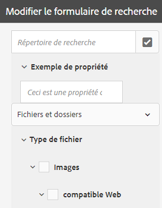

# Facettes de recherche {#search-facets}

Un déploiement à l’échelle de l’entreprise des actifs d’Adobe Experience Manager permet de stocker de nombreux actifs. Parfois, trouver le bon fichier peut être ardu et chronophage si vous utilisez uniquement les fonctionnalités de recherche générique du Experience Manager.

Utilisez les facettes de recherche dans le panneau Filtres pour ajouter plus de granularité à votre expérience de recherche et rendre ainsi la fonctionnalité de recherche plus efficace et souple. Les facettes de recherche ajoutent des dimensions multiples (prédicats) qui permettent d’effectuer des recherches plus complexes. Le panneau Filtres inclut quelques facettes standard. Vous pouvez également ajouter des facettes de recherche personnalisées.

En résumé, les facettes de recherche permettent de rechercher des ressources de plusieurs façons plutôt que selon un seul ordre taxonomique prédéterminé. Vous pouvez facilement descendre dans la hiérarchie jusqu’au niveau de détail souhaité pour effectuer une recherche plus précise.

Par exemple, si vous recherchez une image, vous pouvez indiquer si vous souhaitez une image bitmap ou vectorielle. Vous pouvez réduire davantage le champ de recherche en spécifiant le type MIME de l’image. De la même façon, si vous recherchez des documents, vous pouvez spécifier le format, par exemple PDF ou MS Word.

## Ajout d’un prédicat {#adding-a-predicate}

Les facettes de recherche qui apparaissent dans le panneau Filtres sont définies dans le formulaire de recherche sous-jacent à l’aide de prédicats. Pour afficher d’autres facettes, ajoutez des prédicats au formulaire par défaut ou utilisez un formulaire personnalisé qui comprend les facettes de votre choix.

For full-text searches, add the [!UICONTROL Fulltext] predicate to the form. Utilisez le prédicat Propriété pour rechercher les ressources qui correspondent à une propriété unique que vous spécifiez. Utilisez le prédicat Options pour rechercher les ressources correspondant à une ou plusieurs valeurs pour une propriété spécifique. Ajoutez le prédicat Période pour rechercher les ressources créées au cours d’une période donnée.

1. Click the Experience Manager logo, and then go to **[!UICONTROL Tools]** > **[!UICONTROL General]** > **[!UICONTROL Search Forms]**.
1. From the Search Forms page, select **[!UICONTROL Assets Admin Search Rail]**, then click **Edit** .

   

   Localisez et sélectionnez le rail de recherche d’administrateurs de ressources

   >[!NOTE]
   >
   >Pour utiliser la fonctionnalité de recherche de dossiers du rail **de recherche d’administration des** ressources préconfiguré à partir d’une version antérieure, effectuez les opérations suivantes :
   >
   >1. Accédez à */conf/global/settings/dam/search/facets/assets/jcr:content/items* dans CRXDE.
   >1. Supprimez le noeud de **type** .
   >1. Dans le chemin */libs/settings/dam/search/facets/assets/jcr:content/items*, copiez les nœuds **asset, directory, typeor, excludepaths** et **search type** dans le chemin d’accès mentionné à l’étape 1.
   >1. Enregistrez les modifications.


1. Sur la page Modifier des formulaires de recherche, faites glisser un prédicat de l’onglet **[!UICONTROL Sélectionner le prédicat]** vers le volet principal. Faites glisser, par exemple, **[!UICONTROL Prédicat de la propriété]**.

   

   *Figure : Appuyez et déplacez un prédicat pour personnaliser les filtres de recherche.*

1. Sous l’onglet Paramètres, saisissez un libellé de champ, un texte d’espace réservé et une description pour le prédicat. Indiquez un nom valide pour la propriété de métadonnées que vous souhaitez associer au prédicat.

   Le libellé d’en-tête de l’onglet Paramètres identifie le type de prédicat sélectionné.

   

   Utilisez l’onglet Paramètres pour définir les options requises d’un prédicat

1. Dans le champ **[!UICONTROL Nom de la propriété]**, indiquez un nom valide pour la propriété de métadonnées que vous souhaitez associer au prédicat. Il s’agit du nom sur lequel la recherche se base. Par exemple, saisissez `jcr:content/metadata/dc:description` ou `./jcr:content/metadata/dc:description`.

   Vous pouvez également sélectionner un nœud existant dans la boîte de dialogue de sélection.

   

   Associez une propriété de métadonnées à un prédicat dans le champ Nom de propriété

1. Click the **[!UICONTROL Preview]**  to generate a preview of the Filters panel as it appears after you add the predicate.
1. Examinez la structure du prédicat en mode Aperçu.

   

   Aperçu du formulaire de recherche avant de soumettre les modifications

1. To close the preview, click the **[!UICONTROL Close]**  on the upper-right corner of the preview.
1. Pour enregistrer les paramètres, cliquez sur **[!UICONTROL Terminé]**.
1. Accédez au panneau Rechercher dans l’interface utilisateur d’Assets. Le prédicat Propriété est ajouté au panneau.
1. Dans la zone de texte, saisissez une description de la ressource à rechercher. Saisissez par exemple « Adobe ». Lorsque vous effectuez une recherche, les ressources dont la description correspond à « Adobe » sont répertoriées dans les résultats de la recherche.

## Ajout d’un prédicat Options {#adding-an-options-predicate}

Le prédicat Options permet d’ajouter des options de recherche multiples dans le panneau Filtres. Vous pouvez choisir une ou plusieurs options dans le panneau Filtres pour rechercher des ressources. Par exemple, pour rechercher des actifs en fonction du type de fichier, configurez des options telles que Images, Multimédia, Documents et Archives dans le formulaire de recherche. Une fois ces options configurées, la recherche est effectuée sur les ressources de type GIF, JPEG, PNG, etc. lorsque vous sélectionnez l’option Images dans le panneau Filtres.

Pour mapper les options à la propriété correspondante, créez une structure de nœud pour les options et fournissez le chemin du nœud parent dans la propriété Nom de la propriété du prédicat Options. Le nœud parent doit être du type `sling` : `OrderedFolder`. Les options doivent être du type `nt:unstructured`. Les propriétés `jcr:title` et `value` doivent être configurées pour les nœuds d’option.

La propriété `jcr:title` est un nom convivial de l’option qui apparaît dans le panneau Filtres. Le champ `value` est utilisé dans la demande pour correspondre à la propriété spécifiée.

Lorsque vous sélectionnez une option, la recherche est effectuée en fonction de la propriété `value` du nœud d’option et de ses nœuds enfants, le cas échéant. L’arborescence entière sous le nœud d’option est parcourue et la propriété `value` de chaque nœud enfant est combinée à l’aide d’une opération OU pour former la requête.

Par exemple, si vous sélectionnez Images comme type de fichier, la requête de ressources est créée en combinant la propriété `value` à l’aide d’une opération OU. Par exemple, la requête relative à des images est créée en combinant les résultats correspondants pour *image/jpeg*, *image/gif*, *image/png*, *image/pjpeg* et *image/tiff* pour la propriété `jcr:content/metadata/dc:format` à l’aide d’une opération OU.


La propriété de valeur d’un type de fichier, telle que vue dans CRXDE, est utilisée pour que les requêtes fonctionnent.

Au lieu de créer manuellement une structure de noeud pour les options du référentiel CRXDE, vous pouvez définir les options dans un fichier JSON en spécifiant les paires clé-valeur correspondantes. Spécifiez le chemin du fichier JSON dans le champ **[!UICONTROL Nom de la propriété]**. Par exemple, vous pouvez définir les paires clé-valeur `image/bmp`, `image/gif`, `image/jpeg` et `image/png`, puis spécifier leurs valeurs comme illustré dans l’échantillon de fichier JSON ci-dessous. In the **[!UICONTROL Property Name]** field, you can specify the CRXDE path for this file.

```JSON
{
    "options" :
 [
          {"value" : "image/bmp","text" : "BMP"},
          {"value" : "image/gif","text" : "GIF"},
          {"value" : "image/jpeg","text" : "JPEG"},
          {"value" : "image/png","text" : "PNG"}
 ]
}
```

Si vous souhaitez utiliser un nœud existant, indiquez-le à l’aide de la boîte de dialogue de sélection.

>[!NOTE]
>
>Le prédicat Options est un wrapper personnalisé qui comprend des prédicats de propriété pour démontrer le comportement décrit. Pour l’heure, aucun point de terminaison REST n’est disponible pour la prise en charge native de cette fonctionnalité.

1. Click the Experience Manager logo, and then go to **[!UICONTROL Tools]** > **[!UICONTROL General]** > **[!UICONTROL Search Forms]**.
1. From the **[!UICONTROL Search Forms]** page, select **[!UICONTROL Assets Admin Search Rail]**, then click **[!UICONTROL Edit]**.
1. Sur la page **[!UICONTROL Modifier le formulaire de recherche]**, faites glisser **[!UICONTROL Options du prédicat]** de l’onglet **[!UICONTROL Sélectionner le prédicat]** jusqu’au volet principal.
1. Dans l’onglet **[!UICONTROL Paramètres]**, saisissez un libellé et un nom pour la propriété. Par exemple, pour rechercher des ressources en fonction de leur format, indiquez un nom convivial pour le libellé ; **[!UICONTROL Type de fichier]**, par exemple. Indiquez la propriété sur laquelle sera axée la recherche dans le champ de propriété ; `jcr:content/metadata/dc:format.`, par exemple.
1. Utilisez l’une des méthodes suivantes :

   * Dans le champ **[!UICONTROL Nom de la propriété]**, indiquez le chemin du fichier JSON où sont définis les nœuds des options et spécifiez les paires clé-valeur correspondantes.
   * Click the `+` symbol next to the Options field to specify the display text and value for the options you want to supply in the Filters panel. To add another option, click `+` symbol and repeat the step.

1. Assurez-vous que l’option **[!UICONTROL Sélection simple]** est désactivée pour permettre à l’utilisateur de sélectionner plusieurs options à la fois pour les types de fichiers (Images, Documents, Multimédia et Archives, par exemple). Si vous choisissez **[!UICONTROL Sélection simple]**, l’utilisateur ne peut sélectionner qu’une seule option à la fois pour les types de fichiers.

   

   Champs disponibles dans le prédicat Options

1. Dans le champ **[!UICONTROL Description]**, saisissez une description facultative, puis cliquez sur **[!UICONTROL Terminé]**.
1. Accédez au panneau Rechercher. Le prédicat Options est ajouté au panneau **Rechercher**. Les options proposées pour **[!UICONTROL Type de fichier]** sont présentées sous la forme de cases à cocher.

## Ajouter un prédicat de propriété à plusieurs valeurs {#adding-a-multi-value-property-predicate}

Le prédicat de propriété à plusieurs valeurs vous permet de rechercher plusieurs valeurs dans des ressources. Supposons que vous disposiez des images de plusieurs produits dans  Assets et que les métadonnées de chaque image comprennent un numéro de SKU qui est associé au produit. Vous pouvez utiliser ce prédicat pour rechercher des images de produit sur la base de plusieurs numéros de SKU.

1. Click the Experience Manager logo, and then go to **[!UICONTROL Tools]** > **[!UICONTROL General]** > **[!UICONTROL Search Forms]**.
1. On the Search Forms page, select **[!UICONTROL Assets Admin Search Rail]**, the click **[!UICONTROL Edit]** .
1. Sur la page Modifier le formulaire de recherche, faites glisser **[!UICONTROL Prédicat de propriété à plusieurs valeurs]** de l’onglet **[!UICONTROL Sélectionner le prédicat]** jusqu’au volet principal.
1. Dans l’onglet **[!UICONTROL Paramètres]**, saisissez un libellé et un texte d’espace réservé pour le prédicat. Indiquez le nom de la propriété sur laquelle sera axée la recherche dans le champ de propriété ; `jcr:content/metadata/dc:value`, par exemple. Vous pouvez également utiliser la boîte de dialogue de sélection pour sélectionner un nœud.
1. Assurez-vous que l’option **[!UICONTROL Prise en charge des délimiteurs]** est sélectionnée. Dans le champ **[!UICONTROL Délimiteurs d’entrée]**, spécifiez des délimiteurs pour séparer les valeurs individuelles. Par défaut, la virgule est spécifiée comme séparateur. Vous pouvez spécifier un autre délimiteur.
1. Dans le champ **Description**, saisissez une description facultative, puis cliquez sur **[!UICONTROL Terminé]**.
1. Accédez au panneau Filtres dans l’interface utilisateur d’Assets. Le prédicat **[!UICONTROL Propriété à plusieurs valeurs]** est ajouté au panneau.
1. Indiquez plusieurs valeurs dans le champ Valeur multiple, en les séparant par des délimiteurs, puis effectuez la recherche. Le prédicat récupère une correspondance de texte exacte pour les valeurs que vous avez spécifiées.

## Ajout d’un prédicat de balises {#adding-a-tags-predicate}

Le prédicat Balise vous permet d’effectuer des recherches de ressources basées sur des balises. Par défaut, les ressources recherchent une ou plusieurs balises qui correspondent en fonction des balises que vous spécifiez. En d’autres termes, la requête de recherche effectue une opération OR à l’aide des balises indiquées. Cependant, vous pouvez utiliser l’option de correspondance de toutes les balises pour rechercher les ressources qui contiennent toutes les balises que vous spécifiez.

1. Click the Experience Manager logo, and then go to **[!UICONTROL Tools]** > **[!UICONTROL General]** > **[!UICONTROL Search Forms]**.
1. From the Search Forms page, select **[!UICONTROL Assets Admin Search Rail]** and then click **[!UICONTROL Edit]** .
1. Sur la page Modifier le formulaire de recherche, faites glisser **[!UICONTROL Prédicat de balises]** de l’onglet Sélectionner le prédicat jusqu’au volet principal.
1. Dans l’onglet Paramètres, saisissez un texte d’espace réservé pour le prédicat. Indiquez le nom de la propriété sur laquelle sera axée la recherche dans le champ de propriété ; *jcr:content/metadata/cq:tags*, par exemple. Vous pouvez également sélectionner un nœud dans CRXDE à partir de la boîte de dialogue de sélection.
1. Configurez la propriété Chemin d’accès aux balises racines de ce prédicat pour renseigner les différentes balises dans la liste Balises.
1. Sélectionnez **[!UICONTROL Option d’affichage de correspondance de toutes les balises]** pour rechercher les ressources qui contiennent toutes les balises que vous spécifiez.

   

   Paramètres standard du prédicat de balises

1. Dans le champ **[!UICONTROL Description]**, saisissez une description facultative, puis cliquez sur **[!UICONTROL Terminé]**.
1. Accédez au panneau Rechercher. Le prédicat **[!UICONTROL Balises]** est ajouté au panneau Rechercher.
1. Indiquez les balises sur la base desquelles vous souhaitez rechercher des ressources ou faites votre sélection dans la liste des suggestions.

   

   *Figure : suggestion fournie par le Experience Manager lors de la saisie du nom de la balise.*

1. Sélectionnez **[!UICONTROL Correspondre à tous les critères]** pour rechercher les ressources qui contiennent toutes les balises que vous spécifiez.

## Ajouter d&#39;autres prédicats {#adding-other-predicates}

Tout comme vous ajoutez un prédicat Propriété ou un prédicat Options, vous pouvez ajouter les autres prédicats suivants au panneau Rechercher :

| Nom du prédicat | Description | Propriétés |
|---|---|---|
| [!UICONTROL Texte intégral] | Prédicat de recherche permettant d’effectuer une recherche de texte intégral dans un nœud de ressource entier. Il est mappé à l’opérateur jcr:contains. Vous pouvez indiquer un chemin d’accès relatif si vous souhaitez effectuer une recherche de texte intégral sur une partie spécifique du nœud de ressource. | <ul><li>Libellé</li><li>Espace réservé</li><li>Nom de la propriété</li><li>Description</li></ul> |
| [!UICONTROL Explorateur de chemins d’accès] | Prédicat de recherche pour rechercher des fichiers dans des dossiers et des sous-dossiers à un chemin racine préconfiguré | <ul><li>Espace réservé</li><li>Chemin racine</li><li>Description</li></ul> |
| [!UICONTROL Chemin] | Utilisez-le pour filtrer les résultats selon l’emplacement. Vous pouvez spécifier différents chemins d’accès sous la forme d’options. | <ul><li>Libellé</li><li>Chemin</li><li>Description</li></ul> |
| [!UICONTROL État de publication] | Prédicat de recherche permettant de rechercher des ressources en fonction de leur état de publication. | <ul><li>Libellé</li><li>Nom de la propriété</li><li>Description</li></ul> |
| [!UICONTROL Date relative] | Prédicat de recherche permettant de rechercher des ressources en fonction de leur date de création. Vous pouvez, par exemple, configurer des options telles que « il y a 2 mois », « il y a 3 semaines », etc. | <ul><li>Libellé</li><li>Nom de la propriété</li><li>Date relative</li></ul> |
| [!UICONTROL Étendue] | Prédicat de recherche permettant de rechercher des ressources comprises dans une étendue spécifiée. Dans le panneau Rechercher, vous pouvez spécifier des valeurs maximale et minimale pour l’étendue. | <ul><li>Libellé</li><li>Nom de la propriété</li><li>Description</li></ul> |
| [!UICONTROL Période] | Prédicat de recherche permettant de rechercher des ressources créées pendant une période spécifiée pour une propriété de date. Vous pouvez spécifier des dates de début et de fin dans le panneau Rechercher à l’aide des sélecteurs de date. | <ul><li>Libellé</li><li>Espace réservé</li><li>Nom de la propriété</li><li>Texte de la plage (De)</li><li>Texte de la plage (À)</li><li>Description</li></ul> |
| [!UICONTROL Date] | Prédicat de recherche permettant de rechercher à l’aide d’un curseur des ressources selon une propriété de date. | <ul><li>Libellé</li><li>Nom de la propriété</li><li>Description</li></ul> |
| [!UICONTROL Taille de fichier] | Prédicat de recherche permettant de rechercher des ressources en fonction de leur taille. Il s’agit d’un prédicat basé sur un curseur, dans lequel vous sélectionnez les options de curseur à partir d’un nœud configurable. Les options par défaut sont définies dans /libs/dam/options/prédicates/filesize dans le référentiel CRXDE. La taille du fichier est exprimée en octets. | <ul><li>Libellé</li><li>Nom de la propriété</li><li>Chemin</li><li>Description</li></ul> |
| [!UICONTROL Dernière modification de la ressource] | Prédicat de recherche permettant de rechercher des ressources récemment modifiées. | <ul><li>Nom de la propriété</li><li>Valeur de la propriété</li><li>Description</li></ul> |
| [!UICONTROL État de publication] | Prédicat de recherche permettant de rechercher des ressources en fonction de leur état de publication. | <ul><li>Libellé</li><li>Nom de la propriété</li><li>Description</li></ul> |
| [!UICONTROL Évaluation] | Prédicat de recherche permettant de rechercher des ressources en fonction de leur évaluation moyenne. | <ul><li>Libellé</li><li>Nom de la propriété</li><li>Chemin d’accès aux options</li><li>Description</li></ul> |
| [!UICONTROL État d’expiration] | Prédicat de recherche permettant de rechercher des ressources en fonction de leur état d’expiration. | <ul><li>Libellé</li><li>Nom de la propriété</li><li>Description</li></ul> |
| [!UICONTROL Masqué] | Prédicat de recherche permettant de définir une propriété de champ masqué pour rechercher des ressources. | <ul><li>Nom de la propriété</li><li>Valeur de la propriété</li><li>Description</li></ul> |

## Restaurer les facettes de recherche par défaut {#restoring-default-search-facets}

By default, a lock icon  appears before **[!UICONTROL Assets Admin Search Rail]** in the **[!UICONTROL Search Forms]** page. L’icône de cadenas en regard d’une option de la page Formulaires de recherche indique que les paramètres par défaut sont intacts et non personnalisés. The icon  disappears if you add search facets to the form indicating that the default form has been modified.


Pour restaurer la facette de recherche par défaut, procédez comme suit :

1. Sélectionnez **[!UICONTROL Rail de recherche d’administrateurs de ressources]** sur la page **[!UICONTROL Formulaires de recherche]**.
1. Cliquez sur **[!UICONTROL Supprimer]**  de la barre d&#39;outils.
1. In the confirmation dialog, click **[!UICONTROL Delete]** to remove the custom changes.

   After you delete the custom changes to search facets, the lock icon  reappears before **[!UICONTROL Assets Admin Search Rail]** in the **[!UICONTROL Search Forms]** page.

## Autorisations d’utilisateur {#user-permissions}

Si le rôle d’administrateur ne vous a pas été attribué, voici la liste des autorisations dont vous avez besoin pour réaliser des actions de modification, de suppression et d’affichage d’aperçu impliquant des facettes de recherche.

| Action | Autorisations |
| ------------------- | ---------------------------------------------------------------- |
| [!UICONTROL Modifier] | Read and Write permissions on the `/apps` node in CRXDE |
| [!UICONTROL Supprimer] | Read, Write, and Delete permissions on the `/apps` node in CRXDE |
| [!UICONTROL Aperçu] | Read, Write, and Delete permissions on the `/var/dam/content` node in CRXDE. De même que les autorisations de lecture et d’écriture sur le nœud `/apps` |

>[!MORELIKETHIS]
>
>* [Extension de la fonctionnalité de recherche de ressources](searchx.md)
>* [Recherche de ressources](search-assets.md)

