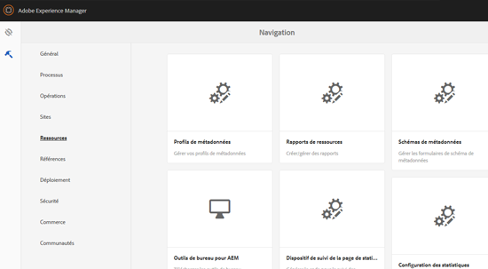
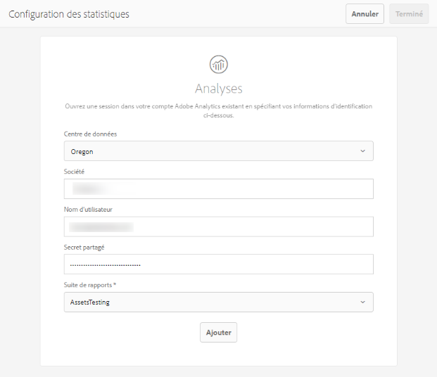

# Configuration des statistiques sur les ressources {#configure-asset-insights}

[!DNL Adobe Experience Manager Assets] Récupère les données d’utilisation des ressources numériques utilisées par des sites Web tiers à partir de [!DNL Adobe Analytics]. Pour permettre à la fonction Statistiques sur les ressources de récupérer ces données et de générer des informations, commencez par la configurer afin qu’elle s’intègre à Adobe Analytics.

>[!NOTE]
>
>Les statistiques sont uniquement prises en charge et fournies pour les images.

1. In [!DNL Experience Manager], click **[!UICONTROL Tools]** > **[!UICONTROL Assets]**.

   

1. Cliquez sur la carte **[!UICONTROL Configuration des statistiques]**.
1. Dans l’assistant, sélectionnez un centre de données et fournissez vos informations d’identification, notamment le nom de votre société, votre nom d’utilisateur et votre secret partagé.

   

   *Figure : Configuration[!DNL Adobe Analytics]pour Assets Insights dans[!DNL Experience Manager].*

1. Cliquez sur **[!UICONTROL Authentifier]**.
1. After [!DNL Experience Manager] authenticates your credentials, from the **[!UICONTROL Report Suite]** list, choose an [!DNL Adobe Analytics] report suite from where you want Asset Insights to fetch data. Cliquez sur **[!UICONTROL Ajouter]**.
1. After [!DNL Experience Manager] sets up your report suite, click **[!UICONTROL Done]**.

## Page tracker {#page-tracker}

After you configure your [!DNL Adobe Analytics] account, the Page Tracker code is generated for you. To enable Assets Insights to track [!DNL Experience Manager] assets used in third-party websites, include the page tracker code in the website code. Use the [!UICONTROL Page Tracker] utility in [!DNL Experience Manager Assets] to generate the page tracker code. For more information on how to include your Page Tracker code in third-party web pages, see [Use page tracker and embed code in web pages](/help/assets/touch-ui-using-page-tracker.md).

1. In [!DNL Experience Manager], click **[!UICONTROL Tools]** > **[!UICONTROL Assets]**.

   

1. Sur la page **[!UICONTROL Navigation]**, cliquez sur la carte **[!UICONTROL Dispositif de suivi de la page de statistiques]**.
1. Cliquez sur **[!UICONTROL Télécharger]** pour télécharger le code de suivi de page.
