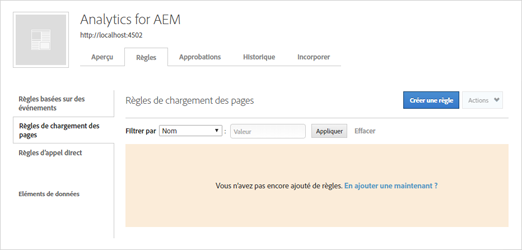
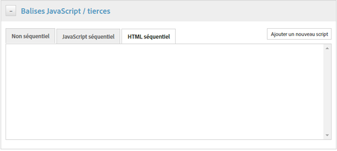
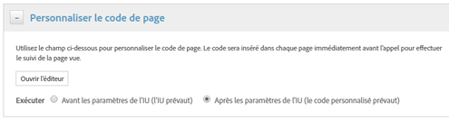

# Activation des statistiques sur les ressources via DTM   {#enable-asset-insights-through-dtm}

La gestion dynamique des balises Adobe est un outil permettant d’activer vos outils de marketing numérique. Il est fourni gratuitement aux clients d’Adobe Analytics.

Bien que vous puissiez personnaliser votre code de suivi pour permettre aux solutions CMS tierces d’utiliser les statistiques sur les ressources, Adobe vous recommande d’utiliser la gestion dynamique des balises pour insérer des balises de statistiques sur les ressources.

>[!NOTE]
>
>Les statistiques sont uniquement prises en charge et fournies pour les images.

Effectuez les étapes ci-dessous pour activer les Statistiques sur les ressources grâce à DTM.

1. Click the Experience Manager logo, and go to **[!UICONTROL Tools]** > **[!UICONTROL Assets]** > **[!UICONTROL Insights Configuration]**.
1. [Configuration de l’instance Experience Manager avec DTM Cloud Service](/help/sites-administering/dtm.md)

   The API token should be available once you log on to [https://dtm.adobe.com](https://dtm.adobe.com/) and visit **[!UICONTROL Account Settings]** from the Profile icon. Cette étape n’est pas requise du point de vue des statistiques sur les ressources, car l’intégration des sites Experience Manager avec les statistiques sur les ressources est toujours en cours d’élaboration.

1. Connectez-vous à [https://dtm.adobe.com](https://dtm.adobe.com/) et sélectionnez une entreprise, comme approprié.
1. Création/ouverture d’une propriété web existante

   * Select the **[!UICONTROL Web Properties]** tab, and then click **[!UICONTROL Add Property]**.

   * Update the fields as appropriate, and click **[!UICONTROL Create Property]**. See [documentation](https://helpx.adobe.com/fr/experience-manager/using/dtm.html).
   

1. In the **[!UICONTROL Rules]** tab, select **[!UICONTROL Page Load Rules]** from the navigation pane and click **[!UICONTROL Create New Rule]**.

   

1. Expand **[!UICONTROL Javascript /Third Party Tags]**. Then click **[!UICONTROL Add New Script]** in the **[!UICONTROL Sequential HTML]** tab to open the Script dialog.

   

1. Cliquez sur le logo d’Experience Manager et accédez à **[!UICONTROL Outils > Ressources]**.
1. Click **[!UICONTROL Insights Page Tracker]**, copy the tracker code, and then paste it in the Script dialog you opened in step 6. Enregistrez les modifications.

   >[!NOTE]
   >
   > * `AppMeasurement.js` est supprimée. Il devrait être disponible via l’outil de gestion dynamique des balises Adobe Analytics.
   > * The call to `assetAnalytics.dispatcher.init`() is removed. Le système s’attend à ce que la fonction soit appelée une fois le chargement de l’outil de gestion dynamique des balises Adobe Analytics terminé.
   > * Selon l’emplacement d’hébergement du suivi de page des statistiques sur les ressources (par exemple Experience Manager, CDN, etc.), l’origine de la source du script peut nécessiter des modifications.
   > * Pour le suivi des pages hébergé par Experience Manager, la source doit pointer vers une instance de publication à l’aide du nom d’hôte de l’instance de répartiteur.


1. Accédez à l’adresse `https://dtm.adobe.com`. Cliquez sur **[!UICONTROL Aperçu]** dans la propriété web et cliquez sur **[!UICONTROL Ajouter un outil]** ou ouvrez un outil Adobe Analytics existant. While creating the tool, you can set **[!UICONTROL Configuration Method]** to **[!UICONTROL Automatic]**.

   

   Sélectionnez des suites de rapports de production/intermédiaires, selon les besoins.

1. Expand **[!UICONTROL Library Management]**, and ensure that **[!UICONTROL Load Library at]** is set to **[!UICONTROL Page Top]**.

   

1. Expand **[!UICONTROL Customize Page Code]**, and click **[!UICONTROL Open Editor]**.

   

1. Collez le code suivant dans la fenêtre :

   ```Java
   var sObj;
   
   if (arguments.length > 0) {
     sObj = arguments[0];
   } else {
     sObj = _satellite.getToolsByType('sc')[0].getS();
   }
   _satellite.notify('in assetAnalytics customInit');
   (function initializeAssetAnalytics() {
     if ((!!window.assetAnalytics) && (!!assetAnalytics.dispatcher)) {
       _satellite.notify('assetAnalytics ready');
       /** NOTE:
           Copy over the call to 'assetAnalytics.dispatcher.init()' from Assets Pagetracker
           Be mindful about changing the AppMeasurement object as retrieved above.
       */
       assetAnalytics.dispatcher.init(
             "",  /** RSID to send tracking-call to */
             "",  /** Tracking Server to send tracking-call to */
             "",  /** Visitor Namespace to send tracking-call to */
             "",  /** listVar to put comma-separated-list of Asset IDs for Asset Impression Events in tracking-call, e.g. 'listVar1' */
             "",  /** eVar to put Asset ID for Asset Click Events in, e.g. 'eVar3' */
             "",  /** event to include in tracking-calls for Asset Impression Events, e.g. 'event8' */
             "",  /** event to include in tracking-calls for Asset Click Events, e.g. 'event7' */
             sObj  /** [OPTIONAL] if the webpage already has an AppMeasurement object, please include the object here. If unspecified, Pagetracker Core shall create its own AppMeasurement object */
             );
       sObj.usePlugins = true;
       sObj.doPlugins = assetAnalytics.core.updateContextData;
       assetAnalytics.core.optimizedAssetInsights();
     }
     else {
       _satellite.notify('assetAnalytics not available. Consider updating the Custom Page Code', 4);
     }
   })();
   ```

   * The page load rule in DTM only includes the `pagetracker.js` code. Tous les champs `assetAnalytics` sont considérés comme des remplacements des valeurs par défaut. Ils ne sont pas requis par défaut.
   * The code calls `assetAnalytics.dispatcher.init()` after making sure that `_satellite.getToolsByType('sc')[0].getS()` is initialized and `assetAnalytics,dispatcher.init` is available. Par conséquent, vous pouvez ignorer son ajout à l’étape 11.
   * As indicated in comments within the Insights Page Tracker code (**[!UICONTROL Tools > Assets > Insights Page Tracker]**), when Page Tracker does not create an `AppMeasurement` object, the first three arguments (RSID, Tracking Server, and Visitor Namespace) are irrelevant. Des chaînes vides sont transmises à la place pour mettre ceci en évidence.\
      Les arguments restants correspondent à ce qui est configuré sur la page Configuration des statistiques (**[!UICONTROL Outils > Ressources > Configuration des statistiques]**).
   * L’objet AppMeasurement est récupéré en interrogeant `satelliteLib` pour tous les moteurs SiteCatalyst disponibles. Si plusieurs balises sont configurées, modifiez l’index du sélecteur de tableau de manière appropriée. Les entrées du tableau sont triées en fonction des outils SiteCatalyst disponibles dans l’interface de gestion dynamique des balises.

1. Enregistrez et fermez la fenêtre Editeur de code, puis enregistrez les modifications dans la configuration de l’outil.
1. In the **[!UICONTROL Approvals]** tab, approve both the pending approvals. La balise DTM est prête à être insérée sur votre page web. For details on how to insert DTM tags in web pages, see [Integrate DTM in custom page templates](https://blogs.adobe.com/experiencedelivers/experience-management/integrating-dtm-custom-aem6-page-template/).
