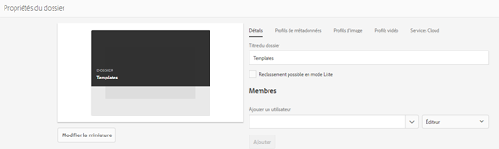
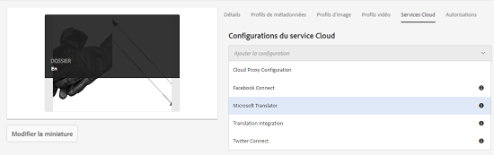
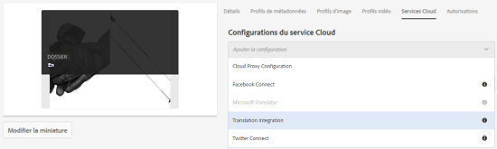
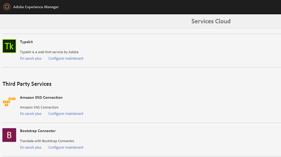
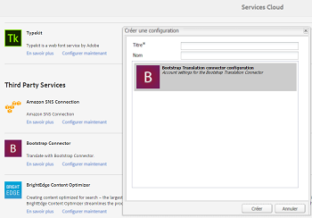
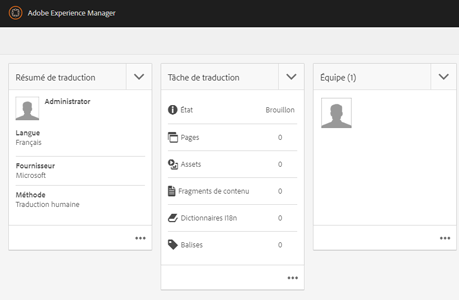

# Application de services cloud de traduction à des dossiers {#applying-translation-cloud-services-to-folders}

[!DNL Adobe Experience Manager] vous offre des services de traduction basés sur le cloud du fournisseur de traduction de votre choix afin de vous assurer que vos ressources sont traduites en fonction de vos besoins.

Vous pouvez appliquer le service cloud de traduction directement à votre dossier de ressources afin qu’elles puissent être utilisées au cours des workflows de traduction.

## Application de services de traduction {#applying-the-translation-services}

L’application de services cloud directement à votre dossier de ressources élimine le besoin de configurer des services de traduction lorsque vous créez ou mettez à jour les workflows de traduction.

1. Dans l&#39;interface utilisateur [!DNL Assets], sélectionnez le dossier auquel vous souhaitez appliquer les services de traduction.
1. Dans la barre d’outils, cliquez sur **[!UICONTROL Propriétés]** pour afficher la page **[!UICONTROL Propriétés du dossier]**.

   

1. Accédez à l’onglet **[!UICONTROL Services Cloud]**.
1. Depuis la liste Configurations du service Cloud, sélectionnez le fournisseur de services de traduction de votre choix. Par exemple, si vous souhaitez utiliser les services de traduction de Microsoft, choisissez **[!UICONTROL Microsoft Translator]**.

   

1. Sélectionnez le connecteur pour le fournisseur de traduction.

   

1. Dans la barre d&#39;outils, cliquez sur **[!UICONTROL Enregistrer]**, puis sur **[!UICONTROL OK]** pour fermer la boîte de dialogue. Le service de traduction est appliqué au dossier.

## Application d’un connecteur de traduction personnalisé  {#applying-custom-translation-connector}

Si vous souhaitez appliquer un connecteur personnalisé pour les services de traduction que vous souhaitez utiliser dans les workflows. Pour appliquer un connecteur personnalisé, installez d’abord le connecteur à partir de Package Manager. Configurez ensuite le connecteur depuis la console Cloud Services. Une fois le connecteur configuré, il est disponible dans la liste des connecteurs de l’onglet Cloud Services décrits dans la section [Application des services de traduction](transition-cloud-services.md#applying-the-translation-services). Une fois que vous avez appliqué le connecteur personnalisé et exécuté des workflows de traduction, la mosaïque **[!UICONTROL Résumé de traduction]** du projet de traduction affiche les détails du connecteur dans les sections **[!UICONTROL Fournisseur]** et **[!UICONTROL Méthode]**.

1. Installez le connecteur depuis le gestionnaire de modules.
1. Cliquez sur le logo [!DNL Experience Manager] et accédez à **[!UICONTROL Outils]** > **[!UICONTROL Déploiement]** > **[!UICONTROL Cloud Services]**.
1. Localisez le connecteur que vous avez installé sous **[!UICONTROL Services tiers]** sur la page **[!UICONTROL Services Cloud]**.

   

1. Cliquez sur le lien **[!UICONTROL Configurer maintenant]** pour ouvrir la boîte de dialogue **[!UICONTROL Créer une configuration]**.

   

1. Indiquez un titre et un nom pour le connecteur, puis cliquez sur **[!UICONTROL Créer]**. Le connecteur personnalisé est alors disponible dans la liste des connecteurs de l’onglet **[!UICONTROL Services Cloud]** décrit à l’étape 5 de la section [Application des services de traduction](#applying-the-translation-services).
1. Exécutez tout processus de traduction décrit dans [Création de projets](translation-projects.md) de traduction après avoir appliqué le connecteur personnalisé. Vérifiez les informations détaillées du connecteur dans la mosaïque **[!UICONTROL Résumé de traduction]** du projet de traduction dans la console **[!UICONTROL Projets]**.

   
