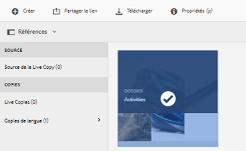
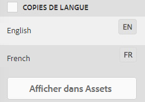
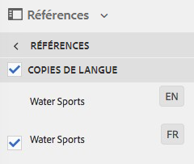

# Création de projets de traduction {#creating-translation-projects}

Pour créer une copie de langue, déclenchez l’un des workflows de copie de langue disponibles sous le rail Références dans l’interface utilisateur d’[!DNL Experience Manager]. 

* **Créer et traduire** : dans ce workflow, les ressources à traduire sont copiées dans la racine de la langue vers laquelle vous souhaitez effectuer la traduction. En outre, en fonction des options que vous choisissez, un projet de traduction est créé pour les ressources dans la console Projets. Selon les paramètres, le projet de traduction peut être démarré manuellement ou exécuté automatiquement dès sa création.

* **Mettre à jour les copies de langue** : vous exécutez ce workflow afin de traduire un groupe de ressources supplémentaire et de l’intégrer à une copie de langue pour des paramètres régionaux spécifiques. Dans ce cas, les ressources traduites sont ajoutées au dossier cible qui contient des ressources précédemment traduites.

>[!PREREQUISITES]
>
>* Les utilisateurs qui créent des projets de traduction sont membres du groupe `projects-administrators`.
>* Le fournisseur de services de traduction prend en charge la traduction de fichiers binaires.

## Workflow Créer et traduire {#create-and-translate-workflow}

Vous utilisez le workflow Créer et traduire afin de générer des copies de langue dans une langue spécifique pour la première fois. Le workflow offre les options suivantes :

* Créer uniquement la structure 
* Créer un projet de traduction
* Ajouter à un projet de traduction existant

### Création de la structure uniquement {#create-structure-only}

Utilisez l’option **[!UICONTROL Créer uniquement la structure]** pour créer une hiérarchie de dossiers cible au niveau de la racine de la langue cible semblable à celle du dossier source au sein de la racine de la langue source. Dans ce cas, les fichiers source sont copiés dans le dossier de destination. Cependant, aucun projet de traduction n’est généré.

1. Dans l’interface utilisateur d’[!DNL Assets], sélectionnez le dossier source pour lequel vous souhaitez créer une structure au niveau de la racine de la langue cible.

1. Ouvrez le volet **[!UICONTROL Références]** et cliquez sur **[!UICONTROL Copies de langue]** sous **[!UICONTROL Copies]**.

   

1. Cliquez sur **[!UICONTROL Créer et traduire]**. Dans la liste **[!UICONTROL Langues cibles]**, choisissez la langue pour laquelle vous souhaitez créer une structure de dossiers.

1. Dans la liste **[!UICONTROL Projet]**, sélectionnez **[!UICONTROL Créer uniquement la structure]**.

1. Cliquez sur **[!UICONTROL Créer]**. La nouvelle structure de la langue cible est répertoriée sous **[!UICONTROL Copies de langue]**.

   

1. Cliquez sur la structure dans la liste, puis cliquez sur **[!UICONTROL Afficher dans Assets]** pour accéder à la structure de dossiers au niveau de la langue cible.

   

### Créer un projet de traduction {#create-a-new-translation-project}

Si vous utilisez cette option, les ressources à traduire sont copiées dans la racine de la langue vers laquelle vous souhaitez effectuer la traduction. Selon les options que vous choisissez, un projet de traduction est créé pour les ressources dans la console Projets. Selon les paramètres, le projet de traduction peut être démarré manuellement ou s’exécuter automatiquement dès sa création.

1. Dans l’interface utilisateur d’[!DNL Assets], sélectionnez le dossier source pour lequel vous souhaitez créer une copie de langue.
1. Ouvrez le volet **[!UICONTROL Références]** et cliquez sur **[!UICONTROL Copies de langue]** sous **[!UICONTROL Copies]**.

   

1. Cliquez sur **[!UICONTROL Créer et traduire]** dans la partie inférieure.

1. Dans la **[!UICONTROL Langues cibles]** sélectionnez les langues pour lesquelles vous souhaitez créer une structure de dossiers.

1. Dans la liste **[!UICONTROL Projet]**, choisissez **[!UICONTROL Créer un projet de traduction]**.

1. Dans le champ **[!UICONTROL Titre du projet]**, saisissez un titre pour le projet.

1. Cliquez sur **[!UICONTROL Créer]**. Les [!DNL Assets] du dossier source sont copiées vers les dossiers cibles pour les paramètres régionaux que vous avez sélectionnés à l’étape 4.

   

1. Pour accéder au dossier, sélectionnez la copie de langue, puis cliquez sur **[!UICONTROL Afficher dans Assets]**.

   

1. Accédez à la console Projets. Le dossier de traduction est copié dans la console Projets.

   

1. Ouvrez le dossier pour afficher le projet de traduction.

   

1. Cliquez sur le projet pour ouvrir la page de détails.

   

1. Pour afficher le statut de la tâche de traduction, cliquez sur les points de suspension en bas de la mosaïque **[!UICONTROL Tâche de traduction]**.

   

   Pour plus d’informations sur les statuts des tâches, consultez la section [Surveillance du statut d’une tâche de traduction](/help/sites-administering/tc-manage.md#monitoring-the-status-of-a-translation-job).

1. Accédez à l’interface utilisateur d’[!DNL Assets] et ouvrez la page [!UICONTROL Propriétés] de chacune des ressources traduites afin d’afficher les métadonnées traduites.

   

   *Image : métadonnées traduites dans la page des propriétés de la ressource*

   >[!NOTE]
   >
   >Cette fonctionnalité est disponible à la fois pour les ressources et les dossiers. Lorsqu’une ressource est sélectionnée au lieu d’un dossier, la hiérarchie de dossiers complète jusqu’à la langue racine est copiée afin de créer une copie de langue pour la ressource.

### Ajout à un projet de traduction existant {#add-to-existing-translation-project}

Si vous utilisez cette option, le workflow de traduction s’exécute pour les ressources que vous ajoutez au dossier source après l’exécution d’un précédent workflow de traduction. Seules les ressources nouvellement ajoutées sont copiées dans le dossier cible contenant les ressources précédemment traduites. Dans ce cas, aucun nouveau projet de traduction n’est créé.

1. Dans l’interface utilisateur d’[!DNL Assets], accédez au dossier source qui contient des ressources non traduites.
1. Sélectionnez une ressource à traduire, puis ouvrez le **[!UICONTROL volet Référence]**. La section **[!UICONTROL Copies de langue]** indique le nombre de copies de traduction actuellement disponibles.
1. Cliquez sur **[!UICONTROL Copies de langue]** sous **[!UICONTROL Copies]**. La liste des copies de traduction disponibles s’affiche.
1. Cliquez sur **[!UICONTROL Créer et traduire]** dans la partie inférieure.

1. Dans la **[!UICONTROL Langues cibles]** sélectionnez les langues pour lesquelles vous souhaitez créer une structure de dossiers.

1. Dans la liste **[!UICONTROL Projet]**, sélectionnez **[!UICONTROL Ajouter à un projet de traduction existant]** afin d’exécuter le workflow de traduction sur le dossier.

   >[!NOTE]
   >
   >Si vous choisissez l’option **[!UICONTROL Ajouter à un projet de traduction existant]**, votre projet de traduction n’est ajouté à un projet préexistant que si les paramètres du projet correspondent exactement aux paramètres du projet préexistant. Dans le cas contraire, un nouveau projet est créé.

1. Dans la liste **[!UICONTROL Projet de traduction existant]**, choisissez un projet auquel ajouter la ressource à traduire.

1. Cliquez sur **[!UICONTROL Créer]**. Les fichiers à traduire sont ajoutés au dossier cible. Le dossier mis à jour est répertorié sous la section **[!UICONTROL Copies de langue]**.

   

1. Accédez à la console Projets, puis ouvrez le projet de traduction existant auquel vous avez ajouté des ressources.
1. Cliquez sur le projet de traduction pour afficher la page de détails du projet.

   

1. Cliquez sur les points de suspension en bas de la mosaïque **Tâche de traduction** pour afficher les ressources du workflow de traduction. La liste des tâches de traduction affiche également les entrées des métadonnées et des balises de ressources. Ces entrées indiquent que les métadonnées et les balises des ressources sont également traduites.

   >[!NOTE]
   >
   >Si vous supprimez l’entrée pour les balises ou les métadonnées, aucune balise ou métadonnée n’est traduite pour l’une des ressources.

   >[!NOTE]
   >
   >Si la ressource que vous ajoutez à la tâche de traduction contient des sous-ressources, sélectionnez-les et supprimez-les pour que la traduction se déroule sans problème.

1. Pour commencer la traduction des ressources, cliquez sur la flèche au niveau de la mosaïque **[!UICONTROL Tâche de traduction]** et sélectionnez **[!UICONTROL Démarrer]** dans la liste.

   

   Un message indique le début de la tâche de traduction.

1. Pour afficher le statut de la tâche de traduction, cliquez sur les points de suspension en bas de la mosaïque **[!UICONTROL Tâche de traduction]**.

   

   Pour plus d’informations, consultez la section [Surveillance du statut d’une tâche de traduction](/help/sites-administering/tc-manage.md#monitoring-the-status-of-a-translation-job).

1. Une fois la traduction terminée, le statut devient Prêt pour la révision. Accédez à l’interface utilisateur d’[!DNL Assets] et ouvrez la page Propriétés de chacune des ressources traduites afin d’afficher les métadonnées traduites.

## Mise à jour des copies de langue {#update-language-copies}

Exécutez ce workflow afin de traduire un ensemble de ressources supplémentaire et de l’intégrer à une copie de langue pour une région donnée. Dans ce cas, les ressources traduites sont ajoutées au dossier cible qui contient des ressources précédemment traduites. Selon le choix des options, un projet de traduction est créé ou un projet de traduction existant est mis à jour pour les nouvelles ressources. Le workflow Màj des copies de langue comprend les options suivantes :

* Créer un projet de traduction
* Ajouter à un projet de traduction existant

### Créer un projet de traduction {#create-a-new-translation-project-1}

Si vous utilisez cette option, un projet de traduction est créé pour l’ensemble de ressources pour lequel vous voulez mettre à jour une copie de langue.

1. Dans l’interface utilisateur d’[!DNL Assets], sélectionnez le dossier source auquel vous avez ajouté une ressource.
1. Ouvrez le volet **[!UICONTROL Références]** et cliquez sur **[!UICONTROL Copies de langue]** sous **[!UICONTROL Copies]** pour afficher la liste des copies de langue.
1. Cochez la case située avant **[!UICONTROL Copies de langue]**, puis sélectionnez le dossier cible correspondant au paramètre régional approprié.

   

1. Cliquez sur **[!UICONTROL Mise à jour des copies de langue]** en bas de la page.

1. Dans la liste **[!UICONTROL Projet]**, choisissez **[!UICONTROL Créer un projet de traduction]**.

1. Dans le champ **[!UICONTROL Titre du projet]**, saisissez un titre pour le projet.

1. Cliquez sur **[!UICONTROL Démarrer]**.
1. Accédez à la console Projets. Le dossier de traduction est copié dans la console Projets.

   

1. Ouvrez le dossier pour afficher le projet de traduction.

   

1. Cliquez sur le projet pour ouvrir la page de détails.

   

1. Pour commencer la traduction des ressources, cliquez sur la flèche au niveau de la mosaïque **[!UICONTROL Tâche de traduction]** et sélectionnez **[!UICONTROL Démarrer]** dans la liste.

   

   Un message indique le début de la tâche de traduction.

1. Pour afficher le statut de la tâche de traduction, cliquez sur les points de suspension en bas de la mosaïque **[!UICONTROL Tâche de traduction]**.

   

   Pour plus d’informations sur les statuts des tâches, consultez la section [Surveillance du statut d’une tâche de traduction](../sites-administering/tc-manage.md#monitoring-the-status-of-a-translation-job).

1. Accédez à l’interface utilisateur d’[!DNL Assets] et ouvrez la page Propriétés de chacune des ressources traduites afin d’afficher les métadonnées traduites.

### Ajouter à un projet de traduction existant {#add-to-existing-translation-project-1}

Si vous utilisez cette option, l’ensemble de ressources est ajouté à un projet de traduction existant afin de mettre à jour la copie de langue pour les paramètres régionaux que vous sélectionnez.

1. Dans l’interface utilisateur d’[!DNL Assets], sélectionnez le dossier source auquel vous avez ajouté un dossier de ressources.
1. Ouvrez le volet **[!UICONTROL Références]** et cliquez sur **[!UICONTROL Copies de langue]** sous **[!UICONTROL Copies]** pour afficher la liste des copies de langue.

   

1. Activez la case à cocher devant **[!UICONTROL Copies de langue]** de façon à sélectionner toutes les copies de langue. Désélectionnez les autres copies à l’exception des copies de langue correspondant aux paramètres régionaux dans lesquels vous souhaitez traduire.

   

1. Cliquez sur **[!UICONTROL Mise à jour des copies de langue]** en bas de la page.

1. Dans la liste **[!UICONTROL Projet]**, choisissez **[!UICONTROL Ajouter à un projet de traduction existant]**.

1. Dans la liste **[!UICONTROL Projet de traduction existant]**, choisissez un projet auquel ajouter la ressource à traduire.

1. Cliquez sur **[!UICONTROL Démarrer]**.
1. Consultez les étapes 9 à 14 de la section [Ajouter à un projet de traduction existant](translation-projects.md#add-to-existing-translation-project) pour accomplir le reste de la procédure.

## Création de copies de langue temporaires {#creating-temporary-language-copies}

Lorsque vous exécutez un workflow de traduction pour mettre à jour une copie de langue avec les versions modifiées des ressources d’origine, la copie de langue existante est conservée jusqu’à ce que vous approuviez la ou les ressources traduites. [!DNL Adobe Experience Manager Assets] stocke la ou les ressources nouvellement traduites à un emplacement temporaire et met à jour la copie de langue existante après avoir explicitement approuvé les ressources. Si vous rejetez les ressources, la copie de langue reste inchangée.

1. Cliquez sur le dossier racine source sous **[!UICONTROL Copies de langue]** pour lequel vous avez déjà créé une copie de langue, puis cliquez sur **[!UICONTROL Afficher dans Assets]** afin d’ouvrir le dossier dans [!DNL Experience Manager Assets].

   

1. Dans l’interface utilisateur d’[!DNL Assets], sélectionnez une ressource que vous avez déjà traduite et cliquez sur **[!UICONTROL Modifier]** dans la barre d’outils pour ouvrir la ressource en mode d’édition.
1. Modifiez la ressource et enregistrez les modifications.
1. Exécutez les étapes 2 à 14 de la procédure [Ajouter à un projet de traduction existant](#add-to-existing-translation-project) pour mettre à jour la copie de langue.
1. Cliquez sur les points de suspension en bas de la mosaïque **[!UICONTROL Tâche de traduction]**. Dans la liste des ressources sur la page **[!UICONTROL Tâche de traduction]**, vous pouvez voir l’emplacement temporaire dans lequel la version traduite de la ressource est stockée.

   

1. Cochez la case en regard de **[!UICONTROL Titre]**.
1. Dans la barre d’outils, cliquez sur **[!UICONTROL Accepter la traduction]** , puis cliquez sur **[!UICONTROL Accepter]** dans la boîte de dialogue afin de remplacer la ressource traduite dans le dossier cible par la version traduite de la ressource modifiée.

   >[!NOTE]
   >
   >Pour permettre au workflow de traduction de mettre à jour la ou les ressources de destination, acceptez à la fois la ressource et les métadonnées.

   Cliquez sur **[!UICONTROL Rejeter la traduction]**  pour conserver la version traduite d’origine de la ressource dans la racine des paramètres régionaux cibles et rejeter la version modifiée.

1. Pour afficher les métadonnées traduites, accédez à la console [!DNL Assets] puis ouvrez la page [!UICONTROL Propriétés] pour chacune des ressources traduites.

## Conseils et restrictions {#tips-limitations}

* Si vous lancez un workflow de traduction de ressources complexes, telles que des fichiers PDF et [!DNL Adobe InDesign], leurs sous-ressources ou rendus (le cas échéant) ne sont pas soumis pour traduction.
* Si vous utilisez la traduction automatique, les fichiers binaires des ressources ne sont pas traduits.
