# Création de projets de traduction {#creating-translation-projects}

To create a language copy, trigger one of the following language copy workflows available under the References rail in the [!DNL Experience Manager] user interface.

* **Créer et traduire**: Dans ce processus, les ressources à traduire sont copiées dans la langue racine de la langue à traduire. En outre, en fonction des options que vous sélectionnez, un projet de traduction est créé pour les ressources dans la console Projets. En fonction des paramètres, vous pouvez démarrer le projet de traduction manuellement ou autoriser son exécution automatique dès sa création.

* **Mise à jour des copies de langue**: Exécutez ce processus pour traduire un groupe supplémentaire de ressources et l’inclure dans une copie de langue pour un paramètre régional particulier. Dans ce cas, les ressources traduites sont ajoutées au dossier cible qui contient des ressources précédemment traduites.

>[!NOTE]
>
>Les binaires des ressources ne sont traduits que si le fournisseur du service de traduction prend en charge la traduction de binaires.

>[!NOTE]
>
>Si vous lancez un processus de traduction pour des ressources complexes, telles que des fichiers PDF et InDesign, leurs sous-ressources ou rendus (le cas échéant) ne sont pas envoyés pour traduction.

## Workflow Créer et traduire {#create-and-translate-workflow}

Vous utilisez le workflow Créer et traduire afin de générer des copies de langue dans une langue spécifique pour la première fois. Le workflow offre les options suivantes :

* Créer uniquement la structure.
* Créer un projet de traduction.
* Ajouter à un projet de traduction existant.

### Créer uniquement la structure    {#create-structure-only}

Utilisez l’option **[!UICONTROL Créer uniquement la structure]** pour créer une hiérarchie de dossiers cible au niveau de la racine de la langue cible semblable à celle du dossier source au sein de la racine de la langue source. Dans ce cas, les fichiers source sont copiés dans le dossier de destination. Cependant, aucun projet de traduction n’est généré.

1. In the [!DNL Assets] interface, select the source folder for which you want to create a structure in the target language root.
1. Open the **[!UICONTROL References]** pane and click **[!UICONTROL Language Copies]** under **[!UICONTROL Copies]**.

   

1. Click **[!UICONTROL Create &amp; Translate]** at the bottom.

   

1. Dans la liste **[!UICONTROL Langues cibles]**, choisissez la langue pour laquelle vous souhaitez créer une structure de dossiers.

   

1. Dans la liste **[!UICONTROL Projet]**, sélectionnez **[!UICONTROL Créer uniquement la structure]**.

   

1. Cliquez sur **[!UICONTROL Créer]**. La nouvelle structure de la langue cible est répertoriée sous **[!UICONTROL Copies de langue]**.

   

1. Click the structure from the list, and then click **[!UICONTROL Reveal in Assets]** to navigate to the folder structure within the target language.

   

### Créer un projet de traduction {#create-a-new-translation-project}

Si vous utilisez cette option, les ressources à traduire sont copiées dans la racine de la langue vers laquelle vous souhaitez effectuer la traduction. En fonction des options que vous sélectionnez, un projet de traduction est créé pour les ressources dans la console Projets. En fonction des paramètres, le projet de traduction peut être démarré manuellement ou s’exécuter automatiquement dès sa création.

1. Dans l’interface utilisateur d’Assets, sélectionnez le dossier source pour lequel vous souhaitez créer une copie de langue.
1. Open the **[!UICONTROL References]** pane and click **[!UICONTROL Language Copies]** under **[!UICONTROL Copies]**.

   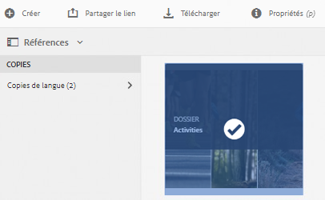

1. Click **[!UICONTROL Create &amp; Translate]** at the bottom.

   

1. Dans la liste **[!UICONTROL Langues cibles]**, choisissez la ou les langues pour lesquelles vous souhaitez créer une structure de dossiers.

   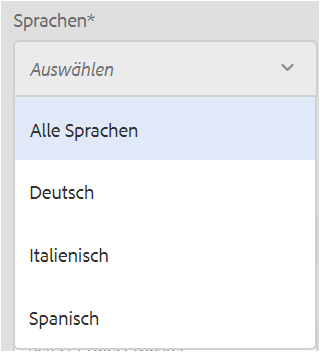

1. Dans la liste **[!UICONTROL Projet]**, choisissez **[!UICONTROL Créer un projet de traduction]**.

   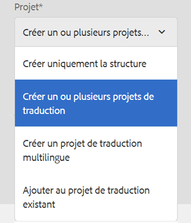

1. Dans le champ **[!UICONTROL Titre du projet]**, saisissez un titre pour le projet.

   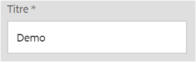

1. Cliquez sur **[!UICONTROL Créer]**. Les ressources du dossier source sont copiées vers les dossiers cibles pour les paramètres régionaux que vous avez sélectionnés à l’étape 4.

   

1. Pour accéder au dossier, sélectionnez la copie de langue, puis cliquez sur **[!UICONTROL Afficher dans Assets]**.

   

1. Accédez à la console Projets. Le dossier de traduction est copié dans la console Projets.

   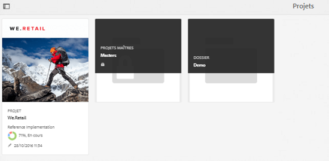

1. Ouvrez le dossier pour afficher le projet de traduction.

   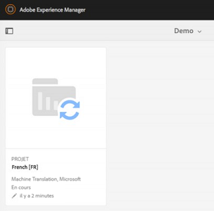

1. Cliquez sur le projet pour ouvrir la page de détails.

   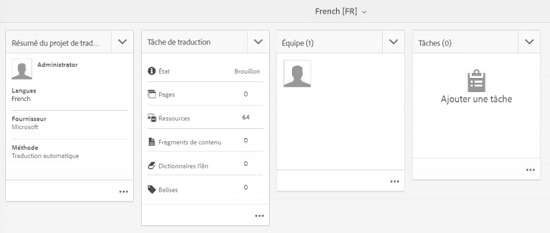

1. Pour afficher l’état de la tâche de traduction, cliquez sur les points de suspension en bas de la mosaïque **[!UICONTROL Tâche de traduction.]**

   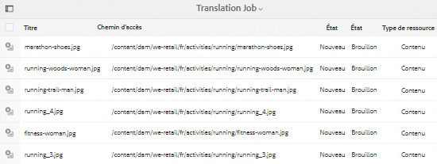

   Pour plus d’informations sur les états des tâches, voir [Surveillance de l’état d’une tâche de traduction](/help/sites-administering/tc-manage.md#monitoring-the-status-of-a-translation-job).

1. Accédez à l’interface utilisateur d’Assets et ouvrez la page Propriétés de chacune des ressources traduites afin d’afficher les métadonnées traduites.

   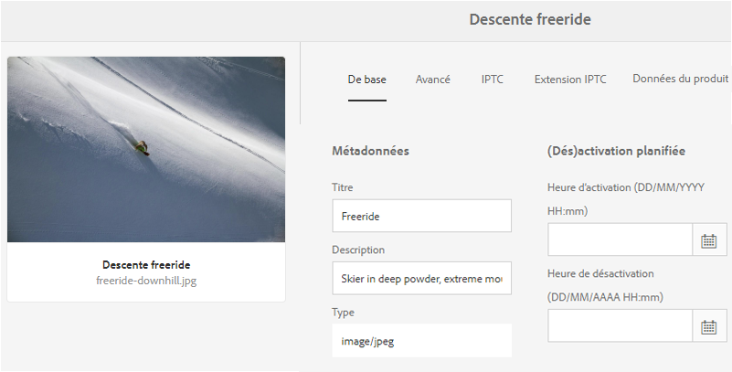

   *Figure : Métadonnées traduites dans la page de propriétés des ressources.*

   >[!NOTE]
   >
   >Cette fonctionnalité est disponible à la fois pour les ressources et les dossiers. Lorsqu’une ressource est sélectionnée au lieu d’un dossier, la hiérarchie de dossiers complète jusqu’à la langue racine est copiée afin de créer une copie de langue pour la ressource.

### Ajouter à un projet de traduction existant {#add-to-existing-translation-project}

Si vous utilisez cette option, le workflow de traduction s’exécute pour les ressources que vous ajoutez au dossier source après l’exécution d’un précédent workflow de traduction. Seules les nouvelles ressources ajoutées sont copiées dans le dossier cible contenant les ressources précédemment traduites. Aucun projet de traduction n’est créé dans ce cas.

1. Dans l’interface utilisateur d’Assets, accédez au dossier source qui contient des ressources non traduites.
1. Sélectionnez une ressource à traduire, puis ouvrez le **[!UICONTROL volet Référence]**. La section **[!UICONTROL Copies de langue]** indique le nombre de copies de traduction actuellement disponibles.
1. Click **[!UICONTROL Language Copies]** under **[!UICONTROL Copies]**. La liste des copies de traduction disponibles s’affiche.
1. Click **[!UICONTROL Create &amp; Translate]** at the bottom.

   

1. Dans la liste **[!UICONTROL Langues cibles]**, choisissez la ou les langues pour lesquelles vous souhaitez créer une structure de dossiers.

   

1. Dans la liste **[!UICONTROL Projet]**, sélectionnez **[!UICONTROL Ajouter à un projet de traduction existant]** afin d’exécuter le workflow de traduction sur le dossier.

   

   >[!NOTE]
   >
   >Si vous sélectionnez l’option **[!UICONTROL Ajouter à un projet de traduction existant]**, votre projet de traduction est ajouté à un projet préexistant uniquement si les paramètres du projet correspondent exactement à ceux du projet préexistant. Dans le cas contraire, un nouveau projet est créé.

1. Dans la liste **[!UICONTROL Projet de traduction existant]**, choisissez un projet auquel ajouter la ressource à traduire.

   

1. Cliquez sur **[!UICONTROL Créer]**. Les fichiers à traduire sont ajoutés au dossier cible. Le dossier mis à jour est répertorié sous la section **[!UICONTROL Copies de langue]**.

   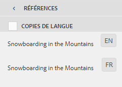

1. Accédez à la console Projets, puis ouvrez le projet de traduction existant auquel vous avez ajouté des ressources.
1. Cliquez sur le projet de traduction pour afficher la page de détails du projet.

   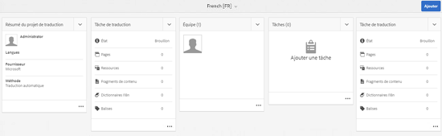

1. Click the ellipsis at the bottom of the **Translation Job** tile to view the assets in the translation workflow. La liste des tâches de traduction contient également des entrées pour les balises et les métadonnées des ressources. Ces entrées indiquent que les métadonnées et les balises des ressources sont également traduites.

   >[!NOTE]
   >
   >Si vous supprimez l’entrée des étiquettes ou des métadonnées, aucune balise ou métadonnée n’est traduite pour l’ensemble des ressources.

   >[!NOTE]
   >
   >Si vous utilisez la traduction automatique, les binaires des ressources ne sont pas traduits.

   >[!NOTE]
   >
   >Si la ressource que vous ajoutez à la tâche de traduction contient des sous-ressources, sélectionnez-les et supprimez-les pour que la traduction se déroule sans problème.

1. Pour commencer la traduction des ressources, cliquez sur la flèche au niveau de la mosaïque **[!UICONTROL Tâche de traduction]** et sélectionnez **[!UICONTROL Démarrer]** dans la liste.

   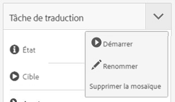

   Un message indique le début de la tâche de traduction.

   

1. Pour afficher l’état de la tâche de traduction, cliquez sur les points de suspension en bas de la mosaïque **[!UICONTROL Tâche de traduction.]**

   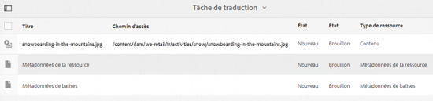

   For more details, see [Monitoring the Status of a Translation Job](/help/sites-administering/tc-manage.md#monitoring-the-status-of-a-translation-job).

1. Une fois la traduction terminée, l’état devient Prêt pour la révision. Accédez à l’interface utilisateur d’Assets et ouvrez la page Propriétés de chacune des ressources traduites afin d’afficher les métadonnées traduites.

## Mise à jour des copies de langue {#update-language-copies}

Exécutez ce processus pour traduire un ensemble de ressources supplémentaire et l’intégrer à une copie de langue pour des paramètres régionaux spécifiques. Dans ce cas, les ressources traduites sont ajoutées au dossier cible qui contient des ressources précédemment traduites. Selon les options choisies, un projet de traduction est créé ou un projet de traduction existant est mis à jour avec les nouvelles ressources. Le workflow Màj des copies de langue comprend les options suivantes :

* Créer un projet de traduction
* Ajouter à un projet de traduction existant

### Créer un projet de traduction {#create-a-new-translation-project-1}

Si vous utilisez cette option, un projet de traduction est créé pour l’ensemble de fichiers pour lesquels vous souhaitez mettre à jour une copie de langue.

1. Dans l’interface utilisateur d’Assets, sélectionnez le dossier source auquel vous avez ajouté une ressource.
1. Open the **[!UICONTROL References]** pane, and click **[!UICONTROL Language Copies]** under **[!UICONTROL Copies]** to display the list of language copies.
1. Cochez la case située avant **[!UICONTROL Copies de langue]**, puis sélectionnez le dossier cible correspondant au paramètre régional approprié.

   

1. Click **[!UICONTROL Update language copies]** at the bottom.

   

1. Dans la liste **[!UICONTROL Projet]**, choisissez **[!UICONTROL Créer un projet de traduction]**.

   

1. Dans le champ **[!UICONTROL Titre du projet]**, saisissez un titre pour le projet.

   

1. Cliquez sur **[!UICONTROL Démarrer]**.
1. Accédez à la console Projets. Le dossier de traduction est copié dans la console Projets.

   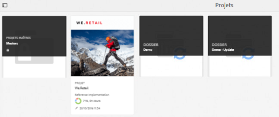

1. Ouvrez le dossier pour afficher le projet de traduction.

   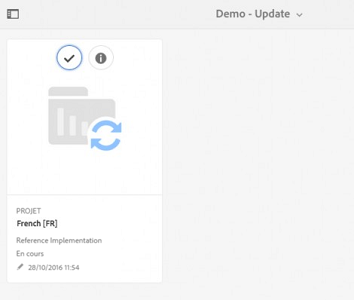

1. Cliquez sur le projet pour ouvrir la page de détails.

   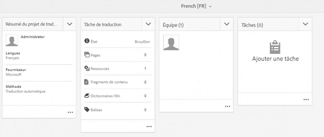

1. Pour commencer la traduction des ressources, cliquez sur la flèche au niveau de la mosaïque **[!UICONTROL Tâche de traduction]** et sélectionnez **[!UICONTROL Démarrer]** dans la liste.

   

   Un message indique le début de la tâche de traduction.

   

1. Pour afficher l’état de la tâche de traduction, cliquez sur les points de suspension en bas de la mosaïque **[!UICONTROL Tâche de traduction.]**

   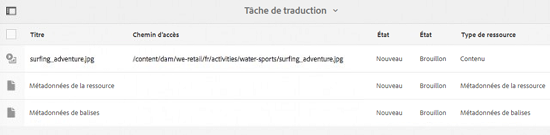

   Pour plus d’informations sur les états des tâches, voir [Surveillance de l’état d’une tâche de traduction](../sites-administering/tc-manage.md#monitoring-the-status-of-a-translation-job).

1. Accédez à l’interface utilisateur d’Assets et ouvrez la page Propriétés de chacune des ressources traduites afin d’afficher les métadonnées traduites.

### Ajouter à un projet de traduction existant {#add-to-existing-translation-project-1}

Si vous utilisez cette option, l’ensemble de ressources est ajouté à un projet de traduction existant afin de mettre à jour la copie de langue pour les paramètres régionaux que vous sélectionnez.

1. Dans l’interface utilisateur d’Assets, sélectionnez le dossier source auquel vous avez ajouté un dossier de ressources.
1. Open the **[!UICONTROL References pane]**, and click **[!UICONTROL Language Copies]** under **[!UICONTROL Copies]** to display the list of language copies.

   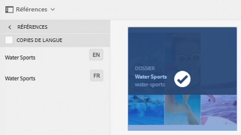

1. Activez la case à cocher devant **[!UICONTROL Copies de langue]** de façon à sélectionner toutes les copies de langue. Désélectionnez les autres copies à l’exception des copies de langue correspondant aux paramètres régionaux dans lesquels vous souhaitez traduire.

   

1. Click **[!UICONTROL Update language copies]** at the bottom.

   

1. Dans la liste **[!UICONTROL Projet]**, choisissez **[!UICONTROL Ajouter à un projet de traduction existant]**.

   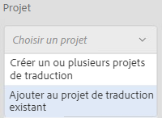

1. Dans la liste **[!UICONTROL Projet de traduction existant]**, choisissez un projet auquel ajouter la ressource à traduire.

   

1. Cliquez sur **[!UICONTROL Démarrer]**.
1. Voir les étapes 9 à 14 de la section [Ajouter à un projet de traduction existant](translation-projects.md#add-to-existing-translation-project) pour accomplir le reste de la procédure.

## Création de copies de langue temporaires {#creating-temporary-language-copies}

Lorsque vous exécutez un workflow de traduction pour mettre à jour une copie de langue avec les versions modifiées des ressources d’origine, la copie de langue existante est conservée jusqu’à ce que vous approuviez la ou les ressources traduites. [!DNL Adobe Experience Manager Assets] stocke les nouvelles ressources traduites dans un emplacement temporaire et met à jour la copie de langue existante après votre approbation explicite des ressources. Si vous rejetez les ressources, la copie de langue reste inchangée.

1. Click the source root folder under **[!UICONTROL Language Copies]** for which you already created a language copy, and then click **[!UICONTROL Reveal in Assets]** to open the folder in [!DNL Experience Manager Assets].

   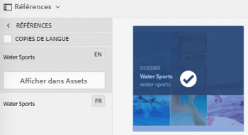

1. From the [!DNL Assets] interface, select an asset you already translated and click the **[!UICONTROL Edit]** icon from the toolbar to open the asset in edit mode.
1. Modifiez la ressource et enregistrez les modifications.
1. Exécutez les étapes 2 à 14 de la procédure [Ajouter à un projet de traduction existant](#add-to-existing-translation-project) pour mettre à jour la copie de langue.
1. Click the ellipsis at the bottom of the **[!UICONTROL Translation Job]** tile. Dans la liste des ressources sur la page **[!UICONTROL Tâche de traduction]**, vous pouvez voir l’emplacement temporaire dans lequel la version traduite de la ressource est stockée.

   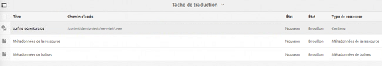

1. Cochez la case en regard de **[!UICONTROL Titre]**.
1. From the toolbar, click **[!UICONTROL Accept Translation]** and then click **[!UICONTROL Accept]** in the dialog to overwrite the translated asset in the target folder with the translated version of the edited asset.

   

   >[!NOTE]
   >
   >Pour permettre au workflow de traduction de mettre à jour la ou les ressources de destination, acceptez à la fois la ressource et les métadonnées.

   Click **[!UICONTROL Reject Translation]** to retain the originally translated version of the asset in the target locale root and reject the edited version.

   

1. Pour vue des métadonnées traduites, accédez à la [!DNL Assets] console et ouvrez la page [!UICONTROL Propriétés] pour chacun des fichiers traduits.

>[!MORELIKETHIS]
>
>* [Conseils pour traduire efficacement les métadonnées](https://blogs.adobe.com/experiencedelivers/experience-management/translate_aemassets_metadata/).

