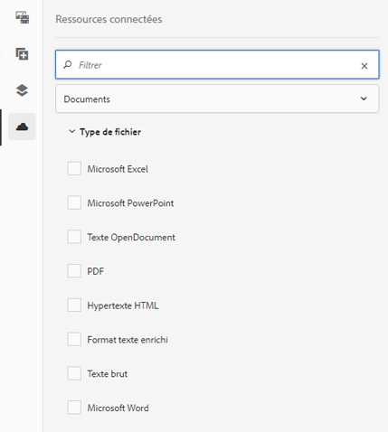

# Utilisation des ressources connectées pour partager des ressources DAM dans [!DNL Experience Manager Sites] {#use-connected-assets-to-share-dam-assets-in-aem-sites}

Dans les grandes entreprises, l’infrastructure requise pour créer des sites web peut être distribuée. Il arrive que les fonctionnalités et les ressources numériques de création de sites web permettant de créer ces sites web se trouvent dans différents déploiements. Il est possible de répartir géographiquement les déploiements existants qui sont requis pour travailler en tandem ou les acquisitions menant à une infrastructure hétérogène que la société parent souhaite utiliser ensemble.

[!DNL Adobe Experience Manager Sites] offre des fonctionnalités pour créer des pages web.  est le système de gestion des actifs numériques (DAM) qui fournit les ressources requises pour les sites web.[!DNL Adobe Experience Manager Assets] [!DNL Experience Manager] prend désormais en charge le cas d’utilisation ci-dessus en intégrant [!DNL Experience Manager Sites] et [!DNL Experience Manager Assets].

## Présentation de la fonction Ressources partagées {#overview-of-connected-assets}

When editing pages in Page Editor, the authors can seamlessly search, browse, and embed assets from a different [!DNL Experience Manager Assets] deployment. To do an [!DNL Experience Manager] administrator do a one-time integration of a local deployment of [!DNL Experience Manager Sites] with a different (remote) deployment of [!DNL Experience Manager Assets].

For the [!DNL Sites] authors, the remote assets are available as read-only local assets. Cette fonctionnalité permet de rechercher et d’utiliser aisément plusieurs ressources distantes à la fois. Envisagez de migrer en vrac de nombreuses ressources distantes pour les rendre disponibles sur le déploiement local en une seule fois. Voir le guide [de migration des ressources](/help/assets/assets-migration-guide.md)Experience Manager.

### Conditions préalables et déploiements pris en charge {#prerequisites}

Avant d’utiliser ou de configurer cette fonctionnalité, vérifiez les points suivants :

* utilisateurs faisant partie de groupes d’utilisateurs appropriés sur chaque déploiement.
* Pour les types de déploiement d’Adobe Experience Manager, l’un des critères pris en charge est satisfait. [!DNL Experience Manager] La version 6.5 [!DNL Assets] fonctionne [!DNL Experience Manager] en tant que service Cloud. Pour plus d’informations, voir la fonctionnalité Ressources [connectées dans Experience Manager en tant que service](https://docs.adobe.com/content/help/en/experience-manager-cloud-service/assets/admin/use-assets-across-connected-assets-instances.html)Cloud.

   |  | [!DNL Experience Manager Sites]as a Cloud Service | Experience Manager 6.5 [!DNL Sites] sur AMS | Experience Manager 6.5 [!DNL Sites] sur site |
   |---|---|---|---|
   | **[!DNL Experience Manager Assets]as a Cloud Service ** | Pris en charge | Pris en charge | Pris en charge |
   | **Experience Manager 6.5[!DNL Assets]sur AMS** | Pris en charge | Pris en charge | Pris en charge |
   | **Experience Manager 6.5[!DNL Assets]sur site** | pas de prise en charge | pas de prise en charge | pas de prise en charge |

### Formats de fichiers pris en charge {#mimetypes}

Les auteurs peuvent rechercher des images et les types de documents suivants dans l’outil de recherche de contenu et utiliser les ressources recherchées dans l’éditeur de page. Documents can be added to the `Download` component and images can be added to the `Image` component. Authors can also add the remote assets in any custom Experience Manager component that extends the default `Download` or `Image` components. La liste des formats pris en charge est la suivante :

* **Formats** d’image : Les formats d’image pris en charge par le composant  Image sont pris en charge par les ressources connectées. [!DNL Dynamic Media] les images ne sont pas prises en charge.
* **Formats** de Document : Voir Formats [de document pris en charge par les ressources](assets-formats.md#supported-document-formats)connectées.

### Utilisateurs et groupes concernés {#users-and-groups-involved}

Les différents rôles impliqués pour configurer et utiliser la fonctionnalité et leurs groupes d’utilisateurs correspondants sont décrits ci-dessous. L’étendue locale est utilisée dans les cas pratiques où une page web a été créée par un auteur. La portée distante est utilisée pour le déploiement DAM hébergeant les ressources requises. The [!DNL Sites] author fetches these remote assets.

| Rôle | Portée | Groupe d’utilisateurs | Nom d’utilisateur dans la présentation | Condition requise |
|---|---|---|---|---|
| [!DNL Sites] administrator | Local | Experience Manager `administrators` | `admin` | Set up Experience Manager, configure integration with the remote [!DNL Assets] deployment. |
| Utilisateur DAM | Local | `Authors` | `ksaner` | Used to view and duplicate the fetched assets at `/content/DAM/connectedassets/`. |
| [!DNL Sites] création | Local | `Authors` (avec accès en lecture sur le DAM distant et accès auteur sur le site local [!DNL Sites]) | `ksaner` | End user are [!DNL Sites] authors who use this integration to improve their content velocity. Les auteurs effectuent des recherches et parcourent des ressources dans la gestion des actifs numériques distants à l’aide de l’outil de recherche de contenu et en utilisant les images requises dans les pages Web locales. The credentials of `ksaner` DAM user are used. |
| [!DNL Assets] administrator | distant | Experience Manager `administrators` | `admin` sur Experience Manager distant | Configurez le partage des ressources cross-origin (CORS). |
| Utilisateur DAM | distant | `Authors` | `ksaner` sur Experience Manager distant | Rôle d’auteur sur le déploiement distant d’Experience Manager. Recherchez et parcourez les ressources dans la fonction Ressources connectées à l’aide de l’outil de recherche de contenu. |
| Distributeur DAM (utilisateur technique) | Distant | `Authors` | `ksaner` sur Experience Manager distant | This user present on the remote deployment is used by Experience Manager local server (not the Site author role) to fetch the remote assets, on behalf of [!DNL Sites] author. Ce rôle n’est pas identique aux deux rôles `ksaner` ci-dessus et appartient à un groupe d’utilisateurs différent.  |

## Configure a connection between [!DNL Sites] and [!DNL Assets] deployments {#configure-a-connection-between-sites-and-assets-deployments}

Un administrateur Experience Manager peut créer cette intégration. Once created, the permissions required to use it are established via user groups that are defined on the [!DNL Sites] deployment and on the DAM deployment.

To configure Connected Assets and local [!DNL Sites] connectivity, follow these steps.

1. Access an existing [!DNL Experience Manager Sites] deployment or create a deployment using the following command:

   1. Dans le dossier du fichier JAR, exécutez la commande suivante sur un terminal pour créer chaque serveur Experience Manager.
      `java -XX:MaxPermSize=768m -Xmx4096m -jar <quickstart jar filepath> -r samplecontent -p 4502 -nofork -gui -nointeractive &`

   1. Après quelques minutes, le serveur Experience Manager se début correctement. Consider this [!DNL Experience Manager Sites] deployment as the local machine for web page authoring, say at `https://[local_sites]:4502`.

1. Ensure that the users and roles with local scope exist on the Experience Manager Sites deployment and on the [!DNL Experience Manager Assets] deployment on AMS. Create a technical user on [!DNL Assets] deployment and add to the user group mentioned in [users and groups involved](/help/assets/use-assets-across-connected-assets-instances.md#users-and-groups-involved).

1. Accédez au [!DNL Experience Manager Sites] déploiement local à `https://[local_sites]:4502`. Cliquez sur **[!UICONTROL Outils]** > **[!UICONTROL Ressources]** > **[!UICONTROL Configuration de ressources connectées]** et fournissez les valeurs suivantes :

   1. [!DNL Experience Manager Assets] l&#39;emplacement est `https://[assets_servername_ams]:[port]`.
   1. Identifiants d’un distributeur DAM (utilisateur technique).
   1. In **[!UICONTROL Mount Point]** field, enter the local Experience Manager path where Experience Manager fetches the assets. For example, `remoteassets` folder.
   1. Adjust the values of **[!UICONTROL Original Binary transfer optimization Threshold]** depending on your network. Un rendu de ressource dont la taille est supérieure à ce seuil est transféré de façon asynchrone. 
   1. Select **[!UICONTROL Datastore Shared with Connected Assets]**, if you use a datastore to store your assets and the Datastore is the common storage between both Experience Manager deployments. Dans ce cas, la limite de seuil n’a aucune importance puisque les fichiers binaires réels résident sur la banque de données et ne sont pas transférés.
      
   *Figure : Configuration standard pour les ressources connectées.*

1. Lorsque les ressources sont déjà traitées et que les rendus sont extraits, désactivez les lanceurs de workflow. Adjust the launcher configurations on the local ([!DNL Experience Manager Sites]) deployment to exclude the `connectedassets` folder, in which the remote assets are fetched.

   1. On [!DNL Experience Manager Sites] deployment, click **[!UICONTROL Tools]** > **[!UICONTROL Workflow]** > **[!UICONTROL Launchers]**.

   1. Recherchez les lanceurs avec les workflows comme **[!UICONTROL ressources de mise à jour de gestion des actifs numériques]** et **[!UICONTROL écriture différée des métadonnées]**.

   1. Sélectionnez le lanceur de worflow puis cliquez sur **[!UICONTROL Propriétés]** dans la barre d’actions.

   1. Dans l’assistant de propriétés, modifiez les champs **[!UICONTROL Chemin]** en fonction des mappages suivants pour mettre à jours leurs expressions régulières afin d’exclure le point de montage **[!UICONTROL connectedassets]**.
   | Avant | Après |
   |---|---|
   | `/content/dam(/((?!/subassets).)*/)renditions/original` | `/content/dam(/((?!/subassets)(?!connectedassets).)*/)renditions/original` |
   | `/content/dam(/*/)renditions/original` | `/content/dam(/((?!connectedassets).)*/)renditions/original` |
   | `/content/dam(/*)/jcr:content/metadata` | `/content/dam(/((?!connectedassets).)*/)jcr:content/metadata` |

   >[!NOTE]
   >
   >Tous les rendus disponibles sur le déploiement distant d’Experience Manager sont récupérés lorsque les auteurs récupèrent un fichier. Si vous souhaitez créer d’autres rendus d’une ressource récupérée, ignorez cette étape de configuration. The [!UICONTROL DAM Update Asset] workflow gets triggered and creates more renditions. These renditions are available only on the local [!DNL Sites] deployment and not on the remote DAM deployment.

1. Add the [!DNL Experience Manager Sites] instance as one of the **[!UICONTROL Allowed Origins]** on the remote [!DNL Experience Manager Assets] CORS configuration.

   1. Connectez-vous à l’aide des identifiants administrateurs. Rechercher `Cross-Origin`. Accédez à **[!UICONTROL Outils]** > **[!UICONTROL Opérations]** > **[!UICONTROL Console Web]**.

   1. To create a CORS configuration for [!DNL Experience Manager Sites] instance, click  icon next to **[!UICONTROL Adobe Granite Cross-Origin Resource Sharing Policy]**.

   1. In the field **[!UICONTROL Allowed Origins]**, input the URL of the local [!DNL Sites], that is, `https://[local_sites]:[port]`. Enregistrez la configuration.

## Utilisation des ressources distants {#use-remote-assets}

Les auteurs de site web utilisent l’outil de recherche de contenu pour se connecter à l’instance DAM. Les auteurs peuvent parcourir, rechercher et faire glisser les ressources distantes dans un composant. Pour vous authentifier sur le système DAM distant, conservez les identifiants de l’utilisateur DAM fournis par votre administrateur.

Les auteurs peuvent utiliser les ressources disponibles à la fois sur les instances DAM locale et distante, dans une page web unique. Utilisez l’outil de recherche de contenu pour basculer entre la recherche sur l’instance DAM locale ou sur l’instance DAM distante.

Seules les balises des ressources distantes sont récupérées qui possèdent une balise correspondante exacte avec la même hiérarchie de taxonomie, disponible sur l’ [!DNL Sites] instance locale. Toutes les autres balises sont ignorées. Les auteurs peuvent rechercher des ressources distantes à l’aide de toutes les balises présentes dans le déploiement distant d’Experience Manager, dans la mesure où Experience Manager offre une recherche de texte intégral.

### Présentation de l’utilisation {#walk-through-of-usage}

Utilisez la configuration ci-dessus pour découvrir l’expérience de création et comprendre les principes de la fonctionnalité. Utilisez les documents ou les images de votre choix sur le déploiement DAM distant.

1. Navigate to the [!DNL Assets] user interface on the remote deployment by accessing **[!UICONTROL Assets]** > **[!UICONTROL Files]** from [!DNL Experience Manager] workspace. Vous pouvez également y accéder `https://[assets_servername_ams]:[port]/assets.html/content/dam` dans un navigateur. Téléchargez les ressources de votre choix.
1. On the [!DNL Sites] instance, in the profile activator in the upper-right corner, click **[!UICONTROL Impersonate as]**. Indiquez `ksaner` comme nom d’utilisateur, sélectionnez l’option fournie, puis cliquez sur **[!UICONTROL OK]**.
1. Ouvrez une page du site web We.Retail via **[!UICONTROL Sites]** > **[!UICONTROL We.Retail]** > **[!UICONTROL fr]** > **[!UICONTROL fr]**. Modifiez la page. Vous pouvez également accéder `https://[aem_server]:[port]/editor.html/content/we-retail/us/en/men.html` à un navigateur pour modifier une page.

   Cliquez sur **[!UICONTROL Activer/désactiver le panneau]** latéral dans le coin supérieur gauche de la page.

1. Open the [!UICONTROL Assets] tab and click **[!UICONTROL Log in to Connected Assets]**.
1. Provide the credentials -- `ksaner` as user name and `password` as password. This user has authoring permissions on both the [!DNL Experience Manager] deployments.
1. Recherchez la ressource que vous avez ajoutée dans DAM. Les ressources distantes s’affichent dans le panneau de gauche. Filtrez les images ou les documents, puis les types de documents pris en charge. Faites glisser les images sur un `Image` composant et les documents sur un `Download` composant.

   The fetched assets are read-only on the local [!DNL Experience Manager Sites] deployment. You can still use the options provided by your [!DNL Experience Manager Sites] components to edit the fetched asset. La modification par composants est non destructive.

   

   *Figure : Options de filtrage des types de document et des images lors de la recherche de ressources sur DAM distant.*

1. Un auteur de site est informé de la récupération asynchrone d&#39;une ressource et de l’échec d’une tâche de récupération. Les auteurs peuvent consulter les informations détaillées sur la récupération des tâches et des erreurs dans l’[interface utilisateur](/help/assets/asynchronous-jobs.md) des tâches asynchrones pendant, voire après la création.

   

   *Figure : Notification concernant la récupération asynchrone des ressources survenant en arrière-plan.*

1. When publishing a page, [!DNL Experience Manager] displays a complete list of assets that are used in the page. Veillez à bien récupérer les fichiers distants au moment de la publication. Pour vérifier l’état de chaque ressource récupérée, reportez-vous à l’interface utilisateur des tâches asynchrones.

   >[!NOTE]
   >
   >Cette page est publiée même en cas de non-récupération d’une ou plusieurs ressources distantes. Le composant utilisant la ressource distante est publié vide. The [!DNL Experience Manager] notification area displays notification for errors that show in async jobs page.

>[!CAUTION]
>
>Une fois utilisées dans n’importe quelle page web, les ressources distantes récupérées sont consultables et exploitables par toute personne disposant des droits d’accès au dossier local où les ressources récupérées sont stockées (`connectedassets` dans la présentation ci-dessus). The assets are also searchable and visible in the local repository via [!UICONTROL Content Finder].

Les ressources récupérées peuvent être utilisées comme n’importe quel autre ressource locale, à la différence que les métadonnées associées ne peuvent pas être modifiées.

## Restrictions {#limitations}

**Autorisations et gestions des ressources**

* Les ressources locales ne sont pas synchronisées avec les ressources d’origine sur le déploiement distant. Tout retrait, modification ou suppression d’autorisation sur le déploiement DAM n’est pas propagé en aval.
* Les ressources locales sont des copies en lecture seule. Les composants d’Experience Manager effectuent des modifications non destructives des ressources. Aucune autre modification n’est autorisée.
* Les ressources récupérées localement sont disponibles à des fins d’écriture uniquement. Les workflows de mise à jour de ressources ne peuvent pas être appliqués et les métadonnées ne peuvent pas être modifiées.
* Seules les images et les formats de document répertoriés sont pris en charge. [!DNL Dynamic Media] les ressources, les fragments de contenu et les fragments d’expérience ne sont pas pris en charge.
* Les schémas de métadonnées ne sont pas récupérés.
* All [!DNL Sites] authors have read permissions on the fetched copies, even if they do not have access to the remote DAM deployment.
* Il n’existe aucune prise en charge API pour personnaliser l’intégration.
* Cette fonctionnalité permet de rechercher et d’utiliser aisément des ressources distantes. Pour rendre de nombreuses ressources distantes disponibles sur le déploiement local en une fois, envisagez de migrer les ressources. Voir le [guide de migration des ressources](assets-migration-guide.md).
* Il n’est pas possible d’utiliser une ressource distante comme miniature de page dans l’interface utilisateur Propriétés [!UICONTROL de] la page. Vous pouvez définir une miniature d’une page Web dans l’interface utilisateur Propriétés [!UICONTROL de la] page à partir de la [!UICONTROL miniature] en cliquant sur [!UICONTROL Sélectionner l’image].

**Configuration et octroi de licences**

* [!DNL Experience Manager Assets] le déploiement sur AMS est pris en charge.
* [!DNL Experience Manager Sites] peut se connecter à un seul [!DNL Experience Manager Assets] référentiel à la fois.
* A license of [!DNL Experience Manager Assets] working as remote repository.
* One or more licenses of [!DNL Experience Manager Sites] working as local authoring deployment.

**Utilisation**

* Seule la fonctionnalité prise en charge permet de rechercher des ressources distantes et de faire glisser les ressources distantes sur la page locale pour créer du contenu.
* L’opération de récupération échoue après 5 secondes. Les auteurs peuvent rencontrer des problèmes lors de la récupération des ressources, par exemple en cas de problèmes de réseau. Authors can re-attempt by dragging the remote asset from [!UICONTROL Content Finder] to [!UICONTROL Page Editor].
* Simple edits that are non-destructive and the edit supported via the [!DNL Experience Manager] `Image` component, can be done on fetched assets. Les ressources sont en lecture seule.

## Résolution des problèmes {#troubleshoot}

Pour résoudre les problèmes liés aux scénarios d’erreur courants, procédez comme suit :

* Si vous ne pouvez pas rechercher des fichiers distants à partir de l’outil de recherche de contenu, vérifiez à nouveau que les rôles et autorisations requis sont bien appliqués.
* Une ressource récupérée sur un DAM distant risque de ne pas être publiée sur une page Web pour les raisons suivantes : il n&#39;existe pas à distance, au même titre que les autorisations appropriées pour la récupérer ; une erreur réseau s’est produite. Assurez-vous que le fichier n&#39;est pas supprimé du DAM distant ou que les autorisations ne sont pas modifiées ; veiller à ce que les conditions préalables appropriées soient remplies ; réessayez d’ajouter le fichier à la page et de republier. Recherchez dans la [liste des tâches asynchrones](/help/assets/asynchronous-jobs.md) les erreurs de récupération de ressources.
